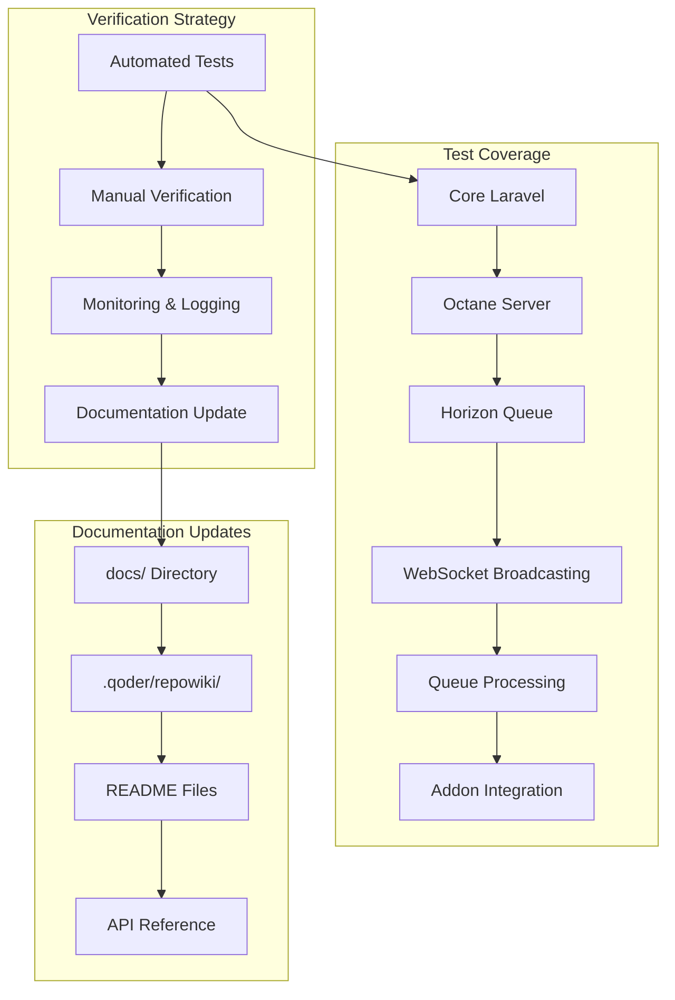

# Laravel 10 Verification & Documentation Update Design

## Architecture Overview

This design outlines a comprehensive verification and testing strategy for the Laravel 10 upgraded platform. The approach uses automated testing, manual verification, monitoring tools, and documentation updates to ensure all components function correctly.



## Component Design

### 1. Core Laravel 10 Verification

**Purpose**: Verify Laravel 10 core functionality

**Verification Method**:
- Automated: PHPUnit tests for core features
- Manual: Browser testing of key user flows
- Monitoring: Application logs for errors

**Test Cases**:
```php
// tests/Feature/Laravel10VerificationTest.php
public function test_laravel_version_is_10()
{
    $this->assertEquals('10', app()->version()[0] . app()->version()[1]);
}

public function test_database_connection_works()
{
    $this->assertDatabaseHas('users', ['id' => 1]);
}

public function test_routes_are_accessible()
{
    $response = $this->get('/');
    $response->assertStatus(200);
}

public function test_authentication_works()
{
    $user = User::factory()->create();
    $response = $this->actingAs($user)->get('/user/dashboard');
    $response->assertStatus(200);
}
```

**Manual Verification Steps**:
1. Access application homepage
2. Login as admin and user
3. Navigate through key pages
4. Perform CRUD operations
5. Check error logs for issues

### 2. Octane Performance Server Verification

**Purpose**: Verify Octane 2.0 is running and performing correctly

**Configuration Check**:
```bash
# Verify Octane configuration
php artisan config:show octane

# Expected output:
# server: swoole
# https: false
# max_execution_time: 30
# garbage: 50
```

**Start Octane**:
```bash
# Start Octane server
php artisan octane:start --server=swoole --host=127.0.0.1 --port=8000 --workers=4

# Start with file watching (development)
php artisan octane:start --watch

# Check Octane status
php artisan octane:status
```

**Performance Testing**:
```bash
# Benchmark with Apache Bench
ab -n 1000 -c 10 http://127.0.0.1:8000/

# Expected: Requests per second > 500 (vs ~100 without Octane)
```

**Memory Leak Detection**:
```bash
# Monitor memory usage over time
watch -n 1 'ps aux | grep octane'

# Memory should not grow unbounded
# Should reset after garbage collection threshold (50MB)
```

**Test Cases**:
```php
// tests/Feature/OctaneVerificationTest.php
public function test_octane_handles_concurrent_requests()
{
    $responses = [];
    for ($i = 0; $i < 100; $i++) {
        $responses[] = $this->get('/api/health');
    }
    
    foreach ($responses as $response) {
        $response->assertStatus(200);
    }
}

public function test_octane_flushes_temporary_instances()
{
    // First request
    $response1 = $this->get('/test-singleton');
    $id1 = $response1->json('instance_id');
    
    // Second request (should have different instance)
    $response2 = $this->get('/test-singleton');
    $id2 = $response2->json('instance_id');
    
    $this->assertNotEquals($id1, $id2);
}
```

### 3. Horizon Queue Monitoring Verification

**Purpose**: Verify Horizon is monitoring queues correctly

**Start Horizon**:
```bash
# Start Horizon
php artisan horizon

# Check Horizon status
php artisan horizon:status

# Terminate Horizon
php artisan horizon:terminate
```

**Access Dashboard**:
- URL: `http://your-domain.com/horizon`
- Authentication: Admin middleware
- Expected: Dashboard loads with metrics

**Test Queue Processing**:
```php
// Dispatch test jobs
dispatch(new TestJob('test-payload'));

// Check Horizon dashboard:
// - Job appears in "Pending Jobs"
// - Job moves to "Completed Jobs"
// - Metrics update in real-time
```

**Test Cases**:
```php
// tests/Feature/HorizonVerificationTest.php
public function test_horizon_dashboard_is_accessible()
{
    $admin = Admin::factory()->create();
    $response = $this->actingAs($admin, 'admin')->get('/horizon');
    $response->assertStatus(200);
}

public function test_horizon_processes_jobs()
{
    Queue::fake();
    
    dispatch(new ProcessChannelMessage($message));
    
    Queue::assertPushed(ProcessChannelMessage::class);
}

public function test_horizon_retries_failed_jobs()
{
    // Create a job that fails
    $job = new FailingTestJob();
    dispatch($job);
    
    // Wait for job to fail and retry
    sleep(2);
    
    // Check failed jobs count
    $this->assertGreaterThan(0, FailedJob::count());
}
```

### 4. WebSocket Broadcasting Verification

**Purpose**: Verify real-time event broadcasting works

**Configuration**:
```php
// config/broadcasting.php
'default' => env('BROADCAST_DRIVER', 'pusher'),

'connections' => [
    'pusher' => [
        'driver' => 'pusher',
        'key' => env('PUSHER_APP_KEY'),
        'secret' => env('PUSHER_APP_SECRET'),
        'app_id' => env('PUSHER_APP_ID'),
        'options' => [
            'cluster' => env('PUSHER_APP_CLUSTER'),
            'host' => env('PUSHER_HOST', '127.0.0.1'),
            'port' => env('PUSHER_PORT', 6001),
            'scheme' => env('PUSHER_SCHEME', 'http'),
        ],
    ],
],
```

**Start WebSocket Server** (if using Laravel WebSockets):
```bash
php artisan websockets:serve
```

**Test Broadcasting**:
```javascript
// resources/js/test-broadcasting.js
import Echo from 'laravel-echo';
import Pusher from 'pusher-js';

window.Pusher = Pusher;

window.Echo = new Echo({
    broadcaster: 'pusher',
    key: process.env.MIX_PUSHER_APP_KEY,
    cluster: process.env.MIX_PUSHER_APP_CLUSTER,
    forceTLS: false,
    wsHost: window.location.hostname,
    wsPort: 6001,
});

// Listen for trade execution
Echo.private(`user.${userId}`)
    .listen('TradeExecuted', (e) => {
        console.log('Trade executed:', e);
    });

// Listen for position updates
Echo.private(`user.${userId}`)
    .listen('PositionUpdated', (e) => {
        console.log('Position updated:', e);
    });
```

**Manual Testing**:
1. Open browser console
2. Execute a trade via admin panel
3. Verify event appears in console within 1 second
4. Check network tab for WebSocket connection
5. Verify channel authorization works

**Test Cases**:
```php
// tests/Feature/BroadcastingVerificationTest.php
public function test_trade_executed_event_broadcasts()
{
    Event::fake();
    
    $trade = Trade::factory()->create();
    event(new TradeExecuted($trade));
    
    Event::assertDispatched(TradeExecuted::class);
}

public function test_position_updated_event_broadcasts()
{
    Event::fake();
    
    $position = ExecutionPosition::factory()->create();
    event(new PositionUpdated($position));
    
    Event::assertDispatched(PositionUpdated::class);
}
```

### 5. Queue Processing Verification

**Purpose**: Verify all background jobs process correctly

**Test Each Job Type**:

```php
// tests/Feature/QueueProcessingVerificationTest.php

public function test_process_channel_message_job()
{
    $message = ChannelMessage::factory()->create([
        'raw_message' => 'BUY EURUSD @ 1.1000 SL 1.0950 TP 1.1100'
    ]);
    
    ProcessChannelMessage::dispatch($message);
    
    // Wait for processing
    sleep(2);
    
    // Verify signal created
    $this->assertDatabaseHas('signals', [
        'auto_created' => 1,
        'channel_source_id' => $message->channel_source_id
    ]);
}

public function test_send_email_job()
{
    Mail::fake();
    
    SendEmailJob::dispatch($user, $mailData);
    
    Mail::assertSent(SignalPublishedMail::class);
}

public function test_execute_signal_job()
{
    $signal = Signal::factory()->create(['is_published' => 1]);
    $connection = ExecutionConnection::factory()->create(['is_active' => 1]);
    
    ExecuteSignalJob::dispatch($signal, $connection);
    
    // Wait for execution
    sleep(2);
    
    // Verify trade executed
    $this->assertDatabaseHas('execution_logs', [
        'signal_id' => $signal->id,
        'execution_connection_id' => $connection->id
    ]);
}

public function test_monitor_positions_job()
{
    $position = ExecutionPosition::factory()->create([
        'status' => 'open',
        'current_price' => 1.1000,
        'take_profit' => 1.1100
    ]);
    
    MonitorPositionsJob::dispatch();
    
    // Simulate price reaching TP
    $position->update(['current_price' => 1.1100]);
    
    MonitorPositionsJob::dispatch();
    
    // Verify position closed
    $this->assertDatabaseHas('execution_positions', [
        'id' => $position->id,
        'status' => 'closed'
    ]);
}
```

**Manual Queue Testing**:
```bash
# Start queue worker
php artisan queue:work --tries=3 --timeout=60

# Dispatch test jobs via tinker
php artisan tinker
>>> dispatch(new ProcessChannelMessage($message));
>>> dispatch(new SendEmailJob($user, $data));

# Monitor queue in Horizon dashboard
# Verify jobs complete successfully
```

### 6. Addon Integration Verification

**Purpose**: Verify all addons work with Laravel 10

**Test Multi-Channel Signal Addon**:
```php
// tests/Feature/MultiChannelAddonVerificationTest.php
public function test_telegram_adapter_receives_messages()
{
    $adapter = new TelegramAdapter($config);
    $messages = $adapter->fetchMessages();
    
    $this->assertIsArray($messages);
}

public function test_ai_message_parser_works()
{
    $parser = new AiMessageParser();
    $result = $parser->parse('BUY EURUSD @ 1.1000 SL 1.0950 TP 1.1100');
    
    $this->assertTrue($result->success);
    $this->assertEquals('EURUSD', $result->data['pair']);
}

public function test_channel_source_status_updates()
{
    $source = ChannelSource::factory()->create(['status' => 'active']);
    
    // Simulate error
    $source->update(['status' => 'error', 'last_error' => 'Connection failed']);
    
    $this->assertEquals('error', $source->fresh()->status);
}
```

**Test Trading Management Addon**:
```php
// tests/Feature/TradingManagementAddonVerificationTest.php
public function test_metaapi_adapter_initializes()
{
    $adapter = new MetaApiAdapter($credentials);
    
    // Should not log "SDK initialized" multiple times
    $this->assertTrue($adapter->isConnected());
}

public function test_adapter_factory_caches_instances()
{
    $factory = app(AdapterFactory::class);
    
    $adapter1 = $factory->create($connection);
    $adapter2 = $factory->create($connection);
    
    // Should return same instance
    $this->assertSame($adapter1, $adapter2);
}

public function test_signal_execution_service_executes_trades()
{
    $service = new SignalExecutionService();
    $result = $service->execute($signal, $connection);
    
    $this->assertTrue($result['success']);
    $this->assertNotNull($result['order_id']);
}
```

**Test AI Connection Addon**:
```php
// tests/Feature/AiConnectionAddonVerificationTest.php
public function test_ai_connection_service_routes_requests()
{
    $service = new AiConnectionService();
    $response = $service->analyze($prompt);
    
    $this->assertNotNull($response);
    $this->assertArrayHasKey('recommendation', $response);
}

public function test_connection_rotation_works()
{
    $service = new AiConnectionService();
    
    // Make multiple requests
    for ($i = 0; $i < 5; $i++) {
        $response = $service->analyze("Test prompt $i");
        $this->assertNotNull($response);
    }
    
    // Verify different connections used
    $this->assertGreaterThan(1, $service->getUsedConnectionsCount());
}
```

### 7. Vonage SMS Integration Verification

**Purpose**: Verify SMS sending works with Vonage client

**Test SMS Sending**:
```php
// tests/Feature/VonageSmsVerificationTest.php
public function test_vonage_client_sends_sms()
{
    $basic = new \Vonage\Client\Credentials\Basic(
        env('NEXMO_KEY'),
        env('NEXMO_SECRET')
    );
    $client = new \Vonage\Client($basic);
    
    $message = new \Vonage\SMS\Message\SMS(
        '+1234567890',
        'TestSender',
        'Test message'
    );
    
    $response = $client->sms()->send($message);
    
    $this->assertEquals('0', $response->current()->getStatus());
}

public function test_signal_service_sends_sms_via_vonage()
{
    $user = User::factory()->create(['phone' => '+1234567890']);
    $signal = Signal::factory()->create();
    
    $service = new SignalService();
    $result = $service->sendSmsNotification($user, $signal);
    
    $this->assertTrue($result['success']);
}
```

**Manual SMS Testing**:
1. Configure Vonage credentials in .env
2. Publish a signal
3. Verify SMS received on test phone number
4. Check logs for SMS delivery confirmation

### 8. Documentation Update Strategy

**Purpose**: Update all documentation to reflect Laravel 10 upgrade

**Documentation Files to Update**:

1. **docs/README.md**:
   - Update Laravel version to 10.x
   - Update Octane version to 2.0
   - Update Horizon version to 5.0
   - Update Sanctum version to 3.2
   - Add Vonage client (remove Nexmo references)

2. **docs/deployment-guide.md**:
   - Add Octane 2.0 installation steps
   - Update Swoole installation instructions
   - Add Horizon 5.0 configuration
   - Update supervisor configuration for Octane

3. **docs/api-reference.md**:
   - Update API endpoint examples
   - Add Laravel 10 specific features
   - Update authentication examples (Sanctum 3.2)

4. **docs/troubleshooting-guide.md**:
   - Add Laravel 10 specific issues
   - Add Octane troubleshooting section
   - Add Horizon troubleshooting section
   - Add WebSocket troubleshooting

5. **.qoder/repowiki/en/content/**:
   - Update Architecture Overview
   - Update Core Architecture
   - Update Configuration guides
   - Update API Reference
   - Update Real-time Communication

**Documentation Update Script**:
```bash
#!/bin/bash
# scripts/update-docs-laravel-10.sh

# Update version references
find docs/ -type f -name "*.md" -exec sed -i 's/Laravel 9/Laravel 10/g' {} \;
find docs/ -type f -name "*.md" -exec sed -i 's/Octane 1.x/Octane 2.0/g' {} \;
find docs/ -type f -name "*.md" -exec sed -i 's/Nexmo/Vonage/g' {} \;

# Update composer.json references in docs
find docs/ -type f -name "*.md" -exec sed -i 's/nexmo\/client/vonage\/client/g' {} \;

# Update .qoder/repowiki
find .qoder/repowiki/ -type f -name "*.md" -exec sed -i 's/Laravel 9/Laravel 10/g' {} \;

echo "Documentation updated for Laravel 10"
```

## Testing Strategy

### Automated Testing
```bash
# Run all tests
php artisan test

# Run specific test suites
php artisan test --testsuite=Feature
php artisan test --filter=Laravel10Verification
php artisan test --filter=OctaneVerification
php artisan test --filter=HorizonVerification
```

### Manual Testing Checklist
- [ ] Access homepage (/)
- [ ] Login as admin (/admin/login)
- [ ] Login as user (/login)
- [ ] Access Horizon dashboard (/horizon)
- [ ] Create a signal
- [ ] Publish a signal
- [ ] Execute a trade
- [ ] Monitor position updates
- [ ] Test WebSocket connection
- [ ] Send SMS notification
- [ ] Process channel message
- [ ] Run backtest
- [ ] Test AI analysis

### Performance Testing
```bash
# Benchmark API endpoints
ab -n 1000 -c 10 http://your-domain.com/api/signals

# Monitor memory usage
watch -n 1 'free -m'

# Monitor queue processing
watch -n 1 'php artisan queue:work --once'
```

### Load Testing
```bash
# Use Apache Bench for load testing
ab -n 10000 -c 100 http://your-domain.com/

# Use wrk for advanced load testing
wrk -t12 -c400 -d30s http://your-domain.com/
```

## Monitoring & Logging

### Application Logs
```bash
# Monitor Laravel logs
tail -f storage/logs/laravel-$(date +%Y-%m-%d).log

# Monitor Octane logs
tail -f storage/logs/octane.log

# Monitor Horizon logs
tail -f storage/logs/horizon.log
```

### Performance Monitoring
```php
// Add performance logging
Log::info('Request processed', [
    'duration' => microtime(true) - LARAVEL_START,
    'memory' => memory_get_peak_usage(true),
    'queries' => DB::getQueryLog(),
]);
```

### Error Tracking
- Use Laravel's exception handler
- Log errors to storage/logs/
- Send critical errors to admin via email/Telegram
- Monitor error rates in Horizon dashboard

## Rollback Plan

If critical issues are discovered:

1. **Stop Octane**: `php artisan octane:stop`
2. **Stop Horizon**: `php artisan horizon:terminate`
3. **Revert to Laravel 9**:
   ```bash
   git checkout <previous-commit>
   composer install
   php artisan migrate:rollback
   ```
4. **Restart services**:
   ```bash
   php artisan queue:work
   php artisan serve
   ```

## Success Criteria

- [ ] All automated tests pass (100%)
- [ ] Manual testing checklist complete
- [ ] Octane running with 4+ workers
- [ ] Horizon processing jobs in real-time
- [ ] WebSocket events delivered < 1s latency
- [ ] Queue jobs complete successfully
- [ ] All addons functional
- [ ] SMS notifications sent via Vonage
- [ ] Documentation updated and accurate
- [ ] No critical errors in logs
- [ ] Performance improved (response time < 200ms)

## Change History

- 2025-12-14: Initial design created post-Laravel 10 upgrade

