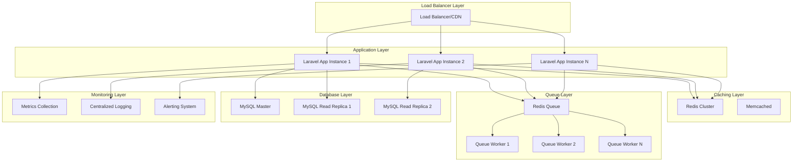
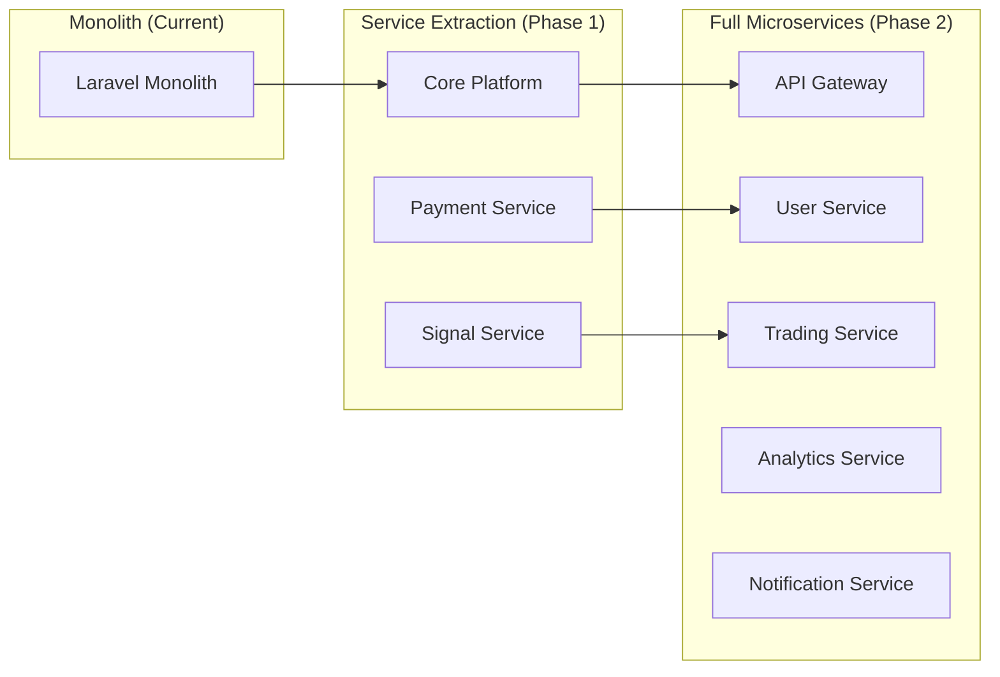

# Platform Optimization & Improvements Design Document

## Overview

This design document outlines comprehensive improvements to the AlgoExpertHub trading signal platform to address performance bottlenecks, enhance user experience, improve code quality, and add advanced business intelligence capabilities. The improvements are designed to transform the platform from its current state into a high-performance, scalable, and maintainable system that can handle enterprise-level traffic while providing exceptional user experience.

The design focuses on modernizing the existing Laravel 9 architecture while maintaining backward compatibility and leveraging the existing addon system. Key improvements include performance optimization through caching and queue systems, code quality enhancements following modern Laravel patterns, advanced analytics and monitoring, enhanced security measures, and comprehensive testing frameworks.

## Architecture

### Current Architecture Analysis

The platform currently uses:
- Laravel 9.x with PHP 8.0+
- MySQL database with basic indexing
- File-based caching and sessions
- Database queue driver
- Addon-based modular architecture
- Service layer pattern (partially implemented)
- Multiple frontend themes

### Proposed Architecture Improvements

#### 1. Performance Layer Enhancement



#### 2. Microservices Transition Strategy



## Components and Interfaces

### 1. Performance Optimization Components

#### CacheManager
```php
interface CacheManagerInterface
{
    public function remember(string $key, int $ttl, callable $callback): mixed;
    public function tags(array $tags): self;
    public function invalidateByTags(array $tags): bool;
    public function getHitRate(): float;
}
```

#### QueueOptimizer
```php
interface QueueOptimizerInterface
{
    public function dispatchBatch(array $jobs): string;
    public function monitorHealth(): array;
    public function scaleWorkers(int $targetCount): bool;
    public function getMetrics(): array;
}
```

### 2. Analytics and Business Intelligence

#### AnalyticsEngine
```php
interface AnalyticsEngineInterface
{
    public function trackEvent(string $event, array $data): void;
    public function generateReport(string $type, array $filters): Report;
    public function getRealTimeMetrics(): array;
    public function createDashboard(array $widgets): Dashboard;
}
```

#### MetricsCollector
```php
interface MetricsCollectorInterface
{
    public function increment(string $metric, array $tags = []): void;
    public function gauge(string $metric, float $value, array $tags = []): void;
    public function histogram(string $metric, float $value, array $tags = []): void;
    public function getMetrics(string $metric, array $filters = []): array;
}
```

### 3. Security Enhancement Components

#### SecurityManager
```php
interface SecurityManagerInterface
{
    public function encryptSensitiveData(array $data): array;
    public function validateApiRequest(Request $request): bool;
    public function detectSuspiciousActivity(User $user): bool;
    public function generateAuditLog(string $action, array $context): void;
}
```

#### RateLimiter
```php
interface RateLimiterInterface
{
    public function attempt(string $key, int $maxAttempts, int $decayMinutes): bool;
    public function remaining(string $key): int;
    public function reset(string $key): void;
    public function getUsageMetrics(string $key): array;
}
```

### 4. Testing Framework Components

#### TestSuiteManager
```php
interface TestSuiteManagerInterface
{
    public function runUnitTests(): TestResult;
    public function runIntegrationTests(): TestResult;
    public function runPerformanceTests(): TestResult;
    public function generateCoverageReport(): CoverageReport;
}
```

## Data Models

### Enhanced Existing Models

#### Signal Model Enhancements
```php
class Signal extends Model
{
    // Add performance tracking
    protected $casts = [
        'performance_metrics' => 'array',
        'risk_metrics' => 'array',
        'execution_stats' => 'array'
    ];
    
    // Add analytics relationships
    public function analytics()
    {
        return $this->hasMany(SignalAnalytic::class);
    }
    
    public function performanceMetrics()
    {
        return $this->hasOne(SignalPerformance::class);
    }
}
```

#### User Model Enhancements
```php
class User extends Authenticatable
{
    // Add behavior tracking
    protected $casts = [
        'behavior_metrics' => 'array',
        'preferences' => 'array',
        'risk_profile' => 'array'
    ];
    
    // Add analytics relationships
    public function behaviorAnalytics()
    {
        return $this->hasMany(UserBehaviorAnalytic::class);
    }
    
    public function engagementMetrics()
    {
        return $this->hasOne(UserEngagement::class);
    }
}
```

### New Analytics Models

#### SignalAnalytic
```php
class SignalAnalytic extends Model
{
    protected $fillable = [
        'signal_id',
        'metric_type',
        'metric_value',
        'calculated_at',
        'period_start',
        'period_end'
    ];
    
    protected $casts = [
        'metric_value' => 'array',
        'calculated_at' => 'datetime',
        'period_start' => 'datetime',
        'period_end' => 'datetime'
    ];
}
```

#### UserBehaviorAnalytic
```php
class UserBehaviorAnalytic extends Model
{
    protected $fillable = [
        'user_id',
        'session_id',
        'event_type',
        'event_data',
        'timestamp',
        'ip_address',
        'user_agent'
    ];
    
    protected $casts = [
        'event_data' => 'array',
        'timestamp' => 'datetime'
    ];
}
```

#### SystemMetric
```php
class SystemMetric extends Model
{
    protected $fillable = [
        'metric_name',
        'metric_value',
        'metric_type',
        'tags',
        'timestamp'
    ];
    
    protected $casts = [
        'metric_value' => 'float',
        'tags' => 'array',
        'timestamp' => 'datetime'
    ];
}
```

## Correctness Properties

*A property is a characteristic or behavior that should hold true across all valid executions of a system-essentially, a formal statement about what the system should do. Properties serve as the bridge between human-readable specifications and machine-verifiable correctness guarantees.*

### Performance Properties

**Property 1: Response Time Consistency**
*For any* critical operation under concurrent load, response times should remain under 200ms for 95% of requests
**Validates: Requirements 1.1**

**Property 2: Signal Distribution Efficiency**
*For any* signal distribution to large subscriber bases, completion time should scale linearly with subscriber count and complete within acceptable thresholds
**Validates: Requirements 1.2**

**Property 3: Query Optimization**
*For any* database operation, N+1 queries should be eliminated through proper eager loading and relationship optimization
**Validates: Requirements 1.3**

**Property 4: Cache Effectiveness**
*For any* frequently accessed data, cache hit rates should exceed 80% during normal operation
**Validates: Requirements 1.4**

**Property 5: Job Processing Reliability**
*For any* background job failure, retry mechanisms should activate with exponential backoff and eventual dead letter queue handling
**Validates: Requirements 1.5**

### Code Quality Properties

**Property 6: Service Layer Consistency**
*For any* business logic implementation, operations should be encapsulated in dedicated service classes following single responsibility principle
**Validates: Requirements 2.1**

**Property 7: Validation Standardization**
*For any* data input endpoint, validation should be handled through Form Request classes with comprehensive rules
**Validates: Requirements 2.2**

**Property 8: Database Abstraction**
*For any* database operation, Eloquent ORM should be used with proper relationships instead of raw SQL queries
**Validates: Requirements 2.3**

**Property 9: API Convention Compliance**
*For any* API endpoint, RESTful conventions should be followed with appropriate HTTP status codes and response formats
**Validates: Requirements 2.4**

**Property 10: Code Standard Adherence**
*For any* code written, PSR-12 coding standards should be maintained through automated linting and enforcement
**Validates: Requirements 2.5**

### User Experience Properties

**Property 11: User Action Feedback**
*For any* user-initiated action, immediate feedback should be provided through loading states and success/error messages
**Validates: Requirements 3.3**

**Property 12: Data Pagination Efficiency**
*For any* data-heavy page, pagination and lazy loading should be implemented to maintain optimal performance
**Validates: Requirements 3.4**

**Property 13: Form Validation Responsiveness**
*For any* form interaction, real-time validation should provide clear error messaging without page refresh
**Validates: Requirements 3.5**

### Analytics Properties

**Property 14: Metrics Collection Completeness**
*For any* user behavior or system event, relevant metrics should be tracked and stored for analysis
**Validates: Requirements 4.1**

**Property 15: Performance Calculation Accuracy**
*For any* trading performance calculation, profit/loss tracking should be accurate with proper risk-adjusted metrics
**Validates: Requirements 4.4**

**Property 16: Export Format Support**
*For any* data export request, multiple formats (CSV, PDF, Excel) should be supported with consistent data integrity
**Validates: Requirements 4.5**

### Security Properties

**Property 17: Data Encryption Consistency**
*For any* sensitive data handling, encryption should be applied at rest and in transit with proper key management
**Validates: Requirements 5.1**

**Property 18: Authentication Security**
*For any* user authentication, multi-factor authentication and session management should be properly implemented
**Validates: Requirements 5.2**

**Property 19: API Security Enforcement**
*For any* API request, rate limiting, validation, and authentication should be consistently applied
**Validates: Requirements 5.3**

**Property 20: Audit Trail Completeness**
*For any* critical action, audit logs should be created with proper user attribution and timestamp tracking
**Validates: Requirements 5.4**

**Property 21: Compliance Data Handling**
*For any* personal data processing, GDPR-compliant handling should be implemented with user consent management
**Validates: Requirements 5.5**

### Trading System Properties

**Property 22: Risk Control Activation**
*For any* automated trade execution, circuit breakers and position size limits should prevent excessive losses
**Validates: Requirements 6.1**

**Property 23: Dynamic Risk Adaptation**
*For any* market condition change, position sizing and risk parameters should adapt dynamically based on volatility
**Validates: Requirements 6.2**

**Property 24: Connection Failover**
*For any* connection issue, failover mechanisms should activate with health monitoring and automatic recovery
**Validates: Requirements 6.3**

**Property 25: Trade Error Handling**
*For any* trade failure, detailed error logging and automatic retry mechanisms should be implemented with exponential backoff
**Validates: Requirements 6.4**

**Property 26: Risk Limit Enforcement**
*For any* risk limit breach, trading should halt immediately with administrator notifications
**Validates: Requirements 6.5**

### Integration Properties

**Property 27: API Documentation Completeness**
*For any* API endpoint, comprehensive documentation should be available with authentication and usage examples
**Validates: Requirements 7.1**

**Property 28: Real-time Data Delivery**
*For any* WebSocket connection, real-time data should be delivered reliably with connection health monitoring
**Validates: Requirements 7.2**

**Property 29: Webhook Reliability**
*For any* webhook configuration, events should be delivered reliably with retry mechanisms and signature verification
**Validates: Requirements 7.3**

**Property 30: API Versioning Compatibility**
*For any* API version change, backward compatibility should be maintained with clear deprecation policies
**Validates: Requirements 7.4**

**Property 31: Rate Limit Transparency**
*For any* API rate limiting, clear limits and usage metrics should be provided to consumers
**Validates: Requirements 7.5**

### Testing Properties

**Property 32: Test Coverage Adequacy**
*For any* code commit, automated test suites should achieve minimum 80% code coverage
**Validates: Requirements 8.1**

**Property 33: Unit Test Completeness**
*For any* service method implementation, unit tests should cover all methods and edge cases
**Validates: Requirements 8.2**

**Property 34: Integration Test Coverage**
*For any* API endpoint, integration tests should verify request/response contracts
**Validates: Requirements 8.3**

**Property 35: End-to-End Test Coverage**
*For any* user workflow, end-to-end tests should cover complete user journeys
**Validates: Requirements 8.4**

**Property 36: Performance Regression Detection**
*For any* performance-critical operation, automated performance testing should detect regressions
**Validates: Requirements 8.5**

### Monitoring Properties

**Property 37: System Metrics Monitoring**
*For any* system operation, response times, error rates, and resource utilization should be monitored with alerting
**Validates: Requirements 9.1**

**Property 38: Error Tracking Detail**
*For any* error occurrence, detailed tracking should provide stack traces and user context
**Validates: Requirements 9.2**

**Property 39: Distributed Tracing**
*For any* performance issue, distributed tracing should enable bottleneck identification across services
**Validates: Requirements 9.3**

**Property 40: Historical Metrics Analysis**
*For any* capacity planning need, historical metrics and trend analysis should be available
**Validates: Requirements 9.4**

**Property 41: Centralized Logging**
*For any* debugging requirement, centralized logging with search capabilities should enable rapid issue resolution
**Validates: Requirements 9.5**

### Business Process Properties

**Property 42: Subscription Automation**
*For any* subscription renewal, automated processing should handle payments and access extension with notifications
**Validates: Requirements 10.1**

**Property 43: Signal Quality Monitoring**
*For any* signal performance degradation, automated flagging and administrator notifications should occur
**Validates: Requirements 10.2**

**Property 44: User Onboarding Automation**
*For any* new user registration, automated onboarding should guide setup with email sequences and progress tracking
**Validates: Requirements 10.3**

**Property 45: Compliance Reporting Automation**
*For any* compliance requirement, automated report generation and submission should occur with audit trails
**Validates: Requirements 10.4**

**Property 46: Maintenance Task Automation**
*For any* system maintenance need, automated scheduling and execution should minimize user impact
**Validates: Requirements 10.5**

## Error Handling

### Centralized Error Management

#### Error Classification System
```php
enum ErrorSeverity: string
{
    case CRITICAL = 'critical';
    case HIGH = 'high';
    case MEDIUM = 'medium';
    case LOW = 'low';
}

enum ErrorCategory: string
{
    case PERFORMANCE = 'performance';
    case SECURITY = 'security';
    case BUSINESS_LOGIC = 'business_logic';
    case INTEGRATION = 'integration';
    case USER_INPUT = 'user_input';
}
```

#### Error Handler Service
```php
class ErrorHandlerService
{
    public function handle(Throwable $exception, ErrorContext $context): ErrorResponse
    {
        $severity = $this->determineSeverity($exception);
        $category = $this->categorizeError($exception);
        
        $this->logError($exception, $severity, $category, $context);
        $this->notifyIfCritical($exception, $severity);
        $this->trackMetrics($exception, $category);
        
        return $this->generateResponse($exception, $context);
    }
}
```

### Circuit Breaker Pattern

#### Trading Circuit Breaker
```php
class TradingCircuitBreaker
{
    public function execute(callable $operation, string $service): mixed
    {
        if ($this->isOpen($service)) {
            throw new CircuitBreakerOpenException("Service $service is unavailable");
        }
        
        try {
            $result = $operation();
            $this->recordSuccess($service);
            return $result;
        } catch (Throwable $e) {
            $this->recordFailure($service);
            throw $e;
        }
    }
}
```

### Graceful Degradation

#### Feature Flag System
```php
class FeatureFlagService
{
    public function isEnabled(string $feature, User $user = null): bool
    {
        $flag = $this->getFlag($feature);
        
        if (!$flag->isActive()) {
            return false;
        }
        
        return $this->evaluateConditions($flag, $user);
    }
}
```

## Testing Strategy

### Dual Testing Approach

The testing strategy implements both unit testing and property-based testing approaches as complementary methodologies:

- **Unit tests** verify specific examples, edge cases, and error conditions
- **Property tests** verify universal properties that should hold across all inputs
- Together they provide comprehensive coverage: unit tests catch concrete bugs, property tests verify general correctness

### Unit Testing Requirements

Unit tests will cover:
- Service method functionality with mocked dependencies
- Controller HTTP request/response handling
- Model relationships and business logic
- Integration points between components
- Specific error scenarios and edge cases

### Property-Based Testing Requirements

Property-based testing will use **PHPUnit with Eris** (PHP property testing library) as specified for the target language. Each property-based test will:
- Run a minimum of 100 iterations as configured
- Be tagged with comments explicitly referencing the correctness property from this design document
- Use the exact format: **Feature: platform-optimization-improvements, Property {number}: {property_text}**
- Each correctness property will be implemented by a SINGLE property-based test

### Testing Framework Configuration

#### PHPUnit Configuration
```xml
<phpunit>
    <testsuites>
        <testsuite name="Unit">
            <directory suffix="Test.php">./tests/Unit</directory>
        </testsuite>
        <testsuite name="Feature">
            <directory suffix="Test.php">./tests/Feature</directory>
        </testsuite>
        <testsuite name="Property">
            <directory suffix="Test.php">./tests/Property</directory>
        </testsuite>
    </testsuites>
</phpunit>
```

#### Property Test Example
```php
/**
 * Feature: platform-optimization-improvements, Property 1: Response Time Consistency
 * For any critical operation under concurrent load, response times should remain under 200ms for 95% of requests
 */
public function testResponseTimeConsistency()
{
    $this->forAll(
        Generator\choose(100, 1000), // concurrent users
        Generator\elements(['signals', 'dashboard', 'payments']) // critical operations
    )->then(function ($concurrentUsers, $operation) {
        $responseTimes = $this->simulateConcurrentRequests($operation, $concurrentUsers);
        $percentile95 = $this->calculatePercentile($responseTimes, 95);
        
        $this->assertLessThan(200, $percentile95, 
            "95th percentile response time should be under 200ms for $operation with $concurrentUsers users");
    });
}
```

### Performance Testing

#### Load Testing Strategy
```php
class LoadTestSuite
{
    public function testConcurrentUserLoad()
    {
        // Simulate 1000+ concurrent users
        $this->loadTest()
            ->withUsers(1000)
            ->duration(300) // 5 minutes
            ->assertResponseTime(200) // 200ms threshold
            ->assertErrorRate(0.01); // 1% error rate
    }
}
```

#### Database Performance Testing
```php
class DatabasePerformanceTest
{
    public function testQueryOptimization()
    {
        DB::enableQueryLog();
        
        // Execute operation
        $this->signalService->getSignalsForUser($user);
        
        $queries = DB::getQueryLog();
        
        // Assert no N+1 queries
        $this->assertLessThan(5, count($queries));
        
        // Assert query execution time
        foreach ($queries as $query) {
            $this->assertLessThan(100, $query['time']);
        }
    }
}
```

### Integration Testing

#### API Integration Tests
```php
class ApiIntegrationTest extends TestCase
{
    public function testSignalCreationWorkflow()
    {
        // Test complete signal creation workflow
        $response = $this->postJson('/api/signals', $signalData);
        
        $response->assertStatus(201)
                ->assertJsonStructure(['id', 'title', 'created_at']);
        
        // Verify signal was created in database
        $this->assertDatabaseHas('signals', ['title' => $signalData['title']]);
        
        // Verify signal distribution was queued
        Queue::assertPushed(DistributeSignalJob::class);
    }
}
```

### End-to-End Testing

#### User Journey Tests
```php
class UserJourneyTest extends DuskTestCase
{
    public function testCompleteSubscriptionFlow()
    {
        $this->browse(function (Browser $browser) {
            $browser->visit('/register')
                   ->type('email', 'test@example.com')
                   ->type('password', 'password')
                   ->press('Register')
                   ->assertPathIs('/dashboard')
                   ->clickLink('Plans')
                   ->press('Subscribe to Premium')
                   ->assertPathIs('/payment')
                   ->select('gateway', 'stripe')
                   ->press('Pay Now')
                   ->assertSee('Payment Successful');
        });
    }
}
```

### Automated Testing Pipeline

#### CI/CD Integration
```yaml
# .github/workflows/tests.yml
name: Test Suite
on: [push, pull_request]
jobs:
  test:
    runs-on: ubuntu-latest
    steps:
      - uses: actions/checkout@v2
      - name: Setup PHP
        uses: shivammathur/setup-php@v2
        with:
          php-version: 8.1
      - name: Install Dependencies
        run: composer install
      - name: Run Unit Tests
        run: php artisan test --testsuite=Unit
      - name: Run Property Tests
        run: php artisan test --testsuite=Property
      - name: Run Integration Tests
        run: php artisan test --testsuite=Feature
      - name: Generate Coverage Report
        run: php artisan test --coverage-clover coverage.xml
```

This comprehensive testing strategy ensures that all improvements are thoroughly validated through multiple testing approaches, providing confidence in the system's reliability and correctness.