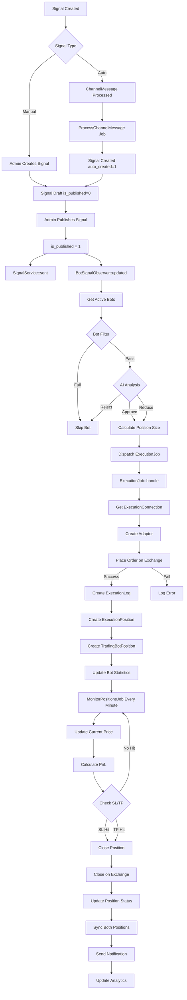
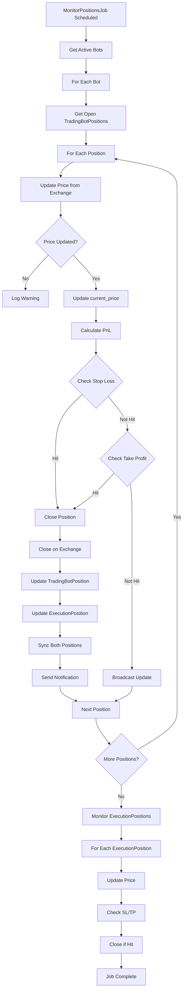
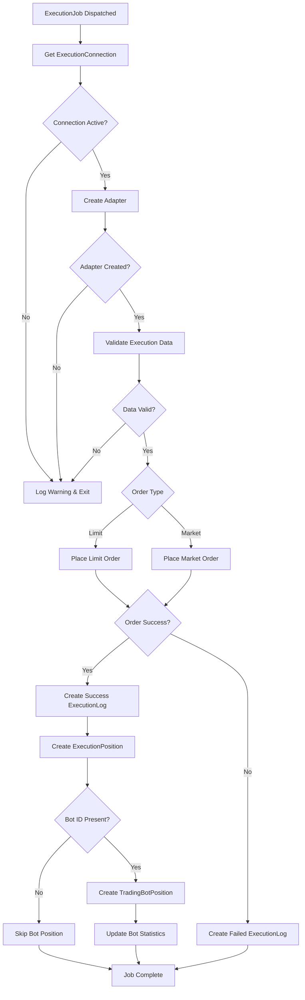

# Trading Flow Implementation Check - Design

## Architecture Overview

The trading flow is implemented as an event-driven, queue-based system that automatically executes trading signals on connected exchanges. The architecture follows Laravel's service layer pattern with clear separation of concerns:

- **Observers**: Detect model events (signal publication)
- **Jobs**: Handle async execution (trade execution, position monitoring)
- **Services**: Contain business logic (bot filtering, position management)
- **Adapters**: Abstract exchange interfaces (CCXT, MT4/MT5, MetaAPI)
- **Models**: Represent data entities (Signal, ExecutionPosition, TradingBotPosition)

The system is modular, with components in the `trading-management-addon` addon, following the platform's addon architecture.

---

## Component Design

### Component 1: BotSignalObserver

**Location**: `main/addons/trading-management-addon/Modules/TradingBot/Observers/BotSignalObserver.php`

**Purpose**: Detects when signals are published and triggers bot execution flow

**Responsibilities**:
- Listen to Signal model `updated()` events
- Detect when `is_published` changes from 0 to 1
- Get active bots for the signal via `BotExecutionService`
- Evaluate bot filter strategies
- Perform AI analysis (if configured)
- Dispatch `ExecutionJob` for each eligible bot

**Key Methods**:
- `updated(Signal $signal)`: Entry point for observer
- `handleSignalPublished(Signal $signal)`: Main handler for published signals
- `calculatePositionSize($preset, Signal $signal)`: Calculate position size from trading preset

**Integration Points**:
- **Input**: Signal model events
- **Output**: ExecutionJob dispatches
- **Dependencies**: BotExecutionService, ExecutionJob

**Error Handling**:
- Catches exceptions and logs errors
- Continues processing other bots if one fails
- Does not block signal publication

---

### Component 2: BotExecutionService

**Location**: `main/addons/trading-management-addon/Modules/TradingBot/Services/BotExecutionService.php`

**Purpose**: Manages bot execution logic including filtering and AI analysis

**Responsibilities**:
- Get active bots for a signal
- Filter bots by status, connection, symbol/timeframe
- Evaluate filter strategies (technical indicators)
- Integrate with AI analysis service
- Determine if bot should execute signal

**Key Methods**:
- `getActiveBotsForSignal(Signal $signal)`: Get eligible bots
- `evaluateBotFilter(Signal $signal, TradingBot $bot)`: Evaluate filter strategy
- `shouldExecuteSignal(Signal $signal, TradingBot $bot)`: Final decision

**Integration Points**:
- **Input**: Signal, TradingBot
- **Output**: Filter results, AI decisions
- **Dependencies**: AI services (optional), filter strategy evaluators

---

### Component 3: ExecutionJob

**Location**: `main/addons/trading-management-addon/Modules/Execution/Jobs/ExecutionJob.php`

**Purpose**: Executes trades on exchanges asynchronously

**Responsibilities**:
- Get ExecutionConnection from connection_id
- Create appropriate adapter (CCXT, MT4/MT5, MetaAPI)
- Validate execution data
- Place order on exchange (market or limit)
- Create ExecutionLog record
- Create ExecutionPosition record
- Create TradingBotPosition record (if bot_id present)
- Update bot statistics

**Key Methods**:
- `handle()`: Main job handler
- `executeTrade($adapter, ExecutionConnection $connection)`: Execute trade on exchange
- `createPosition(ExecutionConnection $connection, array $result)`: Create position records
- `createTradingBotPosition(ExecutionPosition $executionPosition)`: Create bot position
- `createAdapter(ExecutionConnection $connection)`: Create exchange adapter

**Integration Points**:
- **Input**: Execution data array (connection_id, bot_id, signal_id, symbol, direction, quantity, prices)
- **Output**: Position records, execution logs
- **Dependencies**: AdapterFactory, ExecutionConnection, ExecutionPosition, TradingBotPosition models

**Error Handling**:
- Validates connection before execution
- Catches exceptions and logs errors
- Creates execution log even on failure
- Does not create position if order fails

**Queue Configuration**:
- `$tries = 3`: Retry up to 3 times
- `$timeout = 120`: 2 minute timeout

---

### Component 4: MonitorPositionsJob

**Location**: `main/addons/trading-management-addon/Modules/PositionMonitoring/Jobs/MonitorPositionsJob.php`

**Purpose**: Monitors all open positions, updates prices, and checks SL/TP

**Responsibilities**:
- Get all active trading bots
- Get all open ExecutionPositions
- Update current price for each position
- Calculate and update PnL
- Check stop loss conditions
- Check take profit conditions
- Close positions when SL/TP hit
- Broadcast updates via WebSocket

**Key Methods**:
- `handle(PositionMonitoringService $positionService)`: Main job handler
- `monitorExecutionPositions()`: Monitor signal-based positions
- `updatePositionPrice(ExecutionPosition $position)`: Update price from exchange
- `closePosition(ExecutionPosition $position, string $reason)`: Close position
- `getAdapter($executionConnection)`: Get adapter for connection

**Integration Points**:
- **Input**: PositionMonitoringService (for bot positions)
- **Output**: Position updates, closures
- **Dependencies**: PositionMonitoringService, ExecutionPosition, TradingBotPosition, AdapterFactory

**Error Handling**:
- Handles missing connections gracefully
- Logs errors but continues processing other positions
- Updates position status even if exchange closure fails

**Schedule Configuration**:
- Runs every minute via Laravel scheduler
- `$tries = 1`: Single attempt (will retry on next schedule)
- `$timeout = 300`: 5 minute timeout

---

### Component 5: PositionMonitoringService

**Location**: `main/addons/trading-management-addon/Modules/TradingBot/Services/PositionMonitoringService.php`

**Purpose**: Centralized position management for trading bots

**Responsibilities**:
- Get open positions for a bot
- Update position prices from exchange
- Check stop loss conditions
- Check take profit conditions
- Close positions when SL/TP hit
- Sync TradingBotPosition with ExecutionPosition

**Key Methods**:
- `getOpenPositions(TradingBot $bot)`: Get bot's open positions
- `checkStopLoss(TradingBotPosition $position)`: Check if SL hit
- `checkTakeProfit(TradingBotPosition $position)`: Check if TP hit
- `closePosition(TradingBotPosition $position, string $reason)`: Close position
- `monitorPositions(TradingBot $bot)`: Monitor all bot positions

**Integration Points**:
- **Input**: TradingBot
- **Output**: Position updates, closures
- **Dependencies**: TradingBotPosition, ExecutionPosition, Exchange adapters

---

### Component 6: ExecutionPosition Model

**Location**: `main/addons/trading-management-addon/Modules/PositionMonitoring/Models/ExecutionPosition.php`

**Purpose**: Represents a trading position from signal execution

**Key Fields**:
- `signal_id`: Link to Signal
- `connection_id`: Link to ExecutionConnection
- `execution_log_id`: Link to ExecutionLog
- `order_id`: Exchange order ID
- `symbol`: Trading pair symbol
- `direction`: 'buy' or 'sell'
- `quantity`: Position size
- `entry_price`: Entry price
- `current_price`: Current market price
- `sl_price`: Stop loss price
- `tp_price`: Take profit price
- `status`: 'open', 'closed', 'liquidated'
- `pnl`: Profit/loss amount
- `pnl_percentage`: PnL as percentage
- `closed_at`: Closure timestamp
- `closed_reason`: 'tp', 'sl', 'manual', 'liquidation'

**Key Methods**:
- `updatePnL(float $currentPrice)`: Calculate and update PnL
- `shouldCloseBySL(float $currentPrice)`: Check if SL hit
- `shouldCloseByTP(float $currentPrice)`: Check if TP hit
- `scopeOpen($query)`: Query scope for open positions
- `scopeClosed($query)`: Query scope for closed positions

**Relationships**:
- `belongsTo` Signal
- `belongsTo` ExecutionConnection
- `belongsTo` ExecutionLog
- `hasOne` TradingBotPosition (via execution_position_id)

---

### Component 7: TradingBotPosition Model

**Location**: `main/addons/trading-management-addon/Modules/TradingBot/Models/TradingBotPosition.php`

**Purpose**: Represents bot-specific position data

**Key Fields**:
- `bot_id`: Link to TradingBot
- `signal_id`: Link to Signal
- `execution_position_id`: Link to ExecutionPosition
- `symbol`, `direction`, `quantity`, `entry_price`, `current_price`
- `stop_loss`, `take_profit`
- `status`: 'open', 'closed'
- `profit_loss`: Calculated PnL
- `close_reason`: 'stop_loss_hit', 'take_profit_hit', 'manual', 'liquidation'
- `opened_at`, `closed_at`: Timestamps

**Relationships**:
- `belongsTo` TradingBot
- `belongsTo` Signal
- `belongsTo` ExecutionPosition

**Sync**: Bidirectional sync with ExecutionPosition via observers

---

### Component 8: Exchange Adapters

**Location**: `main/addons/trading-management-addon/Modules/DataProvider/Adapters/`

**Purpose**: Abstract exchange interfaces for trade execution

**Types**:
- **CcxtAdapter**: Crypto exchanges via CCXT library (Binance, Coinbase, etc.)
- **MtapiAdapter**: FX brokers via MT4/MT5 API (mtapi.io)
- **MetaApiAdapter**: MetaTrader brokers via MetaAPI

**Key Methods** (Interface):
- `createMarketOrder($symbol, $direction, $quantity, $options)`: Place market order
- `createLimitOrder($symbol, $direction, $quantity, $price, $options)`: Place limit order
- `closePosition($orderId)`: Close position on exchange
- `getCurrentPrice($symbol)`: Get current market price
- `getBalance()`: Get account balance

**Integration Points**:
- Created by AdapterFactory
- Used by ExecutionJob and MonitorPositionsJob
- Handles exchange-specific API calls

---

## Data Flow Diagrams

### Complete Trading Flow



### Position Monitoring Flow



### Execution Job Flow



---

## Database Schema

### Key Tables

#### execution_positions
```sql
CREATE TABLE execution_positions (
    id BIGINT PRIMARY KEY,
    signal_id BIGINT NOT NULL,
    connection_id BIGINT NOT NULL,
    execution_log_id BIGINT NOT NULL,
    order_id VARCHAR(255) NULL,
    symbol VARCHAR(255) NOT NULL,
    direction ENUM('buy', 'sell') NOT NULL,
    quantity DECIMAL(20,8) NOT NULL,
    entry_price DECIMAL(20,8) NOT NULL,
    current_price DECIMAL(20,8) NULL,
    sl_price DECIMAL(20,8) NULL,
    tp_price DECIMAL(20,8) NULL,
    status ENUM('open', 'closed', 'liquidated') DEFAULT 'open',
    pnl DECIMAL(20,8) DEFAULT 0,
    pnl_percentage DECIMAL(10,4) DEFAULT 0,
    closed_at TIMESTAMP NULL,
    closed_reason ENUM('tp', 'sl', 'manual', 'liquidation') NULL,
    last_price_update_at TIMESTAMP NULL,
    created_at TIMESTAMP,
    updated_at TIMESTAMP,
    
    FOREIGN KEY (signal_id) REFERENCES signals(id) ON DELETE CASCADE,
    FOREIGN KEY (connection_id) REFERENCES execution_connections(id) ON DELETE CASCADE,
    FOREIGN KEY (execution_log_id) REFERENCES execution_logs(id) ON DELETE CASCADE,
    
    INDEX (signal_id),
    INDEX (connection_id),
    INDEX (status),
    INDEX (order_id)
);
```

#### trading_bot_positions
```sql
CREATE TABLE trading_bot_positions (
    id BIGINT PRIMARY KEY,
    bot_id BIGINT NOT NULL,
    signal_id BIGINT NULL,
    execution_position_id BIGINT NULL,
    symbol VARCHAR(255) NOT NULL,
    direction ENUM('buy', 'sell') NOT NULL,
    entry_price DECIMAL(20,8) NOT NULL,
    current_price DECIMAL(20,8) NULL,
    stop_loss DECIMAL(20,8) NULL,
    take_profit DECIMAL(20,8) NULL,
    quantity DECIMAL(20,8) NOT NULL,
    status ENUM('open', 'closed') DEFAULT 'open',
    profit_loss DECIMAL(20,8) DEFAULT 0,
    close_reason VARCHAR(255) NULL,
    opened_at TIMESTAMP NOT NULL,
    closed_at TIMESTAMP NULL,
    created_at TIMESTAMP,
    updated_at TIMESTAMP,
    
    FOREIGN KEY (bot_id) REFERENCES trading_bots(id) ON DELETE CASCADE,
    FOREIGN KEY (signal_id) REFERENCES signals(id) ON DELETE SET NULL,
    FOREIGN KEY (execution_position_id) REFERENCES execution_positions(id) ON DELETE SET NULL,
    
    INDEX (bot_id),
    INDEX (signal_id),
    INDEX (status),
    INDEX (execution_position_id)
);
```

#### execution_logs
```sql
CREATE TABLE execution_logs (
    id BIGINT PRIMARY KEY,
    connection_id BIGINT NOT NULL,
    signal_id BIGINT NULL,
    status ENUM('pending', 'executed', 'failed') DEFAULT 'pending',
    execution_type ENUM('market', 'limit') DEFAULT 'market',
    symbol VARCHAR(255) NOT NULL,
    direction ENUM('buy', 'sell') NOT NULL,
    quantity DECIMAL(20,8) NOT NULL,
    entry_price DECIMAL(20,8) NULL,
    sl_price DECIMAL(20,8) NULL,
    tp_price DECIMAL(20,8) NULL,
    order_id VARCHAR(255) NULL,
    executed_at TIMESTAMP NULL,
    created_at TIMESTAMP,
    updated_at TIMESTAMP,
    
    FOREIGN KEY (connection_id) REFERENCES execution_connections(id) ON DELETE CASCADE,
    FOREIGN KEY (signal_id) REFERENCES signals(id) ON DELETE SET NULL,
    
    INDEX (connection_id),
    INDEX (signal_id),
    INDEX (status)
);
```

---

## Integration Patterns

### Pattern 1: Observer → Job Dispatch

**Flow**: Model event → Observer → Service → Job dispatch

**Example**: Signal published → BotSignalObserver → BotExecutionService → ExecutionJob

**Benefits**:
- Decoupled: Observer doesn't block
- Async: Job handles execution
- Retry-able: Failed jobs can retry

### Pattern 2: Scheduled Job → Service → Model Update

**Flow**: Scheduled job → Service → Model methods

**Example**: MonitorPositionsJob → PositionMonitoringService → Position.updatePnL()

**Benefits**:
- Centralized logic in service
- Reusable service methods
- Testable components

### Pattern 3: Bidirectional Position Sync

**Flow**: ExecutionPosition changes → Observer → TradingBotPosition sync

**Implementation**: ExecutionPositionObserver syncs TradingBotPosition when ExecutionPosition closes

**Benefits**:
- Data consistency
- Single source of truth (ExecutionPosition)
- Automatic sync

---

## Error Handling

### Error Scenarios

1. **Connection Inactive**: Log warning, skip execution
2. **Adapter Creation Failed**: Log error, skip execution
3. **Order Placement Failed**: Create failed ExecutionLog, don't create position
4. **Price Update Failed**: Log warning, continue monitoring
5. **Exchange Closure Failed**: Update local status, mark as 'local_only', retry next cycle
6. **Position Already Closed**: Skip closure, log info

### Error Recovery

- **Retry Logic**: Jobs retry up to 3 times
- **Graceful Degradation**: System continues processing other items
- **Data Integrity**: Transactions prevent partial updates
- **Logging**: All errors logged with full context

---

## Performance Considerations

### Job Execution Time

- **ExecutionJob**: Should complete within 2 minutes (timeout)
- **MonitorPositionsJob**: Should complete within 5 minutes (timeout)
- **Position Updates**: Batch updates to reduce API calls

### Queue Management

- Jobs dispatched to default queue
- Failed jobs logged in failed_jobs table
- Queue workers must be running

### Scheduled Tasks

- MonitorPositionsJob runs every minute
- UpdateAnalyticsJob runs daily at midnight
- Laravel scheduler must be running (cron)

---

## Security Considerations

### Credential Management

- Exchange credentials encrypted in database
- Adapters decrypt only when needed
- Credentials never logged

### Access Control

- User connections only execute signals from subscribed plans
- Admin connections execute all signals
- Bot ownership verified before execution

---

## Change History

- 2025-12-12: Initial design document created

