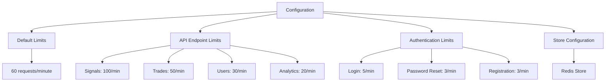
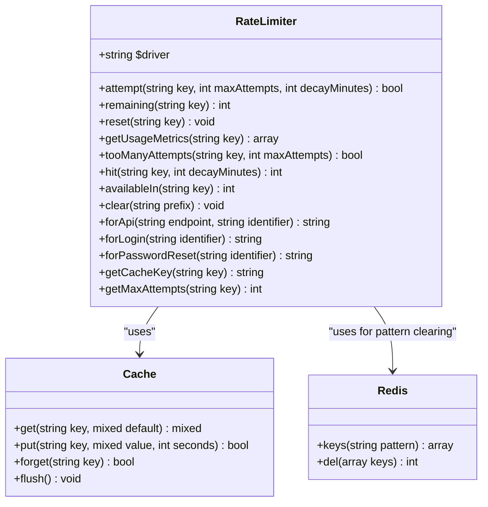
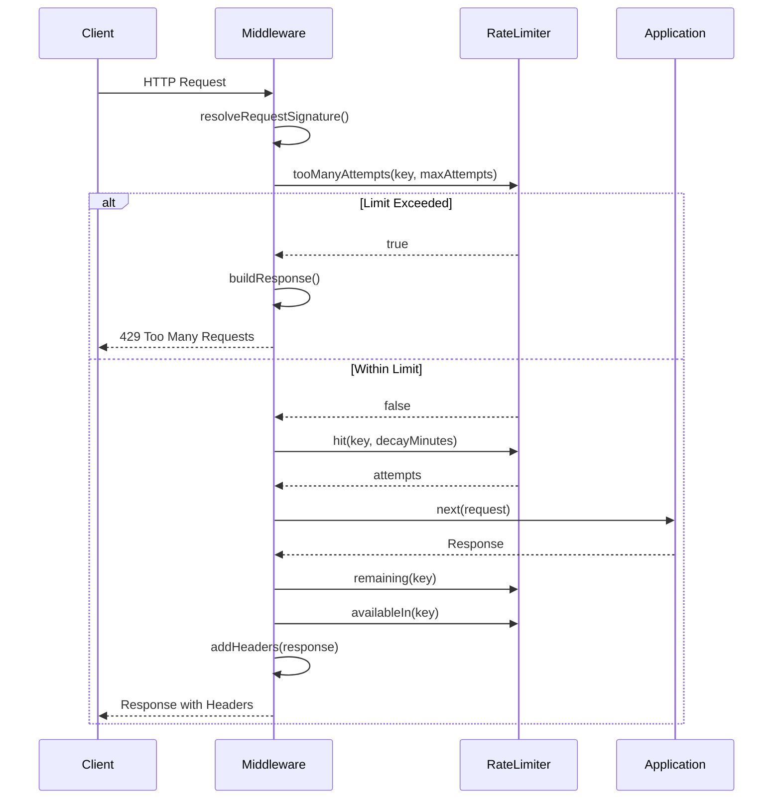
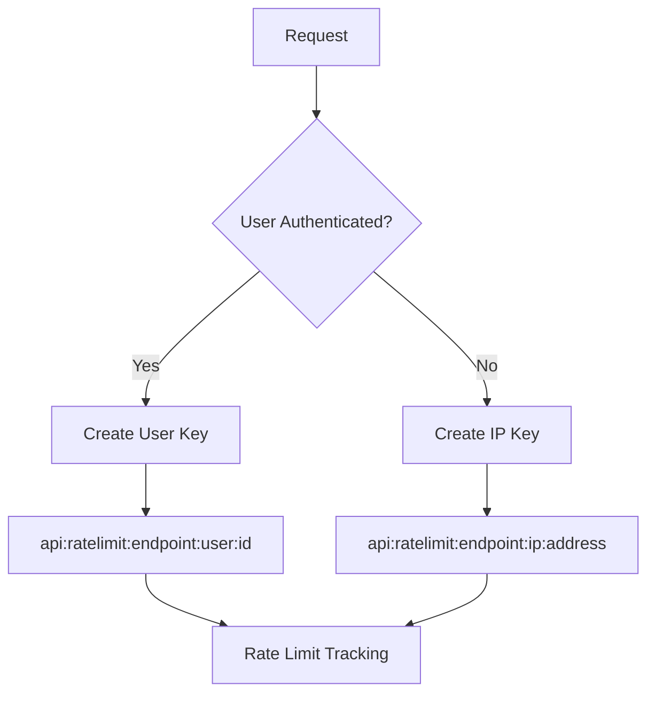
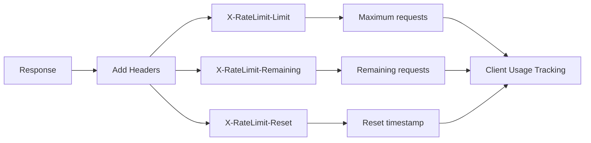
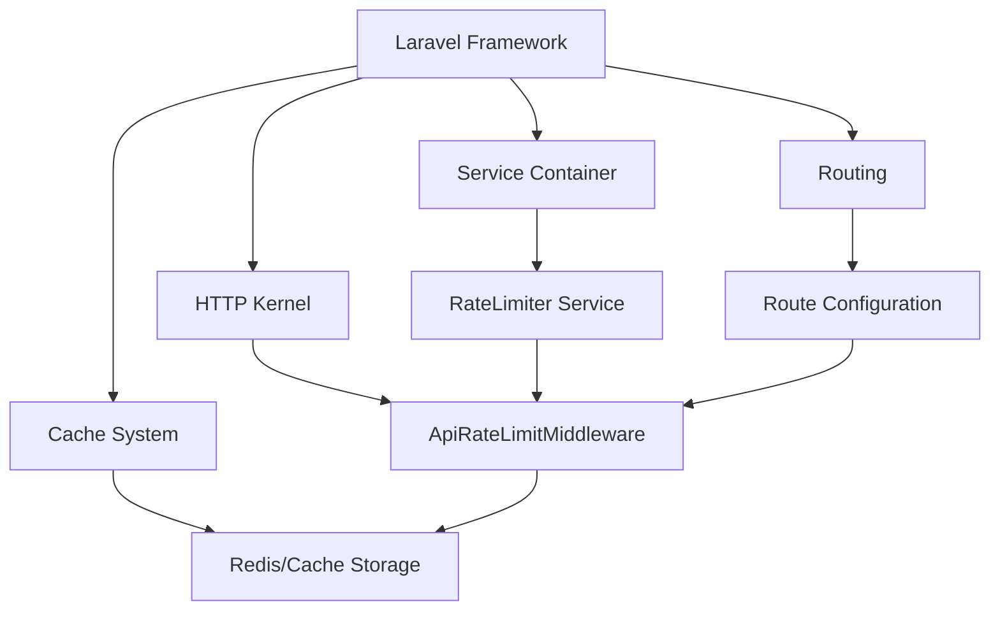
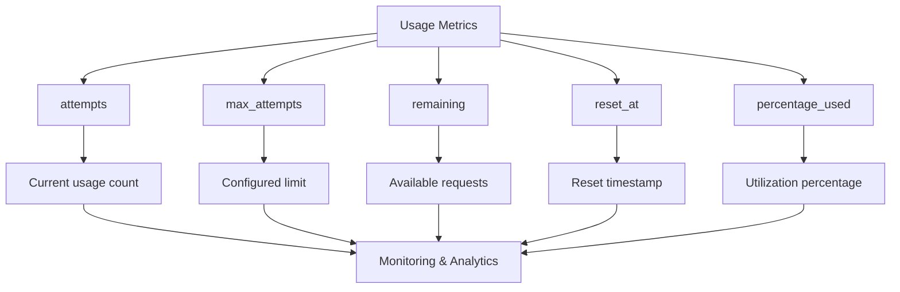

# API Rate Limiting

<cite>
**Referenced Files in This Document**   
- [ApiRateLimitMiddleware.php](file://main/app/Http/Middleware/ApiRateLimitMiddleware.php)
- [RateLimiter.php](file://main/app/Services/Security/RateLimiter.php)
- [ratelimit.php](file://main/config/ratelimit.php)
- [RouteServiceProvider.php](file://main/app/Providers/RouteServiceProvider.php)
- [Kernel.php](file://main/app/Http/Kernel.php)
</cite>

## Table of Contents
1. [Introduction](#introduction)
2. [Configuration](#configuration)
3. [Rate Limiter Service](#rate-limiter-service)
4. [Middleware Implementation](#middleware-implementation)
5. [Request Signature Resolution](#request-signature-resolution)
6. [Rate Limit Headers](#rate-limit-headers)
7. [Response Handling](#response-handling)
8. [Integration with Laravel Framework](#integration-with-laravel-framework)
9. [Usage Metrics and Monitoring](#usage-metrics-and-monitoring)
10. [Conclusion](#conclusion)

## Introduction
The API rate limiting system in this application provides comprehensive protection against excessive API usage while ensuring fair access for all users. The implementation combines a custom rate limiting service with Laravel's middleware architecture to provide flexible, configurable rate limiting across different endpoints and user types. The system tracks usage by both user ID and IP address, with configurable limits for different API endpoints and actions.

**Section sources**
- [ApiRateLimitMiddleware.php](file://main/app/Http/Middleware/ApiRateLimitMiddleware.php#L1-L88)
- [RateLimiter.php](file://main/app/Services/Security/RateLimiter.php#L1-L181)
- [ratelimit.php](file://main/config/ratelimit.php#L1-L55)

## Configuration
The rate limiting system is configured through the `ratelimit.php` configuration file, which defines default limits for various types of requests. The configuration supports environment variables for easy adjustment in different deployment environments. Key configuration options include:

- Default rate limit (60 requests per minute)
- API-specific rate limits (60 requests per minute)
- Login attempt limits (5 attempts per minute)
- Password reset limits (3 attempts per minute)
- Registration limits (3 attempts per minute)
- Endpoint-specific limits for signals, trades, users, and analytics
- Decay time (1 minute) for rate limit counters
- Cache store configuration (defaults to Redis)

The configuration also includes specific rate limits for different API endpoints, allowing for granular control over high-traffic endpoints. The system uses Redis as the default cache store for optimal performance in distributed environments.



**Diagram sources**
- [ratelimit.php](file://main/config/ratelimit.php#L1-L55)

**Section sources**
- [ratelimit.php](file://main/config/ratelimit.php#L1-L55)

## Rate Limiter Service
The `RateLimiter` service provides the core functionality for tracking and enforcing rate limits. Implemented as a custom service in the `App\Services\Security` namespace, it offers methods for checking limits, incrementing counters, and retrieving usage metrics. The service uses Laravel's cache system as the underlying storage mechanism, with Redis as the preferred driver for distributed environments.

Key features of the rate limiter service include:
- Configurable limits based on request type
- Support for both user-based and IP-based rate limiting
- Automatic TTL (time-to-live) management for rate limit counters
- Methods for checking remaining attempts and time until reset
- Support for clearing rate limits by prefix
- Usage metrics including percentage used and reset timestamps

The service determines the appropriate rate limit by examining the key pattern, applying different default limits for API requests, login attempts, password resets, and other actions.



**Diagram sources**
- [RateLimiter.php](file://main/app/Services/Security/RateLimiter.php#L1-L181)

**Section sources**
- [RateLimiter.php](file://main/app/Services/Security/RateLimiter.php#L1-L181)

## Middleware Implementation
The `ApiRateLimitMiddleware` implements the rate limiting logic at the HTTP middleware layer, intercepting incoming requests before they reach the application routes. The middleware is configured with default parameters for maximum attempts (60) and decay minutes (1), which can be overridden on a per-route basis.

The middleware follows a standard pattern:
1. Resolve a unique request signature based on user or IP
2. Check if the rate limit has been exceeded
3. If exceeded, return a 429 Too Many Requests response
4. Otherwise, increment the hit counter and proceed
5. Add rate limit headers to the response

The middleware is designed to be flexible and reusable, allowing different rate limit values to be specified when applying the middleware to specific routes.



**Diagram sources**
- [ApiRateLimitMiddleware.php](file://main/app/Http/Middleware/ApiRateLimitMiddleware.php#L1-L88)

**Section sources**
- [ApiRateLimitMiddleware.php](file://main/app/Http/Middleware/ApiRateLimitMiddleware.php#L1-L88)

## Request Signature Resolution
The request signature resolution mechanism determines how API requests are identified for rate limiting purposes. The system uses a hierarchical approach, prioritizing authenticated users over IP addresses. When a user is authenticated, the rate limit is tracked by user ID; otherwise, it falls back to IP address tracking.

The signature resolution process:
1. Extract user information from the request
2. Get the client IP address
3. Determine the route identifier (name or path)
4. If user is authenticated, create a user-specific key
5. If no user, create an IP-based key

This approach ensures that authenticated users have independent rate limits, while unauthenticated requests are limited by IP address to prevent abuse. The key structure follows the pattern "api:ratelimit:{endpoint}:{identifier}" where the identifier is either "user:{id}" or "ip:{address}".



**Diagram sources**
- [ApiRateLimitMiddleware.php](file://main/app/Http/Middleware/ApiRateLimitMiddleware.php#L37-L53)
- [RateLimiter.php](file://main/app/Services/Security/RateLimiter.php#L130-L134)

**Section sources**
- [ApiRateLimitMiddleware.php](file://main/app/Http/Middleware/ApiRateLimitMiddleware.php#L37-L53)

## Rate Limit Headers
The rate limiting system adds standard rate limit headers to API responses, providing clients with information about their current rate limit status. These headers follow the conventional rate limiting header format used by many APIs:

- `X-RateLimit-Limit`: The maximum number of requests allowed per time window
- `X-RateLimit-Remaining`: The number of requests remaining in the current window
- `X-RateLimit-Reset`: The timestamp when the rate limit window resets
- `Retry-After`: The number of seconds to wait before retrying (when limit is exceeded)

These headers allow API consumers to monitor their usage and implement appropriate retry logic when necessary. The headers are added to all responses, even when the rate limit has not been exceeded, to provide consistent feedback to clients.



**Diagram sources**
- [ApiRateLimitMiddleware.php](file://main/app/Http/Middleware/ApiRateLimitMiddleware.php#L74-L87)

**Section sources**
- [ApiRateLimitMiddleware.php](file://main/app/Http/Middleware/ApiRateLimitMiddleware.php#L74-L87)

## Response Handling
When a client exceeds the rate limit, the system returns a standardized 429 Too Many Requests response with detailed information about the rate limit violation. The response includes both HTTP headers and a JSON body with relevant details to help clients understand and handle the rate limiting.

The response structure includes:
- Status code: 429 Too Many Requests
- JSON body with message, retry_after, and limit fields
- Standard rate limit headers (X-RateLimit-Limit, X-RateLimit-Remaining, etc.)
- Retry-After header indicating when the client can retry

The JSON response body provides programmatic access to rate limit information, while the headers follow standard conventions for rate limiting. This dual approach ensures compatibility with both human developers and automated systems.

```mermaid
flowchart TD
A[Rate Limit Exceeded] --> B[Build Response]
B --> C[Status: 429]
B --> D[JSON Body]
B --> E[Headers]
D --> F[message: "Too many requests..."]
D --> G[retry_after: seconds]
D --> H[limit: max attempts]
E --> I[X-RateLimit-Limit]
E --> J[X-RateLimit-Remaining: 0]
E --> K[Retry-After]
E --> L[X-RateLimit-Reset]
C --> M[Client Response]
F --> M
G --> M
H --> M
I --> M
J --> M
K --> M
L --> M
```

**Diagram sources**
- [ApiRateLimitMiddleware.php](file://main/app/Http/Middleware/ApiRateLimitMiddleware.php#L55-L72)

**Section sources**
- [ApiRateLimitMiddleware.php](file://main/app/Http/Middleware/ApiRateLimitMiddleware.php#L55-L72)

## Integration with Laravel Framework
The rate limiting system is integrated with Laravel's middleware and service container architecture. While Laravel provides built-in rate limiting functionality, this application implements a custom solution for greater flexibility and control. The custom `ApiRateLimitMiddleware` is registered in the HTTP kernel and can be applied to routes as needed.

The integration points include:
- Service container binding for the RateLimiter service
- Middleware registration in the HTTP kernel
- Configuration via the config system
- Cache system integration for storage
- Route-level application of rate limiting

The system coexists with Laravel's built-in rate limiting features, which are also configured in the `RouteServiceProvider`. This allows for both global rate limiting and granular, custom rate limiting as needed.



**Diagram sources**
- [Kernel.php](file://main/app/Http/Kernel.php#L58-L63)
- [RouteServiceProvider.php](file://main/app/Providers/RouteServiceProvider.php#L61-L66)

**Section sources**
- [Kernel.php](file://main/app/Http/Kernel.php#L58-L63)
- [RouteServiceProvider.php](file://main/app/Providers/RouteServiceProvider.php#L61-L66)

## Usage Metrics and Monitoring
The rate limiting system provides comprehensive usage metrics through the `getUsageMetrics` method of the RateLimiter service. These metrics enable monitoring of API usage patterns and detection of potential abuse. The metrics include:

- Current number of attempts
- Maximum allowed attempts
- Remaining attempts
- Timestamp when the limit resets
- Percentage of limit used

These metrics can be used for administrative monitoring, user dashboards, or debugging rate limiting issues. The system also supports clearing rate limits by prefix, which can be useful for administrative operations or testing.

The metrics are stored in the cache alongside the attempt counters, with additional TTL tracking to determine the reset time. This allows for accurate reporting of rate limit status without requiring additional storage.



**Diagram sources**
- [RateLimiter.php](file://main/app/Services/Security/RateLimiter.php#L56-L72)

**Section sources**
- [RateLimiter.php](file://main/app/Services/Security/RateLimiter.php#L56-L72)

## Conclusion
The API rate limiting system provides a robust, flexible solution for controlling API usage and preventing abuse. By combining a custom rate limiting service with Laravel's middleware architecture, the system offers granular control over different endpoints and user types. The implementation supports both user-based and IP-based rate limiting, with configurable limits and comprehensive monitoring capabilities.

Key strengths of the system include:
- Configurable limits for different API endpoints and actions
- Hierarchical identification (user ID first, then IP address)
- Standard rate limit headers for client compatibility
- Comprehensive usage metrics for monitoring
- Redis-backed storage for distributed environments
- Flexible middleware implementation

The system effectively balances security and usability, protecting the application from abuse while providing clear feedback to legitimate API consumers. The combination of configuration-driven limits and programmatic control makes it adaptable to various usage scenarios and traffic patterns.