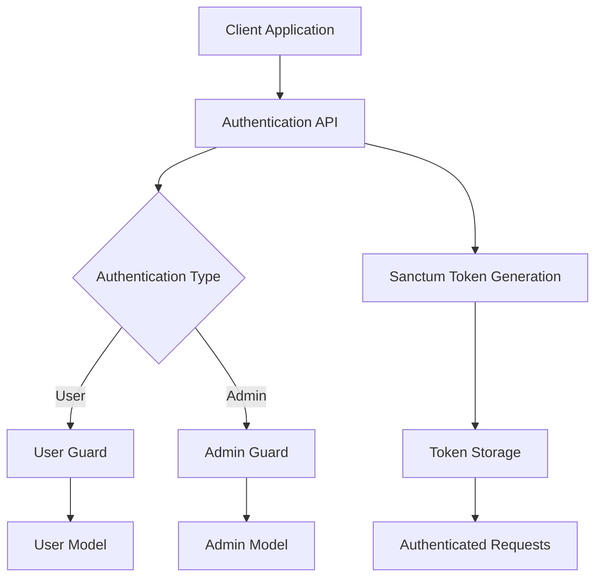
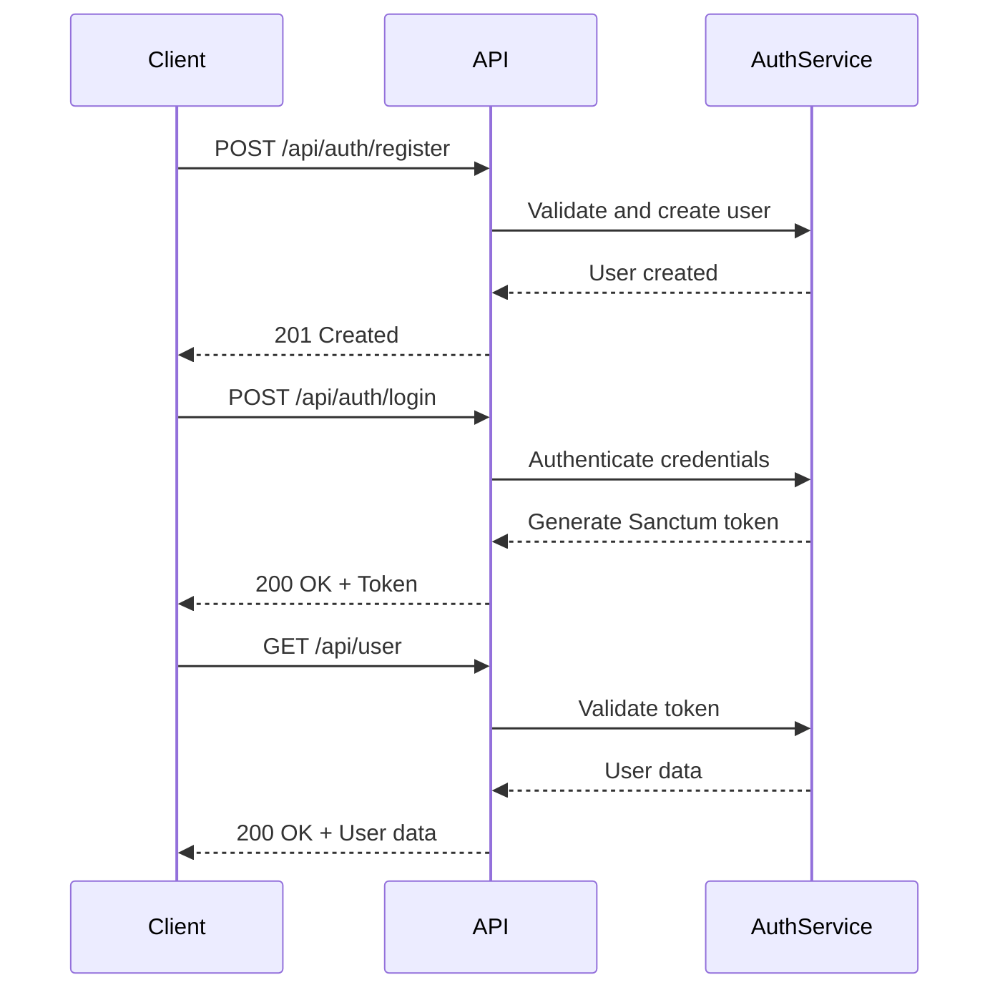
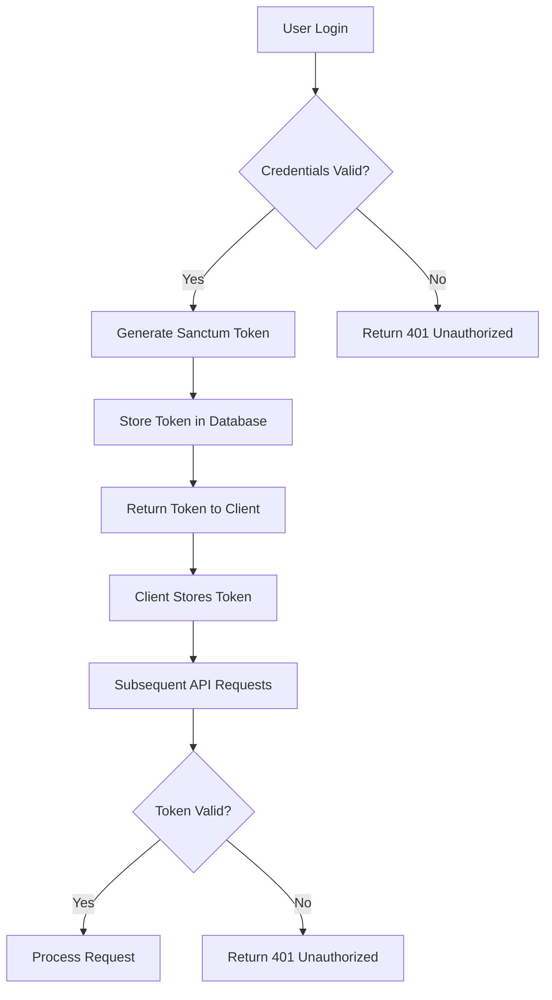

# Authentication

<cite>
**Referenced Files in This Document**   
- [api.php](file://main/routes/api.php)
- [sanctum.php](file://main/config/sanctum.php)
- [auth.php](file://main/config/auth.php)
- [RegisterController.php](file://main/app/Http/Controllers/Api/Auth/RegisterController.php)
- [LoginController.php](file://main/app/Http/Controllers/Api/Auth/LoginController.php)
- [PasswordResetController.php](file://main/app/Http/Controllers/Api/Auth/PasswordResetController.php)
- [User.php](file://main/app/Models/User.php)
- [UserRegistration.php](file://main/app/Services/UserRegistration.php)
- [UserLogin.php](file://main/app/Services/UserLogin.php)
</cite>

## Table of Contents
1. [Introduction](#introduction)
2. [Authentication Architecture](#authentication-architecture)
3. [API Endpoints](#api-endpoints)
4. [Request and Response Formats](#request-and-response-formats)
5. [Laravel Sanctum Token Management](#laravel-sanctum-token-management)
6. [Security Considerations](#security-considerations)
7. [Frontend Integration](#frontend-integration)
8. [Error Handling](#error-handling)
9. [Best Practices](#best-practices)

## Introduction
This document provides comprehensive API documentation for the authentication system in the AITradePulse application. The system implements Laravel Sanctum for token-based authentication, supporting user registration, login, password reset, and email verification workflows. The API is designed to securely manage user sessions and provide stateful authentication for both frontend and backend interactions.

**Section sources**
- [api.php](file://main/routes/api.php)
- [sanctum.php](file://main/config/sanctum.php)

## Authentication Architecture
The authentication system is built on Laravel Sanctum, providing a robust token-based authentication mechanism for the API. The architecture supports both stateful and stateless authentication flows, with CSRF protection for web-based interactions. The system distinguishes between user and admin authentication through separate guards and providers.

The authentication flow follows a standard pattern:
1. User submits credentials via API endpoints
2. System validates credentials and generates Sanctum token
3. Token is returned to client for subsequent authenticated requests
4. Token is validated on each protected route



**Diagram sources**
- [auth.php](file://main/config/auth.php)
- [sanctum.php](file://main/config/sanctum.php)

**Section sources**
- [auth.php](file://main/config/auth.php)
- [sanctum.php](file://main/config/sanctum.php)

## API Endpoints
The authentication API provides the following endpoints for user management:

### Registration Endpoint
- **URL**: `/api/auth/register`
- **Method**: POST
- **Purpose**: Register a new user account
- **Authentication**: Not required

### Login Endpoint
- **URL**: `/api/auth/login`
- **Method**: POST
- **Purpose**: Authenticate user credentials and generate access token
- **Authentication**: Not required

### Password Reset Endpoints
- **Forgot Password**: `/api/auth/forgot-password` (POST)
- **Verify Code**: `/api/auth/verify-code` (POST)
- **Reset Password**: `/api/auth/reset-password` (POST)

### Session Management
- **Logout**: `/api/auth/logout` (POST)
- **Refresh Token**: `/api/auth/refresh` (POST)

### User Profile
- **Get User**: `/api/user` (GET)
- **Profile Management**: `/api/user/profile` (GET, PUT)



**Diagram sources**
- [api.php](file://main/routes/api.php)
- [RegisterController.php](file://main/app/Http/Controllers/Api/Auth/RegisterController.php)
- [LoginController.php](file://main/app/Http/Controllers/Api/Auth/LoginController.php)

**Section sources**
- [api.php](file://main/routes/api.php)

## Request and Response Formats
### Registration Request
```json
{
  "name": "string",
  "email": "string",
  "password": "string",
  "password_confirmation": "string",
  "username": "string",
  "phone": "string"
}
```

### Registration Response (Success)
```json
{
  "success": true,
  "data": {
    "id": "integer",
    "name": "string",
    "email": "string",
    "username": "string",
    "created_at": "datetime"
  },
  "token": "string"
}
```

### Login Request
```json
{
  "email": "string",
  "password": "string"
}
```

### Login Response (Success)
```json
{
  "success": true,
  "data": {
    "id": "integer",
    "name": "string",
    "email": "string",
    "token": "string"
  }
}
```

### Error Response
```json
{
  "message": "string",
  "errors": {
    "field_name": ["error messages"]
  }
}
```

**Section sources**
- [User.php](file://main/app/Models/User.php)
- [UserRegistration.php](file://main/app/Services/UserRegistration.php)
- [UserLogin.php](file://main/app/Services/UserLogin.php)

## Laravel Sanctum Token Management
The application uses Laravel Sanctum for API token management, providing a simple and secure way to authenticate API requests. Sanctum tokens are stored in the database and associated with user accounts.

### Token Configuration
The Sanctum configuration is defined in `config/sanctum.php`:
- **Stateful Domains**: Specifies domains that can make stateful requests
- **Expiration**: Tokens do not expire (null value)
- **Middleware**: Includes CSRF protection and cookie encryption

### Token Generation
When a user successfully logs in, Sanctum generates a random token that is:
- Stored in the `personal_access_tokens` database table
- Associated with the authenticated user
- Returned in the API response for client storage

### Token Validation
All authenticated routes use the `auth:sanctum` middleware, which:
- Checks for the presence of a valid Bearer token
- Validates the token against the database
- Attaches the authenticated user to the request

### Token Refresh
The refresh endpoint allows clients to obtain a new token without re-authenticating, maintaining session continuity while enhancing security through token rotation.



**Diagram sources**
- [sanctum.php](file://main/config/sanctum.php)
- [LoginController.php](file://main/app/Http/Controllers/Api/Auth/LoginController.php)

**Section sources**
- [sanctum.php](file://main/config/sanctum.php)

## Security Considerations
### CSRF Protection
The application implements CSRF protection for stateful API requests through the VerifyCsrfToken middleware. This prevents cross-site request forgery attacks by validating that requests originate from trusted sources.

### Input Validation
All authentication endpoints implement strict input validation:
- Email format validation
- Password strength requirements
- Required field validation
- Data type validation

### Rate Limiting
The API implements rate limiting to prevent brute force attacks:
- Login attempts are limited per IP address
- Password reset requests are throttled
- Registration attempts are monitored

### Secure Password Handling
- Passwords are hashed using bcrypt before storage
- Password confirmation is required for registration
- Password reset tokens expire after 60 minutes

### Two-Factor Authentication
The system supports two-factor authentication through TOTP (Time-based One-Time Password) for enhanced security.

**Section sources**
- [auth.php](file://main/config/auth.php)
- [PasswordResetController.php](file://main/app/Http/Controllers/Api/Auth/PasswordResetController.php)

## Frontend Integration
### Token Storage
Client applications should store the authentication token securely:
- Use HTTP-only cookies for web applications
- Use secure storage mechanisms for mobile apps
- Implement token persistence across sessions

### Authentication Flow
1. User enters credentials in login form
2. Client sends POST request to `/api/auth/login`
3. Server returns authentication token on success
4. Client stores token and includes it in subsequent requests
5. Client redirects to authenticated dashboard

### Session Management
- Include token in Authorization header: `Bearer {token}`
- Handle 401 responses by redirecting to login
- Implement token refresh before expiration
- Provide logout functionality that invalidates the token

**Section sources**
- [api.php](file://main/routes/api.php)
- [LoginController.php](file://main/app/Http/Controllers/Api/Auth/LoginController.php)

## Error Handling
The authentication API returns standardized error responses with appropriate HTTP status codes:

### Common Status Codes
- **200 OK**: Successful request
- **201 Created**: Resource created successfully
- **401 Unauthorized**: Invalid credentials or missing token
- **403 Forbidden**: Insufficient permissions
- **422 Unprocessable Entity**: Validation errors
- **429 Too Many Requests**: Rate limiting

### Error Response Examples
**Invalid Credentials (401)**
```json
{
  "message": "Invalid credentials"
}
```

**Validation Errors (422)**
```json
{
  "message": "The given data was invalid.",
  "errors": {
    "email": ["The email field is required."],
    "password": ["The password must be at least 8 characters."]
  }
}
```

**Rate Limited (429)**
```json
{
  "message": "Too many attempts. Please try again later."
}
```

**Section sources**
- [LoginController.php](file://main/app/Http/Controllers/Api/Auth/LoginController.php)
- [PasswordResetController.php](file://main/app/Http/Controllers/Api/Auth/PasswordResetController.php)

## Best Practices
### For API Consumers
- Always use HTTPS for all authentication requests
- Store tokens securely using appropriate mechanisms
- Implement proper error handling for authentication failures
- Refresh tokens before they expire
- Log out users and invalidate tokens when sessions end

### For Security
- Implement rate limiting on authentication endpoints
- Use strong password policies
- Enable two-factor authentication for sensitive operations
- Monitor authentication logs for suspicious activity
- Regularly rotate and invalidate old tokens

### For Performance
- Cache user data after authentication
- Minimize database queries in authentication flows
- Implement proper indexing on authentication-related database fields
- Use efficient token validation mechanisms

### For User Experience
- Provide clear error messages for authentication failures
- Implement password strength indicators
- Support social login options
- Allow users to manage active sessions
- Provide easy password recovery options

**Section sources**
- [UserRegistration.php](file://main/app/Services/UserRegistration.php)
- [UserLogin.php](file://main/app/Services/UserLogin.php)
- [auth.php](file://main/config/auth.php)