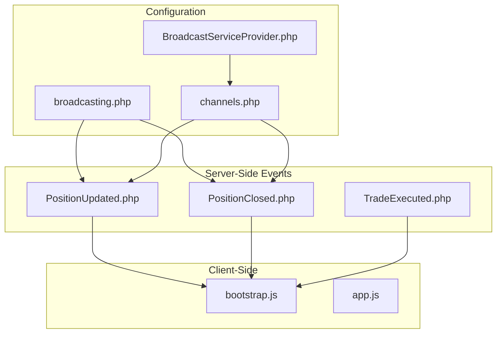
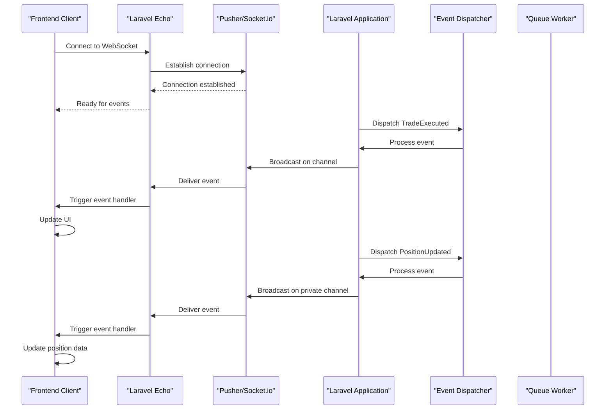
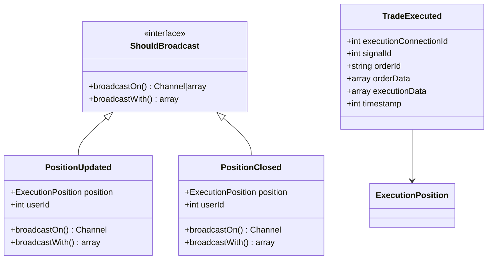
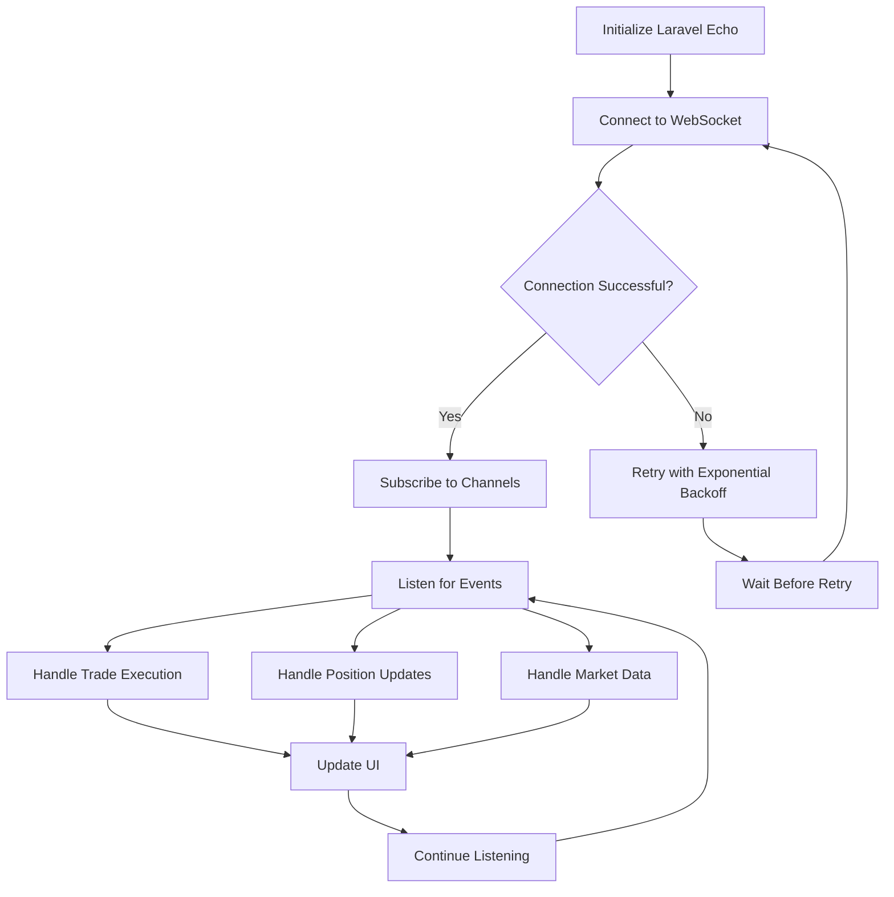
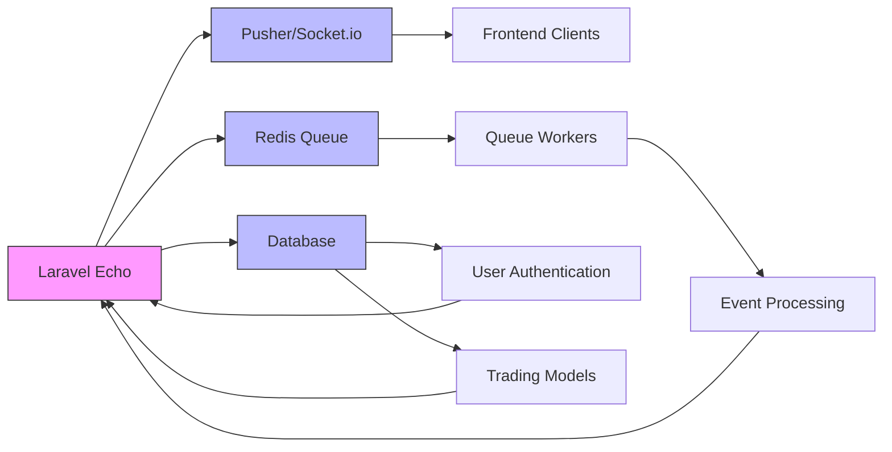

# Real-time Communication

<cite>
**Referenced Files in This Document**   
- [broadcasting.php](file://main/config/broadcasting.php)
- [channels.php](file://main/routes/channels.php)
- [BroadcastServiceProvider.php](file://main/app/Providers/BroadcastServiceProvider.php)
- [PositionUpdated.php](file://main/addons/trading-management-addon/Modules/PositionMonitoring/Events/PositionUpdated.php)
- [PositionClosed.php](file://main/addons/trading-management-addon/Modules/PositionMonitoring/Events/PositionClosed.php)
- [TradeExecuted.php](file://main/addons/trading-management-addon/Shared/Events/TradeExecuted.php)
- [bootstrap.js](file://main/resources/js/bootstrap.js)
- [api-reference.md](file://docs/api-reference.md)
- [spec.md](file://specs/active/multi-channel-signal-addon/spec.md)
- [TradeExecutionDTO.php](file://main/addons/trading-management-addon/Shared/DTOs/TradeExecutionDTO.php)
</cite>

## Table of Contents
1. [Introduction](#introduction)
2. [Project Structure](#project-structure)
3. [Core Components](#core-components)
4. [Architecture Overview](#architecture-overview)
5. [Detailed Component Analysis](#detailed-component-analysis)
6. [Dependency Analysis](#dependency-analysis)
7. [Performance Considerations](#performance-considerations)
8. [Troubleshooting Guide](#troubleshooting-guide)
9. [Conclusion](#conclusion)

## Introduction
This document provides comprehensive API documentation for real-time communication features using Laravel Echo and WebSockets in the AITradePulse platform. The system enables real-time updates for trading activities, signal notifications, and market data streams. It covers event broadcasting mechanisms, channel authorization, event structure, payload formats, and client implementation for real-time trading updates.

## Project Structure
The real-time communication system is implemented using Laravel's broadcasting features with Pusher/Socket.io integration. The core components are organized across configuration files, event classes, and client-side JavaScript.



**Diagram sources**
- [broadcasting.php](file://main/config/broadcasting.php)
- [channels.php](file://main/routes/channels.php)
- [BroadcastServiceProvider.php](file://main/app/Providers/BroadcastServiceProvider.php)
- [PositionUpdated.php](file://main/addons/trading-management-addon/Modules/PositionMonitoring/Events/PositionUpdated.php)
- [PositionClosed.php](file://main/addons/trading-management-addon/Modules/PositionMonitoring/Events/PositionClosed.php)
- [TradeExecuted.php](file://main/addons/trading-management-addon/Shared/Events/TradeExecuted.php)
- [bootstrap.js](file://main/resources/js/bootstrap.js)

**Section sources**
- [broadcasting.php](file://main/config/broadcasting.php)
- [channels.php](file://main/routes/channels.php)
- [BroadcastServiceProvider.php](file://main/app/Providers/BroadcastServiceProvider.php)

## Core Components
The real-time communication system consists of several core components that work together to deliver real-time updates to clients. These include the broadcasting configuration, event classes that implement ShouldBroadcast, channel authorization mechanisms, and client-side event listeners.

The system supports three main types of real-time events:
- Trade execution notifications
- Position update and closure events
- Market data streaming

Each event type has specific payload structures and is broadcast on appropriate channels based on user authentication and authorization.

**Section sources**
- [PositionUpdated.php](file://main/addons/trading-management-addon/Modules/PositionMonitoring/Events/PositionUpdated.php)
- [PositionClosed.php](file://main/addons/trading-management-addon/Modules/PositionMonitoring/Events/PositionClosed.php)
- [TradeExecuted.php](file://main/addons/trading-management-addon/Shared/Events/TradeExecuted.php)

## Architecture Overview
The real-time communication architecture follows a publish-subscribe pattern using Laravel Echo and WebSockets. The system is designed to handle high-frequency trading updates with low latency.



**Diagram sources**
- [broadcasting.php](file://main/config/broadcasting.php)
- [channels.php](file://main/routes/channels.php)
- [PositionUpdated.php](file://main/addons/trading-management-addon/Modules/PositionMonitoring/Events/PositionUpdated.php)
- [TradeExecuted.php](file://main/addons/trading-management-addon/Shared/Events/TradeExecuted.php)

## Detailed Component Analysis

### Event Broadcasting System
The event broadcasting system is implemented using Laravel's event broadcasting capabilities. Events that need to be broadcasted implement the ShouldBroadcast interface, which automatically pushes the event to the configured broadcasting driver.



**Diagram sources**
- [PositionUpdated.php](file://main/addons/trading-management-addon/Modules/PositionMonitoring/Events/PositionUpdated.php)
- [PositionClosed.php](file://main/addons/trading-management-addon/Modules/PositionMonitoring/Events/PositionClosed.php)
- [TradeExecuted.php](file://main/addons/trading-management-addon/Shared/Events/TradeExecuted.php)

**Section sources**
- [PositionUpdated.php](file://main/addons/trading-management-addon/Modules/PositionMonitoring/Events/PositionUpdated.php)
- [PositionClosed.php](file://main/addons/trading-management-addon/Modules/PositionMonitoring/Events/PositionClosed.php)
- [TradeExecuted.php](file://main/addons/trading-management-addon/Shared/Events/TradeExecuted.php)

### Channel Authorization Mechanisms
The system implements secure channel authorization to ensure users can only access data they are permitted to view. Private channels are authenticated using Laravel's built-in channel authorization system.

The default user channel authorization is defined in routes/channels.php:
```php
Broadcast::channel('App.Models.User.{id}', function ($user, $id) {
    return (int) $user->id === (int) $id;
});
```

This ensures that users can only subscribe to their own private channels, preventing unauthorized access to trading data.

**Section sources**
- [channels.php](file://main/routes/channels.php)

### Event Structure and Payload Formats
The system defines specific payload formats for different event types to ensure consistent data delivery to clients.

#### Trade Execution Event
When a trade is executed, the TradeExecuted event is dispatched with the following structure:
- executionConnectionId: ID of the execution connection
- signalId: ID of the associated trading signal
- orderId: Exchange order ID
- orderData: Raw order data from the exchange
- executionData: Additional execution metadata
- timestamp: Unix timestamp of execution

#### Position Update Event
Position updates are broadcast with the PositionUpdated event containing:
- position: ExecutionPosition model instance
- userId: ID of the user who owns the position (nullable for shared positions)

#### Signal Received Event
Signal notifications include comprehensive trading data:
- signal: Signal model with all trading parameters
- symbol: Trading pair symbol
- side: Trade direction (buy/sell)
- lotSize: Position size
- entryPrice: Entry price level
- stopLoss: Stop loss price
- takeProfit: Take profit price
- multipleTakeProfits: Array of multiple take profit levels
- orderType: Market or limit order
- metadata: Additional context-specific data

**Section sources**
- [TradeExecutionDTO.php](file://main/addons/trading-management-addon/Shared/DTOs/TradeExecutionDTO.php)
- [PositionUpdated.php](file://main/addons/trading-management-addon/Modules/PositionMonitoring/Events/PositionUpdated.php)
- [TradeExecuted.php](file://main/addons/trading-management-addon/Shared/Events/TradeExecuted.php)

### Client Implementation
The frontend implementation uses Laravel Echo to connect to the WebSocket server and listen for real-time events.



**Diagram sources**
- [bootstrap.js](file://main/resources/js/bootstrap.js)

**Section sources**
- [bootstrap.js](file://main/resources/js/bootstrap.js)

## Dependency Analysis
The real-time communication system has dependencies on several external services and internal components.



**Diagram sources**
- [broadcasting.php](file://main/config/broadcasting.php)
- [composer.lock](file://main/composer.lock)

**Section sources**
- [broadcasting.php](file://main/config/broadcasting.php)
- [composer.lock](file://main/composer.lock)

## Performance Considerations
The system is designed with performance and scalability in mind, following best practices for real-time communication:

1. **Queue-based Architecture**: Events are processed through queue workers to prevent blocking the main application thread
2. **Connection Persistence**: WebSocket connections are maintained for efficient real-time communication
3. **Reconnection Strategies**: Clients implement exponential backoff for reconnection attempts
4. **Event Rate Limiting**: Broadcasting endpoints are rate-limited to prevent abuse
5. **Payload Optimization**: Only necessary data is included in event payloads
6. **Horizontal Scaling**: The architecture supports multiple queue workers and database read replicas

The system can handle 1000+ active channel sources with concurrent message processing via queue workers, ensuring reliable delivery even under high load.

## Troubleshooting Guide
Common issues and their solutions for the real-time communication system:

1. **WebSocket Connection Failures**
   - Verify Pusher/Socket.io credentials in environment variables
   - Check if the broadcasting driver is properly configured
   - Ensure the WebSocket server is running

2. **Missing Real-time Updates**
   - Verify channel authorization rules
   - Check if the user is properly authenticated
   - Ensure the event implements ShouldBroadcast

3. **Performance Issues**
   - Monitor queue worker performance
   - Check Redis memory usage
   - Optimize event payload sizes

4. **Security Concerns**
   - Validate all channel subscriptions
   - Sanitize event payloads
   - Implement proper rate limiting

**Section sources**
- [spec.md](file://specs/active/multi-channel-signal-addon/spec.md)
- [api-reference.md](file://docs/api-reference.md)

## Conclusion
The real-time communication system in AITradePulse provides a robust foundation for delivering trading updates, signal notifications, and market data streams. By leveraging Laravel Echo and WebSockets, the system ensures low-latency updates with secure channel authorization. The architecture supports high scalability and reliability, making it suitable for high-frequency trading applications. Proper implementation of client-side handlers and adherence to security best practices will ensure a seamless real-time experience for users.