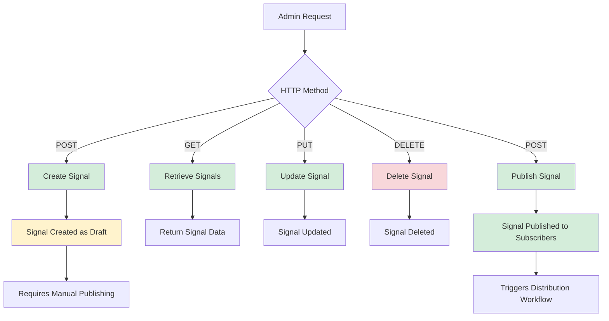
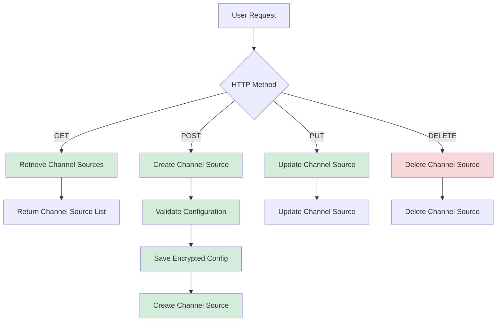
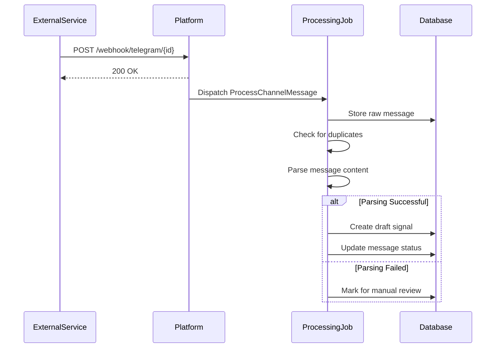
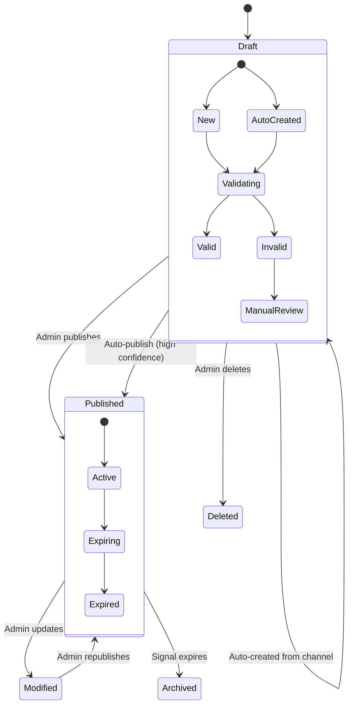

# Signal Processing

<cite>
**Referenced Files in This Document**   
- [api.php](file://main/routes/api.php)
- [api-reference.md](file://docs/api-reference.md)
- [multi-channel-signal-ingestion.md](file://docs/multi-channel-signal-ingestion.md)
- [SignalController.php](file://main/app/Http/Controllers/Api/Admin/SignalController.php)
- [UserSignalController.php](file://main/app/Http/Controllers/Api/User/SignalController.php)
- [ChannelSourceApiController.php](file://main/app/Http/Controllers/Api/User/ChannelSourceApiController.php)
- [Signal.php](file://main/app/Models/Signal.php)
- [ChannelSource.php](file://main/app/Models/ChannelSource.php)
</cite>

## Table of Contents
1. [Introduction](#introduction)
2. [Signal Management Endpoints](#signal-management-endpoints)
3. [Channel Source Management](#channel-source-management)
4. [Webhook Integration](#webhook-integration)
5. [Signal Lifecycle and Validation](#signal-lifecycle-and-validation)
6. [Request/Response Schemas](#requestresponse-schemas)
7. [Error Handling](#error-handling)
8. [Rate Limiting](#rate-limiting)
9. [Examples](#examples)

## Introduction
The Signal Processing API provides comprehensive endpoints for managing trading signals and their sources across multiple channels. This documentation covers the RESTful APIs for creating, reading, updating, and deleting trading signals, as well as managing signal sources from various channels including Telegram, RSS feeds, and custom API integrations. The system supports automated signal ingestion, validation, and distribution workflows.

The API follows REST principles with predictable resource URLs and standard HTTP methods. Authentication is handled via Laravel Sanctum tokens for most endpoints, while webhook endpoints use channel source IDs for identification without requiring authentication tokens.

**Section sources**
- [api.php](file://main/routes/api.php#L285-L293)
- [api-reference.md](file://docs/api-reference.md#L1-L584)

## Signal Management Endpoints
The signal management endpoints allow administrators to create, retrieve, update, and delete trading signals. These endpoints require admin authentication and provide comprehensive signal management capabilities.



**Diagram sources**
- [api.php](file://main/routes/api.php#L285-L293)
- [SignalController.php](file://main/app/Http/Controllers/Api/Admin/SignalController.php#L1-L252)

### Create Signal
**Endpoint**: `POST /api/admin/signals`  
**Authentication**: Required (Admin)  
**Description**: Creates a new trading signal in draft status. The signal must be published separately to make it visible to users.

**Request Body Parameters**:
- `title` (string, required): Signal title (e.g., "EUR/USD Buy Signal")
- `description` (string): Detailed signal description
- `currency_pair_id` (integer, required): ID of the currency pair
- `time_frame_id` (integer, required): ID of the time frame
- `market_id` (integer, required): ID of the market
- `open_price` (decimal, required): Entry/trigger price
- `sl` (decimal, required): Stop loss price
- `tp` (decimal, required): Take profit price
- `direction` (string, required): Direction ("buy", "sell", "long", "short")
- `plan_ids` (array, required): Array of plan IDs to which the signal should be assigned

**Response**: `201 Created` with success message upon successful creation.

**Section sources**
- [SignalController.php](file://main/app/Http/Controllers/Api/Admin/SignalController.php#L63-L100)
- [Signal.php](file://main/app/Models/Signal.php#L1-L177)

### Retrieve Signals
**Endpoint**: `GET /api/admin/signals`  
**Authentication**: Required (Admin)  
**Description**: Retrieves a paginated list of signals with optional filtering.

**Query Parameters**:
- `type` (string): Filter by type ("draft" or "published")
- `search` (string): Search signals by title or ID

**Response**: `200 OK` with paginated signal data including associated plans, currency pairs, timeframes, and markets.

**Section sources**
- [SignalController.php](file://main/app/Http/Controllers/Api/Admin/SignalController.php#L27-L61)

### Update Signal
**Endpoint**: `PUT /api/admin/signals/{id}`  
**Authentication**: Required (Admin)  
**Description**: Updates an existing signal's information.

**URL Parameters**:
- `id` (integer, required): Signal ID to update

**Request Body**: Same parameters as create signal endpoint.

**Response**: `200 OK` with success message upon successful update.

**Section sources**
- [SignalController.php](file://main/app/Http/Controllers/Api/Admin/SignalController.php#L127-L157)

### Delete Signal
**Endpoint**: `DELETE /api/admin/signals/{id}`  
**Authentication**: Required (Admin)  
**Description**: Deletes a signal from the system.

**URL Parameters**:
- `id` (integer, required): Signal ID to delete

**Response**: `200 OK` with success message upon successful deletion.

**Section sources**
- [SignalController.php](file://main/app/Http/Controllers/Api/Admin/SignalController.php#L159-L187)

### Publish Signal
**Endpoint**: `POST /api/admin/signals/{id}/publish`  
**Authentication**: Required (Admin)  
**Description**: Publishes a draft signal, making it visible to assigned users and plans.

**URL Parameters**:
- `id` (integer, required): Signal ID to publish

**Response**: `200 OK` with success message upon successful publication.

**Section sources**
- [SignalController.php](file://main/app/Http/Controllers/Api/Admin/SignalController.php#L190-L218)

## Channel Source Management
The channel source management endpoints allow users to configure and manage external signal sources from which trading signals are automatically ingested.



**Diagram sources**
- [api.php](file://main/routes/api.php#L244-L249)
- [ChannelSourceApiController.php](file://main/app/Http/Controllers/Api/User/ChannelSourceApiController.php#L1-L100)

### Retrieve Channel Sources
**Endpoint**: `GET /api/channel-sources`  
**Authentication**: Required (User)  
**Description**: Retrieves all channel sources configured by the authenticated user.

**Response**: `200 OK` with list of channel sources including name, type, status, and configuration metadata.

**Section sources**
- [ChannelSourceApiController.php](file://main/app/Http/Controllers/Api/User/ChannelSourceApiController.php#L1-L25)

### Create Channel Source
**Endpoint**: `POST /api/channel-sources`  
**Authentication**: Required (User)  
**Description**: Creates a new channel source for ingesting signals from external platforms.

**Request Body Parameters**:
- `name` (string, required): Name of the channel source
- `type` (string, required): Type of channel ("telegram", "rss", "api", "web_scrape")
- `config` (object, required): Configuration specific to the channel type
- `status` (string): Initial status ("active", "paused")

**Configuration Examples**:
- **Telegram**: `{ "bot_token": "123:abc", "chat_id": "@signals" }`
- **API Webhook**: `{ "api_key": "key", "api_secret": "secret" }`
- **RSS**: `{ "feed_url": "https://example.com/rss" }`

All configuration data is encrypted before storage.

**Response**: `201 Created` with created channel source data.

**Section sources**
- [ChannelSourceApiController.php](file://main/app/Http/Controllers/Api/User/ChannelSourceApiController.php#L26-L50)
- [ChannelSource.php](file://main/app/Models/ChannelSource.php#L1-L224)

### Update Channel Source
**Endpoint**: `PUT /api/channel-sources/{id}`  
**Authentication**: Required (User)  
**Description**: Updates an existing channel source configuration.

**URL Parameters**:
- `id` (integer, required): Channel source ID to update

**Request Body**: Same parameters as create endpoint.

**Response**: `200 OK` with updated channel source data.

**Section sources**
- [ChannelSourceApiController.php](file://main/app/Http/Controllers/Api/User/ChannelSourceApiController.php#L51-L75)

### Delete Channel Source
**Endpoint**: `DELETE /api/channel-sources/{id}`  
**Authentication**: Required (User)  
**Description**: Deletes a channel source and stops signal ingestion from that source.

**URL Parameters**:
- `id` (integer, required): Channel source ID to delete

**Response**: `200 OK` with success message upon successful deletion.

**Section sources**
- [ChannelSourceApiController.php](file://main/app/Http/Controllers/Api/User/ChannelSourceApiController.php#L76-L100)

## Webhook Integration
The system provides webhook endpoints for external services to send trading signals directly into the platform without requiring authentication tokens.



**Diagram sources**
- [api.php](file://main/routes/api.php#L478-L479)
- [multi-channel-signal-ingestion.md](file://docs/multi-channel-signal-ingestion.md#L1-L485)

### Telegram Webhook
**Endpoint**: `POST /api/webhook/telegram/{channelSourceId}`  
**Authentication**: Not required (uses channelSourceId)  
**Description**: Receives messages from Telegram channels via webhook and processes them as potential trading signals.

**Headers**:
- `Content-Type: application/json`

**Request Body**: Telegram's standard update format containing message text.

**Response**: `200 OK` with JSON `{ "ok": true }`

**Section sources**
- [api.php](file://main/routes/api.php#L478)
- [multi-channel-signal-ingestion.md](file://docs/multi-channel-signal-ingestion.md#L89-L159)

### API Webhook
**Endpoint**: `POST /api/webhook/channel/{channelSourceId}`  
**Authentication**: Not required (uses channelSourceId)  
**Description**: Receives custom webhook requests from external services and processes them as trading signals.

**Headers**:
- `Content-Type: application/json`
- `X-Signature` (optional): HMAC-SHA256 signature if signature verification is enabled

**Request Body**: JSON with message content in one of these fields: `message`, `text`, `content`, `body`, `signal`, or `data`.

**Signature Verification**:
When enabled, the system verifies the `X-Signature` header using HMAC-SHA256 with the channel's secret key.

**Response**: `200 OK` with JSON `{ "ok": true }`

**Section sources**
- [api.php](file://main/routes/api.php#L479)
- [multi-channel-signal-ingestion.md](file://docs/multi-channel-signal-ingestion.md#L176-L261)

## Signal Lifecycle and Validation
The signal processing system follows a defined lifecycle from creation to publication, with validation rules and modification tracking at each stage.



**Diagram sources**
- [multi-channel-signal-ingestion.md](file://docs/multi-channel-signal-ingestion.md#L160-L208)
- [Signal.php](file://main/app/Models/Signal.php#L1-L177)

### Signal Creation
Signals can be created through two primary methods:
1. **Manual Creation**: Admins create signals via the admin API, which are initially in "draft" status.
2. **Auto-Creation**: External messages from channel sources are automatically parsed and converted into draft signals.

All signals are assigned a random 7-8 digit ID upon creation and are initially unpublished.

### Validation Rules
The system enforces several validation rules:
- **Required Fields**: Title, direction, entry price, SL, and TP are required
- **Price Validation**: Entry price, SL, and TP must be valid decimal numbers
- **Direction Validation**: Direction must be one of: "buy", "sell", "long", "short"
- **Plan Assignment**: Signals must be assigned to at least one plan
- **Duplicate Prevention**: Message hash prevents duplicate signal creation from the same message

### Modification Tracking
The system tracks signal modifications through:
- **Draft Status**: Unpublished signals can be freely modified
- **Publication Workflow**: Draft signals require explicit publication
- **Change History**: All updates are logged with timestamps
- **Auto-Publish Threshold**: Channel sources can be configured to automatically publish signals with confidence scores above a threshold

**Section sources**
- [multi-channel-signal-ingestion.md](file://docs/multi-channel-signal-ingestion.md#L60-L138)
- [Signal.php](file://main/app/Models/Signal.php#L168-L175)

## Request/Response Schemas
This section details the complete request and response schemas for the signal processing endpoints.

### Signal Object Schema
```json
{
  "id": 1234567,
  "title": "EUR/USD Buy Signal",
  "description": "Signal description...",
  "direction": "buy",
  "open_price": "1.1000",
  "sl": "1.0950",
  "tp": "1.1100",
  "published_date": "2023-01-01T00:00:00.000000Z",
  "is_published": false,
  "auto_created": false,
  "channel_source_id": null,
  "currency_pair_id": 1,
  "time_frame_id": 1,
  "market_id": 1,
  "pair": {
    "id": 1,
    "name": "EUR/USD"
  },
  "time": {
    "id": 1,
    "name": "1H"
  },
  "market": {
    "id": 1,
    "name": "Forex"
  },
  "plans": [
    {
      "id": 1,
      "name": "Basic Plan",
      "status": 1
    }
  ]
}
```

### Channel Source Object Schema
```json
{
  "id": 1,
  "user_id": 1,
  "name": "Telegram Signals",
  "type": "telegram",
  "status": "active",
  "last_processed_at": "2023-01-01T00:00:00.000000Z",
  "error_count": 0,
  "last_error": null,
  "auto_publish_confidence_threshold": 80,
  "default_plan_id": 1,
  "default_market_id": 1,
  "default_timeframe_id": 1,
  "config": {
    "bot_token": "encrypted_value",
    "chat_id": "@trading_signals"
  }
}
```

### Error Response Schema
```json
{
  "error": "Error message",
  "message": "Detailed error description",
  "errors": {
    "field_name": ["Validation error message"]
  }
}
```

**Section sources**
- [SignalController.php](file://main/app/Http/Controllers/Api/Admin/SignalController.php#L70-L80)
- [ChannelSource.php](file://main/app/Models/ChannelSource.php#L16-L29)
- [api-reference.md](file://docs/api-reference.md#L268-L276)

## Error Handling
The API implements comprehensive error handling with standardized response formats and appropriate HTTP status codes.

### HTTP Status Codes
- `200 OK`: Successful request
- `201 Created`: Resource successfully created
- `400 Bad Request`: Invalid input or request parameters
- `401 Unauthorized`: Missing or invalid authentication token
- `403 Forbidden`: Insufficient permissions
- `404 Not Found`: Resource not found
- `422 Unprocessable Entity`: Validation errors
- `429 Too Many Requests`: Rate limit exceeded
- `500 Internal Server Error`: Unexpected server error

### Common Error Scenarios
- **Invalid Signal Data**: Returns `422 Unprocessable Entity` with field-specific validation errors
- **Unauthorized Access**: Returns `401 Unauthorized` for missing/invalid tokens
- **Insufficient Permissions**: Returns `403 Forbidden` when user lacks required permissions
- **Resource Not Found**: Returns `404 Not Found` when requested resource doesn't exist
- **Rate Limit Exceeded**: Returns `429 Too Many Requests` with retry instructions

**Section sources**
- [api-reference.md](file://docs/api-reference.md#L278-L315)

## Rate Limiting
The API implements rate limiting to prevent abuse and ensure system stability.

### Rate Limit Configuration
- **Default Limit**: 60 requests per minute per IP address
- **Webhook Endpoints**: No rate limiting (uses channel source ID for identification)
- **Admin Endpoints**: Standard rate limiting applies

### Rate Limit Headers
Successful responses include rate limit information in headers:
- `X-RateLimit-Limit`: Total requests allowed per window
- `X-RateLimit-Remaining`: Remaining requests in current window
- `X-RateLimit-Reset`: Timestamp when limit resets

When the rate limit is exceeded, the API returns `429 Too Many Requests` with a message indicating the user should try again later.

**Section sources**
- [api-reference.md](file://docs/api-reference.md#L318-L338)

## Examples
This section provides practical examples of using the signal processing API.

### Example 1: Creating a Signal
```bash
curl -X POST https://yourdomain.com/api/admin/signals \
  -H "Authorization: Bearer {admin_token}" \
  -H "Content-Type: application/json" \
  -d '{
    "title": "EUR/USD Buy Signal",
    "description": "Technical breakout above resistance",
    "currency_pair_id": 1,
    "time_frame_id": 1,
    "market_id": 1,
    "open_price": "1.1000",
    "sl": "1.0950",
    "tp": "1.1100",
    "direction": "buy",
    "plan_ids": [1, 2]
  }'
```

### Example 2: Configuring a Telegram Webhook
```bash
# Set webhook URL in Telegram
curl -X POST https://api.telegram.org/bot{BOT_TOKEN}/setWebhook \
  -d url=https://yourdomain.com/api/webhook/telegram/1

# Send test signal
curl -X POST https://yourdomain.com/api/webhook/telegram/1 \
  -H "Content-Type: application/json" \
  -d '{
    "update_id": 123456789,
    "channel_post": {
      "message_id": 1,
      "chat": {
        "id": -1001234567890,
        "title": "Trading Signals"
      },
      "date": 1609459200,
      "text": "EUR/USD BUY 1.1000 SL 1.0950 TP 1.1100"
    }
  }'
```

### Example 3: Creating a Channel Source
```bash
curl -X POST https://yourdomain.com/api/channel-sources \
  -H "Authorization: Bearer {user_token}" \
  -H "Content-Type: application/json" \
  -d '{
    "name": "My Telegram Channel",
    "type": "telegram",
    "status": "active",
    "config": {
      "bot_token": "123456:ABC-DEF",
      "chat_id": "@my_signals"
    }
  }'
```

**Section sources**
- [api-reference.md](file://docs/api-reference.md#L344-L523)
- [multi-channel-signal-ingestion.md](file://docs/multi-channel-signal-ingestion.md#L344-L439)