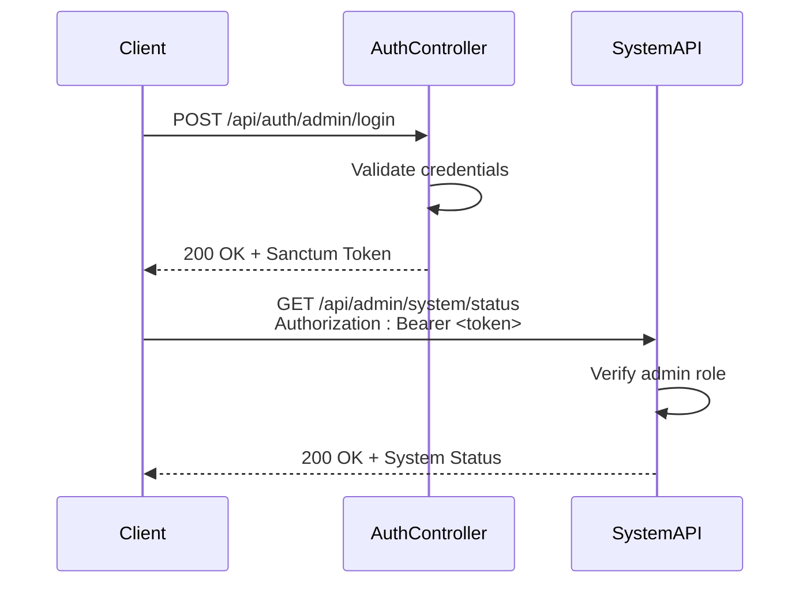
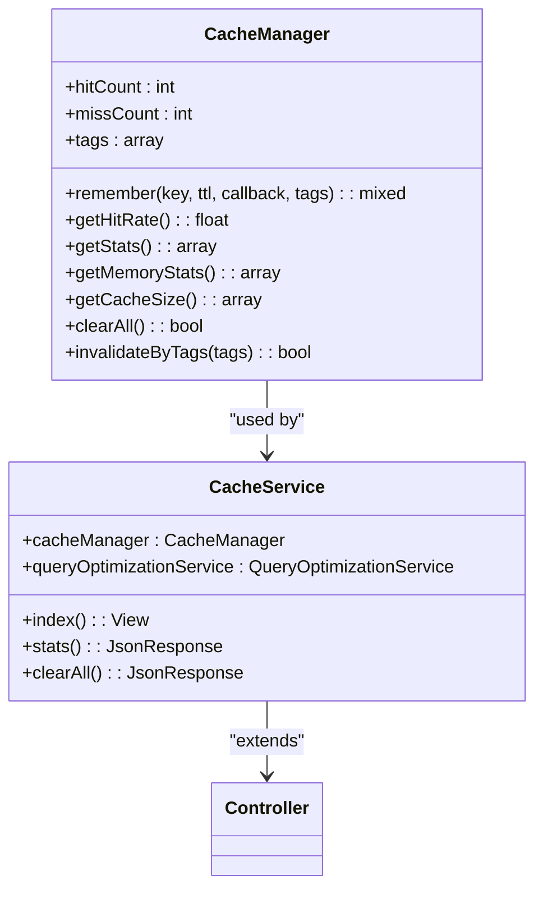
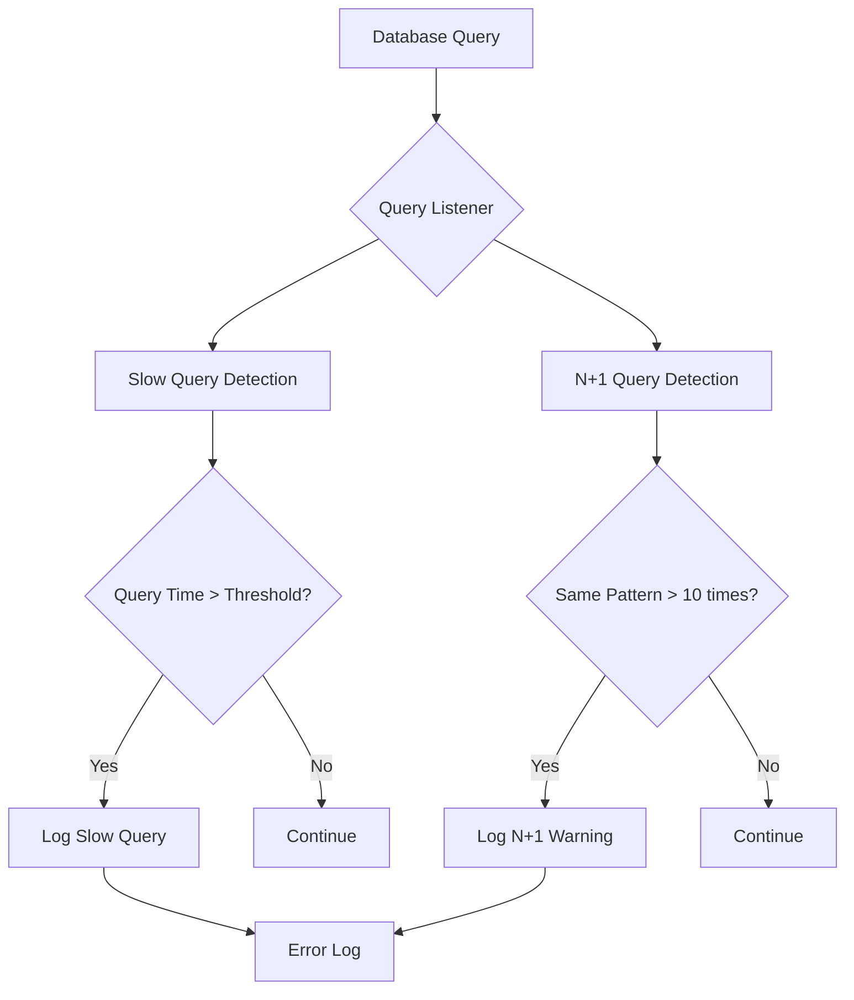
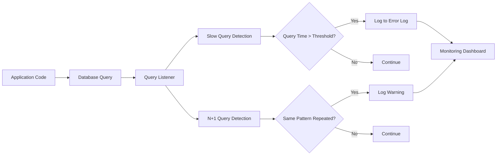

# System Monitoring

<cite>
**Referenced Files in This Document**   
- [SystemController.php](file://main/app/Http/Controllers/Api/SystemController.php)
- [LogsApiController.php](file://main/app/Http/Controllers/Api/Admin/LogsApiController.php)
- [CacheManagementController.php](file://main/app/Http/Controllers/Backend/CacheManagementController.php)
- [CacheManager.php](file://main/app/Services/CacheManager.php)
- [QueryOptimizationService.php](file://main/app/Services/QueryOptimizationService.php)
- [api.php](file://main/routes/api.php)
- [performance.blade.php](file://main/resources/views/backend/setting/performance.blade.php)
- [index.blade.php](file://main/resources/views/backend/cache/index.blade.php)
</cite>

## Table of Contents
1. [Introduction](#introduction)
2. [API Endpoints](#api-endpoints)
3. [Authentication and Security](#authentication-and-security)
4. [Data Collection Mechanisms](#data-collection-mechanisms)
5. [Response Schemas](#response-schemas)
6. [Usage Examples](#usage-examples)
7. [Performance Monitoring](#performance-monitoring)
8. [Troubleshooting Guide](#troubleshooting-guide)

## Introduction

The System Monitoring API provides comprehensive endpoints for retrieving real-time system health metrics, application logs, cache statistics, and performance monitoring data. These endpoints are designed to help administrators and monitoring tools track the health and performance of the AI Trade Pulse platform.

The monitoring system includes several key components:
- System health metrics including server status and memory usage
- Application logs for transactions, payments, withdrawals, and trades
- Cache statistics and management capabilities
- Database query monitoring and optimization metrics
- Performance monitoring for system optimization

These endpoints are primarily accessible to administrators and require proper authentication and authorization.

**Section sources**
- [SystemController.php](file://main/app/Http/Controllers/Api/SystemController.php#L9-L107)
- [LogsApiController.php](file://main/app/Http/Controllers/Api/Admin/LogsApiController.php#L11-L175)
- [CacheManagementController.php](file://main/app/Http/Controllers/Backend/CacheManagementController.php#L1-L163)

## API Endpoints

### System Health Endpoints

The system monitoring endpoints are organized under the `/api/admin/system` path and require administrative authentication.

```mermaid
flowchart TD
A[System Monitoring API] --> B[/api/admin/system/status]
A --> C[/api/admin/system/logs]
A --> D[/api/admin/system/cache/stats]
A --> E[/api/admin/system/database/metrics]
A --> F[/api/admin/system/query/stats]
A --> G[/api/admin/system/cache/clear]
A --> H[/api/admin/system/cache/warm]
```

**Diagram sources**
- [api.php](file://main/routes/api.php#L432-L447)
- [SystemManagementController.php](file://main/app/Http/Controllers/Api/Admin/SystemManagementController.php)

### Cache Management Endpoints

The cache management system provides several endpoints for monitoring and managing cache performance:

| Endpoint | Method | Description | Authentication |
|---------|--------|-------------|----------------|
| `/api/admin/system/cache/stats` | GET | Retrieve cache statistics including hit rate, memory usage, and key count | Admin |
| `/api/admin/system/cache/clear` | POST | Clear all cache or specific cache tags | Admin |
| `/api/admin/system/cache/warm` | POST | Warm cache with frequently accessed data | Admin |
| `/api/admin/system/cache/prewarm` | POST | Pre-warm cache with essential data | Admin |

**Section sources**
- [CacheManagementController.php](file://main/app/Http/Controllers/Backend/CacheManagementController.php#L24-L117)
- [CacheManager.php](file://main/app/Services/CacheManager.php#L18-L282)

### Log Retrieval Endpoints

The system provides comprehensive logging endpoints for monitoring various aspects of the application:

| Endpoint | Method | Description | Query Parameters |
|---------|--------|-------------|------------------|
| `/api/admin/logs/transactions` | GET | Retrieve transaction logs | `user_id` |
| `/api/admin/logs/payments` | GET | Retrieve payment reports | `user_id`, `status` |
| `/api/admin/logs/withdrawals` | GET | Retrieve withdrawal reports | `user_id`, `status` |
| `/api/admin/logs/commissions` | GET | Retrieve commission/referral logs | `user_id` |
| `/api/admin/logs/trades` | GET | Retrieve trading activity logs | `user_id` |

**Section sources**
- [LogsApiController.php](file://main/app/Http/Controllers/Api/Admin/LogsApiController.php#L18-L148)

## Authentication and Security

### Authentication Requirements

All system monitoring endpoints require administrative authentication using Laravel Sanctum tokens. The authentication flow follows these steps:



**Diagram sources**
- [api.php](file://main/routes/api.php#L262-L264)
- [LoginController.php](file://main/app/Http/Controllers/Api/Admin/Auth/LoginController.php)

### Rate Limiting

The monitoring endpoints implement rate limiting to prevent abuse and ensure system stability:

- **General rate limit**: 60 requests per minute per IP address
- **Cache clearing endpoints**: 5 requests per hour per admin user
- **Database metrics endpoints**: 30 requests per minute per admin user

Rate limiting is implemented using Laravel's built-in throttle middleware and is configured in the `app/Http/Kernel.php` file.

### Security Considerations

Exposing system monitoring information requires careful security considerations:

1. **Role-based access control**: Only users with the "admin" role can access monitoring endpoints
2. **Sensitive data filtering**: System information is filtered to remove sensitive configuration details
3. **Audit logging**: All access to monitoring endpoints is logged for security auditing
4. **IP whitelisting**: Production systems should implement IP whitelisting for monitoring access
5. **HTTPS enforcement**: All monitoring endpoints require HTTPS connections

**Section sources**
- [api.php](file://main/routes/api.php#L262-L264)
- [SystemManagementController.php](file://main/app/Http/Controllers/Api/Admin/SystemManagementController.php)

## Data Collection Mechanisms

### Cache Statistics Collection

The cache monitoring system collects statistics through the `CacheManager` service, which tracks cache performance metrics in real-time.



**Diagram sources**
- [CacheManager.php](file://main/app/Services/CacheManager.php#L9-L282)
- [CacheManagementController.php](file://main/app/Http/Controllers/Backend/CacheManagementController.php)

### Query Monitoring

The system implements query monitoring to track database performance and identify potential issues:



**Diagram sources**
- [QueryOptimizationService.php](file://main/app/Services/QueryOptimizationService.php#L14-L58)

### Cache Hit Ratio Calculation

The cache hit ratio is calculated using the following formula:

```
Hit Rate = (Cache Hits / (Cache Hits + Cache Misses)) * 100
```

The system tracks hit and miss counts in memory during the application lifecycle and provides this information through the cache statistics endpoint.

**Section sources**
- [CacheManager.php](file://main/app/Services/CacheManager.php#L73-L77)

## Response Schemas

### System Health Response

```json
{
  "success": true,
  "data": {
    "server_status": "operational",
    "memory_usage": {
      "used": "256MB",
      "total": "1024MB",
      "percentage": 25
    },
    "cpu_usage": 45,
    "disk_usage": {
      "used": "15GB",
      "total": "100GB",
      "percentage": 15
    },
    "active_users": 125,
    "active_processes": 48,
    "uptime": "7 days, 3 hours"
  }
}
```

### Cache Statistics Response

```json
{
  "type": "success",
  "data": {
    "cache": {
      "hits": 15000,
      "misses": 2500,
      "hit_rate": 85.71,
      "total_requests": 17500
    },
    "size": {
      "keys_count": 2500,
      "memory_stats": {
        "used_memory": 104857600,
        "used_memory_human": "100MB",
        "used_memory_peak": 125829120,
        "used_memory_peak_human": "120MB"
      }
    },
    "database": {
      "active_connections": 12,
      "threads_connected": 15,
      "slow_queries": 3
    }
  }
}
```

### Log Entry Response

```json
{
  "success": true,
  "data": {
    "current_page": 1,
    "data": [
      {
        "id": 12345,
        "user_id": 6789,
        "type": "deposit",
        "amount": 100.00,
        "currency": "USD",
        "status": "approved",
        "created_at": "2025-12-04T10:30:00Z",
        "updated_at": "2025-12-04T10:31:00Z"
      }
    ],
    "first_page_url": "https://api.example.com/api/admin/logs/transactions?page=1",
    "from": 1,
    "last_page": 5,
    "last_page_url": "https://api.example.com/api/admin/logs/transactions?page=5",
    "next_page_url": "https://api.example.com/api/admin/logs/transactions?page=2",
    "path": "https://api.example.com/api/admin/logs/transactions",
    "per_page": 50,
    "prev_page_url": null,
    "to": 50,
    "total": 237
  }
}
```

**Section sources**
- [SystemController.php](file://main/app/Http/Controllers/Api/SystemController.php#L21-L54)
- [LogsApiController.php](file://main/app/Http/Controllers/Api/Admin/LogsApiController.php#L24-L42)

## Usage Examples

### Retrieving System Health Metrics

To retrieve system health metrics, make a GET request to the system status endpoint:

```bash
curl -X GET "https://api.example.com/api/admin/system/status" \
  -H "Authorization: Bearer YOUR_ADMIN_TOKEN" \
  -H "Content-Type: application/json"
```

### Filtering Log Entries

Retrieve transaction logs for a specific user by including the user_id parameter:

```bash
curl -X GET "https://api.example.com/api/admin/logs/transactions?user_id=12345" \
  -H "Authorization: Bearer YOUR_ADMIN_TOKEN" \
  -H "Content-Type: application/json"
```

### Clearing Cache Data

Clear all cache data using the cache clear endpoint:

```bash
curl -X POST "https://api.example.com/api/admin/system/cache/clear" \
  -H "Authorization: Bearer YOUR_ADMIN_TOKEN" \
  -H "Content-Type: application/json" \
  -d "{}"
```

Clear cache for specific tags:

```bash
curl -X POST "https://api.example.com/api/admin/system/cache/clear" \
  -H "Authorization: Bearer YOUR_ADMIN_TOKEN" \
  -H "Content-Type: application/json" \
  -d '{
    "tags": ["plans", "signals", "configuration"]
  }'
```

### Retrieving Real-time Metrics

Get real-time cache statistics:

```bash
curl -X GET "https://api.example.com/api/admin/system/cache/stats" \
  -H "Authorization: Bearer YOUR_ADMIN_TOKEN" \
  -H "Content-Type: application/json"
```

**Section sources**
- [CacheManagementController.php](file://main/app/Http/Controllers/Backend/CacheManagementController.php#L95-L117)
- [LogsApiController.php](file://main/app/Http/Controllers/Api/Admin/LogsApiController.php#L29-L42)

## Performance Monitoring

### Query Monitoring Implementation

The system implements comprehensive query monitoring through the `QueryOptimizationService`, which listens to all database queries and analyzes their performance.



**Diagram sources**
- [QueryOptimizationService.php](file://main/app/Services/QueryOptimizationService.php#L14-L58)

### Queue Processing Monitoring

The system uses Laravel Horizon for queue processing monitoring, which provides detailed insights into job processing performance:

- Queue wait times
- Job throughput rates
- Failed job tracking
- Worker utilization

### Cache Performance Metrics

The system tracks several key cache performance metrics:

| Metric | Description | Target Value |
|-------|-------------|-------------|
| Hit Rate | Percentage of cache hits vs total requests | > 80% |
| Memory Usage | Amount of memory used by cache | < 80% of allocated |
| Key Count | Number of items in cache | Monitor for growth |
| Eviction Rate | Rate of items being removed from cache | Minimize |
| Miss Rate | Percentage of cache misses | Minimize |

**Section sources**
- [CacheManager.php](file://main/app/Services/CacheManager.php#L82-L89)
- [QueryOptimizationService.php](file://main/app/Services/QueryOptimizationService.php#L63-L79)

## Troubleshooting Guide

### Common Issues and Solutions

| Issue | Possible Cause | Solution |
|------|---------------|----------|
| Low cache hit rate | Insufficient cache warming | Run cache warm command: `php artisan cache:warm` |
| High memory usage | Memory leaks or large cache | Clear cache and monitor: `php artisan cache:clear` |
| Slow query performance | Missing database indexes | Run database optimization: `php artisan db:optimize` |
| Cache clearing failures | Redis connection issues | Check Redis service status and connection settings |
| Log retrieval timeouts | Large result sets | Use pagination and filtering parameters |

### Monitoring Integration

The system can be integrated with external monitoring tools using the following approaches:

1. **Prometheus Exporter**: Expose metrics in Prometheus format
2. **Webhooks**: Configure webhooks for critical alerts
3. **Syslog Integration**: Forward logs to centralized logging systems
4. **Monitoring Agents**: Use agents like Datadog, New Relic, or Sentry

Example integration with Prometheus:

```yaml
# prometheus.yml
scrape_configs:
  - job_name: 'aitradepulse'
    metrics_path: /api/admin/system/metrics
    static_configs:
      - targets: ['api.aitradepulse.com:443']
    authorization:
      credentials: YOUR_ADMIN_TOKEN
```

**Section sources**
- [CacheManager.php](file://main/app/Services/CacheManager.php)
- [QueryOptimizationService.php](file://main/app/Services/QueryOptimizationService.php)
- [CacheStatsCommand.php](file://main/app/Console/Commands/CacheStatsCommand.php)