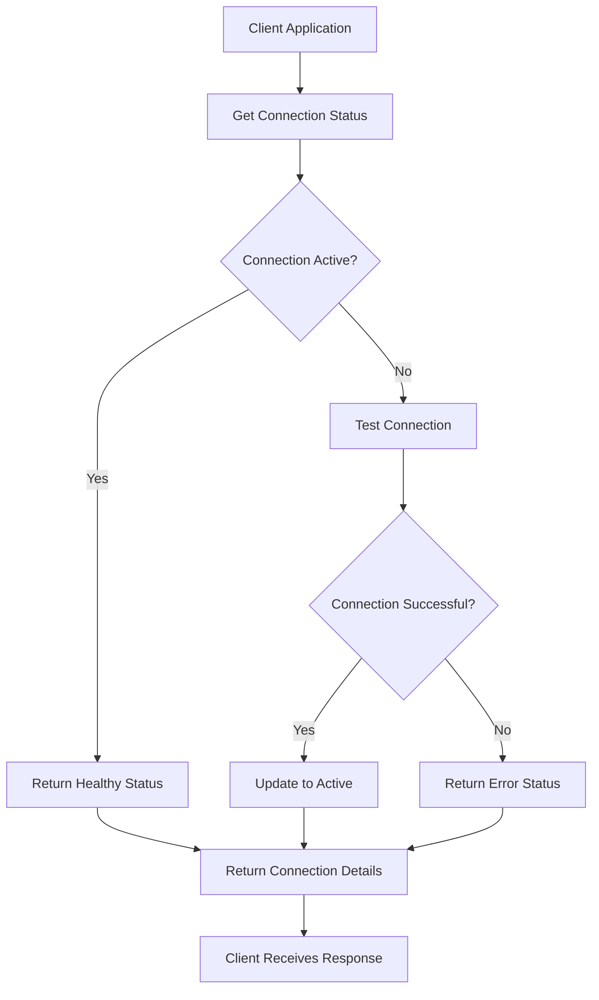
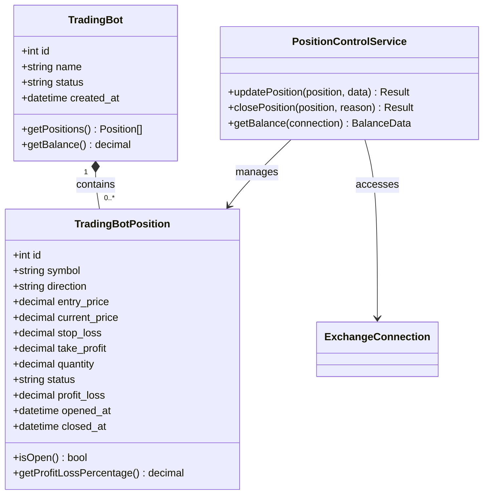
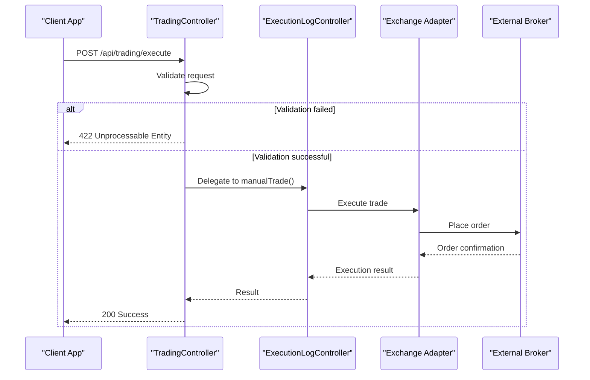
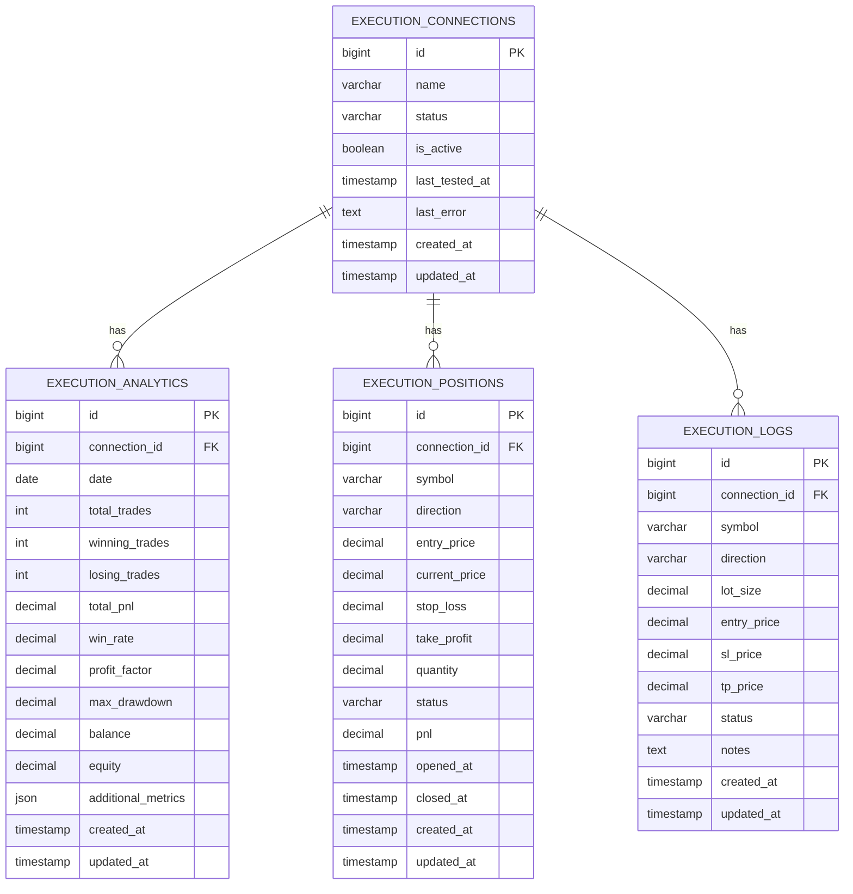

# Trading Operations

<cite>
**Referenced Files in This Document**   
- [api.php](file://main/routes/api.php)
- [TradingController.php](file://main/app/Http/Controllers/Api/User/TradingController.php)
- [PositionController.php](file://main/addons/trading-management-addon/Modules/PositionMonitoring/Controllers/Api/PositionController.php)
- [ExchangeConnectionStatusController.php](file://main/addons/trading-management-addon/Modules/ExchangeConnection/Controllers/Api/ExchangeConnectionStatusController.php)
- [ExecutionConnection.php](file://main/addons/trading-management-addon/Modules/Execution/Models/ExecutionConnection.php)
- [ExecutionPosition.php](file://main/addons/trading-management-addon/Modules/PositionMonitoring/Models/ExecutionPosition.php)
- [ExecutionLog.php](file://main/addons/trading-management-addon/Modules/Execution/Models/ExecutionLog.php)
- [HasEncryptedCredentials.php](file://main/addons/trading-management-addon/Shared/Traits/HasEncryptedCredentials.php)
- [ConnectionHealthCheck.php](file://main/addons/trading-management-addon/Shared/Traits/ConnectionHealthCheck.php)
- [trading-management.php](file://main/addons/trading-management-addon/config/trading-management.php)
- [api-reference.md](file://docs/api-reference.md)
- [trading-management-final-structure.md](file://docs/trading-management-final-structure.md)
</cite>

## Table of Contents
1. [Introduction](#introduction)
2. [API Authentication](#api-authentication)
3. [Trading Connection Management](#trading-connection-management)
4. [Position Monitoring](#position-monitoring)
5. [Trade Execution](#trade-execution)
6. [Trading Analytics](#trading-analytics)
7. [Error Handling](#error-handling)
8. [Security Considerations](#security-considerations)
9. [Example Workflows](#example-workflows)

## Introduction

The Trading Operations API provides comprehensive endpoints for managing execution connections to trading platforms, monitoring open positions, retrieving trade analytics, and executing trading commands. This API enables users to connect to external brokers like MT5, monitor their trading activities in real-time, and execute trades programmatically.

The system is built on a modular architecture with the trading-management-addon handling core trading operations. The API supports RESTful endpoints with JSON request/response formats and uses Laravel Sanctum for authentication. Key features include connection health monitoring, position management, trade execution, and comprehensive analytics.

**Section sources**
- [api-reference.md](file://docs/api-reference.md#authentication)
- [trading-management-final-structure.md](file://docs/trading-management-final-structure.md#complete-structure)

## API Authentication

The Trading Operations API uses Laravel Sanctum for authentication. All endpoints require authentication via a Bearer token in the Authorization header.

### Authentication Flow

1. Obtain an API token by authenticating with user credentials
2. Include the token in the Authorization header for subsequent requests
3. Tokens can be revoked and regenerated as needed

```
Authorization: Bearer {token}
```

The API follows standard REST conventions with appropriate HTTP status codes for responses. Rate limiting is implemented to prevent abuse, with a default limit of 60 requests per minute per IP address.

**Section sources**
- [api-reference.md](file://docs/api-reference.md#authentication)
- [trading-management.php](file://main/addons/trading-management-addon/config/trading-management.php)

## Trading Connection Management

The trading connection endpoints allow users to manage their connections to external trading platforms such as MT5, Binance, and other brokers. These connections enable the system to execute trades and retrieve position data.

### Connection Status Endpoints



**Diagram sources**
- [ExchangeConnectionStatusController.php](file://main/addons/trading-management-addon/Modules/ExchangeConnection/Controllers/Api/ExchangeConnectionStatusController.php)
- [ConnectionHealthCheck.php](file://main/addons/trading-management-addon/Shared/Traits/ConnectionHealthCheck.php)

#### Get Connection Status

**Endpoint**: `GET /api/exchange-connections/{connection}/status`

Retrieves the current status and health information for a specific exchange connection.

**Response Schema**:
```json
{
  "success": true,
  "data": {
    "connection_id": 1,
    "name": "MT5 Account",
    "status": "connected",
    "is_active": true,
    "health": "healthy",
    "is_stabilized": true,
    "last_tested_at": "2023-01-01T00:00:00.000000Z",
    "last_error": null,
    "can_fetch_data": true,
    "can_execute_trades": true,
    "can_copy_trade": true
  }
}
```

#### Test Connection

**Endpoint**: `POST /api/exchange-connections/{connection}/test`

Triggers a health check test for an exchange connection to verify connectivity and credentials.

**Response Schema**:
```json
{
  "success": true,
  "message": "Connection test successful",
  "data": {
    "connection_id": 1,
    "status": "connected",
    "is_active": true,
    "last_tested_at": "2023-01-01T00:00:00.000000Z"
  }
}
```

#### Check Connection Stabilized

**Endpoint**: `GET /api/exchange-connections/{connection}/stabilized`

Verifies if a connection is stabilized and ready for trading operations.

**Response Schema**:
```json
{
  "success": true,
  "data": {
    "connection_id": 1,
    "is_stabilized": true,
    "status": "connected",
    "is_active": true,
    "last_tested_at": "2023-01-01T00:00:00.000000Z"
  }
}
```

**Section sources**
- [ExchangeConnectionStatusController.php](file://main/addons/trading-management-addon/Modules/ExchangeConnection/Controllers/Api/ExchangeConnectionStatusController.php)
- [ConnectionHealthCheck.php](file://main/addons/trading-management-addon/Shared/Traits/ConnectionHealthCheck.php)
- [ExecutionConnection.php](file://main/addons/trading-management-addon/Modules/Execution/Models/ExecutionConnection.php)

## Position Monitoring

The position monitoring endpoints provide real-time access to open and closed positions across connected trading accounts. Users can retrieve position details, update stop-loss and take-profit levels, and close positions manually.

### Position Management Endpoints



**Diagram sources**
- [PositionController.php](file://main/addons/trading-management-addon/Modules/PositionMonitoring/Controllers/Api/PositionController.php)
- [TradingBot.php](file://main/addons/trading-management-addon/Modules/TradingBot/Models/TradingBot.php)
- [TradingBotPosition.php](file://main/addons/trading-management-addon/Modules/TradingBot/Models/TradingBotPosition.php)

#### List Positions

**Endpoint**: `GET /api/trading-bots/{bot}/positions`

Retrieves all positions for a specific trading bot.

**Response Schema**:
```json
{
  "success": true,
  "data": [
    {
      "id": 1,
      "symbol": "EUR/USD",
      "direction": "buy",
      "entry_price": "1.1000",
      "current_price": "1.1050",
      "stop_loss": "1.0950",
      "take_profit": "1.1100",
      "quantity": 0.1,
      "status": "open",
      "profit_loss": "50.00",
      "profit_loss_percentage": 5.0,
      "opened_at": "2023-01-01T00:00:00.000000Z",
      "closed_at": null
    }
  ]
}
```

#### Update Position

**Endpoint**: `PATCH /api/trading-bots/{bot}/positions/{position}`

Updates stop-loss or take-profit levels for an open position.

**Request Body**:
```json
{
  "stop_loss": 1.0950,
  "take_profit": 1.1100
}
```

**Response Schema**:
```json
{
  "success": true,
  "message": "Position updated successfully",
  "data": {
    "position": {
      "id": 1,
      "symbol": "EUR/USD",
      "direction": "buy",
      "entry_price": "1.1000",
      "current_price": "1.1050",
      "stop_loss": "1.0950",
      "take_profit": "1.1100",
      "quantity": 0.1,
      "status": "open",
      "profit_loss": "50.00",
      "profit_loss_percentage": 5.0,
      "opened_at": "2023-01-01T00:00:00.000000Z",
      "closed_at": null
    }
  }
}
```

#### Close Position

**Endpoint**: `POST /api/trading-bots/{bot}/positions/{position}/close`

Manually closes an open position.

**Response Schema**:
```json
{
  "success": true,
  "message": "Position closed successfully",
  "data": {
    "position": {
      "id": 1,
      "symbol": "EUR/USD",
      "direction": "buy",
      "entry_price": "1.1000",
      "current_price": "1.1050",
      "stop_loss": "1.0950",
      "take_profit": "1.1100",
      "quantity": 0.1,
      "status": "closed",
      "profit_loss": "50.00",
      "profit_loss_percentage": 5.0,
      "opened_at": "2023-01-01T00:00:00.000000Z",
      "closed_at": "2023-01-02T00:00:00.000000Z"
    },
    "profit_loss": "50.00"
  }
}
```

#### Get Balance

**Endpoint**: `GET /api/trading-bots/{bot}/balance`

Retrieves the current account balance for a trading bot's exchange connection.

**Response Schema**:
```json
{
  "success": true,
  "data": {
    "balance": "10000.00",
    "currency": "USD",
    "available": "9500.00",
    "in_use": "500.00"
  }
}
```

**Section sources**
- [PositionController.php](file://main/addons/trading-management-addon/Modules/PositionMonitoring/Controllers/Api/PositionController.php)
- [TradingBotPosition.php](file://main/addons/trading-management-addon/Modules/TradingBot/Models/TradingBotPosition.php)
- [PositionControlService.php](file://main/addons/trading-management-addon/Modules/PositionMonitoring/Services/PositionControlService.php)

## Trade Execution

The trade execution endpoints enable users to place manual trades through their connected exchange accounts. This functionality supports both market and limit orders with configurable stop-loss and take-profit levels.

### Trade Execution Flow



**Diagram sources**
- [TradingController.php](file://main/app/Http/Controllers/Api/User/TradingController.php)
- [ExecutionLogController.php](file://main/app/Http/Controllers/User/Trading/ExecutionLogController.php)

#### Execute Manual Trade

**Endpoint**: `POST /api/trading/execute`

Places a manual trade order through a connected exchange/broker.

**Request Body**:
```json
{
  "connection_id": 1,
  "symbol": "EURUSD",
  "direction": "BUY",
  "lot_size": 0.01,
  "order_type": "market",
  "entry_price": 1.0850,
  "sl_price": 1.0800,
  "tp_price": 1.0900,
  "notes": "Manual trade entry"
}
```

**Request Parameters**:

| Parameter | Type | Required | Description | Example |
|---------|------|----------|-------------|---------|
| connection_id | integer | Yes | The execution connection ID | 1 |
| symbol | string | Yes | Trading symbol | EURUSD |
| direction | string | Yes | Trade direction: BUY, SELL, LONG, SHORT | BUY |
| lot_size | numeric | Yes | Position size | 0.01 |
| order_type | string | Yes | Order type: market or limit | market |
| entry_price | numeric | No | Entry price (required for limit orders) | 1.0850 |
| sl_price | numeric | No | Stop loss price | 1.0800 |
| tp_price | numeric | No | Take profit price | 1.0900 |
| notes | string | No | Optional trade notes | "Manual trade entry" |

**Response Schema**:
```json
{
  "success": true,
  "message": "Trade executed successfully",
  "data": {
    "order_id": "12345",
    "symbol": "EURUSD",
    "direction": "BUY"
  }
}
```

**Section sources**
- [TradingController.php](file://main/app/Http/Controllers/Api/User/TradingController.php)
- [ExecutionLogController.php](file://main/app/Http/Controllers/User/Trading/ExecutionLogController.php)
- [ExecutionConnection.php](file://main/addons/trading-management-addon/Modules/Execution/Models/ExecutionConnection.php)

## Trading Analytics

The trading analytics endpoints provide comprehensive performance metrics and historical data for connected trading accounts. Users can retrieve execution statistics, view historical trades, and analyze performance over time.

### Analytics Data Model



**Diagram sources**
- [ExecutionAnalytic.php](file://main/addons/_deprecated/trading-execution-engine-addon/app/Models/ExecutionAnalytic.php)
- [ExecutionPosition.php](file://main/addons/trading-management-addon/Modules/PositionMonitoring/Models/ExecutionPosition.php)
- [ExecutionLog.php](file://main/addons/trading-management-addon/Modules/Execution/Models/ExecutionLog.php)

#### Get Execution Statistics

**Endpoint**: `GET /api/trading/executions?type=stats`

Retrieves trading execution statistics including active connections, open positions, and daily performance.

**Response Schema**:
```json
{
  "success": true,
  "data": {
    "active_connections": 2,
    "open_positions": 5,
    "today_executions": 12,
    "today_pnl": 150.00
  }
}
```

#### Get Execution History

**Endpoint**: `GET /api/trading/executions?type=executions`

Retrieves historical execution logs with pagination support.

**Response Schema**:
```json
{
  "success": true,
  "data": {
    "executions": [
      {
        "id": 1,
        "connection_id": 1,
        "symbol": "EURUSD",
        "direction": "BUY",
        "lot_size": 0.01,
        "entry_price": "1.1000",
        "sl_price": "1.0950",
        "tp_price": "1.1100",
        "status": "executed",
        "notes": "Signal-based trade",
        "created_at": "2023-01-01T00:00:00.000000Z"
      }
    ]
  }
}
```

#### Get Open Positions

**Endpoint**: `GET /api/trading/executions?type=open-positions`

Retrieves currently open positions across all connected accounts.

**Response Schema**:
```json
{
  "success": true,
  "data": {
    "positions": [
      {
        "id": 1,
        "connection_id": 1,
        "symbol": "EURUSD",
        "direction": "BUY",
        "entry_price": "1.1000",
        "current_price": "1.1050",
        "stop_loss": "1.0950",
        "take_profit": "1.1100",
        "quantity": 0.01,
        "status": "open",
        "pnl": 50.00,
        "opened_at": "2023-01-01T00:00:00.000000Z"
      }
    ]
  }
}
```

#### Get Closed Positions

**Endpoint**: `GET /api/trading/executions?type=closed-positions`

Retrieves historically closed positions with profit/loss information.

**Response Schema**:
```json
{
  "success": true,
  "data": {
    "positions": [
      {
        "id": 1,
        "connection_id": 1,
        "symbol": "EURUSD",
        "direction": "BUY",
        "entry_price": "1.1000",
        "exit_price": "1.1050",
        "stop_loss": "1.0950",
        "take_profit": "1.1100",
        "quantity": 0.01,
        "status": "closed",
        "pnl": 50.00,
        "opened_at": "2023-01-01T00:00:00.000000Z",
        "closed_at": "2023-01-02T00:00:00.000000Z"
      }
    ]
  }
}
```

**Section sources**
- [TradingController.php](file://main/app/Http/Controllers/Api/User/TradingController.php)
- [ExecutionAnalytic.php](file://main/addons/_deprecated/trading-execution-engine-addon/app/Models/ExecutionAnalytic.php)
- [execution_analytics.sql](file://main/addons/trading-management-addon/database/migrations/2025_01_29_100003_create_execution_analytics_table.php)

## Error Handling

The Trading Operations API implements comprehensive error handling with standardized response formats and appropriate HTTP status codes.

### Error Response Format

All error responses follow a consistent format:

```json
{
  "success": false,
  "message": "Error description",
  "errors": {
    "field_name": ["Validation error message"]
  }
}
```

### Common HTTP Status Codes

| Status Code | Meaning | Description |
|-----------|---------|-------------|
| 200 | OK | Request successful |
| 201 | Created | Resource created successfully |
| 400 | Bad Request | Invalid request parameters |
| 401 | Unauthorized | Authentication required or failed |
| 403 | Forbidden | Insufficient permissions |
| 404 | Not Found | Resource not found |
| 422 | Unprocessable Entity | Validation errors |
| 429 | Too Many Requests | Rate limit exceeded |
| 500 | Internal Server Error | Unexpected server error |

### Specific Error Examples

**Connection Not Found**:
```json
{
  "success": false,
  "message": "The requested connection was not found."
}
```

**Validation Errors**:
```json
{
  "success": false,
  "message": "Validation error",
  "errors": {
    "connection_id": ["The connection id field is required."],
    "symbol": ["The symbol field is required."]
  }
}
```

**Connection Test Failed**:
```json
{
  "success": false,
  "message": "Connection test failed: Invalid API credentials"
}
```

**Position Already Closed**:
```json
{
  "success": false,
  "message": "Position is already closed"
}
```

**Section sources**
- [api-reference.md](file://docs/api-reference.md#error-handling)
- [TradingController.php](file://main/app/Http/Controllers/Api/User/TradingController.php)
- [PositionController.php](file://main/addons/trading-management-addon/Modules/PositionMonitoring/Controllers/Api/PositionController.php)

## Security Considerations

The Trading Operations API implements multiple security measures to protect sensitive trading credentials and ensure secure communication between the platform and external brokers.

### Credential Encryption

All trading credentials are encrypted at rest using Laravel's encryption services. The `HasEncryptedCredentials` trait ensures that credentials are automatically encrypted before saving and decrypted when retrieving.

```php
trait HasEncryptedCredentials
{
    public function setCredentialsAttribute($value): void
    {
        if (is_array($value)) {
            $json = json_encode($value);
            $this->attributes['credentials'] = Crypt::encryptString($json);
        }
    }
    
    public function getCredentialsAttribute($value): array
    {
        if (empty($value)) {
            return [];
        }
        
        $decrypted = Crypt::decryptString($value);
        return json_decode($decrypted, true) ?: [];
    }
}
```

The encryption uses the application's APP_KEY, and if the key is changed, users must re-enter their credentials as the encrypted data cannot be decrypted with the new key.

### Secure Connection Testing

When testing connections, the system performs comprehensive validation without exposing sensitive information in error messages. Error logs include technical details but user-facing messages are generic to prevent information disclosure.

### Rate Limiting

API endpoints are rate-limited to prevent abuse:
- Default: 60 requests per minute per IP
- Webhooks: No rate limit (uses connection ID for identification)

Rate limit headers are included in responses:
```
X-RateLimit-Limit: 60
X-RateLimit-Remaining: 59
X-RateLimit-Reset: 1609459200
```

### Input Validation

All API endpoints implement strict input validation to prevent injection attacks and ensure data integrity. Request parameters are validated against defined rules before processing.

**Section sources**
- [HasEncryptedCredentials.php](file://main/addons/trading-management-addon/Shared/Traits/HasEncryptedCredentials.php)
- [ConnectionHealthCheck.php](file://main/addons/trading-management-addon/Shared/Traits/ConnectionHealthCheck.php)
- [trading-management.php](file://main/addons/trading-management-addon/config/trading-management.php)

## Example Workflows

This section demonstrates common workflows for using the Trading Operations API.

### Connecting to MT5 Account

```bash
# 1. Test connection status
curl -X GET https://yourdomain.com/api/exchange-connections/1/status \
  -H "Authorization: Bearer {token}"

# 2. If connection needs testing, trigger a test
curl -X POST https://yourdomain.com/api/exchange-connections/1/test \
  -H "Authorization: Bearer {token}"

# 3. Verify connection is stabilized
curl -X GET https://yourdomain.com/api/exchange-connections/1/stabilized \
  -H "Authorization: Bearer {token}"
```

### Retrieving Current Positions

```bash
# Get all open positions
curl -X GET "https://yourdomain.com/api/trading/executions?type=open-positions" \
  -H "Authorization: Bearer {token}"

# Get position details for a specific trading bot
curl -X GET https://yourdomain.com/api/trading-bots/1/positions \
  -H "Authorization: Bearer {token}"
```

### Executing a Trade

```bash
# Execute a market buy order
curl -X POST https://yourdomain.com/api/trading/execute \
  -H "Authorization: Bearer {token}" \
  -H "Content-Type: application/json" \
  -d '{
    "connection_id": 1,
    "symbol": "EURUSD",
    "direction": "BUY",
    "lot_size": 0.01,
    "order_type": "market",
    "sl_price": 1.0800,
    "tp_price": 1.1100,
    "notes": "Manual trade entry"
  }'
```

### Viewing Execution Analytics

```bash
# Get daily execution statistics
curl -X GET "https://yourdomain.com/api/trading/executions?type=stats" \
  -H "Authorization: Bearer {token}"

# Get execution history
curl -X GET "https://yourdomain.com/api/trading/executions?type=executions&page=1" \
  -H "Authorization: Bearer {token}"

# Get closed positions
curl -X GET "https://yourdomain.com/api/trading/executions?type=closed-positions" \
  -H "Authorization: Bearer {token}"
```

**Section sources**
- [api-reference.md](file://docs/api-reference.md#examples)
- [trading-management-final-structure.md](file://docs/trading-management-final-structure.md#complete-structure)
- [TradingController.php](file://main/app/Http/Controllers/Api/User/TradingController.php)