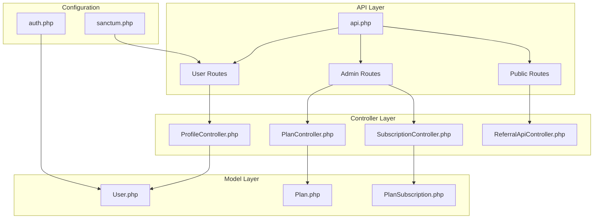
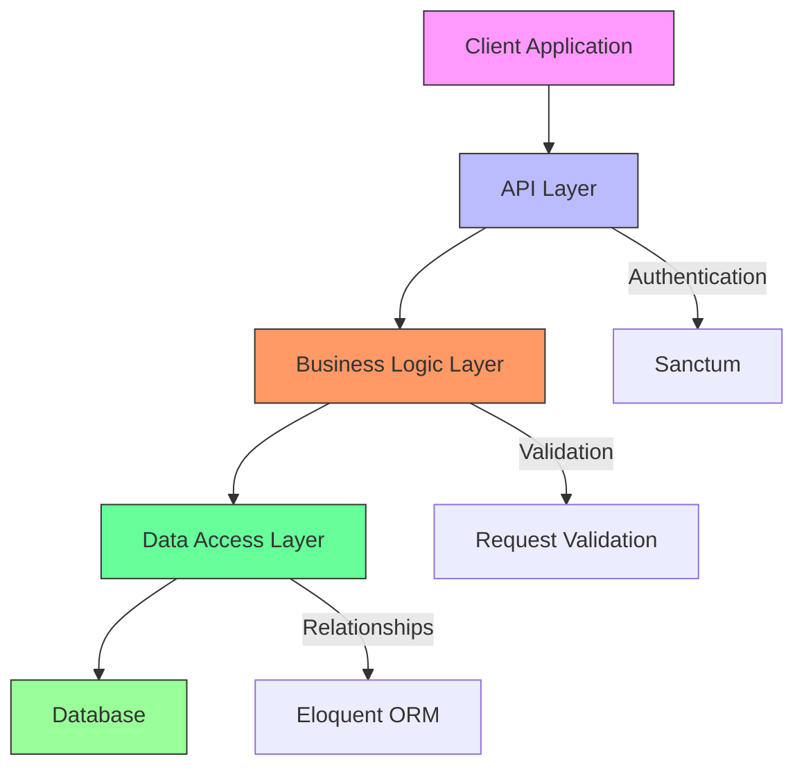
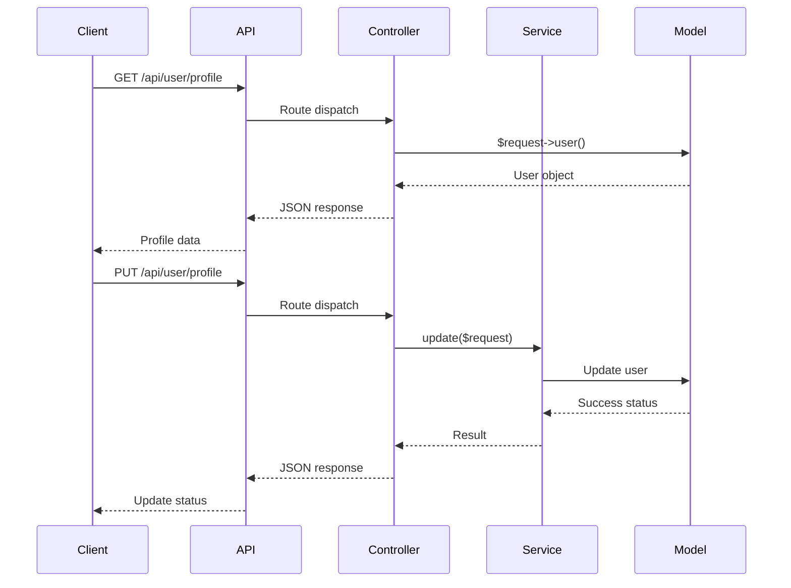
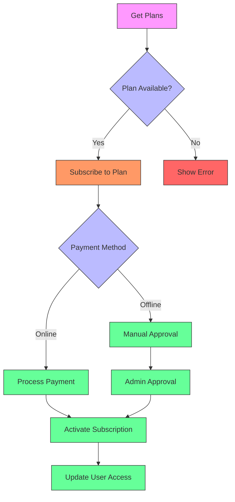
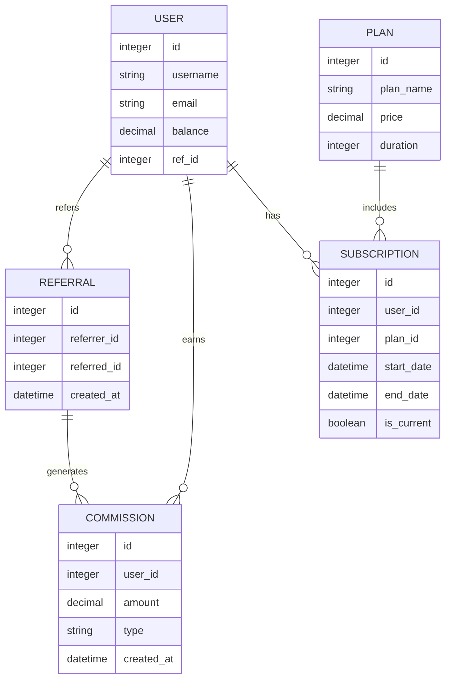
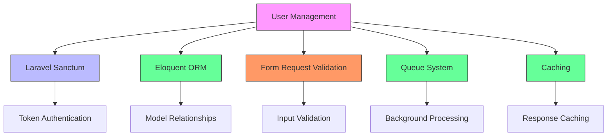

# User Management

<cite>
**Referenced Files in This Document**   
- [api.php](file://main/routes/api.php)
- [ProfileController.php](file://main/app/Http/Controllers/Api/User/ProfileController.php)
- [PlanController.php](file://main/app/Http/Controllers/Api/User/PlanController.php)
- [SubscriptionController.php](file://main/app/Http/Controllers/Api/User/SubscriptionController.php)
- [ReferralApiController.php](file://main/app/Http/Controllers/Api/User/ReferralApiController.php)
- [User.php](file://main/app/Models/User.php)
- [Plan.php](file://main/app/Models/Plan.php)
- [sanctum.php](file://main/config/sanctum.php)
- [auth.php](file://main/config/auth.php)
</cite>

## Table of Contents
1. [Introduction](#introduction)
2. [Project Structure](#project-structure)
3. [Core Components](#core-components)
4. [Architecture Overview](#architecture-overview)
5. [Detailed Component Analysis](#detailed-component-analysis)
6. [Dependency Analysis](#dependency-analysis)
7. [Performance Considerations](#performance-considerations)
8. [Troubleshooting Guide](#troubleshooting-guide)
9. [Conclusion](#conclusion)

## Introduction
This document provides comprehensive API documentation for user management endpoints in the trading platform. The system offers RESTful APIs for retrieving user profile information, updating user preferences, managing subscription plans, and handling referral data. The APIs are secured using Laravel Sanctum tokens and follow standard REST conventions with proper HTTP methods, URL patterns, and response schemas.

The platform supports multiple user roles including regular users and administrators, with role-based access control for different endpoints. User data privacy is maintained through secure authentication, rate limiting, and proper data handling practices. The system also includes comprehensive subscription management with various plan types and referral tracking capabilities.

## Project Structure
The project follows a standard Laravel MVC architecture with clear separation of concerns. The API routes are defined in the `routes/api.php` file, while controllers are located in the `app/Http/Controllers/Api/User` directory. Models are stored in the `app/Models` directory, and configuration files are in the `config` directory.

**Diagram sources**
- [api.php](file://main/routes/api.php)
- [ProfileController.php](file://main/app/Http/Controllers/Api/User/ProfileController.php)
- [PlanController.php](file://main/app/Http/Controllers/Api/User/PlanController.php)
- [SubscriptionController.php](file://main/app/Http/Controllers/Api/User/SubscriptionController.php)
- [ReferralApiController.php](file://main/app/Http/Controllers/Api/User/ReferralApiController.php)
- [User.php](file://main/app/Models/User.php)
- [Plan.php](file://main/app/Models/Plan.php)
- [sanctum.php](file://main/config/sanctum.php)
- [auth.php](file://main/config/auth.php)

**Section sources**
- [api.php](file://main/routes/api.php)
- [ProfileController.php](file://main/app/Http/Controllers/Api/User/ProfileController.php)
- [PlanController.php](file://main/app/Http/Controllers/Api/User/PlanController.php)

## Core Components
The user management system consists of several core components that handle different aspects of user data and functionality. The ProfileController manages user profile information including personal details and preferences. The PlanController handles subscription plans and their features. The SubscriptionController manages user subscriptions and their lifecycle. The ReferralApiController handles referral tracking and statistics.

These components work together to provide a comprehensive user management system that supports profile management, subscription handling, and referral tracking. The system uses Laravel's Eloquent ORM for database interactions and follows RESTful principles for API design.

**Section sources**
- [ProfileController.php](file://main/app/Http/Controllers/Api/User/ProfileController.php)
- [PlanController.php](file://main/app/Http/Controllers/Api/User/PlanController.php)
- [SubscriptionController.php](file://main/app/Http/Controllers/Api/User/SubscriptionController.php)
- [ReferralApiController.php](file://main/app/Http/Controllers/Api/User/ReferralApiController.php)

## Architecture Overview
The user management architecture follows a layered approach with clear separation between the API layer, business logic layer, and data access layer. The API layer handles HTTP requests and responses, the business logic layer processes the requests and enforces business rules, and the data access layer interacts with the database.

**Diagram sources**
- [api.php](file://main/routes/api.php)
- [ProfileController.php](file://main/app/Http/Controllers/Api/User/ProfileController.php)
- [PlanController.php](file://main/app/Http/Controllers/Api/User/PlanController.php)
- [User.php](file://main/app/Models/User.php)
- [sanctum.php](file://main/config/sanctum.php)

## Detailed Component Analysis

### User Profile Management
The user profile management component handles retrieval and updating of user profile information. It provides endpoints for getting the current user's profile and updating their personal information.

**Diagram sources**
- [api.php](file://main/routes/api.php)
- [ProfileController.php](file://main/app/Http/Controllers/Api/User/ProfileController.php)
- [UserProfileService.php](file://main/app/Services/UserProfileService.php)
- [User.php](file://main/app/Models/User.php)

**Section sources**
- [ProfileController.php](file://main/app/Http/Controllers/Api/User/ProfileController.php)
- [User.php](file://main/app/Models/User.php)

### Subscription Management
The subscription management component handles user subscriptions to different service plans. It provides endpoints for listing available plans, subscribing to plans, and managing subscription history.

**Diagram sources**
- [api.php](file://main/routes/api.php)
- [PlanController.php](file://main/app/Http/Controllers/Api/User/PlanController.php)
- [UserPlanService.php](file://main/app/Services/UserPlanService.php)
- [Plan.php](file://main/app/Models/Plan.php)
- [PlanSubscription.php](file://main/app/Models/PlanSubscription.php)

**Section sources**
- [PlanController.php](file://main/app/Http/Controllers/Api/User/PlanController.php)
- [Plan.php](file://main/app/Models/Plan.php)
- [PlanSubscription.php](file://main/app/Models/PlanSubscription.php)

### Referral System
The referral system component tracks user referrals and calculates referral statistics. It provides endpoints for retrieving referral information and statistics.

**Diagram sources**
- [ReferralApiController.php](file://main/app/Http/Controllers/Api/User/ReferralApiController.php)
- [User.php](file://main/app/Models/User.php)
- [Referral.php](file://main/app/Models/Referral.php)
- [ReferralCommission.php](file://main/app/Models/ReferralCommission.php)

**Section sources**
- [ReferralApiController.php](file://main/app/Http/Controllers/Api/User/ReferralApiController.php)
- [User.php](file://main/app/Models/User.php)

## Dependency Analysis
The user management system has several key dependencies that enable its functionality. The primary dependency is Laravel Sanctum for API authentication, which provides token-based authentication for API endpoints. The system also depends on Laravel's Eloquent ORM for database interactions and relationship management.

**Diagram sources**
- [sanctum.php](file://main/config/sanctum.php)
- [User.php](file://main/app/Models/User.php)
- [ProfileController.php](file://main/app/Http/Controllers/Api/User/ProfileController.php)
- [PlanController.php](file://main/app/Http/Controllers/Api/User/PlanController.php)

**Section sources**
- [sanctum.php](file://main/config/sanctum.php)
- [User.php](file://main/app/Models/User.php)

## Performance Considerations
The user management system includes several performance optimizations to ensure responsive API endpoints. The system uses Laravel's built-in caching mechanisms to cache frequently accessed data such as user profiles and subscription information. Database queries are optimized using eager loading to prevent N+1 query problems.

Rate limiting is implemented to prevent abuse of API endpoints, with different limits for different types of requests. The system also uses query monitoring middleware to track and optimize database queries. For high-traffic endpoints, response caching is implemented to reduce database load.

**Section sources**
- [Kernel.php](file://main/app/Http/Kernel.php)
- [QueueMonitoringMiddleware.php](file://main/app/Http/Middleware/QueueMonitoringMiddleware.php)
- [CacheResponseMiddleware.php](file://main/app/Http/Middleware/CacheResponseMiddleware.php)

## Troubleshooting Guide
Common issues with the user management API typically relate to authentication, authorization, and data validation. For authentication issues, ensure that valid Sanctum tokens are included in requests. For authorization issues, verify that the user has the required permissions for the requested operation.

When encountering validation errors, check that all required fields are present and correctly formatted. For subscription-related issues, verify that the requested plan exists and is active. For referral system issues, ensure that the referral relationships are properly established in the database.

**Section sources**
- [ProfileController.php](file://main/app/Http/Controllers/Api/User/ProfileController.php)
- [PlanController.php](file://main/app/Http/Controllers/Api/User/PlanController.php)
- [ReferralApiController.php](file://main/app/Http/Controllers/Api/User/ReferralApiController.php)

## Conclusion
The user management system provides a comprehensive set of APIs for handling user profiles, subscriptions, and referrals. The system is secured with Laravel Sanctum tokens and follows RESTful principles for API design. The architecture is well-structured with clear separation of concerns between components.

The system includes robust error handling, data validation, and security features to protect user data. Performance optimizations such as caching and query optimization ensure responsive API endpoints even under heavy load. The referral system provides comprehensive tracking and reporting capabilities for user referrals and commissions.