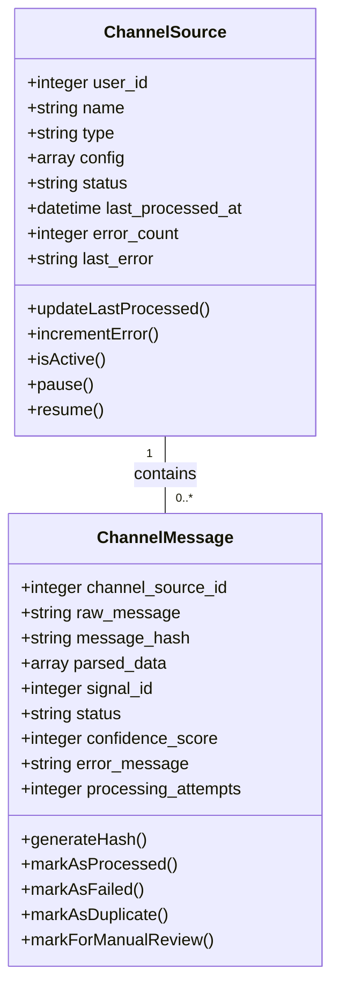
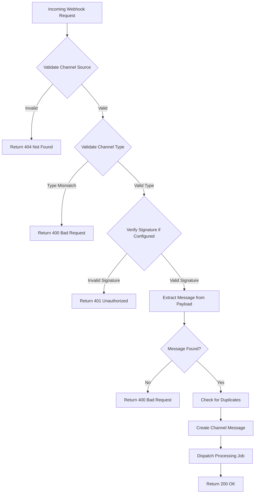
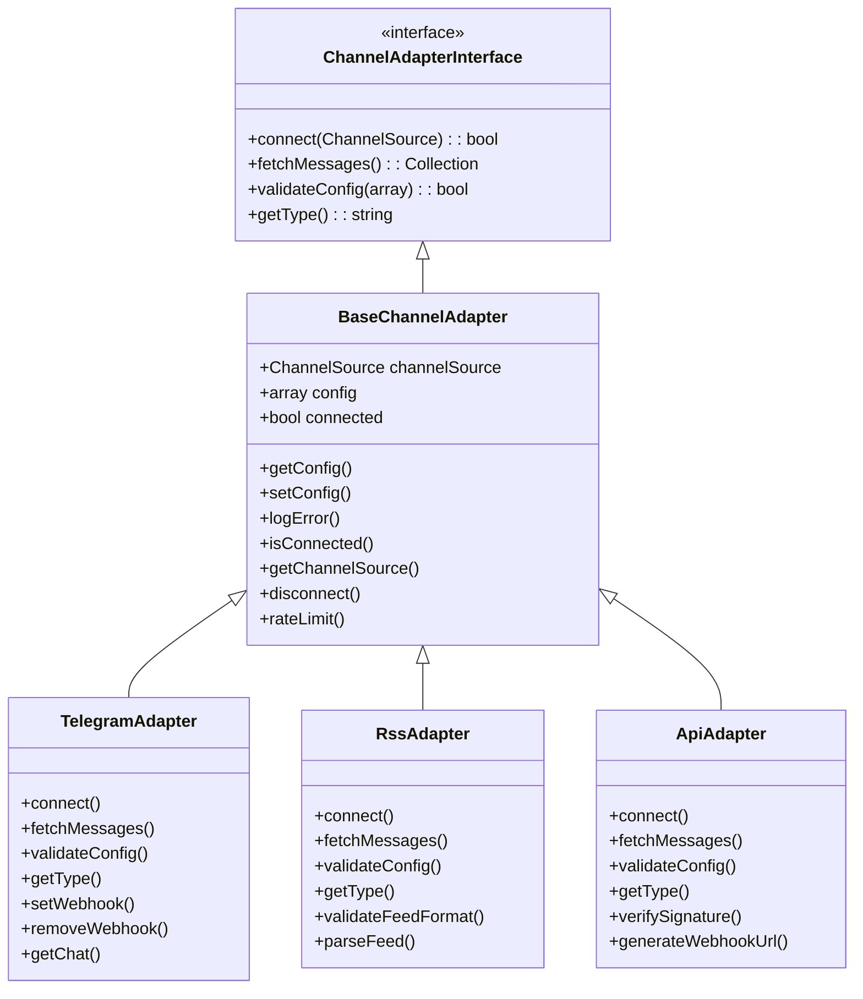
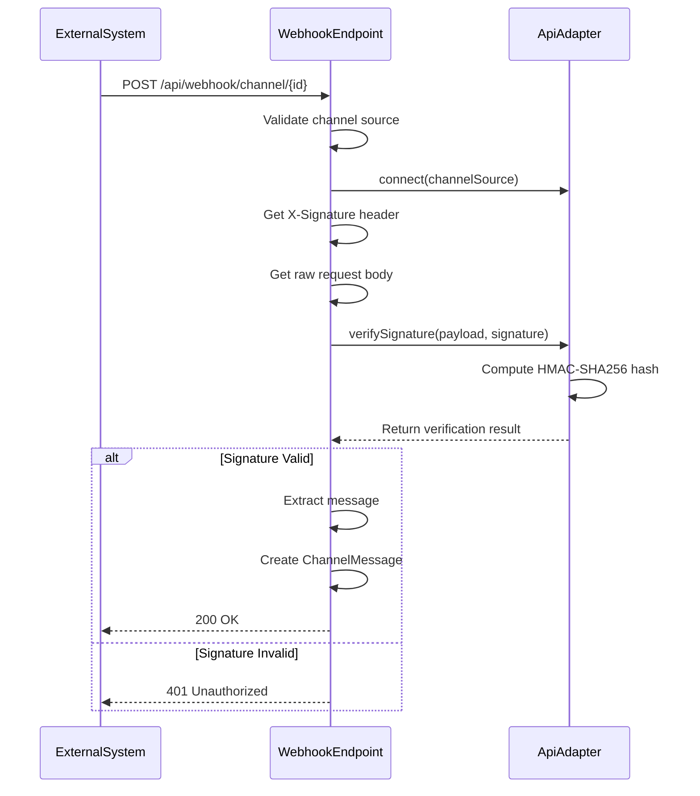
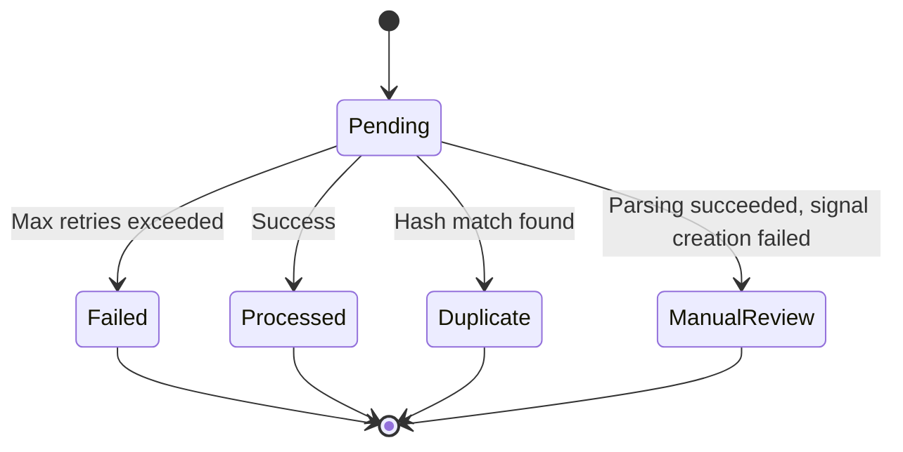

# Webhooks

<cite>
**Referenced Files in This Document**   
- [api.php](file://main/routes/api.php)
- [TelegramWebhookController.php](file://main/app/Http/Controllers/Api/TelegramWebhookController.php)
- [ApiWebhookController.php](file://main/app/Http/Controllers/Api/ApiWebhookController.php)
- [TelegramAdapter.php](file://main/app/Adapters/TelegramAdapter.php)
- [RssAdapter.php](file://main/app/Adapters/RssAdapter.php)
- [ApiAdapter.php](file://main/app/Adapters/ApiAdapter.php)
- [BaseChannelAdapter.php](file://main/app/Adapters/BaseChannelAdapter.php)
- [ProcessChannelMessage.php](file://main/app/Jobs/ProcessChannelMessage.php)
- [ChannelMessage.php](file://main/app/Models/ChannelMessage.php)
- [ChannelSource.php](file://main/app/Models/ChannelSource.php)
- [ParsingPipeline.php](file://main/app/Parsers/ParsingPipeline.php)
</cite>

## Table of Contents
1. [Introduction](#introduction)
2. [Webhook Configuration](#webhook-configuration)
3. [Webhook Endpoints](#webhook-endpoints)
4. [Message Processing Pipeline](#message-processing-pipeline)
5. [Signature Verification](#signature-verification)
6. [Error Handling and Retry Mechanisms](#error-handling-and-retry-mechanisms)
7. [Rate Limiting and Security](#rate-limiting-and-security)
8. [Payload Examples](#payload-examples)
9. [Best Practices](#best-practices)

## Introduction

This document provides comprehensive API documentation for webhook endpoints in the trading signal ingestion system. The system supports multiple channel types including Telegram, RSS feeds, and custom API integrations for receiving trading signals from external sources. Webhooks are used to receive real-time updates and process them as trading signals within the platform.

The webhook system is designed to be secure, reliable, and flexible, allowing users to connect various external sources to automatically ingest trading signals. Each webhook endpoint uses a channel source ID for identification and authentication, eliminating the need for traditional API keys while maintaining security through proper validation and signature verification.

**Section sources**
- [api.php](file://main/routes/api.php#L478-L479)

## Webhook Configuration

Webhook configuration is managed through the `ChannelSource` model, which stores configuration details for each channel source. The configuration is encrypted at rest and contains adapter-specific settings.

For Telegram channels, the configuration includes:
- `bot_token`: The Telegram bot token used for API authentication
- `chat_id`: The ID of the Telegram channel or group to monitor
- `last_update_id`: The last processed update ID to prevent duplicates

For API webhooks, the configuration includes:
- `secret_key`: Optional secret key for HMAC signature verification
- `webhook_url`: The generated webhook URL (read-only)

For RSS feeds, the configuration includes:
- `feed_url`: The URL of the RSS/Atom feed
- `last_processed_item_id`: The ID of the last processed feed item
- `last_processed_date`: The publication date of the last processed item

Channel sources can be in one of several states: active, paused, or error. After 10 consecutive errors, a channel is automatically marked as "error" state to prevent continuous failure processing.



**Diagram sources **
- [ChannelSource.php](file://main/app/Models/ChannelSource.php#L16-L36)
- [ChannelMessage.php](file://main/app/Models/ChannelMessage.php#L16-L32)

**Section sources**
- [ChannelSource.php](file://main/app/Models/ChannelSource.php#L89-L114)
- [ChannelMessage.php](file://main/app/Models/ChannelMessage.php#L53-L70)

## Webhook Endpoints

The system provides two main webhook endpoints for receiving external signals:

### Telegram Webhook Endpoint
```
POST /api/webhook/telegram/{channelSourceId}
```

This endpoint receives updates from Telegram bots when messages are posted to monitored channels or groups. The channel source ID is passed as a URL parameter for identification.

### Generic API Webhook Endpoint
```
POST /api/webhook/channel/{channelSourceId}
```

This endpoint receives signals from custom API integrations and external providers. It supports signature verification for security.

Both endpoints are publicly accessible and do not require authentication headers, as the channel source ID serves as the primary identifier. The endpoints validate the channel source existence and type before processing the payload.



**Diagram sources **
- [api.php](file://main/routes/api.php#L478-L479)
- [ApiWebhookController.php](file://main/app/Http/Controllers/Api/ApiWebhookController.php#L58-L126)
- [TelegramWebhookController.php](file://main/app/Http/Controllers/Api/TelegramWebhookController.php#L38-L53)

**Section sources**
- [api.php](file://main/routes/api.php#L478-L479)
- [ApiWebhookController.php](file://main/app/Http/Controllers/Api/ApiWebhookController.php#L58-L136)
- [TelegramWebhookController.php](file://main/app/Http/Controllers/Api/TelegramWebhookController.php#L38-L59)

## Message Processing Pipeline

The message processing pipeline handles the transformation of raw webhook payloads into actionable trading signals through a series of well-defined steps.

### Processing Workflow

1. **Webhook Reception**: The webhook controller receives the HTTP request and validates the channel source
2. **Payload Extraction**: The message content is extracted from various possible payload locations
3. **Duplicate Detection**: A SHA-256 hash is generated from the message content to prevent duplicate processing
4. **Message Creation**: A ChannelMessage record is created with status "pending"
5. **Job Dispatch**: A ProcessChannelMessage job is dispatched to handle parsing and signal creation
6. **Parsing**: The ParsingPipeline processes the raw message using configured parsers
7. **Signal Creation**: Valid parsed data is used to create a trading signal
8. **Status Update**: The channel message status is updated based on processing outcome

### Channel Adapters

The system uses adapter pattern to handle different channel types:



**Diagram sources **
- [BaseChannelAdapter.php](file://main/app/Adapters/BaseChannelAdapter.php#L15-L156)
- [TelegramAdapter.php](file://main/app/Adapters/TelegramAdapter.php#L11-L286)
- [RssAdapter.php](file://main/app/Adapters/RssAdapter.php#L10-L281)
- [ApiAdapter.php](file://main/app/Adapters/ApiAdapter.php#L10-L118)

**Section sources**
- [ProcessChannelMessage.php](file://main/app/Jobs/ProcessChannelMessage.php#L54-L110)
- [ParsingPipeline.php](file://main/app/Parsers/ParsingPipeline.php)
- [BaseChannelAdapter.php](file://main/app/Adapters/BaseChannelAdapter.php#L138-L156)

## Signature Verification

The system implements HMAC-SHA256 signature verification for API webhook endpoints to ensure payload integrity and authenticity.

### Verification Process

1. The API adapter checks for signature in either `X-Signature` or `Signature` header
2. If a secret key is configured for the channel source, signature verification is mandatory
3. The system computes HMAC-SHA256 hash of the raw request body using the secret key
4. The computed hash is compared with the provided signature using `hash_equals()` for timing attack protection
5. If signatures don't match, a 401 Unauthorized response is returned

When no secret key is configured, signature verification is skipped, allowing for simple webhook integration without security requirements.



**Diagram sources **
- [ApiAdapter.php](file://main/app/Adapters/ApiAdapter.php#L93-L106)
- [ApiWebhookController.php](file://main/app/Http/Controllers/Api/ApiWebhookController.php#L77-L90)

**Section sources**
- [ApiAdapter.php](file://main/app/Adapters/ApiAdapter.php#L93-L106)
- [ApiWebhookController.php](file://main/app/Http/Controllers/Api/ApiWebhookController.php#L77-L90)

## Error Handling and Retry Mechanisms

The webhook system implements comprehensive error handling and retry mechanisms to ensure reliable message processing.

### Error States

Channel messages can have the following status states:
- **pending**: Message received, awaiting processing
- **processed**: Message successfully processed and signal created
- **failed**: Processing failed after maximum retries
- **duplicate**: Message is a duplicate of a previously processed message
- **manual_review**: Message parsed but requires manual review

### Retry Strategy

The `ProcessChannelMessage` job implements a retry mechanism with the following configuration:
- Maximum of 3 attempts
- 300-second timeout per execution
- Automatic retry on exception

When a processing attempt fails, the job throws an exception which triggers the queue system to retry according to the configured policy. After the maximum number of attempts, the job's `failed()` method is called, marking the message as failed.

### Error Logging

All webhook processing errors are logged with detailed context:
- Exception message and stack trace
- Channel source ID and name
- Request IP address
- Full request payload (for debugging)

Channel sources automatically track error counts and transition to "error" status after 10 consecutive errors, preventing continuous failure processing.



**Diagram sources **
- [ProcessChannelMessage.php](file://main/app/Jobs/ProcessChannelMessage.php#L16-L31)
- [ChannelMessage.php](file://main/app/Models/ChannelMessage.php#L74-L126)
- [ChannelSource.php](file://main/app/Models/ChannelSource.php#L184-L196)

**Section sources**
- [ProcessChannelMessage.php](file://main/app/Jobs/ProcessChannelMessage.php#L102-L110)
- [ChannelMessage.php](file://main/app/Models/ChannelMessage.php#L143-L151)
- [ChannelSource.php](file://main/app/Models/ChannelSource.php#L184-L196)

## Rate Limiting and Security

The webhook system implements several security measures to protect against abuse and ensure system stability.

### Security Considerations

1. **Channel Source Identification**: Each webhook uses a unique channel source ID instead of traditional API keys, reducing the risk of key leakage
2. **Signature Verification**: Optional HMAC-SHA256 signature verification ensures payload authenticity
3. **Input Validation**: All incoming data is validated before processing
4. **Rate Monitoring**: Error counts are tracked per channel source to detect potential abuse
5. **Automatic Pausing**: Channels with excessive errors are automatically paused

### Rate Limiting

While the webhook endpoints themselves don't implement rate limiting, the system protects against abuse through:
- Duplicate detection using message hashing
- Channel-level error tracking and automatic pausing
- Queue-based processing that naturally throttles high-volume sources
- Database constraints on message creation frequency

For high-volume integrations, it's recommended to implement client-side rate limiting to avoid overwhelming the system.

### Best Security Practices

1. Use strong, randomly generated secret keys for signature verification
2. Monitor channel error rates and investigate unusual patterns
3. Regularly rotate secret keys for API webhooks
4. Use HTTPS for all webhook communications
5. Validate and sanitize all incoming message content
6. Implement IP allowlisting if the external system has static IPs

**Section sources**
- [ApiWebhookController.php](file://main/app/Http/Controllers/Api/ApiWebhookController.php#L77-L90)
- [ChannelSource.php](file://main/app/Models/ChannelSource.php#L184-L196)
- [ApiAdapter.php](file://main/app/Adapters/ApiAdapter.php#L93-L106)

## Payload Examples

### Telegram Webhook Payload

```json
{
  "update_id": 123456789,
  "message": {
    "message_id": 123,
    "from": {
      "id": 987654321,
      "is_bot": false,
      "first_name": "John",
      "username": "johndoe"
    },
    "chat": {
      "id": -1001234567890,
      "title": "Trading Signals",
      "type": "supergroup"
    },
    "date": 1700000000,
    "text": "EUR/USD BUY 1.1000 SL 1.0950 TP 1.1100"
  }
}
```

### RSS Feed Structure

```xml
<?xml version="1.0" encoding="UTF-8"?>
<rss version="2.0">
  <channel>
    <title>Trading Signals Feed</title>
    <link>https://example.com</link>
    <description>Automated trading signals</description>
    <item>
      <title>EUR/USD Technical Analysis</title>
      <link>https://example.com/signal/123</link>
      <description>
        EUR/USD showing bullish pattern. Entry: 1.1000, Stop Loss: 1.0950, Take Profit: 1.1100
      </description>
      <pubDate>Wed, 15 Nov 2023 10:00:00 GMT</pubDate>
      <guid>signal-123</guid>
    </item>
  </channel>
</rss>
```

### Custom Signal Format

```json
{
  "message": "BTC/USD LONG 35000 SL 34000 TP 38000",
  "timestamp": "2023-11-15T10:00:00Z",
  "source": "technical_analysis_bot",
  "confidence": 0.85
}
```

Alternative field names accepted for message content:
- `text`
- `content`
- `body`
- `signal`
- `data`

The system accepts payloads in JSON, form data, or raw text format, extracting the message content from the most appropriate field.

**Section sources**
- [ApiWebhookController.php](file://main/app/Http/Controllers/Api/ApiWebhookController.php#L145-L180)
- [RssAdapter.php](file://main/app/Adapters/RssAdapter.php#L99-L103)

## Best Practices

### Securing Webhook Endpoints

1. **Use Signature Verification**: Always configure a secret key for API webhooks to prevent unauthorized access
2. **Monitor Webhook Activity**: Regularly review processing logs for unusual patterns or high error rates
3. **Implement IP Filtering**: If your external system has static IPs, consider implementing IP-based access controls at the network level
4. **Rotate Credentials**: Regularly rotate bot tokens and secret keys as part of security hygiene
5. **Use HTTPS**: Ensure all webhook communications occur over encrypted connections

### Validating Incoming Data

1. **Implement Message Validation**: Use the parsing pipeline to validate message structure and content
2. **Sanitize Input**: Clean and normalize message content to prevent injection attacks
3. **Validate Trading Parameters**: Ensure price levels, stop losses, and take profits are within reasonable bounds
4. **Check Market Availability**: Verify that referenced currency pairs or assets are supported
5. **Rate Limit Processing**: Monitor message frequency to detect potential spam or system errors

### Configuration Recommendations

1. **Set Appropriate Confidence Thresholds**: Configure auto-publish confidence thresholds based on your risk tolerance
2. **Configure Default Settings**: Set default plans, markets, and timeframes for each channel source
3. **Monitor Error Counts**: Regularly check channel error counts and address issues promptly
4. **Test Webhook Integration**: Use test endpoints to validate configuration before going live
5. **Document Channel Purpose**: Use descriptive names and documentation for each channel source

### Testing Webhooks

To test webhook integrations locally, use tools like ngrok to expose your development server:

```bash
ngrok http 8000
```

Then configure your external system to send requests to the ngrok URL. For Telegram bot testing:

```bash
curl -X POST https://api.telegram.org/bot{TOKEN}/setWebhook \
  -d url=https://your-ngrok-url.ngrok.io/api/webhook/telegram/1
```

**Section sources**
- [ApiAdapter.php](file://main/app/Adapters/ApiAdapter.php#L93-L106)
- [ChannelSource.php](file://main/app/Models/ChannelSource.php#L25-L28)
- [docs/api-reference.md](file://docs/api-reference.md#L528-L541)