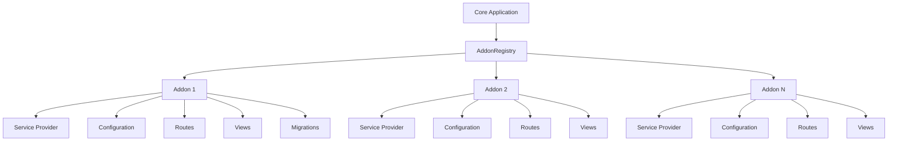
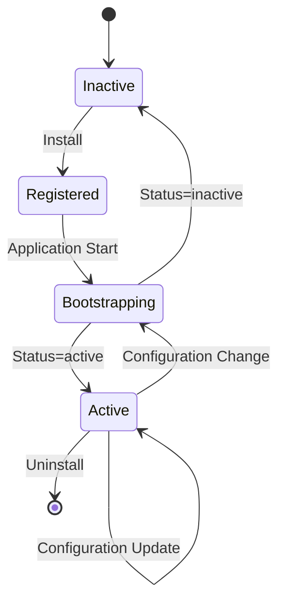
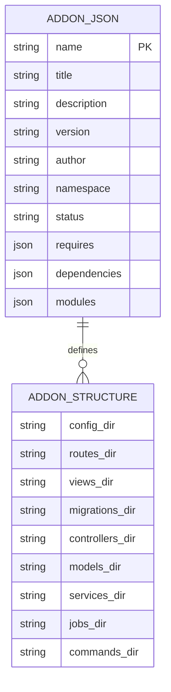
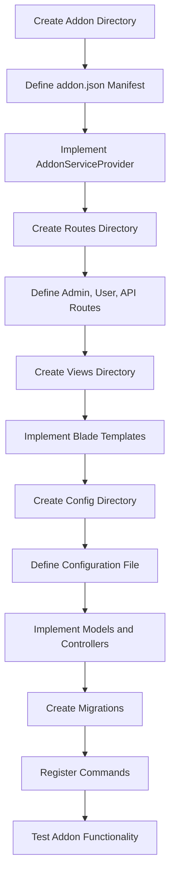
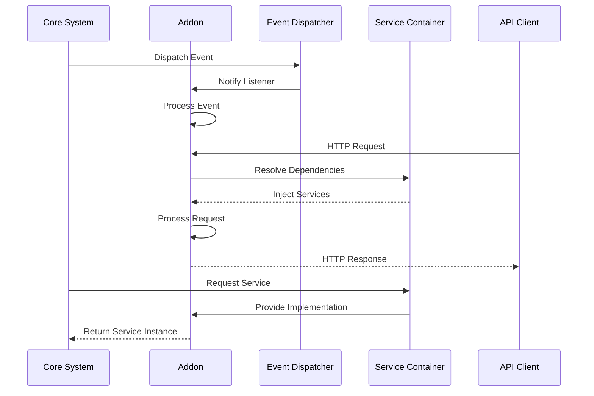
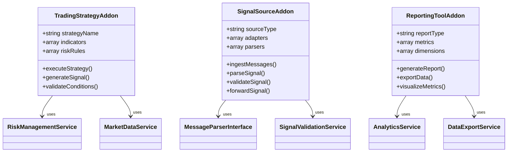
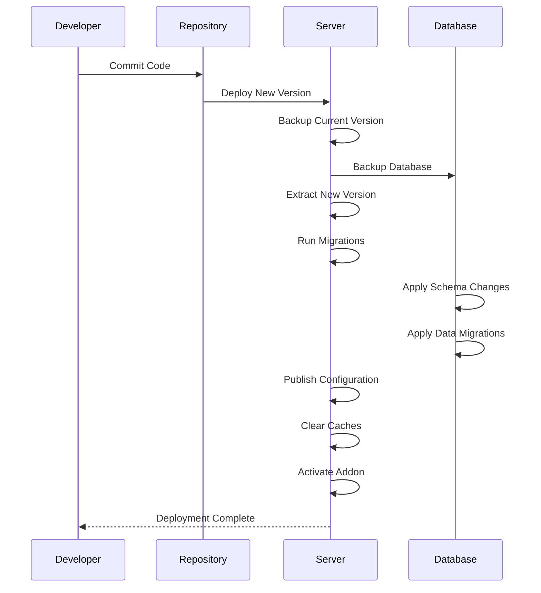
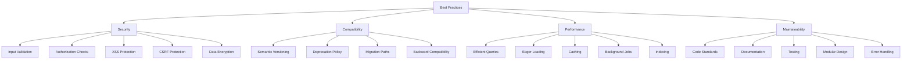

# Addon Development

<cite>
**Referenced Files in This Document**   
- [addon.json](file://main/addons/trading-management-addon/addon.json)
- [AddonServiceProvider.php](file://main/addons/trading-management-addon/AddonServiceProvider.php)
- [AddonServiceProvider.php](file://main/addons/multi-channel-signal-addon/AddonServiceProvider.php)
- [AddonServiceProvider.php](file://main/addons/_deprecated/ai-trading-addon/AddonServiceProvider.php)
- [addon.json](file://main/addons/multi-channel-signal-addon/addon.json)
- [addon.json](file://main/addons/_deprecated/ai-trading-addon/addon.json)
- [AddonRegistry.php](file://main/app/Support/AddonRegistry.php)
- [trading-management.php](file://main/addons/trading-management-addon/config/trading-management.php)
- [admin.php](file://main/addons/trading-management-addon/routes/admin.php)
- [api.php](file://main/addons/trading-management-addon/routes/api.php)
- [admin.php](file://main/addons/multi-channel-signal-addon/routes/admin.php)
- [api.php](file://main/addons/multi-channel-signal-addon/routes/api.php)
</cite>

## Table of Contents
1. [Introduction](#introduction)
2. [Addon System Architecture](#addon-system-architecture)
3. [Addon Lifecycle Management](#addon-lifecycle-management)
4. [Addon Structure](#addon-structure)
5. [Creating a New Addon](#creating-a-new-addon)
6. [Integration Patterns](#integration-patterns)
7. [Common Addon Types](#common-addon-types)
8. [Testing Methodologies](#testing-methodologies)
9. [Deployment and Version Management](#deployment-and-version-management)
10. [Best Practices](#best-practices)

## Introduction

This document provides comprehensive guidance for developing custom addons within the trading platform ecosystem. The addon system enables extensibility for core trading functionalities including signal processing, risk management, execution engines, and AI analysis. Addons follow a modular architecture that allows for independent development, testing, and deployment while maintaining integration with the core system through well-defined interfaces.

The platform supports various addon types that extend trading capabilities, from signal ingestion from multiple channels to advanced AI-powered trading strategies and reporting tools. This documentation covers the complete development lifecycle from initial setup to deployment, including architectural patterns, integration methods, and best practices for maintaining backward compatibility and security.

## Addon System Architecture

The addon system follows a modular service-oriented architecture where each addon operates as an independent component with well-defined interfaces to the core system. The architecture is built on Laravel's service provider pattern, allowing addons to register routes, views, configurations, migrations, and event listeners dynamically.

Addons are organized in the `main/addons/` directory with each addon having its own subdirectory containing all necessary components. The core architectural elements include:

- **Service Providers**: Each addon has an `AddonServiceProvider` that bootstraps the addon by registering routes, views, configurations, and other services
- **Module System**: Addons can be composed of multiple modules that can be enabled or disabled independently
- **Dependency Management**: Addons declare dependencies on PHP versions, Laravel versions, and other addons
- **Namespace Isolation**: Each addon has its own PHP namespace to prevent naming conflicts

The AddonRegistry class serves as the central registry for all addons, providing methods to check addon status, module availability, and retrieve manifest information. This registry enables dynamic discovery and management of addons at runtime.

**Diagram sources**
- [AddonRegistry.php](file://main/app/Support/AddonRegistry.php)
- [AddonServiceProvider.php](file://main/addons/trading-management-addon/AddonServiceProvider.php)

**Section sources**
- [AddonRegistry.php](file://main/app/Support/AddonRegistry.php)
- [AddonServiceProvider.php](file://main/addons/trading-management-addon/AddonServiceProvider.php)

## Addon Lifecycle Management

Addon lifecycle management is controlled through the `addon.json` manifest file and the AddonRegistry system. The lifecycle consists of registration, bootstrapping, activation, and deactivation phases.

The `addon.json` file defines critical lifecycle properties including status, version, dependencies, and module configuration. The status field determines whether an addon is active or inactive, while the modules array contains configuration for individual modules within the addon, including their enabled state and dependencies.

During application bootstrapping, the AddonRegistry loads all addon manifests and checks their status. Only active addons are fully registered with the application. The service provider's boot method contains conditional logic that checks both the addon's active status and individual module status before loading routes, views, and other resources.

Module dependencies are managed through the dependencies array in the addon.json file, ensuring that modules are loaded in the correct order based on their dependencies. This dependency system enables complex addon architectures where functionality is composed of multiple interdependent modules.

**Diagram sources**
- [addon.json](file://main/addons/trading-management-addon/addon.json)
- [AddonRegistry.php](file://main/app/Support/AddonRegistry.php)

**Section sources**
- [addon.json](file://main/addons/trading-management-addon/addon.json)
- [AddonRegistry.php](file://main/app/Support/AddonRegistry.php)

## Addon Structure

An addon follows a standardized directory structure that organizes components by function. The core structure includes:

- **Configuration**: The `config/` directory contains addon-specific configuration files that can be published to the application's config directory
- **Routes**: The `routes/` directory contains route definition files for admin, user, and API endpoints
- **Views**: The `resources/views/` directory contains Blade templates organized by interface type
- **Service Provider**: The `AddonServiceProvider.php` file bootstraps the addon
- **Manifest**: The `addon.json` file defines metadata, dependencies, and module configuration

The addon.json manifest is the central configuration file that defines the addon's identity, requirements, and structure. Key properties include:

- **name**: Unique identifier for the addon
- **title**: Display name for the addon
- **version**: Semantic version number
- **namespace**: PHP namespace for the addon
- **status**: Active/inactive state
- **requires**: PHP and Laravel version requirements
- **dependencies**: Package and addon dependencies
- **modules**: Configurable modules within the addon

Service providers implement the register and boot methods to set up the addon's services and resources. The register method typically handles service container bindings and configuration merging, while the boot method loads migrations, views, routes, and registers event listeners.

**Diagram sources**
- [addon.json](file://main/addons/trading-management-addon/addon.json)
- [AddonServiceProvider.php](file://main/addons/trading-management-addon/AddonServiceProvider.php)

**Section sources**
- [addon.json](file://main/addons/trading-management-addon/addon.json)
- [AddonServiceProvider.php](file://main/addons/trading-management-addon/AddonServiceProvider.php)

## Creating a New Addon

Creating a new addon involves setting up the directory structure, defining the manifest file, implementing the service provider, and creating the necessary components. The process begins by creating a new directory in the `main/addons/` folder with the addon's name.

The first step is creating the `addon.json` manifest file with the required metadata and configuration. This includes setting the addon's name, title, version, namespace, and defining any modules and their dependencies. The namespace should follow the `Addons\AddonName` pattern to ensure proper autoloading.

Next, create the `AddonServiceProvider.php` file that extends Laravel's ServiceProvider class. This service provider should implement the register and boot methods to set up the addon's services and resources. The service provider should also include helper methods for checking module status and managing dependencies.

After setting up the basic structure, create the necessary directories for routes, views, and configuration. Define routes in the `routes/` directory, organized by interface type (admin.php, user.php, api.php). Create views in the `resources/views/` directory using a consistent naming convention that includes the addon name as a namespace.

**Section sources**
- [addon.json](file://main/addons/trading-management-addon/addon.json)
- [AddonServiceProvider.php](file://main/addons/trading-management-addon/AddonServiceProvider.php)

## Integration Patterns

Addons integrate with the core system through several patterns including event listeners, service providers, and API endpoints. These integration points allow addons to extend functionality, respond to system events, and provide new services.

Event listeners enable addons to react to system events such as signal creation, trade execution, or user actions. The service provider registers event listeners in the boot method, binding specific events to listener classes that handle the business logic. This pattern follows the observer pattern, allowing loose coupling between components.

Service providers allow addons to register services with the application's service container. These services can be injected into controllers, jobs, and other classes throughout the application. The register method typically binds interfaces to implementations and registers singleton services that maintain state across requests.

API endpoints provide a way for external systems to interact with addon functionality. Addons can define API routes that expose functionality through RESTful endpoints, often protected by authentication and authorization middleware. These endpoints can be used by frontend applications, mobile apps, or third-party integrations.

**Diagram sources**
- [AddonServiceProvider.php](file://main/addons/trading-management-addon/AddonServiceProvider.php)
- [admin.php](file://main/addons/trading-management-addon/routes/admin.php)
- [api.php](file://main/addons/trading-management-addon/routes/api.php)

**Section sources**
- [AddonServiceProvider.php](file://main/addons/trading-management-addon/AddonServiceProvider.php)

## Common Addon Types

The platform supports several common addon types that address specific trading functionality requirements. These include trading strategies, signal sources, and reporting tools, each with distinct architectural patterns and integration points.

Trading strategy addons implement algorithmic trading logic that analyzes market conditions and generates trade signals. These addons typically include technical indicators, risk management rules, and execution logic. They integrate with the core system through event listeners that respond to market data updates and generate signals based on predefined conditions.

Signal source addons ingest trading signals from external sources such as Telegram channels, RSS feeds, or API endpoints. These addons implement adapters for different signal sources, message parsers to extract trading information, and validation logic to ensure signal quality. They often include admin interfaces for managing signal sources and reviewing incoming signals.

Reporting tools provide analytics and visualization of trading performance, risk exposure, and portfolio metrics. These addons typically include data aggregation services, reporting engines, and dashboard interfaces. They may integrate with external data sources and provide export functionality for detailed analysis.

**Diagram sources**
- [addon.json](file://main/addons/trading-management-addon/addon.json)
- [addon.json](file://main/addons/multi-channel-signal-addon/addon.json)

**Section sources**
- [addon.json](file://main/addons/trading-management-addon/addon.json)
- [addon.json](file://main/addons/multi-channel-signal-addon/addon.json)

## Testing Methodologies

Addons are tested using Laravel's testing framework with a focus on unit tests, feature tests, and integration tests. The testing strategy ensures that addon functionality works correctly in isolation and when integrated with the core system.

Unit tests verify individual classes and methods in isolation, typically using mocks for dependencies. These tests focus on business logic, data transformations, and algorithmic calculations. They are fast and provide detailed feedback on specific code units.

Feature tests verify the behavior of larger components and their integration with the framework. These tests typically interact with routes, controllers, and database operations, ensuring that the addon's features work as expected from an external perspective. They validate HTTP responses, database changes, and event dispatching.

Integration tests verify the interaction between the addon and other system components. These tests ensure that event listeners are properly registered, service container bindings work correctly, and addon functionality integrates seamlessly with the core system. They may also test interactions with external services and APIs.

```mermaid
flowchart TD
A[Unit Testing] --> B[Test Individual Classes]
A --> C[Test Business Logic]
A --> D[Test Algorithms]
A --> E[Use Mocks for Dependencies]
F[Feature Testing] --> G[Test Routes and Controllers]
F --> H[Test Database Operations]
F --> I[Test HTTP Responses]
F --> J[Test Form Submissions]
K[Integration Testing] --> L[Test Event Listeners]
K --> M[Test Service Container]
K --> N[Test Addon Interactions]
K --> O[Test External APIs]
P[Testing Pyramid] --> Q[Many Unit Tests]
P --> R[Fewer Feature Tests]
P --> S[Even Fewer Integration Tests]
```

**Section sources**
- [AddonServiceProvider.php](file://main/addons/trading-management-addon/AddonServiceProvider.php)

## Deployment and Version Management

Addon deployment follows a structured process that ensures compatibility, data integrity, and minimal downtime. The process includes versioning, migration management, configuration handling, and activation procedures.

Version management follows semantic versioning principles with major, minor, and patch versions. Major versions indicate breaking changes, minor versions indicate new functionality, and patch versions indicate bug fixes. The addon.json file specifies the version and any version-specific requirements.

Database migrations are managed through Laravel's migration system, with addon-specific migrations stored in the `database/migrations/` directory. These migrations are automatically loaded when the addon is activated, ensuring that database schema changes are applied in the correct order. Migration files should be timestamped to prevent conflicts when multiple addons are deployed.

Configuration management involves merging addon configuration with the application's configuration system. Addons can publish their configuration files to the application's config directory, allowing administrators to customize settings. The service provider's register method handles configuration merging, ensuring that addon defaults are available while allowing overrides.

**Section sources**
- [addon.json](file://main/addons/trading-management-addon/addon.json)
- [AddonServiceProvider.php](file://main/addons/trading-management-addon/AddonServiceProvider.php)

## Best Practices

Developing addons requires adherence to best practices that ensure security, maintainability, and backward compatibility. These practices cover coding standards, security considerations, performance optimization, and compatibility management.

Security practices include input validation, authorization checks, and protection against common vulnerabilities such as XSS and CSRF. Addons should validate all user input, sanitize output, and use Laravel's built-in protection mechanisms. Sensitive data should be encrypted, and authentication should be implemented for all admin and user interfaces.

Backward compatibility is maintained by following semantic versioning and avoiding breaking changes in minor and patch releases. When breaking changes are necessary, they should be introduced in major versions with clear migration paths. Deprecated features should be marked as such and maintained for at least one major version before removal.

Performance considerations include efficient database queries, proper indexing, and caching strategies. Addons should minimize the number of database queries, use eager loading where appropriate, and implement caching for expensive operations. Background jobs should be used for long-running tasks to prevent blocking the main application.

**Section sources**
- [AddonServiceProvider.php](file://main/addons/trading-management-addon/AddonServiceProvider.php)
- [addon.json](file://main/addons/trading-management-addon/addon.json)