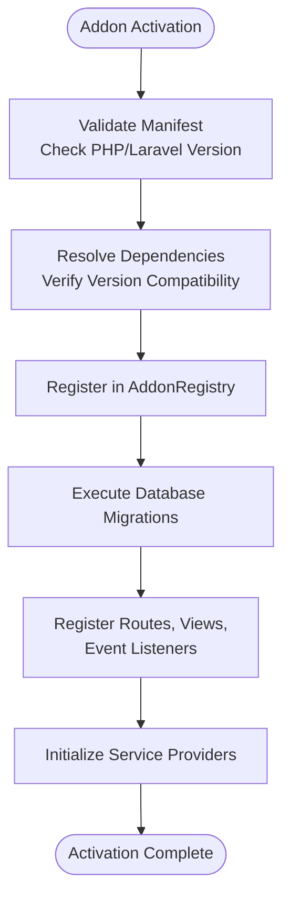
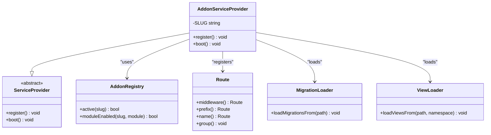
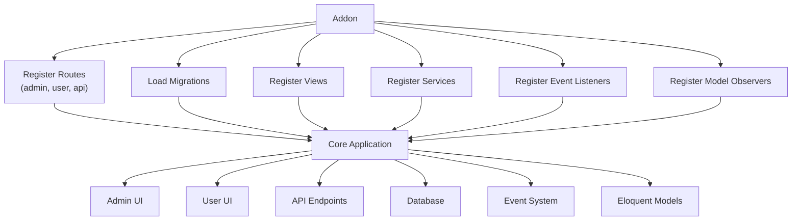
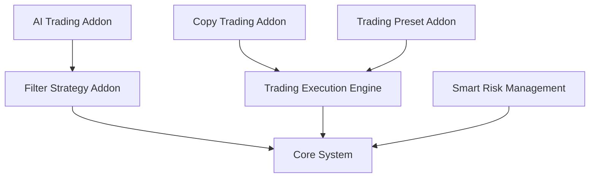
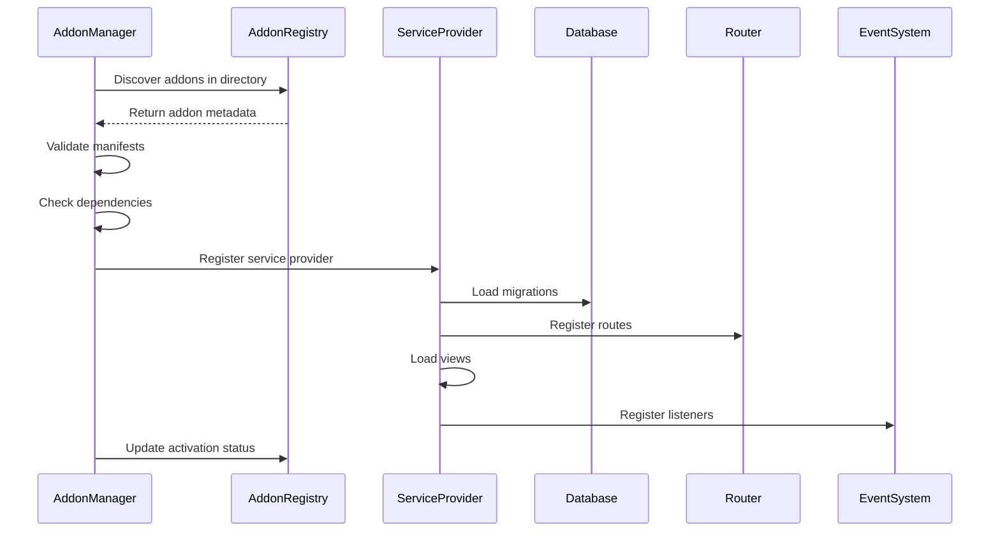
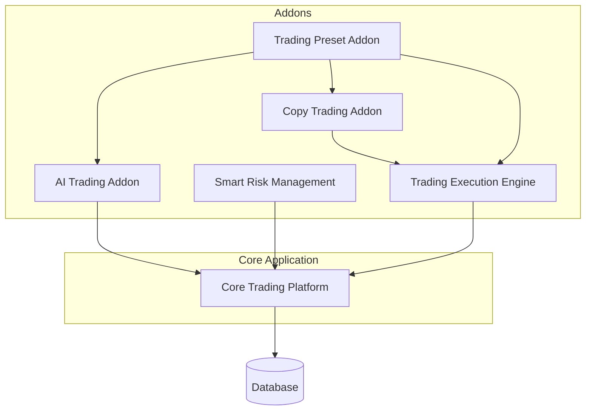

# Addon System Architecture

<cite>
**Referenced Files in This Document**   
- [addon.json](file://main/addons/_deprecated/ai-trading-addon/addon.json)
- [addon.json](file://main/addons/_deprecated/copy-trading-addon/addon.json)
- [addon.json](file://main/addons/_deprecated/smart-risk-management-addon/addon.json)
- [addon.json](file://main/addons/_deprecated/trading-execution-engine-addon/addon.json)
- [addon.json](file://main/addons/_deprecated/trading-preset-addon/addon.json)
- [AddonServiceProvider.php](file://main/addons/_deprecated/ai-trading-addon/AddonServiceProvider.php)
- [AddonServiceProvider.php](file://main/addons/_deprecated/copy-trading-addon/AddonServiceProvider.php)
- [AddonServiceProvider.php](file://main/addons/_deprecated/smart-risk-management-addon/AddonServiceProvider.php)
- [AddonServiceProvider.php](file://main/addons/_deprecated/trading-execution-engine-addon/AddonServiceProvider.php)
- [AddonServiceProvider.php](file://main/addons/_deprecated/trading-preset-addon/AddonServiceProvider.php)
- [AddonRegistry.php](file://main/app/Support/AddonRegistry.php)
</cite>

## Table of Contents
1. [Introduction](#introduction)
2. [Addon Manifest Structure](#addon-manifest-structure)
3. [Addon Lifecycle Management](#addon-lifecycle-management)
4. [Service Provider Pattern](#service-provider-pattern)
5. [Integration Points](#integration-points)
6. [Dependency Resolution and Version Compatibility](#dependency-resolution-and-version-compatibility)
7. [Addon Loading Process](#addon-loading-process)
8. [Isolated Development and Deployment](#isolated-development-and-deployment)
9. [Best Practices for Addon Development](#best-practices-for-addon-development)
10. [Common Integration Patterns](#common-integration-patterns)

## Introduction
The addon system architecture enables modular extension of core functionality through isolated components that can be independently developed, deployed, and managed. This document details the technical implementation of the addon system, focusing on the manifest structure, lifecycle management, service registration, and integration patterns that support features such as trading execution, AI analysis, and risk management.

## Addon Manifest Structure
The addon.json file serves as the manifest that defines metadata, requirements, dependencies, and module configuration for each addon. This JSON-based manifest is critical for addon registration and system integration.

### Core Manifest Properties
The manifest contains essential information that the AddonManager uses to validate and register addons:

- **name**: Unique identifier for the addon (e.g., "ai-trading-addon")
- **title**: Human-readable display name
- **description**: Functional overview of the addon's purpose
- **version**: Semantic versioning string for compatibility tracking
- **author**: Developer or organization responsible for the addon
- **namespace**: PHP namespace prefix for the addon's classes
- **status**: Activation state (active/inactive)

### Requirements and Dependencies
The manifest specifies both technical requirements and addon dependencies:

```json
"requires": {
    "php": "^8.0",
    "laravel": "^9.0"
}
```

This ensures the addon runs in compatible environments. The dependencies section establishes inter-addon relationships:

```json
"dependencies": {
    "filter-strategy-addon": "^1.0"
}
```

### Module Configuration
Addons are composed of discrete modules that can be individually enabled or disabled:

```json
"modules": [
    {
        "key": "admin_ui",
        "name": "Admin Interface",
        "description": "Provides admin routes and views",
        "targets": ["admin_routes", "admin_menu"],
        "enabled": true
    }
]
```

Each module defines integration targets that determine how it connects with the core system.

**Section sources**
- [addon.json](file://main/addons/_deprecated/ai-trading-addon/addon.json#L1-L41)
- [addon.json](file://main/addons/_deprecated/copy-trading-addon/addon.json#L1-L40)
- [addon.json](file://main/addons/_deprecated/smart-risk-management-addon/addon.json#L1-L48)
- [addon.json](file://main/addons/_deprecated/trading-execution-engine-addon/addon.json#L1-L47)
- [addon.json](file://main/addons/_deprecated/trading-preset-addon/addon.json#L1-L39)

## Addon Lifecycle Management
The AddonManager service orchestrates the complete lifecycle of addons, from installation through activation, deactivation, and removal.

### AddonManager Responsibilities
The AddonManager coordinates:
- Addon discovery and manifest parsing
- Dependency resolution and version compatibility checking
- Installation and migration execution
- Activation and deactivation workflows
- Runtime status monitoring

### Activation Workflow
When an addon is activated, the AddonManager follows a strict sequence:

1. Validate manifest integrity and requirements
2. Resolve and verify dependencies
3. Register addon in AddonRegistry
4. Execute database migrations
5. Register routes, views, and other integration points
6. Initialize service providers

### Deactivation Process
Deactivation follows a reverse pattern to ensure clean removal:
1. Unregister routes and event listeners
2. Deactivate module functionality
3. Update AddonRegistry status
4. Preserve data while disabling functionality



**Diagram sources**
- [AddonServiceProvider.php](file://main/addons/_deprecated/ai-trading-addon/AddonServiceProvider.php#L30-L60)
- [AddonServiceProvider.php](file://main/addons/_deprecated/copy-trading-addon/AddonServiceProvider.php#L27-L74)
- [AddonRegistry.php](file://main/app/Support/AddonRegistry.php)

**Section sources**
- [AddonServiceProvider.php](file://main/addons/_deprecated/ai-trading-addon/AddonServiceProvider.php#L30-L60)
- [AddonServiceProvider.php](file://main/addons/_deprecated/copy-trading-addon/AddonServiceProvider.php#L27-L74)
- [AddonRegistry.php](file://main/app/Support/AddonRegistry.php)

## Service Provider Pattern
Addons use Laravel's service provider pattern to integrate with the core application, following the standard register and boot lifecycle methods.

### Registration Phase
During registration, addons:
- Bind services to the service container
- Merge configuration files
- Register singletons and bindings

```php
public function register()
{
    $this->app->singleton(\Addons\AiTradingAddon\App\Services\AiTradingProviderFactory::class);
    $this->app->bind(
        \Addons\AiTradingAddon\App\Services\AiModelProfileService::class,
        \Addons\AiTradingAddon\App\Services\AiModelProfileService::class
    );
    
    if (file_exists(__DIR__ . '/config/ai-trading.php')) {
        $this->mergeConfigFrom(__DIR__ . '/config/ai-trading.php', 'ai-trading');
    }
}
```

### Boot Phase
The boot method activates the addon's functionality:
- Loads database migrations
- Registers views
- Sets up routes with appropriate middleware
- Registers event listeners and observers

Conditional activation based on module status ensures only enabled modules are loaded.



**Diagram sources**
- [AddonServiceProvider.php](file://main/addons/_deprecated/ai-trading-addon/AddonServiceProvider.php#L13-L60)
- [AddonServiceProvider.php](file://main/addons/_deprecated/copy-trading-addon/AddonServiceProvider.php#L19-L74)
- [AddonRegistry.php](file://main/app/Support/AddonRegistry.php)

**Section sources**
- [AddonServiceProvider.php](file://main/addons/_deprecated/ai-trading-addon/AddonServiceProvider.php#L13-L60)
- [AddonServiceProvider.php](file://main/addons/_deprecated/copy-trading-addon/AddonServiceProvider.php#L19-L74)

## Integration Points
Addons integrate with the core system through standardized extension points that support modular functionality.

### Route Registration
Addons register routes conditionally based on their activation status and module configuration:

```php
if (file_exists(__DIR__ . '/routes/admin.php') && AddonRegistry::moduleEnabled(self::SLUG, 'admin_ui')) {
    Route::middleware(['web', 'admin', 'demo'])
        ->prefix('admin')
        ->name('admin.')
        ->group(function (): void {
            require __DIR__ . '/routes/admin.php';
        });
}
```

Different route files serve distinct user contexts:
- **admin.php**: Admin interface routes
- **user.php**: User-facing routes
- **api.php**: API endpoints

### Migration Integration
Addons include database migrations that are automatically loaded:

```php
$this->loadMigrationsFrom(__DIR__ . '/database/migrations');
```

This ensures schema changes are applied when the addon is activated.

### View Integration
Addons register their view directories with a unique namespace:

```php
$this->loadViewsFrom(__DIR__ . '/resources/views', 'ai-trading-addon');
```

This enables template rendering using the addon's namespace.

### Event Listener Registration
Addons can respond to system events, particularly when dependent addons are active:

```php
if (AddonRegistry::active('trading-execution-engine-addon') && 
    AddonRegistry::moduleEnabled(self::SLUG, 'copy_engine')) {
    Event::listen(
        'eloquent.created: ' . $executionPositionClass,
        PositionCreatedListener::class
    );
}
```

### Model Observer Integration
Addons can observe core models to extend functionality:

```php
Signal::observe(SignalObserver::class);
```

This pattern enables addons to react to model lifecycle events.



**Diagram sources**
- [AddonServiceProvider.php](file://main/addons/_deprecated/ai-trading-addon/AddonServiceProvider.php#L36-L58)
- [AddonServiceProvider.php](file://main/addons/_deprecated/copy-trading-addon/AddonServiceProvider.php#L35-L74)
- [AddonServiceProvider.php](file://main/addons/_deprecated/trading-execution-engine-addon/AddonServiceProvider.php#L32-L58)

**Section sources**
- [AddonServiceProvider.php](file://main/addons/_deprecated/ai-trading-addon/AddonServiceProvider.php#L36-L58)
- [AddonServiceProvider.php](file://main/addons/_deprecated/copy-trading-addon/AddonServiceProvider.php#L35-L74)
- [AddonServiceProvider.php](file://main/addons/_deprecated/trading-execution-engine-addon/AddonServiceProvider.php#L32-L58)

## Dependency Resolution and Version Compatibility
The addon system implements robust dependency management to ensure addons function correctly in relation to each other.

### Dependency Declaration
Addons declare dependencies in their manifest:

```json
"dependencies": {
    "trading-execution-engine-addon": "^1.0.0"
}
```

This creates a dependency graph that the AddonManager resolves during activation.

### Version Compatibility
Semantic versioning ensures compatibility:
- **^1.0.0**: Compatible with any 1.x.x version
- **~1.0.0**: Compatible with any 1.0.x version

The system checks version constraints before allowing activation.

### Runtime Dependency Checking
Addons verify dependencies at runtime using AddonRegistry:

```php
if (AddonRegistry::active('trading-execution-engine-addon') && 
    class_exists(\Addons\TradingExecutionEngine\App\Models\ExecutionPosition::class)) {
    // Register event listeners
}
```

This prevents errors when dependent functionality is unavailable.

### Circular Dependency Prevention
The system validates dependency graphs to prevent circular references:
1. Build dependency graph from all manifests
2. Check for cycles before activation
3. Reject addons with circular dependencies



**Diagram sources**
- [addon.json](file://main/addons/_deprecated/ai-trading-addon/addon.json#L13-L15)
- [addon.json](file://main/addons/_deprecated/copy-trading-addon/addon.json#L13-L15)
- [AddonServiceProvider.php](file://main/addons/_deprecated/copy-trading-addon/AddonServiceProvider.php#L57-L71)

**Section sources**
- [addon.json](file://main/addons/_deprecated/ai-trading-addon/addon.json#L13-L15)
- [addon.json](file://main/addons/_deprecated/copy-trading-addon/addon.json#L13-L15)
- [AddonServiceProvider.php](file://main/addons/_deprecated/copy-trading-addon/AddonServiceProvider.php#L57-L71)

## Addon Loading Process
The addon loading process follows a systematic sequence to ensure proper initialization and integration.

### Discovery Phase
1. Scan addons directory for addon.json files
2. Parse manifests and validate structure
3. Build addon registry with metadata

### Validation Phase
1. Check PHP and Laravel version requirements
2. Verify file system permissions
3. Validate namespace uniqueness

### Activation Sequence
1. Check dependency graph for completeness
2. Execute database migrations
3. Register service provider
4. Load views and routes
5. Initialize event listeners

### Bootstrapping Order
Addons are loaded in dependency order:
1. Core dependencies first
2. Leaf addons last
3. Independent addons in alphabetical order



**Diagram sources**
- [AddonServiceProvider.php](file://main/addons/_deprecated/ai-trading-addon/AddonServiceProvider.php)
- [AddonRegistry.php](file://main/app/Support/AddonRegistry.php)

**Section sources**
- [AddonServiceProvider.php](file://main/addons/_deprecated/ai-trading-addon/AddonServiceProvider.php)
- [AddonRegistry.php](file://main/app/Support/AddonRegistry.php)

## Isolated Development and Deployment
The addon architecture enables isolated development and deployment of specialized features.

### Trading Execution
The Trading Execution Engine addon provides:
- Exchange/broker connection management
- Signal-to-trade conversion
- Position monitoring
- Risk parameter application

### AI Analysis
The AI Trading addon offers:
- Market pattern recognition
- Signal validation using machine learning
- Position sizing optimization
- Performance prediction

### Risk Management
The Smart Risk Management addon implements:
- Adaptive risk parameters
- Volatility-based position sizing
- Portfolio-level risk controls
- Historical performance analysis

Each addon operates in isolation while integrating through well-defined interfaces, allowing teams to develop and deploy features independently.



**Diagram sources**
- [addon.json](file://main/addons/_deprecated/ai-trading-addon/addon.json)
- [addon.json](file://main/addons/_deprecated/smart-risk-management-addon/addon.json)
- [addon.json](file://main/addons/_deprecated/trading-execution-engine-addon/addon.json)

**Section sources**
- [addon.json](file://main/addons/_deprecated/ai-trading-addon/addon.json)
- [addon.json](file://main/addons/_deprecated/smart-risk-management-addon/addon.json)
- [addon.json](file://main/addons/_deprecated/trading-execution-engine-addon/addon.json)

## Best Practices for Addon Development
Developers should follow these best practices when creating addons.

### Namespace Conventions
Use consistent namespace patterns:
```
Addons\{AddonName}\App\{Category}\{ClassName}
```

### Module Design
Structure addons with discrete modules:
- Separate admin and user interfaces
- Isolate background processing
- Modularize service components

### Error Handling
Implement robust error handling:
- Graceful degradation when dependencies are missing
- Comprehensive logging
- User-friendly error messages

### Performance Considerations
Optimize addon performance:
- Lazy load resources when possible
- Cache expensive operations
- Minimize database queries

### Security Practices
Follow security best practices:
- Validate all inputs
- Sanitize outputs
- Implement proper authorization checks
- Protect against common vulnerabilities

## Common Integration Patterns
Several recurring patterns emerge in addon integration.

### Observer Pattern
Addons observe core models to extend functionality:

```php
Signal::observe(SignalObserver::class);
```

### Event Listener Pattern
Addons respond to system events:

```php
Event::listen('eloquent.created: ExecutionPosition', Listener::class);
```

### Service Injection
Addons register services for dependency injection:

```php
$this->app->singleton(Service::class);
```

### Conditional Integration
Addons integrate based on configuration:

```php
if (AddonRegistry::moduleEnabled(self::SLUG, 'admin_ui')) {
    // Register admin routes
}
```

These patterns ensure addons integrate cleanly while maintaining isolation and flexibility.