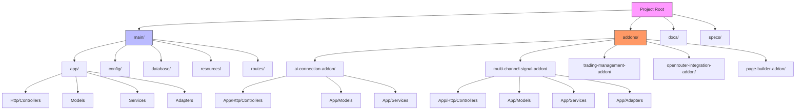
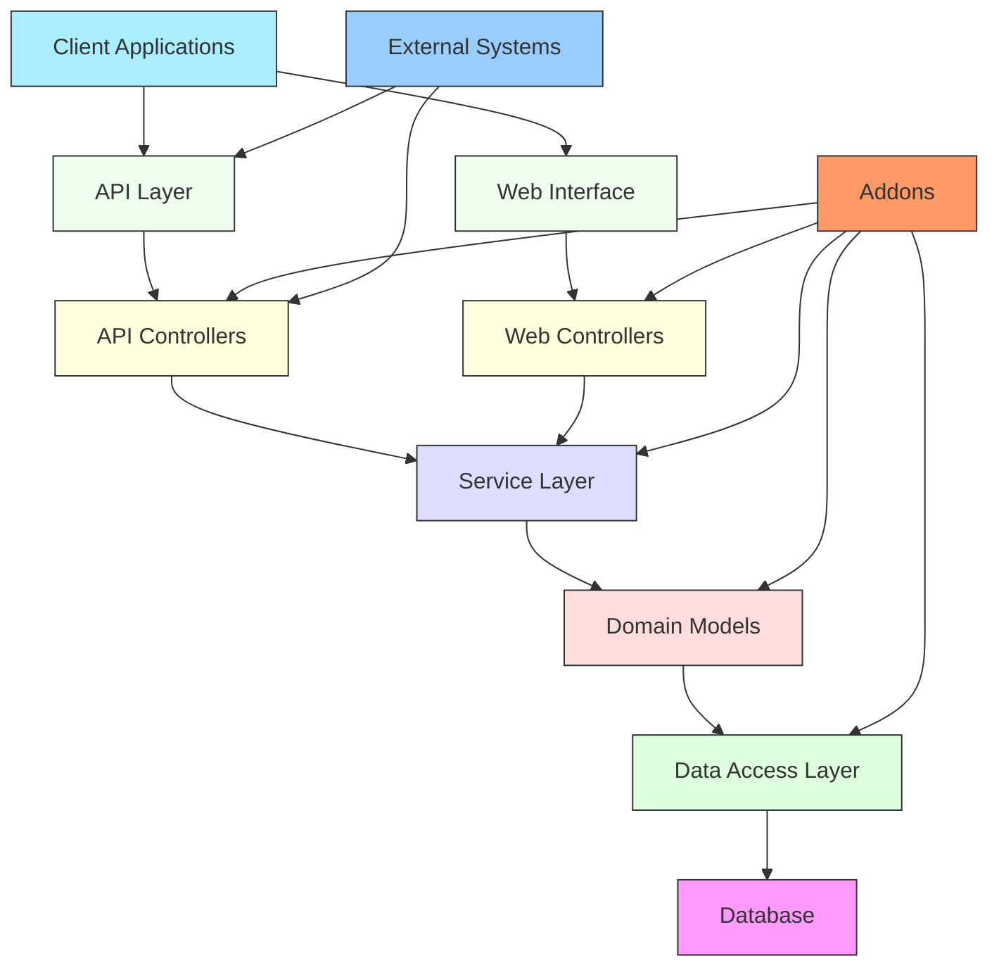
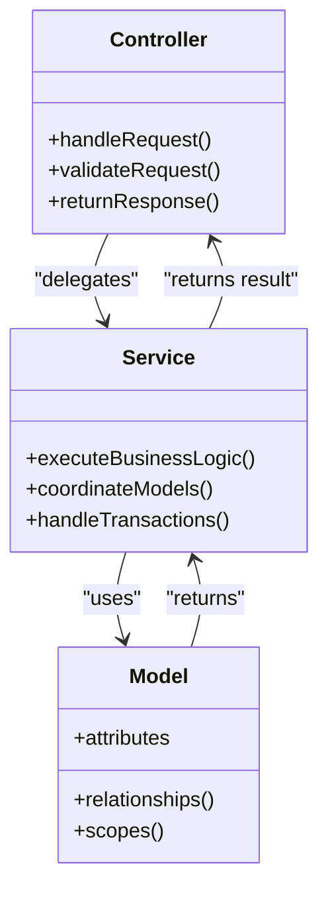
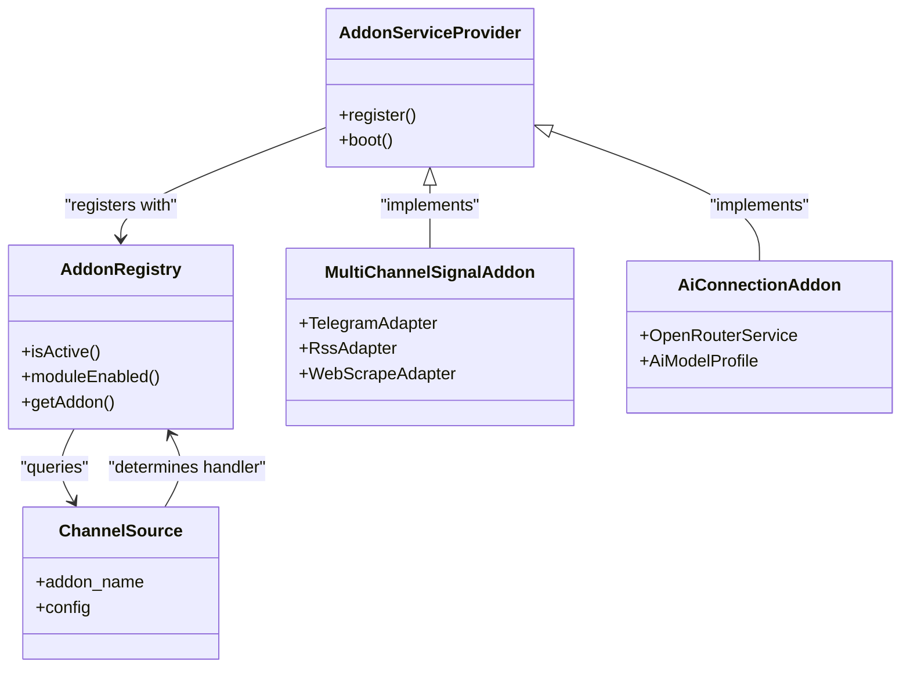
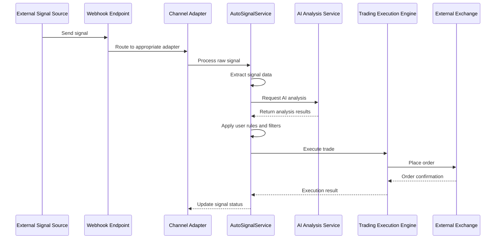
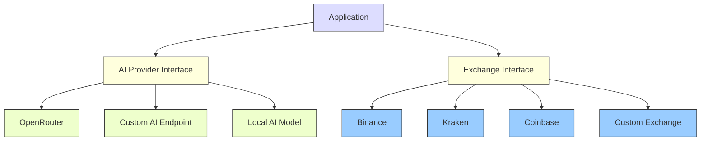
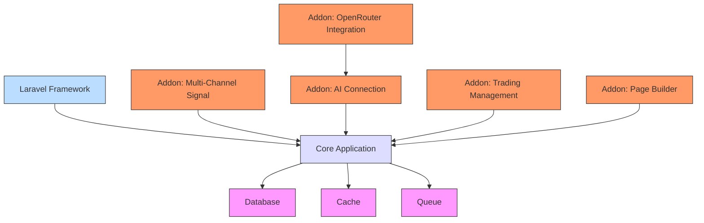

# Architecture Overview

<cite>
**Referenced Files in This Document**   
- [app.php](file://main/config/app.php)
- [composer.json](file://main/composer.json)
- [api.php](file://main/routes/api.php)
- [web.php](file://main/routes/web.php)
- [AddonServiceProvider.php](file://main/addons/ai-connection-addon/AddonServiceProvider.php)
- [SignalController.php](file://main/app/Http/Controllers/Api/User/SignalController.php)
- [TradingController.php](file://main/app/Http/Controllers/Api/User/TradingController.php)
- [AutoSignalService.php](file://main/app/Services/AutoSignalService.php)
- [TelegramAdapter.php](file://main/app/Adapters/TelegramAdapter.php)
- [Signal.php](file://main/app/Models/Signal.php)
- [ChannelSource.php](file://main/app/Models/ChannelSource.php)
- [TradingBotApiController.php](file://main/app/Http/Controllers/Api/User/TradingBotApiController.php)
- [TradingConfigApiController.php](file://main/app/Http/Controllers/Api/User/TradingConfigApiController.php)
- [ExecutionLogController.php](file://main/app/Http/Controllers/User/Trading/ExecutionLogController.php)
</cite>

## Table of Contents
1. [Introduction](#introduction)
2. [Project Structure](#project-structure)
3. [Core Components](#core-components)
4. [Architecture Overview](#architecture-overview)
5. [Detailed Component Analysis](#detailed-component-analysis)
6. [Dependency Analysis](#dependency-analysis)
7. [Performance Considerations](#performance-considerations)
8. [Troubleshooting Guide](#troubleshooting-guide)
9. [Conclusion](#conclusion)

## Introduction
This document provides a comprehensive architectural overview of the AI Trade Pulse system, a sophisticated trading platform that combines artificial intelligence with automated trading execution. The system follows the MVC (Model-View-Controller) pattern combined with a Service Layer architecture to ensure separation of concerns and maintainability. It features a modular plugin/addon system that enables extensible functionality, with core capabilities including multi-channel signal ingestion, AI-powered analysis, and automated trade execution. The architecture is designed to integrate with external systems such as cryptocurrency exchanges and AI providers, while addressing cross-cutting concerns like security, logging, and error handling.

## Project Structure
The project follows a Laravel-based directory structure with a clear separation between core application components and modular addons. The main application resides in the `main/` directory, which contains standard Laravel components including `app/`, `config/`, `database/`, `routes/`, and `resources/` directories. A key architectural feature is the `addons/` directory, which houses modular components that extend the system's functionality. These addons follow Laravel package conventions with their own `app/`, `routes/`, and `database/` subdirectories. The system also includes a `docs/` directory with comprehensive documentation and a `specs/` directory containing feature specifications.

**Diagram sources**
- [main/](file://main/)
- [addons/](file://main/addons/)

**Section sources**
- [main/](file://main/)
- [addons/](file://main/addons/)

## Core Components
The system's core components are organized according to the MVC pattern with an additional Service Layer that encapsulates business logic. The Model layer consists of Eloquent models that represent domain entities such as Signal, User, and ChannelSource. The View layer is implemented using Blade templates for server-rendered content and API responses for client-side applications. The Controller layer handles HTTP requests and responses, delegating complex business logic to the Service Layer. Key service classes include AutoSignalService for processing trading signals and ConfigurationService for managing application settings. The architecture also includes specialized components like Adapters for integrating with external messaging platforms and Jobs for handling asynchronous operations.

**Section sources**
- [Signal.php](file://main/app/Models/Signal.php)
- [ChannelSource.php](file://main/app/Models/ChannelSource.php)
- [AutoSignalService.php](file://main/app/Services/AutoSignalService.php)
- [ConfigurationService.php](file://main/app/Services/ConfigurationService.php)

## Architecture Overview
The system architecture follows a layered approach with clear separation between presentation, application logic, domain logic, and data access layers. At the presentation layer, the system exposes both a traditional web interface and a RESTful API, allowing for flexible client integration. The application layer implements the MVC pattern, with controllers handling HTTP requests and responses. Business logic is encapsulated in the Service Layer, which provides a clean API for use by controllers and other services. The domain layer contains models that represent business entities and their relationships. Data access is handled through Laravel's Eloquent ORM, with database interactions abstracted behind repository patterns where appropriate.

The architecture is extended through a plugin/addon system that allows for modular functionality extension. Addons are Laravel packages that can register their own routes, controllers, models, and migrations. They are conditionally loaded based on their active status, preventing errors when addons are disabled. The addon system follows Laravel's service provider pattern, with each addon having its own AddonServiceProvider that registers components when the addon is active.

**Diagram sources**
- [api.php](file://main/routes/api.php)
- [web.php](file://main/routes/web.php)
- [AutoSignalService.php](file://main/app/Services/AutoSignalService.php)
- [Signal.php](file://main/app/Models/Signal.php)

## Detailed Component Analysis

### MVC and Service Layer Architecture
The system implements a clean separation of concerns through the MVC pattern combined with a Service Layer architecture. Controllers are responsible for handling HTTP requests, validating input, and returning appropriate responses. They delegate business logic to service classes, which encapsulate complex operations and coordinate between multiple models. This separation allows for better testability and reusability of business logic.

**Diagram sources**
- [SignalController.php](file://main/app/Http/Controllers/Api/User/SignalController.php)
- [AutoSignalService.php](file://main/app/Services/AutoSignalService.php)
- [Signal.php](file://main/app/Models/Signal.php)

### Plugin/Addon System
The plugin/addon system enables modular extension of the platform's functionality. Each addon is a self-contained Laravel package with its own service provider, routes, controllers, models, and migrations. Addons are registered in the application's service container and can be conditionally loaded based on their active status. The system uses an AddonRegistry to manage addon states and provide a centralized way to check addon availability.

**Diagram sources**
- [AddonServiceProvider.php](file://main/addons/ai-connection-addon/AddonServiceProvider.php)
- [AddonRegistry.php](file://main/app/Support/AddonRegistry.php)
- [ChannelSource.php](file://main/app/Models/ChannelSource.php)

### Data Flow from Signal Ingestion to Trade Execution
The system processes trading signals through a well-defined pipeline from ingestion to execution. External signals are ingested through various channels (Telegram, RSS, web scraping) and processed by specialized adapters. The signals are then analyzed by AI models to generate trading recommendations, which are executed according to user-defined risk parameters and trading strategies.

**Diagram sources**
- [TelegramAdapter.php](file://main/app/Adapters/TelegramAdapter.php)
- [AutoSignalService.php](file://main/app/Services/AutoSignalService.php)
- [TradingController.php](file://main/app/Http/Controllers/Api/User/TradingController.php)

### Integration with External Systems
The system integrates with external services through well-defined interfaces and adapters. For AI providers, the system uses a service abstraction that allows for multiple AI platforms to be used interchangeably. Exchange integrations are handled through execution connections that encapsulate the authentication and communication details for each exchange.

**Diagram sources**
- [OpenRouterIntegration](file://main/addons/openrouter-integration-addon/)
- [TradingConfigApiController.php](file://main/app/Http/Controllers/Api/User/TradingConfigApiController.php)

## Dependency Analysis
The system's dependencies are managed through Composer, with clear separation between core application dependencies and addon-specific dependencies. The main composer.json file defines the core Laravel framework and essential packages, while each addon has its own composer.json for addon-specific requirements. The autoloader configuration in composer.json includes PSR-4 mappings for each addon, allowing them to be autoloaded as namespaces.

**Diagram sources**
- [composer.json](file://main/composer.json)
- [app.php](file://main/config/app.php)

**Section sources**
- [composer.json](file://main/composer.json)
- [app.php](file://main/config/app.php)

## Performance Considerations
The system incorporates several performance optimizations to handle high volumes of trading signals and user requests. API responses are cached using Laravel's cache middleware, with endpoints like /plans and /markets cached for 10 minutes to reduce database load. The system uses Laravel Horizon to manage queued jobs, allowing for asynchronous processing of intensive operations like signal processing and trade execution. Database queries are optimized with appropriate indexing, particularly on frequently queried fields like user_id and status. The system also implements query optimization through Laravel's Eloquent ORM, using eager loading to prevent N+1 query problems when retrieving related models.

**Section sources**
- [api.php](file://main/routes/api.php)
- [AutoSignalService.php](file://main/app/Services/AutoSignalService.php)
- [QueryOptimizationService.php](file://main/app/Services/QueryOptimizationService.php)

## Troubleshooting Guide
Common issues in the system typically relate to addon configuration, API integration, or data processing pipelines. For addon-related issues, verify that the addon is properly registered in the database and that its service provider is being loaded. For API integration problems, check the configuration settings and authentication credentials for external services. When troubleshooting signal processing issues, examine the channel source configuration and adapter implementation. The system provides comprehensive logging through Laravel's logging facilities, with specific log channels for different subsystems. Health checks are available through the /health endpoint, which verifies database connectivity, queue status, and cache functionality.

**Section sources**
- [health](file://main/routes/web.php#L44-L105)
- [AddonRegistry.php](file://main/app/Support/AddonRegistry.php)
- [AutoSignalService.php](file://main/app/Services/AutoSignalService.php)

## Conclusion
The AI Trade Pulse system features a robust architecture that combines the MVC pattern with a Service Layer to ensure separation of concerns and maintainability. The plugin/addon system enables modular extension of functionality, allowing new features to be added without modifying the core application. The data flow from signal ingestion through AI analysis to trade execution is well-defined and extensible, supporting multiple input channels and output destinations. Integration with external systems is handled through clean interfaces and adapters, facilitating the use of different AI providers and exchanges. The architecture addresses cross-cutting concerns like security, logging, and error handling, while incorporating performance optimizations to handle high volumes of trading activity. This design provides a solid foundation for a scalable and maintainable trading platform.