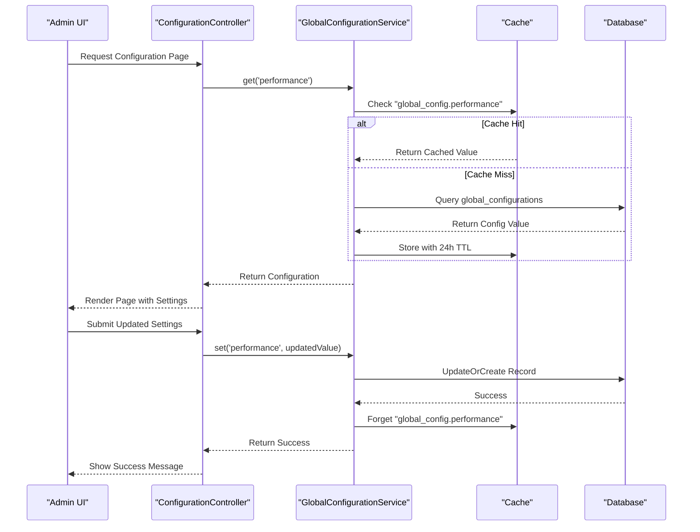
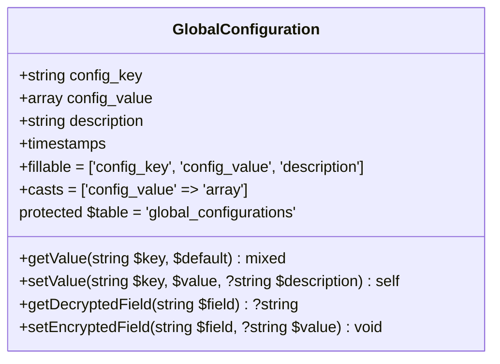
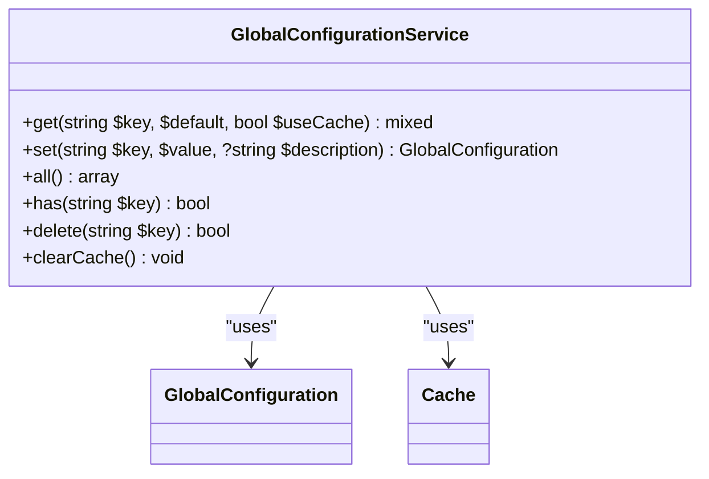
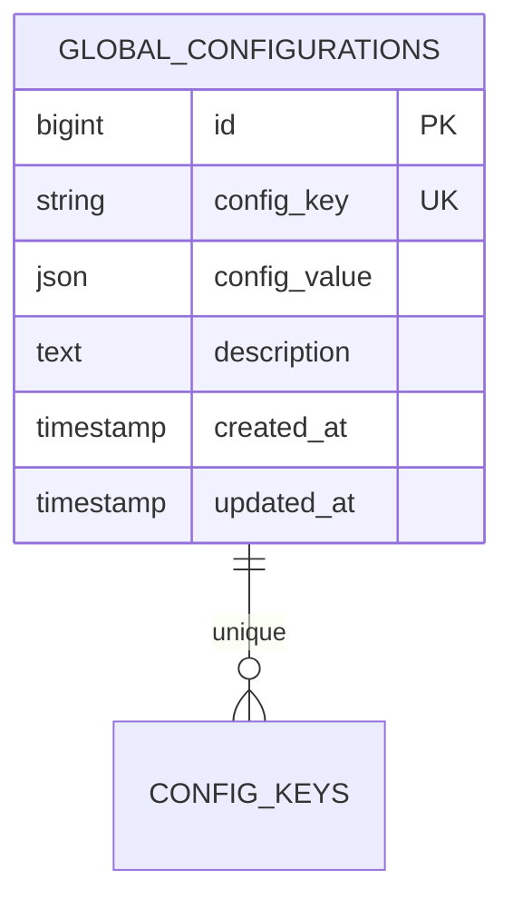
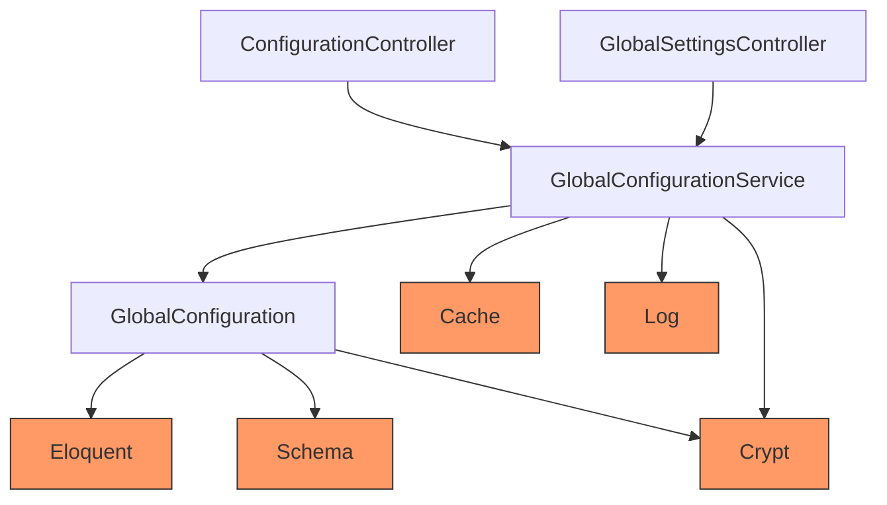

# Configuration System

<cite>
**Referenced Files in This Document**   
- [GlobalConfiguration.php](file://main/app/Models/GlobalConfiguration.php)
- [GlobalConfigurationService.php](file://main/app/Services/GlobalConfigurationService.php)
- [create_global_configurations_table.php](file://main/database/migrations/2025_12_06_000810_create_global_configurations_table.php)
- [app.php](file://main/config/app.php)
- [performance.php](file://main/config/performance.php)
- [ConfigurationController.php](file://main/app/Http/Controllers/Backend/ConfigurationController.php)
- [GlobalSettingsController.php](file://main/addons/trading-management-addon/Modules/GlobalSettings/Controllers/Backend/GlobalSettingsController.php)
- [.env.example](file://main/.env.example)
- [CacheManager.php](file://main/app/Services/CacheManager.php)
</cite>

## Table of Contents
1. [Introduction](#introduction)
2. [Project Structure](#project-structure)
3. [Core Components](#core-components)
4. [Architecture Overview](#architecture-overview)
5. [Detailed Component Analysis](#detailed-component-analysis)
6. [Dependency Analysis](#dependency-analysis)
7. [Performance Considerations](#performance-considerations)
8. [Troubleshooting Guide](#troubleshooting-guide)
9. [Conclusion](#conclusion)

## Introduction
The application implements a hybrid configuration system that combines Laravel's native file-based configuration with a dynamic database-backed configuration store. This dual approach allows for both static configuration through environment variables and PHP configuration files, as well as runtime-modifiable settings stored in the database. The system is designed to support multi-environment deployments while providing administrators with the ability to modify critical application settings without requiring code changes or server restarts. This documentation details the architecture, implementation, and usage patterns of this comprehensive configuration system.

## Project Structure
The configuration system is implemented across multiple directories within the application structure. The core configuration files are located in the `main/config/` directory, which contains PHP files that return configuration arrays. Database-backed configuration is managed through the `main/app/Models/GlobalConfiguration.php` model and its corresponding service class in `main/app/Services/GlobalConfigurationService.php`. The database migration for the global configuration table is located in `main/database/migrations/2025_12_06_000810_create_global_configurations_table.php`. Environment variables are defined in the `.env` file at the root level, with an example provided in `.env.example`. Configuration-related controllers are primarily located in `main/app/Http/Controllers/Backend/` and within addon modules.

```mermaid
graph TB
subgraph "Configuration Sources"
Env[.env File]
ConfigFiles[config/*.php]
Database[global_configurations Table]
end
subgraph "Configuration Access"
ConfigHelper[config() Helper]
GlobalConfigModel[GlobalConfiguration Model]
GlobalConfigService[GlobalConfigurationService]
end
subgraph "Configuration Management"
ConfigurationController[ConfigurationController]
GlobalSettingsController[GlobalSettingsController]
end
Env --> ConfigHelper
ConfigFiles --> ConfigHelper
Database --> GlobalConfigModel
GlobalConfigModel --> GlobalConfigService
GlobalConfigService --> ConfigurationController
GlobalConfigService --> GlobalSettingsController
ConfigurationController --> GlobalConfigService
GlobalSettingsController --> GlobalConfigService
style Env fill:#f9f,stroke:#333
style ConfigFiles fill:#f9f,stroke:#333
style Database fill:#f9f,stroke:#333
style ConfigHelper fill:#bbf,stroke:#333
style GlobalConfigModel fill:#bbf,stroke:#333
style GlobalConfigService fill:#bbf,stroke:#333
style ConfigurationController fill:#9f9,stroke:#333
style GlobalSettingsController fill:#9f9,stroke:#333
```

**Diagram sources**
- [app.php](file://main/config/app.php)
- [GlobalConfiguration.php](file://main/app/Models/GlobalConfiguration.php)
- [GlobalConfigurationService.php](file://main/app/Services/GlobalConfigurationService.php)
- [ConfigurationController.php](file://main/app/Http/Controllers/Backend/ConfigurationController.php)
- [GlobalSettingsController.php](file://main/addons/trading-management-addon/Modules/GlobalSettings/Controllers/Backend/GlobalSettingsController.php)

**Section sources**
- [app.php](file://main/config/app.php)
- [GlobalConfiguration.php](file://main/app/Models/GlobalConfiguration.php)
- [GlobalConfigurationService.php](file://main/app/Services/GlobalConfigurationService.php)

## Core Components
The configuration system consists of several core components that work together to provide a flexible and robust configuration management solution. The system integrates Laravel's native configuration system with a custom database-backed configuration store, allowing for both static and dynamic configuration management. The GlobalConfiguration model provides database persistence for runtime-modifiable settings, while the GlobalConfigurationService adds caching and business logic. The system supports sensitive data encryption for secure storage of API keys and other credentials, with automatic caching and cache invalidation to ensure performance and consistency.

**Section sources**
- [GlobalConfiguration.php](file://main/app/Models/GlobalConfiguration.php)
- [GlobalConfigurationService.php](file://main/app/Services/GlobalConfigurationService.php)
- [create_global_configurations_table.php](file://main/database/migrations/2025_12_06_000810_create_global_configurations_table.php)

## Architecture Overview
The configuration system architecture follows a layered approach that separates concerns between configuration storage, access, and management. At the foundation, environment variables from the `.env` file are loaded into Laravel's configuration system at application bootstrap. These provide the initial configuration values that can be accessed throughout the application using the `config()` helper function. For dynamic, runtime-modifiable settings, the system uses a database table `global_configurations` that stores configuration key-value pairs as JSON. This database layer is accessed through the GlobalConfiguration model, which provides basic CRUD operations. The GlobalConfigurationService sits above the model, adding caching functionality using Laravel's Cache facade with a 24-hour TTL. This service handles cache invalidation when configuration values are updated, ensuring data consistency. Configuration controllers provide the user interface for managing both static and dynamic settings, with appropriate validation and security measures.



**Diagram sources**
- [GlobalConfigurationService.php](file://main/app/Services/GlobalConfigurationService.php)
- [ConfigurationController.php](file://main/app/Http/Controllers/Backend/ConfigurationController.php)
- [create_global_configurations_table.php](file://main/database/migrations/2025_12_06_000810_create_global_configurations_table.php)

## Detailed Component Analysis

### GlobalConfiguration Model Analysis
The GlobalConfiguration model represents the database-backed configuration store, providing the foundation for runtime-modifiable settings. It uses Laravel's Eloquent ORM to interact with the `global_configurations` table, with the config_key field serving as a unique identifier for each configuration entry. The model implements several key features for robust configuration management.



**Diagram sources**
- [GlobalConfiguration.php](file://main/app/Models/GlobalConfiguration.php)

**Section sources**
- [GlobalConfiguration.php](file://main/app/Models/GlobalConfiguration.php)

### GlobalConfigurationService Analysis
The GlobalConfigurationService provides a higher-level interface for configuration management, adding caching and business logic on top of the GlobalConfiguration model. This service is the primary entry point for accessing and modifying database-backed configuration values, ensuring consistent handling of caching and error conditions.



**Diagram sources**
- [GlobalConfigurationService.php](file://main/app/Services/GlobalConfigurationService.php)
- [GlobalConfiguration.php](file://main/app/Models/GlobalConfiguration.php)

**Section sources**
- [GlobalConfigurationService.php](file://main/app/Services/GlobalConfigurationService.php)

### Configuration Schema Analysis
The database schema for the global configuration system is designed to be flexible and extensible, supporting various data types and use cases. The schema includes proper indexing and constraints to ensure data integrity and optimal query performance.



**Diagram sources**
- [create_global_configurations_table.php](file://main/database/migrations/2025_12_06_000810_create_global_configurations_table.php)

**Section sources**
- [create_global_configurations_table.php](file://main/database/migrations/2025_12_06_000810_create_global_configurations_table.php)

## Dependency Analysis
The configuration system has dependencies on several core Laravel components and application services. The GlobalConfiguration model depends on Laravel's database components for Eloquent ORM functionality and schema management. The GlobalConfigurationService depends on Laravel's Cache facade for caching functionality, with a 24-hour TTL for configuration values. Both components depend on Laravel's logging system for error tracking and monitoring. The configuration controllers depend on the GlobalConfigurationService for data access, creating a clear separation between presentation and business logic. The system also has a dependency on Laravel's encryption services for securing sensitive configuration values like API keys.



**Diagram sources**
- [GlobalConfiguration.php](file://main/app/Models/GlobalConfiguration.php)
- [GlobalConfigurationService.php](file://main/app/Services/GlobalConfigurationService.php)
- [ConfigurationController.php](file://main/app/Http/Controllers/Backend/ConfigurationController.php)
- [GlobalSettingsController.php](file://main/addons/trading-management-addon/Modules/GlobalSettings/Controllers/Backend/GlobalSettingsController.php)

**Section sources**
- [GlobalConfiguration.php](file://main/app/Models/GlobalConfiguration.php)
- [GlobalConfigurationService.php](file://main/app/Services/GlobalConfigurationService.php)

## Performance Considerations
The configuration system implements a comprehensive caching strategy to ensure optimal performance. The GlobalConfigurationService uses Laravel's Cache facade with a 24-hour time-to-live (TTL) for all configuration values, significantly reducing database queries for frequently accessed settings. The service uses the `Cache::remember()` method to automatically handle cache misses, retrieving values from the database and storing them in cache for subsequent requests. When configuration values are updated, the service automatically invalidates the corresponding cache entry using `Cache::forget()`, ensuring that applications always receive the most current values. For bulk operations, the service provides a `clearCache()` method that removes all configuration-related cache entries. The system also includes a CacheManager service that provides additional caching functionality and monitoring capabilities, including hit rate tracking and memory usage statistics.

**Section sources**
- [GlobalConfigurationService.php](file://main/app/Services/GlobalConfigurationService.php)
- [CacheManager.php](file://main/app/Services/CacheManager.php)

## Troubleshooting Guide
When troubleshooting configuration system issues, several common problems may arise. If configuration values are not being updated as expected, verify that cache invalidation is working properly by checking that `Cache::forget()` is called after updates. For database connection issues, ensure that the `global_configurations` table exists and has the proper schema, particularly the unique constraint on `config_key`. When dealing with encrypted configuration values, verify that the application key is properly set in the `.env` file, as this is required for encryption and decryption operations. If configuration values are not being loaded from the database, check the application logs for any database connection or query errors. For performance issues, monitor cache hit rates using the CacheManager service and consider adjusting the TTL or implementing additional caching layers as needed.

**Section sources**
- [GlobalConfiguration.php](file://main/app/Models/GlobalConfiguration.php)
- [GlobalConfigurationService.php](file://main/app/Services/GlobalConfigurationService.php)
- [CacheManager.php](file://main/app/Services/CacheManager.php)

## Conclusion
The application's configuration system provides a robust and flexible solution for managing both static and dynamic settings. By combining Laravel's native configuration system with a database-backed store, the system supports multi-environment deployments while allowing administrators to modify critical settings at runtime. The implementation includes comprehensive caching for performance, proper error handling, and security features for protecting sensitive data. The clear separation of concerns between configuration storage, access, and management makes the system maintainable and extensible. This hybrid approach strikes an effective balance between the reliability of file-based configuration and the flexibility of database-driven settings, providing a solid foundation for the application's operation across different environments and use cases.