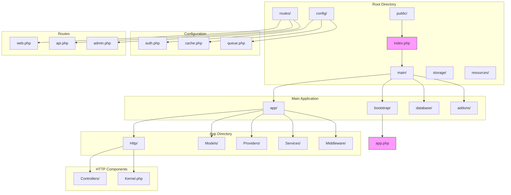
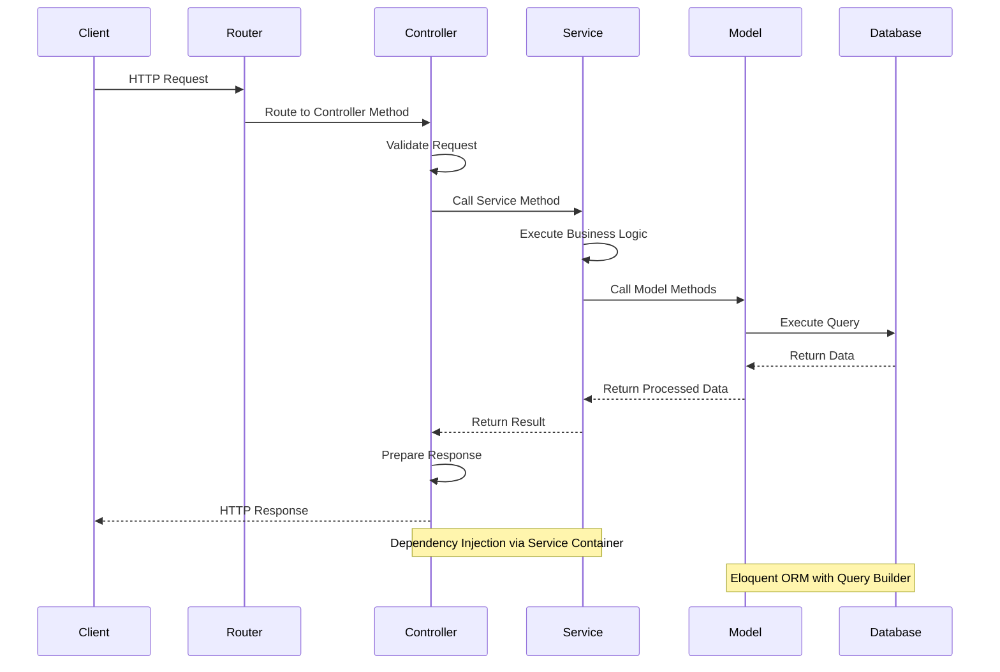
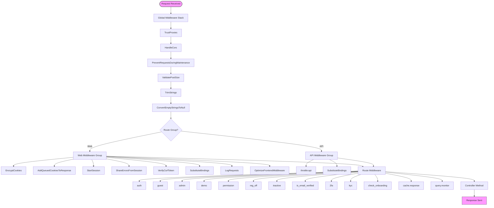
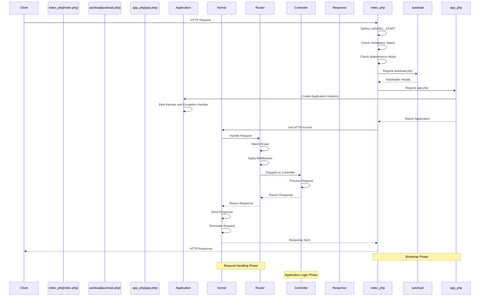
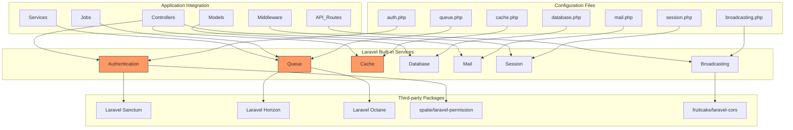

# Core Architecture

<cite>
**Referenced Files in This Document**   
- [index.php](file://index.php)
- [main/bootstrap/app.php](file://main/bootstrap/app.php)
- [main/app/Http/Kernel.php](file://main/app/Http/Kernel.php)
- [main/routes/web.php](file://main/routes/web.php)
- [main/routes/api.php](file://main/routes/api.php)
- [main/config/auth.php](file://main/config/auth.php)
- [main/config/cache.php](file://main/config/cache.php)
- [main/config/queue.php](file://main/config/queue.php)
- [main/app/Providers/AppServiceProvider.php](file://main/app/Providers/AppServiceProvider.php)
- [main/app/Providers/AuthServiceProvider.php](file://main/app/Providers/AuthServiceProvider.php)
- [main/app/Providers/RouteServiceProvider.php](file://main/app/Providers/RouteServiceProvider.php)
- [main/composer.json](file://main/composer.json)
</cite>

## Table of Contents
1. [Introduction](#introduction)
2. [Project Structure](#project-structure)
3. [MVC Architecture and Request Flow](#mvc-architecture-and-request-flow)
4. [Middleware Pipeline](#middleware-pipeline)
5. [Service Container and Service Providers](#service-container-and-service-providers)
6. [Configuration System](#configuration-system)
7. [Bootstrapping Process](#bootstrapping-process)
8. [Extensibility through Service Providers and Facades](#extensibility-through-service-providers-and-facades)
9. [Integration with Laravel Built-in Services](#integration-with-laravel-built-in-services)
10. [Conclusion](#conclusion)

## Introduction
This document provides comprehensive architectural documentation for the core Laravel application structure of AITradePulse. The application follows Laravel's standard MVC (Model-View-Controller) pattern with a well-defined route-to-controller-to-service-to-model flow. The architecture incorporates Laravel's middleware pipeline for request processing, including authentication, CSRF protection, and input sanitization. The service container and service provider pattern enables dependency injection and service registration, while the configuration system leverages Laravel's config directory and environment variables. The document details the bootstrapping process from index.php through the kernel to request handling, illustrates the request lifecycle and service resolution process, and explains how the core architecture supports extensibility through service providers and facades. Additionally, it covers the integration between Laravel's built-in services (Auth, Queue, Cache) and custom application logic.

## Project Structure
The project structure follows Laravel's standard directory organization with additional customizations for the trading application. The main application code resides in the `main/` directory, which contains the typical Laravel structure including `app/`, `bootstrap/`, `config/`, `database/`, `routes/`, and `resources/` directories. The `addons/` directory contains modular extensions that can be activated or deactivated, implementing a plugin-like architecture. The `public/` directory serves as the web root, containing the main `index.php` file that bootstraps the application. The `storage/` directory holds application data including cache, logs, and framework-generated files. Configuration files are centralized in the `config/` directory, while routes are defined in `routes/web.php`, `routes/api.php`, and `routes/admin.php`. The `app/` directory contains the core application components including models, controllers, middleware, and service providers.



**Diagram sources**
- [index.php](file://index.php)
- [main/bootstrap/app.php](file://main/bootstrap/app.php)
- [main/app/Http/Kernel.php](file://main/app/Http/Kernel.php)
- [main/routes/web.php](file://main/routes/web.php)
- [main/routes/api.php](file://main/routes/api.php)
- [main/config/auth.php](file://main/config/auth.php)
- [main/config/cache.php](file://main/config/cache.php)
- [main/config/queue.php](file://main/config/queue.php)

## MVC Architecture and Request Flow
The application implements Laravel's MVC pattern with a clear separation of concerns between models, views, and controllers. The request flow follows the standard Laravel pattern: routes define the entry points, controllers handle the incoming requests, services encapsulate business logic, and models manage data persistence. The `web.php` and `api.php` route files define the application's endpoints, mapping HTTP requests to specific controller methods. Controllers in the `app/Http/Controllers/` directory receive requests, validate input, and delegate business logic to service classes in the `app/Services/` directory. These services interact with Eloquent models in the `app/Models/` directory to perform database operations. The response flows back through the controller to the client, either as a rendered view or JSON data for API endpoints.

The route definitions in `web.php` and `api.php` demonstrate this flow, with routes pointing to specific controller methods. For example, user authentication routes are handled by `LoginController`, `RegisterController`, and related classes, while API endpoints are managed by controllers in the `Api` namespace. The RouteServiceProvider loads these route files and applies appropriate middleware groups (`web` for browser requests, `api` for API requests). Controllers follow the single responsibility principle, with dedicated controllers for different domains such as user management, payments, signals, and administration. Service classes like `UserService`, `PaymentService`, and `SignalService` encapsulate complex business logic, promoting reusability and testability. Models extend Eloquent's Model class and define relationships, accessors, and mutators for data manipulation.



**Diagram sources**
- [main/routes/web.php](file://main/routes/web.php)
- [main/routes/api.php](file://main/routes/api.php)
- [main/app/Http/Kernel.php](file://main/app/Http/Kernel.php)
- [main/app/Providers/RouteServiceProvider.php](file://main/app/Providers/RouteServiceProvider.php)

**Section sources**
- [main/routes/web.php](file://main/routes/web.php#L1-L800)
- [main/routes/api.php](file://main/routes/api.php#L1-L480)
- [main/app/Providers/RouteServiceProvider.php](file://main/app/Providers/RouteServiceProvider.php#L1-L68)

## Middleware Pipeline
The application implements a comprehensive middleware pipeline for request processing, handling authentication, authorization, input sanitization, and other cross-cutting concerns. The HTTP kernel in `app/Http/Kernel.php` defines three types of middleware: global middleware applied to all requests, middleware groups for web and API routes, and route-specific middleware that can be assigned to individual routes or route groups.

The global middleware stack includes security and performance middleware such as `TrustProxies`, `PreventRequestsDuringMaintenance`, `ValidatePostSize`, `TrimStrings`, and `ConvertEmptyStringsToNull`. These middleware components run on every request, ensuring consistent input handling and security measures. The `web` middleware group includes session management (`StartSession`), cookie encryption (`EncryptCookies`), CSRF protection (`VerifyCsrfToken`), and error sharing (`ShareErrorsFromSession`). The `api` middleware group is simpler, focusing on rate limiting (`throttle:api`) and route model binding (`SubstituteBindings`).

Custom middleware classes in `app/Http/Middleware/` extend Laravel's functionality with application-specific logic. These include authentication-related middleware like `IsInstalled`, `Inactive`, `isEmailVerified`, `LoginSecurityMiddleware` (2FA), `KycMiddleware`, and `CheckOnboarding`. Authorization middleware includes `RedirectIfNotAdmin`, `RedirectIfAdmin`, `RegistrationOff`, and `PermissionMiddleware` from the Spatie package. The application also implements specialized middleware like `LogRequests` for request logging, `OptimizeFrontendMiddleware` for frontend performance, `CacheResponseMiddleware` for response caching, and `QueryMonitoringMiddleware` for database query monitoring.



**Diagram sources**
- [main/app/Http/Kernel.php](file://main/app/Http/Kernel.php#L1-L94)

**Section sources**
- [main/app/Http/Kernel.php](file://main/app/Http/Kernel.php#L1-L94)

## Service Container and Service Providers
The Laravel service container is the core of the application's dependency injection system, managing class dependencies and performing dependency injection. The service container is instantiated in `bootstrap/app.php`, which creates a new Illuminate\Foundation\Application instance that serves as the IoC container for the entire system. This container binds important interfaces such as the HTTP kernel, console kernel, and exception handler to their concrete implementations.

Service providers are the central place to configure the application, registering bindings with the service container, adding middleware to the pipeline, and performing other bootstrapping tasks. The `AppServiceProvider` is the primary service provider that registers addon service providers conditionally based on their activation status. It also configures global application settings such as pagination (using Bootstrap styling) and database query logging. The `AuthServiceProvider` configures authentication and authorization, including the gate system that grants super admin users full permissions. The `RouteServiceProvider` defines the route configuration, including the home route and rate limiting for API requests.

The application implements a modular architecture through addon service providers, which are conditionally registered based on whether the addon is active. The `AppServiceProvider` contains a `registerAddonServiceProviders` method that checks the activation status of various addons (like `ai-connection-addon`, `multi-channel-signal-addon`, `trading-management-addon`, etc.) and registers their service providers only if they are active. This approach enables a plugin-like architecture where functionality can be enabled or disabled without affecting the core application.

```mermaid
classDiagram
class Application {
+singleton(interface, class)
+bind(abstract, concrete)
+make(class)
+register(provider)
}
class ServiceProvider {
+register()
+boot()
}
class AppServiceProvider {
+register()
+boot()
-registerAddonServiceProviders()
}
class AuthServiceProvider {
+register()
+boot()
}
class RouteServiceProvider {
+register()
+boot()
+configureRateLimiting()
}
class AddonServiceProvider {
+register()
+boot()
}
Application --> ServiceProvider : "uses"
ServiceProvider <|-- AppServiceProvider
ServiceProvider <|-- AuthServiceProvider
ServiceProvider <|-- RouteServiceProvider
ServiceProvider <|-- AddonServiceProvider
AppServiceProvider --> AddonServiceProvider : "conditionally registers"
note right of Application
IoC Container that manages
class dependencies and
performs dependency injection
end note
note right of ServiceProvider
Central place to configure
the application and register
bindings with the container
end note
```

**Diagram sources**
- [main/bootstrap/app.php](file://main/bootstrap/app.php#L1-L56)
- [main/app/Providers/AppServiceProvider.php](file://main/app/Providers/AppServiceProvider.php#L1-L123)
- [main/app/Providers/AuthServiceProvider.php](file://main/app/Providers/AuthServiceProvider.php#L1-L38)
- [main/app/Providers/RouteServiceProvider.php](file://main/app/Providers/RouteServiceProvider.php#L1-L68)

**Section sources**
- [main/bootstrap/app.php](file://main/bootstrap/app.php#L1-L56)
- [main/app/Providers/AppServiceProvider.php](file://main/app/Providers/AppServiceProvider.php#L1-L123)
- [main/app/Providers/AuthServiceProvider.php](file://main/app/Providers/AuthServiceProvider.php#L1-L38)
- [main/app/Providers/RouteServiceProvider.php](file://main/app/Providers/RouteServiceProvider.php#L1-L68)

## Configuration System
The application's configuration system leverages Laravel's config directory and environment variables for flexible and secure configuration management. Configuration files are stored in the `config/` directory, with each file returning an array of configuration options. These files can be accessed throughout the application using the `config()` helper function or the Config facade.

The `auth.php` configuration file defines authentication guards, user providers, and password reset settings. It configures separate guards for web users and administrators, with corresponding user providers that specify the Eloquent models (`App\Models\User` and `App\Models\Admin`) and database tables for authentication. The password reset configuration includes separate settings for users and admins, with configurable expiration times and throttling.

The `cache.php` configuration file defines the default cache driver and available cache stores. The default driver is set via the `CACHE_DRIVER` environment variable, with a fallback to 'file' storage. Multiple cache drivers are configured including file, database, memcached, redis, and dynamodb, allowing flexibility in cache backend selection based on deployment environment. The cache prefix is generated from the application name to prevent key collisions in shared cache environments.

The `queue.php` configuration file sets up the queue system with multiple connection options including sync, database, beanstalkd, sqs, and redis. The default connection is determined by the `QUEUE_CONNECTION` environment variable. The configuration includes separate Redis queues for different priority levels (default, high, low), enabling prioritized job processing. Failed jobs are stored in the database by default, with configurable table name and connection.

Environment variables are managed through the `.env` file (not included in version control, with `.env.example` provided as a template). Sensitive configuration such as database credentials, API keys, and service credentials are stored in environment variables rather than in configuration files. The application uses Laravel's `env()` helper function to retrieve environment variables with optional default values.

```mermaid
flowchart TD
subgraph "Configuration Sources"
EnvFile[".env file"]
ConfigFiles["config/*.php files"]
DefaultValues["Default Values"]
end
subgraph "Configuration Resolution"
EnvFile --> |Environment Variables| ConfigFiles
DefaultValues --> |Fallback| ConfigFiles
ConfigFiles --> |Merged Configuration| Application
end
subgraph "Configuration Files"
auth_config[auth.php]
cache_config[cache.php]
queue_config[queue.php]
database_config[database.php]
mail_config[mail.php]
session_config[session.php]
end
subgraph "Environment Variables"
CACHE_DRIVER["CACHE_DRIVER"]
QUEUE_CONNECTION["QUEUE_CONNECTION"]
DB_CONNECTION["DB_CONNECTION"]
MAIL_MAILER["MAIL_MAILER"]
REDIS_HOST["REDIS_HOST"]
AWS_ACCESS_KEY_ID["AWS_ACCESS_KEY_ID"]
end
subgraph "Configuration Usage"
Application --> |config('auth.defaults.guard')| AuthGuard["Authentication Guard"]
Application --> |config('cache.default')| CacheDriver["Cache Driver"]
Application --> |config('queue.default')| QueueConnection["Queue Connection"]
Application --> |config('database.connections.mysql')| DatabaseConfig["Database Configuration"]
Application --> |config('mail.mailers.smtp')| MailConfig["Mail Configuration"]
end
EnvFile --> auth_config
EnvFile --> cache_config
EnvFile --> queue_config
EnvFile --> database_config
EnvFile --> mail_config
EnvFile --> session_config
style EnvFile fill:#f96,stroke:#333
style ConfigFiles fill:#69f,stroke:#333
style Application fill:#f9f,stroke:#333
```

**Diagram sources**
- [main/config/auth.php](file://main/config/auth.php#L1-L126)
- [main/config/cache.php](file://main/config/cache.php#L1-L111)
- [main/config/queue.php](file://main/config/queue.php#L1-L112)

**Section sources**
- [main/config/auth.php](file://main/config/auth.php#L1-L126)
- [main/config/cache.php](file://main/config/cache.php#L1-L111)
- [main/config/queue.php](file://main/config/queue.php#L1-L112)

## Bootstrapping Process
The application bootstrapping process begins with the `index.php` file in the root directory, which serves as the entry point for all HTTP requests. This file performs several critical functions: it defines the `LARAVEL_START` constant for performance monitoring, checks the installation status by verifying the existence of the `LICENCE.txt` file, handles maintenance mode, and loads the Composer autoloader.

After installation and maintenance checks, the bootstrap process loads the Laravel framework by requiring `vendor/autoload.php` and then including `bootstrap/app.php`. The `bootstrap/app.php` file creates a new Illuminate\Foundation\Application instance, which serves as the service container for the entire application. This container is configured with bindings for the HTTP kernel, console kernel, and exception handler, establishing the core components that will handle incoming requests.

The HTTP kernel, implemented in `app/Http/Kernel.php`, is responsible for handling incoming HTTP requests. It applies the global middleware, determines the appropriate route based on the request URI and method, applies route-specific middleware, and dispatches the request to the appropriate controller method. The kernel also handles response preparation and termination tasks.

The RouteServiceProvider, registered in the application bootstrap process, loads the route definitions from `routes/web.php`, `routes/api.php`, and `routes/admin.php`, applying the appropriate middleware groups (`web` for browser requests, `api` for API requests). The route files define the application's endpoints, mapping URLs to controller methods, with support for route parameters, named routes, and route groups.



**Diagram sources**
- [index.php](file://index.php#L1-L111)
- [main/bootstrap/app.php](file://main/bootstrap/app.php#L1-L56)
- [main/app/Http/Kernel.php](file://main/app/Http/Kernel.php#L1-L94)
- [main/app/Providers/RouteServiceProvider.php](file://main/app/Providers/RouteServiceProvider.php#L1-L68)

**Section sources**
- [index.php](file://index.php#L1-L111)
- [main/bootstrap/app.php](file://main/bootstrap/app.php#L1-L56)
- [main/app/Http/Kernel.php](file://main/app/Http/Kernel.php#L1-L94)

## Extensibility through Service Providers and Facades
The application architecture supports extensibility through a modular system of service providers and facades, enabling the addition of new functionality without modifying core application code. The addon system, implemented through the `AddonRegistry` class and conditional service provider registration, allows for plugin-like extensions that can be activated or deactivated independently.

The `AppServiceProvider` implements a sophisticated addon registration system in its `registerAddonServiceProviders` method. This method maintains a mapping of addon slugs to their corresponding service provider classes and conditionally registers them based on whether the addon is active. This approach enables a clean separation between core functionality and optional features, with addons like `ai-connection-addon`, `multi-channel-signal-addon`, `trading-management-addon`, and others being loaded only when needed.

Service providers follow the Laravel convention of having `register` and `boot` methods. The `register` method is used to bind services to the service container, while the `boot` method is used to perform actions that depend on other services being available. This separation ensures proper dependency resolution during the application bootstrap process. Addon service providers can register routes, views, commands, and other resources, integrating seamlessly with the core application.

The application also leverages Laravel's facade system to provide a static interface to services in the container. While not explicitly shown in the provided code, facades are commonly used in Laravel applications to access services like Cache, Queue, and Storage through static methods. This pattern simplifies service usage while maintaining testability through the underlying service container.

The modular architecture is further enhanced by the PSR-4 autoloading configuration in `composer.json`, which maps addon namespaces to their respective directories. This allows addon classes to be autoloaded and used throughout the application without additional configuration. The `hansschouten/laravel-pagebuilder` package is explicitly excluded from automatic discovery in the `composer.json` extra configuration, demonstrating fine-grained control over package loading.

```mermaid
classDiagram
class Application {
+register(provider)
+make(service)
}
class ServiceProvider {
+register()
+boot()
}
class AppServiceProvider {
+register()
+boot()
-registerAddonServiceProviders()
}
class AddonServiceProvider {
+register()
+boot()
}
class AddonRegistry {
+active(addon)
+moduleEnabled(addon, module)
}
class Facade {
+getFacadeAccessor()
}
Application --> ServiceProvider : "manages"
ServiceProvider <|-- AppServiceProvider
ServiceProvider <|-- AddonServiceProvider
AppServiceProvider --> AddonRegistry : "uses"
AppServiceProvider --> AddonServiceProvider : "conditionally registers"
AddonServiceProvider --> Application : "registers services"
Facade --> Application : "accesses via"
note right of AppServiceProvider
Central service provider that
conditionally registers addon
service providers based on
activation status
end note
note right of AddonRegistry
Singleton that tracks active
addons and their modules,
enabling conditional loading
end note
```

**Diagram sources**
- [main/app/Providers/AppServiceProvider.php](file://main/app/Providers/AppServiceProvider.php#L1-L123)
- [main/composer.json](file://main/composer.json#L1-L125)
- [main/app/Providers/RouteServiceProvider.php](file://main/app/Providers/RouteServiceProvider.php#L1-L68)

**Section sources**
- [main/app/Providers/AppServiceProvider.php](file://main/app/Providers/AppServiceProvider.php#L1-L123)
- [main/composer.json](file://main/composer.json#L1-L125)

## Integration with Laravel Built-in Services
The application integrates extensively with Laravel's built-in services, leveraging the framework's robust features for authentication, queuing, caching, and other functionality. The Auth service is configured through `auth.php` to support multiple guards (web and admin) and providers (users and admins), enabling separate authentication flows for frontend users and backend administrators. The application uses Laravel Sanctum for API authentication, as evidenced by the `auth:sanctum` middleware in the API routes.

The Queue service is configured with multiple connection options including database, Redis, and SQS, allowing flexible job processing based on deployment requirements. The configuration includes separate Redis queues for different priority levels (default, high, low), enabling prioritized job processing for time-sensitive operations. Jobs are defined in the `app/Jobs/` directory and dispatched from controllers and services to perform background processing, such as sending emails, processing signals, and handling trading operations.

The Cache service is configured with multiple drivers including file, database, memcached, Redis, and DynamoDB, providing flexibility in cache backend selection. The application uses response caching middleware (`cache.response`) to cache API responses for 600 seconds, improving performance for frequently accessed endpoints. The cache configuration also includes a prefix based on the application name to prevent key collisions in shared cache environments.

The application also integrates with other Laravel services such as Broadcasting (configured in `broadcasting.php`), Database (configured in `database.php`), Mail (configured in `mail.php`), and Session (configured in `session.php`). Third-party packages extend Laravel's capabilities, including Laravel Horizon for queue monitoring, Laravel Octane for improved performance, Spatie Laravel Permission for role-based access control, and Fruitcake CORS for cross-origin resource sharing.



**Diagram sources**
- [main/config/auth.php](file://main/config/auth.php#L1-L126)
- [main/config/queue.php](file://main/config/queue.php#L1-L112)
- [main/config/cache.php](file://main/config/cache.php#L1-L111)
- [main/routes/api.php](file://main/routes/api.php#L1-L480)
- [main/composer.json](file://main/composer.json#L1-L125)

**Section sources**
- [main/config/auth.php](file://main/config/auth.php#L1-L126)
- [main/config/queue.php](file://main/config/queue.php#L1-L112)
- [main/config/cache.php](file://main/config/cache.php#L1-L111)
- [main/routes/api.php](file://main/routes/api.php#L1-L480)

## Conclusion
The AITradePulse application demonstrates a robust Laravel architecture that follows best practices while incorporating customizations for a trading platform. The MVC pattern is implemented with clear separation of concerns, with routes directing requests to controllers that delegate business logic to services and models. The middleware pipeline provides comprehensive request processing, including authentication, authorization, input sanitization, and security measures. The service container and service provider system enables dependency injection and modular extensibility through the addon system. The configuration system leverages Laravel's config directory and environment variables for flexible and secure settings management. The bootstrapping process from `index.php` through the kernel to request handling follows Laravel's standard flow while incorporating custom installation and maintenance checks. The architecture supports extensibility through service providers and facades, allowing for plugin-like addons that can be activated or deactivated independently. Integration with Laravel's built-in services (Auth, Queue, Cache) and third-party packages provides a solid foundation for the application's functionality. Overall, the architecture balances Laravel conventions with custom requirements, resulting in a maintainable and scalable application structure.