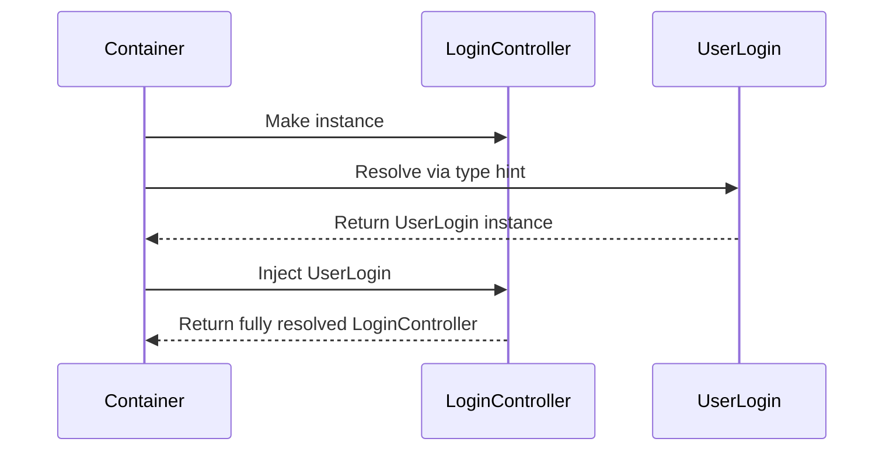
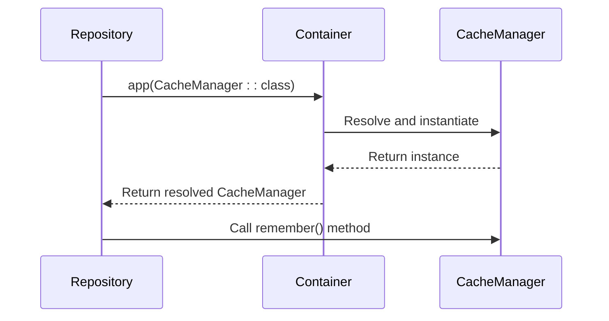
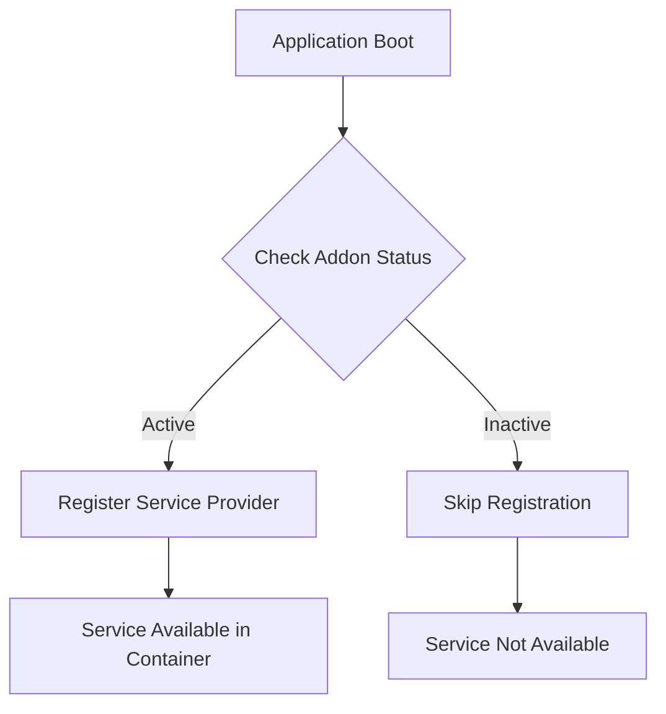
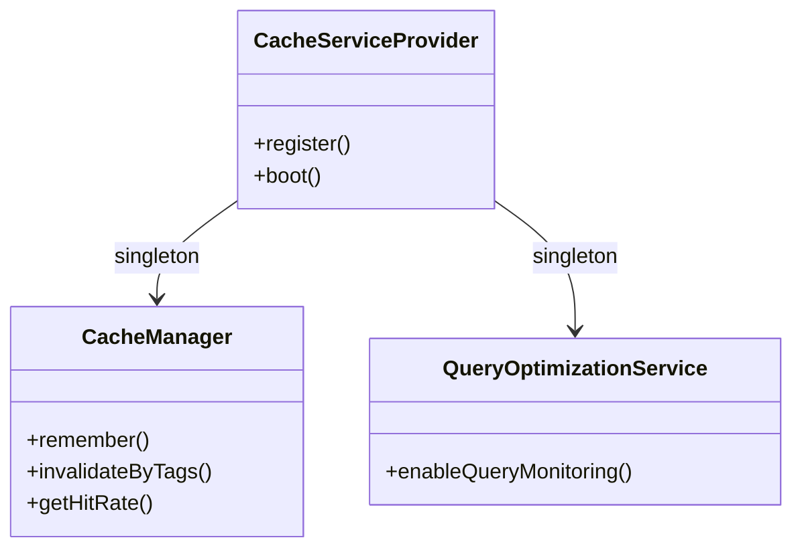

# Container Resolution

<cite>
**Referenced Files in This Document**   
- [app.php](file://main/bootstrap/app.php)
- [AppServiceProvider.php](file://main/app/Providers/AppServiceProvider.php)
- [CacheServiceProvider.php](file://main/app/Providers/CacheServiceProvider.php)
- [ConfigurationRepository.php](file://main/app/Repositories/ConfigurationRepository.php)
- [ConfigurationService.php](file://main/app/Services/ConfigurationService.php)
- [CacheManager.php](file://main/app/Services/CacheManager.php)
- [LoginController.php](file://main/app/Http/Controllers/Auth/LoginController.php)
- [DistributeSignalJob.php](file://main/app/Jobs/DistributeSignalJob.php)
</cite>

## Table of Contents
1. [Introduction](#introduction)
2. [Automatic Dependency Resolution](#automatic-dependency-resolution)
3. [Manual Resolution Methods](#manual-resolution-methods)
4. [Method Injection and Route Resolution](#method-injection-and-route-resolution)
5. [Advanced Resolution Patterns](#advanced-resolution-patterns)
6. [Facades and Container Interaction](#facades-and-container-interaction)
7. [Resolution in Closures and Callbacks](#resolution-in-closures-and-callbacks)
8. [Common Resolution Issues](#common-resolution-issues)
9. [Performance Considerations](#performance-considerations)
10. [Conclusion](#conclusion)

## Introduction
The Laravel service container is a powerful dependency injection system that manages class dependencies and performs automatic dependency resolution. This document explores the various mechanisms through which the container resolves dependencies across the application, from automatic constructor injection to manual resolution methods. The container serves as the central component for managing object creation and dependency injection, ensuring that classes receive their required dependencies without tight coupling.

**Section sources**
- [app.php](file://main/bootstrap/app.php#L1-L56)

## Automatic Dependency Resolution

Laravel's service container automatically resolves dependencies through constructor injection, analyzing the type hints of a class's constructor to determine which services should be injected. This mechanism is evident in various components throughout the application, including controllers and jobs. When a class is instantiated through the container, it examines the constructor's parameters and recursively resolves each dependency based on type hints.

For example, the `LoginController` demonstrates constructor injection by receiving a `UserLogin` service instance:



**Diagram sources**
- [LoginController.php](file://main/app/Http/Controllers/Auth/LoginController.php#L15-L18)

Similarly, jobs like `DistributeSignalJob` leverage the container's ability to resolve dependencies automatically. The job receives its dependencies through the container when dispatched, allowing for clean separation of concerns and testability.

**Section sources**
- [LoginController.php](file://main/app/Http/Controllers/Auth/LoginController.php#L15-L18)
- [DistributeSignalJob.php](file://main/app/Jobs/DistributeSignalJob.php#L56)

## Manual Resolution Methods

When automatic resolution is not feasible or when resolving dependencies outside of the automatic injection context, Laravel provides several manual resolution methods. The most common approaches include using the `app()` helper function and the `App::make()` method, both of which serve as entry points to the service container.

The `ConfigurationRepository` provides a clear example of manual resolution using the `app()` helper to resolve the `CacheManager` service:



**Diagram sources**
- [ConfigurationRepository.php](file://main/app/Repositories/ConfigurationRepository.php#L12)

This pattern allows the repository to leverage caching functionality without requiring it to be injected through the constructor, providing flexibility in scenarios where the dependency is only needed in specific methods.

**Section sources**
- [ConfigurationRepository.php](file://main/app/Repositories/ConfigurationRepository.php#L10-L27)

## Method Injection and Route Resolution

Laravel supports method injection, allowing the container to resolve dependencies for controller methods at runtime. This feature is particularly useful for injecting request objects or other services that are only needed for specific actions. The container analyzes the method's signature and resolves each parameter based on its type hint.

Route parameters are automatically resolved by the container when type-hinted in controller methods. When a route parameter matches a type-hinted Eloquent model, Laravel automatically injects the model instance corresponding to the route parameter's value. This feature eliminates the need for manual model retrieval in controller methods.

The container also handles array dependencies by resolving them based on the container bindings. When an array type is type-hinted, the container can resolve it to a specific implementation or configuration array based on the application's binding configuration.

Optional dependencies with default values are handled gracefully by the container. If a dependency cannot be resolved, the container will use the default value specified in the method signature, preventing resolution failures for non-critical dependencies.

**Section sources**
- [RouteServiceProvider.php](file://main/app/Providers/RouteServiceProvider.php#L36-L53)

## Advanced Resolution Patterns

The application demonstrates advanced resolution patterns through its service provider architecture. The `AppServiceProvider` conditionally registers addon service providers based on their active status, showcasing how the container can be used to implement modular architecture:



**Diagram sources**
- [AppServiceProvider.php](file://main/app/Providers/AppServiceProvider.php#L85-L123)

The container also handles complex dependency chains, such as those involving the `ConfigurationService` which depends on both the `Helper` class and Laravel's `Artisan` facade. These dependencies are resolved recursively, with the container ensuring that all nested dependencies are properly instantiated before being injected.

**Section sources**
- [AppServiceProvider.php](file://main/app/Providers/AppServiceProvider.php#L19-L27)
- [ConfigurationService.php](file://main/app/Services/ConfigurationService.php#L1-L184)

## Facades and Container Interaction

Facades provide a static interface to classes that are available in the application's service container. They serve as "proxies" to underlying classes, allowing for easy access to container-bound services without requiring explicit dependency injection. When a facade method is called, the container resolves the underlying service and delegates the method call to it.

The application uses several facades, as defined in the `config/app.php` file, including `Cache`, `DB`, `Log`, and custom facades like `Image`. These facades allow developers to access services using a static syntax while still benefiting from the container's dependency management capabilities.

Facades retrieve instances from the container by using the `getFacadeAccessor` method, which specifies the container binding that should be resolved. This mechanism ensures that the same instance management and resolution rules apply to facade-accessed services as they do to directly resolved services.

**Section sources**
- [config/app.php](file://main/config/app.php#L204-L245)

## Resolution in Closures and Callbacks

The container can resolve dependencies within closures and callbacks, making it possible to inject services into callback functions. This capability is particularly useful in event listeners, middleware, and other callback-based patterns.

The `CacheManager` service demonstrates this pattern through its `remember` method, which accepts a callback that can contain dependencies resolved by the container:

```php
$cacheManager = app(CacheManager::class);
$cacheManager->remember('configuration.main', 7200, function () {
    return Configuration::first();
}, ['configuration']);
```

This approach allows for lazy loading of expensive operations while still leveraging the container's dependency resolution capabilities within the callback context.

**Section sources**
- [CacheManager.php](file://main/app/Services/CacheManager.php#L18-L38)
- [ConfigurationRepository.php](file://main/app/Repositories/ConfigurationRepository.php#L14-L16)

## Common Resolution Issues

Despite the robustness of Laravel's container, certain issues can arise during dependency resolution. Unresolvable dependencies occur when the container cannot find a binding for a requested class, typically due to missing service providers or incorrect type hints.

Circular references represent another common issue, where two or more classes depend on each other directly or indirectly. This creates an infinite resolution loop that prevents instantiation. The application mitigates this risk through careful architecture and the use of interface-based dependencies.

The container's resolution process can also be affected by binding conflicts, particularly when multiple service providers attempt to bind the same interface to different implementations. The application addresses this through conditional registration in the `AppServiceProvider`, ensuring that only active addons register their services.

**Section sources**
- [AppServiceProvider.php](file://main/app/Providers/AppServiceProvider.php#L109-L111)

## Performance Considerations

The container's resolution process has performance implications that must be considered in high-traffic applications. Each resolution operation involves reflection to analyze class constructors and method signatures, which can add overhead.

To optimize performance, the application employs several strategies:
- Using singleton bindings for services that should have a single instance throughout the request lifecycle
- Implementing conditional service provider registration to reduce the number of registered bindings
- Leveraging the container's ability to cache resolved instances

The `CacheServiceProvider` demonstrates performance optimization by registering the `CacheManager` and `QueryOptimizationService` as singletons, ensuring that these services are only instantiated once per request:



**Diagram sources**
- [CacheServiceProvider.php](file://main/app/Providers/CacheServiceProvider.php#L19-L26)

These optimization strategies reduce the overhead of dependency resolution and improve application performance, particularly in scenarios with complex dependency graphs.

**Section sources**
- [CacheServiceProvider.php](file://main/app/Providers/CacheServiceProvider.php#L16-L27)

## Conclusion
The Laravel service container provides a comprehensive system for managing class dependencies and performing automatic resolution. Through constructor injection, method injection, and manual resolution methods, the container enables flexible and maintainable code organization. The application leverages these mechanisms extensively, from controllers and jobs to repositories and service providers, demonstrating best practices in dependency management. By understanding the container's resolution patterns and performance characteristics, developers can create well-structured applications that are both maintainable and efficient.