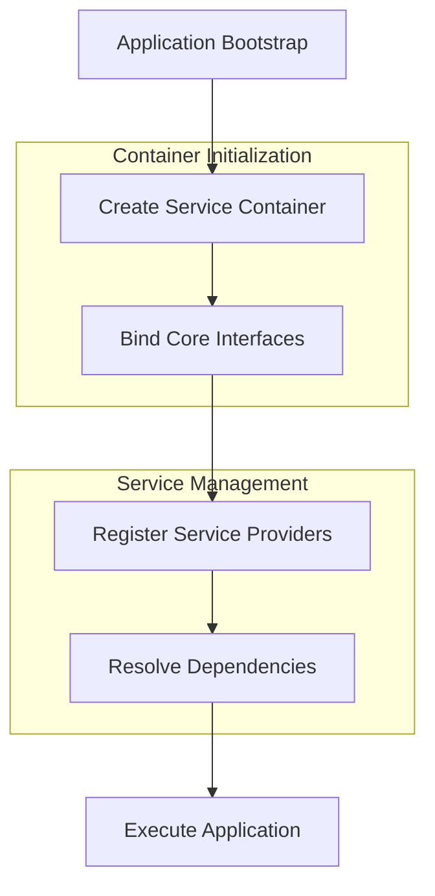
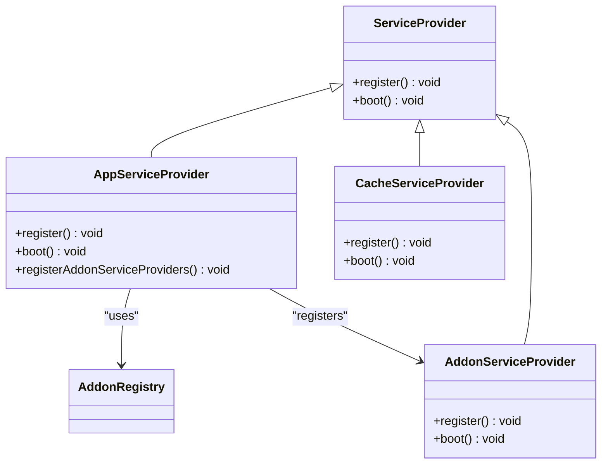
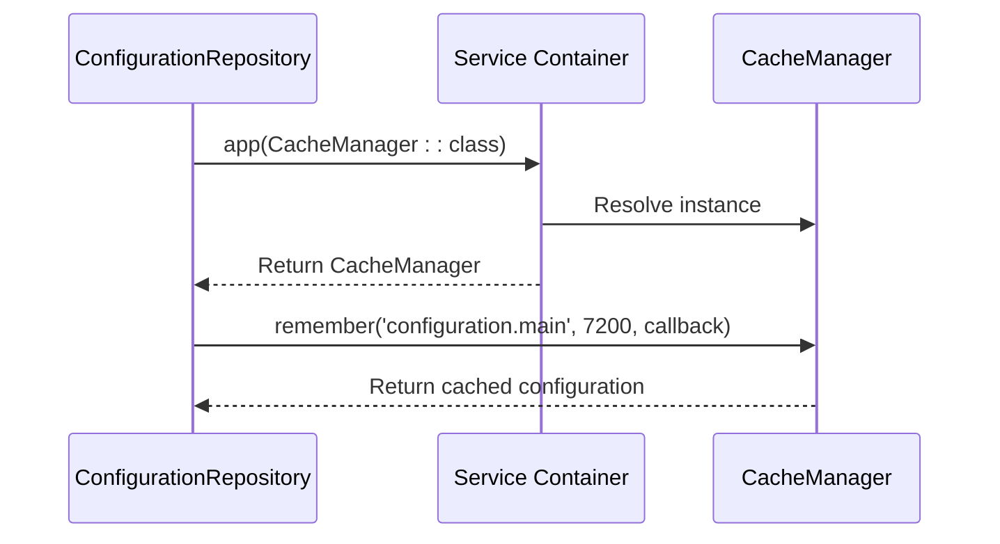
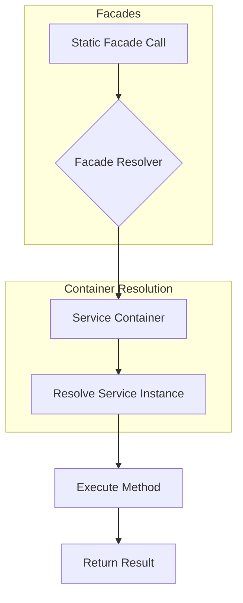
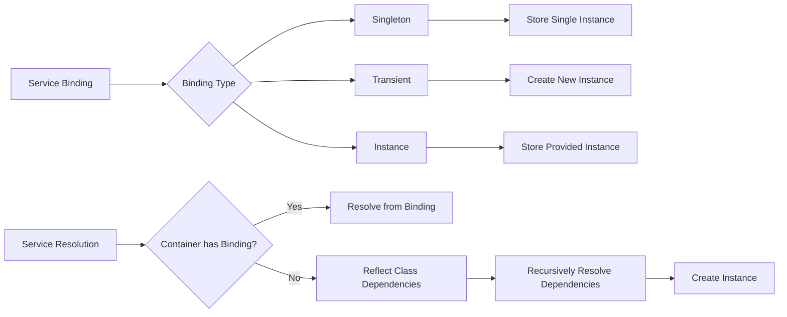
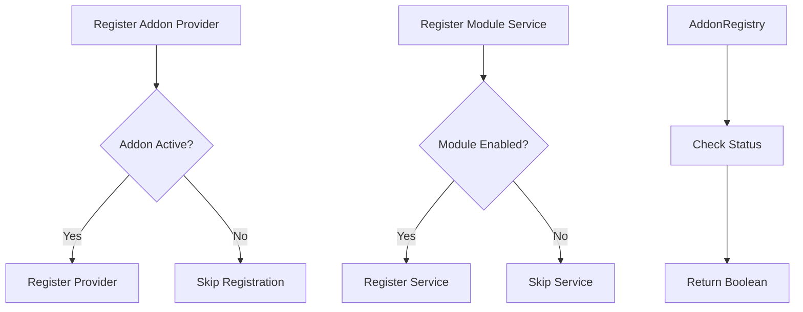
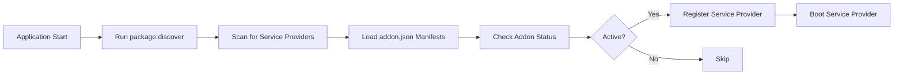
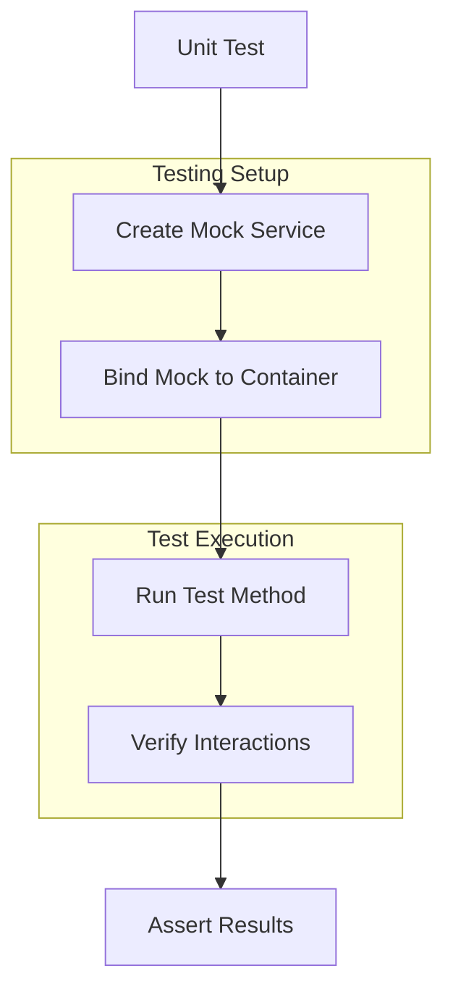

# Dependency Injection & Service Container

<cite>
**Referenced Files in This Document**   
- [app.php](file://main/bootstrap/app.php)
- [app.php](file://main/config/app.php)
- [services.php](file://main/config/services.php)
- [AppServiceProvider.php](file://main/app/Providers/AppServiceProvider.php)
- [CacheServiceProvider.php](file://main/app/Providers/CacheServiceProvider.php)
- [CacheManager.php](file://main/app/Services/CacheManager.php)
- [ConfigurationRepository.php](file://main/app/Repositories/ConfigurationRepository.php)
- [AddonServiceProvider.php](file://main/addons/trading-management-addon/AddonServiceProvider.php)
- [AddonServiceProvider.php](file://main/addons/multi-channel-signal-addon/AddonServiceProvider.php)
- [AddonRegistry.php](file://main/app/Support/AddonRegistry.php)
- [composer.json](file://main/composer.json)
</cite>

## Table of Contents
1. [Introduction](#introduction)
2. [Service Container Fundamentals](#service-container-fundamentals)
3. [Service Provider Registration and Lifecycle](#service-provider-registration-and-lifecycle)
4. [Dependency Injection Patterns](#dependency-injection-patterns)
5. [Facades and Static Access](#facades-and-static-access)
6. [Binding and Resolution Process](#binding-and-resolution-process)
7. [Contextual and Conditional Binding](#contextual-and-conditional-binding)
8. [Service Discovery and Auto-Registration](#service-discovery-and-auto-registration)
9. [Singleton vs Transient Bindings](#singleton-vs-transient-bindings)
10. [Interface-to-Implementation Resolution](#interface-to-implementation-resolution)
11. [Testing with Mocked Dependencies](#testing-with-mocked-dependencies)
12. [Conclusion](#conclusion)

## Introduction
The Laravel service container is a powerful dependency injection system that manages class dependencies and performs automatic dependency resolution throughout the application. This documentation provides a comprehensive analysis of the dependency injection architecture in the AI Trade Pulse application, focusing on how services are registered, resolved, and injected across the core application and addon modules. The system enables flexible, testable, and maintainable code by decoupling component dependencies and providing a centralized mechanism for service management.

## Service Container Fundamentals
The service container in Laravel serves as the Inversion of Control (IoC) container for the entire application, binding all components together. The container is instantiated in the bootstrap process and acts as the central registry for all services.



**Diagram sources**
- [app.php](file://main/bootstrap/app.php#L14-L55)

**Section sources**
- [app.php](file://main/bootstrap/app.php#L1-L55)

## Service Provider Registration and Lifecycle
Service providers are the primary mechanism for registering services with the container. They follow a two-phase lifecycle: registration and booting. The `config/app.php` file contains the list of service providers that are automatically loaded on application startup.

The application uses both Laravel's core service providers and custom providers for specific functionality. The AppServiceProvider plays a crucial role in conditionally registering addon service providers based on their active status, preventing errors when addons are disabled.



**Diagram sources**
- [AppServiceProvider.php](file://main/app/Providers/AppServiceProvider.php#L12-L125)
- [CacheServiceProvider.php](file://main/app/Providers/CacheServiceProvider.php#L9-L42)
- [AddonServiceProvider.php](file://main/addons/trading-management-addon/AddonServiceProvider.php#L24-L301)

**Section sources**
- [AppServiceProvider.php](file://main/app/Providers/AppServiceProvider.php#L12-L125)
- [CacheServiceProvider.php](file://main/app/Providers/CacheServiceProvider.php#L9-L42)
- [app.php](file://main/config/app.php#L143-L188)

## Dependency Injection Patterns
The application employs constructor injection as the primary method for dependency injection. Services are injected into classes through their constructors, allowing the container to automatically resolve and provide the required dependencies.

The CacheManager service demonstrates a clear example of dependency injection, where it uses Laravel's Cache and Redis facades to manage caching operations. The ConfigurationRepository uses method injection through the `app()` helper function to resolve the CacheManager dependency when retrieving configuration data.



**Diagram sources**
- [ConfigurationRepository.php](file://main/app/Repositories/ConfigurationRepository.php#L1-L29)
- [CacheManager.php](file://main/app/Services/CacheManager.php#L1-L282)

**Section sources**
- [ConfigurationRepository.php](file://main/app/Repositories/ConfigurationRepository.php#L1-L29)
- [CacheManager.php](file://main/app/Services/CacheManager.php#L1-L282)

## Facades and Static Access
Facades provide a static interface to services that are available in the application's service container. The application uses Laravel's built-in facades extensively, such as Cache, DB, Log, and Redis, which are registered in the `config/app.php` file under the 'aliases' array.

Custom facades are also implemented, such as the Config facade which is bound to a custom Helper class. This allows for convenient static access to configuration data throughout the application while maintaining the benefits of dependency injection.



**Diagram sources**
- [app.php](file://main/config/app.php#L202-L247)

## Binding and Resolution Process
The binding and resolution process in Laravel's service container follows a systematic approach to manage service lifecycle and dependencies. Services are bound to the container using various methods, with singleton bindings being the most common pattern in this application.

The ConfigurationRepository demonstrates the resolution process by using the `app()` helper function to resolve the CacheManager service. This function acts as a shortcut to the container's `make()` method, retrieving an instance of the specified service.



**Section sources**
- [ConfigurationRepository.php](file://main/app/Repositories/ConfigurationRepository.php#L1-L29)
- [CacheServiceProvider.php](file://main/app/Providers/CacheServiceProvider.php#L19-L26)

## Contextual and Conditional Binding
The application implements conditional binding patterns through the AppServiceProvider, which registers addon service providers only if their corresponding addons are active. This prevents errors during application bootstrap when addons are disabled.

The AddonRegistry class provides the foundation for conditional binding by checking the status of addons and their modules before allowing registration. This pattern ensures that services are only registered when their functionality is needed, improving application performance and stability.



**Diagram sources**
- [AppServiceProvider.php](file://main/app/Providers/AppServiceProvider.php#L85-L123)
- [AddonRegistry.php](file://main/app/Support/AddonRegistry.php#L9-L157)

**Section sources**
- [AppServiceProvider.php](file://main/app/Providers/AppServiceProvider.php#L85-L123)
- [AddonRegistry.php](file://main/app/Support/AddonRegistry.php#L9-L157)

## Service Discovery and Auto-Registration
The application implements a custom service discovery mechanism through the AddonRegistry system, which automatically discovers and registers addon services based on their configuration files. This follows Laravel's package auto-discovery principles but extends them with additional conditional logic.

The composer.json file includes PSR-4 autoloading configurations for all addon modules, ensuring that their classes are properly loaded and available for registration. The post-autoload-dump script runs `php artisan package:discover` to scan for service providers in discovered packages.



**Diagram sources**
- [composer.json](file://main/composer.json#L57-L76)
- [AddonRegistry.php](file://main/app/Support/AddonRegistry.php#L9-L157)

**Section sources**
- [composer.json](file://main/composer.json#L57-L76)
- [AddonRegistry.php](file://main/app/Support/AddonRegistry.php#L9-L157)

## Singleton vs Transient Bindings
The application primarily uses singleton bindings for services that should maintain state or provide consistent behavior across the application lifecycle. The CacheManager and QueryOptimizationService are registered as singletons in the CacheServiceProvider, ensuring that the same instance is shared throughout the application.

Transient bindings are used implicitly for classes that are not explicitly bound to the container, where a new instance is created each time the service is resolved. This pattern is appropriate for stateless services or those that should not share data between requests.

```mermaid
classDiagram
class SingletonService {
-static instance
+getInstance() SingletonService
+getInstance() SingletonService
}
class TransientService {
+TransientService()
+method1() void
+method2() void
}
note right of SingletonService
Single instance shared
across the application
end
note right of TransientService
New instance created
on each resolution
end
```

**Diagram sources**
- [CacheServiceProvider.php](file://main/app/Providers/CacheServiceProvider.php#L19-L26)

**Section sources**
- [CacheServiceProvider.php](file://main/app/Providers/CacheServiceProvider.php#L19-L26)

## Interface-to-Implementation Resolution
The application uses interface-to-implementation resolution in addon modules, where service interfaces are bound to their concrete implementations in service providers. The trading-management-addon demonstrates this pattern by registering various service classes as singletons, effectively binding interfaces to implementations.

The AddonRegistry provides a clean interface for checking addon status, while the concrete implementation handles the file system operations and caching. This separation allows components to depend on abstractions rather than concrete classes, improving testability and maintainability.

```mermaid
classDiagram
class ChannelAdapterInterface {
+connect() bool
+fetchMessages() array
+sendMessage() bool
}
class TelegramAdapter {
+connect() bool
+fetchMessages() array
+sendMessage() bool
-apiClient
}
class RssAdapter {
+connect() bool
+fetchMessages() array
+sendMessage() bool
-httpClient
}
ChannelAdapterInterface <|-- TelegramAdapter
ChannelAdapterInterface <|-- RssAdapter
note right of ChannelAdapterInterface
Contract defining channel
adapter behavior
end
```

**Section sources**
- [CacheServiceProvider.php](file://main/app/Providers/CacheServiceProvider.php#L19-L26)
- [AddonRegistry.php](file://main/app/Support/AddonRegistry.php#L9-L157)

## Testing with Mocked Dependencies
The service container facilitates unit testing by allowing easy replacement of dependencies with mocks or stubs. Services registered with the container can be mocked using Laravel's testing helpers, enabling isolated testing of components without relying on external systems or complex dependencies.

The application's architecture supports testing by injecting dependencies through constructors or method calls, making it straightforward to substitute real services with test doubles. The use of interfaces for service contracts further enhances testability by allowing mock implementations to satisfy type hints.



**Section sources**
- [CacheManager.php](file://main/app/Services/CacheManager.php#L1-L282)
- [ConfigurationRepository.php](file://main/app/Repositories/ConfigurationRepository.php#L1-L29)

## Conclusion
The Laravel service container in the AI Trade Pulse application provides a robust foundation for dependency management and inversion of control. Through strategic use of service providers, facades, and conditional binding, the system effectively manages complex dependencies across the core application and addon modules. The implementation of the AddonRegistry enables dynamic service discovery and registration, allowing for flexible extension of functionality while maintaining application stability. By following Laravel's dependency injection patterns, the application achieves a high degree of modularity, testability, and maintainability, making it well-suited for the complex trading and AI integration features it supports.