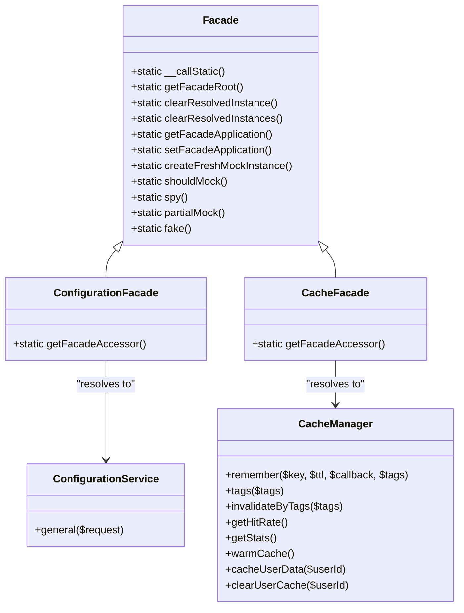
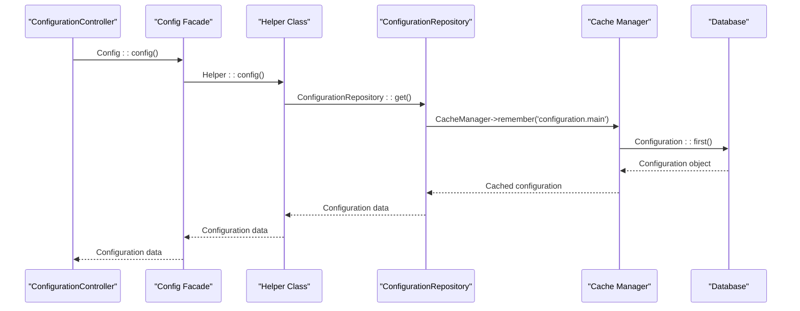
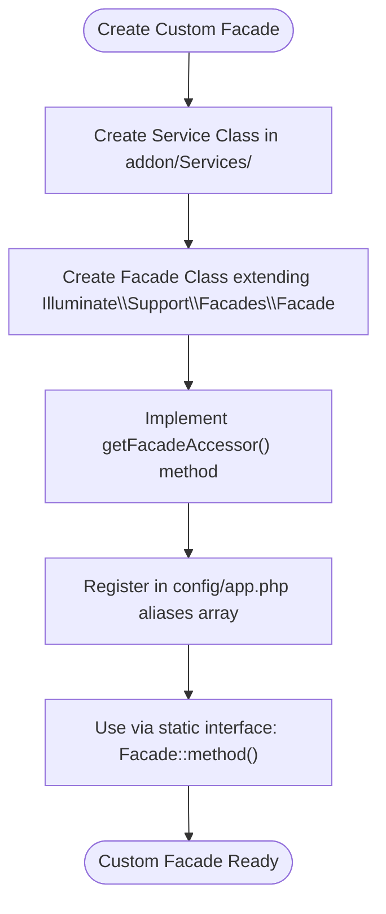
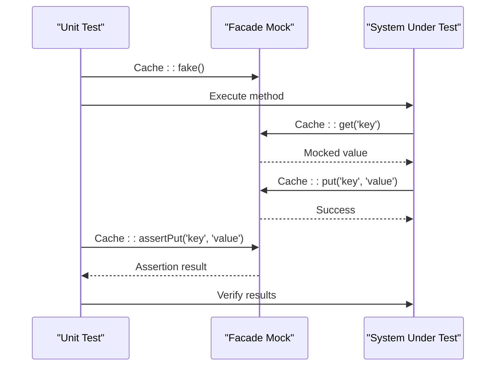

# Facades

<cite>
**Referenced Files in This Document**   
- [ConfigurationService.php](file://main/app/Services/ConfigurationService.php)
- [CacheManager.php](file://main/app/Services/CacheManager.php)
- [app.php](file://main/config/app.php)
- [Helper.php](file://main/app/Helpers/Helper.php)
- [ConfigurationRepository.php](file://main/app/Repositories/ConfigurationRepository.php)
- [GlobalConfigurationService.php](file://main/app/Services/GlobalConfigurationService.php)
- [ConfigurationController.php](file://main/app/Http/Controllers/Backend/ConfigurationController.php)
</cite>

## Table of Contents
1. [Introduction](#introduction)
2. [Facades Implementation Pattern](#facades-implementation-pattern)
3. [ConfigurationService and Config Facade](#configurationservice-and-config-facade)
4. [CacheManager and Cache Facade](#cachemanager-and-cache-facade)
5. [Custom Facade Creation and Registration](#custom-facade-creation-and-registration)
6. [Facades in Controllers and Jobs](#facades-in-controllers-and-jobs)
7. [Testability and Mocking](#testability-and-mocking)
8. [Performance Considerations](#performance-considerations)
9. [Best Practices](#best-practices)
10. [Conclusion](#conclusion)

## Introduction
Laravel facades provide a static interface to classes that are available in the application's service container. This documentation explores the facade implementation in the application, focusing on the ConfigurationService and CacheManager as practical examples. The document details how facades like Config::get() and Cache::put() resolve to underlying services, explains the creation of custom facades for addon services, and addresses best practices for using facades versus dependency injection.

## Facades Implementation Pattern
Laravel facades work by providing a static interface to services stored in the service container. When a static method is called on a facade, it resolves the underlying service from the container and calls the corresponding method. The __callStatic() method in the base Facade class is responsible for this resolution and method invocation.

The facade pattern allows developers to access complex services with a simple, clean syntax without sacrificing the benefits of dependency injection and testability. Each facade extends the Illuminate\Support\Facades\Facade class and implements the getFacadeAccessor() method, which returns the container binding key for the underlying service.



**Diagram sources**
- [app.php](file://main/config/app.php#L242)
- [Helper.php](file://main/app/Helpers/Helper.php#L33)
- [CacheManager.php](file://main/app/Services/CacheManager.php#L9)

## ConfigurationService and Config Facade
The ConfigurationService and Config facade demonstrate how facades provide access to configuration data. In this application, the Config facade is aliased to the Helper class in the config/app.php file, which acts as a bridge to the actual configuration service.

The ConfigurationService handles various types of configuration updates (general, API, others, preferences) and stores them in the database. It also updates environment variables and clears configuration cache when changes are made. The Helper class provides static methods to access configuration data, which are accessed through the Config facade.

When Config::config() is called, it resolves to the Helper class and calls the config() method, which in turn uses the ConfigurationRepository to retrieve configuration data with caching support.



**Diagram sources**
- [ConfigurationService.php](file://main/app/Services/ConfigurationService.php#L12)
- [Helper.php](file://main/app/Helpers/Helper.php#L63)
- [ConfigurationRepository.php](file://main/app/Repositories/ConfigurationRepository.php#L10)
- [CacheManager.php](file://main/app/Services/CacheManager.php#L18)

**Section sources**
- [ConfigurationService.php](file://main/app/Services/ConfigurationService.php#L1-L184)
- [Helper.php](file://main/app/Helpers/Helper.php#L63-L66)
- [ConfigurationRepository.php](file://main/app/Repositories/ConfigurationRepository.php#L10-L17)

## CacheManager and Cache Facade
The CacheManager and Cache facade illustrate how caching services are accessed through facades. The Cache facade provides a static interface to Laravel's cache system, while the CacheManager class implements application-specific caching logic with tagging, statistics, and warming capabilities.

The CacheManager class uses the Cache facade internally to interact with the cache store. It implements methods for remembering values with tags, invalidating cache by tags, retrieving cache statistics, and warming frequently accessed data. The cache warming functionality pre-loads commonly accessed data into cache during application initialization or maintenance windows.

When Cache::remember() is called, it resolves to the Illuminate\Support\Facades\Cache class, which interacts with the configured cache driver (file, Redis, database, etc.). The CacheManager enhances this functionality by adding tagging support and performance monitoring.

```mermaid
classDiagram
class CacheManager {
+remember($key, $ttl, $callback, $tags)
+tags($tags)
+invalidateByTags($tags)
+getHitRate()
+getStats()
+warmCache()
+cacheUserData($userId)
+clearUserCache($userId)
+buildKey($key)
+storeTags($key, $tags)
+getMemoryStats()
+clearAll()
+getCacheSize()
}
class CacheFacade {
+static getFacadeAccessor()
}
class ConfigurationRepository {
+get()
+clearCache()
}
class GlobalConfigurationService {
+get($key, $default, $useCache)
+set($key, $value, $description)
+all()
+has($key)
+delete($key)
+clearCache()
}
CacheFacade --> CacheManager : "used by"
ConfigurationRepository --> CacheManager : "uses"
GlobalConfigurationService --> CacheManager : "uses"
CacheManager --> "Illuminate\Support\Facades\Cache" : "uses"
```

**Diagram sources**
- [CacheManager.php](file://main/app/Services/CacheManager.php#L9)
- [ConfigurationRepository.php](file://main/app/Repositories/ConfigurationRepository.php#L10)
- [GlobalConfigurationService.php](file://main/app/Services/GlobalConfigurationService.php#L19)

**Section sources**
- [CacheManager.php](file://main/app/Services/CacheManager.php#L1-L282)
- [ConfigurationRepository.php](file://main/app/Repositories/ConfigurationRepository.php#L10-L17)
- [GlobalConfigurationService.php](file://main/app/Services/GlobalConfigurationService.php#L19-L37)

## Custom Facade Creation and Registration
Custom facades can be created for addon services and registered in the config/app.php aliases array. In this application, the Config facade is implemented by aliasing it to the Helper class in the config/app.php file.

To create a custom facade for an addon service:
1. Create a service class in the addon's Services directory
2. Create a facade class that extends Illuminate\Support\Facades\Facade
3. Implement the getFacadeAccessor() method to return the service's container binding
4. Register the facade in the config/app.php aliases array

The application demonstrates this pattern with the Config facade, which is registered in config/app.php as 'Config' => Helper::class. This allows the Helper class to be accessed statically through Config::method() calls.

For addon services, the same pattern can be followed by creating a service class in the addon's Services directory and registering a facade alias in config/app.php. This enables addon services to be accessed through clean, static interfaces while maintaining the benefits of dependency injection and testability.



**Diagram sources**
- [app.php](file://main/config/app.php#L204-L246)
- [Helper.php](file://main/app/Helpers/Helper.php#L33)

**Section sources**
- [app.php](file://main/config/app.php#L204-L246)
- [Helper.php](file://main/app/Helpers/Helper.php#L33)

## Facades in Controllers and Jobs
Facades are extensively used in controllers and jobs throughout the application for various purposes. The ConfigurationController uses the Config facade to access configuration data and the Cache facade to manage cache invalidation.

In controllers, facades provide convenient access to services without requiring constructor injection. For example, the ConfigurationController uses Config::config() to retrieve configuration data and Cache::forget() to clear cache when configuration is updated.

In jobs, facades are used to perform background tasks such as processing channel messages, distributing signals, and sending emails. The ProcessChannelMessage job uses the Cache facade to store processed messages and the DB facade to update database records.

The use of facades in controllers and jobs simplifies code and improves readability, while still allowing for proper testing through mocking. However, for complex dependencies or when the same service is used multiple times in a class, constructor injection may be preferred for better maintainability.

**Section sources**
- [ConfigurationController.php](file://main/app/Http/Controllers/Backend/ConfigurationController.php#L37)
- [ConfigurationService.php](file://main/app/Services/ConfigurationService.php#L175)
- [CacheManager.php](file://main/app/Services/CacheManager.php#L18)

## Testability and Mocking
Facades enhance testability by allowing easy mocking of dependencies in unit tests. Laravel provides several methods for mocking facades, including fake(), spy(), and partialMock().

When testing classes that use facades, developers can mock the facade to return specific values or verify that certain methods were called. This allows for isolated testing of business logic without depending on external services or database interactions.

For example, when testing the ConfigurationService, the Cache facade can be faked to prevent actual cache operations during tests. Similarly, the DB facade can be mocked to prevent database writes while testing business logic.

The ability to mock facades makes it easier to write comprehensive unit tests that focus on specific functionality without the overhead of setting up complex dependencies. This leads to faster test execution and more reliable test results.



**Diagram sources**
- [ConfigurationService.php](file://main/app/Services/ConfigurationService.php#L175)
- [CacheManager.php](file://main/app/Services/CacheManager.php#L18)

## Performance Considerations
While facades provide convenience and clean syntax, they have performance implications that should be considered. Each facade call requires resolving the underlying service from the container, which adds a small overhead compared to direct dependency injection.

In high-performance scenarios or when a service is called frequently within a single request, constructor injection may be more efficient as the service is resolved once and stored as a property. This eliminates the need for repeated container lookups.

The CacheManager class demonstrates a balanced approach by using the Cache facade for external access while storing internal state (hit/miss counts) as properties. This minimizes container lookups for frequently accessed data while maintaining the convenience of the facade pattern.

For addon modules, developers should consider the frequency of service usage when deciding between facades and constructor injection. Services that are called multiple times within a single class should typically be injected via the constructor, while services used occasionally may be accessed via facades for simplicity.

**Section sources**
- [CacheManager.php](file://main/app/Services/CacheManager.php#L11-L13)
- [ConfigurationService.php](file://main/app/Services/ConfigurationService.php#L175)

## Best Practices
When using facades versus constructor injection, particularly in addon modules, consider the following best practices:

1. Use facades for services that are used occasionally or in multiple, unrelated classes
2. Use constructor injection for services that are used frequently within a single class
3. Prefer constructor injection for complex dependencies or when the same service is used multiple times
4. Use facades for global, application-wide services like configuration, logging, and caching
5. Consider testability and ease of mocking when choosing between facades and injection
6. Document the choice of facade versus injection in the code comments
7. Be consistent within a module or component

For addon modules, follow the same patterns as the core application. Use facades for services that need to be accessed from multiple locations, and use constructor injection for services that are tightly coupled to a specific class.

The application demonstrates these best practices by using the Config facade for global configuration access while injecting specific services like ConfigurationService and CacheManager into controllers that use them extensively.

**Section sources**
- [ConfigurationController.php](file://main/app/Http/Controllers/Backend/ConfigurationController.php#L25)
- [ConfigurationService.php](file://main/app/Services/ConfigurationService.php#L12)
- [CacheManager.php](file://main/app/Services/CacheManager.php#L9)

## Conclusion
Facades in Laravel provide a powerful pattern for accessing services through a clean, static interface while maintaining the benefits of dependency injection and testability. The application demonstrates effective use of facades through the Config and Cache facades, which provide convenient access to configuration and caching services.

By understanding the implementation pattern, performance considerations, and best practices for using facades, developers can make informed decisions about when to use facades versus constructor injection. This leads to more maintainable, testable, and performant code in both the core application and addon modules.