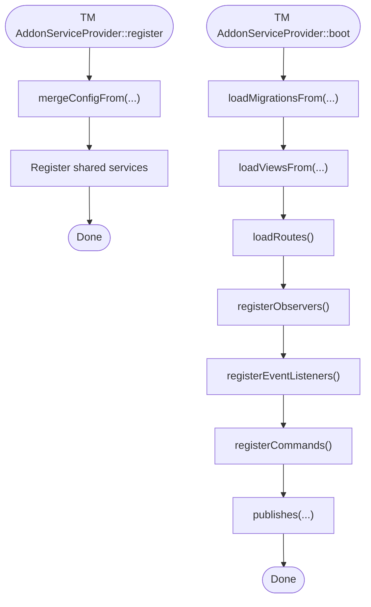

# Service Providers

<cite>
**Referenced Files in This Document**
- [AppServiceProvider.php](file://main/app/Providers/AppServiceProvider.php)
- [RouteServiceProvider.php](file://main/app/Providers/RouteServiceProvider.php)
- [app.php](file://main/config/app.php)
- [AddonRegistry.php](file://main/app/Support/AddonRegistry.php)
- [AddonServiceProvider.php (AI Connection)](file://main/addons/ai-connection-addon/AddonServiceProvider.php)
- [AddonServiceProvider.php (Trading Management)](file://main/addons/trading-management-addon/AddonServiceProvider.php)
- [PageBuilderServiceProvider.php](file://main/addons/page-builder-addon/PageBuilderServiceProvider.php)
- [Kernel.php](file://main/app/Console/Kernel.php)
- [console.php](file://main/routes/console.php)
</cite>

## Table of Contents
1. [Introduction](#introduction)
2. [Project Structure](#project-structure)
3. [Core Components](#core-components)
4. [Architecture Overview](#architecture-overview)
5. [Detailed Component Analysis](#detailed-component-analysis)
6. [Dependency Analysis](#dependency-analysis)
7. [Performance Considerations](#performance-considerations)
8. [Troubleshooting Guide](#troubleshooting-guide)
9. [Conclusion](#conclusion)
10. [Appendices](#appendices)

## Introduction
This document explains the service provider system in Laravel as implemented in this project. It focuses on how service providers bootstrap application services, register bindings in the service container, and coordinate addon modules. It covers the differences between the register() and boot() methods, how providers are declared in the configuration, and how addon providers are conditionally loaded. It also demonstrates how providers register custom Artisan commands, middleware, routes, and event listeners, and outlines the provider lifecycle and dependency ordering considerations.

## Project Structure
The service provider ecosystem spans core application providers and addon-specific providers. Core providers are declared in the application configuration and include the primary application provider and the route provider. Addon providers are dynamically registered by the application provider based on addon activation and module enablement.

**Diagram sources**
- [app.php](file://main/config/app.php#L143-L189)
- [AppServiceProvider.php](file://main/app/Providers/AppServiceProvider.php#L19-L27)
- [RouteServiceProvider.php](file://main/app/Providers/RouteServiceProvider.php#L36-L54)
- [AddonRegistry.php](file://main/app/Support/AddonRegistry.php#L33-L42)
- [AddonServiceProvider.php (AI Connection)](file://main/addons/ai-connection-addon/AddonServiceProvider.php#L16-L27)
- [AddonServiceProvider.php (Trading Management)](file://main/addons/trading-management-addon/AddonServiceProvider.php#L31-L39)
- [PageBuilderServiceProvider.php](file://main/addons/page-builder-addon/PageBuilderServiceProvider.php#L16-L27)

**Section sources**
- [app.php](file://main/config/app.php#L143-L189)

## Core Components
- AppServiceProvider: Registers global bindings and conditionally registers addon providers based on activation and module enablement. Performs runtime boot tasks such as global view composers and query logging.
- RouteServiceProvider: Defines rate limiting and loads web, API, and admin route groups.
- AddonRegistry: Centralized utility to check addon status and module enablement, used by both the application provider and addon providers.
- Addon providers: Each addon provider registers its services, loads migrations, views, routes, commands, observers, and listeners.

**Section sources**
- [AppServiceProvider.php](file://main/app/Providers/AppServiceProvider.php#L19-L27)
- [RouteServiceProvider.php](file://main/app/Providers/RouteServiceProvider.php#L36-L54)
- [AddonRegistry.php](file://main/app/Support/AddonRegistry.php#L33-L42)
- [AddonServiceProvider.php (AI Connection)](file://main/addons/ai-connection-addon/AddonServiceProvider.php#L16-L27)
- [AddonServiceProvider.php (Trading Management)](file://main/addons/trading-management-addon/AddonServiceProvider.php#L31-L39)
- [PageBuilderServiceProvider.php](file://main/addons/page-builder-addon/PageBuilderServiceProvider.php#L16-L27)

## Architecture Overview
The application provider acts as a central orchestrator for addon loading. It reads addon manifests via AddonRegistry and conditionally registers addon providers. Addon providers then register their own services, routes, commands, and listeners. RouteServiceProvider defines the routing surface for the application.

**Diagram sources**
- [app.php](file://main/config/app.php#L143-L189)
- [AppServiceProvider.php](file://main/app/Providers/AppServiceProvider.php#L85-L123)
- [AddonRegistry.php](file://main/app/Support/AddonRegistry.php#L33-L58)
- [AddonServiceProvider.php (AI Connection)](file://main/addons/ai-connection-addon/AddonServiceProvider.php#L27-L67)
- [AddonServiceProvider.php (Trading Management)](file://main/addons/trading-management-addon/AddonServiceProvider.php#L45-L89)
- [PageBuilderServiceProvider.php](file://main/addons/page-builder-addon/PageBuilderServiceProvider.php#L32-L53)

## Detailed Component Analysis

### AppServiceProvider: register() vs boot()
- register(): Used to register bindings and prepare the container. In this project, it conditionally registers addon providers and registers a singleton service for queue optimization.
- boot(): Used for runtime initialization. It disables Eloquent model guards, sets pagination style, logs database queries when enabled, and attaches a global view composer to ensure a page variable is always available. It also integrates SEO metadata when an addon is active.

**Diagram sources**
- [AppServiceProvider.php](file://main/app/Providers/AppServiceProvider.php#L85-L123)

**Section sources**
- [AppServiceProvider.php](file://main/app/Providers/AppServiceProvider.php#L19-L27)
- [AppServiceProvider.php](file://main/app/Providers/AppServiceProvider.php#L29-L78)
- [AppServiceProvider.php](file://main/app/Providers/AppServiceProvider.php#L85-L123)

### RouteServiceProvider: Routing Boot
- boot(): Configures rate limiting and loads route groups for API, web, and admin routes. This provider defines the routing surface for the application.

**Diagram sources**
- [RouteServiceProvider.php](file://main/app/Providers/RouteServiceProvider.php#L36-L54)

**Section sources**
- [RouteServiceProvider.php](file://main/app/Providers/RouteServiceProvider.php#L36-L54)

### AddonRegistry: Activation and Module Enablement
- active(slug): Checks if an addon is active by reading its manifest.
- moduleEnabled(slug, moduleKey): Checks if a specific module within an addon is enabled.

**Diagram sources**
- [AddonRegistry.php](file://main/app/Support/AddonRegistry.php#L33-L58)

**Section sources**
- [AddonRegistry.php](file://main/app/Support/AddonRegistry.php#L33-L58)

### AddonServiceProvider (AI Connection): register() and boot()
- register(): Registers singletons for core services used by the addon.
- boot(): Loads migrations and views, conditionally loads API and admin routes, and registers console commands when running in console and the module is enabled.

**Diagram sources**
- [AddonServiceProvider.php (AI Connection)](file://main/addons/ai-connection-addon/AddonServiceProvider.php#L16-L27)
- [AddonServiceProvider.php (AI Connection)](file://main/addons/ai-connection-addon/AddonServiceProvider.php#L27-L67)

**Section sources**
- [AddonServiceProvider.php (AI Connection)](file://main/addons/ai-connection-addon/AddonServiceProvider.php#L16-L27)
- [AddonServiceProvider.php (AI Connection)](file://main/addons/ai-connection-addon/AddonServiceProvider.php#L27-L67)

### AddonServiceProvider (Trading Management): register() and boot()
- register(): Merges addon configuration and registers shared services for multiple modules.
- boot(): Loads migrations, views, routes (admin, user, API), registers observers, event listeners, publishes assets, and registers console commands when running in console.

**Diagram sources**
- [AddonServiceProvider.php (Trading Management)](file://main/addons/trading-management-addon/AddonServiceProvider.php#L31-L39)
- [AddonServiceProvider.php (Trading Management)](file://main/addons/trading-management-addon/AddonServiceProvider.php#L45-L89)
- [AddonServiceProvider.php (Trading Management)](file://main/addons/trading-management-addon/AddonServiceProvider.php#L197-L239)
- [AddonServiceProvider.php (Trading Management)](file://main/addons/trading-management-addon/AddonServiceProvider.php#L267-L282)

**Section sources**
- [AddonServiceProvider.php (Trading Management)](file://main/addons/trading-management-addon/AddonServiceProvider.php#L31-L39)
- [AddonServiceProvider.php (Trading Management)](file://main/addons/trading-management-addon/AddonServiceProvider.php#L45-L89)
- [AddonServiceProvider.php (Trading Management)](file://main/addons/trading-management-addon/AddonServiceProvider.php#L197-L239)
- [AddonServiceProvider.php (Trading Management)](file://main/addons/trading-management-addon/AddonServiceProvider.php#L267-L282)

### AddonServiceProvider (Page Builder): register() and boot()
- register(): Registers multiple singletons for page builder services.
- boot(): Loads migrations and views, and conditionally loads admin routes when the module is enabled.

**Section sources**
- [PageBuilderServiceProvider.php](file://main/addons/page-builder-addon/PageBuilderServiceProvider.php#L16-L27)
- [PageBuilderServiceProvider.php](file://main/addons/page-builder-addon/PageBuilderServiceProvider.php#L32-L53)

### Artisan Commands Registration
- Application-level commands are loaded via the console kernel’s commands() method and console routes.
- Addon providers can register their own commands using the provider’s boot() method when running in console and when modules are enabled.

Examples of command registration patterns:
- Application: [console.php](file://main/routes/console.php#L1-L19), [Kernel.php](file://main/app/Console/Kernel.php#L179-L184)
- Addon (AI Connection): [AddonServiceProvider.php (AI Connection)](file://main/addons/ai-connection-addon/AddonServiceProvider.php#L60-L66)
- Addon (Trading Management): [AddonServiceProvider.php (Trading Management)](file://main/addons/trading-management-addon/AddonServiceProvider.php#L272-L282)

**Section sources**
- [console.php](file://main/routes/console.php#L1-L19)
- [Kernel.php](file://main/app/Console/Kernel.php#L179-L184)
- [AddonServiceProvider.php (AI Connection)](file://main/addons/ai-connection-addon/AddonServiceProvider.php#L60-L66)
- [AddonServiceProvider.php (Trading Management)](file://main/addons/trading-management-addon/AddonServiceProvider.php#L272-L282)

### Middleware and Routes
- RouteServiceProvider loads route groups with middleware stacks for API, web, and admin contexts.
- Addon providers conditionally load admin and API routes with appropriate middleware and prefixes.

Examples:
- RouteServiceProvider: [RouteServiceProvider.php](file://main/app/Providers/RouteServiceProvider.php#L40-L53)
- AI Connection Addon: [AddonServiceProvider.php (AI Connection)](file://main/addons/ai-connection-addon/AddonServiceProvider.php#L39-L57)
- Trading Management Addon: [AddonServiceProvider.php (Trading Management)](file://main/addons/trading-management-addon/AddonServiceProvider.php#L202-L239)

**Section sources**
- [RouteServiceProvider.php](file://main/app/Providers/RouteServiceProvider.php#L40-L53)
- [AddonServiceProvider.php (AI Connection)](file://main/addons/ai-connection-addon/AddonServiceProvider.php#L39-L57)
- [AddonServiceProvider.php (Trading Management)](file://main/addons/trading-management-addon/AddonServiceProvider.php#L202-L239)

### Event Listeners and Observers
- Addon providers register event listeners and model observers to integrate with application events and model lifecycle hooks.

Example:
- Trading Management Addon: [AddonServiceProvider.php (Trading Management)](file://main/addons/trading-management-addon/AddonServiceProvider.php#L120-L141)

**Section sources**
- [AddonServiceProvider.php (Trading Management)](file://main/addons/trading-management-addon/AddonServiceProvider.php#L120-L141)

## Dependency Analysis
- AppServiceProvider depends on AddonRegistry to decide whether to register addon providers.
- Addon providers depend on AddonRegistry to gate route and command registration by module enablement.
- RouteServiceProvider depends on the framework’s Route facade to load route files.

**Diagram sources**
- [AddonRegistry.php](file://main/app/Support/AddonRegistry.php#L33-L58)
- [AppServiceProvider.php](file://main/app/Providers/AppServiceProvider.php#L85-L123)
- [AddonServiceProvider.php (AI Connection)](file://main/addons/ai-connection-addon/AddonServiceProvider.php#L27-L67)
- [AddonServiceProvider.php (Trading Management)](file://main/addons/trading-management-addon/AddonServiceProvider.php#L45-L89)
- [PageBuilderServiceProvider.php](file://main/addons/page-builder-addon/PageBuilderServiceProvider.php#L32-L53)

**Section sources**
- [AddonRegistry.php](file://main/app/Support/AddonRegistry.php#L33-L58)
- [AppServiceProvider.php](file://main/app/Providers/AppServiceProvider.php#L85-L123)
- [AddonServiceProvider.php (AI Connection)](file://main/addons/ai-connection-addon/AddonServiceProvider.php#L27-L67)
- [AddonServiceProvider.php (Trading Management)](file://main/addons/trading-management-addon/AddonServiceProvider.php#L45-L89)
- [PageBuilderServiceProvider.php](file://main/addons/page-builder-addon/PageBuilderServiceProvider.php#L32-L53)

## Performance Considerations
- Conditional registration: Addon providers are only registered when their addons are active, preventing unnecessary overhead.
- Lazy loading: Views, routes, and commands are loaded conditionally based on module enablement.
- Query logging: The application provider conditionally enables query logging, which can impact performance in development environments.

[No sources needed since this section provides general guidance]

## Troubleshooting Guide
Common issues and resolutions:
- Addon not loading: Verify the addon’s status and module enablement via AddonRegistry. Ensure the addon provider class exists and is autoloadable.
- Routes not appearing: Confirm that the addon’s routes file exists and that the provider’s boot() method is loading routes for the correct middleware and prefix.
- Commands not available: Ensure the provider registers commands in console mode and that the commands are autoloaded.
- Circular dependencies: Avoid cross-dependencies between addon providers. If two addons must interact, centralize the integration in the application provider or a shared service.

**Section sources**
- [AddonRegistry.php](file://main/app/Support/AddonRegistry.php#L33-L58)
- [AppServiceProvider.php](file://main/app/Providers/AppServiceProvider.php#L85-L123)
- [AddonServiceProvider.php (AI Connection)](file://main/addons/ai-connection-addon/AddonServiceProvider.php#L27-L67)
- [AddonServiceProvider.php (Trading Management)](file://main/addons/trading-management-addon/AddonServiceProvider.php#L267-L282)

## Conclusion
Service providers in this project are organized around a central orchestration role in AppServiceProvider, with addon providers encapsulating their own services, routes, commands, and integrations. The register() method prepares the container while boot() performs runtime initialization. AddonRegistry provides a consistent way to gate functionality by activation and module enablement. This design promotes modularity, scalability, and maintainability.

[No sources needed since this section summarizes without analyzing specific files]

## Appendices

### How Providers Are Declared and Loaded
- Core providers are listed in the application configuration and are autoloaded on requests.
- Addon providers are conditionally registered by AppServiceProvider based on AddonRegistry checks.

**Section sources**
- [app.php](file://main/config/app.php#L143-L189)
- [AppServiceProvider.php](file://main/app/Providers/AppServiceProvider.php#L85-L123)

### Lifecycle and Dependency Ordering
- register() runs before boot(). Bindings should be prepared in register(); runtime initialization in boot().
- Use AddonRegistry to avoid circular dependencies by deferring conditional logic to boot() and gating by activation/status.

[No sources needed since this section provides general guidance]