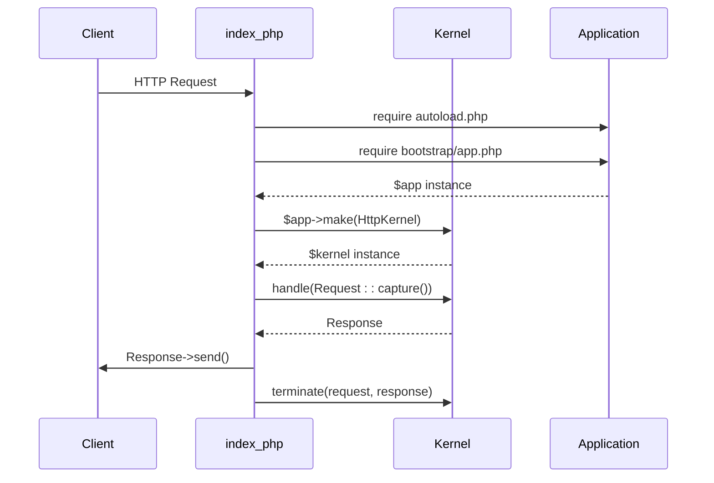
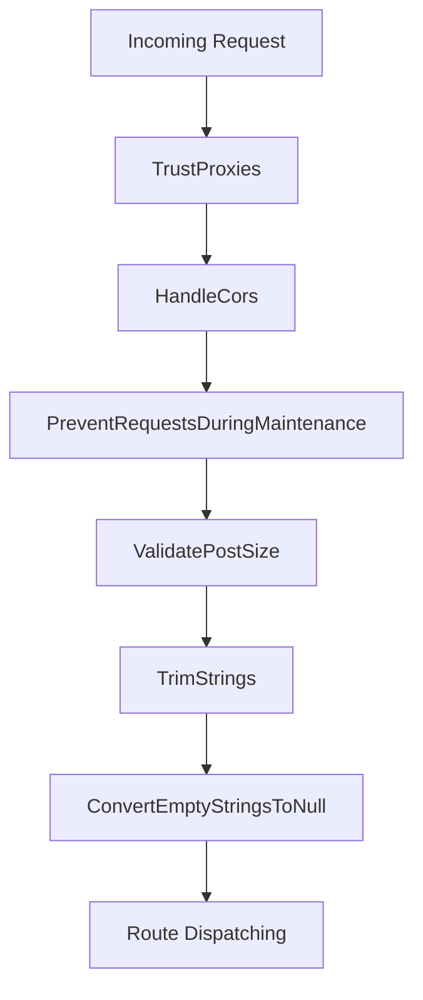
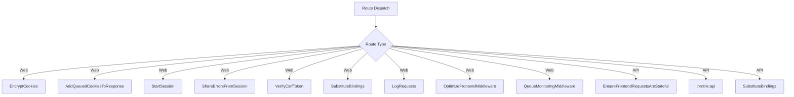
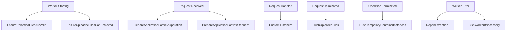
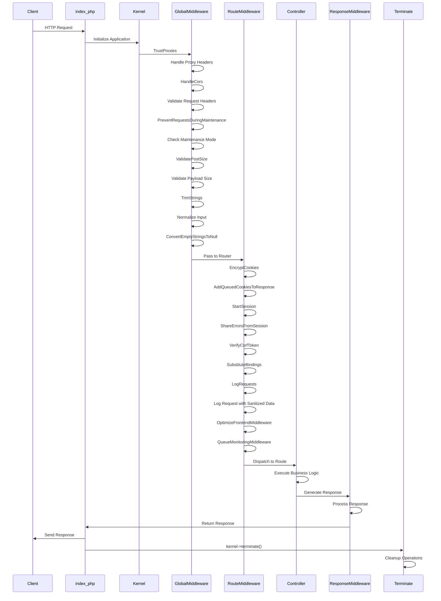

# Request Lifecycle

<cite>
**Referenced Files in This Document**   
- [index.php](file://main/public/index.php)
- [app.php](file://bootstrap/app.php)
- [Kernel.php](file://app/Http/Kernel.php)
- [octane.php](file://config/octane.php)
- [web.php](file://routes/web.php)
- [LogRequests.php](file://app/Http/Middleware/LogRequests.php)
- [QueueMonitoringMiddleware.php](file://app/Http/Middleware/QueueMonitoringMiddleware.php)
- [TrustProxies.php](file://app/Http/Middleware/TrustProxies.php)
- [HandleCors.php](file://vendor/fruitcake/laravel-cors/src/HandleCors.php)
- [ValidatePostSize.php](file://app/Http/Middleware/ValidatePostSize.php)
- [Authenticate.php](file://app/Http/Middleware/Authenticate.php)
- [ThrottleRequests.php](file://app/Http/Middleware/ThrottleRequests.php)
</cite>

## Table of Contents
1. [Introduction](#introduction)
2. [Request Lifecycle Overview](#request-lifecycle-overview)
3. [HTTP Request Reception](#http-request-reception)
4. [Global Middleware Processing](#global-middleware-processing)
5. [Route-Specific Middleware](#route-specific-middleware)
6. [Request Logging and Monitoring](#request-logging-and-monitoring)
7. [Response Generation and Termination](#response-generation-and-termination)
8. [Octane Optimization](#octane-optimization)
9. [Error Handling](#error-handling)
10. [Sequence Diagram](#sequence-diagram)

## Introduction

The Laravel request lifecycle in the trading platform follows a structured flow from HTTP request reception through middleware processing to route dispatching and response generation. This document details the complete lifecycle, focusing on the middleware pipeline, request logging, performance monitoring, and Octane optimization. The platform implements a comprehensive middleware stack that processes every request through global, group, and route-specific middleware, ensuring security, performance, and proper application state management.

**Section sources**
- [index.php](file://main/public/index.php#L1-L19)
- [app.php](file://bootstrap/app.php#L1-L56)

## Request Lifecycle Overview

The Laravel request lifecycle begins with the entry point at `public/index.php`, where the application bootstrap process initializes the Laravel framework. The request flows through a series of middleware layers before reaching the intended route handler, and the response follows a reverse path through the middleware stack before being sent back to the client.

The lifecycle consists of several key phases:
1. Application bootstrap and kernel initialization
2. Global middleware processing
3. Route dispatching and group middleware execution
4. Controller execution and response generation
5. Response middleware processing
6. Request termination and cleanup

This structured approach ensures consistent processing of all HTTP requests while maintaining separation of concerns and enabling reusable middleware components across the application.

**Section sources**
- [index.php](file://main/public/index.php#L1-L19)
- [app.php](file://bootstrap/app.php#L1-L56)
- [Kernel.php](file://app/Http/Kernel.php#L1-L95)

## HTTP Request Reception

The request lifecycle begins at `public/index.php`, which serves as the entry point for all HTTP requests. The file initializes the Laravel application by requiring the Composer autoloader and bootstrapping the application instance. The `LARAVEL_START` constant is defined to capture the precise start time for performance monitoring.

The application kernel is retrieved from the service container and used to handle the incoming request. The `Illuminate\Http\Request::capture()` method creates a request instance from the global server variables, which is then passed through the middleware pipeline. After processing, the response is sent to the client, and the kernel's terminate method performs any necessary cleanup operations.

**Diagram sources**
- [index.php](file://main/public/index.php#L1-L19)

**Section sources**
- [index.php](file://main/public/index.php#L1-L19)

## Global Middleware Processing

The global middleware stack, defined in `app/Http/Kernel.php`, processes every incoming request before route dispatching. These middleware components provide essential functionality for request validation, security, and normalization.

The trading platform implements several key global middleware:

- **TrustProxies**: Configures the application to trust proxy servers, properly handling forwarded headers for client IP addresses, host, and protocol
- **HandleCors**: Manages Cross-Origin Resource Sharing headers to enable secure cross-domain requests
- **PreventRequestsDuringMaintenance**: Blocks requests when the application is in maintenance mode
- **ValidatePostSize**: Validates the size of POST requests against configured limits to prevent denial-of-service attacks
- **TrimStrings**: Trims whitespace from string input data
- **ConvertEmptyStringsToNull**: Converts empty strings to null values for consistent data handling

These middleware components execute in the order they are defined, creating a processing pipeline that sanitizes and validates incoming requests before they reach the routing layer.

**Diagram sources**
- [Kernel.php](file://app/Http/Kernel.php#L27-L35)

**Section sources**
- [Kernel.php](file://app/Http/Kernel.php#L27-L35)
- [TrustProxies.php](file://app/Http/Middleware/TrustProxies.php#L7)
- [HandleCors.php](file://vendor/fruitcake/laravel-cors/src/HandleCors.php#L85)
- [ValidatePostSize.php](file://app/Http/Middleware/ValidatePostSize.php#L6)

## Route-Specific Middleware

After passing through the global middleware stack, requests are dispatched to their corresponding routes and processed through route-specific middleware. The application defines middleware groups for different route types (web and API) and individual middleware that can be assigned to specific routes.

The **web** middleware group includes functionality for session management, CSRF protection, cookie encryption, and request substitution. Notably, it includes the `LogRequests` middleware for request logging and `QueueMonitoringMiddleware` for queue health monitoring.

The **api** middleware group focuses on rate limiting with the `throttle:api` middleware and request substitution, providing a lightweight pipeline optimized for API endpoints.

Route-specific middleware includes:
- **auth**: Authenticates users and redirects unauthenticated requests
- **throttle**: Limits the number of requests a client can make in a given time period
- **LogRequests**: Logs incoming requests with sanitized input data
- **QueueMonitoringMiddleware**: Monitors queue health and performance
- **CheckOnboarding**: Ensures users complete onboarding steps
- **KycMiddleware**: Enforces KYC verification requirements

**Diagram sources**
- [Kernel.php](file://app/Http/Kernel.php#L42-L54)
- [Kernel.php](file://app/Http/Kernel.php#L56-L60)

**Section sources**
- [Kernel.php](file://app/Http/Kernel.php#L42-L93)
- [Authenticate.php](file://app/Http/Middleware/Authenticate.php#L6)
- [ThrottleRequests.php](file://app/Http/Middleware/ThrottleRequests.php#L8)

## Request Logging and Monitoring

The platform implements comprehensive request logging and monitoring through custom middleware components. The `LogRequests` middleware, included in the web middleware group, captures detailed information about incoming requests for auditing and debugging purposes.

Key logging features include:
- Sanitization of sensitive input data before logging
- Capture of request method, URI, IP address, and user agent
- Recording of execution duration for performance monitoring
- Structured logging format compatible with log analysis tools

The `QueueMonitoringMiddleware` provides real-time monitoring of queue health and performance, tracking metrics such as queue size, processing time, and failed jobs. This middleware helps identify performance bottlenecks and ensures background jobs are processed efficiently.

Performance metrics are captured using the `LARAVEL_START` constant defined in `index.php`, allowing precise measurement of request processing time from the very beginning of the lifecycle.

**Section sources**
- [LogRequests.php](file://app/Http/Middleware/LogRequests.php#L12)
- [QueueMonitoringMiddleware.php](file://app/Http/Middleware/QueueMonitoringMiddleware.php#L10)
- [index.php](file://main/public/index.php#L3)

## Response Generation and Termination

After the route handler processes the request and generates a response, the response travels back through the middleware stack in reverse order. Each middleware has the opportunity to modify the response before it is sent to the client.

The response phase includes:
- Recording response status and duration
- Adding security headers
- Compressing response content when appropriate
- Finalizing session data
- Sending the response to the client

The kernel's terminate method is called after the response is sent, allowing middleware to perform cleanup tasks such as:
- Writing session data to storage
- Processing queued jobs
- Collecting garbage
- Logging final request metrics

This separation between sending the response and termination ensures that time-consuming cleanup tasks do not delay the client's receipt of the response.

**Section sources**
- [index.php](file://main/public/index.php#L15-L17)
- [Kernel.php](file://app/Http/Kernel.php#L18-L19)

## Octane Optimization

The platform leverages Laravel Octane to optimize performance by maintaining application state between requests. Octane uses Swoole or RoadRunner to keep the application in memory, eliminating the overhead of bootstrapping Laravel for each request.

Key Octane configuration settings include:
- Server type (Swoole) for high-performance request processing
- Worker management with garbage collection thresholds
- Maximum execution time of 30 seconds
- File watching for automatic reloading during development
- Pre-warming of common services to reduce initialization time

Octane modifies the traditional Laravel lifecycle by:
- Keeping the application instance in memory between requests
- Reusing database connections and other resources
- Maintaining cache and session data in memory
- Reducing the overhead of autoloading and service container initialization

The `octane.php` configuration file defines event listeners that manage the application state during the worker lifecycle, including preparation for the next request and cleanup operations.

**Diagram sources**
- [octane.php](file://config/octane.php#L66-L116)

**Section sources**
- [octane.php](file://config/octane.php#L1-L222)

## Error Handling

Error handling within the middleware pipeline is managed through Laravel's exception handling system. When an exception occurs during request processing, it propagates up through the middleware stack until caught by the exception handler.

The application's exception handler, registered in `bootstrap/app.php`, is responsible for:
- Logging unhandled exceptions
- Converting exceptions to appropriate HTTP responses
- Reporting errors to monitoring services
- Rendering error views for client display

Middleware-specific error handling includes:
- Global middleware catching validation and security exceptions
- Route middleware handling authentication and authorization failures
- Custom middleware logging specific error conditions
- Octane's WorkerErrorOccurred event listener reporting and potentially restarting workers

The health check endpoint at `/health` provides a comprehensive system status check, verifying database connectivity, queue health, and cache functionality, allowing external monitoring systems to detect issues before they affect users.

**Section sources**
- [app.php](file://bootstrap/app.php#L39-L42)
- [Kernel.php](file://app/Http/Kernel.php#L18-L19)
- [web.php](file://routes/web.php#L44-L105)

## Sequence Diagram

The following sequence diagram illustrates the complete request lifecycle, showing the middleware pipeline execution order and data transformation at each stage:

**Diagram sources**
- [index.php](file://main/public/index.php#L1-L19)
- [Kernel.php](file://app/Http/Kernel.php#L27-L54)
- [LogRequests.php](file://app/Http/Middleware/LogRequests.php#L12)
- [QueueMonitoringMiddleware.php](file://app/Http/Middleware/QueueMonitoringMiddleware.php#L10)

**Section sources**
- [index.php](file://main/public/index.php#L1-L19)
- [Kernel.php](file://app/Http/Kernel.php#L1-L95)
- [LogRequests.php](file://app/Http/Middleware/LogRequests.php#L1-L20)
- [QueueMonitoringMiddleware.php](file://app/Http/Middleware/QueueMonitoringMiddleware.php#L1-L20)