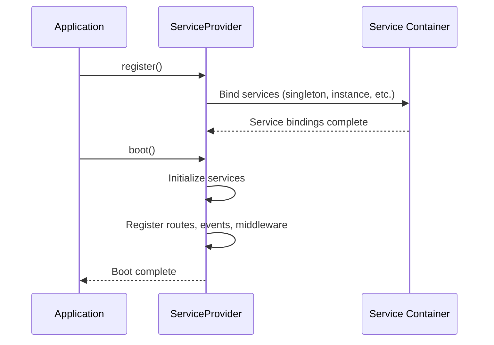
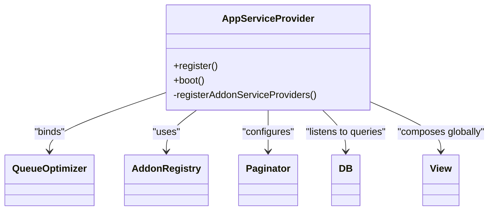
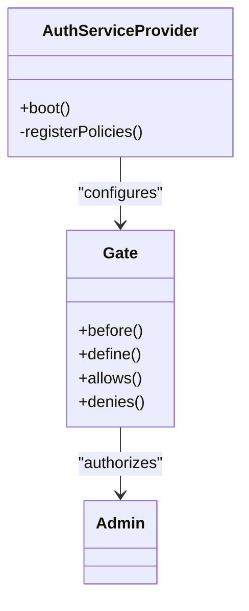
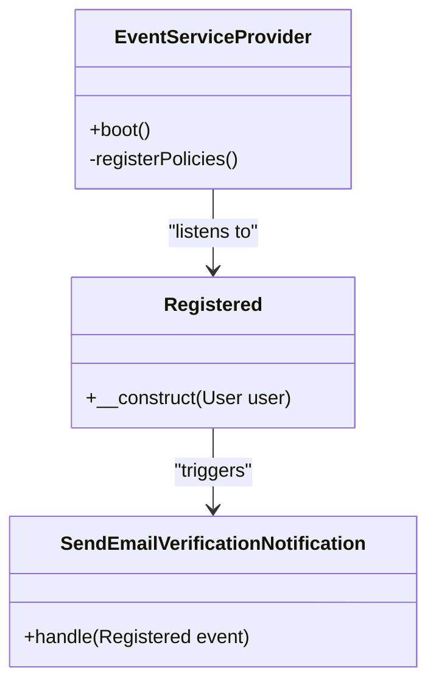
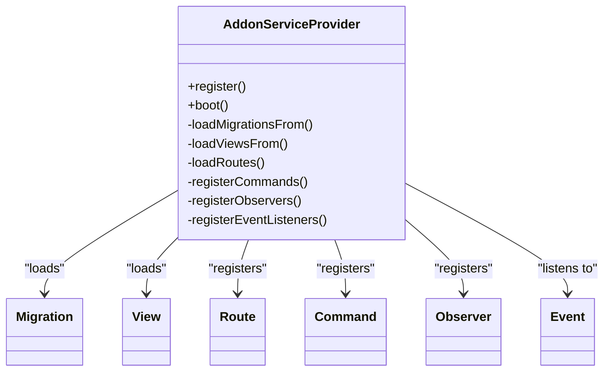
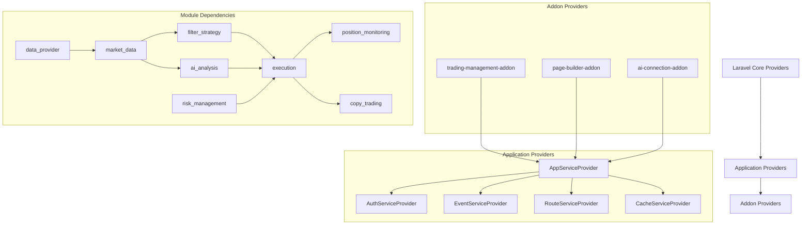

# Service Providers

<cite>
**Referenced Files in This Document**   
- [AppServiceProvider.php](file://main/app/Providers/AppServiceProvider.php)
- [AuthServiceProvider.php](file://main/app/Providers/AuthServiceProvider.php)
- [EventServiceProvider.php](file://main/app/Providers/EventServiceProvider.php)
- [RouteServiceProvider.php](file://main/app/Providers/RouteServiceProvider.php)
- [CacheServiceProvider.php](file://main/app/Providers/CacheServiceProvider.php)
- [AddonRegistry.php](file://main/app/Support/AddonRegistry.php)
- [app.php](file://main/config/app.php)
- [services.php](file://main/bootstrap/cache/services.php)
- [AddonServiceProvider.php](file://main/addons/_deprecated/ai-trading-addon/AddonServiceProvider.php)
- [AddonServiceProvider.php](file://main/addons/trading-management-addon/AddonServiceProvider.php)
- [PageBuilderServiceProvider.php](file://main/addons/page-builder-addon/PageBuilderServiceProvider.php)
- [addon.json](file://main/addons/trading-management-addon/addon.json)
</cite>

## Table of Contents
1. [Introduction](#introduction)
2. [Service Provider Architecture Overview](#service-provider-architecture-overview)
3. [Core Service Providers](#core-service-providers)
4. [Register vs Boot Methods](#register-vs-boot-methods)
5. [AppServiceProvider: Application-Wide Registration](#appserviceprovider-application-wide-registration)
6. [AuthServiceProvider: Authentication and Authorization](#authserviceprovider-authentication-and-authorization)
7. [EventServiceProvider: Event Listener Registration](#eventserviceprovider-event-listener-registration)
8. [Service Provider Loading Process](#service-provider-loading-process)
9. [Custom Service Providers in Addon Modules](#custom-service-providers-in-addon-modules)
10. [Service Provider Dependencies and Bootstrapping Order](#service-provider-dependencies-and-bootstrapping-order)
11. [Best Practices for Service Provider Creation](#best-practices-for-service-provider-creation)
12. [Testing Service Providers](#testing-service-providers)
13. [Conclusion](#conclusion)

## Introduction
Service providers are the fundamental bootstrap mechanism in Laravel applications, serving as the central place for registering services, event listeners, middleware, and routes. They form the backbone of the application's service container and orchestrate the initialization process during application bootstrapping. This documentation provides a comprehensive analysis of the service provider architecture in the Laravel application, detailing how different types of service providers work together to create a modular and extensible system. The analysis covers core Laravel service providers, custom implementations in addon modules, and the sophisticated dependency management system that enables conditional loading based on addon status and module configuration.

## Service Provider Architecture Overview

```mermaid
graph TD
A[Application Bootstrap] --> B[Load Configuration]
B --> C[Register Service Providers]
C --> D[Boot Service Providers]
D --> E[Handle Request]
subgraph "Service Provider Lifecycle"
F[register()] --> G[Bind Services to Container]
H[boot()] --> I[Boot Services and Register Routes/Events]
end
C --> F
D --> H
subgraph "Provider Types"
J[AppServiceProvider]
K[AuthServiceProvider]
L[EventServiceProvider]
M[RouteServiceProvider]
N[Custom Addon Providers]
end
J --> C
K --> C
L --> C
M --> C
N --> C
```

**Diagram sources**
- [AppServiceProvider.php](file://main/app/Providers/AppServiceProvider.php)
- [AuthServiceProvider.php](file://main/app/Providers/AuthServiceProvider.php)
- [EventServiceProvider.php](file://main/app/Providers/EventServiceProvider.php)
- [RouteServiceProvider.php](file://main/app/Providers/RouteServiceProvider.php)

**Section sources**
- [AppServiceProvider.php](file://main/app/Providers/AppServiceProvider.php)
- [AuthServiceProvider.php](file://main/app/Providers/AuthServiceProvider.php)
- [EventServiceProvider.php](file://main/app/Providers/EventServiceProvider.php)
- [bootstrap/app.php](file://main/bootstrap/app.php)

## Core Service Providers

The Laravel application implements several core service providers that handle essential application functionality. These providers are registered in the `config/app.php` file and form the foundation of the application's service container. The core providers include AppServiceProvider for general service registration, AuthServiceProvider for authentication and authorization, EventServiceProvider for event listener registration, and RouteServiceProvider for route registration. Each provider follows the Laravel service provider pattern, implementing both register and boot methods to separate service binding from service initialization. The providers work together to create a cohesive application structure, with each provider responsible for a specific aspect of the application's functionality.

**Section sources**
- [config/app.php](file://main/config/app.php)
- [AppServiceProvider.php](file://main/app/Providers/AppServiceProvider.php)
- [AuthServiceProvider.php](file://main/app/Providers/AuthServiceProvider.php)
- [EventServiceProvider.php](file://main/app/Providers/EventServiceProvider.php)
- [RouteServiceProvider.php](file://main/app/Providers/RouteServiceProvider.php)

## Register vs Boot Methods

The service provider pattern in Laravel distinguishes between two key methods: register and boot. The register method is used for binding services to the service container, while the boot method is used for initializing services and registering application components like routes, event listeners, and middleware. This separation ensures that all services are available in the container before any boot operations occur. In the register method, services are typically bound as singletons or instances, making them available for dependency injection throughout the application. The boot method is called after all service providers have been registered, ensuring that all dependencies are available. This pattern prevents circular dependencies and ensures a predictable initialization order.



**Diagram sources**
- [AppServiceProvider.php](file://main/app/Providers/AppServiceProvider.php)
- [AuthServiceProvider.php](file://main/app/Providers/AuthServiceProvider.php)
- [EventServiceProvider.php](file://main/app/Providers/EventServiceProvider.php)

**Section sources**
- [AppServiceProvider.php](file://main/app/Providers/AppServiceProvider.php)
- [AuthServiceProvider.php](file://main/app/Providers/AuthServiceProvider.php)
- [EventServiceProvider.php](file://main/app/Providers/EventServiceProvider.php)

## AppServiceProvider: Application-Wide Registration

The AppServiceProvider serves as the primary service provider for application-wide service registration and bootstrapping. It contains application-specific configuration and initialization logic that applies globally across the entire application. In the register method, it binds services such as the QueueOptimizer and conditionally registers addon service providers based on their active status. The boot method contains application-wide initialization logic, including enabling Eloquent model mass assignment protection, configuring pagination to use Bootstrap styling, and setting up database query logging when enabled. It also implements a global view composer to ensure the $page variable is always available in views, and integrates SEO functionality when the algoexpert-plus-addon is active.



**Diagram sources**
- [AppServiceProvider.php](file://main/app/Providers/AppServiceProvider.php)

**Section sources**
- [AppServiceProvider.php](file://main/app/Providers/AppServiceProvider.php)

## AuthServiceProvider: Authentication and Authorization

The AuthServiceProvider is responsible for registering authentication and authorization services in the application. It extends Laravel's built-in AuthServiceProvider and implements the Gate pattern for authorization. The primary responsibility of this provider is to register policies that define authorization logic for different models and resources. In this implementation, it includes a Gate::before callback that grants super admin users complete access to all abilities, implementing a role-based access control system. The provider follows the standard Laravel pattern of defining a $policies property that maps models to their corresponding policy classes, although in this specific implementation, the policies array is currently empty and policies are likely registered programmatically or in other providers.



**Diagram sources**
- [AuthServiceProvider.php](file://main/app/Providers/AuthServiceProvider.php)

**Section sources**
- [AuthServiceProvider.php](file://main/app/Providers/AuthServiceProvider.php)

## EventServiceProvider: Event Listener Registration

The EventServiceProvider manages the registration of event listeners and subscribers in the application. It defines the $listen property, which maps events to their corresponding listeners. In this implementation, it registers the SendEmailVerificationNotification listener to handle the Registered event, which is triggered when a new user registers. The provider follows Laravel's event broadcasting pattern, allowing for decoupled application architecture where components can respond to events without direct dependencies. The boot method is currently empty, as the event registration is handled through the $listen property, but it could be used to register additional listeners programmatically or to configure event broadcasting drivers.



**Diagram sources**
- [EventServiceProvider.php](file://main/app/Providers/EventServiceProvider.php)

**Section sources**
- [EventServiceProvider.php](file://main/app/Providers/EventServiceProvider.php)

## Service Provider Loading Process

The service provider loading process begins with the application bootstrap in `bootstrap/app.php`, where the Laravel application instance is created and core interfaces are bound to their implementations. Service providers are then loaded according to the configuration in `config/app.php`, where they are listed in the 'providers' array. During development, providers are loaded dynamically on each request, but in production, they are cached in `bootstrap/cache/services.php` to improve performance. The loading process follows a specific order: first, all providers are instantiated and their register methods are called to bind services to the container; then, after all services are registered, the boot methods are called to initialize the services. This two-phase process ensures that all dependencies are available before any service initialization occurs.

```mermaid
flowchart TD
A[Start Application] --> B[Create Application Instance]
B --> C[Bind Core Interfaces]
C --> D[Load config/app.php]
D --> E[Instantiate Service Providers]
E --> F[Call register() on all providers]
F --> G[All services registered]
G --> H[Call boot() on all providers]
H --> I[Application Ready]
subgraph "Production Optimization"
J[php artisan config:cache]
K[Generate bootstrap/cache/config.php]
L[php artisan optimize:providers]
M[Generate bootstrap/cache/services.php]
J --> K
L --> M
end
```

**Diagram sources**
- [bootstrap/app.php](file://main/bootstrap/app.php)
- [config/app.php](file://main/config/app.php)
- [services.php](file://main/bootstrap/cache/services.php)

**Section sources**
- [bootstrap/app.php](file://main/bootstrap/app.php)
- [config/app.php](file://main/config/app.php)
- [services.php](file://main/bootstrap/cache/services.php)

## Custom Service Providers in Addon Modules

Custom service providers in addon modules extend the core functionality of the application by implementing the same service provider pattern used by Laravel's built-in providers. These providers are located in the addons directory and follow a consistent structure, with register methods for service binding and boot methods for initialization. The addon providers demonstrate advanced patterns such as conditional loading based on addon status, module-specific configuration, and integration with the AddonRegistry system. They typically register routes, views, migrations, and configuration files specific to their addon, creating a self-contained package of functionality that can be enabled or disabled independently. The providers also implement sophisticated dependency management, ensuring that services are only registered when their required modules are enabled.



**Diagram sources**
- [AddonServiceProvider.php](file://main/addons/trading-management-addon/AddonServiceProvider.php)
- [PageBuilderServiceProvider.php](file://main/addons/page-builder-addon/PageBuilderServiceProvider.php)
- [AddonServiceProvider.php](file://main/addons/_deprecated/ai-trading-addon/AddonServiceProvider.php)

**Section sources**
- [AddonServiceProvider.php](file://main/addons/trading-management-addon/AddonServiceProvider.php)
- [PageBuilderServiceProvider.php](file://main/addons/page-builder-addon/PageBuilderServiceProvider.php)
- [AddonServiceProvider.php](file://main/addons/_deprecated/ai-trading-addon/AddonServiceProvider.php)
- [addon.json](file://main/addons/trading-management-addon/addon.json)

## Service Provider Dependencies and Bootstrapping Order

Service provider dependencies and bootstrapping order are critical for ensuring that services are available when needed. The application manages dependencies through several mechanisms: the order of providers in `config/app.php`, the use of the $defer property in service providers, and conditional registration based on addon status. Core Laravel providers are loaded first, followed by application providers, and finally addon providers. Within addon providers, dependencies are managed through the AddonRegistry system, which checks module status before registering services. The trading-management-addon demonstrates sophisticated dependency management, with modules declaring dependencies on other modules to ensure proper initialization order. This prevents circular dependencies and ensures that services are initialized in the correct sequence, with dependent services available when needed.



**Diagram sources**
- [config/app.php](file://main/config/app.php)
- [AppServiceProvider.php](file://main/app/Providers/AppServiceProvider.php)
- [AddonRegistry.php](file://main/app/Support/AddonRegistry.php)
- [addon.json](file://main/addons/trading-management-addon/addon.json)

**Section sources**
- [config/app.php](file://main/config/app.php)
- [AppServiceProvider.php](file://main/app/Providers/AppServiceProvider.php)
- [AddonRegistry.php](file://main/app/Support/AddonRegistry.php)
- [addon.json](file://main/addons/trading-management-addon/addon.json)

## Best Practices for Service Provider Creation

Best practices for service provider creation include separating service binding from initialization by using the register and boot methods appropriately, keeping providers focused on a single responsibility, and using descriptive names that reflect their purpose. Providers should avoid performing heavy operations in the register method, as this can slow down application bootstrapping. Instead, initialization logic should be placed in the boot method, which is called only once per request cycle. Providers should also implement proper error handling and fallback mechanisms, as demonstrated by the AppServiceProvider's try-catch blocks around addon registration. Configuration should be externalized to config files when possible, and providers should support conditional loading based on application state or configuration. Finally, providers should be tested in isolation to ensure they register services correctly and handle edge cases appropriately.

**Section sources**
- [AppServiceProvider.php](file://main/app/Providers/AppServiceProvider.php)
- [AuthServiceProvider.php](file://main/app/Providers/AuthServiceProvider.php)
- [EventServiceProvider.php](file://main/app/Providers/EventServiceProvider.php)
- [AddonServiceProvider.php](file://main/addons/trading-management-addon/AddonServiceProvider.php)

## Testing Service Providers

Testing service providers involves verifying that services are correctly bound to the container and that initialization logic executes as expected. Tests should check that services are registered with the correct binding type (singleton, instance, etc.) and that they can be resolved from the container. For providers that register routes, tests should verify that routes are accessible and use the correct middleware. For providers that register event listeners, tests should confirm that listeners are attached to the appropriate events. Integration tests can verify that the provider's functionality works correctly within the application context. The application's test suite should include tests for both successful provider registration and error handling scenarios, such as when required configuration is missing or when dependencies are not available.

**Section sources**
- [AppServiceProvider.php](file://main/app/Providers/AppServiceProvider.php)
- [AuthServiceProvider.php](file://main/app/Providers/AuthServiceProvider.php)
- [EventServiceProvider.php](file://main/app/Providers/EventServiceProvider.php)
- [AddonServiceProvider.php](file://main/addons/trading-management-addon/AddonServiceProvider.php)

## Conclusion

Service providers are a fundamental component of the Laravel application architecture, serving as the primary mechanism for bootstrapping and configuring the application. They provide a structured approach to service registration and initialization, enabling modular and extensible application design. The implementation in this application demonstrates advanced patterns such as conditional addon loading, sophisticated dependency management, and integration with a modular addon system. By following the separation of concerns between register and boot methods, the application ensures a predictable initialization order and prevents circular dependencies. The use of service providers across core functionality and addon modules creates a consistent and maintainable architecture that can be easily extended with new features. Understanding the service provider lifecycle and best practices is essential for developing robust and scalable Laravel applications.