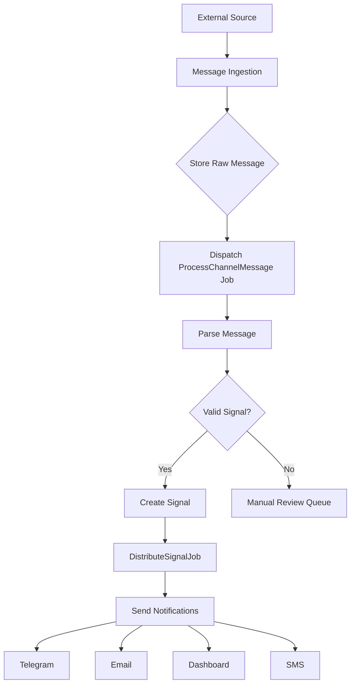
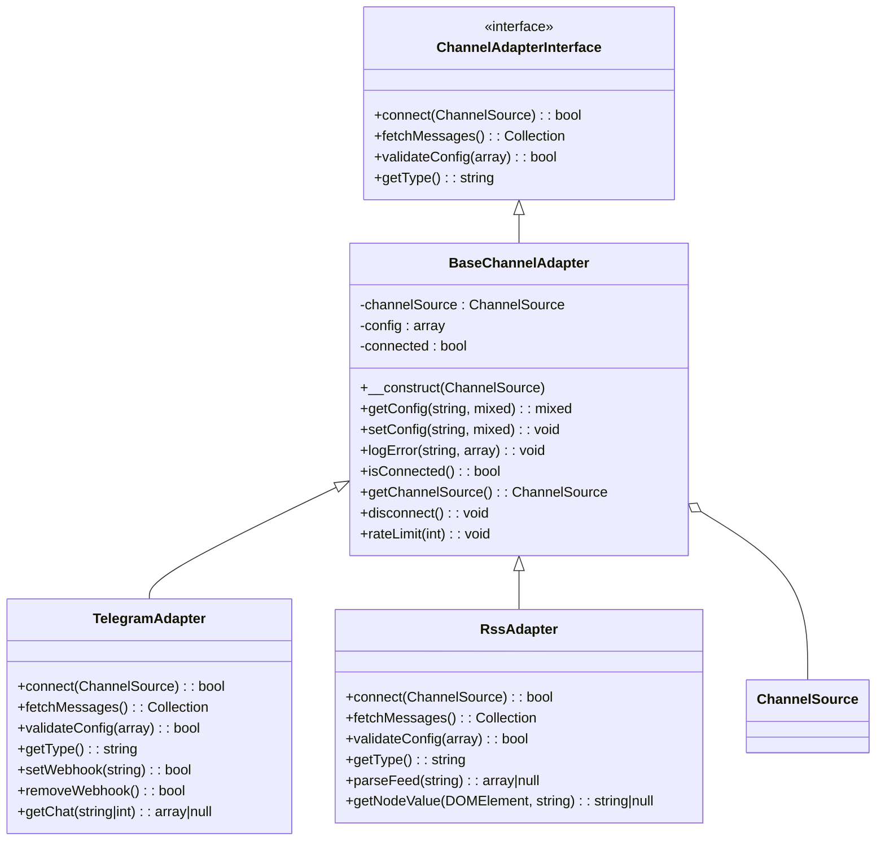
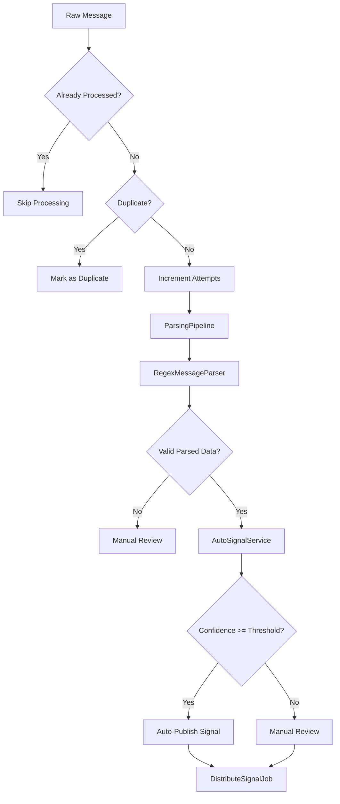
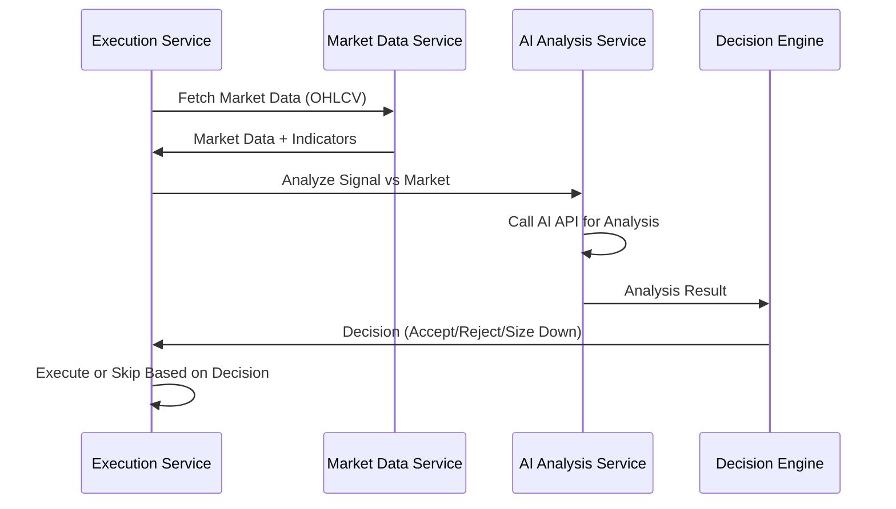
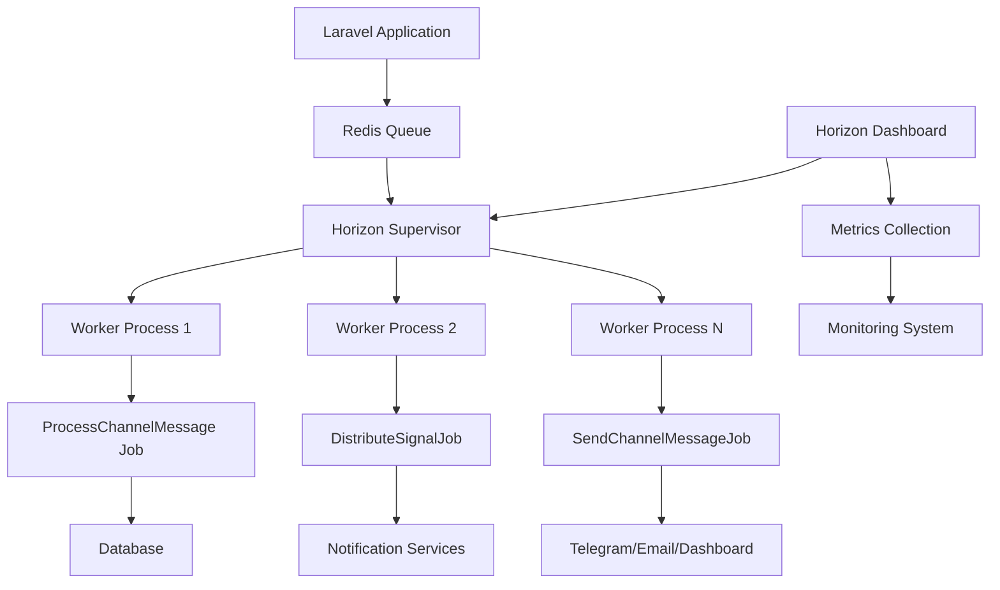
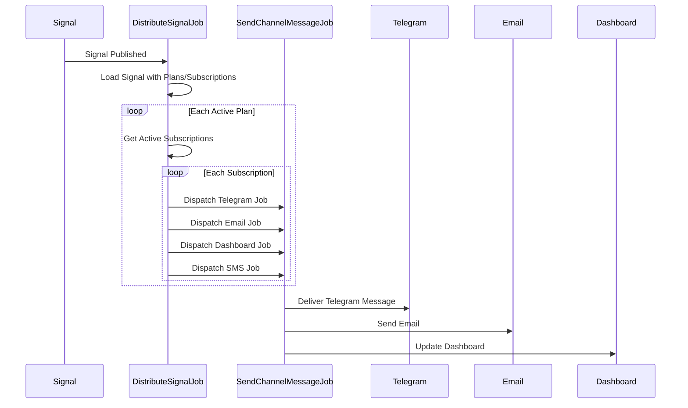
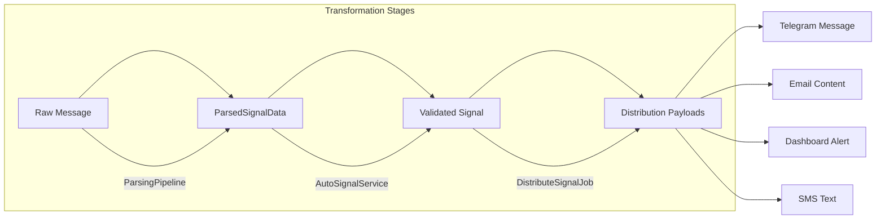
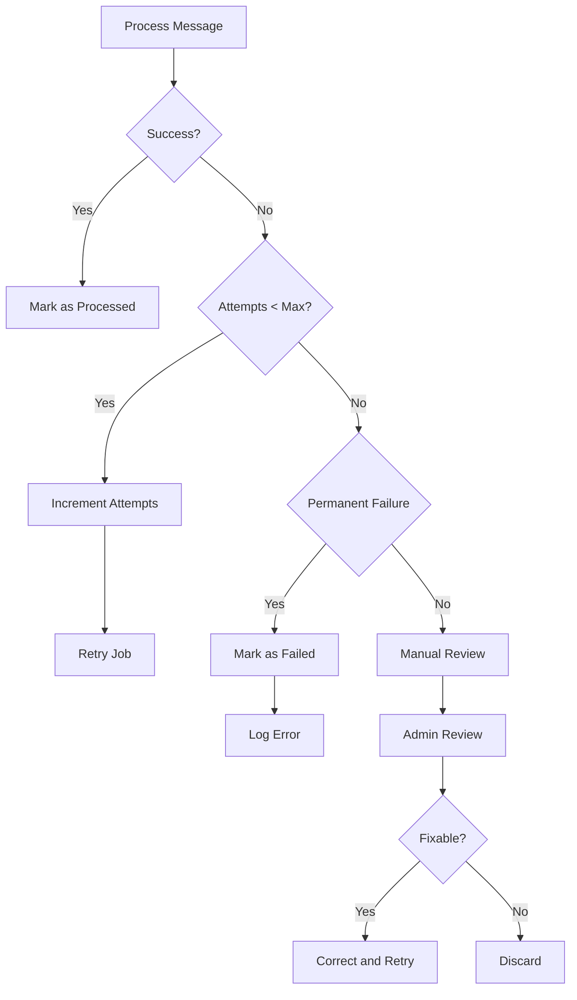

# Data Flow Architecture

<cite>
**Referenced Files in This Document**   
- [ProcessChannelMessage.php](file://main/app/Jobs/ProcessChannelMessage.php)
- [DistributeSignalJob.php](file://main/app/Jobs/DistributeSignalJob.php)
- [ParsingPipeline.php](file://main/app/Parsers/ParsingPipeline.php)
- [RegexMessageParser.php](file://main/app/Parsers/RegexMessageParser.php)
- [TelegramAdapter.php](file://main/app/Adapters/TelegramAdapter.php)
- [RssAdapter.php](file://main/app/Adapters/RssAdapter.php)
- [AutoSignalService.php](file://main/app/Services/AutoSignalService.php)
- [ParsedSignalData.php](file://main/app/DTOs/ParsedSignalData.php)
- [horizon.php](file://main/config/horizon.php)
- [HorizonServiceProvider.php](file://main/app/Providers/HorizonServiceProvider.php)
- [QueueMonitoringMiddleware.php](file://main/app/Http/Middleware/QueueMonitoringMiddleware.php)
- [ChannelMessage.php](file://main/app/Models/ChannelMessage.php)
- [ChannelSource.php](file://main/app/Models/ChannelSource.php)
- [Signal.php](file://main/app/Models/Signal.php)
- [BaseChannelAdapter.php](file://main/app/Adapters/BaseChannelAdapter.php)
- [MessageParserInterface.php](file://main/app/Contracts/MessageParserInterface.php)
</cite>

## Table of Contents
1. [Introduction](#introduction)
2. [Event-Driven Architecture Overview](#event-driven-architecture-overview)
3. [External Data Ingestion](#external-data-ingestion)
4. [Message Processing Pipeline](#message-processing-pipeline)
5. [AI Analysis and Risk Assessment](#ai-analysis-and-risk-assessment)
6. [Job Queue System with Laravel Horizon](#job-queue-system-with-laravel-horizon)
7. [Trade Execution Flow](#trade-execution-flow)
8. [Data Transformation Pipeline](#data-transformation-pipeline)
9. [Error Handling and Retry Mechanisms](#error-handling-and-retry-mechanisms)
10. [Data Consistency in Distributed Processing](#data-consistency-in-distributed-processing)
11. [Redis Queue Management](#redis-queue-management)
12. [Signal Processing Examples](#signal-processing-examples)
13. [Conclusion](#conclusion)

## Introduction

The data flow architecture of the AI Trade Pulse system is designed as an event-driven, asynchronous processing pipeline that handles signal ingestion from multiple external sources, processes them through AI analysis and risk assessment, and executes trades based on the processed signals. The system leverages Laravel's event and job queue system to ensure reliable, scalable processing of trading signals with proper error handling and retry mechanisms.

The architecture is built around a microservices-inspired approach within a monolithic Laravel application, with clear separation of concerns between data ingestion, parsing, AI analysis, risk management, and trade execution components. This documentation provides a comprehensive overview of the data flow from external sources through to trade execution, focusing on the event-driven nature of the system and the asynchronous processing capabilities provided by Laravel Horizon.

**Section sources**
- [ProcessChannelMessage.php](file://main/app/Jobs/ProcessChannelMessage.php#L1-L156)
- [DistributeSignalJob.php](file://main/app/Jobs/DistributeSignalJob.php#L1-L68)

## Event-Driven Architecture Overview

The system employs an event-driven architecture where external events (new messages from Telegram, RSS feeds, etc.) trigger a chain of processing steps through Laravel events and listeners. When a new message is received from an external source, it is stored in the database and dispatched as a job to be processed asynchronously.

The core event flow begins with message ingestion from external sources, which triggers the `ProcessChannelMessage` job. This job processes the raw message, parses it into structured signal data, and creates a signal entity if parsing is successful. Once a signal is created, it triggers distribution to subscribers through the `DistributeSignalJob`, which handles notification delivery across multiple channels.

The event-driven nature of the system ensures that each processing step is decoupled from the others, allowing for independent scaling and fault tolerance. Events are used to coordinate between different parts of the system without creating tight coupling, enabling the system to handle high volumes of signals while maintaining reliability.

**Diagram sources**
- [ProcessChannelMessage.php](file://main/app/Jobs/ProcessChannelMessage.php#L1-L156)
- [DistributeSignalJob.php](file://main/app/Jobs/DistributeSignalJob.php#L1-L68)
- [ChannelMessage.php](file://main/app/Models/ChannelMessage.php#L1-L20)

**Section sources**
- [ProcessChannelMessage.php](file://main/app/Jobs/ProcessChannelMessage.php#L1-L156)
- [DistributeSignalJob.php](file://main/app/Jobs/DistributeSignalJob.php#L1-L68)

## External Data Ingestion

The system supports multiple external data sources for signal ingestion, primarily Telegram and RSS feeds. Each data source is handled by a dedicated adapter that implements the `ChannelAdapterInterface` and extends the `BaseChannelAdapter` class. These adapters provide a consistent interface for connecting to external sources, fetching messages, and handling source-specific configuration.

The `TelegramAdapter` connects to Telegram channels using the Bot API, polling for new messages or receiving them via webhooks. It maintains state by tracking the last processed update ID to avoid duplicate processing. The adapter validates the bot token and channel configuration before establishing a connection, and handles rate limiting by implementing appropriate delays when the Telegram API returns 429 responses.

The `RssAdapter` handles RSS and Atom feed ingestion by periodically polling configured feed URLs. It parses the XML content of the feeds to extract article titles, descriptions, and publication dates, combining them into message text for processing. The adapter maintains state by tracking the last processed item ID and publication date to ensure only new items are processed.

Both adapters implement a common interface that allows the system to treat different data sources uniformly, enabling the processing pipeline to handle messages from any configured source without modification.

**Diagram sources**
- [TelegramAdapter.php](file://main/app/Adapters/TelegramAdapter.php#L1-L287)
- [RssAdapter.php](file://main/app/Adapters/RssAdapter.php#L1-L282)
- [BaseChannelAdapter.php](file://main/app/Adapters/BaseChannelAdapter.php#L1-L159)
- [ChannelSource.php](file://main/app/Models/ChannelSource.php#L1-L20)

**Section sources**
- [TelegramAdapter.php](file://main/app/Adapters/TelegramAdapter.php#L1-L287)
- [RssAdapter.php](file://main/app/Adapters/RssAdapter.php#L1-L282)

## Message Processing Pipeline

The message processing pipeline is responsible for transforming raw messages from external sources into structured trading signals. The pipeline begins when a `ProcessChannelMessage` job is dispatched for a newly ingested message. This job first checks if the message has already been processed or is a duplicate, then proceeds with parsing the message content.

The parsing process is handled by the `ParsingPipeline` class, which coordinates multiple message parsers to extract structured data from the raw message text. The pipeline currently includes a `RegexMessageParser` that uses pattern matching to identify currency pairs, directions, prices, and other signal components. The system is designed to support additional parsers, which can be registered with the pipeline to handle different message formats.

The `RegexMessageParser` uses a set of predefined patterns to extract signal information from messages. It assigns confidence scores based on the number of successfully matched components, with currency pair and direction matches contributing the most to the overall confidence. The parser normalizes extracted values (e.g., converting "BUY" and "LONG" to "buy") and returns a `ParsedSignalData` DTO containing the structured signal information.

If parsing is successful and the required fields are present, the system creates a signal entity through the `AutoSignalService`. This service validates the parsed data, maps it to database entities (currency pairs, timeframes, markets), and creates the signal record. Signals with sufficient confidence scores are automatically published, while others may require manual review.

**Diagram sources**
- [ProcessChannelMessage.php](file://main/app/Jobs/ProcessChannelMessage.php#L1-L156)
- [ParsingPipeline.php](file://main/app/Parsers/ParsingPipeline.php#L1-L89)
- [RegexMessageParser.php](file://main/app/Parsers/RegexMessageParser.php#L1-L195)
- [AutoSignalService.php](file://main/app/Services/AutoSignalService.php#L1-L274)
- [ParsedSignalData.php](file://main/app/DTOs/ParsedSignalData.php#L1-L140)

**Section sources**
- [ProcessChannelMessage.php](file://main/app/Jobs/ProcessChannelMessage.php#L1-L156)
- [ParsingPipeline.php](file://main/app/Parsers/ParsingPipeline.php#L1-L89)
- [RegexMessageParser.php](file://main/app/Parsers/RegexMessageParser.php#L1-L195)

## AI Analysis and Risk Assessment

The system incorporates AI-driven analysis at multiple stages of the signal processing pipeline. The primary AI component is the message parsing functionality, which uses pattern recognition to extract structured trading signals from unstructured text messages. This AI parsing capability allows the system to handle a wide variety of message formats from different signal providers.

When a message cannot be parsed using the default regex patterns, the system can fall back to more sophisticated AI analysis (though the specific implementation details of this advanced parsing are not visible in the current codebase). The parsing confidence score reflects the reliability of the extracted data, with higher confidence assigned to messages where more signal components are successfully identified.

The system also supports market confirmation before trade execution, where AI analysis is used to validate signals against current market conditions. This workflow involves gathering market data (OHLCV, volume, indicators) and sending it to an AI service (such as OpenRouter) for analysis. The AI service provides a confirmation decision that can result in accepting the trade, rejecting it, or recommending a reduced position size.

Risk assessment is integrated into the decision-making process, with the system capable of adjusting position sizes based on AI recommendations. When the AI detects uncertain market conditions, high volatility, or weak trend alignment, it can recommend reducing the position size (e.g., by 50%) to manage risk. This dynamic risk adjustment allows the system to adapt to changing market conditions while following the core trading signals.

**Diagram sources**
- [ai-trading-integration.md](file://docs/ai-trading-integration.md#L145-L161)
- [openrouter-integration.md](file://docs/openrouter-integration.md#L231-L237)
- [AiDecisionEngine.php](file://main/addons/_deprecated/ai-trading-addon/app/Services/AiDecisionEngine.php#L58-L83)

**Section sources**
- [ai-trading-integration.md](file://docs/ai-trading-integration.md#L145-L192)
- [openrouter-integration.md](file://docs/openrouter-integration.md#L222-L244)

## Job Queue System with Laravel Horizon

The system uses Laravel's queue system with Horizon for asynchronous processing of signals and trades. Horizon provides a dashboard and configuration system for managing queue workers, monitoring job throughput, and handling failed jobs. The queue configuration is defined in `horizon.php`, which specifies worker processes, queue connections, and job trimming policies.

The system is configured to use Redis as the queue connection, with different queue priorities for various types of jobs. The default configuration includes a supervisor with multiple processes that can scale based on load. In production, the system can run up to 10 processes to handle high volumes of jobs, while local environments are limited to 3 processes for development purposes.

Job monitoring is implemented through middleware that tracks queue-related requests and records metrics for optimization. The system categorizes requests by queue type (high, default, low) based on the request path, allowing for prioritization of critical operations like signal processing and payment handling. High-priority queues are used for time-sensitive operations, ensuring that trading signals are processed promptly.

Horizon provides comprehensive monitoring capabilities, including tracking of pending jobs, failed jobs, and worker processes. The system displays real-time metrics such as job throughput (jobs per minute) and process counts, allowing administrators to monitor system performance and identify bottlenecks. Failed jobs are retained for a week to facilitate debugging and analysis.

**Diagram sources**
- [horizon.php](file://main/config/horizon.php#L1-L231)
- [HorizonServiceProvider.php](file://main/app/Providers/HorizonServiceProvider.php#L1-L43)
- [QueueMonitoringMiddleware.php](file://main/app/Http/Middleware/QueueMonitoringMiddleware.php#L74-L125)

**Section sources**
- [horizon.php](file://main/config/horizon.php#L1-L231)
- [HorizonServiceProvider.php](file://main/app/Providers/HorizonServiceProvider.php#L1-L43)

## Trade Execution Flow

The trade execution flow begins when a signal is published, either automatically based on parsing confidence or manually by an administrator. Once published, the signal triggers the `DistributeSignalJob`, which handles the distribution of the signal to subscribed users across multiple channels (Telegram, email, dashboard, SMS).

The execution process involves several key steps: first, the system retrieves the signal details along with associated plans and subscriptions. It then iterates through each active subscription, checking user eligibility and plan status before dispatching notification jobs. These notification jobs (`SendChannelMessageJob`) are queued for asynchronous processing, ensuring that the distribution process does not block the main execution flow.

For each subscription, the system verifies that the user's plan is active and has not expired before sending the signal. Different notification channels are handled independently, allowing users to receive signals through their preferred methods. The system supports multiple delivery methods including Telegram messages, email notifications, dashboard alerts, and SMS messages.

The execution flow is designed to be resilient and fault-tolerant, with each notification dispatched as a separate job that can be retried independently if it fails. This ensures that a failure in one delivery channel does not affect the delivery through other channels. The system also tracks delivery status and can flag issues for manual review if necessary.

**Diagram sources**
- [DistributeSignalJob.php](file://main/app/Jobs/DistributeSignalJob.php#L1-L68)
- [SendChannelMessageJob.php](file://main/app/Jobs/SendChannelMessageJob.php#L1-L20)
- [Signal.php](file://main/app/Models/Signal.php#L1-L20)

**Section sources**
- [DistributeSignalJob.php](file://main/app/Jobs/DistributeSignalJob.php#L1-L68)

## Data Transformation Pipeline

The data transformation pipeline converts raw messages from external sources into structured trading signals and ultimately into executed trades. The pipeline consists of several stages: ingestion, parsing, validation, signal creation, and distribution.

The first stage involves ingesting raw messages from external sources and storing them in the `channel_messages` table. Each message is assigned a unique hash to prevent duplicates and is marked with a "pending" status to indicate it requires processing. The message content is stored in its original form to preserve context.

The second stage is parsing, where the `ParsingPipeline` analyzes the raw message text and extracts structured signal data. The pipeline uses multiple parsers (currently primarily regex-based) to identify key components such as currency pairs, directions, entry prices, stop losses, take profits, and timeframes. The parsing process assigns a confidence score based on the completeness of the extracted data.

In the third stage, the `AutoSignalService` validates the parsed data and creates a structured signal entity. This involves mapping parsed values to database records (currency pairs, timeframes, markets), validating price values, and ensuring all required fields are present. The service also handles the creation of relationships between the signal and its source message.

The final stage is distribution, where the published signal is transformed into notifications for subscribers. The system generates personalized notifications for each subscriber based on their plan configuration and preferred delivery channels. This transformation adapts the signal data into appropriate formats for different output channels (Telegram messages, email templates, dashboard alerts).

**Diagram sources**
- [ParsingPipeline.php](file://main/app/Parsers/ParsingPipeline.php#L1-L89)
- [ParsedSignalData.php](file://main/app/DTOs/ParsedSignalData.php#L1-L140)
- [AutoSignalService.php](file://main/app/Services/AutoSignalService.php#L1-L274)
- [DistributeSignalJob.php](file://main/app/Jobs/DistributeSignalJob.php#L1-L68)

**Section sources**
- [ParsingPipeline.php](file://main/app/Parsers/ParsingPipeline.php#L1-L89)
- [AutoSignalService.php](file://main/app/Services/AutoSignalService.php#L1-L274)

## Error Handling and Retry Mechanisms

The system implements comprehensive error handling and retry mechanisms to ensure reliable processing of trading signals. Each job in the system is configured with retry attempts and timeout limits to handle transient failures and prevent indefinite processing.

The `ProcessChannelMessage` job is configured to attempt processing up to 3 times before failing permanently. This allows the system to recover from temporary issues such as network connectivity problems or database timeouts. Each attempt is logged, and the system increments a processing attempt counter on the message record to track retry history.

When a job encounters an exception during processing, it is caught and logged with detailed context including the exception message, stack trace, and relevant data (message ID, channel source). The job's `failed` method is then called, which updates the message status to "failed" and records the error message. This allows administrators to identify and address recurring issues.

For messages that cannot be parsed successfully, the system implements a manual review queue. Messages are marked with a "manual review" status and can be examined by administrators who can either correct the parsing rules or manually create signals. This ensures that valuable signals are not lost due to parsing failures.

The queue system itself provides additional error handling through Horizon's monitoring capabilities. Failed jobs are retained for debugging, and the system provides alerts when job failure rates exceed thresholds. The dashboard displays real-time information about failed jobs, allowing for prompt identification and resolution of issues.

**Diagram sources**
- [ProcessChannelMessage.php](file://main/app/Jobs/ProcessChannelMessage.php#L102-L153)
- [ChannelMessage.php](file://main/app/Models/ChannelMessage.php#L1-L20)
- [horizon.php](file://main/config/horizon.php#L99-L101)

**Section sources**
- [ProcessChannelMessage.php](file://main/app/Jobs/ProcessChannelMessage.php#L102-L153)

## Data Consistency in Distributed Processing

The system ensures data consistency across distributed processing stages through several mechanisms. Database transactions are used to maintain atomicity when creating signals and updating related records. The `AutoSignalService` wraps signal creation in a transaction, ensuring that either all related records are created successfully or the entire operation is rolled back on failure.

Referential integrity is maintained through database constraints and application-level validation. Foreign key relationships between signals, channel messages, currency pairs, timeframes, and markets ensure that references are valid. The system validates these relationships before creating records, falling back to default values when specific mappings cannot be found.

The system uses optimistic concurrency control to handle potential race conditions. When multiple processes might update the same record, the system relies on database-level locking and versioning to prevent conflicts. For example, when processing a message, the system checks its status before processing to ensure it hasn't already been handled by another worker.

Eventual consistency is achieved through the asynchronous processing model. While immediate consistency is maintained within transactional boundaries, the system acknowledges that some operations (like notification delivery) may take time to complete. Status fields on records indicate the current processing stage, allowing the system to track progress and resume processing if interrupted.

The use of unique constraints and message deduplication prevents the creation of duplicate signals. Each message is assigned a hash based on its content and source, and the system checks for existing signals with the same hash before creating new ones. This prevents duplicate trading signals from being generated from the same source message.

**Section sources**
- [AutoSignalService.php](file://main/app/Services/AutoSignalService.php#L36-L101)
- [ProcessChannelMessage.php](file://main/app/Jobs/ProcessChannelMessage.php#L67-L73)
- [ChannelMessage.php](file://main/app/Models/ChannelMessage.php#L1-L20)

## Redis Queue Management

Redis serves as the primary queue management system for the application, providing fast, reliable message queuing for asynchronous job processing. The system is configured to use Redis as the default queue connection, with Horizon managing worker processes and monitoring queue performance.

The Redis configuration in `horizon.php` specifies the use of the 'default' connection and sets appropriate trimming policies for job retention. Recent and completed jobs are retained for 60 minutes, while failed jobs are kept for 10,080 minutes (one week) to facilitate debugging and analysis. This balance ensures that operational data is available for monitoring without consuming excessive storage.

Job prioritization is implemented through multiple queues with different processing priorities. The system uses named queues (such as 'high', 'default', 'low', and 'notifications') to categorize jobs based on their importance and urgency. Critical operations like signal processing and payment handling are assigned to high-priority queues, ensuring they are processed promptly.

Redis also provides the data structure for Horizon's monitoring features, storing metrics about job throughput, worker processes, and queue lengths. This allows the Horizon dashboard to display real-time information about system performance and identify potential bottlenecks. The system tracks metrics such as jobs processed per minute and worker utilization to optimize resource allocation.

The use of Redis clusters or multiple Redis instances can be configured to improve availability and scalability. The system is designed to work with Redis replication and failover mechanisms, ensuring queue reliability even in the event of infrastructure issues.

**Section sources**
- [horizon.php](file://main/config/horizon.php#L57-L73)
- [DistributeSignalJob.php](file://main/app/Jobs/DistributeSignalJob.php#L21-L22)
- [QueueMonitoringMiddleware.php](file://main/app/Http/Middleware/QueueMonitoringMiddleware.php#L111-L123)

## Signal Processing Examples

The system handles various signal types and processing paths based on the source and format of the incoming messages. Different message formats trigger different parsing strategies and confidence calculations, resulting in varied processing outcomes.

For structured messages with clear signal components (currency pair, direction, entry price, SL, TP), the regex parser can extract all required fields with high confidence (80-100%). These signals are typically auto-published if they meet the confidence threshold configured for their source channel. An example would be a message like "BTC/USDT BUY ENTRY 45000 SL 44000 TP 47000 H1" which contains all key components in a standard format.

For semi-structured messages missing some components, the parser may achieve medium confidence (50-79%). These signals might have a currency pair and direction but lack stop loss or take profit levels. Depending on the channel configuration, these may require manual review or be auto-published with default risk parameters. An example is "ETH/USDT LONG at 3200" which specifies entry but not exit levels.

Unstructured messages or those in non-standard formats may result in low confidence parsing (<50%) or complete parsing failure. These are routed to manual review where administrators can either correct the parsing rules or manually create signals. Examples include messages with embedded images, complex technical analysis descriptions, or non-English content that requires translation.

The system also handles different processing paths based on the source channel configuration. Channels can be configured with different auto-publish confidence thresholds, default timeframes, and target plans, creating customized processing workflows for different signal providers.

**Section sources**
- [RegexMessageParser.php](file://main/app/Parsers/RegexMessageParser.php#L94-L171)
- [AutoSignalService.php](file://main/app/Services/AutoSignalService.php#L105-L107)
- [ChannelSource.php](file://main/app/Models/ChannelSource.php#L1-L20)

## Conclusion

The data flow architecture of the AI Trade Pulse system is a sophisticated, event-driven pipeline that efficiently processes trading signals from multiple external sources. By leveraging Laravel's event and job queue system with Horizon for monitoring, the system achieves reliable, scalable processing of signals with comprehensive error handling and retry mechanisms.

The architecture effectively separates concerns between data ingestion, parsing, AI analysis, risk assessment, and trade execution, allowing each component to be developed and scaled independently. The use of Redis for queue management ensures fast, reliable message passing between components, while the transactional integrity of database operations maintains data consistency across distributed processing stages.

Key strengths of the architecture include its flexibility in handling various message formats through a pluggable parsing pipeline, its resilience through comprehensive error handling and retry mechanisms, and its observability through Horizon's monitoring capabilities. The system's ability to integrate AI analysis for both message parsing and market confirmation adds significant value by automating complex decision-making processes.

Future enhancements could include expanding the AI capabilities to analyze market data independently of external signals, implementing more sophisticated risk management algorithms, and adding additional data sources and notification channels. The modular design of the current architecture provides a solid foundation for these and other future improvements.