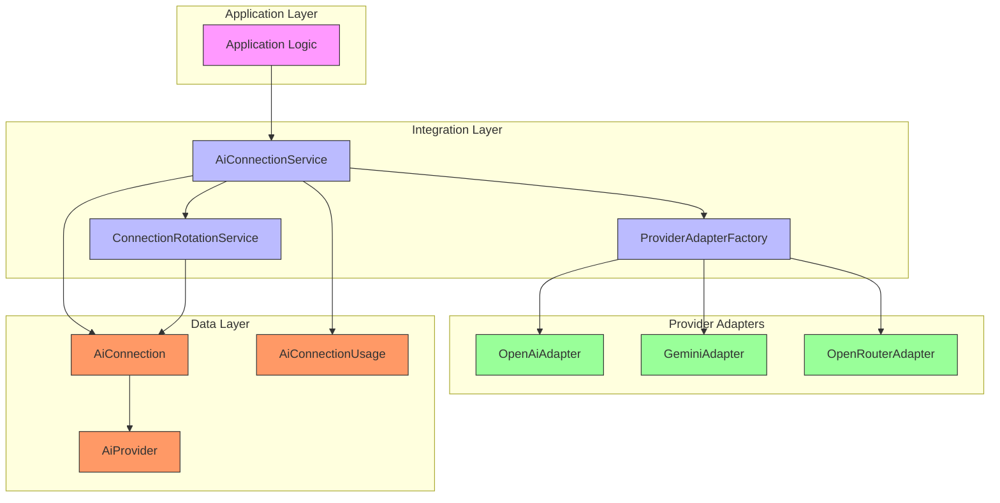
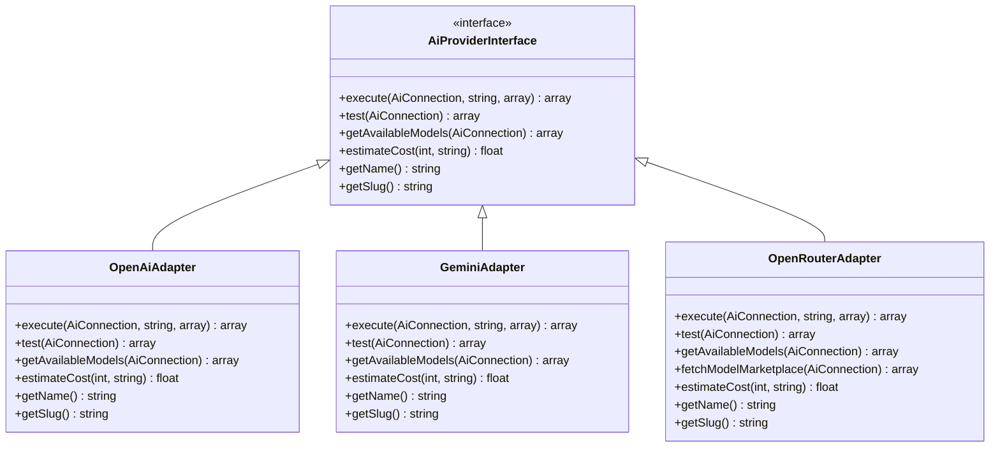
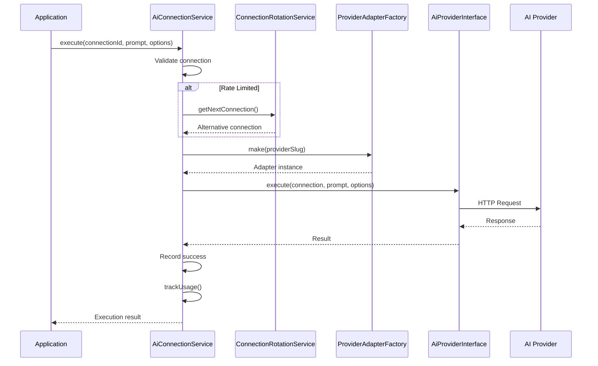
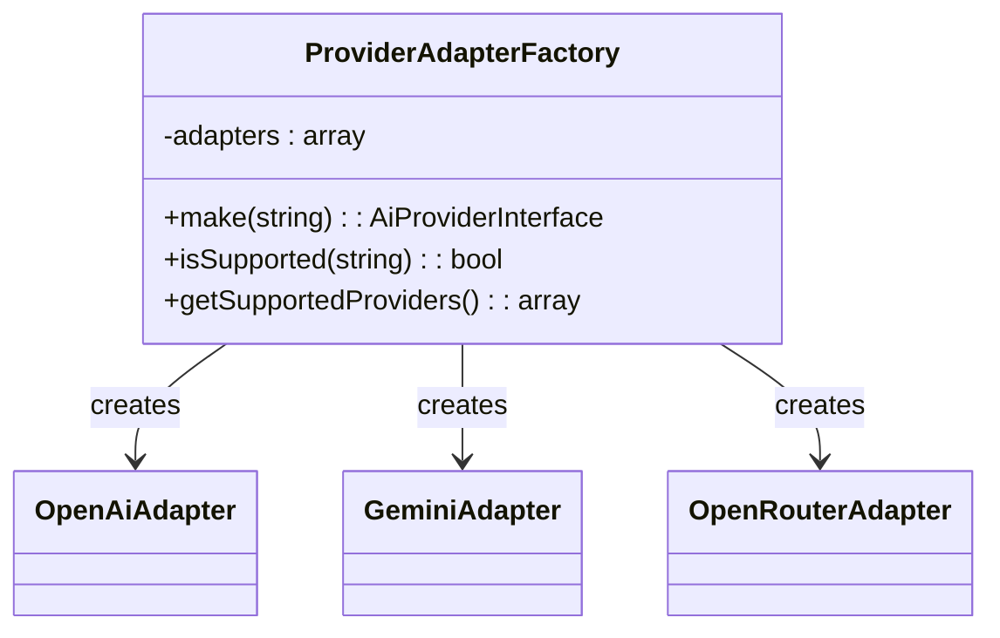
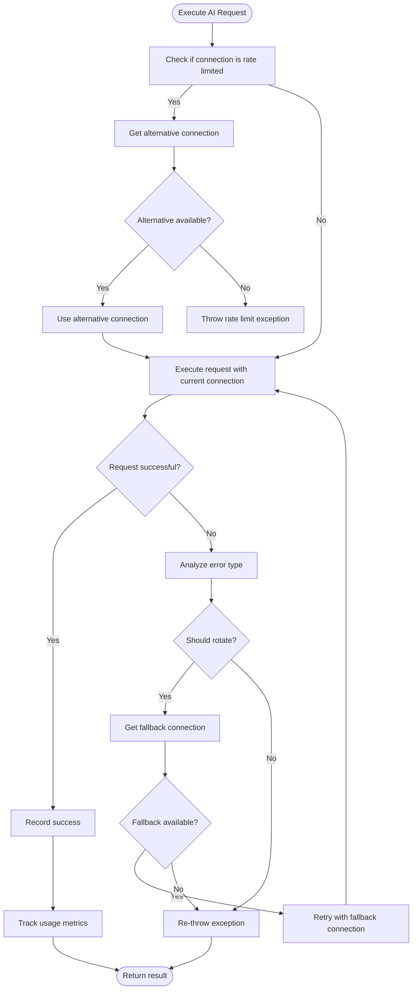

# AI Provider Integration

<cite>
**Referenced Files in This Document**   
- [AiConnectionService.php](file://main/addons/ai-connection-addon/App/Services/AiConnectionService.php)
- [OpenAiAdapter.php](file://main/addons/ai-connection-addon/App/Providers/OpenAiAdapter.php)
- [GeminiAdapter.php](file://main/addons/ai-connection-addon/App/Providers/GeminiAdapter.php)
- [OpenRouterAdapter.php](file://main/addons/ai-connection-addon/App/Providers/OpenRouterAdapter.php)
- [AiProviderInterface.php](file://main/addons/ai-connection-addon/App/Contracts/AiProviderInterface.php)
- [ProviderAdapterFactory.php](file://main/addons/ai-connection-addon/App/Services/ProviderAdapterFactory.php)
- [ConnectionRotationService.php](file://main/addons/ai-connection-addon/App/Services/ConnectionRotationService.php)
- [AiConnection.php](file://main/addons/ai-connection-addon/App/Models/AiConnection.php)
- [AiProvider.php](file://main/addons/ai-connection-addon/App/Models/AiProvider.php)
- [AiConnectionUsage.php](file://main/addons/ai-connection-addon/App/Models/AiConnectionUsage.php)
</cite>

## Table of Contents
1. [Introduction](#introduction)
2. [Architecture Overview](#architecture-overview)
3. [Adapter Pattern Implementation](#adapter-pattern-implementation)
4. [AiConnectionService](#aiconnectionservice)
5. [Provider Factory Pattern](#provider-factory-pattern)
6. [Request Routing and Failover](#request-routing-and-failover)
7. [Security Considerations](#security-considerations)
8. [Performance Optimization](#performance-optimization)
9. [Conclusion](#conclusion)

## Introduction

The AI provider integration system enables seamless connectivity with multiple AI services including OpenAI, Google Gemini, and OpenRouter. This architecture abstracts provider-specific implementations through design patterns that promote flexibility, reliability, and maintainability. The system handles API key management, rate limiting, connection health monitoring, and intelligent request routing across providers. This document details the implementation of key architectural components that enable robust AI service integration within the trading platform.

## Architecture Overview

The AI provider integration follows a layered architecture that separates concerns between connection management, provider abstraction, and application logic. The core components work together to provide a unified interface for AI interactions while handling provider-specific details transparently.



**Diagram sources**
- [AiConnectionService.php](file://main/addons/ai-connection-addon/App/Services/AiConnectionService.php)
- [ProviderAdapterFactory.php](file://main/addons/ai-connection-addon/App/Services/ProviderAdapterFactory.php)
- [ConnectionRotationService.php](file://main/addons/ai-connection-addon/App/Services/ConnectionRotationService.php)
- [AiConnection.php](file://main/addons/ai-connection-addon/App/Models/AiConnection.php)
- [AiProvider.php](file://main/addons/ai-connection-addon/App/Models/AiProvider.php)

**Section sources**
- [AiConnectionService.php](file://main/addons/ai-connection-addon/App/Services/AiConnectionService.php)
- [AiConnection.php](file://main/addons/ai-connection-addon/App/Models/AiConnection.php)
- [AiProvider.php](file://main/addons/ai-connection-addon/App/Models/AiProvider.php)

## Adapter Pattern Implementation

The system implements the Adapter pattern to create a uniform interface for interacting with different AI providers. Each provider adapter implements the `AiProviderInterface` contract, allowing the application to interact with various AI services through a consistent API.



**Diagram sources**
- [AiProviderInterface.php](file://main/addons/ai-connection-addon/App/Contracts/AiProviderInterface.php)
- [OpenAiAdapter.php](file://main/addons/ai-connection-addon/App/Providers/OpenAiAdapter.php)
- [GeminiAdapter.php](file://main/addons/ai-connection-addon/App/Providers/GeminiAdapter.php)
- [OpenRouterAdapter.php](file://main/addons/ai-connection-addon/App/Providers/OpenRouterAdapter.php)

**Section sources**
- [AiProviderInterface.php](file://main/addons/ai-connection-addon/App/Contracts/AiProviderInterface.php)
- [OpenAiAdapter.php](file://main/addons/ai-connection-addon/App/Providers/OpenAiAdapter.php)
- [GeminiAdapter.php](file://main/addons/ai-connection-addon/App/Providers/GeminiAdapter.php)
- [OpenRouterAdapter.php](file://main/addons/ai-connection-addon/App/Providers/OpenRouterAdapter.php)

### OpenAI Adapter

The `OpenAiAdapter` implements the `AiProviderInterface` for OpenAI services. It handles authentication via API key, constructs requests according to OpenAI's API specification, and processes responses. The adapter supports configurable parameters such as model selection, temperature, and token limits. It also provides cost estimation based on token usage and model pricing.

### Google Gemini Adapter

The `GeminiAdapter` provides integration with Google's Gemini AI service. It follows the same interface contract while adapting to Gemini's API requirements, including the use of API keys in the URL parameter. The adapter handles response parsing and provides token estimation since Gemini's API does not return exact token counts. Cost calculation is based on Google's pricing model.

### OpenRouter Adapter

The `OpenRouterAdapter` enables access to multiple AI models through the OpenRouter gateway. It supports a wide range of models from different providers, with dynamic model listing capabilities. The adapter includes special headers required by OpenRouter (HTTP-Referer and X-Title) and can retrieve cost information directly from responses when available.

## AiConnectionService

The `AiConnectionService` serves as the central coordinator for AI provider interactions. It manages the complete lifecycle of AI connections, including execution, monitoring, and usage tracking.



**Diagram sources**
- [AiConnectionService.php](file://main/addons/ai-connection-addon/App/Services/AiConnectionService.php)
- [ProviderAdapterFactory.php](file://main/addons/ai-connection-addon/App/Services/ProviderAdapterFactory.php)
- [ConnectionRotationService.php](file://main/addons/ai-connection-addon/App/Services/ConnectionRotationService.php)

**Section sources**
- [AiConnectionService.php](file://main/addons/ai-connection-addon/App/Services/AiConnectionService.php)

### Connection Management

The `AiConnectionService` manages multiple aspects of AI connections:
- **Connection Retrieval**: Provides methods to get available connections filtered by provider and status
- **Execution Handling**: Coordinates the complete request lifecycle including error handling and rotation
- **Usage Tracking**: Records detailed usage metrics for cost analysis and monitoring
- **Health Monitoring**: Tracks connection health through success/failure metrics

### Error Handling and Recovery

The service implements comprehensive error handling with automatic recovery mechanisms. When an AI call fails, the service analyzes the error type and determines whether to attempt connection rotation. Rate limiting errors (429), service unavailability (503), and timeout errors trigger automatic rotation to alternative connections.

## Provider Factory Pattern

The `ProviderAdapterFactory` implements the Factory pattern to create provider-specific adapters at runtime based on configuration. This pattern enables dynamic provider selection without requiring changes to the application code.



**Diagram sources**
- [ProviderAdapterFactory.php](file://main/addons/ai-connection-addon/App/Services/ProviderAdapterFactory.php)
- [OpenAiAdapter.php](file://main/addons/ai-connection-addon/App/Providers/OpenAiAdapter.php)
- [GeminiAdapter.php](file://main/addons/ai-connection-addon/App/Providers/GeminiAdapter.php)
- [OpenRouterAdapter.php](file://main/addons/ai-connection-addon/App/Providers/OpenRouterAdapter.php)

**Section sources**
- [ProviderAdapterFactory.php](file://main/addons/ai-connection-addon/App/Services/ProviderAdapterFactory.php)

### Runtime Provider Selection

The factory enables runtime selection of AI services based on configuration. When a request is made, the system determines the appropriate provider from the connection settings and uses the factory to instantiate the corresponding adapter. This allows administrators to configure different AI providers for various use cases without code changes.

### Adapter Caching

The factory implements caching to improve performance. Once an adapter is created for a specific provider, it is stored in memory and reused for subsequent requests. This eliminates the overhead of creating new adapter instances for each AI call while maintaining the benefits of dependency injection.

## Request Routing and Failover

The system implements intelligent request routing with automatic failover capabilities through the `ConnectionRotationService`. This ensures high availability and reliability when interacting with AI providers.



**Diagram sources**
- [AiConnectionService.php](file://main/addons/ai-connection-addon/App/Services/AiConnectionService.php)
- [ConnectionRotationService.php](file://main/addons/ai-connection-addon/App/Services/ConnectionRotationService.php)

**Section sources**
- [AiConnectionService.php](file://main/addons/ai-connection-addon/App/Services/AiConnectionService.php)
- [ConnectionRotationService.php](file://main/addons/ai-connection-addon/App/Services/ConnectionRotationService.php)

### Connection Rotation Logic

The `ConnectionRotationService` implements a priority-based rotation strategy:
- **Priority Ordering**: Connections are ordered by priority (lower numbers = higher priority)
- **Health Filtering**: Only healthy connections (error count < threshold) are considered
- **Rate Limit Awareness**: Connections that are currently rate limited are excluded
- **Fallback Selection**: When a primary connection fails, the next available connection is selected

### Failover Mechanism

The failover mechanism provides resilience against provider outages:
1. When a request fails with a recoverable error, the system attempts to find an alternative connection
2. The rotation service selects the next best available connection based on priority and health
3. The request is automatically retried with the new connection
4. If no alternatives are available, the original exception is propagated

## Security Considerations

The system implements several security measures to protect sensitive information and prevent abuse.

### API Credential Management

API keys and credentials are securely stored using Laravel's encryption services. The `AiConnection` model automatically encrypts credentials when stored and decrypts them when accessed. Credentials are never logged or exposed in error messages.

```php
// Credentials are automatically encrypted/decrypted
$this->attributes['credentials'] = encrypt($value);
return decrypt($value);
```

### Prompt Injection Protection

While not explicitly implemented in the provided code, the architecture supports prompt injection protection through:
- Input validation and sanitization at the application layer
- Context separation between system instructions and user input
- Length limitations on prompts
- Content filtering mechanisms

### Access Control

The system should be integrated with the application's authentication and authorization system to ensure that only authorized users and services can configure and use AI connections.

## Performance Optimization

The architecture includes several performance optimization techniques to ensure efficient AI service utilization.

### Connection Pooling

The system maintains a pool of configured connections for each provider, allowing for load distribution and failover. Multiple connections to the same provider can be configured with different priorities and rate limits.

### Caching Strategy

The factory pattern implementation includes built-in adapter caching, reducing object creation overhead. Additionally, the system could be extended to cache AI responses for identical prompts, reducing API calls and costs.

### Response Streaming

While not implemented in the current code, the architecture could be extended to support response streaming for large language model interactions, providing faster perceived response times and reduced memory usage.

### Usage Analytics

The `AiConnectionUsage` model tracks detailed metrics including:
- Token usage per request
- Cost estimation
- Response times
- Success/failure rates
- Feature-specific usage patterns

These analytics enable cost optimization and performance monitoring across different AI providers and use cases.

## Conclusion

The AI provider integration architecture successfully implements the adapter pattern to create a flexible and maintainable interface for multiple AI services. The `AiConnectionService` provides comprehensive connection management with built-in failover capabilities, while the factory pattern enables runtime provider selection. The system handles critical concerns including security, performance, and reliability through thoughtful design and implementation. This architecture allows the trading platform to leverage multiple AI providers while maintaining a clean separation between application logic and provider-specific details.