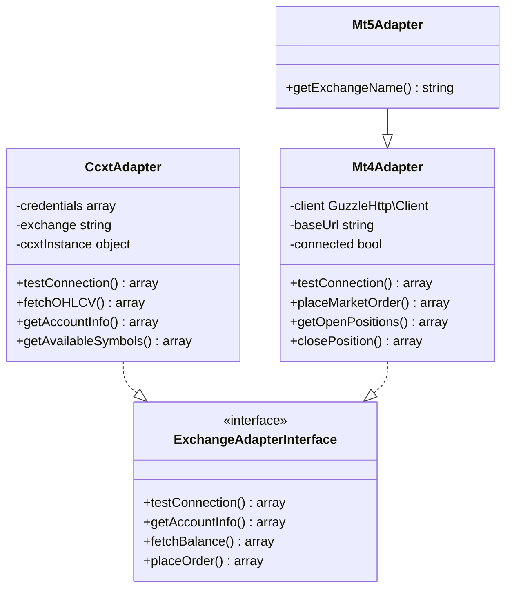
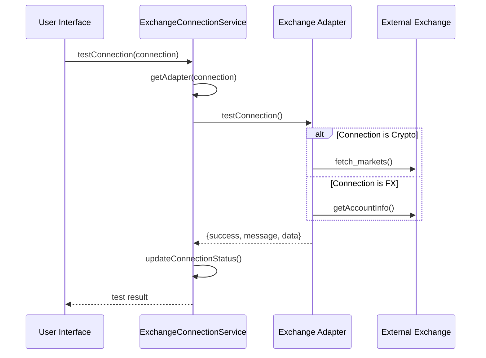
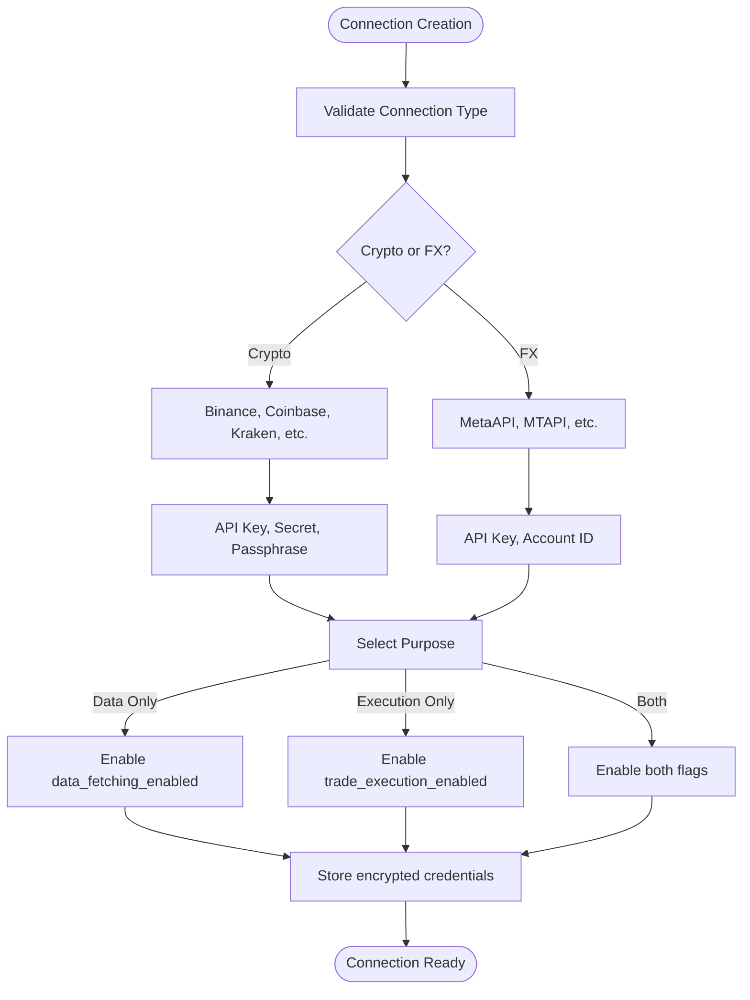
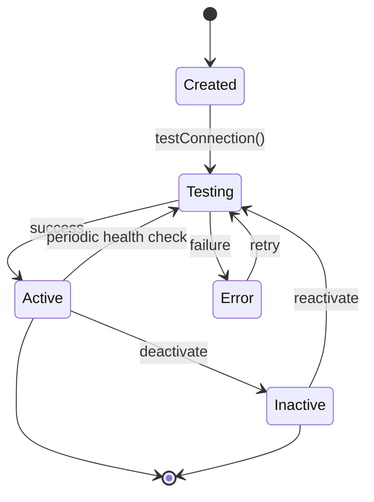
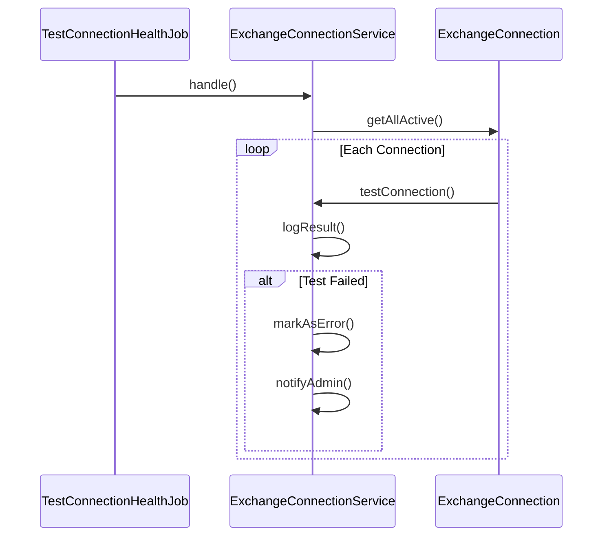
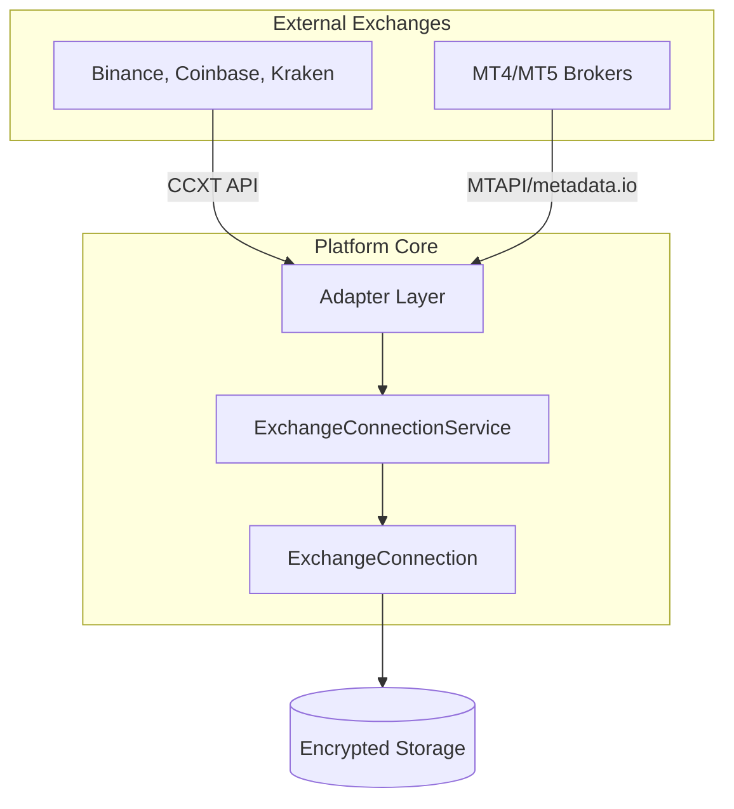

# Exchange Connectivity

<cite>
**Referenced Files in This Document**   
- [ExchangeConnectionService.php](file://main/addons/trading-management-addon/Modules/ExchangeConnection/Services/ExchangeConnectionService.php)
- [CcxtAdapter.php](file://main/addons/trading-management-addon/Modules/DataProvider/Adapters/CcxtAdapter.php)
- [Mt4Adapter.php](file://main/addons/_deprecated/trading-execution-engine-addon/app/Adapters/Mt4Adapter.php)
- [Mt5Adapter.php](file://main/addons/_deprecated/trading-execution-engine-addon/app/Adapters/Mt5Adapter.php)
- [ExchangeConnection.php](file://main/addons/trading-management-addon/Modules/ExchangeConnection/Models/ExchangeConnection.php)
- [create.blade.php](file://main/addons/_deprecated/trading-execution-engine-addon/resources/views/backend/connections/create.blade.php)
- [edit.blade.php](file://main/addons/_deprecated/trading-execution-engine-addon/resources/views/backend/connections/edit.blade.php)
- [TestConnectionHealthJob.php](file://main/addons/trading-management-addon/Modules/ExchangeConnection/Jobs/TestConnectionHealthJob.php)
</cite>

## Table of Contents
1. [Introduction](#introduction)
2. [Adapter Pattern Implementation](#adapter-pattern-implementation)
3. [ExchangeConnectionService Overview](#exchangeconnectionservice-overview)
4. [Configuration System](#configuration-system)
5. [Connection Lifecycle Management](#connection-lifecycle-management)
6. [Security Considerations](#security-considerations)
7. [Failover and Monitoring](#failover-and-monitoring)
8. [Integration Boundaries](#integration-boundaries)
9. [Conclusion](#conclusion)

## Introduction
The exchange connectivity system enables secure and reliable integration with trading exchanges through standardized adapter patterns. This architecture supports both cryptocurrency exchanges via CCXT and FX brokers via MT4/MT5 protocols. The system provides unified management of data fetching and trade execution capabilities, with comprehensive health monitoring and failover mechanisms.

## Adapter Pattern Implementation

The system implements the adapter pattern to provide a consistent interface for interacting with diverse exchange APIs. Two primary adapter types are implemented:

- **CCXT-based adapters** for cryptocurrency exchanges
- **MT4/MT5 adapters** for forex brokers

**Diagram sources**
- [CcxtAdapter.php](file://main/addons/trading-management-addon/Modules/DataProvider/Adapters/CcxtAdapter.php)
- [Mt4Adapter.php](file://main/addons/_deprecated/trading-execution-engine-addon/app/Adapters/Mt4Adapter.php)
- [Mt5Adapter.php](file://main/addons/_deprecated/trading-execution-engine-addon/app/Adapters/Mt5Adapter.php)

**Section sources**
- [CcxtAdapter.php](file://main/addons/trading-management-addon/Modules/DataProvider/Adapters/CcxtAdapter.php#L12-L289)
- [Mt4Adapter.php](file://main/addons/_deprecated/trading-execution-engine-addon/app/Adapters/Mt4Adapter.php#L10-L445)

## ExchangeConnectionService Overview

The `ExchangeConnectionService` manages the lifecycle of exchange connections, including health testing, stabilization, and status monitoring. It acts as a factory for creating appropriate adapters based on connection type and provider.

**Diagram sources**
- [ExchangeConnectionService.php](file://main/addons/trading-management-addon/Modules/ExchangeConnection/Services/ExchangeConnectionService.php#L25-L65)
- [ExchangeConnection.php](file://main/addons/trading-management-addon/Modules/ExchangeConnection/Models/ExchangeConnection.php#L88-L122)

**Section sources**
- [ExchangeConnectionService.php](file://main/addons/trading-management-addon/Modules/ExchangeConnection/Services/ExchangeConnectionService.php#L1-L229)

## Configuration System

The configuration system allows defining connection parameters and permission scopes through a structured JSON format. Connections can be configured for different purposes:

- Data-only access
- Execution-only access  
- Combined data and execution access

**Diagram sources**
- [ExchangeConnection.php](file://main/addons/trading-management-addon/Modules/ExchangeConnection/Models/ExchangeConnection.php#L28-L68)
- [create.blade.php](file://main/addons/_deprecated/trading-execution-engine-addon/resources/views/backend/connections/create.blade.php#L74-L140)

**Section sources**
- [ExchangeConnection.php](file://main/addons/trading-management-addon/Modules/ExchangeConnection/Models/ExchangeConnection.php#L1-L134)

## Connection Lifecycle Management

The connection lifecycle spans from creation to active trading, encompassing authentication, testing, and session management phases.

The lifecycle begins with connection creation where users provide credentials in JSON format. The system then tests connectivity by attempting to retrieve account information or market data. Upon successful validation, connections enter an active state and can be used for data fetching or trade execution.

**Diagram sources**
- [ExchangeConnectionService.php](file://main/addons/trading-management-addon/Modules/ExchangeConnection/Services/ExchangeConnectionService.php#L183-L228)
- [edit.blade.php](file://main/addons/_deprecated/trading-execution-engine-addon/resources/views/backend/connections/edit.blade.php#L106-L168)

**Section sources**
- [ExchangeConnectionService.php](file://main/addons/trading-management-addon/Modules/ExchangeConnection/Services/ExchangeConnectionService.php#L183-L228)

## Security Considerations

The system implements multiple security measures for protecting exchange connectivity:

- **API Key Storage**: Credentials are encrypted at rest using Laravel's built-in encryption
- **Permission Scopes**: Connections are scoped to specific capabilities (data, execution, or both)
- **Session Management**: Connection sessions are monitored and automatically invalidated after periods of inactivity
- **Input Validation**: All credential inputs are validated as proper JSON format before processing

The `HasEncryptedCredentials` trait ensures that sensitive information like API keys and secrets are securely stored in the database. Additionally, the system supports passphrase-based authentication required by exchanges like OKX and KuCoin.

**Section sources**
- [ExchangeConnection.php](file://main/addons/trading-management-addon/Modules/ExchangeConnection/Models/ExchangeConnection.php#L9-L10)
- [CcxtAdapter.php](file://main/addons/trading-management-addon/Modules/DataProvider/Adapters/CcxtAdapter.php#L146-L154)

## Failover and Monitoring

The system implements robust failover strategies and monitoring mechanisms to ensure reliable connectivity:

- **Heartbeat Monitoring**: Scheduled jobs test connection health every 15 minutes
- **Automatic Reconnection**: Failed connections are automatically retried
- **Stabilization Process**: Connections must pass health checks within the last 24 hours to be considered stable
- **Error Logging**: All connection issues are logged for troubleshooting

**Diagram sources**
- [TestConnectionHealthJob.php](file://main/addons/trading-management-addon/Modules/ExchangeConnection/Jobs/TestConnectionHealthJob.php#L65-L88)
- [ExchangeConnectionService.php](file://main/addons/trading-management-addon/Modules/ExchangeConnection/Services/ExchangeConnectionService.php#L25-L65)

**Section sources**
- [TestConnectionHealthJob.php](file://main/addons/trading-management-addon/Modules/ExchangeConnection/Jobs/TestConnectionHealthJob.php#L1-L88)

## Integration Boundaries

The system establishes clear integration boundaries between the platform and external exchanges:

The adapter layer abstracts external API differences, providing a consistent interface to the core application. This separation ensures that changes to external APIs do not directly impact the platform's business logic.

**Diagram sources**
- [ExchangeConnectionService.php](file://main/addons/trading-management-addon/Modules/ExchangeConnection/Services/ExchangeConnectionService.php#L131-L180)
- [CcxtAdapter.php](file://main/addons/trading-management-addon/Modules/DataProvider/Adapters/CcxtAdapter.php#L18-L22)

**Section sources**
- [ExchangeConnectionService.php](file://main/addons/trading-management-addon/Modules/ExchangeConnection/Services/ExchangeConnectionService.php#L125-L180)

## Conclusion
The exchange connectivity architecture provides a robust, secure, and extensible framework for integrating with trading exchanges. By leveraging the adapter pattern, the system supports multiple exchange types through a unified interface. The ExchangeConnectionService ensures reliable operation through comprehensive health monitoring, automatic failover, and secure credential management. This design enables seamless connectivity for both data acquisition and trade execution across cryptocurrency and forex markets.