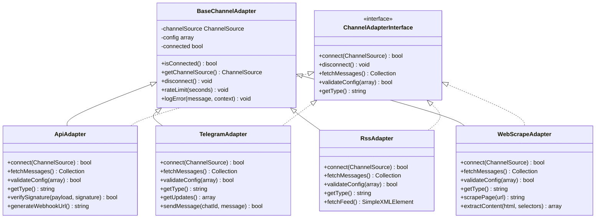

# Integration Architecture

<cite>
**Referenced Files in This Document**   
- [ApiAdapter.php](file://main/app/Adapters/ApiAdapter.php)
- [BaseChannelAdapter.php](file://main/app/Adapters/BaseChannelAdapter.php)
- [TelegramAdapter.php](file://main/app/Adapters/TelegramAdapter.php)
- [RssAdapter.php](file://main/app/Adapters/RssAdapter.php)
- [WebScrapeAdapter.php](file://main/app/Adapters/WebScrapeAdapter.php)
- [StripeService.php](file://main/app/Services/Gateway/StripeService.php)
- [PaypalService.php](file://main/app/Services/Gateway/PaypalService.php)
- [CoinpaymentsService.php](file://main/app/Services/Gateway/CoinpaymentsService.php)
- [SignalExecutionService.php](file://main/addons/_deprecated/trading-execution-engine-addon/app/Services/SignalExecutionService.php)
- [OpenRouterService.php](file://main/addons/openrouter-integration-addon/app/Services/OpenRouterService.php)
- [OpenRouterMarketAnalyzer.php](file://main/addons/openrouter-integration-addon/app/Services/OpenRouterMarketAnalyzer.php)
- [AiMessageParser.php](file://main/addons/multi-channel-signal-addon/app/Parsers/AiMessageParser.php)
- [ExecutionConnectionSeeder.php](file://main/database/seeders/ExecutionConnectionSeeder.php)
- [AiConfiguration.php](file://main/addons/multi-channel-signal-addon/app/Models/AiConfiguration.php)
</cite>

## Table of Contents
1. [Introduction](#introduction)
2. [Adapter Pattern Implementation](#adapter-pattern-implementation)
3. [Connection Management System](#connection-management-system)
4. [API Client Abstraction Layer](#api-client-abstraction-layer)
5. [Integration Flows](#integration-flows)
6. [Security Considerations](#security-considerations)
7. [Resilience Mechanisms](#resilience-mechanisms)
8. [Conclusion](#conclusion)

## Introduction
The platform implements a comprehensive integration architecture for connecting with external systems including payment gateways, AI providers, and trading exchanges. This document details the adapter pattern implementation, connection management, API client abstraction, and specific integration flows for key third-party services. The system is designed to provide secure, reliable, and scalable connectivity to external services while maintaining flexibility to support multiple providers within each service category.

## Adapter Pattern Implementation

The system implements the adapter pattern to standardize interactions with diverse external systems while maintaining a consistent interface across different providers. This pattern enables the platform to support multiple providers within each service category (payment, AI, trading) through a unified interface.

**Diagram sources**
- [BaseChannelAdapter.php](file://main/app/Adapters/BaseChannelAdapter.php)
- [ApiAdapter.php](file://main/app/Adapters/ApiAdapter.php)
- [TelegramAdapter.php](file://main/app/Adapters/TelegramAdapter.php)
- [RssAdapter.php](file://main/app/Adapters/RssAdapter.php)
- [WebScrapeAdapter.php](file://main/app/Adapters/WebScrapeAdapter.php)

**Section sources**
- [BaseChannelAdapter.php](file://main/app/Adapters/BaseChannelAdapter.php)
- [ApiAdapter.php](file://main/app/Adapters/ApiAdapter.php)

## Connection Management System

The platform implements a robust connection management system for maintaining secure credentials and monitoring connection health across all external integrations. The system provides centralized management of connection configurations, credential storage, and health monitoring.

### Connection Configuration and Credential Storage

External service connections are configured through a standardized system that securely stores credentials and connection parameters. Each connection type has specific configuration requirements validated through the adapter's `validateConfig` method.

**Diagram sources**
- [ExecutionConnectionSeeder.php](file://main/database/seeders/ExecutionConnectionSeeder.php)
- [AiConfiguration.php](file://main/addons/multi-channel-signal-addon/app/Models/AiConfiguration.php)

### Connection Health Monitoring

The system implements comprehensive health monitoring for all external connections:

1. **Status Tracking**: Each connection maintains an active/inactive status that can be toggled by administrators
2. **Error Counting**: Failed connection attempts are tracked with timestamps and error messages
3. **Last Sync Tracking**: Timestamp of the last successful synchronization
4. **Automated Validation**: Configuration validation occurs during setup and updates
5. **Manual Testing**: Admin interface provides connection test functionality

The health monitoring system ensures reliable operation by detecting and alerting on connection issues while maintaining service availability through fallback mechanisms.

**Section sources**
- [BaseChannelAdapter.php](file://main/app/Adapters/BaseChannelAdapter.php)
- [ExecutionConnectionSeeder.php](file://main/database/seeders/ExecutionConnectionSeeder.php)

## API Client Abstraction Layer

The platform implements a comprehensive API client abstraction layer that handles authentication, rate limiting, and error handling for all external service interactions. This abstraction provides a consistent interface across different service types while managing the complexities of external API integration.

### Authentication Management

The system handles authentication for external services through encrypted credential storage and provider-specific authentication flows:

**Diagram sources**
- [StripeService.php](file://main/app/Services/Gateway/StripeService.php)
- [PaypalService.php](file://main/app/Services/Gateway/PaypalService.php)

### Rate Limiting and Request Management

The abstraction layer implements rate limiting and request management to ensure compliance with external API limits:

1. **Provider-Specific Limits**: Configuration options for timeout settings and request throttling
2. **Retry Logic**: Automatic retry mechanisms for transient failures
3. **Queue Processing**: Asynchronous job processing to prevent blocking operations
4. **Caching**: Strategic caching of API responses to reduce redundant calls

### Error Handling Framework

The system implements a comprehensive error handling framework that:

1. Catches and logs all API exceptions with context
2. Provides user-friendly error messages
3. Implements circuit breaker patterns to prevent cascading failures
4. Routes errors to appropriate notification systems
5. Maintains idempotency to prevent duplicate processing

The abstraction layer ensures consistent error handling across all external integrations while providing detailed logging for troubleshooting.

**Section sources**
- [StripeService.php](file://main/app/Services/Gateway/StripeService.php)
- [PaypalService.php](file://main/app/Services/Gateway/PaypalService.php)

## Integration Flows

This section details the integration flows for key external systems, illustrating the data exchange patterns and processing logic for AI providers, payment gateways, and trading exchanges.

### AI Provider Integration (OpenAI/Gemini)

The platform integrates with AI providers through the OpenRouter unified gateway, enabling access to multiple AI models including OpenAI, Google Gemini, and others. The integration supports two primary use cases: signal parsing and market analysis.

**Diagram sources**
- [AiMessageParser.php](file://main/addons/multi-channel-signal-addon/app/Parsers/AiMessageParser.php)
- [OpenRouterService.php](file://main/addons/openrouter-integration-addon/app/Services/OpenRouterService.php)

### Payment Gateway Integration (Stripe/PayPal)

The payment system supports multiple gateways through a standardized service pattern, with specific implementations for Stripe, PayPal, and other providers.

**Diagram sources**
- [StripeService.php](file://main/app/Services/Gateway/StripeService.php)
- [PaypalService.php](file://main/app/Services/Gateway/PaypalService.php)

### Trading Exchange Integration (MT5/CCXT)

The trading execution system connects to exchanges and brokers through specialized adapters for MT4/MT5 and cryptocurrency exchanges via CCXT.

**Diagram sources**
- [SignalExecutionService.php](file://main/addons/_deprecated/trading-execution-engine-addon/app/Services/SignalExecutionService.php)
- [OpenRouterMarketAnalyzer.php](file://main/addons/openrouter-integration-addon/app/Services/OpenRouterMarketAnalyzer.php)

## Security Considerations

The integration architecture implements comprehensive security measures for storing API keys and handling sensitive data across all external connections.

### Credential Storage and Encryption

All external service credentials are stored with robust encryption:

1. **Encrypted Storage**: API keys and sensitive parameters are encrypted before storage in the database
2. **Environment Variables**: Master API keys stored in environment variables, not in code
3. **Access Controls**: Role-based access to connection configuration interfaces
4. **Audit Logging**: All changes to connection configurations are logged

The system uses Laravel's built-in encryption services to protect sensitive data at rest, ensuring that even with database access, credentials cannot be easily compromised.

### Data Protection in Transit

All external communications implement industry-standard security practices:

1. **HTTPS/TLS**: All API calls use encrypted connections
2. **Webhook Security**: Signature verification for incoming webhook requests
3. **Token Management**: Short-lived tokens where supported by providers
4. **Input Validation**: Strict validation of all incoming data from external sources

### Sensitive Data Handling

The platform implements strict controls for handling sensitive information:

1. **Minimal Data Storage**: Only essential data is stored; full transaction details are not retained
2. **Masking**: Sensitive information is masked in logs and UI displays
3. **Access Logging**: All access to sensitive configuration areas is logged
4. **Regular Rotation**: Support for periodic credential rotation

These security measures ensure that the integration architecture maintains the confidentiality, integrity, and availability of sensitive data while complying with industry standards.

**Section sources**
- [StripeService.php](file://main/app/Services/Gateway/StripeService.php)
- [PaypalService.php](file://main/app/Services/Gateway/PaypalService.php)
- [ApiAdapter.php](file://main/app/Adapters/ApiAdapter.php)

## Resilience Mechanisms

The integration architecture implements comprehensive resilience mechanisms to handle unreliable external services, including retry strategies, circuit breakers, and fallback mechanisms.

### Retry Strategies

The system implements intelligent retry logic for external service calls:

1. **Exponential Backoff**: Progressive delay between retry attempts
2. **Configurable Attempts**: Maximum retry attempts configurable per service
3. **Error Type Filtering**: Retry only on transient errors (network issues, timeouts)
4. **Async Processing**: All external calls processed through queue jobs for retry capability

### Circuit Breaker Pattern

The architecture implements circuit breaker patterns to prevent cascading failures:

1. **Failure Threshold**: After a configurable number of consecutive failures, the circuit opens
2. **Timeout Period**: Service calls fail immediately for a period, preventing overload
3. **Half-Open State**: After timeout, limited calls allowed to test service recovery
4. **Automatic Reset**: Circuit closes when service is confirmed healthy

### Fallback Mechanisms

The system provides multiple fallback strategies for external service failures:

1. **AI Provider Fallback**: Multiple AI configurations with priority ordering
2. **Payment Method Fallback**: Users can select alternative payment methods
3. **Graceful Degradation**: Core functionality remains available when non-critical integrations fail
4. **Manual Override**: Admin ability to bypass automated systems when needed

These resilience mechanisms ensure high availability and reliability of the integration architecture, minimizing the impact of external service disruptions on platform functionality.

**Section sources**
- [SignalExecutionService.php](file://main/addons/_deprecated/trading-execution-engine-addon/app/Services/SignalExecutionService.php)
- [OpenRouterService.php](file://main/addons/openrouter-integration-addon/app/Services/OpenRouterService.php)

## Conclusion

The integration architecture provides a robust, secure, and flexible framework for connecting with external systems. The adapter pattern implementation allows for standardized interactions with diverse services while maintaining the ability to support provider-specific features. The connection management system ensures secure credential storage and comprehensive health monitoring. The API client abstraction layer handles authentication, rate limiting, and error handling consistently across all integrations. Specific integration flows for AI providers, payment gateways, and trading exchanges demonstrate the system's capability to handle complex external interactions. Security considerations are addressed through encrypted storage, secure data transmission, and strict access controls. Finally, comprehensive resilience mechanisms including retry strategies, circuit breakers, and fallback options ensure reliable operation even when external services experience disruptions. This architecture provides a solid foundation for current integrations while remaining extensible for future external service connections.