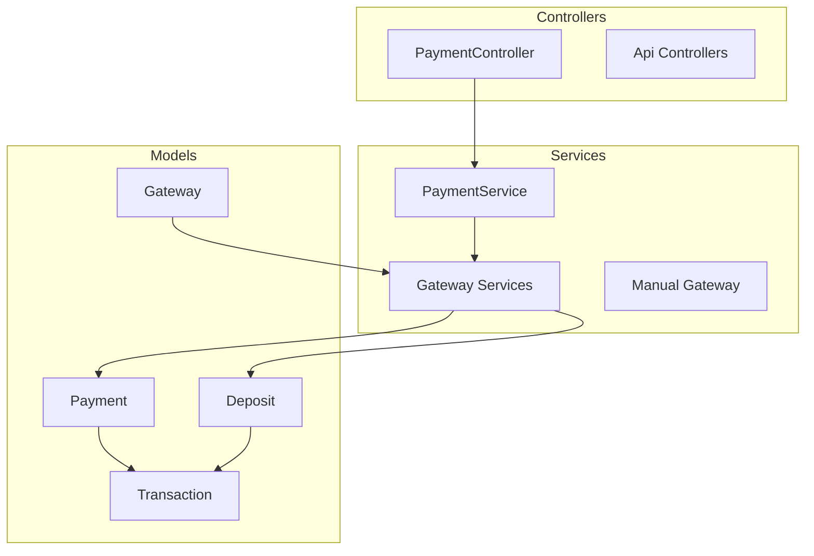
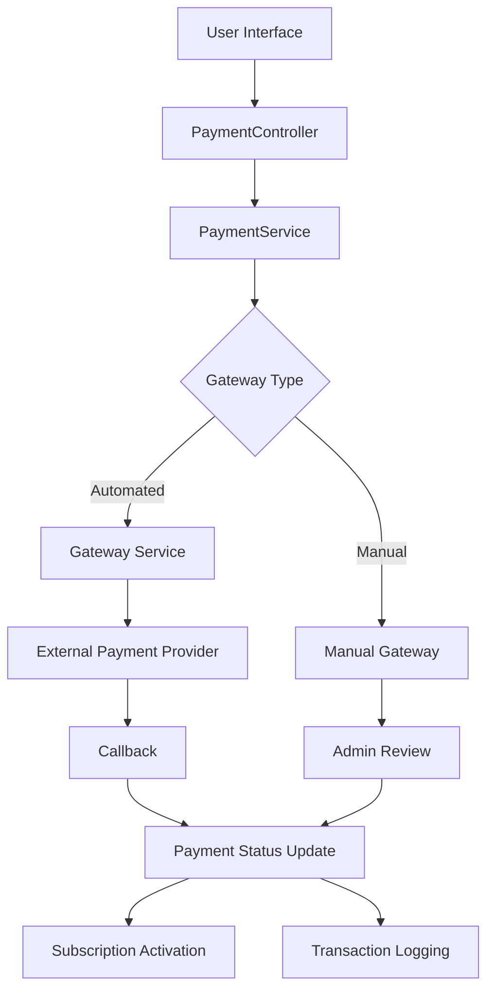
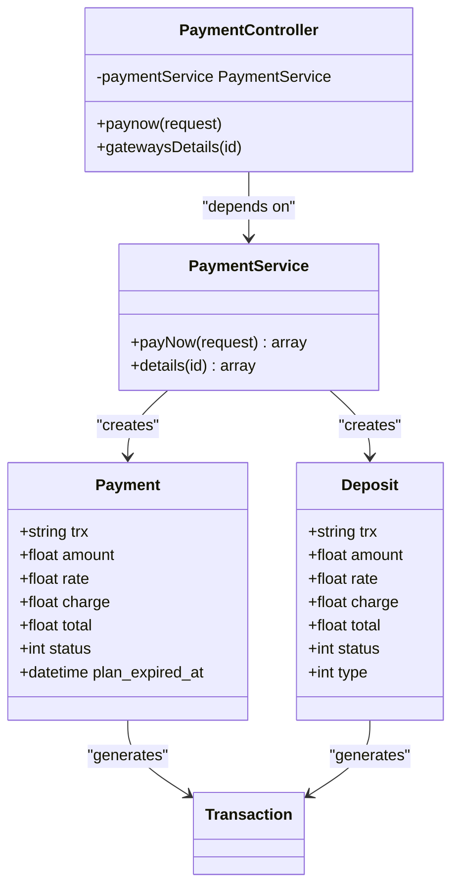
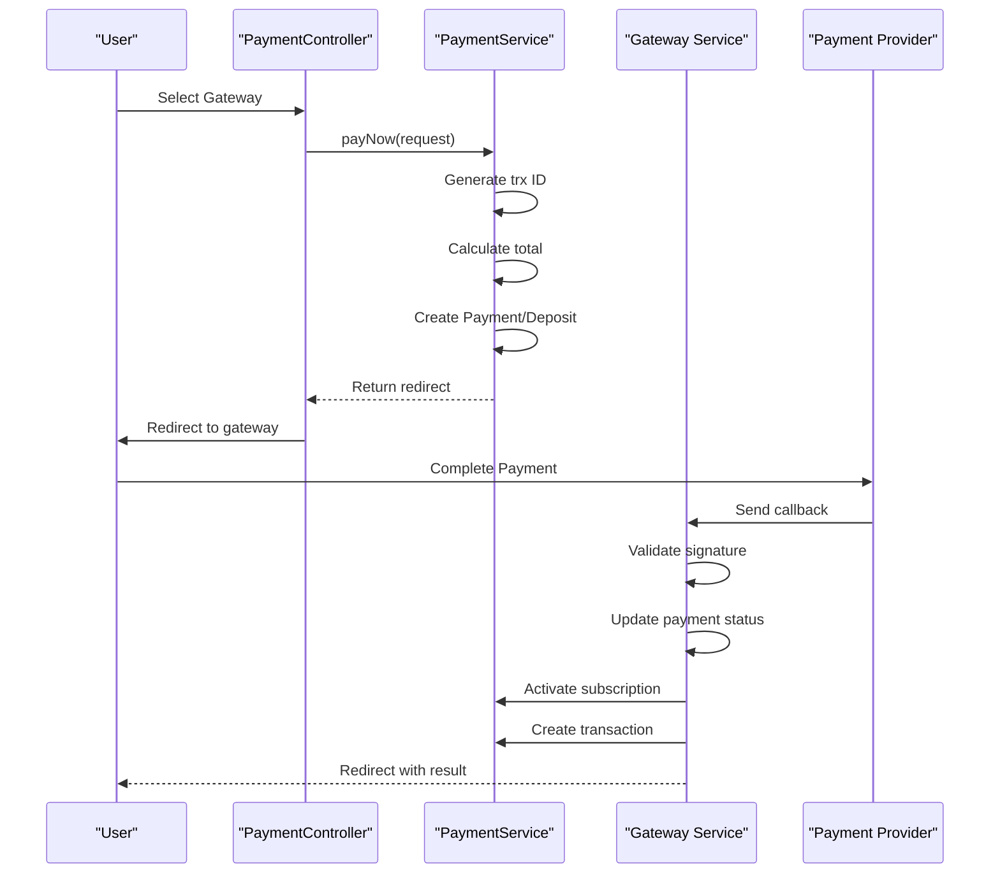
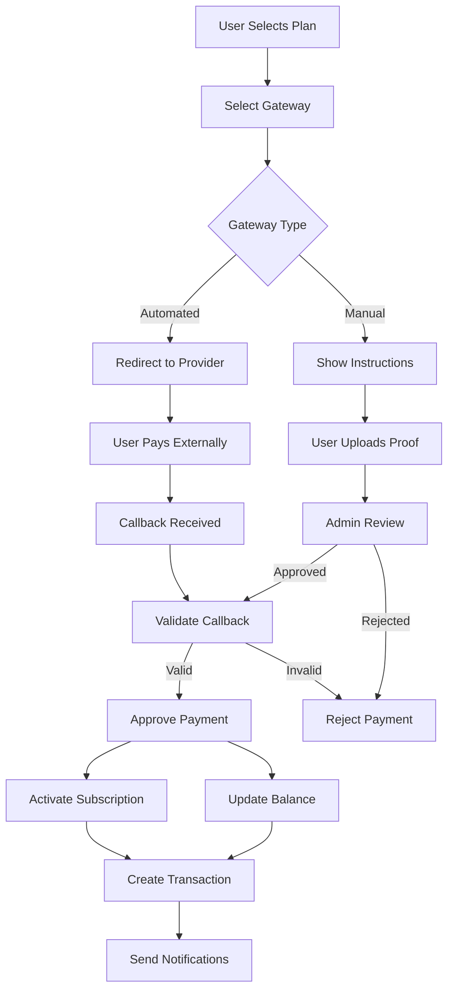
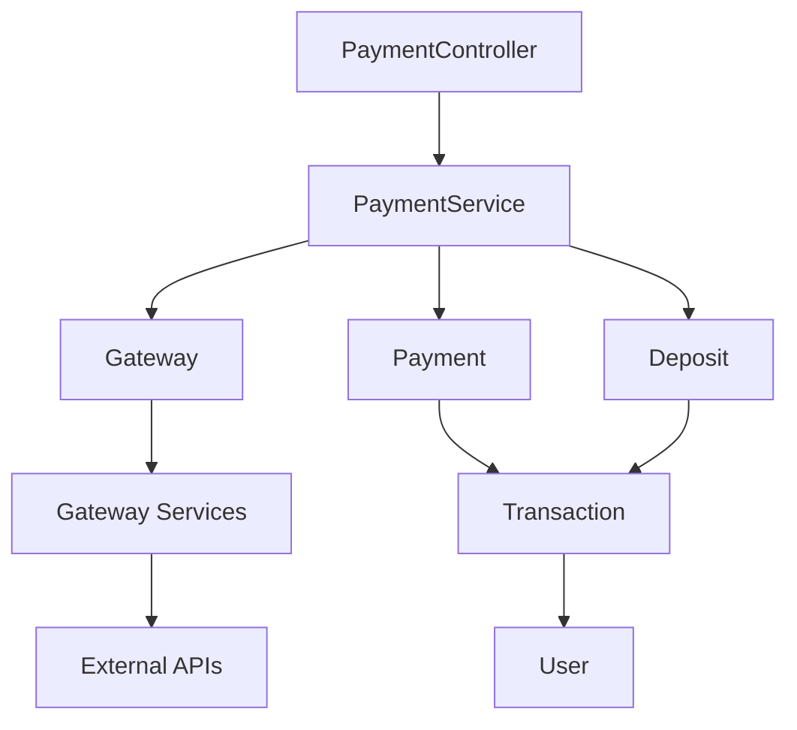

# Payment Gateway Integration

<cite>
**Referenced Files in This Document**   
- [PaymentService.php](file://main/app/Services/PaymentService.php)
- [PaymentController.php](file://main/app/Http/Controllers/PaymentController.php)
- [Payment.php](file://main/app/Models/Payment.php)
- [Deposit.php](file://main/app/Models/Deposit.php)
- [Transaction.php](file://main/app/Models/Transaction.php)
- [Gateway.php](file://main/app/Models/Gateway.php)
- [StripeService.php](file://main/app/Services/Gateway/StripeService.php)
- [PaypalService.php](file://main/app/Services/Gateway/PaypalService.php)
- [Manual.php](file://main/app/Services/Gateway/Manual.php)
- [GatewaySeeder.php](file://main/database/seeders/GatewaySeeder.php)
- [payment-gateway-integration.md](file://docs/payment-gateway-integration.md)
</cite>

## Table of Contents
1. [Introduction](#introduction)
2. [Project Structure](#project-structure)
3. [Core Components](#core-components)
4. [Architecture Overview](#architecture-overview)
5. [Detailed Component Analysis](#detailed-component-analysis)
6. [Dependency Analysis](#dependency-analysis)
7. [Performance Considerations](#performance-considerations)
8. [Troubleshooting Guide](#troubleshooting-guide)
9. [Conclusion](#conclusion)

## Introduction
The payment gateway integration architecture supports 15+ payment providers including Stripe, PayPal, and manual gateways. The system implements a service-oriented architecture with a standardized GatewayService abstraction layer that handles payment processing, webhook handling, and transaction verification. The configuration system enables secure management of gateway credentials and allows administrators to enable/disable gateways as needed. The payment flow covers user initiation, processing through external providers, and confirmation with subscription billing and wallet deposits. Security considerations include PCI compliance, webhook validation, and fraud detection mechanisms.

## Project Structure
The payment gateway integration is organized within the Laravel application structure with services, controllers, models, and configuration components. The core payment functionality resides in the `main/app/Services/Gateway/` directory with individual service classes for each payment provider. Payment-related models are located in `main/app/Models/` while controllers manage the request flow in `main/app/Http/Controllers/`. Configuration and seeding for gateways are handled in the database migration and seeding system.

**Diagram sources**
- [PaymentService.php](file://main/app/Services/PaymentService.php)
- [PaymentController.php](file://main/app/Http/Controllers/PaymentController.php)
- [Payment.php](file://main/app/Models/Payment.php)
- [Gateway.php](file://main/app/Models/Gateway.php)

**Section sources**
- [PaymentService.php](file://main/app/Services/PaymentService.php)
- [PaymentController.php](file://main/app/Http/Controllers/PaymentController.php)
- [Payment.php](file://main/app/Models/Payment.php)

## Core Components
The core components of the payment gateway integration include the PaymentService abstraction layer, individual gateway service implementations, payment and deposit models, and the transaction logging system. The GatewayService pattern standardizes interaction with external payment providers while maintaining flexibility for provider-specific implementations. The configuration system securely stores gateway credentials using encryption, and the status lifecycle management ensures proper tracking of payment states from initiation to completion.

**Section sources**
- [PaymentService.php](file://main/app/Services/PaymentService.php)
- [Payment.php](file://main/app/Models/Payment.php)
- [Deposit.php](file://main/app/Models/Deposit.php)
- [Transaction.php](file://main/app/Models/Transaction.php)

## Architecture Overview
The payment gateway architecture follows a service-oriented pattern with a central PaymentService coordinating between the application controllers and individual gateway services. When a user initiates a payment, the PaymentController delegates to PaymentService, which creates a transaction record and routes to the appropriate gateway service. Automated gateways redirect to external payment pages, while manual gateways provide instructions for offline payment. Callbacks from payment providers are processed through gateway-specific success methods that validate the response and update the payment status accordingly.

**Diagram sources**
- [PaymentController.php](file://main/app/Http/Controllers/PaymentController.php)
- [PaymentService.php](file://main/app/Services/PaymentService.php)
- [Manual.php](file://main/app/Services/Gateway/Manual.php)

## Detailed Component Analysis

### Payment Service Analysis
The PaymentService class provides the central coordination for all payment operations, handling both subscription payments and wallet deposits. It generates unique transaction IDs, calculates final amounts including fees, and creates the appropriate payment or deposit records in the database.

#### Payment Service Class Diagram

**Diagram sources**
- [PaymentService.php](file://main/app/Services/PaymentService.php)
- [Payment.php](file://main/app/Models/Payment.php)
- [Deposit.php](file://main/app/Models/Deposit.php)

### Gateway Service Pattern
The gateway service pattern implements a consistent interface across all payment providers while allowing for provider-specific implementations. Each gateway service follows the same method signature for processing payments and handling callbacks, ensuring uniform behavior across the system.

#### Gateway Service Sequence Diagram

**Diagram sources**
- [PaymentController.php](file://main/app/Http/Controllers/PaymentController.php)
- [PaymentService.php](file://main/app/Services/PaymentService.php)
- [StripeService.php](file://main/app/Services/Gateway/StripeService.php)

### Payment Flow Analysis
The payment flow encompasses both automated and manual gateway processing, with distinct paths for subscription payments and wallet deposits. The system maintains consistency in transaction ID generation, status tracking, and post-payment actions regardless of the gateway type.

#### Payment Flow Chart

**Diagram sources**
- [PaymentService.php](file://main/app/Services/PaymentService.php)
- [PaymentController.php](file://main/app/Http/Controllers/PaymentController.php)
- [payment-gateway-integration.md](file://docs/payment-gateway-integration.md)

## Dependency Analysis
The payment gateway system has well-defined dependencies between components, with the PaymentService acting as the central coordinator. Gateway services depend on the Gateway model for configuration and credentials, while the Payment and Deposit models provide the data layer for transaction tracking. The system uses Laravel's service container for dependency injection, ensuring loose coupling between components.

**Diagram sources**
- [PaymentController.php](file://main/app/Http/Controllers/PaymentController.php)
- [PaymentService.php](file://main/app/Services/PaymentService.php)
- [Gateway.php](file://main/app/Models/Gateway.php)

**Section sources**
- [PaymentService.php](file://main/app/Services/PaymentService.php)
- [PaymentController.php](file://main/app/Http/Controllers/PaymentController.php)
- [Gateway.php](file://main/app/Models/Gateway.php)

## Performance Considerations
The payment gateway integration is designed with performance in mind, minimizing database queries and external API calls. Transaction IDs are generated using efficient string operations, and gateway configurations are cached to reduce database load. The asynchronous nature of payment processing through external redirects ensures that the application remains responsive during payment operations. Webhook callbacks are processed quickly with minimal validation overhead to prevent timeout issues with external providers.

## Troubleshooting Guide
Common issues in the payment gateway system typically involve callback validation failures, credential misconfiguration, or payment status inconsistencies. The system logs all callback data for debugging purposes, and administrators can manually review and process payments through the admin interface. For automated gateways, ensuring correct webhook URLs and secret keys is critical for successful integration. The retry mechanism for failed callbacks helps resolve transient issues with external payment providers.

**Section sources**
- [PaymentController.php](file://main/app/Http/Controllers/PaymentController.php)
- [payment-gateway-integration.md](file://docs/payment-gateway-integration.md)

## Conclusion
The payment gateway integration architecture provides a robust, scalable solution for handling multiple payment providers through a standardized service interface. The separation of concerns between the PaymentService coordinator and individual gateway services allows for easy addition of new payment methods while maintaining consistent behavior across the system. Security measures including encrypted credential storage and callback validation ensure PCI compliance and protect against fraud. The comprehensive logging and transaction tracking system provides full audit capability for all financial operations.