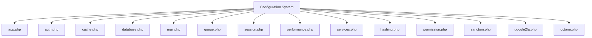
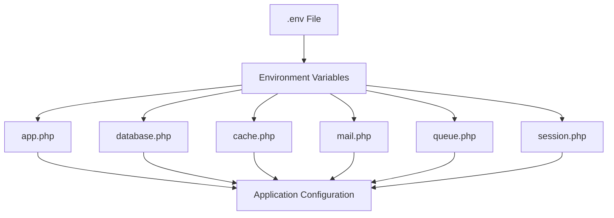
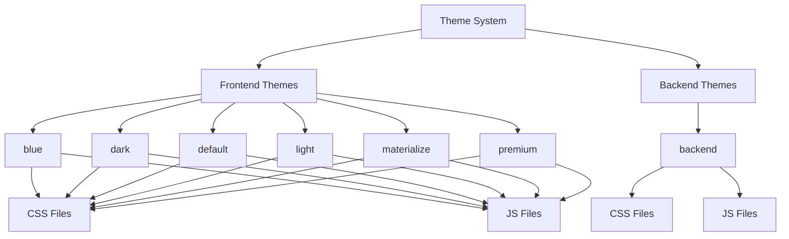
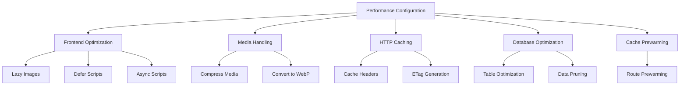
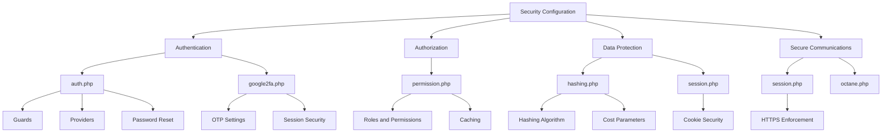
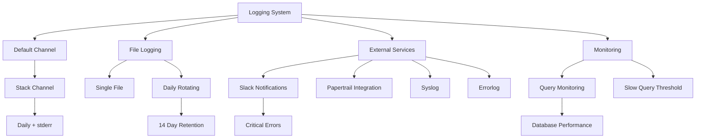
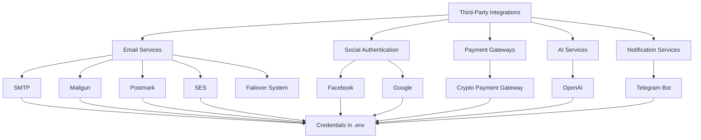
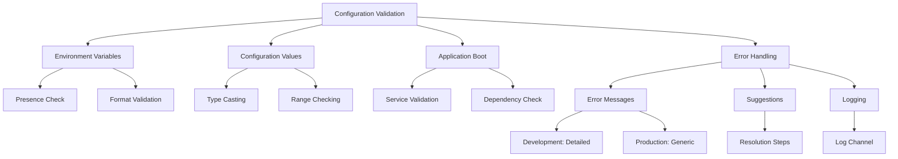

# Configuration

<cite>
**Referenced Files in This Document**   
- [app.php](file://main/config/app.php)
- [auth.php](file://main/config/auth.php)
- [cache.php](file://main/config/cache.php)
- [database.php](file://main/config/database.php)
- [mail.php](file://main/config/mail.php)
- [queue.php](file://main/config/queue.php)
- [logging.php](file://main/config/logging.php)
- [session.php](file://main/config/session.php)
- [performance.php](file://main/config/performance.php)
- [services.php](file://main/config/services.php)
- [hashing.php](file://main/config/hashing.php)
- [permission.php](file://main/config/permission.php)
- [sanctum.php](file://main/config/sanctum.php)
- [google2fa.php](file://main/config/google2fa.php)
- [octane.php](file://main/config/octane.php)
- [.env.example](file://main/.env.example)
</cite>

## Table of Contents
1. [Introduction](#introduction)
2. [Core Configuration Files](#core-configuration-files)
3. [Environment Variables and .env Configuration](#environment-variables-and-env-configuration)
4. [Theme Management and Customization](#theme-management-and-customization)
5. [Performance Tuning Parameters](#performance-tuning-parameters)
6. [Security Configuration](#security-configuration)
7. [Logging and Monitoring Settings](#logging-and-monitoring-settings)
8. [Third-Party Service Integration](#third-party-service-integration)
9. [Configuration Validation and Error Handling](#configuration-validation-and-error-handling)
10. [Conclusion](#conclusion)

## Introduction

This document provides comprehensive documentation for the system configuration options of the AI Trade Pulse application. It covers all configuration files in the config/ directory with detailed explanations of each setting, environment-specific configuration through .env variables, theme management options, performance tuning parameters, security configurations, logging settings, and integration with third-party services. The document also includes guidance on configuration validation and error handling to ensure system stability and reliability.

**Section sources**
- [app.php](file://main/config/app.php#L1-L250)

## Core Configuration Files

The application utilizes a comprehensive configuration system with multiple configuration files in the config/ directory, each responsible for specific aspects of the application's behavior. These configuration files are written in PHP and return associative arrays that define various settings.

The core configuration files include app.php for general application settings, auth.php for authentication configuration, cache.php for caching settings, database.php for database connections, mail.php for email configuration, queue.php for queue processing, and session.php for session management.

**Diagram sources**
- [app.php](file://main/config/app.php#L1-L250)
- [auth.php](file://main/config/auth.php#L1-L126)
- [cache.php](file://main/config/cache.php#L1-L111)
- [database.php](file://main/config/database.php#L1-L207)
- [mail.php](file://main/config/mail.php#L1-L119)
- [queue.php](file://main/config/queue.php#L1-L112)
- [session.php](file://main/config/session.php#L1-L202)

**Section sources**
- [app.php](file://main/config/app.php#L1-L250)
- [auth.php](file://main/config/auth.php#L1-L126)
- [cache.php](file://main/config/cache.php#L1-L111)
- [database.php](file://main/config/database.php#L1-L207)
- [mail.php](file://main/config/mail.php#L1-L119)
- [queue.php](file://main/config/queue.php#L1-L112)
- [session.php](file://main/config/session.php#L1-L202)

## Environment Variables and .env Configuration

The application uses environment variables extensively to configure its behavior across different environments (development, staging, production). The .env.example file provides a template for the required environment variables, which are then loaded into the application configuration files using the env() helper function.

Key environment variables include APP_NAME, APP_ENV, APP_DEBUG, APP_URL, DB_CONNECTION, DB_HOST, DB_PORT, DB_DATABASE, DB_USERNAME, DB_PASSWORD, CACHE_DRIVER, QUEUE_CONNECTION, MAIL_MAILER, MAIL_HOST, MAIL_PORT, MAIL_USERNAME, MAIL_PASSWORD, REDIS_HOST, REDIS_PORT, and REDIS_PASSWORD. These variables allow for easy configuration of the application without modifying the codebase.

The configuration system follows the principle of environment-specific configuration, where sensitive or environment-dependent values are stored in environment variables rather than in the configuration files themselves. This approach enhances security and allows for seamless deployment across different environments.

**Diagram sources**
- [.env.example](file://main/.env.example#L1-L66)
- [app.php](file://main/config/app.php#L1-L250)
- [database.php](file://main/config/database.php#L1-L207)
- [cache.php](file://main/config/cache.php#L1-L111)
- [mail.php](file://main/config/mail.php#L1-L119)
- [queue.php](file://main/config/queue.php#L1-L112)
- [session.php](file://main/config/session.php#L1-L202)

**Section sources**
- [.env.example](file://main/.env.example#L1-L66)
- [app.php](file://main/config/app.php#L1-L250)
- [database.php](file://main/config/database.php#L1-L207)
- [cache.php](file://main/config/cache.php#L1-L111)
- [mail.php](file://main/config/mail.php#L1-L119)
- [queue.php](file://main/config/queue.php#L1-L112)
- [session.php](file://main/config/session.php#L1-L202)

## Theme Management and Customization

The application supports multiple themes for both frontend and backend interfaces, allowing for extensive customization of the user experience. The frontend themes are organized in the asset/frontend/ directory with subdirectories for different theme variations including blue, dark, default, light, materialize, and premium.

Each theme contains its own CSS and JavaScript files, enabling complete visual customization. The default theme is used as the base, with other themes providing alternative styling options. The backend interface also supports theming, with CSS and JavaScript files organized in the asset/backend/ directory.

The theme system is designed to be extensible, allowing for the addition of new themes by creating new directories with the appropriate CSS and JavaScript files. This modular approach enables easy customization and branding of the application without modifying the core codebase.

**Diagram sources**
- [asset/frontend/blue/css](file://asset/frontend/blue/css)
- [asset/frontend/dark/css](file://asset/frontend/dark/css)
- [asset/frontend/default/css](file://asset/frontend/default/css)
- [asset/frontend/light/css](file://asset/frontend/light/css)
- [asset/frontend/materialize/css](file://asset/frontend/materialize/css)
- [asset/frontend/premium/css](file://asset/frontend/premium/css)
- [asset/backend/css](file://asset/backend/css)

**Section sources**
- [asset/frontend/blue/css](file://asset/frontend/blue/css)
- [asset/frontend/dark/css](file://asset/frontend/dark/css)
- [asset/frontend/default/css](file://asset/frontend/default/css)
- [asset/frontend/light/css](file://asset/frontend/light/css)
- [asset/frontend/materialize/css](file://asset/frontend/materialize/css)
- [asset/frontend/premium/css](file://asset/frontend/premium/css)
- [asset/backend/css](file://asset/backend/css)

## Performance Tuning Parameters

The application includes comprehensive performance tuning parameters in the performance.php configuration file, covering frontend optimization, media handling, HTTP caching, and database optimization. These settings are designed to maximize application performance and responsiveness.

The frontend optimization settings include options for lazy loading images, deferring script execution, and preloading critical resources. Media handling settings enable automatic compression and WebP conversion of images to reduce bandwidth usage. HTTP caching settings configure cache headers and ETag generation to minimize server load and improve response times.

Database optimization settings include automatic table optimization and data pruning to maintain database performance over time. The configuration also includes options for cache prewarming, which loads frequently accessed data into cache during application startup to reduce latency for subsequent requests.

**Diagram sources**
- [performance.php](file://main/config/performance.php#L1-L71)

**Section sources**
- [performance.php](file://main/config/performance.php#L1-L71)

## Security Configuration

The application implements robust security configurations across multiple areas including authentication, authorization, data protection, and secure communications. The security configuration is distributed across several configuration files, each addressing specific security aspects.

Authentication is configured in auth.php, defining guards for web and admin users, with separate user providers for regular users and administrators. Password reset configurations are also defined, with expiration times and throttling to prevent abuse. The hashing.php configuration file specifies the password hashing algorithm (bcrypt) and its parameters, including the number of rounds which affects the computational cost of hashing.

Two-factor authentication is configured in google2fa.php, enabling OTP-based verification with configurable lifetime and session handling. Session security is configured in session.php, with settings for HTTPS-only cookies, HTTP-only cookies, and SameSite cookie policies to prevent CSRF attacks and XSS-based session theft.

Authorization is managed through the permission.php configuration, which integrates with the Spatie Laravel Permission package to provide role-based access control. The configuration defines the models and database tables used for permissions and roles, as well as caching settings to optimize permission checks.

**Diagram sources**
- [auth.php](file://main/config/auth.php#L1-L126)
- [google2fa.php](file://main/config/google2fa.php#L1-L86)
- [permission.php](file://main/config/permission.php#L1-L162)
- [hashing.php](file://main/config/hashing.php#L1-L53)
- [session.php](file://main/config/session.php#L1-L202)
- [octane.php](file://main/config/octane.php#L1-L222)

**Section sources**
- [auth.php](file://main/config/auth.php#L1-L126)
- [google2fa.php](file://main/config/google2fa.php#L1-L86)
- [permission.php](file://main/config/permission.php#L1-L162)
- [hashing.php](file://main/config/hashing.php#L1-L53)
- [session.php](file://main/config/session.php#L1-L202)
- [octane.php](file://main/config/octane.php#L1-L222)

## Logging and Monitoring Settings

The application's logging configuration is defined in logging.php, providing a flexible system for capturing and managing application logs. The configuration supports multiple logging channels including single file, daily rotating files, Slack notifications, Papertrail integration, and various other destinations.

The default log channel is configured as a stack that combines daily file logging with stderr output, providing both persistent storage and real-time visibility. The daily channel creates rotating log files that are retained for 14 days, helping to manage disk space while maintaining historical logs for troubleshooting.

Specialized channels are available for different logging needs: the slack channel sends critical errors to a Slack webhook, the papertrail channel integrates with Papertrail for centralized log management, and the stderr channel outputs logs to standard error for containerized environments. The configuration also includes channels for syslog and errorlog for system-level logging integration.

Monitoring settings are integrated with the application's performance configuration, including query monitoring for database operations. The database.php configuration includes options to enable query monitoring and set a threshold for slow queries, helping to identify performance bottlenecks.

**Diagram sources**
- [logging.php](file://main/config/logging.php#L1-L119)
- [database.php](file://main/config/database.php#L1-L207)

**Section sources**
- [logging.php](file://main/config/logging.php#L1-L119)
- [database.php](file://main/config/database.php#L1-L207)

## Third-Party Service Integration

The application integrates with various third-party services through the services.php configuration file and corresponding environment variables. These integrations include email services, social authentication providers, payment gateways, and AI services.

Email services are configured through multiple drivers including SMTP, Mailgun, Postmark, and SES, with credentials stored in environment variables for security. Social authentication providers such as Facebook and Google are configured with their respective API keys and secrets, enabling users to sign in with their social accounts.

The application also integrates with Telegram through a bot API token, allowing for notifications and interactions via Telegram. AI services are integrated through the OpenAI API, with configuration for the API key and model selection. These third-party service configurations follow the principle of storing sensitive credentials in environment variables rather than in the codebase.

The configuration system allows for failover between different email services through the 'failover' mailer, which attempts to send emails through multiple transports in sequence if the primary transport fails. This enhances reliability of email delivery in production environments.

**Diagram sources**
- [services.php](file://main/config/services.php#L1-L55)
- [.env.example](file://main/.env.example#L1-L66)

**Section sources**
- [services.php](file://main/config/services.php#L1-L55)
- [.env.example](file://main/.env.example#L1-L66)

## Configuration Validation and Error Handling

The application implements comprehensive configuration validation and error handling to ensure system stability and provide meaningful feedback when configuration issues occur. The configuration system follows Laravel's conventions for validation, using environment variable defaults and type casting to prevent common configuration errors.

Configuration validation occurs at multiple levels: environment variables are validated for presence and format, configuration values are type-cast to ensure correct data types, and critical configurations are checked during application bootstrapping. For example, the APP_KEY must be set and of appropriate length for encryption to function properly.

Error handling for invalid configurations includes detailed error messages that help administrators identify and resolve issues. The debug mode setting (APP_DEBUG) controls the level of detail in error messages, with more detailed information available in development environments to aid troubleshooting.

The configuration system also includes safeguards against common misconfigurations, such as validating database connection parameters and email service credentials before attempting to use them. When configuration errors are detected, the application provides clear error messages and, where possible, suggestions for resolving the issue.

**Diagram sources**
- [app.php](file://main/config/app.php#L1-L250)
- [database.php](file://main/config/database.php#L1-L207)
- [mail.php](file://main/config/mail.php#L1-L119)
- [logging.php](file://main/config/logging.php#L1-L119)

**Section sources**
- [app.php](file://main/config/app.php#L1-L250)
- [database.php](file://main/config/database.php#L1-L207)
- [mail.php](file://main/config/mail.php#L1-L119)
- [logging.php](file://main/config/logging.php#L1-L119)

## Conclusion

The AI Trade Pulse application features a comprehensive and well-structured configuration system that provides extensive control over application behavior, performance, security, and integrations. The configuration is organized into multiple specialized files, each addressing specific aspects of the application, from basic application settings to advanced performance tuning and security configurations.

The use of environment variables for sensitive and environment-specific settings enhances security and facilitates deployment across different environments. The configuration system follows Laravel conventions while extending them with application-specific settings for trading functionality, AI integration, and user management.

Key strengths of the configuration system include its modularity, with clear separation of concerns across different configuration files; its flexibility, allowing for extensive customization of application behavior; and its robust error handling, which helps prevent configuration-related issues in production environments.

By understanding and properly configuring these settings, administrators can optimize the application for their specific requirements, ensuring optimal performance, security, and reliability.