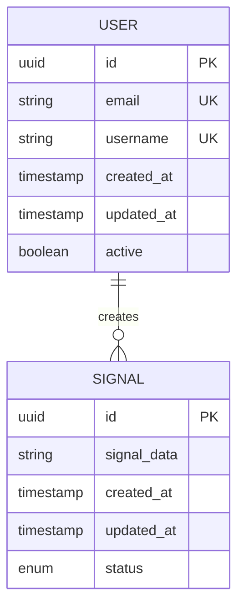
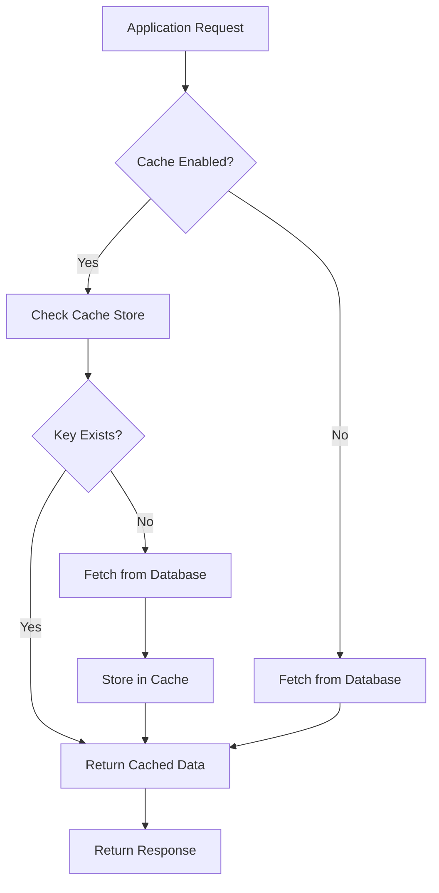
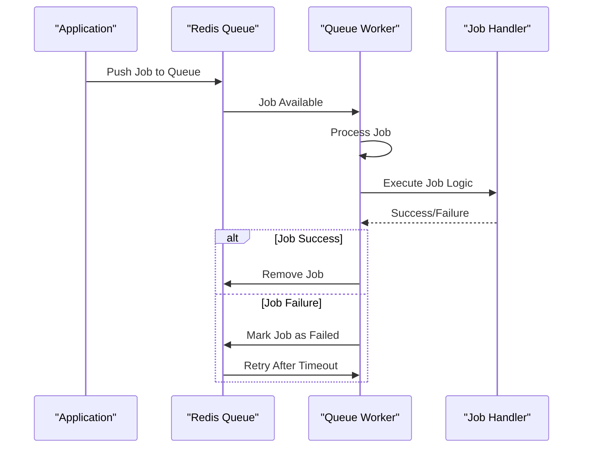
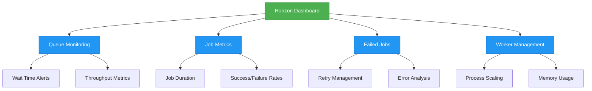

# Database, Cache & Queue Configuration

<cite>
**Referenced Files in This Document**   
- [database.php](file://main/config/database.php)
- [cache.php](file://main/config/cache.php)
- [queue.php](file://main/config/queue.php)
- [horizon.php](file://main/config/horizon.php)
- [.env.example](file://main/.env.example)
- [performance.php](file://main/config/performance.php)
- [octane.php](file://main/config/octane.php)
</cite>

## Table of Contents
1. [Introduction](#introduction)
2. [Database Configuration](#database-configuration)
3. [Cache Configuration](#cache-configuration)
4. [Queue Configuration](#queue-configuration)
5. [Horizon Monitoring Configuration](#horizon-monitoring-configuration)
6. [Performance Optimization & Connection Pooling](#performance-optimization--connection-pooling)
7. [High-Load Scaling Strategies](#high-load-scaling-strategies)
8. [Best Practices](#best-practices)

## Introduction
This document provides comprehensive configuration guidance for data storage and asynchronous processing in the AITradePulse application. It covers database connection settings for MySQL, cache driver configurations (Redis, Memcached, file), queue connection settings for Redis and database drivers, and Horizon-specific monitoring configurations. The document also includes performance optimization recommendations, scaling strategies for high-load environments, and best practices for connection pooling and failover.

## Database Configuration

The application uses Laravel's database configuration system with support for multiple database drivers. The primary database connection is MySQL, with configuration managed through environment variables.

### MySQL Connection Settings
The MySQL database configuration includes the following parameters:

- **Host**: Configured via `DB_HOST` environment variable (default: 127.0.0.1)
- **Port**: Configured via `DB_PORT` environment variable (default: 3306)
- **Database Name**: Configured via `DB_DATABASE` environment variable
- **Credentials**: Username and password configured via `DB_USERNAME` and `DB_PASSWORD` environment variables
- **Charset**: utf8mb4 with collation utf8mb4_unicode_ci
- **Table Prefix**: sp_ (configured in the database.php file)
- **SSL Configuration**: Optional SSL CA configuration via `MYSQL_ATTR_SSL_CA` environment variable

The configuration also includes advanced options such as Unix socket support and query optimization settings including slow query threshold (default: 1000ms) and query monitoring.

### Multiple Database Connections
The application supports multiple database connections including:
- MySQL (primary)
- PostgreSQL
- SQL Server
- SQLite

Each connection type has its specific configuration options while sharing common parameters like host, port, database name, and credentials.

**Diagram sources**
- [database.php](file://main/config/database.php#L46-L64)
- [migrations](file://main/database/migrations/)

**Section sources**
- [database.php](file://main/config/database.php#L46-L64)

## Cache Configuration

The application supports multiple cache drivers with flexible configuration options for performance optimization.

### Cache Driver Options
The available cache drivers include:
- Redis
- Memcached
- File-based
- Database
- APC
- DynamoDB
- Octane

#### Redis Cache Configuration
Redis is configured as a cache store with the following settings:
- Connection: References the 'cache' Redis connection defined in database.php
- Lock connection: Uses 'default' connection for atomic operations
- Key prefix: Automatically generated based on application name

#### Memcached Configuration
Memcached configuration includes:
- Host: Configured via `MEMCACHED_HOST` environment variable (default: 127.0.0.1)
- Port: Configured via `MEMCACHED_PORT` environment variable (default: 11211)
- SASL authentication: Username and password from environment variables
- Server weight: 100 (for load balancing in clustered environments)

#### File Cache Configuration
The file-based cache stores data in the `storage_path('framework/cache/data')` directory, making it suitable for development and low-traffic environments.

### Cache Key Management
The configuration includes a global cache key prefix generated from the application name, preventing key collisions in shared cache environments. The prefix is configurable via the `CACHE_PREFIX` environment variable.

**Diagram sources**
- [cache.php](file://main/config/cache.php#L76-L80)
- [performance.php](file://main/config/performance.php#L51-L62)

**Section sources**
- [cache.php](file://main/config/cache.php#L18-L109)

## Queue Configuration

The application uses Laravel's queue system for asynchronous processing with support for multiple queue drivers.

### Queue Connection Settings
The available queue drivers include:
- Redis (primary)
- Database
- Sync
- SQS
- Beanstalkd

#### Redis Queue Configuration
The Redis queue configuration includes multiple connection profiles:
- **Default**: Standard priority queue with 90-second retry timeout
- **High**: High-priority queue with 60-second retry timeout for time-sensitive operations
- **Low**: Low-priority queue with 120-second retry timeout for background tasks

Key parameters:
- **Connection**: References the Redis connection in database.php
- **Queue Name**: Configurable via `REDIS_QUEUE` environment variable
- **Retry After**: Time in seconds before a job is retried if it fails (default: 90)
- **Block Timeout**: Time to wait for new jobs (null for indefinite blocking)

#### Database Queue Configuration
The database queue stores jobs in the 'jobs' table with:
- Retry after: 90 seconds
- Default queue name: 'default'
- After commit processing disabled

### Failed Job Handling
Failed jobs are stored in the 'failed_jobs' table with the option to use UUIDs for primary keys. The failed job driver can be configured via the `QUEUE_FAILED_DRIVER` environment variable.

**Diagram sources**
- [queue.php](file://main/config/queue.php#L65-L90)
- [jobs](file://main/database/migrations/2025_12_05_124411_create_failed_jobs_table.php)

**Section sources**
- [queue.php](file://main/config/queue.php#L31-L111)

## Horizon Monitoring Configuration

Horizon provides a dashboard for monitoring and managing queue workers with comprehensive configuration options.

### Horizon Settings
Key configuration parameters include:
- **Name**: Configurable via `HORIZON_NAME` environment variable
- **Path**: Access path for the Horizon dashboard (default: 'horizon')
- **Domain**: Optional subdomain for Horizon access
- **Redis Connection**: Uses the 'default' Redis connection for storing Horizon metadata
- **Prefix**: Key prefix for Horizon data in Redis, based on application name

### Queue Monitoring
Horizon includes monitoring for queue wait times with configurable thresholds. The default configuration triggers alerts when jobs wait longer than 60 seconds in the Redis default queue.

### Data Retention
Horizon automatically trims historical data based on the following retention policies:
- Recent jobs: 60 minutes
- Pending jobs: 60 minutes
- Completed jobs: 60 minutes
- Failed jobs: 10,080 minutes (7 days)
- Monitored jobs: 10,080 minutes (7 days)

### Worker Configuration
The configuration defines default worker settings with environment-specific overrides:
- **Production**: Up to 10 processes with auto-scaling
- **Local**: Up to 3 processes for development

Worker settings include memory limits, timeout values, and process management parameters.

### Silenced Jobs
The configuration supports silencing specific jobs or tags to reduce noise in the Horizon dashboard, allowing focus on critical operations.

**Diagram sources**
- [horizon.php](file://main/config/horizon.php#L199-L228)
- [horizon.php](file://main/config/horizon.php#L114-L121)

**Section sources**
- [horizon.php](file://main/config/horizon.php#L1-L231)

## Performance Optimization & Connection Pooling

The application includes comprehensive performance optimization features for data storage and processing.

### Database Optimization
The performance configuration includes:
- Automatic table optimization
- Data pruning after 14 days
- Query monitoring with configurable thresholds

### Cache Optimization
Cache performance features include:
- TTL mapping for different cache types
- Cache prewarming for critical routes
- Automatic compression and WebP conversion for media

### Connection Pooling
The application leverages Laravel's connection pooling through:
- Redis connection reuse across requests
- Persistent database connections
- Connection timeout management

### Octane Integration
For high-performance environments, the application supports Laravel Octane with Swoole or RoadRunner, providing:
- Long-lived worker processes
- Reduced request bootstrapping overhead
- In-memory caching through Swoole tables
- Garbage collection management

The Octane configuration includes memory management, request timeout settings, and file watching for automatic reloading.

**Section sources**
- [performance.php](file://main/config/performance.php#L64-L68)
- [octane.php](file://main/config/octane.php#L39-L222)

## High-Load Scaling Strategies

For high-load environments, the application supports several scaling strategies.

### Horizontal Scaling
- Multiple queue workers distributed across servers
- Redis clustering for distributed cache and queue storage
- Database read replicas for separating read and write operations

### Vertical Scaling
- Increased worker processes based on environment
- Memory limits for worker processes to prevent OOM errors
- Auto-scaling strategies based on time or workload

### Load Distribution
- Priority queues for separating critical and background tasks
- Multiple Redis databases for separating cache, queue, and session data
- Connection weighting for load balancing

### Failover Strategies
- Redis failover with sentinel or cluster mode
- Database failover with master-slave replication
- Queue retry mechanisms with exponential backoff

**Section sources**
- [horizon.php](file://main/config/horizon.php#L216-L228)
- [database.php](file://main/config/database.php#L131-L204)

## Best Practices

### Configuration Management
- Use environment variables for all sensitive configuration
- Maintain separate configuration for different environments
- Use configuration caching in production

### Security Considerations
- Enable SSL for database connections in production
- Use strong passwords for Redis authentication
- Restrict access to Horizon dashboard with authentication

### Monitoring and Maintenance
- Regularly monitor queue wait times and job failure rates
- Implement alerting for long-running jobs
- Schedule regular database optimization tasks

### Performance Tuning
- Optimize Redis memory usage by configuring appropriate eviction policies
- Use connection pooling to reduce connection overhead
- Implement proper indexing for database queries

### Deployment Considerations
- Use system-level process managers (supervisor) for production
- Configure proper memory limits to prevent worker crashes
- Implement graceful shutdown procedures for queue workers

**Section sources**
- [.env.example](file://main/.env.example#L11-L30)
- [supervisor-horizon.conf](file://main/supervisor-horizon.conf)
- [supervisor-laravel-worker.conf](file://main/supervisor-laravel-worker.conf)