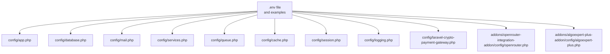
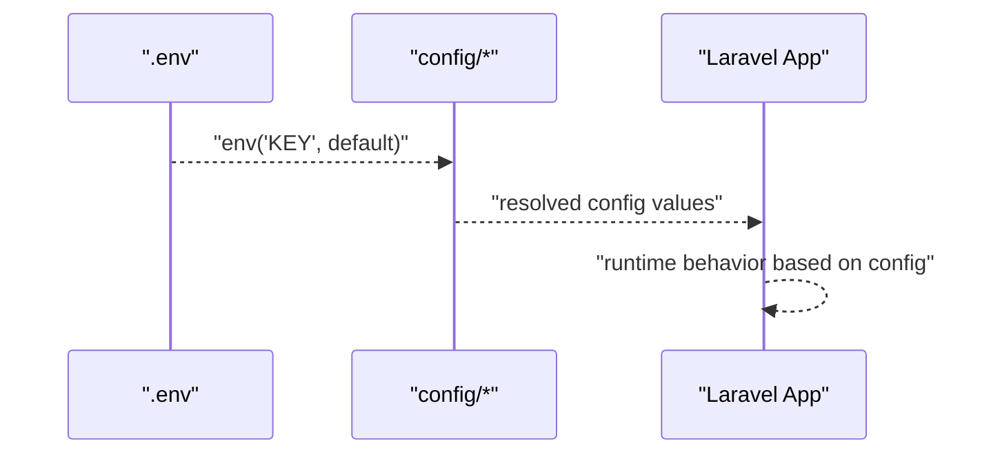
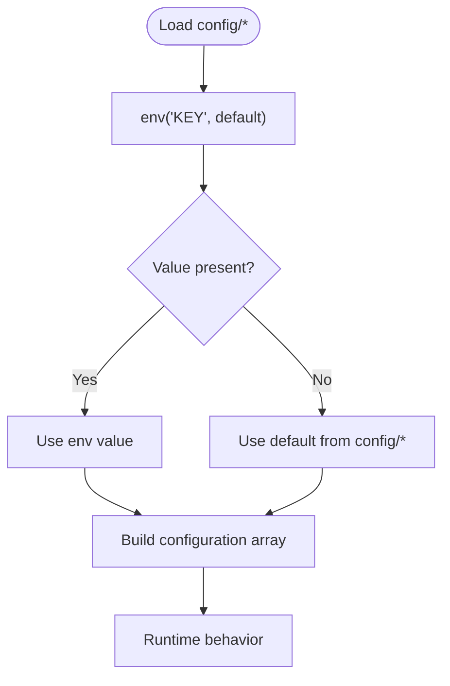
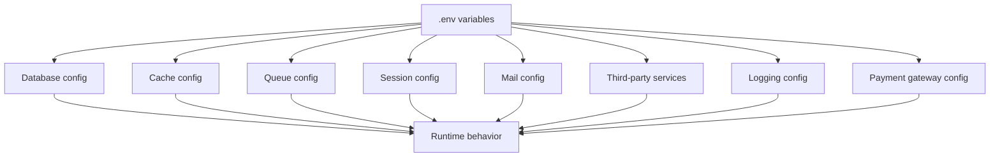

# Environment Configuration

<cite>
**Referenced Files in This Document**
- [.env.example](file://main/.env.example)
- [.env.firebase.example](file://main/.env.firebase.example)
- [.railway.env.example](file://.railway.env.example)
- [config/app.php](file://main/config/app.php)
- [config/database.php](file://main/config/database.php)
- [config/mail.php](file://main/config/mail.php)
- [config/services.php](file://main/config/services.php)
- [config/queue.php](file://main/config/queue.php)
- [config/cache.php](file://main/config/cache.php)
- [config/session.php](file://main/config/session.php)
- [config/logging.php](file://main/config/logging.php)
- [config/laravel-crypto-payment-gateway.php](file://main/config/laravel-crypto-payment-gateway.php)
- [addons/openrouter-integration-addon/config/openrouter.php](file://main/addons/openrouter-integration-addon/config/openrouter.php)
- [addons/algoexpert-plus-addon/config/algoexpert-plus.php](file://main/addons/algoexpert-plus-addon/config/algoexpert-plus.php)
- [docs/env-configuration-translation.md](file://main/docs/env-configuration-translation.md)
- [docs/deployment-guide.md](file://main/docs/deployment-guide.md)
</cite>

## Table of Contents
1. [Introduction](#introduction)
2. [Project Structure](#project-structure)
3. [Core Components](#core-components)
4. [Architecture Overview](#architecture-overview)
5. [Detailed Component Analysis](#detailed-component-analysis)
6. [Dependency Analysis](#dependency-analysis)
7. [Performance Considerations](#performance-considerations)
8. [Troubleshooting Guide](#troubleshooting-guide)
9. [Conclusion](#conclusion)
10. [Appendices](#appendices)

## Introduction
This document explains environment-based configuration in the Laravel application, focusing on how the .env file overrides configuration values in the config/ directory. It covers critical environment variables for databases, mail, API keys (OpenAI, Firebase, payment gateways), and application settings. It also provides environment-specific examples for development, staging, and production, along with security best practices, the relationship between .env variables and Laravel’s configuration system using env() helpers, and common configuration errors and troubleshooting steps.

## Project Structure
The environment configuration spans two primary areas:
- The .env file and environment-specific examples (.env.example, .env.firebase.example, .railway.env.example)
- Laravel configuration files under config/ that read values via env()

**Diagram sources**
- [config/app.php](file://main/config/app.php#L20-L65)
- [config/database.php](file://main/config/database.php#L18-L206)
- [config/mail.php](file://main/config/mail.php#L16-L97)
- [config/services.php](file://main/config/services.php#L17-L54)
- [config/queue.php](file://main/config/queue.php#L16-L111)
- [config/cache.php](file://main/config/cache.php#L18-L109)
- [config/session.php](file://main/config/session.php#L21-L201)
- [config/logging.php](file://main/config/logging.php#L20-L118)
- [config/laravel-crypto-payment-gateway.php](file://main/config/laravel-crypto-payment-gateway.php#L55-L212)
- [addons/openrouter-integration-addon/config/openrouter.php](file://main/addons/openrouter-integration-addon/config/openrouter.php#L14-L33)
- [addons/algoexpert-plus-addon/config/algoexpert-plus.php](file://main/addons/algoexpert-plus-addon/config/algoexpert-plus.php#L13-L37)

**Section sources**
- [config/app.php](file://main/config/app.php#L20-L65)
- [config/database.php](file://main/config/database.php#L18-L206)
- [config/mail.php](file://main/config/mail.php#L16-L97)
- [config/services.php](file://main/config/services.php#L17-L54)
- [config/queue.php](file://main/config/queue.php#L16-L111)
- [config/cache.php](file://main/config/cache.php#L18-L109)
- [config/session.php](file://main/config/session.php#L21-L201)
- [config/logging.php](file://main/config/logging.php#L20-L118)
- [config/laravel-crypto-payment-gateway.php](file://main/config/laravel-crypto-payment-gateway.php#L55-L212)
- [addons/openrouter-integration-addon/config/openrouter.php](file://main/addons/openrouter-integration-addon/config/openrouter.php#L14-L33)
- [addons/algoexpert-plus-addon/config/algoexpert-plus.php](file://main/addons/algoexpert-plus-addon/config/algoexpert-plus.php#L13-L37)

## Core Components
- Application identity and runtime: APP_NAME, APP_ENV, APP_DEBUG, APP_URL, APP_KEY
- Database connectivity: DB_CONNECTION, DB_HOST, DB_PORT, DB_DATABASE, DB_USERNAME, DB_PASSWORD, plus Redis and cache options
- Queue and session drivers: QUEUE_CONNECTION, SESSION_DRIVER, SESSION_LIFETIME, CACHE_DRIVER
- Mail transport: MAIL_MAILER, MAIL_HOST, MAIL_PORT, MAIL_USERNAME, MAIL_PASSWORD, MAIL_ENCRYPTION, MAIL_FROM_ADDRESS, MAIL_FROM_NAME
- Third-party services: AWS credentials, Pusher, Telegram bot token, OpenAI API key and model
- Payment gateways: Crypto payment gateway keys (GoUrl) and others configured via admin panel
- Logging: LOG_CHANNEL, LOG_LEVEL, LOG_SLACK_WEBHOOK_URL, LOG_DEPRECATIONS_CHANNEL
- Firebase: FIREBASE_PROJECT_ID, FIREBASE_API_KEY, FIREBASE_AUTH_TOKENS_JSON
- Environment-specific examples: .env.example, .env.firebase.example, .railway.env.example

**Section sources**
- [.env.example](file://main/.env.example#L1-L66)
- [.env.firebase.example](file://main/.env.firebase.example#L1-L8)
- [.railway.env.example](file://.railway.env.example#L1-L94)
- [config/app.php](file://main/config/app.php#L20-L65)
- [config/database.php](file://main/config/database.php#L18-L206)
- [config/mail.php](file://main/config/mail.php#L16-L97)
- [config/services.php](file://main/config/services.php#L17-L54)
- [config/queue.php](file://main/config/queue.php#L16-L111)
- [config/cache.php](file://main/config/cache.php#L18-L109)
- [config/session.php](file://main/config/session.php#L21-L201)
- [config/logging.php](file://main/config/logging.php#L20-L118)
- [config/laravel-crypto-payment-gateway.php](file://main/config/laravel-crypto-payment-gateway.php#L55-L212)

## Architecture Overview
Laravel reads configuration from config/ files using env() to resolve environment variables. The .env file supplies runtime values that override defaults in config files. Addons may introduce additional environment-dependent configuration.

**Diagram sources**
- [config/app.php](file://main/config/app.php#L20-L65)
- [config/database.php](file://main/config/database.php#L18-L206)
- [config/mail.php](file://main/config/mail.php#L16-L97)
- [config/services.php](file://main/config/services.php#L17-L54)
- [config/queue.php](file://main/config/queue.php#L16-L111)
- [config/cache.php](file://main/config/cache.php#L18-L109)
- [config/session.php](file://main/config/session.php#L21-L201)
- [config/logging.php](file://main/config/logging.php#L20-L118)
- [config/laravel-crypto-payment-gateway.php](file://main/config/laravel-crypto-payment-gateway.php#L55-L212)
- [addons/openrouter-integration-addon/config/openrouter.php](file://main/addons/openrouter-integration-addon/config/openrouter.php#L14-L33)
- [addons/algoexpert-plus-addon/config/algoexpert-plus.php](file://main/addons/algoexpert-plus-addon/config/algoexpert-plus.php#L13-L37)

## Detailed Component Analysis

### Application Settings
- Purpose: Define application identity, environment, debug mode, URL, and encryption key.
- Key variables: APP_NAME, APP_ENV, APP_DEBUG, APP_URL, APP_KEY.
- Defaults: Resolved via env() with sensible defaults in config/app.php.

**Section sources**
- [config/app.php](file://main/config/app.php#L20-L65)
- [.env.example](file://main/.env.example#L1-L10)

### Database and Redis
- Purpose: Configure default connection, host/port/database/user/password, charset/collation, SSL options, slow query thresholds, and Redis clients/ports/databases.
- Key variables: DB_CONNECTION, DB_HOST, DB_PORT, DB_DATABASE, DB_USERNAME, DB_PASSWORD, REDIS_* (client, host, port, password, prefix, db indices), DB_SLOW_QUERY_THRESHOLD, DB_ENABLE_QUERY_MONITORING.
- Notes: Redis supports unix sockets and TCP; separate configs for default/cache/queue.

**Section sources**
- [config/database.php](file://main/config/database.php#L18-L206)
- [.env.example](file://main/.env.example#L11-L31)

### Queue and Sessions
- Purpose: Select queue driver and session driver, lifetime, and related settings.
- Key variables: QUEUE_CONNECTION, SESSION_DRIVER, SESSION_LIFETIME, SESSION_CONNECTION, SESSION_STORE, SESSION_COOKIE, SESSION_DOMAIN, SESSION_SECURE_COOKIE.

**Section sources**
- [config/queue.php](file://main/config/queue.php#L16-L111)
- [config/session.php](file://main/config/session.php#L21-L201)
- [.env.example](file://main/.env.example#L18-L24)

### Cache and Filesystems
- Purpose: Choose cache driver and store specifics; configure Memcached host/port; DynamoDB credentials; cache key prefix.
- Key variables: CACHE_DRIVER, MEMCACHED_HOST, MEMCACHED_PORT, MEMCACHED_USERNAME, MEMCACHED_PASSWORD, AWS_* for DynamoDB, CACHE_PREFIX.

**Section sources**
- [config/cache.php](file://main/config/cache.php#L18-L109)
- [.env.example](file://main/.env.example#L18-L20)

### Mail Transport
- Purpose: Configure mailer transport, SMTP host/port/encryption, credentials, and global sender address/name.
- Key variables: MAIL_MAILER, MAIL_HOST, MAIL_PORT, MAIL_USERNAME, MAIL_PASSWORD, MAIL_ENCRYPTION, MAIL_FROM_ADDRESS, MAIL_FROM_NAME.

**Section sources**
- [config/mail.php](file://main/config/mail.php#L16-L97)
- [.env.example](file://main/.env.example#L44-L51)

### Third-Party Services and API Keys
- Purpose: Provide credentials for external services and AI providers.
- Key variables: AWS_ACCESS_KEY_ID, AWS_SECRET_ACCESS_KEY, AWS_DEFAULT_REGION, PUSHER_APP_ID, PUSHER_APP_KEY, PUSHER_APP_SECRET, PUSHER_APP_CLUSTER, TELEGRAM_BOT_TOKEN, OPENAI_API_KEY, OPENAI_MODEL.
- Notes: Additional services include Facebook, Google, Postmark, SES, and OpenRouter.

**Section sources**
- [config/services.php](file://main/config/services.php#L17-L54)
- [.env.example](file://main/.env.example#L53-L66)
- [addons/openrouter-integration-addon/config/openrouter.php](file://main/addons/openrouter-integration-addon/config/openrouter.php#L14-L33)

### Payment Gateways
- Purpose: Configure crypto payment gateway keys (GoUrl) and other gateways via admin panel.
- Key variables: GOURL_* keys for multiple cryptocurrencies; other gateways configured via admin UI.
- Notes: Payment credentials are often managed in admin panels rather than .env.

**Section sources**
- [config/laravel-crypto-payment-gateway.php](file://main/config/laravel-crypto-payment-gateway.php#L55-L212)

### Logging
- Purpose: Control default log channel, deprecation logging, and channel-specific handlers (stack, daily, slack, syslog, stderr).
- Key variables: LOG_CHANNEL, LOG_DEPRECATIONS_CHANNEL, LOG_LEVEL, LOG_SLACK_WEBHOOK_URL, PAPERTRAIL_URL, PAPERTRAIL_PORT.

**Section sources**
- [config/logging.php](file://main/config/logging.php#L20-L118)
- [.env.example](file://main/.env.example#L7-L10)

### Firebase
- Purpose: Android client authentication and tokens for Firebase.
- Key variables: FIREBASE_PROJECT_ID, FIREBASE_API_KEY, FIREBASE_AUTH_TOKENS_JSON.

**Section sources**
- [.env.firebase.example](file://main/.env.firebase.example#L1-L8)

### Environment-Specific Examples
- Development: Local SMTP, SQLite or local MySQL, file cache/session, debug enabled.
- Staging: Moderate logging, Redis for cache/queue/session, stricter debug settings.
- Production: Minimal debug, robust logging, external Redis/S3, secure cookies, rate-limited queues.

**Section sources**
- [.env.example](file://main/.env.example#L1-L66)
- [.railway.env.example](file://.railway.env.example#L1-L94)

### Relationship Between .env and Laravel Configuration
- env() helper resolves keys from the environment with optional defaults.
- config files read env() values to build runtime configuration arrays.
- Addons may introduce additional env-dependent config entries.

**Diagram sources**
- [config/app.php](file://main/config/app.php#L20-L65)
- [config/database.php](file://main/config/database.php#L18-L206)
- [config/mail.php](file://main/config/mail.php#L16-L97)
- [config/services.php](file://main/config/services.php#L17-L54)
- [config/queue.php](file://main/config/queue.php#L16-L111)
- [config/cache.php](file://main/config/cache.php#L18-L109)
- [config/session.php](file://main/config/session.php#L21-L201)
- [config/logging.php](file://main/config/logging.php#L20-L118)
- [config/laravel-crypto-payment-gateway.php](file://main/config/laravel-crypto-payment-gateway.php#L55-L212)
- [addons/openrouter-integration-addon/config/openrouter.php](file://main/addons/openrouter-integration-addon/config/openrouter.php#L14-L33)
- [addons/algoexpert-plus-addon/config/algoexpert-plus.php](file://main/addons/algoexpert-plus-addon/config/algoexpert-plus.php#L13-L37)

## Dependency Analysis
- Coupling: Configuration files depend on env() resolution; minimal direct coupling between config files.
- Indirect dependencies: Database and Redis configuration influence cache/queue/session behavior.
- External integrations: Mail, AWS, Pusher, Telegram, OpenAI, and payment providers rely on environment variables.

**Diagram sources**
- [config/database.php](file://main/config/database.php#L18-L206)
- [config/cache.php](file://main/config/cache.php#L18-L109)
- [config/queue.php](file://main/config/queue.php#L16-L111)
- [config/session.php](file://main/config/session.php#L21-L201)
- [config/mail.php](file://main/config/mail.php#L16-L97)
- [config/services.php](file://main/config/services.php#L17-L54)
- [config/logging.php](file://main/config/logging.php#L20-L118)
- [config/laravel-crypto-payment-gateway.php](file://main/config/laravel-crypto-payment-gateway.php#L55-L212)

**Section sources**
- [config/database.php](file://main/config/database.php#L18-L206)
- [config/cache.php](file://main/config/cache.php#L18-L109)
- [config/queue.php](file://main/config/queue.php#L16-L111)
- [config/session.php](file://main/config/session.php#L21-L201)
- [config/mail.php](file://main/config/mail.php#L16-L97)
- [config/services.php](file://main/config/services.php#L17-L54)
- [config/logging.php](file://main/config/logging.php#L20-L118)
- [config/laravel-crypto-payment-gateway.php](file://main/config/laravel-crypto-payment-gateway.php#L55-L212)

## Performance Considerations
- Use Redis for cache/queue/session in production for scalability.
- Tune SESSION_LIFETIME and queue retry_after to balance performance and reliability.
- Enable slow query monitoring and adjust thresholds for your workload.
- Prefer file cache only for small deployments; use Redis/DynamoDB for larger scale.

[No sources needed since this section provides general guidance]

## Troubleshooting Guide
Common configuration errors and resolutions:
- Missing or empty APP_KEY: Generate and set a valid key; clear config cache after changes.
- Incorrect database credentials: Verify DB_HOST, DB_PORT, DB_DATABASE, DB_USERNAME, DB_PASSWORD; confirm network access and firewall rules.
- Mail authentication failures: Confirm MAIL_USERNAME, MAIL_PASSWORD, MAIL_ENCRYPTION; test with a known-good SMTP provider.
- OpenAI API key issues: Ensure OPENAI_API_KEY is set; clear config cache; verify API key validity and quotas.
- Payment gateway credentials: Enter keys via admin panel; do not hardcode in .env for sensitive gateways.
- Logging webhook errors: Validate LOG_SLACK_WEBHOOK_URL and network connectivity.
- Redis connectivity: Confirm REDIS_HOST, REDIS_PORT, REDIS_PASSWORD; ensure Redis server is reachable.

**Section sources**
- [docs/env-configuration-translation.md](file://main/docs/env-configuration-translation.md#L144-L192)
- [docs/deployment-guide.md](file://main/docs/deployment-guide.md#L406-L463)

## Conclusion
Environment-based configuration enables flexible, secure, and scalable deployment across environments. Use .env files to override defaults in config/, apply environment-specific examples, and follow security best practices to protect sensitive credentials. Monitor and tune configuration for performance and reliability.

[No sources needed since this section summarizes without analyzing specific files]

## Appendices

### Security Best Practices for Managing Sensitive Credentials
- Never commit .env to version control.
- Use environment-specific keys for OpenAI and other providers.
- Set billing limits and monitor usage.
- Restrict file permissions and hide .env from web access.
- Rotate keys periodically and use separate keys for dev/stage/prod.
- Use admin panels for payment gateway credentials where applicable.

**Section sources**
- [docs/env-configuration-translation.md](file://main/docs/env-configuration-translation.md#L182-L192)
- [docs/deployment-guide.md](file://main/docs/deployment-guide.md#L406-L463)

### Environment-Specific Configuration Examples
- Development: Local SMTP, file cache/session, debug enabled, low logging level.
- Staging: External Redis, moderate logging, strict debug settings.
- Production: Minimal debug, robust logging, external Redis/S3, secure cookies, rate-limited queues.

**Section sources**
- [.env.example](file://main/.env.example#L1-L66)
- [.railway.env.example](file://.railway.env.example#L1-L94)