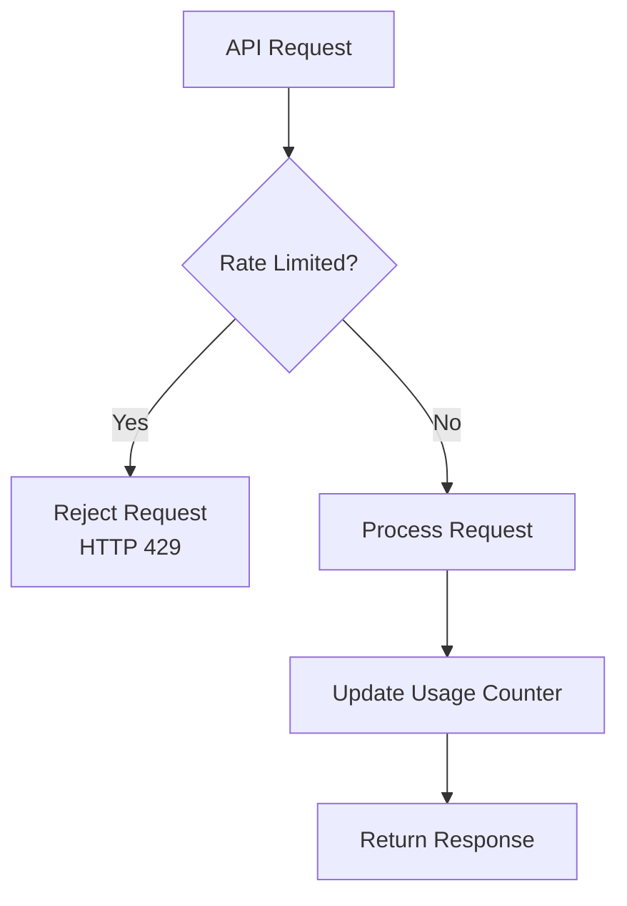
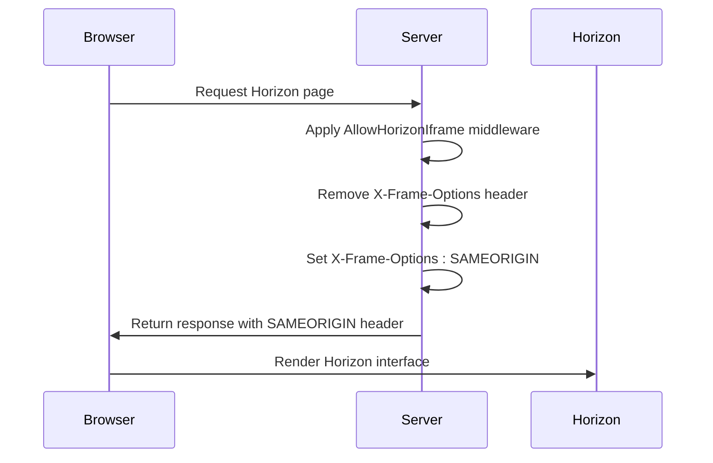

# Performance & Security Configuration

<cite>
**Referenced Files in This Document**   
- [performance.php](file://main/config/performance.php)
- [health.php](file://main/config/health.php)
- [logging.php](file://main/config/logging.php)
- [permission.php](file://main/config/permission.php)
- [google2fa.php](file://main/config/google2fa.php)
- [cors.php](file://main/config/cors.php)
- [session.php](file://main/config/session.php)
- [sanctum.php](file://main/config/sanctum.php)
- [app.php](file://main/config/app.php)
- [cache.php](file://main/config/cache.php)
- [AllowHorizonIframe.php](file://main/app/Http/Middleware/AllowHorizonIframe.php)
- [TwoFactorApiController.php](file://main/app/Http/Controllers/Api/User/TwoFactorApiController.php)
- [AiConnection.php](file://main/addons/ai-connection-addon/App/Models/AiConnection.php)
</cite>

## Table of Contents
1. [Performance Optimization](#performance-optimization)
2. [Health Check Configuration](#health-check-configuration)
3. [Logging and Error Reporting](#logging-and-error-reporting)
4. [Permission Management and Role-Based Access Control](#permission-management-and-role-based-access-control)
5. [Two-Factor Authentication Configuration](#two-factor-authentication-configuration)
6. [Security Headers and API Protection](#security-headers-and-api-protection)
7. [Best Practices for Securing Admin Interfaces and API Endpoints](#best-practices-for-securing-admin-interfaces-and-api-endpoints)

## Performance Optimization

The performance configuration in `performance.php` implements a comprehensive optimization strategy across multiple layers of the application. The configuration is structured into frontend, media, HTTP, cache, and database optimization sections.

Frontend optimization includes lazy loading for images (`lazy_images`), deferred script loading (`defer_scripts`), and optional asynchronous script loading (`async_scripts`). The configuration also supports resource preloading for fonts, styles, scripts, and DNS prefetching to improve perceived performance. Specific routes like admin interfaces are excluded from certain optimizations to maintain functionality.

Media optimization is enabled by default with automatic image compression and WebP format conversion. The system limits maximum image dimensions to 1920x1920 pixels to prevent oversized media from impacting performance. This ensures optimal balance between visual quality and loading speed.

HTTP-level optimizations include cache headers with a default TTL of 3600 seconds and ETag support for efficient client-side caching. The configuration implements path-based whitelisting and blacklisting, allowing public routes to be cached while excluding sensitive admin routes from caching mechanisms.

Caching strategies are implemented with a TTL map that defines specific expiration times for different cache entries (e.g., 300 seconds for user dashboard data). The pre-warming feature automatically loads specified routes (`home`, `admin.home`) into cache to ensure optimal performance on critical pages.

Database performance optimization includes automated table optimization and data pruning of records older than 14 days, helping maintain optimal database performance over time.

**Section sources**
- [performance.php](file://main/config/performance.php#L1-L71)

## Health Check Configuration

The health check system in `health.php` provides comprehensive monitoring capabilities for system uptime and component health verification. The configuration supports multiple result storage mechanisms, including Eloquent (database), cache, JSON file, and in-memory stores, allowing flexible deployment scenarios.

The notification system supports multiple channels including mail and Slack, with configurable throttling to prevent notification overload. By default, notifications are throttled to one per hour to avoid alert fatigue while ensuring critical issues are reported. The mail notification configuration includes customizable sender and recipient addresses, while Slack notifications require a webhook URL configured in environment variables.

The system integrates with Oh Dear monitoring service, allowing external monitoring of application health even during complete application outages. This provides an additional layer of reliability for uptime verification.

Specialized health checks are configured for Laravel Horizon and scheduled tasks, with optional heartbeat URLs that can be monitored externally. This ensures background processing systems remain operational and scheduled jobs execute as expected.

Security is maintained through an optional secret token requirement (`HEALTH_SECRET_TOKEN`) for accessing health check results, preventing unauthorized access to system health information.

The configuration also includes options for customizing the health check results page theme (light or dark mode) and controlling the behavior of skipped health checks.

**Section sources**
- [health.php](file://main/config/health.php#L1-L159)

## Logging and Error Reporting

The logging configuration in `logging.php` implements a flexible multi-channel logging strategy. The default log channel is configured as a stack that combines daily rotating logs with stderr output, providing both persistent storage and real-time monitoring capabilities.

The system supports multiple logging channels:
- **Single**: Writes to a single log file
- **Daily**: Creates daily rotating log files retained for 14 days
- **Slack**: Sends critical log messages to a Slack channel via webhook
- **Papertrail**: Integrates with Papertrail service for centralized log management
- **Syslog**: Uses system syslog for logging
- **Errorlog**: Uses PHP's error_log function
- **Null**: Discards log messages (useful for testing)

The stack channel combines multiple channels, allowing different types of log messages to be routed to appropriate destinations. The emergency channel ensures critical system errors are always logged regardless of other configuration settings.

Log levels follow standard severity levels from debug to emergency, with the Slack channel configured by default to only send critical and higher severity messages to prevent channel spam.

The configuration also includes a deprecations channel that can be configured to log PHP and library deprecation warnings, helping maintain code quality and prepare for future dependency updates.

**Section sources**
- [logging.php](file://main/config/logging.php#L1-L119)

## Permission Management and Role-Based Access Control

The permission system in `permission.php` implements a robust role-based access control (RBAC) framework. The configuration defines the models used for permissions and roles, with default implementations using Spatie's Permission package models.

The system uses a flexible database schema with configurable table names for roles, permissions, and their relationships. This allows integration with existing database schemas or customization to meet specific naming conventions.

Key security features include:
- Configurable cache expiration (24 hours by default) for permission data to balance performance and security
- Option to display required permission names in exception messages (disabled by default for security)
- Option to display required role names in exception messages (disabled by default for security)
- Support for teams functionality (disabled by default)
- Wildcard permission support (disabled by default for security)

The cache configuration ensures that permission changes are automatically reflected across the application while maintaining high performance through caching. The cache key and store are configurable, allowing integration with various caching backends.

The system supports custom gate integration, with the option to register permission check methods on Laravel's authorization gate. This enables seamless integration with Laravel's built-in authorization features.

**Section sources**
- [permission.php](file://main/config/permission.php#L1-L162)

## Two-Factor Authentication Configuration

Two-factor authentication is configured through `google2fa.php` with integration to Google Authenticator. The system is enabled by default but can be controlled via the `OTP_ENABLED` environment variable.

Key configuration options include:
- **Lifetime**: Configurable OTP lifetime (0 = eternal, default)
- **Keep Alive**: Renew lifetime at every request (enabled by default)
- **Window**: One Time Password window size (1, allowing some clock drift)
- **Forbid Old Passwords**: Prevent reuse of previous OTPs (disabled by default)
- **QR Code Backend**: SVG format for QR code generation

The configuration integrates with the application's authentication system through the `auth` binding and supports custom views for the 2FA verification process. The system stores the Google Authenticator secret in the `google2fa_secret` column of the login security table.

Error messages are customizable, with default messages for wrong OTP, empty OTP, and unknown errors. The system can be configured to throw exceptions on failure or fire events instead, controlled by the `OTP_THROW_EXCEPTION` environment variable.

The implementation is integrated with the `LoginSecurity` model and `TwoFactorApiController`, which handles API endpoints for managing 2FA settings, including enabling, disabling, and verifying two-factor authentication.

**Section sources**
- [google2fa.php](file://main/config/google2fa.php#L1-L86)
- [TwoFactorApiController.php](file://main/app/Http/Controllers/Api/User/TwoFactorApiController.php#L1-L200)

## Security Headers and API Protection

The application implements multiple security layers through various configuration files and middleware.

### CORS Configuration
The `cors.php` configuration enables cross-origin resource sharing for API routes and CSRF cookie endpoints. The configuration allows all methods, origins, and headers by default, which should be restricted in production environments. The configuration does not support credentials by default, preventing potential CSRF attacks through cross-origin requests.

### Session Security
The `session.php` configuration implements several security measures:
- **HTTP Only**: Session cookies are marked as HTTP only, preventing access via JavaScript
- **Secure Cookies**: Session cookies are configured to be secure (HTTPS only) when the `SESSION_SECURE_COOKIE` environment variable is set
- **SameSite Policy**: Cookies use the 'lax' SameSite policy to prevent CSRF attacks while maintaining usability
- **Session Lifetime**: Configurable session lifetime (120 minutes by default)
- **Session Encryption**: Optional session data encryption

### API Security
The `sanctum.php` configuration manages API authentication:
- **Stateful Domains**: Defines which domains can use stateful authentication
- **CSRF Protection**: Integrates with Laravel's CSRF protection middleware
- **Token Expiration**: Personal access tokens do not expire by default

### Rate Limiting
API rate limiting is implemented through the AI connection system, with configurable limits per minute and per day. The `AiConnection` model includes rate limiting functionality that checks usage against configured limits before processing requests.

**Diagram sources**
- [cors.php](file://main/config/cors.php#L1-L35)
- [session.php](file://main/config/session.php#L1-L202)
- [sanctum.php](file://main/config/sanctum.php#L1-L66)
- [AiConnection.php](file://main/addons/ai-connection-addon/App/Models/AiConnection.php#L250-L265)

**Section sources**
- [cors.php](file://main/config/cors.php#L1-L35)
- [session.php](file://main/config/session.php#L1-L202)
- [sanctum.php](file://main/config/sanctum.php#L1-L66)
- [AiConnection.php](file://main/addons/ai-connection-addon/App/Models/AiConnection.php#L250-L265)

## Best Practices for Securing Admin Interfaces and API Endpoints

The application implements several best practices for securing admin interfaces and API endpoints.

### Admin Interface Security
The `AllowHorizonIframe` middleware modifies X-Frame-Options headers to allow Horizon (Laravel's queue monitoring tool) to be embedded in iframes while maintaining security. The middleware specifically targets Horizon routes and sets X-Frame-Options to SAMEORIGIN, preventing clickjacking attacks while allowing legitimate iframe usage.

**Diagram sources**
- [AllowHorizonIframe.php](file://main/app/Http/Middleware/AllowHorizonIframe.php#L1-L29)

**Section sources**
- [AllowHorizonIframe.php](file://main/app/Http/Middleware/AllowHorizonIframe.php#L1-L29)

### API Endpoint Security
API endpoints are secured through multiple layers:
1. **Authentication**: Sanctum provides token-based authentication
2. **Rate Limiting**: AI connections implement rate limiting at the model level
3. **Input Validation**: Request validation ensures data integrity
4. **CSRF Protection**: Web UI interactions are protected against CSRF
5. **Role-Based Access Control**: Permissions system restricts access based on user roles

### Security Hardening Recommendations
Based on the current configuration, the following security hardening recommendations are suggested:

1. **Restrict CORS Configuration**: Limit allowed origins and methods in production
2. **Enable Session Encryption**: Set `encrypt` to true in session configuration
3. **Configure Proper Error Handling**: Ensure detailed error messages are not exposed in production
4. **Implement Proper Rate Limiting**: Extend rate limiting to all API endpoints
5. **Regular Security Audits**: Use the health check system to monitor security-related metrics
6. **Secure Headers**: Implement additional security headers like Content-Security-Policy
7. **Environment-Specific Configuration**: Ensure debug mode is disabled in production

The current configuration provides a solid foundation for security and performance, with room for further hardening based on specific deployment requirements and threat models.

**Section sources**
- [app.php](file://main/config/app.php#L1-L250)
- [cache.php](file://main/config/cache.php#L1-L111)
- [AllowHorizonIframe.php](file://main/app/Http/Middleware/AllowHorizonIframe.php#L1-L29)
- [AiConnection.php](file://main/addons/ai-connection-addon/App/Models/AiConnection.php#L250-L265)