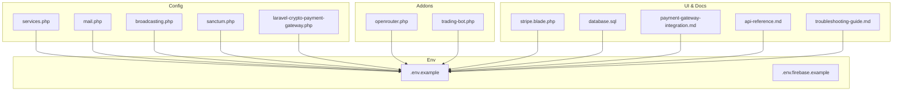
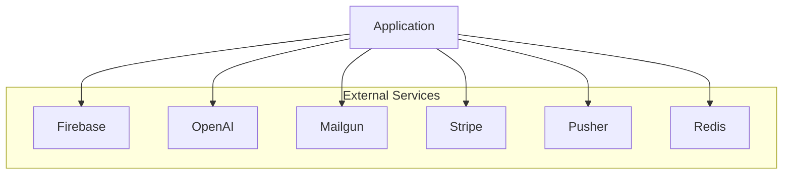
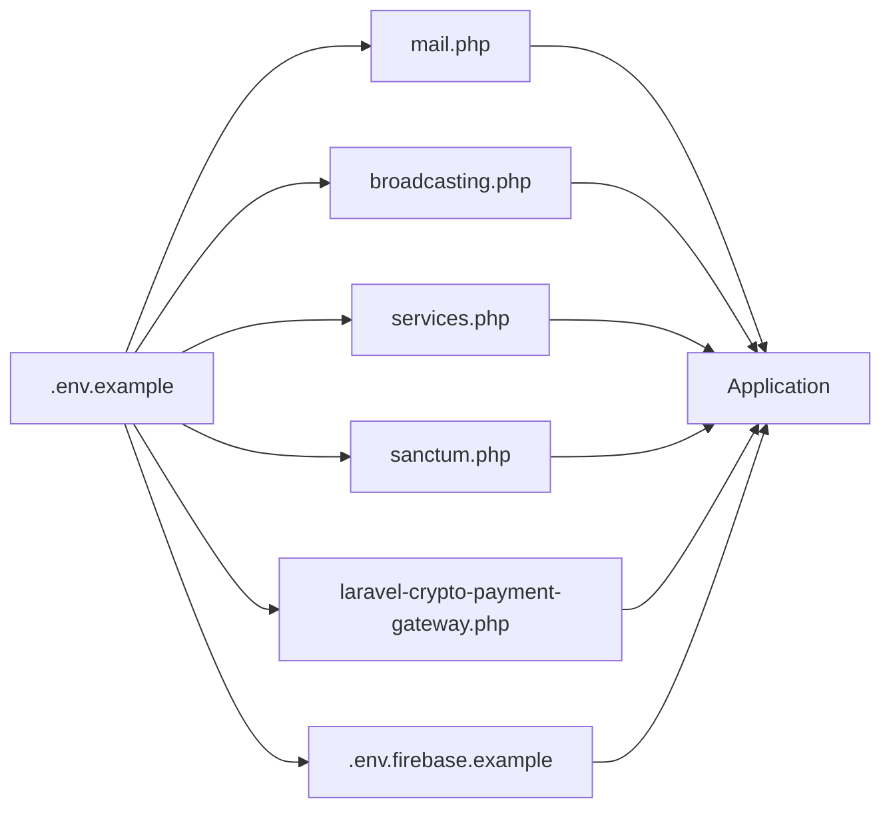

# Service Integration Configuration

<cite>
**Referenced Files in This Document**
- [services.php](file://main/config/services.php)
- [mail.php](file://main/config/mail.php)
- [broadcasting.php](file://main/config/broadcasting.php)
- [sanctum.php](file://main/config/sanctum.php)
- [laravel-crypto-payment-gateway.php](file://main/config/laravel-crypto-payment-gateway.php)
- [.env.example](file://main/.env.example)
- [.env.firebase.example](file://main/.env.firebase.example)
- [openrouter.php](file://main/addons/openrouter-integration-addon/config/openrouter.php)
- [SignalSourceController.php](file://main/addons/multi-channel-signal-addon/app/Http/Controllers/Backend/SignalSourceController.php)
- [TradingBotService.php](file://main/addons/multi-channel-signal-addon/app/Services/TradingBotService.php)
- [create.blade.php (backend signal-source)](file://main/addons/multi-channel-signal-addon/resources/views/backend/signal-source/create.blade.php)
- [create.blade.php (user signal-source)](file://main/addons/multi-channel-signal-addon/resources/views/user/signal-source/create.blade.php)
- [trading-bot.php](file://main/addons/trading-bot-signal-addon/config/trading-bot.php)
- [stripe.blade.php](file://main/resources/views/backend/gateway/stripe.blade.php)
- [database.sql](file://install/lib/database.sql)
- [payment-gateway-integration.md](file://docs/payment-gateway-integration.md)
- [api-reference.md](file://docs/api-reference.md)
- [troubleshooting-guide.md](file://docs/troubleshooting-guide.md)
</cite>

## Table of Contents
1. [Introduction](#introduction)
2. [Project Structure](#project-structure)
3. [Core Components](#core-components)
4. [Architecture Overview](#architecture-overview)
5. [Detailed Component Analysis](#detailed-component-analysis)
6. [Dependency Analysis](#dependency-analysis)
7. [Performance Considerations](#performance-considerations)
8. [Troubleshooting Guide](#troubleshooting-guide)
9. [Conclusion](#conclusion)
10. [Appendices](#appendices)

## Introduction
This document provides comprehensive guidance for configuring third-party service integrations across the platform. It covers:
- External services configuration (Firebase, OpenAI, Stripe, and others) in services.php
- Mail driver configuration (SMTP, Mailgun, SendGrid) in mail.php including encryption, port, and sender address settings
- Broadcasting drivers (Pusher, Redis) for real-time features in broadcasting.php
- Sanctum configuration for API token expiration and abilities
- Cryptocurrency and fiat payment gateway settings in laravel-crypto-payment-gateway.php
- Security guidelines for managing API keys and webhook endpoints

## Project Structure
The configuration files referenced in this document reside under the main/config directory and are complemented by environment examples and addon-specific configurations.

**Diagram sources**
- [services.php](file://main/config/services.php#L1-L55)
- [mail.php](file://main/config/mail.php#L1-L119)
- [broadcasting.php](file://main/config/broadcasting.php#L1-L65)
- [sanctum.php](file://main/config/sanctum.php#L1-L66)
- [laravel-crypto-payment-gateway.php](file://main/config/laravel-crypto-payment-gateway.php#L1-L212)
- [.env.example](file://main/.env.example#L1-L66)
- [.env.firebase.example](file://main/.env.firebase.example#L1-L8)
- [openrouter.php](file://main/addons/openrouter-integration-addon/config/openrouter.php#L1-L35)
- [trading-bot.php](file://main/addons/trading-bot-signal-addon/config/trading-bot.php#L1-L19)
- [stripe.blade.php](file://main/resources/views/backend/gateway/stripe.blade.php#L1-L46)
- [database.sql](file://install/lib/database.sql#L937-L941)
- [payment-gateway-integration.md](file://docs/payment-gateway-integration.md#L246-L283)
- [api-reference.md](file://docs/api-reference.md#L411-L467)
- [troubleshooting-guide.md](file://docs/troubleshooting-guide.md#L684-L764)

**Section sources**
- [services.php](file://main/config/services.php#L1-L55)
- [mail.php](file://main/config/mail.php#L1-L119)
- [broadcasting.php](file://main/config/broadcasting.php#L1-L65)
- [sanctum.php](file://main/config/sanctum.php#L1-L66)
- [laravel-crypto-payment-gateway.php](file://main/config/laravel-crypto-payment-gateway.php#L1-L212)
- [.env.example](file://main/.env.example#L1-L66)
- [.env.firebase.example](file://main/.env.firebase.example#L1-L8)
- [openrouter.php](file://main/addons/openrouter-integration-addon/config/openrouter.php#L1-L35)
- [trading-bot.php](file://main/addons/trading-bot-signal-addon/config/trading-bot.php#L1-L19)
- [stripe.blade.php](file://main/resources/views/backend/gateway/stripe.blade.php#L1-L46)
- [database.sql](file://install/lib/database.sql#L937-L941)
- [payment-gateway-integration.md](file://docs/payment-gateway-integration.md#L246-L283)
- [api-reference.md](file://docs/api-reference.md#L411-L467)
- [troubleshooting-guide.md](file://docs/troubleshooting-guide.md#L684-L764)

## Core Components
- Third-party services configuration (services.php): Defines credentials for Mailgun, Postmark, SES, Facebook, Google, Telegram Bot API, and OpenAI.
- Mail driver configuration (mail.php): Supports SMTP, SES, Mailgun, Postmark, Sendmail, Log, Array, and Failover drivers; global From address and Markdown settings.
- Broadcasting drivers (broadcasting.php): Supports Pusher, Ably, Redis, Log, and Null drivers; includes TLS and cluster options for Pusher.
- Sanctum configuration (sanctum.php): Controls stateful domains, guard, token expiration, and middleware.
- Cryptocurrency payment gateway (laravel-crypto-payment-gateway.php): Integrates with GoUrl.io for Bitcoin and altcoins, including IPN hook configuration and box template options.
- Environment examples (.env.example, .env.firebase.example): Provide baseline environment variables for mail, pusher, and Firebase.

**Section sources**
- [services.php](file://main/config/services.php#L1-L55)
- [mail.php](file://main/config/mail.php#L1-L119)
- [broadcasting.php](file://main/config/broadcasting.php#L1-L65)
- [sanctum.php](file://main/config/sanctum.php#L1-L66)
- [laravel-crypto-payment-gateway.php](file://main/config/laravel-crypto-payment-gateway.php#L1-L212)
- [.env.example](file://main/.env.example#L1-L66)
- [.env.firebase.example](file://main/.env.firebase.example#L1-L8)

## Architecture Overview
The integration architecture ties together configuration files, environment variables, and addon-specific settings to enable external services, real-time broadcasting, secure API tokens, and payment processing.

**Diagram sources**
- [services.php](file://main/config/services.php#L1-L55)
- [mail.php](file://main/config/mail.php#L1-L119)
- [broadcasting.php](file://main/config/broadcasting.php#L1-L65)
- [laravel-crypto-payment-gateway.php](file://main/config/laravel-crypto-payment-gateway.php#L1-L212)

## Detailed Component Analysis

### External Services Configuration (services.php)
- Mailgun: domain, secret, endpoint
- Postmark: token
- SES: key, secret, region
- OAuth providers: Facebook and Google with client IDs, secrets, and redirect URLs
- Telegram Bot API: token
- OpenAI: API key and model selection

Operational notes:
- Credentials are loaded from environment variables via env() helpers.
- Redirect URLs are constructed using APP_URL.

**Section sources**
- [services.php](file://main/config/services.php#L1-L55)
- [.env.example](file://main/.env.example#L1-L66)

### Mail Driver Configuration (mail.php)
Supported drivers:
- smtp, ses, mailgun, postmark, sendmail, log, array, failover

Key settings:
- Default mailer
- SMTP host, port, encryption (e.g., tls), username, password
- Global From address and name
- Markdown theme and component paths

Operational notes:
- Encryption and port are environment-driven.
- Failover driver allows fallback between smtp and log.

**Section sources**
- [mail.php](file://main/config/mail.php#L1-L119)
- [.env.example](file://main/.env.example#L1-L66)

### Broadcasting Drivers (broadcasting.php)
Default driver is environment-driven. Supported connections:
- pusher: key, secret, app_id, cluster, TLS
- ably: key
- redis: connection alias
- log and null

Operational notes:
- Pusher uses TLS and cluster settings.
- Redis connection references a named connection.

**Section sources**
- [broadcasting.php](file://main/config/broadcasting.php#L1-L65)
- [.env.example](file://main/.env.example#L1-L66)

### Sanctum Configuration (sanctum.php)
- Stateful domains: derived from SANCTUM_STATEFUL_DOMAINS and APP_URL
- Guard: defaults to web
- Expiration: null (tokens do not expire)
- Middleware: CSRF and cookie encryption

Operational notes:
- Token expiration is controlled by the expiration setting.
- Middleware integrates CSRF and cookie encryption.

**Section sources**
- [sanctum.php](file://main/config/sanctum.php#L1-L66)
- [.env.example](file://main/.env.example#L1-L66)

### Cryptocurrency Payment Gateway (laravel-crypto-payment-gateway.php)
- IPN hook target: configured via hook_ipn
- Default coin and box template
- Payment box entries for multiple cryptocurrencies with public/private keys and enabled flags
- User ID format, period, logo, language box, cancel button, and template options
- Affiliate key support

Operational notes:
- Keys are environment-driven per coin.
- IPN hook points to a static method in a service class.

**Section sources**
- [laravel-crypto-payment-gateway.php](file://main/config/laravel-crypto-payment-gateway.php#L1-L212)
- [.env.example](file://main/.env.example#L1-L66)

### Stripe Payment Gateway Integration
- Backend UI for Stripe credentials (publishable key, secret key, currency)
- Database fixture includes Stripe gateway parameters (client ID, client secret, webhook secret)
- Documentation outlines Stripe Checkout/Intent flow and webhook endpoint

Operational notes:
- Credentials are stored in gateway parameter JSON.
- Webhook secret is part of the documented Stripe configuration.

**Section sources**
- [stripe.blade.php](file://main/resources/views/backend/gateway/stripe.blade.php#L1-L46)
- [database.sql](file://install/lib/database.sql#L937-L941)
- [payment-gateway-integration.md](file://docs/payment-gateway-integration.md#L246-L283)

### Firebase Integration
- Firebase project ID and API key are environment-driven in the trading bot addon configuration.
- UI forms for signal sources include fields for Firebase project ID, credentials (JSON), and collection name.
- Backend and user controllers accept Firebase configuration and pass it to services.
- Service logic validates Firebase package installation and reads project ID and credentials to access Firestore.

Operational notes:
- Credentials are provided as JSON in the UI and stored in channel source configuration.
- Collection name defaults to signals.

**Section sources**
- [trading-bot.php](file://main/addons/trading-bot-signal-addon/config/trading-bot.php#L1-L19)
- [create.blade.php (backend signal-source)](file://main/addons/multi-channel-signal-addon/resources/views/backend/signal-source/create.blade.php#L140-L157)
- [create.blade.php (user signal-source)](file://main/addons/multi-channel-signal-addon/resources/views/user/signal-source/create.blade.php#L157-L170)
- [SignalSourceController.php](file://main/addons/multi-channel-signal-addon/app/Http/Controllers/Backend/SignalSourceController.php#L729-L739)
- [SignalSourceController.php](file://main/addons/multi-channel-signal-addon/app/Http/Controllers/User/SignalSourceController.php#L238-L246)
- [TradingBotService.php](file://main/addons/multi-channel-signal-addon/app/Services/TradingBotService.php#L26-L26)
- [TradingBotService.php](file://main/addons/multi-channel-signal-addon/app/Services/TradingBotService.php#L58-L67)
- [TradingBotService.php](file://main/addons/multi-channel-signal-addon/app/Services/TradingBotService.php#L187-L195)
- [TradingBotService.php](file://main/addons/multi-channel-signal-addon/app/Services/TradingBotService.php#L223-L228)
- [.env.firebase.example](file://main/.env.firebase.example#L1-L8)

### OpenAI Integration
- OpenAI key and model are configured in services.php.
- OpenRouter addon configuration defines API URL, endpoints, defaults, and optional site metadata.

Operational notes:
- OpenRouter configuration is environment-driven and does not require a key in .env.

**Section sources**
- [services.php](file://main/config/services.php#L49-L52)
- [openrouter.php](file://main/addons/openrouter-integration-addon/config/openrouter.php#L1-L35)

### Webhook Security Guidelines
- Signature verification examples are provided in the API reference.
- Multi-channel signal addon UI supports optional secret key for webhook verification.
- General security guidance includes validating and sanitizing parsed data, preventing SQL injection and XSS, rate limiting, optional IP whitelisting, and requiring HTTPS for webhook endpoints.

**Section sources**
- [api-reference.md](file://docs/api-reference.md#L411-L467)
- [create.blade.php (backend signal-source)](file://main/addons/multi-channel-signal-addon/resources/views/backend/signal-source/create.blade.php#L64-L80)
- [troubleshooting-guide.md](file://docs/troubleshooting-guide.md#L684-L764)

## Dependency Analysis
The configuration files depend on environment variables and are consumed by services and controllers across the application.

**Diagram sources**
- [.env.example](file://main/.env.example#L1-L66)
- [.env.firebase.example](file://main/.env.firebase.example#L1-L8)
- [mail.php](file://main/config/mail.php#L1-L119)
- [broadcasting.php](file://main/config/broadcasting.php#L1-L65)
- [services.php](file://main/config/services.php#L1-L55)
- [sanctum.php](file://main/config/sanctum.php#L1-L66)
- [laravel-crypto-payment-gateway.php](file://main/config/laravel-crypto-payment-gateway.php#L1-L212)

**Section sources**
- [.env.example](file://main/.env.example#L1-L66)
- [.env.firebase.example](file://main/.env.firebase.example#L1-L8)
- [mail.php](file://main/config/mail.php#L1-L119)
- [broadcasting.php](file://main/config/broadcasting.php#L1-L65)
- [services.php](file://main/config/services.php#L1-L55)
- [sanctum.php](file://main/config/sanctum.php#L1-L66)
- [laravel-crypto-payment-gateway.php](file://main/config/laravel-crypto-payment-gateway.php#L1-L212)

## Performance Considerations
- Broadcasting: Prefer Redis for scalable pub/sub messaging.
- Mail: Use SES or dedicated SMTP for throughput; consider failover configuration.
- Payments: Use queued jobs for heavy operations; cache frequently accessed model lists.
- Real-time: Enable TLS for Pusher; monitor cluster performance.

[No sources needed since this section provides general guidance]

## Troubleshooting Guide
Common areas to verify:
- Environment variables for mail, pusher, and Firebase
- Webhook endpoints for multi-channel signals and payment callbacks
- Stripe webhook secret and endpoint configuration
- Sanctum stateful domains and CSRF middleware

**Section sources**
- [troubleshooting-guide.md](file://docs/troubleshooting-guide.md#L684-L764)
- [payment-gateway-integration.md](file://docs/payment-gateway-integration.md#L246-L283)
- [api-reference.md](file://docs/api-reference.md#L411-L467)

## Conclusion
This document consolidates configuration and operational guidance for integrating external services, enabling secure and scalable real-time communication, robust mail delivery, flexible broadcasting, and reliable payment processing. Adhering to the environment-driven configuration and security practices outlined here ensures predictable behavior across environments.

[No sources needed since this section summarizes without analyzing specific files]

## Appendices

### Appendix A: Environment Variables Reference
- Mail: MAIL_MAILER, MAIL_HOST, MAIL_PORT, MAIL_ENCRYPTION, MAIL_USERNAME, MAIL_PASSWORD, MAIL_FROM_ADDRESS, MAIL_FROM_NAME
- Pusher: PUSHER_APP_ID, PUSHER_APP_KEY, PUSHER_APP_SECRET, PUSHER_APP_CLUSTER
- Firebase: FIREBASE_PROJECT_ID, FIREBASE_API_KEY, FIREBASE_AUTH_TOKENS_JSON
- Stripe: Stripe publishable and secret keys, webhook secret (as documented)
- Crypto gateway: GOURL_* keys and affiliate key

**Section sources**
- [.env.example](file://main/.env.example#L1-L66)
- [.env.firebase.example](file://main/.env.firebase.example#L1-L8)
- [payment-gateway-integration.md](file://docs/payment-gateway-integration.md#L246-L283)