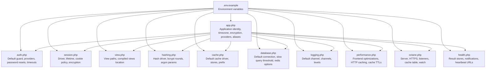
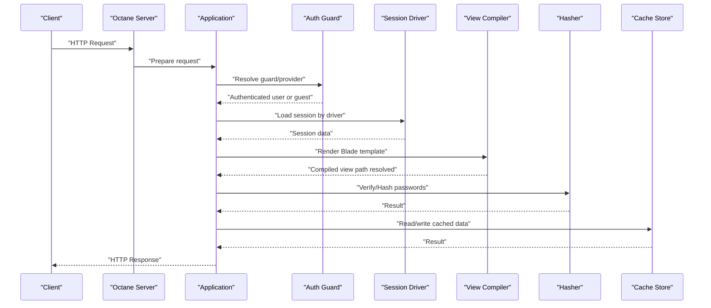
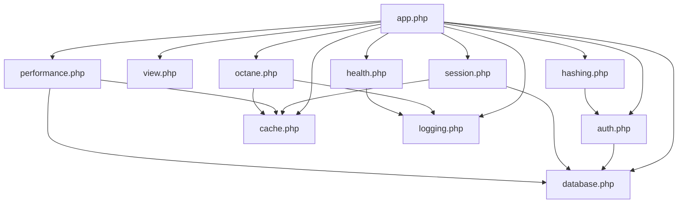

# System Settings Configuration

<cite>
**Referenced Files in This Document**
- [app.php](file://main/config/app.php)
- [auth.php](file://main/config/auth.php)
- [session.php](file://main/config/session.php)
- [view.php](file://main/config/view.php)
- [hashing.php](file://main/config/hashing.php)
- [.env.example](file://main/.env.example)
- [cache.php](file://main/config/cache.php)
- [database.php](file://main/config/database.php)
- [logging.php](file://main/config/logging.php)
- [performance.php](file://main/config/performance.php)
- [octane.php](file://main/config/octane.php)
- [health.php](file://main/config/health.php)
</cite>

## Table of Contents
1. [Introduction](#introduction)
2. [Project Structure](#project-structure)
3. [Core Components](#core-components)
4. [Architecture Overview](#architecture-overview)
5. [Detailed Component Analysis](#detailed-component-analysis)
6. [Dependency Analysis](#dependency-analysis)
7. [Performance Considerations](#performance-considerations)
8. [Troubleshooting Guide](#troubleshooting-guide)
9. [Conclusion](#conclusion)

## Introduction
This document explains the core system settings that govern application behavior, authentication, sessions, view compilation, password hashing, and related security and performance options. It focuses on the primary configuration files under main/config and demonstrates how environment variables influence runtime behavior. Practical customization examples are included to help you optimize performance and strengthen security posture.

## Project Structure
The system settings are primarily defined in the main/config directory and influenced by environment variables in .env.example. The following diagram shows how key configuration files relate to each other and to environment variables.

**Diagram sources**
- [app.php](file://main/config/app.php#L1-L250)
- [auth.php](file://main/config/auth.php#L1-L126)
- [session.php](file://main/config/session.php#L1-L202)
- [view.php](file://main/config/view.php#L1-L45)
- [hashing.php](file://main/config/hashing.php#L1-L53)
- [.env.example](file://main/.env.example#L1-L66)
- [cache.php](file://main/config/cache.php#L1-L111)
- [database.php](file://main/config/database.php#L1-L207)
- [logging.php](file://main/config/logging.php#L1-L119)
- [performance.php](file://main/config/performance.php#L1-L71)
- [octane.php](file://main/config/octane.php#L1-L222)
- [health.php](file://main/config/health.php#L1-L159)

**Section sources**
- [app.php](file://main/config/app.php#L1-L250)
- [.env.example](file://main/.env.example#L1-L66)

## Core Components
This section documents the primary application-level settings and their implications.

- Application name, environment, debug mode, URL, and timezone
  - Name and environment are read from environment variables and used across the framework.
  - Debug mode toggles detailed error reporting.
  - URL is used for CLI and route generation.
  - Timezone sets the default for date/time functions.
  - Locale and fallback locale define internationalization defaults.
  - Encryption key and cipher define secure string handling.
  - Providers and aliases register framework and application services and facades.

- Authentication defaults, guards, providers, password resets, and timeouts
  - Defaults specify the default guard and password broker.
  - Guards define how users are authenticated (e.g., web, admin) and backed by providers.
  - Providers define how user records are retrieved (Eloquent models).
  - Password reset configuration includes token expiration and throttling.
  - Password confirmation timeout controls how long a confirmed session remains valid.

- Session storage drivers, lifetime, encryption, and cookie security
  - Driver selection influences persistence and scalability (file, database, redis, etc.).
  - Lifetime controls idle expiration.
  - Encrypt toggles transparent encryption of session payloads.
  - Cookie policy includes name, path, domain, secure flag, httpOnly, and sameSite.

- View compilation paths and caching
  - View paths define where Blade templates are searched.
  - Compiled view path defines where compiled templates are stored; the configuration ensures the directory exists.

- Password hashing algorithms and cost factors
  - Driver selects bcrypt, argon, or argon2id.
  - Bcrypt rounds control CPU/memory cost.
  - Argon parameters tune memory, threads, and time cost.

Practical customization examples:
- Improve security posture
  - Set APP_DEBUG=false in production.
  - Set APP_KEY to a secure 32-character value.
  - Use HTTPS-only cookies by setting SESSION_SECURE_COOKIE=true.
  - Choose a robust hashing driver and increase rounds for bcrypt or adjust argon parameters.
  - Select a distributed session driver (e.g., redis) for multi-instance deployments.

- Optimize performance
  - Increase BCRYPT_ROUNDS moderately to balance security and CPU cost.
  - Enable compiled views and ensure VIEW_COMPILED_PATH points to a fast filesystem.
  - Use a cache-backed session driver (e.g., redis) and set appropriate SESSION_LIFETIME.
  - Configure frontend optimizations in performance.php for images and script delivery.

**Section sources**
- [app.php](file://main/config/app.php#L21-L248)
- [auth.php](file://main/config/auth.php#L18-L124)
- [session.php](file://main/config/session.php#L21-L200)
- [view.php](file://main/config/view.php#L16-L42)
- [hashing.php](file://main/config/hashing.php#L18-L52)
- [.env.example](file://main/.env.example#L1-L66)

## Architecture Overview
The configuration system ties environment variables to runtime behavior across multiple subsystems. The following sequence illustrates how a request lifecycle uses these settings.

**Diagram sources**
- [octane.php](file://main/config/octane.php#L39-L53)
- [app.php](file://main/config/app.php#L143-L189)
- [auth.php](file://main/config/auth.php#L18-L50)
- [session.php](file://main/config/session.php#L21-L63)
- [view.php](file://main/config/view.php#L16-L42)
- [hashing.php](file://main/config/hashing.php#L18-L52)
- [cache.php](file://main/config/cache.php#L18-L28)

## Detailed Component Analysis

### Application Identity and Security (app.php)
Key settings:
- name, env, debug, url, asset_url
- timezone, locale, fallback_locale, faker_locale
- key (APP_KEY), cipher
- autoloaded providers and aliases

Implications:
- name and url affect CLI-generated URLs and notifications.
- debug impacts error visibility and should be disabled in production.
- APP_KEY must be set to a secure, random 32-character value; otherwise encrypted strings are unsafe.
- cipher defines encryption algorithm for encrypted cookies and tokens.

Customization tips:
- Set APP_KEY during deployment and rotate periodically.
- Align timezone with operational region.
- Keep providers minimal to reduce boot overhead.

**Section sources**
- [app.php](file://main/config/app.php#L21-L131)
- [.env.example](file://main/.env.example#L1-L10)

### Authentication Configuration (auth.php)
Key settings:
- defaults: guard, passwords
- guards: web, admin (session driver, provider)
- providers: users, admins (Eloquent models)
- passwords: users, admins (provider, table, expire, throttle)
- password_timeout

Implications:
- Separate guards enable distinct authentication flows for users and admins.
- Token expiration and throttling protect against brute-force password resets.
- Password confirmation timeout reduces risk of unauthorized sensitive actions.

Customization tips:
- Define additional guards for API or admin scopes.
- Adjust expire/throttle for compliance or usability.
- Use dedicated password brokers for multi-tenant or segmented user types.

**Section sources**
- [auth.php](file://main/config/auth.php#L18-L124)

### Session Storage and Security (session.php)
Key settings:
- driver, lifetime, expire_on_close
- encrypt
- files, connection, table, store
- lottery
- cookie, path, domain, secure, http_only, same_site

Implications:
- Driver choice affects scalability and persistence (file vs. database vs. redis).
- Lifetime controls idle session expiration; shorter lifetimes improve security.
- secure, http_only, same_site mitigate cookie theft and CSRF.
- encrypt protects session payload integrity and confidentiality.

Customization tips:
- Use redis for clustered deployments; set SESSION_CONNECTION and SESSION_STORE accordingly.
- Enable SESSION_SECURE_COOKIE behind HTTPS; set SESSION_DOMAIN for subdomain sharing.
- Tune SESSION_LIFETIME to balance UX and security.

**Section sources**
- [session.php](file://main/config/session.php#L21-L200)
- [.env.example](file://main/.env.example#L20-L24)

### View Compilation and Caching (view.php)
Key settings:
- paths: where Blade templates are discovered
- compiled: directory for compiled templates; ensures existence

Implications:
- Compiled views improve rendering performance by avoiding repeated parsing.
- Ensuring the compiled path exists prevents runtime errors.

Customization tips:
- Place compiled views on fast storage (e.g., tmpfs) for high-throughput environments.
- Keep paths minimal to reduce template search overhead.

**Section sources**
- [view.php](file://main/config/view.php#L16-L42)

### Password Hashing Algorithms and Cost Factors (hashing.php)
Key settings:
- driver: bcrypt, argon, argon2id
- bcrypt: rounds
- argon: memory, threads, time

Implications:
- bcrypt rounds control computational cost; higher rounds increase security at the expense of CPU.
- argon parameters tune memory hardness and CPU cost trade-offs.

Customization tips:
- Increase BCRYPT_ROUNDS gradually and measure impact on login latency.
- For argon, adjust memory and time to meet target cost while staying within acceptable latency.

**Section sources**
- [hashing.php](file://main/config/hashing.php#L18-L52)
- [.env.example](file://main/.env.example#L1-L66)

### Supporting Configuration Files

#### Cache Configuration (cache.php)
- default: CACHE_DRIVER
- stores: apc, array, database, file, memcached, redis, dynamodb, octane, null
- prefix: CACHE_PREFIX derived from APP_NAME

Implications:
- Distributed cache backends (redis, memcached) improve performance and consistency.
- Prefix avoids key collisions across applications.

Customization tips:
- Use redis for production; set CACHE_PREFIX to a unique value.
- For in-memory stores, consider serialize=false for performance.

**Section sources**
- [cache.php](file://main/config/cache.php#L18-L109)

#### Database Configuration (database.php)
- default: DB_CONNECTION
- connections: sqlite, mysql, pgsql, sqlsrv
- slow_query_threshold, enable_query_monitoring
- redis client, options, and per-database pools

Implications:
- Prefix for MySQL can be customized; strictness and charset/collation affect data integrity.
- Slow query monitoring helps identify performance bottlenecks.

Customization tips:
- Enable DB_ENABLE_QUERY_MONITORING in staging to catch regressions.
- Use separate redis databases for default/cache/queue to isolate traffic.

**Section sources**
- [database.php](file://main/config/database.php#L18-L206)

#### Logging Configuration (logging.php)
- default: LOG_CHANNEL
- channels: stack, single, daily, slack, papertrail, stderr, syslog, errorlog, null, emergency

Implications:
- Stack channels combine multiple handlers for comprehensive logging.
- Daily rotation and retention reduce log volume.

Customization tips:
- Route critical events to slack or papertrail in production.
- Use emergency channel for fail-safe logging.

**Section sources**
- [logging.php](file://main/config/logging.php#L20-L118)

#### Performance Optimizations (performance.php)
- frontend: lazy images, defer scripts, async scripts, preload, exclusions
- media: compression, webp conversion, max dimensions
- http: cache headers, etag, whitelist/blacklist
- cache: TTL map, prewarm routes
- database: prune days, optimize tables

Implications:
- Frontend optimizations reduce bandwidth and render latency.
- HTTP caching and ETags improve repeat visit performance.
- Database maintenance keeps tables healthy.

Customization tips:
- Enable preload for critical fonts/styles/scripts.
- Use cache TTL map to tune hot paths; prewarm admin routes.

**Section sources**
- [performance.php](file://main/config/performance.php#L1-L71)

#### Octane Configuration (octane.php)
- server: roadrunner or swoole
- https: force HTTPS link generation
- listeners: lifecycle hooks for requests/tasks/ticks
- cache: Swoole table size
- tables: additional shared tables
- watch: files/dirs to watch
- garbage: memory threshold for GC
- max_execution_time: request timeout

Implications:
- Swoole improves throughput for long-lived processes.
- Watch list triggers hot reload during development.

Customization tips:
- Set OCTANE_SERVER=swoole in production; adjust cache.rows and cache.bytes for shared data.
- Configure listeners to disconnect DBs and flush uploads between requests.

**Section sources**
- [octane.php](file://main/config/octane.php#L39-L221)

#### Health Monitoring (health.php)
- result_stores: database, cache, JSON file, in-memory
- notifications: mail, slack, throttling
- oh_dear_endpoint: external monitoring integration
- horizon and schedule heartbeat URLs
- theme, silence_health_queue_job, json_results_failure_status, secret_token

Implications:
- Centralized health checks and notifications improve observability.
- Heartbeat URLs detect downtime in queues and scheduled tasks.

Customization tips:
- Enable notifications and set HEALTH_SLACK_WEBHOOK_URL for alerts.
- Configure OH_DEAR_HEALTH_CHECK_SECRET and URL for external monitoring.

**Section sources**
- [health.php](file://main/config/health.php#L1-L159)

## Dependency Analysis
Configuration interdependencies:
- app.php registers providers and aliases that influence auth, session, view, hashing, cache, and database behavior.
- auth.php depends on providers/models defined in app.php and database.php.
- session.php integrates with cache.php and database.php depending on driver selection.
- hashing.php is consumed by auth and password reset flows.
- performance.php complements cache.php and database.php for runtime optimization.
- octane.php interacts with cache.php and logging.php for performance and diagnostics.
- health.php relies on notifications and external integrations.

**Diagram sources**
- [app.php](file://main/config/app.php#L143-L189)
- [auth.php](file://main/config/auth.php#L18-L50)
- [session.php](file://main/config/session.php#L21-L63)
- [view.php](file://main/config/view.php#L16-L42)
- [hashing.php](file://main/config/hashing.php#L18-L52)
- [cache.php](file://main/config/cache.php#L18-L109)
- [database.php](file://main/config/database.php#L18-L206)
- [logging.php](file://main/config/logging.php#L20-L118)
- [performance.php](file://main/config/performance.php#L1-L71)
- [octane.php](file://main/config/octane.php#L39-L221)
- [health.php](file://main/config/health.php#L1-L159)

**Section sources**
- [app.php](file://main/config/app.php#L143-L189)
- [auth.php](file://main/config/auth.php#L18-L50)
- [session.php](file://main/config/session.php#L21-L63)
- [cache.php](file://main/config/cache.php#L18-L109)
- [database.php](file://main/config/database.php#L18-L206)
- [logging.php](file://main/config/logging.php#L20-L118)
- [performance.php](file://main/config/performance.php#L1-L71)
- [octane.php](file://main/config/octane.php#L39-L221)
- [health.php](file://main/config/health.php#L1-L159)

## Performance Considerations
- Hashing cost
  - Increase BCRYPT_ROUNDS or adjust argon parameters to meet security targets; measure login latency and scale accordingly.
- Sessions
  - Prefer redis or memcached for horizontal scaling; tune SESSION_LIFETIME to balance security and UX.
- Views
  - Ensure VIEW_COMPILED_PATH points to fast storage; avoid frequent template changes in production.
- Caching
  - Use redis for cache and session; set CACHE_PREFIX to avoid collisions; enable cache TTL map for hot paths.
- Database
  - Enable slow query monitoring; prune old data and optimize tables regularly.
- Octane
  - Use Swoole in production; configure cache tables and garbage thresholds; watch only necessary files in development.

[No sources needed since this section provides general guidance]

## Troubleshooting Guide
Common issues and remedies:
- Encrypted cookies or tokens unreadable
  - Ensure APP_KEY is set and consistent across instances.
  - Verify cipher matches expectations.

- Unexpected logout or session loss
  - Check SESSION_DRIVER and SESSION_LIFETIME.
  - Confirm secure, httpOnly, and sameSite cookie settings align with deployment.

- Slow login or password reset
  - Review BCRYPT_ROUNDS or argon parameters; balance security and latency.

- View compilation errors
  - Verify VIEW_COMPILED_PATH exists and is writable.

- Cache misses or collisions
  - Set CACHE_PREFIX to a unique value; confirm cache driver connectivity.

- Health check failures
  - Configure notifications and heartbeat URLs; validate secrets and endpoints.

**Section sources**
- [app.php](file://main/config/app.php#L127-L131)
- [session.php](file://main/config/session.php#L169-L200)
- [hashing.php](file://main/config/hashing.php#L31-L52)
- [view.php](file://main/config/view.php#L31-L42)
- [cache.php](file://main/config/cache.php#L107-L109)
- [health.php](file://main/config/health.php#L34-L81)

## Conclusion
System settings form the foundation of application behavior, security, and performance. By carefully selecting drivers, tuning hashing costs, enforcing secure cookie policies, and leveraging caching and Octane, you can achieve a robust, scalable, and secure deployment. Regularly review and adjust these settings based on environment, traffic patterns, and compliance requirements.