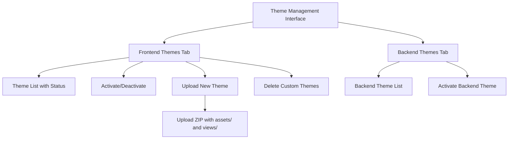
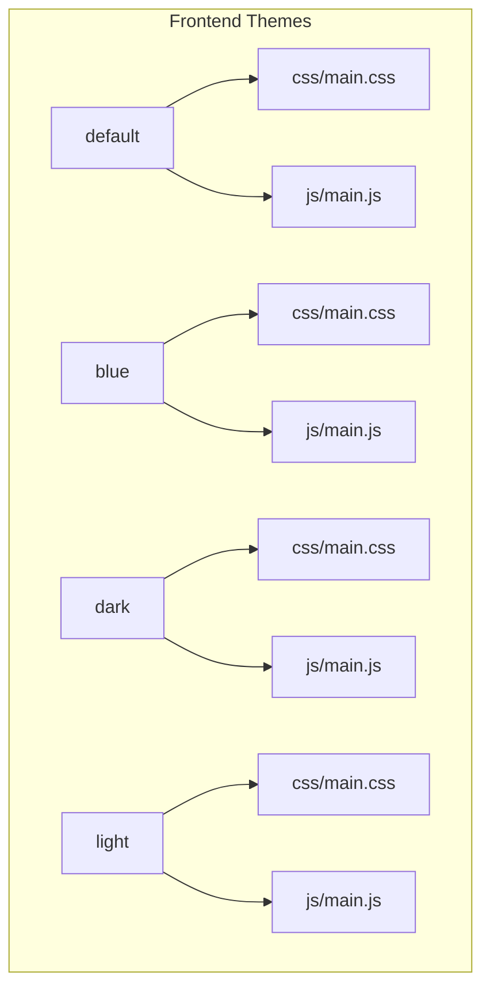
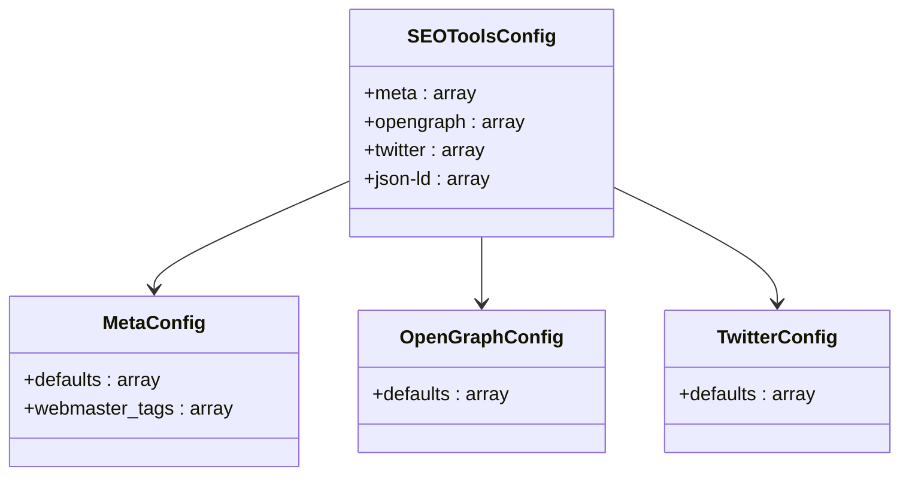
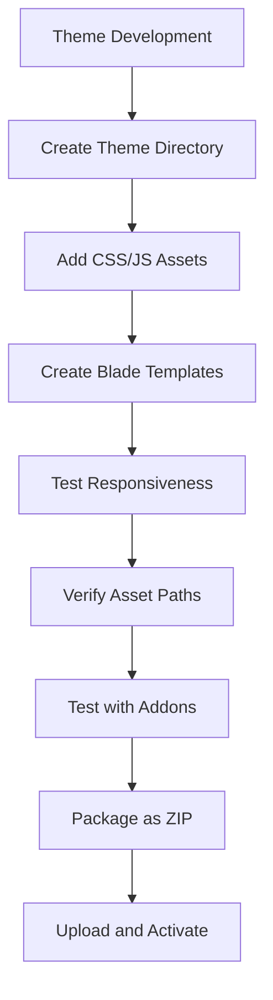

# Theme & Customization Configuration

<cite>
**Referenced Files in This Document**   
- [app.php](file://main/config/app.php)
- [view.php](file://main/config/view.php)
- [seotools.php](file://main/config/seotools.php)
- [theme.blade.php](file://main/resources/views/backend/setting/theme.blade.php)
- [theme-development.md](file://docs/theme-development.md)
</cite>

## Table of Contents
1. [Introduction](#introduction)
2. [Theme Management Interface](#theme-management-interface)
3. [Frontend Theme Configuration](#frontend-theme-configuration)
4. [Backend Theme Configuration](#backend-theme-configuration)
5. [SEO Tools Configuration](#seo-tools-configuration)
6. [Asset Compilation and Versioning](#asset-compilation-and-versioning)
7. [Theme Customization and Development](#theme-customization-and-development)
8. [Multi-Tenant Theme Management](#multi-tenant-theme-management)
9. [Conclusion](#conclusion)

## Introduction
This document provides comprehensive guidance on theme management and customization for the application. It covers configuration settings for frontend and backend themes, SEO tools, asset compilation, and versioning. The system supports multiple theme options for both frontend and backend interfaces, allowing for extensive customization and branding capabilities. The documentation also addresses multi-tenant theme management and dynamic theme switching features.

**Section sources**
- [theme.blade.php](file://main/resources/views/backend/setting/theme.blade.php)

## Theme Management Interface
The theme management interface provides administrators with comprehensive control over both frontend and backend themes through a tabbed interface. The system distinguishes between frontend themes (user-facing) and backend themes (admin panel) with separate management sections.

The interface includes functionality for:
- Activating and deactivating themes
- Uploading new theme packages via ZIP files
- Downloading theme templates
- Previewing themes
- Deleting custom themes
- Deactivating all frontend themes simultaneously

Themes are displayed with their metadata including display name, version, author, description, and status (activated/inactive). Built-in themes are marked accordingly and cannot be deleted. The interface supports both built-in themes and custom uploaded themes, providing a consistent management experience.



**Diagram sources**
- [theme.blade.php](file://main/resources/views/backend/setting/theme.blade.php)

**Section sources**
- [theme.blade.php](file://main/resources/views/backend/setting/theme.blade.php)

## Frontend Theme Configuration
Frontend theme selection is managed through the application's configuration system. The system supports multiple frontend themes including blue, dark, light, and default themes, each with their own asset structure and styling.

The theme configuration is primarily handled through the app.php configuration file, which defines the active theme and related settings. Themes are organized in the asset/frontend/ directory with each theme having its own subdirectory containing CSS, JavaScript, and other assets.

Theme variables and colors can be customized through configuration files and CSS overrides. The system uses Laravel's configuration system to manage theme settings, allowing for environment-specific theme configurations.

The available frontend themes include:
- **default**: The standard theme with neutral styling
- **blue**: A theme with blue accent colors
- **dark**: A dark mode theme for low-light environments
- **light**: A light-themed interface with high contrast



**Diagram sources**
- [app.php](file://main/config/app.php)
- [theme-development.md](file://docs/theme-development.md)

**Section sources**
- [app.php](file://main/config/app.php)
- [theme-development.md](file://docs/theme-development.md)

## Backend Theme Configuration
Backend theme management allows administrators to customize the appearance of the admin panel with different theme options. The system supports multiple backend themes including dark, materialize, and premium themes.

Backend themes are configured similarly to frontend themes but are specifically designed for the administrative interface. The configuration is stored in the database and can be updated through the theme management interface.

The backend theme system includes:
- **dark**: A dark mode theme for the admin panel
- **materialize**: A theme based on Material Design principles
- **premium**: An enhanced theme with additional styling and features

Administrators can switch between backend themes through the theme management interface, with the selected theme being applied immediately to the admin panel. The system stores the active backend theme in the configurations table with the backend_theme field.

**Section sources**
- [theme.blade.php](file://main/resources/views/backend/setting/theme.blade.php)
- [app.php](file://main/config/app.php)

## SEO Tools Configuration
SEO tools are configured through the seotools.php configuration file, which provides comprehensive settings for meta tags, Open Graph, and Twitter cards. The system uses the artesaos/seotools package to manage SEO metadata across the application.

The SEO configuration includes three main sections:

### Meta Configuration
```php
'meta' => [
    'defaults' => [
        'title' => "It's Over 9000!", 
        'description' => 'For those who helped create the Genki Dama',
        'separator' => ' - ',
        'keywords' => [],
        'canonical' => false,
        'robots' => false,
    ],
    'webmaster_tags' => [
        'google' => null,
        'bing' => null,
        'alexa' => null,
        'pinterest' => null,
        'yandex' => null,
        'norton' => null,
    ],
]
```

### Open Graph Configuration
```php
'opengraph' => [
    'defaults' => [
        'title' => 'Over 9000 Thousand!',
        'description' => 'For those who helped create the Genki Dama',
        'url' => false,
        'type' => false,
        'site_name' => false,
        'images' => [],
    ],
]
```

### Twitter Card Configuration
```php
'twitter' => [
    'defaults' => [
        //'card' => 'summary',
        //'site' => '@LuizVinicius73',
    ],
]
```

The configuration allows for setting default values that are applied site-wide, with the ability to override these values on specific pages. Webmaster verification tags can be added for various search engines and social platforms.



**Diagram sources**
- [seotools.php](file://main/config/seotools.php)

**Section sources**
- [seotools.php](file://main/config/seotools.php)

## Asset Compilation and Versioning
The asset system manages frontend theme loading through a structured directory organization and asset compilation process. Assets are organized by theme in the asset/frontend/ directory, with each theme having its own CSS and JavaScript files.

The system uses Laravel's asset helper functions to reference theme assets in views, ensuring proper path resolution:

```blade
<link href="{{ asset('asset/frontend/my-theme-name/css/main.css') }}" rel="stylesheet">
<script src="{{ asset('asset/frontend/my-theme-name/js/main.js') }}"></script>

```

For dynamic theme name resolution, the system provides helper functions:

```php
$themeName = config('app.theme', 'default');
$cssPath = asset("asset/frontend/{$themeName}/css/main.css");
```

Or using the Helper class:

```php
Helper::cssLib('frontend', 'main.css'); // Automatically uses active theme
```

The asset compilation process follows these steps:
1. Theme assets are stored in theme-specific directories
2. The active theme is determined by configuration
3. Asset paths are resolved using the active theme name
4. Assets are served with proper caching headers
5. Versioning is handled through Laravel's mix system or manual version parameters

The system also supports asset versioning to prevent caching issues when updating themes. This ensures that users receive the latest version of theme assets after updates.

**Section sources**
- [theme-development.md](file://docs/theme-development.md)
- [view.php](file://main/config/view.php)

## Theme Customization and Development
Theme customization and development follows a structured approach with clear guidelines for creating and modifying themes. The system provides a theme development guide that outlines the requirements and best practices for theme creation.

### Theme Structure Requirements
Themes must follow a specific directory structure:
- assets/css/ - Theme CSS files
- assets/js/ - Theme JavaScript files
- assets/images/ - Theme images and graphics
- views/ - Blade template files

When creating a new theme, developers should:
1. Create a new directory in asset/frontend/
2. Add CSS and JavaScript files in the appropriate subdirectories
3. Create Blade templates in the views/ directory
4. Ensure proper naming conventions (alphanumeric with hyphens or underscores only)

### Customization Options
Themes can be customized through:
- CSS overrides for styling changes
- JavaScript enhancements for interactive elements
- Blade template modifications for layout changes
- Color variable adjustments in CSS files

The system supports theme inheritance, allowing custom themes to extend base themes while overriding specific elements. This enables developers to create variations of existing themes without duplicating all assets.

### Development Best Practices
- Test themes on multiple devices and screen sizes
- Verify all asset paths are correct
- Ensure responsive design works across breakpoints
- Test with all addon views to ensure compatibility
- Validate that theme works with both light and dark mode settings



**Diagram sources**
- [theme-development.md](file://docs/theme-development.md)

**Section sources**
- [theme-development.md](file://docs/theme-development.md)

## Multi-Tenant Theme Management
The system supports multi-tenant theme management through its flexible configuration system. While the current implementation focuses on single-instance theme management, the architecture allows for extension to support multiple tenants with different theme requirements.

The theme management system provides the foundation for multi-tenant scenarios by:
- Separating theme assets from application logic
- Using configuration-driven theme selection
- Supporting multiple theme options simultaneously
- Providing an API for theme activation and deactivation

Dynamic theme switching capabilities are implemented through the theme management interface, allowing administrators to change themes without code modifications. The system stores theme preferences in the database, enabling persistence across sessions.

For future multi-tenant implementations, the system could be extended to:
- Assign different themes to different user groups
- Support tenant-specific branding
- Implement theme inheritance across tenants
- Provide tenant-level theme customization options

The current architecture with its separation of concerns and configuration-driven approach makes it well-suited for evolving into a full multi-tenant theme management system.

**Section sources**
- [theme.blade.php](file://main/resources/views/backend/setting/theme.blade.php)
- [app.php](file://main/config/app.php)

## Conclusion
The theme and customization system provides a comprehensive solution for managing frontend and backend themes, SEO tools, and asset compilation. The configuration-driven approach allows for flexible theme management without requiring code changes, making it accessible to administrators and developers alike.

Key features of the system include:
- Support for multiple frontend and backend themes
- Comprehensive SEO tools configuration
- Structured asset compilation and versioning
- Easy theme customization and development
- Admin interface for theme management
- Potential for multi-tenant extensions

The system's modular design and clear documentation make it easy to create and manage custom themes while maintaining consistency across the application. By following the provided guidelines and best practices, developers can create professional-looking themes that enhance the user experience.