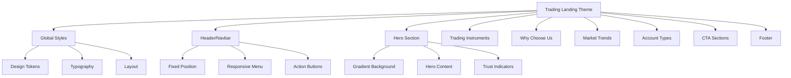
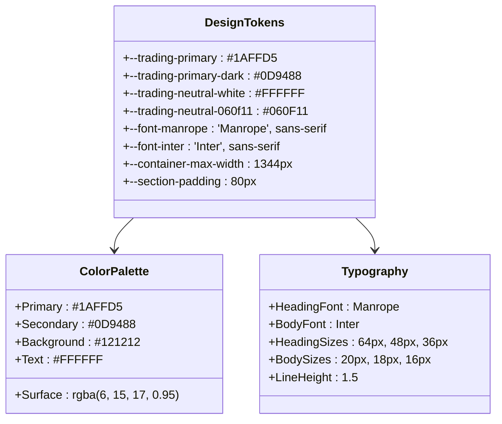
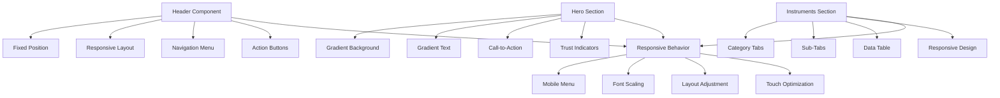
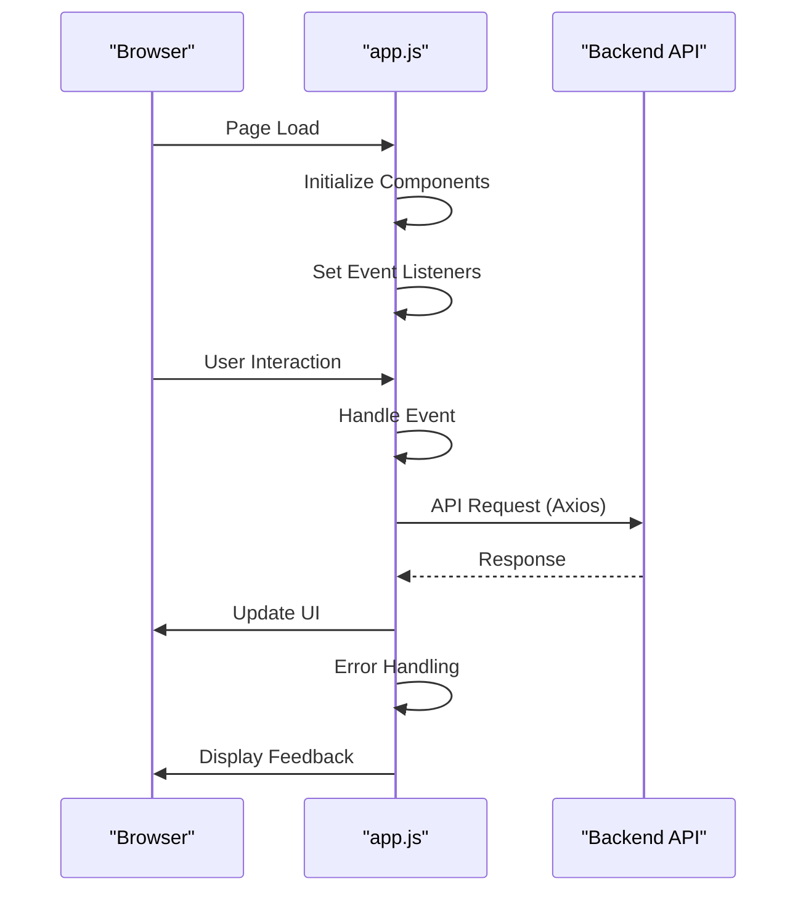
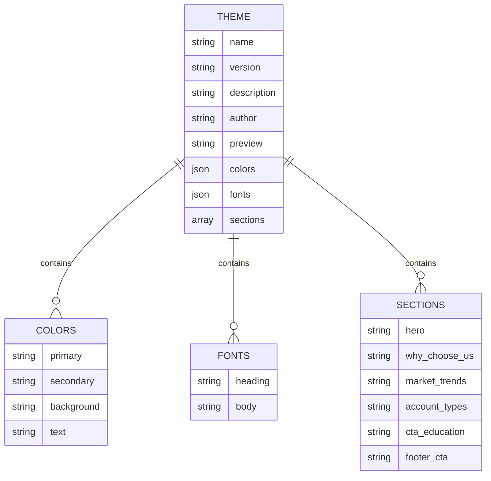
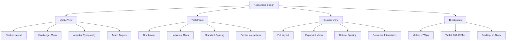

# Trading Landing Theme

<cite>
**Referenced Files in This Document**   
- [trading-landing.css](file://main/resources/css/trading-landing.css)
- [app.js](file://main/public/js/app.js)
- [theme.json](file://main/resources/views/frontend/trading-v1/theme.json)
</cite>

## Table of Contents
1. [Introduction](#introduction)
2. [Theme Structure](#theme-structure)
3. [Design Tokens and Styling](#design-tokens-and-styling)
4. [Core Components](#core-components)
5. [JavaScript Functionality](#javascript-functionality)
6. [Theme Configuration](#theme-configuration)
7. [Responsive Design Implementation](#responsive-design-implementation)
8. [Conclusion](#conclusion)

## Introduction
The Trading Landing Theme is a modern, high-performance frontend theme designed for financial trading platforms. Built with a focus on user engagement and conversion optimization, this theme implements a sleek, professional design language that emphasizes trust, performance, and accessibility. The theme follows contemporary web design principles with a dark mode aesthetic optimized for financial applications, featuring gradient overlays, glass-morphism effects, and smooth animations.

The implementation leverages modern CSS techniques including CSS variables for design tokens, flexbox and grid layouts, and responsive breakpoints. The theme is structured to support a comprehensive trading platform landing page with sections for hero content, trading instruments, account types, educational resources, and call-to-action elements.

**Section sources**
- [trading-landing.css](file://main/resources/css/trading-landing.css#L1-L2948)
- [theme.json](file://main/resources/views/frontend/trading-v1/theme.json#L1-L27)

## Theme Structure
The Trading Landing Theme follows a modular structure with clear separation between design tokens, layout components, and interactive elements. The theme is organized into distinct sections that correspond to typical landing page components for a trading platform.

The theme structure is defined in the theme.json configuration file, which specifies the available sections including hero, why-choose-us, market-trends, account-types, cta-education, and footer-cta. This modular approach allows for flexible content arrangement while maintaining design consistency across the platform.

The CSS architecture follows a component-based approach with dedicated styling for each major section of the landing page. The theme utilizes a mobile-first responsive design strategy with breakpoints defined for tablet and desktop views.

**Diagram sources**
- [trading-landing.css](file://main/resources/css/trading-landing.css#L6-L800)
- [theme.json](file://main/resources/views/frontend/trading-v1/theme.json#L1-L27)

**Section sources**
- [trading-landing.css](file://main/resources/css/trading-landing.css#L1-L2948)
- [theme.json](file://main/resources/views/frontend/trading-v1/theme.json#L1-L27)

## Design Tokens and Styling
The Trading Landing Theme implements a comprehensive design token system using CSS custom properties (variables) to ensure design consistency and ease of maintenance. The design tokens are defined in the :root selector and include color palettes, typography settings, and spacing values.

The color scheme is specifically tailored for a financial trading application, featuring a primary teal color (#1AFFD5) that conveys trust and professionalism, paired with dark background tones (#121212, #060F11) that reduce eye strain during extended trading sessions. The design incorporates glass-morphism effects through the use of backdrop-filter blur effects and semi-transparent backgrounds.

Typography is handled through a combination of Google Fonts, with Manrope used for headings and Inter for body text, providing excellent readability and a modern aesthetic. The theme implements a comprehensive spacing system with consistent padding and margin values across all components.

**Diagram sources**
- [trading-landing.css](file://main/resources/css/trading-landing.css#L9-L29)

**Section sources**
- [trading-landing.css](file://main/resources/css/trading-landing.css#L9-L2948)

## Core Components
The Trading Landing Theme consists of several key components that work together to create a cohesive user experience. Each component is designed with both aesthetic appeal and functional performance in mind.

The header component implements a fixed-position navigation bar with a responsive design that adapts to different screen sizes. It features a semi-transparent background with backdrop blur effects, creating a glass-morphism aesthetic that overlays content while maintaining readability. The navigation includes action buttons for user login and account creation, positioned for optimal conversion.

The hero section is designed as a high-impact visual component that immediately communicates the platform's value proposition. It features a gradient background with light effects, a prominent heading with gradient text, and a clear call-to-action button. The section includes trust indicators with user avatars and partner logos to establish credibility.

The trading instruments section presents financial data in a tabular format with a modern, dark-themed design. It includes category tabs for filtering different instrument types and sub-tabs for additional filtering options. The table implementation uses CSS grid for responsive layout and includes proper spacing and typography for data readability.

**Diagram sources**
- [trading-landing.css](file://main/resources/css/trading-landing.css#L75-L608)
- [trading-landing.css](file://main/resources/css/trading-landing.css#L612-L800)

**Section sources**
- [trading-landing.css](file://main/resources/css/trading-landing.css#L75-L608)
- [trading-landing.css](file://main/resources/css/trading-landing.css#L612-L800)

## JavaScript Functionality
The Trading Landing Theme integrates with the main application JavaScript bundle to provide interactive functionality. The JavaScript implementation includes event handling for responsive navigation, form interactions, and dynamic content loading.

The theme leverages the Axios HTTP client for API communications, enabling seamless integration with backend services for user authentication, data retrieval, and form submissions. The JavaScript architecture follows a modular pattern with proper error handling and cancellation support for API requests.

The theme's JavaScript functionality focuses on enhancing user experience through smooth transitions, form validation, and responsive behavior. The implementation includes support for progressive enhancement, ensuring core functionality remains available even when JavaScript is disabled.

**Diagram sources**
- [app.js](file://main/public/js/app.js#L1-L800)

**Section sources**
- [app.js](file://main/public/js/app.js#L1-L800)

## Theme Configuration
The Trading Landing Theme is configured through a JSON configuration file that defines the theme's metadata, design properties, and structural components. The configuration follows a standardized format that allows for easy theme management and switching.

The theme.json file contains essential information including the theme name, version, description, author, and preview image. It also defines the color palette, typography settings, and the list of available sections that can be included in the landing page.

This configuration-driven approach enables non-technical users to manage theme settings through the platform's admin interface while providing developers with a clear structure for theme customization and extension.

**Diagram sources**
- [theme.json](file://main/resources/views/frontend/trading-v1/theme.json#L1-L27)

**Section sources**
- [theme.json](file://main/resources/views/frontend/trading-v1/theme.json#L1-L27)

## Responsive Design Implementation
The Trading Landing Theme implements a comprehensive responsive design strategy that ensures optimal user experience across all device sizes. The responsive implementation uses a mobile-first approach with breakpoints defined for tablet and desktop views.

The theme's CSS includes media queries that adjust layout, typography, and spacing based on screen size. On mobile devices, the navigation transforms into a hamburger menu, content sections stack vertically, and font sizes are adjusted for better readability on smaller screens.

The responsive design also considers touch interactions, with appropriately sized tap targets and gesture support. The implementation ensures that all interactive elements remain accessible and usable on touch devices while maintaining the visual integrity of the design.

**Diagram sources**
- [trading-landing.css](file://main/resources/css/trading-landing.css#L55-L59)
- [trading-landing.css](file://main/resources/css/trading-landing.css#L589-L607)

**Section sources**
- [trading-landing.css](file://main/resources/css/trading-landing.css#L55-L607)

## Conclusion
The Trading Landing Theme represents a modern, professional design solution for financial trading platforms. Its implementation combines aesthetic appeal with functional performance, creating a user experience that builds trust and encourages engagement.

The theme's modular architecture, comprehensive design tokens, and responsive implementation make it highly maintainable and adaptable to various trading platform requirements. The integration of modern CSS techniques and JavaScript functionality ensures a smooth, interactive experience across all devices.

By following established design principles and leveraging contemporary web technologies, the Trading Landing Theme provides a solid foundation for a successful trading platform that can effectively communicate its value proposition and convert visitors into users.