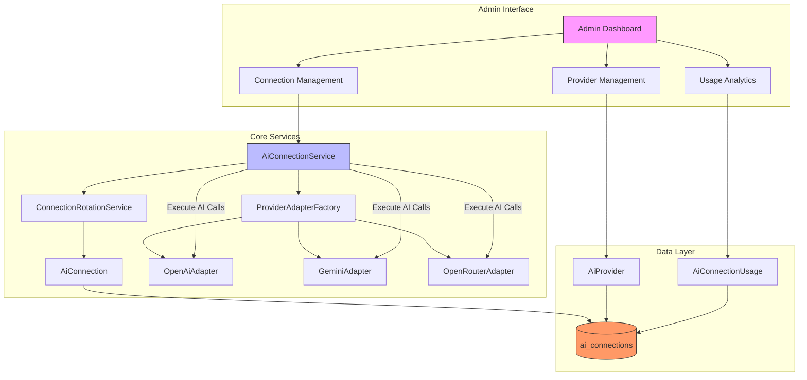
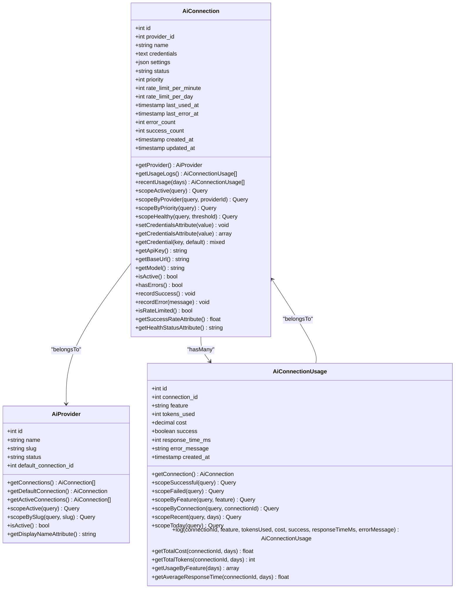
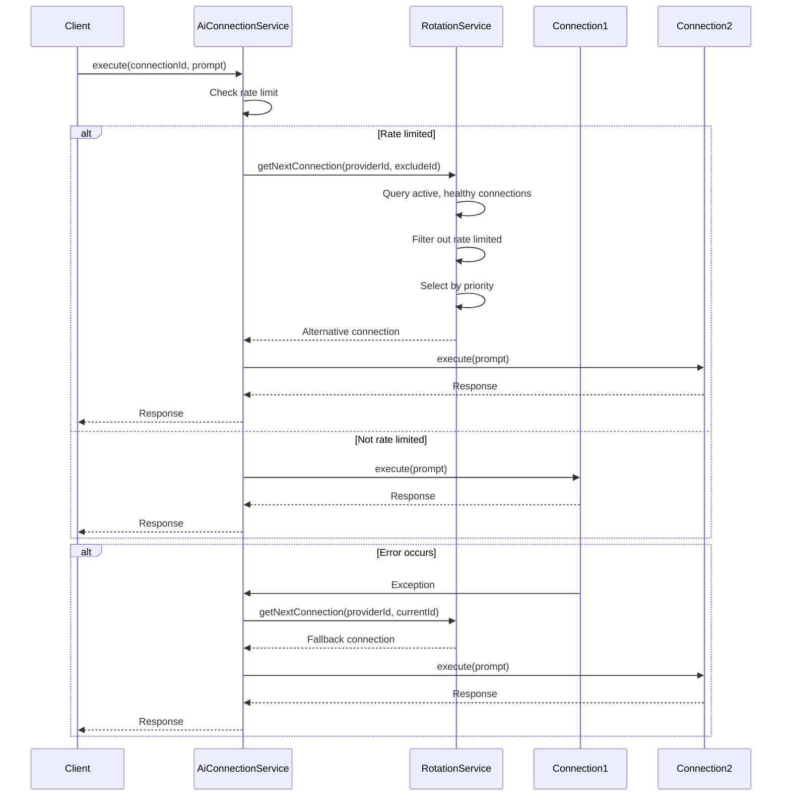
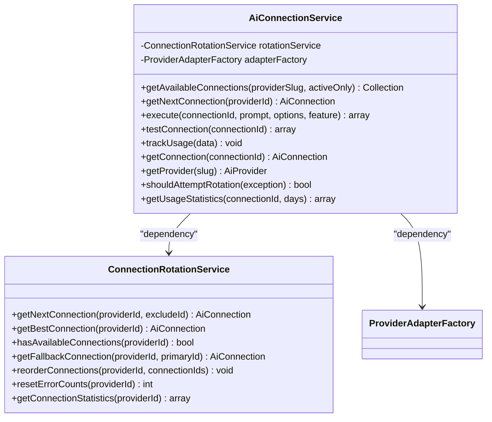
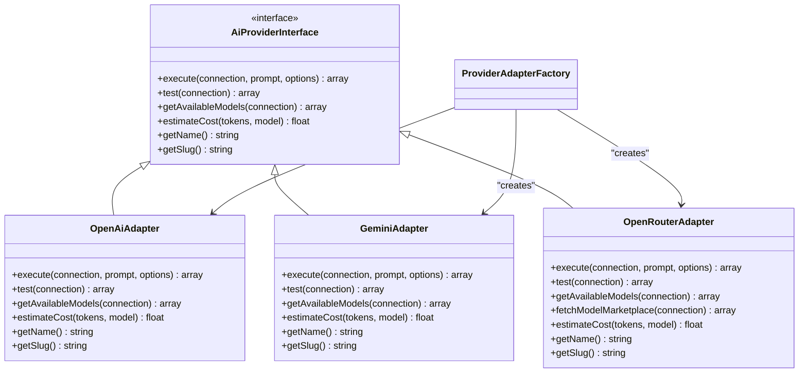
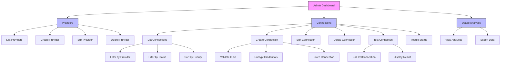
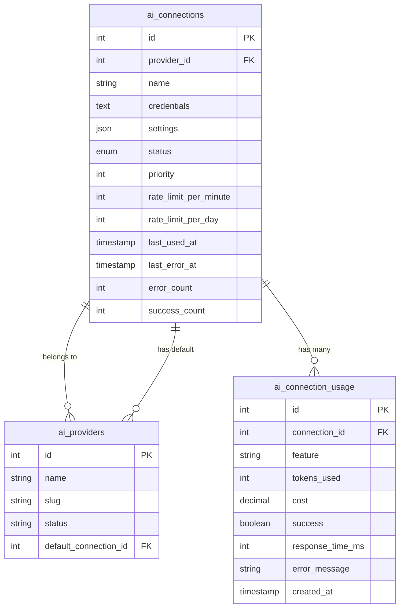
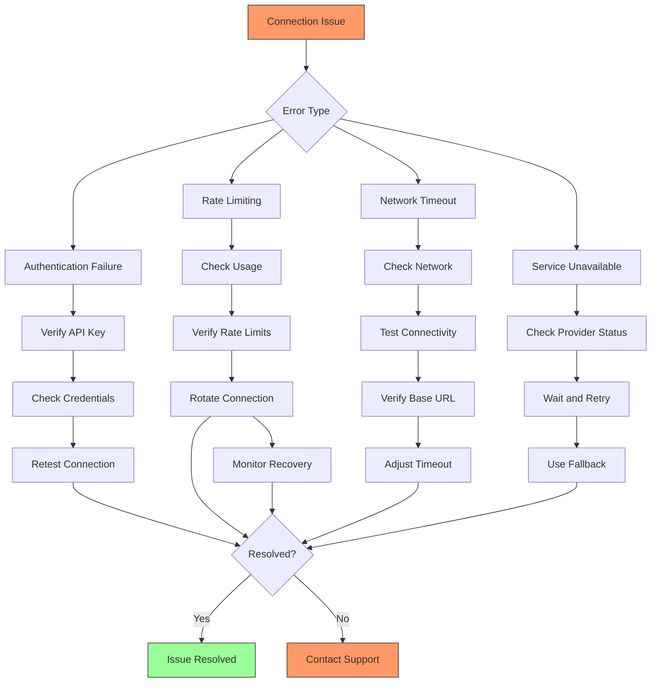

# AI Connection Management

<cite>
**Referenced Files in This Document**   
- [AiConnection.php](file://main/addons/ai-connection-addon/App/Models/AiConnection.php)
- [AiConnectionService.php](file://main/addons/ai-connection-addon/App/Services/AiConnectionService.php)
- [ConnectionRotationService.php](file://main/addons/ai-connection-addon/App/Services/ConnectionRotationService.php)
- [OpenAiAdapter.php](file://main/addons/ai-connection-addon/App/Providers/OpenAiAdapter.php)
- [GeminiAdapter.php](file://main/addons/ai-connection-addon/App/Providers/GeminiAdapter.php)
- [OpenRouterAdapter.php](file://main/addons/ai-connection-addon/App/Providers/OpenRouterAdapter.php)
- [AiProvider.php](file://main/addons/ai-connection-addon/App/Models/AiProvider.php)
- [AiConnectionUsage.php](file://main/addons/ai-connection-addon/App/Models/AiConnectionUsage.php)
- [ConnectionController.php](file://main/addons/ai-connection-addon/App/Http/Controllers/Backend/ConnectionController.php)
- [ProviderController.php](file://main/addons/ai-connection-addon/App/Http/Controllers/Backend/ProviderController.php)
- [UsageAnalyticsController.php](file://main/addons/ai-connection-addon/App/Http/Controllers/Backend/UsageAnalyticsController.php)
- [create_ai_connections_table.php](file://main/addons/ai-connection-addon/database/migrations/2025_12_03_100001_create_ai_connections_table.php)
- [create_ai_providers_table.php](file://main/addons/ai-connection-addon/database/migrations/2025_12_03_100000_create_ai_providers_table.php)
- [create_ai_connection_usage_table.php](file://main/addons/ai-connection-addon/database/migrations/2025_12_03_100002_create_ai_connection_usage_table.php)
- [add_default_connection_foreign_key.php](file://main/addons/ai-connection-addon/database/migrations/2025_12_03_100003_add_default_connection_foreign_key.php)
- [ProviderAdapterFactory.php](file://main/addons/ai-connection-addon/App/Services/ProviderAdapterFactory.php)
- [AiProviderInterface.php](file://main/addons/ai-connection-addon/App/Contracts/AiProviderInterface.php)
- [admin.php](file://main/addons/ai-connection-addon/routes/admin.php)
</cite>

## Table of Contents
1. [Introduction](#introduction)
2. [Architecture Overview](#architecture-overview)
3. [Core Components](#core-components)
4. [AiConnection Model Architecture](#aiconnection-model-architecture)
5. [Connection Pooling and Rotation](#connection-pooling-and-rotation)
6. [Credential Encryption and Security](#credential-encryption-and-security)
7. [AiConnectionService Methods](#aiconnectionservice-methods)
8. [Provider Integration and Adapters](#provider-integration-and-adapters)
9. [Admin Interface Management](#admin-interface-management)
10. [Configuration Options](#configuration-options)
11. [Troubleshooting Guide](#troubleshooting-guide)
12. [Conclusion](#conclusion)

## Introduction

The AI Connection Management system provides a centralized solution for handling AI provider connections in the application. This comprehensive system enables administrators to manage multiple AI service providers, configure connection settings, monitor usage, and ensure reliable AI service availability through sophisticated failover and rotation mechanisms. The system is designed to support various AI providers including OpenAI, Google Gemini, and OpenRouter, with extensible architecture for future provider integration.

The implementation follows Laravel best practices and leverages the framework's built-in encryption for secure credential storage. The system includes robust health monitoring, usage analytics, and automated failover capabilities to ensure high availability of AI services. This documentation provides a detailed overview of the architecture, components, and operational aspects of the AI connection management system.

**Section sources**
- [AiConnection.php](file://main/addons/ai-connection-addon/App/Models/AiConnection.php#L1-L296)
- [AiConnectionService.php](file://main/addons/ai-connection-addon/App/Services/AiConnectionService.php#L1-L310)

## Architecture Overview

The AI Connection Management system follows a modular architecture with clear separation of concerns. The system consists of several interconnected components that work together to provide reliable AI service connectivity.



**Diagram sources**
- [AiConnectionService.php](file://main/addons/ai-connection-addon/App/Services/AiConnectionService.php#L1-L310)
- [AiConnection.php](file://main/addons/ai-connection-addon/App/Models/AiConnection.php#L1-L296)
- [AiProvider.php](file://main/addons/ai-connection-addon/App/Models/AiProvider.php#L1-L82)

## Core Components

The AI Connection Management system consists of several core components that work together to provide a robust and reliable connection handling solution. These components include the AiConnection model, AiConnectionService, ConnectionRotationService, provider adapters, and the admin interface controllers.

The system is designed with extensibility in mind, allowing for easy addition of new AI providers through the adapter pattern. Each component has a specific responsibility, following the single responsibility principle. The AiConnection model handles data persistence and business logic related to individual connections, while the AiConnectionService orchestrates the overall connection management process.

The architecture supports multiple concurrent connections to the same provider, enabling load balancing and failover capabilities. Connection health is continuously monitored, and usage statistics are tracked for cost management and performance analysis. The system also provides comprehensive error handling and retry mechanisms to ensure service availability.

**Section sources**
- [AiConnection.php](file://main/addons/ai-connection-addon/App/Models/AiConnection.php#L1-L296)
- [AiConnectionService.php](file://main/addons/ai-connection-addon/App/Services/AiConnectionService.php#L1-L310)
- [ConnectionRotationService.php](file://main/addons/ai-connection-addon/App/Services/ConnectionRotationService.php#L1-L165)

## AiConnection Model Architecture

The AiConnection model represents an individual connection to an AI provider and contains all the necessary information to establish and maintain that connection. The model is designed with security, reliability, and performance in mind.



**Diagram sources**
- [AiConnection.php](file://main/addons/ai-connection-addon/App/Models/AiConnection.php#L1-L296)
- [AiProvider.php](file://main/addons/ai-connection-addon/App/Models/AiProvider.php#L1-L82)
- [AiConnectionUsage.php](file://main/addons/ai-connection-addon/App/Models/AiConnectionUsage.php#L1-L187)

**Section sources**
- [AiConnection.php](file://main/addons/ai-connection-addon/App/Models/AiConnection.php#L1-L296)
- [create_ai_connections_table.php](file://main/addons/ai-connection-addon/database/migrations/2025_12_03_100001_create_ai_connections_table.php#L1-L47)

## Connection Pooling and Rotation

The connection pooling and rotation system provides intelligent load balancing and failover capabilities for AI provider connections. The ConnectionRotationService implements a priority-based rotation algorithm that selects the most appropriate connection based on health status, priority, and current load.



**Diagram sources**
- [AiConnectionService.php](file://main/addons/ai-connection-addon/App/Services/AiConnectionService.php#L1-L310)
- [ConnectionRotationService.php](file://main/addons/ai-connection-addon/App/Services/ConnectionRotationService.php#L1-L165)

**Section sources**
- [ConnectionRotationService.php](file://main/addons/ai-connection-addon/App/Services/ConnectionRotationService.php#L1-L165)
- [AiConnectionService.php](file://main/addons/ai-connection-addon/App/Services/AiConnectionService.php#L1-L310)

## Credential Encryption and Security

The system implements robust security measures for storing and handling AI provider credentials. All credentials are encrypted using Laravel's built-in encryption service before being stored in the database, ensuring that sensitive information is protected at rest.

```mermaid
flowchart TD
A[Raw Credentials] --> B{Is array?}
B --> |Yes| C[JSON Encode]
B --> |No| D[Use as is]
C --> E[Laravel Encrypt]
D --> E
E --> F[Store in database]
G[Retrieve from database] --> H[Laravel Decrypt]
H --> I{JSON Decode successful?}
I --> |Yes| J[Return array]
I --> |No| K{Is string?}
K --> |Yes| L[Return {'api_key': string}]
K --> |No| M[Return empty array]
J --> N[Use in API calls]
L --> N
M --> N
```

**Diagram sources**
- [AiConnection.php](file://main/addons/ai-connection-addon/App/Models/AiConnection.php#L1-L296)

**Section sources**
- [AiConnection.php](file://main/addons/ai-connection-addon/App/Models/AiConnection.php#L103-L147)

## AiConnectionService Methods

The AiConnectionService class provides the primary interface for interacting with AI connections. It orchestrates the connection management process, including execution of AI calls, connection testing, usage tracking, and failover handling.



**Diagram sources**
- [AiConnectionService.php](file://main/addons/ai-connection-addon/App/Services/AiConnectionService.php#L1-L310)
- [ConnectionRotationService.php](file://main/addons/ai-connection-addon/App/Services/ConnectionRotationService.php#L1-L165)

**Section sources**
- [AiConnectionService.php](file://main/addons/ai-connection-addon/App/Services/AiConnectionService.php#L1-L310)

## Provider Integration and Adapters

The system uses an adapter pattern to integrate with different AI providers, allowing for consistent interaction with various services while accommodating their unique requirements. Each provider has a dedicated adapter that implements the AiProviderInterface contract.



**Diagram sources**
- [AiProviderInterface.php](file://main/addons/ai-connection-addon/App/Contracts/AiProviderInterface.php#L1-L59)
- [OpenAiAdapter.php](file://main/addons/ai-connection-addon/App/Providers/OpenAiAdapter.php#L1-L159)
- [GeminiAdapter.php](file://main/addons/ai-connection-addon/App/Providers/GeminiAdapter.php#L1-L162)
- [OpenRouterAdapter.php](file://main/addons/ai-connection-addon/App/Providers/OpenRouterAdapter.php#L1-L220)
- [ProviderAdapterFactory.php](file://main/addons/ai-connection-addon/App/Services/ProviderAdapterFactory.php#L1-L68)

**Section sources**
- [OpenAiAdapter.php](file://main/addons/ai-connection-addon/App/Providers/OpenAiAdapter.php#L1-L159)
- [GeminiAdapter.php](file://main/addons/ai-connection-addon/App/Providers/GeminiAdapter.php#L1-L162)
- [OpenRouterAdapter.php](file://main/addons/ai-connection-addon/App/Providers/OpenRouterAdapter.php#L1-L220)

## Admin Interface Management

The admin interface provides a comprehensive set of tools for managing AI connections and providers. The interface is accessible through dedicated routes and controllers that handle all CRUD operations and connection testing.



**Diagram sources**
- [admin.php](file://main/addons/ai-connection-addon/routes/admin.php#L1-L46)
- [ConnectionController.php](file://main/addons/ai-connection-addon/App/Http/Controllers/Backend/ConnectionController.php#L1-L189)
- [ProviderController.php](file://main/addons/ai-connection-addon/App/Http/Controllers/Backend/ProviderController.php)

**Section sources**
- [ConnectionController.php](file://main/addons/ai-connection-addon/App/Http/Controllers/Backend/ConnectionController.php#L1-L189)
- [admin.php](file://main/addons/ai-connection-addon/routes/admin.php#L1-L46)

## Configuration Options

The AI connection system supports a comprehensive set of configuration options that allow fine-tuning of connection behavior, performance, and reliability. These options are stored in the connection's settings field as a JSON object.



**Diagram sources**
- [create_ai_connections_table.php](file://main/addons/ai-connection-addon/database/migrations/2025_12_03_100001_create_ai_connections_table.php#L1-L47)
- [create_ai_providers_table.php](file://main/addons/ai-connection-addon/database/migrations/2025_12_03_100000_create_ai_providers_table.php)
- [create_ai_connection_usage_table.php](file://main/addons/ai-connection-addon/database/migrations/2025_12_03_100002_create_ai_connection_usage_table.php)

**Section sources**
- [AiConnection.php](file://main/addons/ai-connection-addon/App/Models/AiConnection.php#L1-L296)
- [AiProvider.php](file://main/addons/ai-connection-addon/App/Models/AiProvider.php#L1-L82)

## Troubleshooting Guide

This section provides guidance for diagnosing and resolving common issues with AI connections. The system includes comprehensive logging and monitoring capabilities to assist with troubleshooting.



**Diagram sources**
- [AiConnectionService.php](file://main/addons/ai-connection-addon/App/Services/AiConnectionService.php#L270-L289)
- [AiConnection.php](file://main/addons/ai-connection-addon/App/Models/AiConnection.php#L222-L248)

**Section sources**
- [AiConnectionService.php](file://main/addons/ai-connection-addon/App/Services/AiConnectionService.php#L131-L164)
- [AiConnection.php](file://main/addons/ai-connection-addon/App/Models/AiConnection.php#L222-L248)

## Conclusion

The AI Connection Management system provides a robust, secure, and scalable solution for managing connections to multiple AI providers. The architecture is designed with reliability and maintainability in mind, following established design patterns and Laravel best practices.

Key features of the system include centralized connection management, automatic failover and rotation, secure credential storage with Laravel encryption, comprehensive usage tracking, and a user-friendly admin interface. The adapter pattern allows for easy integration of new AI providers, making the system extensible and future-proof.

The system's health monitoring and error handling capabilities ensure high availability of AI services, while the detailed usage analytics provide valuable insights for cost management and performance optimization. The comprehensive troubleshooting guidance helps administrators quickly diagnose and resolve common issues, minimizing downtime and service disruption.

Overall, the AI Connection Management system represents a sophisticated solution that effectively addresses the challenges of managing multiple AI provider connections in a production environment.