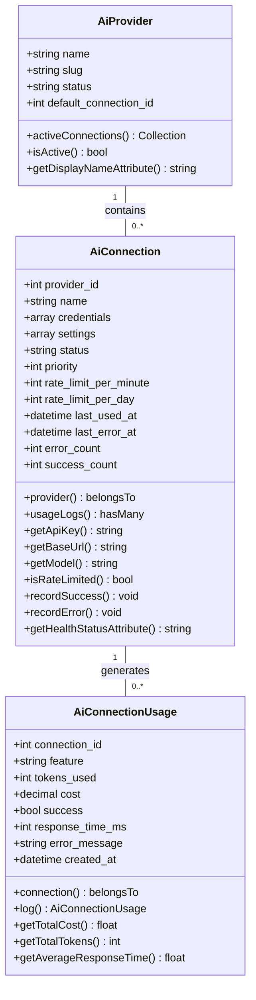
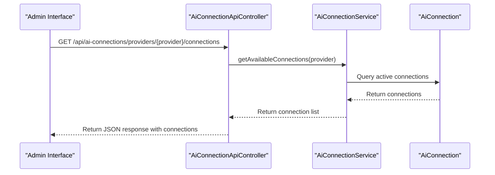
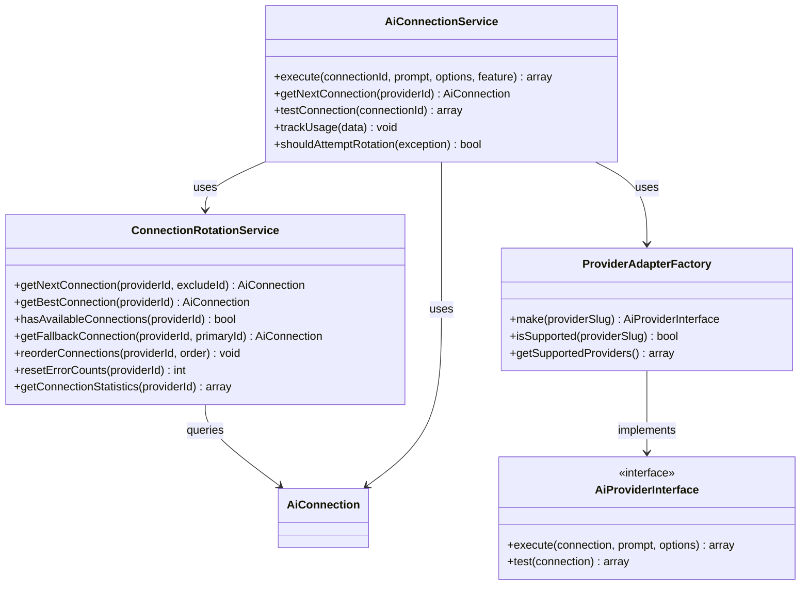
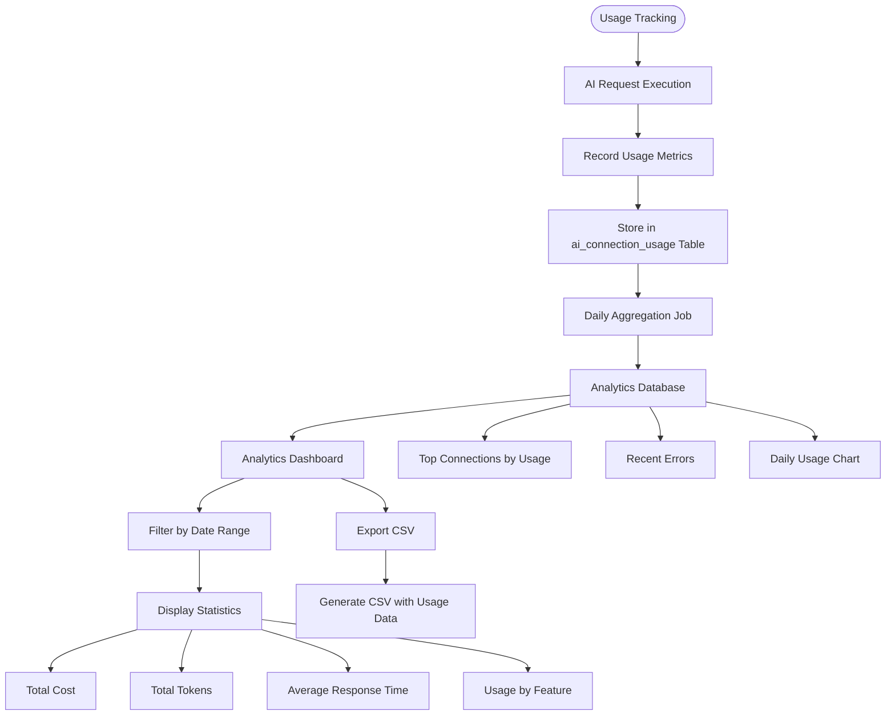
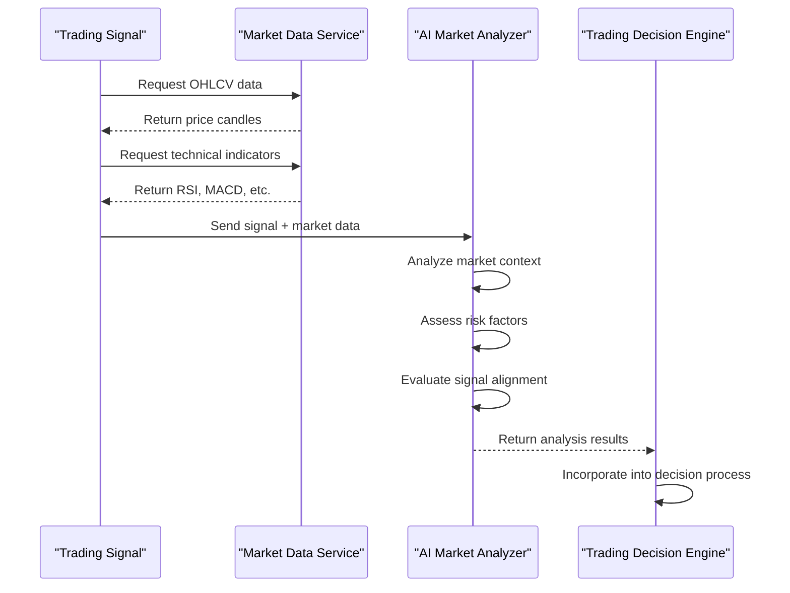
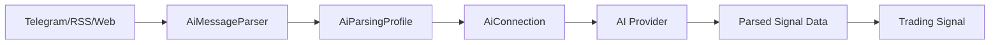
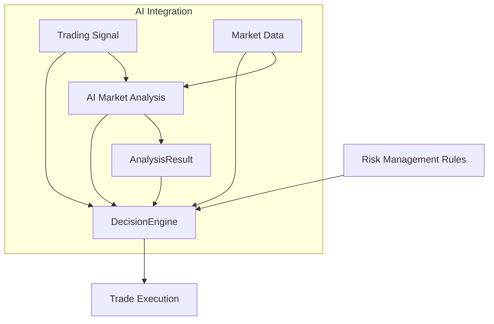

# AI Integration System

<cite>
**Referenced Files in This Document**   
- [AiConnectionApiController.php](file://main/addons/ai-connection-addon/App/Http/Controllers/Api/AiConnectionApiController.php)
- [AiConnectionService.php](file://main/addons/ai-connection-addon/App/Services/AiConnectionService.php)
- [AiConnection.php](file://main/addons/ai-connection-addon/App/Models/AiConnection.php)
- [AiProvider.php](file://main/addons/ai-connection-addon/App/Models/AiProvider.php)
- [AiConnectionUsage.php](file://main/addons/ai-connection-addon/App/Models/AiConnectionUsage.php)
- [ConnectionRotationService.php](file://main/addons/ai-connection-addon/App/Services/ConnectionRotationService.php)
- [ProviderAdapterFactory.php](file://main/addons/ai-connection-addon/App/Services/ProviderAdapterFactory.php)
- [MarketAnalysisAiService.php](file://main/addons/_deprecated/ai-trading-addon/app/Services/MarketAnalysisAiService.php)
- [AiMessageParser.php](file://main/addons/multi-channel-signal-addon/app/Parsers/AiMessageParser.php)
- [OpenRouterMarketAnalyzer.php](file://main/addons/openrouter-integration-addon/app/Services/OpenRouterMarketAnalyzer.php)
- [UsageAnalyticsController.php](file://main/addons/ai-connection-addon/App/Http/Controllers/Backend/UsageAnalyticsController.php)
- [edit.blade.php](file://main/addons/ai-connection-addon/resources/views/backend/connections/edit.blade.php)
- [index.blade.php](file://main/addons/ai-connection-addon/resources/views/backend/analytics/index.blade.php)
</cite>

## Table of Contents
1. [Introduction](#introduction)
2. [AI Provider Architecture](#ai-provider-architecture)
3. [Connection Management](#connection-management)
4. [Connection Pooling and Rotation](#connection-pooling-and-rotation)
5. [Usage Analytics and Monitoring](#usage-analytics-and-monitoring)
6. [Configuration Options](#configuration-options)
7. [Market Analysis Capabilities](#market-analysis-capabilities)
8. [Integration with Multi-Channel Signal Processing](#integration-with-multi-channel-signal-processing)
9. [Integration with Trading Decision Engine](#integration-with-trading-decision-engine)
10. [Setup and Administration](#setup-and-administration)
11. [Conclusion](#conclusion)

## Introduction

The AI Integration System provides a comprehensive framework for managing AI provider connections and leveraging artificial intelligence for market analysis and signal interpretation in trading applications. This system supports multiple AI providers including OpenAI, Google Gemini, and OpenRouter, offering robust connection management, usage analytics, and health monitoring capabilities.

The architecture is designed to handle high-volume AI interactions while maintaining reliability through connection pooling, automatic rotation, and comprehensive monitoring. The system integrates seamlessly with the multi-channel signal processing system and trading decision engine, enabling intelligent analysis of market conditions and trading signals.

This document details the implementation of the AI connection management system, configuration options, market analysis capabilities, and integration points with other system components.

## AI Provider Architecture

The AI Integration System implements a modular architecture that supports multiple AI providers through a standardized interface. The core components include provider models, connection management, and adapter patterns that enable seamless integration with different AI services.



**Diagram sources**
- [AiProvider.php](file://main/addons/ai-connection-addon/App/Models/AiProvider.php#L8-L82)
- [AiConnection.php](file://main/addons/ai-connection-addon/App/Models/AiConnection.php#L9-L296)
- [AiConnectionUsage.php](file://main/addons/ai-connection-addon/App/Models/AiConnectionUsage.php#L8-L187)

**Section sources**
- [AiProvider.php](file://main/addons/ai-connection-addon/App/Models/AiProvider.php#L8-L82)
- [AiConnection.php](file://main/addons/ai-connection-addon/App/Models/AiConnection.php#L9-L296)
- [AiConnectionUsage.php](file://main/addons/ai-connection-addon/App/Models/AiConnectionUsage.php#L8-L187)

The system supports three primary AI providers:
- **OpenAI**: Advanced language models for natural language processing and analysis
- **Google Gemini**: Google's AI platform for multimodal understanding and generation
- **OpenRouter**: Aggregator service providing access to multiple AI models through a unified API

Each provider is represented by an `AiProvider` model that contains metadata about the provider and manages its connections. The `AiConnection` model stores configuration details for individual connections, including authentication credentials, rate limits, and performance metrics. Usage data is tracked in the `AiConnectionUsage` model, which records each AI interaction for analytics and monitoring purposes.

## Connection Management

The AI Integration System provides comprehensive connection management capabilities through a RESTful API and administrative interface. The system allows for the creation, testing, and monitoring of AI connections with detailed configuration options.



**Diagram sources**
- [AiConnectionApiController.php](file://main/addons/ai-connection-addon/App/Http/Controllers/Api/AiConnectionApiController.php#L18-L43)
- [AiConnectionService.php](file://main/addons/ai-connection-addon/App/Services/AiConnectionService.php#L30-L47)
- [AiConnection.php](file://main/addons/ai-connection-addon/App/Models/AiConnection.php#L9-L296)

**Section sources**
- [AiConnectionApiController.php](file://main/addons/ai-connection-addon/App/Http/Controllers/Api/AiConnectionApiController.php#L18-L43)
- [edit.blade.php](file://main/addons/ai-connection-addon/resources/views/backend/connections/edit.blade.php#L59-L71)

The connection management system includes the following key features:

### Connection Configuration
Each AI connection can be configured with the following parameters:
- **Name**: Descriptive name for the connection
- **Provider**: AI service provider (OpenAI, Gemini, or OpenRouter)
- **Credentials**: API key and authentication details (securely encrypted)
- **Base URL**: Optional override of the default API endpoint
- **Settings**: Provider-specific configuration such as model selection, temperature, and token limits
- **Rate Limits**: Per-minute and per-day usage limits to prevent overages
- **Priority**: Weighting for connection selection in the rotation system

The system supports provider-specific default endpoints:
- OpenAI: `https://api.openai.com/v1`
- Google Gemini: `https://generativelanguage.googleapis.com/v1`
- OpenRouter: `https://openrouter.ai/api/v1`

### Connection Testing
The system provides an API endpoint to test AI connections, verifying that credentials are valid and the provider is accessible. The test operation measures response time and updates the connection's health status based on the result.

### Status and Health Monitoring
Each connection maintains real-time status information:
- **Status**: Active, inactive, or error state
- **Health Status**: Derived from error rates (healthy, warning, critical, or degraded)
- **Success Rate**: Percentage of successful requests
- **Last Used**: Timestamp of most recent usage
- **Error Count**: Number of consecutive errors

The system automatically updates connection status based on usage patterns, marking connections as problematic when error thresholds are exceeded.

## Connection Pooling and Rotation

The AI Integration System implements a sophisticated connection pooling and rotation mechanism to ensure high availability and optimal performance. This system automatically manages multiple connections to the same provider, distributing load and providing failover capabilities.



**Diagram sources**
- [ConnectionRotationService.php](file://main/addons/ai-connection-addon/App/Services/ConnectionRotationService.php#L8-L165)
- [AiConnectionService.php](file://main/addons/ai-connection-addon/App/Services/AiConnectionService.php#L11-L310)
- [ProviderAdapterFactory.php](file://main/addons/ai-connection-addon/App/Services/ProviderAdapterFactory.php#L10-L68)

**Section sources**
- [ConnectionRotationService.php](file://main/addons/ai-connection-addon/App/Services/ConnectionRotationService.php#L8-L165)
- [AiConnectionService.php](file://main/addons/ai-connection-addon/App/Services/AiConnectionService.php#L11-L310)
- [ProviderAdapterFactory.php](file://main/addons/ai-connection-addon/App/Services/ProviderAdapterFactory.php#L10-L68)

### Connection Rotation Logic
The connection rotation system follows a priority-based selection algorithm with health monitoring:

1. **Priority Selection**: Connections are ordered by priority (lower numbers have higher priority)
2. **Health Filtering**: Only active connections with error counts below threshold are considered
3. **Rate Limit Checking**: Connections that have reached their rate limits are excluded
4. **Fallback Mechanism**: When a connection fails, the system automatically rotates to the next available connection

The rotation service evaluates connections based on multiple criteria:
- Active status
- Health status (error count < 10)
- Rate limit compliance
- Priority ranking

### Automatic Failover
The system implements automatic failover through the `execute` method in `AiConnectionService`. When an AI call fails, the system determines whether to attempt rotation based on the error type:

- **Rate limit errors**: Always attempt rotation
- **Service unavailable errors**: Attempt rotation
- **Authentication errors**: Do not rotate (indicative of configuration issues)

If rotation is warranted, the system retrieves an alternative connection and retries the operation transparently.

### Provider Adapters
The system uses a factory pattern to create provider-specific adapters through the `ProviderAdapterFactory`. This allows for consistent interaction with different AI providers while encapsulating provider-specific implementation details. The factory caches adapters to improve performance and supports the following providers:
- OpenAI Adapter
- Google Gemini Adapter
- OpenRouter Adapter

## Usage Analytics and Monitoring

The AI Integration System includes comprehensive usage analytics and monitoring capabilities to track AI consumption, performance, and costs. The system provides both real-time monitoring and historical analysis through an administrative interface.



**Diagram sources**
- [UsageAnalyticsController.php](file://main/addons/ai-connection-addon/App/Http/Controllers/Backend/UsageAnalyticsController.php#L11-L132)
- [AiConnectionUsage.php](file://main/addons/ai-connection-addon/App/Models/AiConnectionUsage.php#L8-L187)
- [index.blade.php](file://main/addons/ai-connection-addon/resources/views/backend/analytics/index.blade.php#L1-L90)

**Section sources**
- [UsageAnalyticsController.php](file://main/addons/ai-connection-addon/App/Http/Controllers/Backend/UsageAnalyticsController.php#L11-L132)
- [AiConnectionUsage.php](file://main/addons/ai-connection-addon/App/Models/AiConnectionUsage.php#L8-L187)
- [index.blade.php](file://main/addons/ai-connection-addon/resources/views/backend/analytics/index.blade.php#L1-L90)

### Analytics Dashboard
The usage analytics dashboard provides a comprehensive overview of AI consumption with the following key metrics:

- **Total Cost**: Aggregate cost of AI usage over the selected period
- **Total Tokens**: Total number of tokens consumed
- **Average Response Time**: Mean response time across all requests
- **Usage by Feature**: Breakdown of usage by feature (parsing, market analysis, translation)
- **Top Connections**: Highest usage connections ranked by request count
- **Recent Errors**: List of recent failed requests with error messages
- **Daily Usage Chart**: Visual representation of daily usage patterns

The dashboard supports filtering by time periods (7, 30, or 90 days) and allows exporting data to CSV format for further analysis.

### Usage Tracking
Each AI interaction is tracked with detailed metadata:
- **Connection ID**: The specific AI connection used
- **Feature**: The feature or service that initiated the request
- **Tokens Used**: Number of tokens consumed in the request
- **Cost**: Estimated cost of the request
- **Success**: Boolean indicating request success
- **Response Time**: Duration of the request in milliseconds
- **Error Message**: Description of any errors encountered

The system automatically calculates cost based on token usage and provider pricing models, enabling accurate cost tracking and budgeting.

### Performance Monitoring
The system monitors key performance indicators:
- **Success Rate**: Percentage of successful requests
- **Error Rate**: Frequency of failed requests
- **Response Time**: Latency of AI responses
- **Throughput**: Requests per minute

These metrics are used to assess connection health and identify potential issues before they impact system functionality.

## Configuration Options

The AI Integration System provides extensive configuration options for both AI providers and parsing profiles, allowing for fine-tuned control over AI behavior and performance characteristics.

### AI Provider Configuration

Each AI provider connection can be configured with the following settings:

**Connection Settings**
- **Name**: Descriptive identifier for the connection
- **Provider**: Selection of AI service (OpenAI, Gemini, OpenRouter)
- **API Key**: Authentication credential (securely encrypted)
- **Base URL**: Optional API endpoint override
- **Status**: Active/inactive state
- **Priority**: Weighting for connection selection (1-100)

**Rate Limiting**
- **Rate Limit Per Minute**: Maximum requests allowed per minute
- **Rate Limit Per Day**: Maximum requests allowed per day

**Performance Monitoring**
- **Success Count**: Number of successful requests
- **Error Count**: Number of failed requests
- **Last Used**: Timestamp of most recent usage
- **Last Error**: Timestamp of most recent error

### Model and Generation Settings

Each connection supports provider-specific model configuration:

**OpenAI Settings**
- **Model**: Selection of GPT model (e.g., gpt-3.5-turbo, gpt-4)
- **Temperature**: Controls randomness (0.0-2.0)
- **Max Tokens**: Maximum response length
- **Top P**: Nucleus sampling parameter
- **Frequency Penalty**: Reduces repetition
- **Presence Penalty**: Encourages new topics

**Google Gemini Settings**
- **Model**: Selection of Gemini model (e.g., gemini-pro)
- **Temperature**: Controls response creativity
- **Max Output Tokens**: Response length limit
- **Top K**: Limits token selection to top k options

**OpenRouter Settings**
- **Model**: Selection from available models (e.g., claude-3-sonnet)
- **Temperature**: Response randomness control
- **Max Tokens**: Output length limit
- **Top P**: Probability threshold for token selection

### Parsing Profile Configuration

Parsing profiles define how AI should interpret and extract information from trading signals:

**Parsing Parameters**
- **Parsing Prompt**: Custom instruction for the AI on how to parse messages
- **AI Connection**: Specific connection to use for parsing
- **Mode**: Operation mode (parsing, confirmation, analysis)
- **Timeout**: Maximum processing time

**Default Parsing Prompt Structure**
```
You are a trading signal parser. Extract trading signal information from the following message and return ONLY valid JSON.

Required fields:
- currency_pair (string): The trading pair (e.g., "EUR/USD", "BTC/USDT", "GOLD")
- direction (string): "buy" or "sell"
- entry (number): Entry price
- sl (number): Stop loss price
- tp (number): Take profit price
- timeframe (string): Chart timeframe (e.g., "1h", "4h", "1d")
```

The system allows for custom parsing prompts to handle specialized signal formats or channel-specific message structures.

## Market Analysis Capabilities

The AI Integration System provides advanced market analysis capabilities that leverage AI to evaluate trading signals against current market conditions, providing risk assessments and confirmation recommendations.



**Diagram sources**
- [MarketAnalysisAiService.php](file://main/addons/_deprecated/ai-trading-addon/app/Services/MarketAnalysisAiService.php#L11-L105)
- [OpenRouterMarketAnalyzer.php](file://main/addons/openrouter-integration-addon/app/Services/OpenRouterMarketAnalyzer.php#L75-L206)

**Section sources**
- [MarketAnalysisAiService.php](file://main/addons/_deprecated/ai-trading-addon/app/Services/MarketAnalysisAiService.php#L11-L105)
- [OpenRouterMarketAnalyzer.php](file://main/addons/openrouter-integration-addon/app/Services/OpenRouterMarketAnalyzer.php#L75-L206)

### Market Analysis Workflow

The market analysis process follows these steps:

1. **Signal Data Collection**: Extract trading signal parameters (pair, direction, entry, SL, TP, timeframe)
2. **Market Data Retrieval**: Fetch OHLCV data and technical indicators for the relevant symbol and timeframe
3. **Context Preparation**: Format market data for AI analysis, including recent price action and indicator values
4. **AI Analysis**: Submit data to AI provider with specific analysis instructions
5. **Result Processing**: Parse AI response and extract key metrics
6. **Decision Integration**: Incorporate analysis results into trading decisions

### Analysis Parameters

The system analyzes multiple dimensions of market conditions:

**Price Action Analysis**
- Trend direction and strength
- Support and resistance levels
- Volatility assessment
- Price pattern recognition

**Technical Indicator Evaluation**
- Momentum indicators (RSI, Stochastic)
- Trend indicators (MACD, Moving Averages)
- Volume analysis
- Divergence detection

**Risk Assessment**
- Alignment with overall market trend
- Risk-reward ratio evaluation
- Volatility-based position sizing recommendations
- Stop loss viability

### Analysis Output

The AI market analysis returns structured results including:

- **Alignment Score**: Percentage indicating how well the signal aligns with market conditions
- **Safety Score**: Assessment of risk level (0-100)
- **Decision Recommendation**: "confirm", "reject", or "manual_review"
- **Reasoning**: Natural language explanation of the analysis
- **Confidence Level**: AI's confidence in its assessment

### Practical Example

When analyzing a buy signal for BTC/USDT at $50,000 with stop loss at $49,000 and take profit at $52,000, the AI system evaluates:

1. Current market trend (bullish, bearish, or ranging)
2. Key resistance levels near the take profit
3. Volatility conditions and potential for slippage
4. Momentum indicators for confirmation
5. Overall market sentiment

The system might return:
```json
{
  "alignment": 85,
  "safety_score": 78,
  "decision": "confirm",
  "reasoning": "Strong bullish momentum with RSI at 65 and price above 50-period MA. Take profit level faces minor resistance but overall trend supports upside potential.",
  "confidence": 0.92
}
```

## Integration with Multi-Channel Signal Processing

The AI Integration System seamlessly integrates with the multi-channel signal processing system to enhance signal parsing and interpretation from various sources.



**Diagram sources**
- [AiMessageParser.php](file://main/addons/multi-channel-signal-addon/app/Parsers/AiMessageParser.php#L83-L112)
- [AiConnection.php](file://main/addons/ai-connection-addon/App/Models/AiConnection.php#L9-L296)

**Section sources**
- [AiMessageParser.php](file://main/addons/multi-channel-signal-addon/app/Parsers/AiMessageParser.php#L83-L112)

### Signal Parsing Workflow

The integration follows this processing chain:

1. **Message Ingestion**: Raw messages are received from various channels (Telegram, RSS, web scraping)
2. **Parsing Profile Selection**: Appropriate AI parsing profile is selected based on channel or user preferences
3. **AI-Powered Parsing**: Message content is sent to AI with parsing instructions
4. **Structured Data Extraction**: AI returns structured trading signal data in JSON format
5. **Signal Validation**: Extracted data is validated and stored as a trading signal

### Channel-Specific Adaptation

The system supports different parsing strategies for various channel types:

**Telegram Channels**
- Handles formatted messages with emojis and special characters
- Processes message threads and replies
- Supports channel-specific parsing rules

**RSS Feeds**
- Extracts content from XML structures
- Handles HTML formatting in feed entries
- Processes publication timestamps

**Web Scraping**
- Extracts text from HTML content
- Handles dynamic content loading
- Processes page navigation for multi-page signals

The AI parsing capability allows the system to adapt to diverse message formats without requiring custom regex patterns for each variation.

## Integration with Trading Decision Engine

The AI Integration System provides critical intelligence to the trading decision engine, enhancing automated trading decisions with AI-powered market analysis and risk assessment.



**Diagram sources**
- [MarketAnalysisAiService.php](file://main/addons/_deprecated/ai-trading-addon/app/Services/MarketAnalysisAiService.php#L11-L105)
- [AiConnectionService.php](file://main/addons/ai-connection-addon/App/Services/AiConnectionService.php#L11-L310)

**Section sources**
- [MarketAnalysisAiService.php](file://main/addons/_deprecated/ai-trading-addon/app/Services/MarketAnalysisAiService.php#L11-L105)

### Decision Enhancement Process

The integration enhances trading decisions through:

1. **Signal Confirmation**: AI evaluates whether market conditions support the trading signal
2. **Risk Scoring**: AI assigns risk scores to potential trades
3. **Position Sizing**: AI recommendations influence position size calculations
4. **Timing Optimization**: AI analysis helps determine optimal entry timing

### Decision Logic Integration

The trading decision engine incorporates AI analysis results into its decision matrix:

**Confirmation Mode**
- AI analysis required before executing any trade
- Trades only proceed if AI returns "confirm" decision
- "reject" or "manual_review" decisions prevent automated execution

**Assistance Mode**
- AI analysis used as one factor among many
- AI recommendations weighted with technical indicators and risk rules
- Final decision may override AI recommendation based on other factors

**Learning Mode**
- AI analysis compared against actual trade outcomes
- System learns from AI accuracy over time
- Feedback loop improves future AI prompt engineering

### Real-time Decision Support

The integration provides real-time decision support by:

- Reducing false signals through market context analysis
- Identifying high-probability trades with strong market alignment
- Flagging high-risk trades that may require manual review
- Optimizing trade parameters based on current market volatility

## Setup and Administration

The AI Integration System provides a comprehensive administrative interface for setting up and managing AI connections, monitoring usage, and configuring system parameters.

### Setting Up AI Connections

To configure AI connections:

1. **Navigate to AI Connections**: Access the AI connections management page in the admin panel
2. **Create New Connection**: Click "Add Connection" and select the provider
3. **Enter Credentials**: Input API key and configure connection settings
4. **Set Rate Limits**: Define per-minute and per-day usage limits
5. **Configure Model Settings**: Select appropriate model and generation parameters
6. **Test Connection**: Verify the connection works correctly
7. **Save Configuration**: Store the connection details

Multiple connections can be created for each provider to enable connection pooling and rotation.

### Configuring Rate Limits

Rate limits should be configured based on:
- Provider API limits
- Subscription plan allowances
- Budget constraints
- Expected usage patterns

Best practices include:
- Setting rate limits slightly below provider limits to avoid errors
- Distributing limits across multiple connections for high-volume use
- Monitoring usage patterns to optimize limit settings

### Monitoring Usage

The admin interface provides comprehensive usage monitoring through:

**Analytics Dashboard**
- View overall AI consumption trends
- Monitor costs and token usage
- Identify high-usage features or connections
- Track response times and success rates

**Connection-Specific Analytics**
- Detailed usage statistics for individual connections
- Historical performance trends
- Error rate analysis
- Cost breakdown by feature

**Alerting and Notifications**
- Configure alerts for rate limit approaching
- Set up notifications for connection failures
- Receive reports on unusual usage patterns

### Best Practices

**Connection Management**
- Maintain multiple connections per provider for redundancy
- Use priority settings to control connection selection
- Regularly test connections to ensure availability
- Rotate API keys periodically for security

**Cost Optimization**
- Monitor usage patterns to identify optimization opportunities
- Use appropriate models for each task (avoid overpowered models)
- Implement caching for frequently requested analyses
- Set conservative rate limits initially and adjust based on needs

**Performance Monitoring**
- Regularly review response times and error rates
- Investigate connections with high error counts
- Update provider configurations as API changes occur
- Monitor AI analysis quality and refine prompts as needed

## Conclusion

The AI Integration System provides a robust framework for managing AI provider connections and leveraging artificial intelligence for market analysis and trading signal interpretation. The system's modular architecture supports multiple AI providers including OpenAI, Google Gemini, and OpenRouter, with comprehensive connection management, pooling, and rotation capabilities.

Key strengths of the system include:
- **Reliable Connection Management**: Automated rotation and failover ensure high availability
- **Comprehensive Analytics**: Detailed usage tracking and cost monitoring
- **Advanced Market Analysis**: AI-powered evaluation of trading signals against market conditions
- **Seamless Integration**: Tight coupling with multi-channel signal processing and trading decision systems
- **Flexible Configuration**: Extensive options for tuning AI behavior and performance

The system enables sophisticated trading strategies by combining AI insights with traditional technical analysis, improving decision quality and risk management. By automating the analysis of market context and signal validation, the system reduces false signals and enhances trading performance.

For optimal results, administrators should:
- Configure multiple connections per provider for redundancy
- Regularly monitor usage patterns and costs
- Fine-tune AI prompts for specific analysis tasks
- Integrate AI insights with other risk management systems
- Continuously evaluate AI performance and update configurations

The AI Integration System represents a significant advancement in algorithmic trading capabilities, harnessing the power of artificial intelligence to make more informed and context-aware trading decisions.