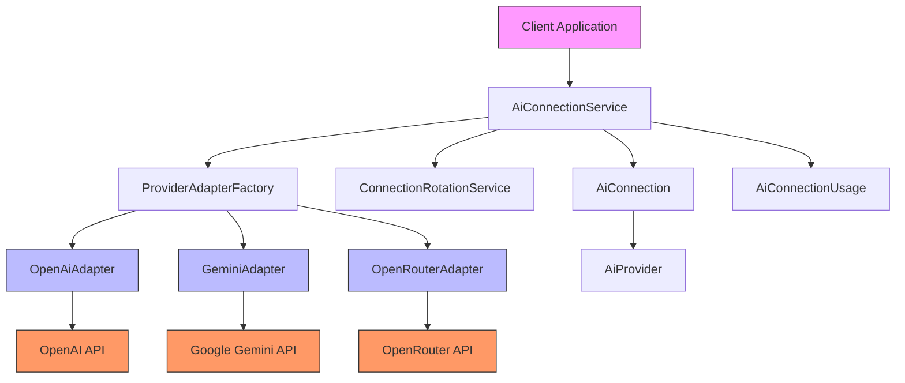
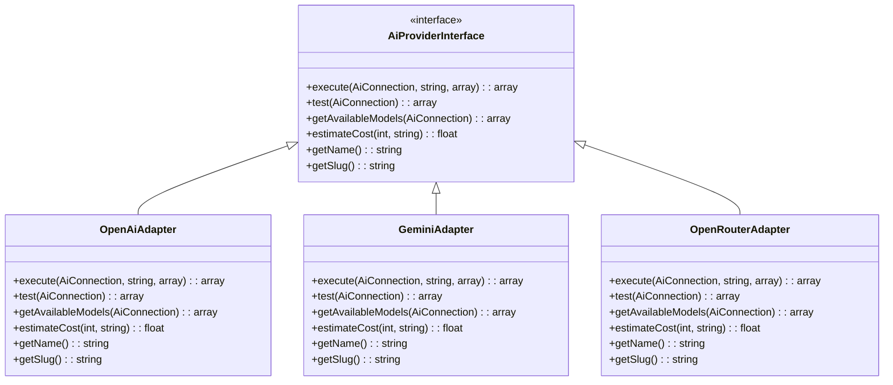
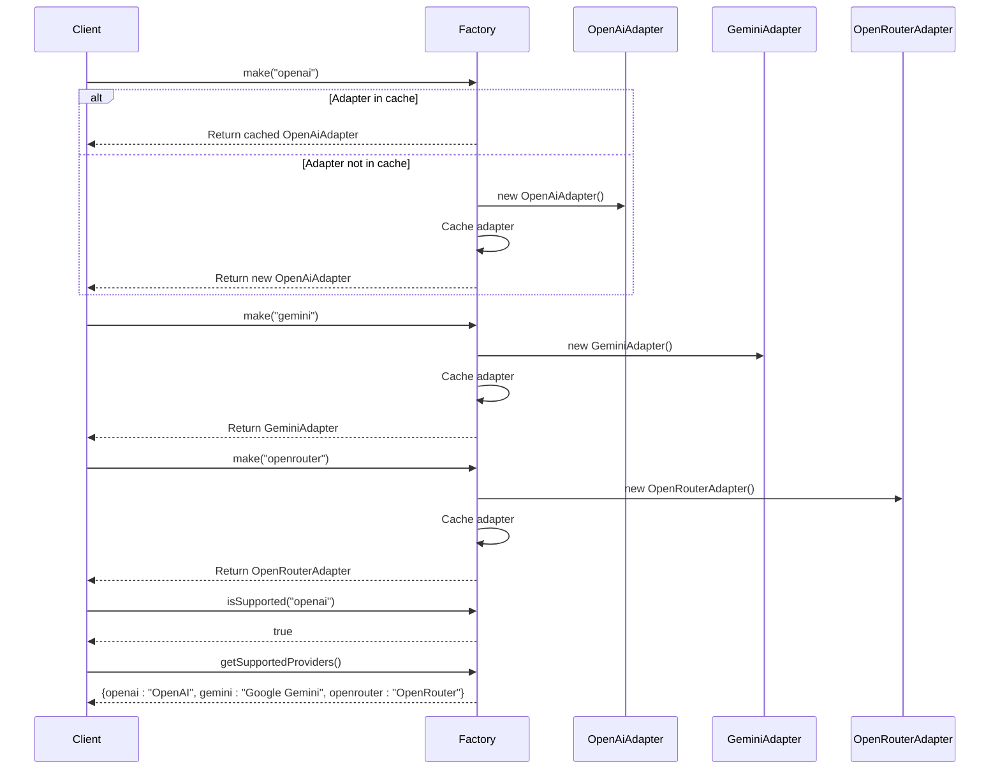
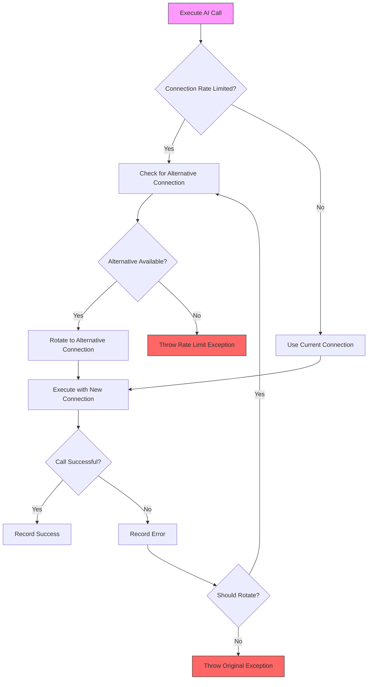
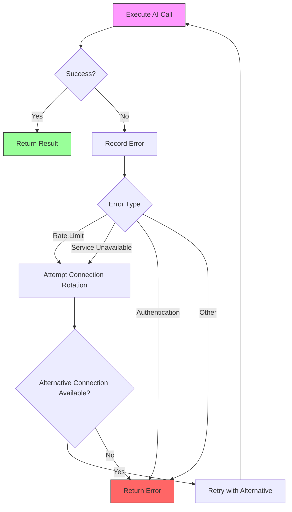
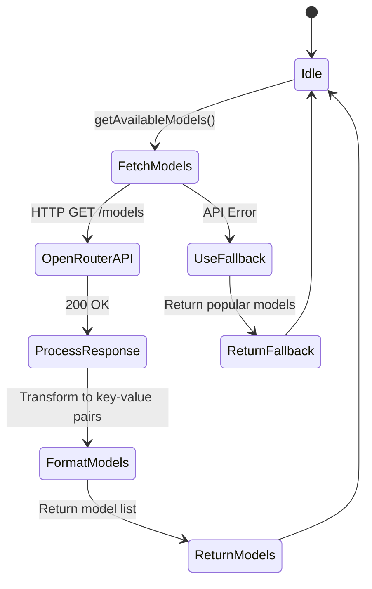
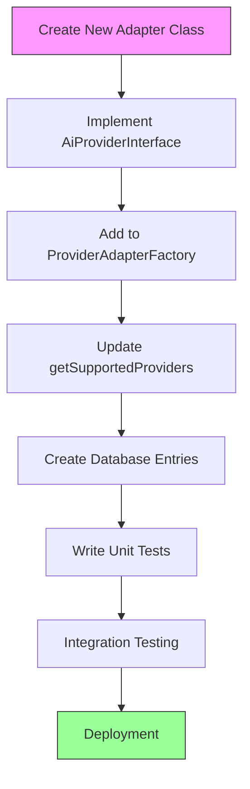
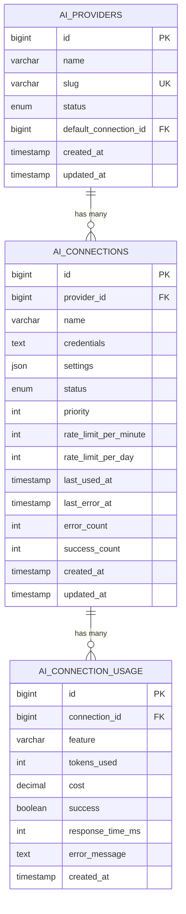

# AI Provider Integration

<cite>
**Referenced Files in This Document**   
- [AiProviderInterface.php](file://main/addons/ai-connection-addon/App/Contracts/AiProviderInterface.php)
- [ProviderAdapterFactory.php](file://main/addons/ai-connection-addon/App/Services/ProviderAdapterFactory.php)
- [OpenAiAdapter.php](file://main/addons/ai-connection-addon/App/Providers/OpenAiAdapter.php)
- [GeminiAdapter.php](file://main/addons/ai-connection-addon/App/Providers/GeminiAdapter.php)
- [OpenRouterAdapter.php](file://main/addons/ai-connection-addon/App/Providers/OpenRouterAdapter.php)
- [AiConnection.php](file://main/addons/ai-connection-addon/App/Models/AiConnection.php)
- [AiConnectionService.php](file://main/addons/ai-connection-addon/App/Services/AiConnectionService.php)
- [ConnectionRotationService.php](file://main/addons/ai-connection-addon/App/Services/ConnectionRotationService.php)
- [AiProvider.php](file://main/addons/ai-connection-addon/App/Models/AiProvider.php)
- [2025_12_03_100000_create_ai_providers_table.php](file://main/addons/ai-connection-addon/database/migrations/2025_12_03_100000_create_ai_providers_table.php)
- [2025_12_03_100001_create_ai_connections_table.php](file://main/addons/ai-connection-addon/database/migrations/2025_12_03_100001_create_ai_connections_table.php)
- [2025_12_03_100002_create_ai_connection_usage_table.php](file://main/addons/ai-connection-addon/database/migrations/2025_12_03_100002_create_ai_connection_usage_table.php)
</cite>

## Table of Contents
1. [Introduction](#introduction)
2. [Architecture Overview](#architecture-overview)
3. [Core Components](#core-components)
4. [AI Provider Interface Contract](#ai-provider-interface-contract)
5. [Provider Adapter Implementations](#provider-adapter-implementations)
6. [ProviderAdapterFactory Class](#provideradapterfactory-class)
7. [Connection Management and Rotation](#connection-management-and-rotation)
8. [Request/Response Normalization](#requestresponse-normalization)
9. [Configuration and Authentication](#configuration-and-authentication)
10. [Error Handling Patterns](#error-handling-patterns)
11. [Provider-Specific Features](#provider-specific-features)
12. [Extending the System with New Providers](#extending-the-system-with-new-providers)
13. [Database Schema](#database-schema)
14. [Conclusion](#conclusion)

## Introduction

The AI Provider Integration system implements a robust adapter pattern that enables seamless integration with multiple AI providers including OpenAI, Google Gemini, and OpenRouter. This architecture provides a standardized interface for AI communication while abstracting provider-specific implementation details. The system supports dynamic provider selection, connection rotation, usage tracking, and cost estimation across different AI services. This documentation details the implementation of the adapter pattern, the contract interface, factory pattern for dynamic instantiation, and the mechanisms for normalizing interactions with diverse AI provider APIs.

**Section sources**
- [AiProviderInterface.php](file://main/addons/ai-connection-addon/App/Contracts/AiProviderInterface.php)
- [ProviderAdapterFactory.php](file://main/addons/ai-connection-addon/App/Services/ProviderAdapterFactory.php)

## Architecture Overview

The AI Provider Integration system follows a modular architecture based on the adapter and factory patterns. The core components work together to provide a unified interface for interacting with multiple AI providers while handling provider-specific differences in API communication, authentication, and response formats.



**Diagram sources**
- [AiConnectionService.php](file://main/addons/ai-connection-addon/App/Services/AiConnectionService.php)
- [ProviderAdapterFactory.php](file://main/addons/ai-connection-addon/App/Services/ProviderAdapterFactory.php)
- [OpenAiAdapter.php](file://main/addons/ai-connection-addon/App/Providers/OpenAiAdapter.php)
- [GeminiAdapter.php](file://main/addons/ai-connection-addon/App/Providers/GeminiAdapter.php)
- [OpenRouterAdapter.php](file://main/addons/ai-connection-addon/App/Providers/OpenRouterAdapter.php)
- [AiConnection.php](file://main/addons/ai-connection-addon/App/Models/AiConnection.php)
- [AiProvider.php](file://main/addons/ai-connection-addon/App/Models/AiProvider.php)
- [AiConnectionUsage.php](file://main/addons/ai-connection-addon/App/Models/AiConnectionUsage.php)

## Core Components

The AI Provider Integration system consists of several core components that work together to provide a unified interface for AI provider interactions. The system is built around the adapter pattern, with each provider implementation conforming to a common interface. The ProviderAdapterFactory handles dynamic instantiation of provider adapters based on configuration, while the AiConnectionService manages the execution of AI calls with built-in connection rotation and error handling. The ConnectionRotationService provides intelligent connection selection based on health and priority, ensuring high availability and reliability.

**Section sources**
- [AiProviderInterface.php](file://main/addons/ai-connection-addon/App/Contracts/AiProviderInterface.php)
- [ProviderAdapterFactory.php](file://main/addons/ai-connection-addon/App/Services/ProviderAdapterFactory.php)
- [AiConnectionService.php](file://main/addons/ai-connection-addon/App/Services/AiConnectionService.php)
- [ConnectionRotationService.php](file://main/addons/ai-connection-addon/App/Services/ConnectionRotationService.php)

## AI Provider Interface Contract

The AiProviderInterface defines a standardized contract that all AI provider adapters must implement. This interface ensures consistent method signatures across different providers, enabling the system to interact with various AI services through a uniform API. The interface includes methods for executing AI calls, testing connections, retrieving available models, estimating costs, and obtaining provider metadata.



**Diagram sources**
- [AiProviderInterface.php](file://main/addons/ai-connection-addon/App/Contracts/AiProviderInterface.php)
- [OpenAiAdapter.php](file://main/addons/ai-connection-addon/App/Providers/OpenAiAdapter.php)
- [GeminiAdapter.php](file://main/addons/ai-connection-addon/App/Providers/GeminiAdapter.php)
- [OpenRouterAdapter.php](file://main/addons/ai-connection-addon/App/Providers/OpenRouterAdapter.php)

## Provider Adapter Implementations

### OpenAI Adapter

The OpenAiAdapter implements the AiProviderInterface for OpenAI's API. It handles the specific requirements of OpenAI's chat completions endpoint, including the proper formatting of messages, model selection, and response parsing. The adapter supports configurable parameters such as temperature, max_tokens, and timeout through both connection settings and method options.

**Section sources**
- [OpenAiAdapter.php](file://main/addons/ai-connection-addon/App/Providers/OpenAiAdapter.php)

### Google Gemini Adapter

The GeminiAdapter implements the AiProviderInterface for Google's Gemini API. It adapts the request format to match Gemini's content generation structure, which differs from OpenAI's message-based approach. The adapter handles Gemini-specific authentication through API keys in the URL parameter and manages response parsing for Gemini's candidate-based output structure.

**Section sources**
- [GeminiAdapter.php](file://main/addons/ai-connection-addon/App/Providers/GeminiAdapter.php)

### OpenRouter Adapter

The OpenRouterAdapter implements the AiProviderInterface for the OpenRouter service, which acts as a gateway to multiple AI models from different providers. This adapter supports a wide range of models from various providers and handles OpenRouter-specific headers such as HTTP-Referer and X-Title for attribution. The adapter can retrieve the full marketplace of available models from the OpenRouter API.

**Section sources**
- [OpenRouterAdapter.php](file://main/addons/ai-connection-addon/App/Providers/OpenRouterAdapter.php)

## ProviderAdapterFactory Class

The ProviderAdapterFactory class implements the factory pattern to dynamically instantiate provider adapters based on configuration. The factory maintains a cache of created adapters to avoid redundant object creation and provides methods for checking provider support and retrieving supported provider lists.



**Diagram sources**
- [ProviderAdapterFactory.php](file://main/addons/ai-connection-addon/App/Services/ProviderAdapterFactory.php)

## Connection Management and Rotation

The system implements sophisticated connection management through the AiConnection model and ConnectionRotationService. Multiple connections can be configured for each provider, with priority-based rotation and automatic failover. The rotation service selects the next available connection based on health status, error count, and rate limiting.



**Diagram sources**
- [AiConnectionService.php](file://main/addons/ai-connection-addon/App/Services/AiConnectionService.php)
- [ConnectionRotationService.php](file://main/addons/ai-connection-addon/App/Services/ConnectionRotationService.php)
- [AiConnection.php](file://main/addons/ai-connection-addon/App/Models/AiConnection.php)

## Request/Response Normalization

The adapter pattern normalizes request and response formats across different AI providers. Each adapter translates the standardized interface calls into provider-specific API requests and converts the responses back into a consistent format.

```mermaid
flowchart LR
A[Standardized Request] --> B[Adapter]
B --> C[Provider-Specific Request]
C --> D[AI Provider API]
D --> E[Provider-Specific Response]
E --> F[Adapter]
F --> G[Standardized Response]
subgraph OpenAI
C1[{"{model: 'gpt-3.5-turbo', messages: [{role: 'user', content: 'prompt'}]}"}
E1[{"{choices: [{message: {content: 'response'}}], usage: {total_tokens: 75}}"}
end
subgraph Gemini
C2[{"{contents: [{parts: [{text: 'prompt'}]}], generationConfig: {maxOutputTokens: 500}}"}
E2[{"{candidates: [{content: {parts: [{text: 'response'}]}]}"}}
end
subgraph OpenRouter
C3[{"{model: 'openai/gpt-3.5-turbo', messages: [{role: 'user', content: 'prompt'}]}"}
E3[{"{choices: [{message: {content: 'response'}}], usage: {total_tokens: 75, cost: 0.0015}}"}
end
A --> B
B --> C1
C1 --> D
D --> E1
E1 --> F
F --> G
A --> B
B --> C2
C2 --> D
D --> E2
E2 --> F
F --> G
A --> B
B --> C3
C3 --> D
D --> E3
E3 --> F
F --> G
```

**Diagram sources**
- [OpenAiAdapter.php](file://main/addons/ai-connection-addon/App/Providers/OpenAiAdapter.php)
- [GeminiAdapter.php](file://main/addons/ai-connection-addon/App/Providers/GeminiAdapter.php)
- [OpenRouterAdapter.php](file://main/addons/ai-connection-addon/App/Providers/OpenRouterAdapter.php)

## Configuration and Authentication

The system handles provider-specific configuration and authentication through the AiConnection model. Credentials are securely encrypted in the database, and various configuration options are supported for each provider.

### Connection Configuration

| Configuration | OpenAI | Google Gemini | OpenRouter |
|---------------|--------|---------------|------------|
| **API Key** | `api_key` in credentials | `api_key` in credentials | `api_key` in credentials |
| **Base URL** | Customizable, defaults to `https://api.openai.com/v1` | Customizable, defaults to `https://generativelanguage.googleapis.com/v1` | Customizable, defaults to `https://openrouter.ai/api/v1` |
| **Model** | Configurable in settings or options | Configurable in settings or options | Configurable in settings or options |
| **Temperature** | Configurable (default: 0.3) | Configurable (default: 0.3) | Configurable (default: 0.3) |
| **Max Tokens** | Configurable (default: 500) | Configurable (default: 500) | Configurable (default: 500) |
| **Timeout** | Configurable (default: 30s) | Configurable (default: 30s) | Configurable (default: 30s) |
| **Rate Limits** | Per-minute and per-day limits | Per-minute and per-day limits | Per-minute and per-day limits |

**Section sources**
- [AiConnection.php](file://main/addons/ai-connection-addon/App/Models/AiConnection.php)
- [OpenAiAdapter.php](file://main/addons/ai-connection-addon/App/Providers/OpenAiAdapter.php)
- [GeminiAdapter.php](file://main/addons/ai-connection-addon/App/Providers/GeminiAdapter.php)
- [OpenRouterAdapter.php](file://main/addons/ai-connection-addon/App/Providers/OpenRouterAdapter.php)

## Error Handling Patterns

The system implements comprehensive error handling with automatic recovery mechanisms. Each adapter handles provider-specific error responses and converts them into a consistent format. The AiConnectionService implements retry logic with connection rotation when appropriate.



**Diagram sources**
- [AiConnectionService.php](file://main/addons/ai-connection-addon/App/Services/AiConnectionService.php)
- [AiConnection.php](file://main/addons/ai-connection-addon/App/Models/AiConnection.php)

## Provider-Specific Features

### Model Availability and Management

Each provider adapter implements the getAvailableModels method to retrieve the list of models supported by that provider. OpenRouter's implementation additionally supports fetching the complete model marketplace from their API.



**Diagram sources**
- [OpenRouterAdapter.php](file://main/addons/ai-connection-addon/App/Providers/OpenRouterAdapter.php)

### Cost Estimation

The system provides cost estimation capabilities for each provider, using provider-specific pricing models. The estimateCost method calculates the approximate cost based on token usage and model selection.

| Provider | Model | Price per 1K Tokens |
|---------|-------|-------------------|
| **OpenAI** | gpt-4 | $0.03 |
| | gpt-4-turbo-preview | $0.01 |
| | gpt-3.5-turbo | $0.0015 |
| | gpt-3.5-turbo-16k | $0.003 |
| **Google Gemini** | gemini-pro | $0.00025 |
| | gemini-pro-vision | $0.00025 |
| **OpenRouter** | openai/gpt-4 | $0.03 |
| | openai/gpt-3.5-turbo | $0.0015 |
| | anthropic/claude-2 | $0.01 |
| | anthropic/claude-instant | $0.001 |
| | google/palm-2 | $0.0005 |
| | meta-llama/llama-2-70b | $0.0007 |
| | mistralai/mistral-7b | $0.0002 |

**Section sources**
- [OpenAiAdapter.php](file://main/addons/ai-connection-addon/App/Providers/OpenAiAdapter.php#L128-L140)
- [GeminiAdapter.php](file://main/addons/ai-connection-addon/App/Providers/GeminiAdapter.php#L133-L143)
- [OpenRouterAdapter.php](file://main/addons/ai-connection-addon/App/Providers/OpenRouterAdapter.php#L185-L201)

## Extending the System with New Providers

Adding new AI providers to the system follows a standardized process that leverages the adapter pattern. Developers can extend the system by implementing the AiProviderInterface and registering the new adapter with the ProviderAdapterFactory.

### Steps to Add a New Provider

1. **Create a new adapter class** that implements AiProviderInterface
2. **Implement all interface methods** with provider-specific logic
3. **Add support in ProviderAdapterFactory** by updating the make method
4. **Update getSupportedProviders** to include the new provider
5. **Create database entries** for the provider and connections
6. **Test the implementation** using the provided test suite



**Diagram sources**
- [AiProviderInterface.php](file://main/addons/ai-connection-addon/App/Contracts/AiProviderInterface.php)
- [ProviderAdapterFactory.php](file://main/addons/ai-connection-addon/App/Services/ProviderAdapterFactory.php)

## Database Schema

The AI provider integration system uses three main database tables to store configuration and usage data.

### AI Providers Table



**Diagram sources**
- [2025_12_03_100000_create_ai_providers_table.php](file://main/addons/ai-connection-addon/database/migrations/2025_12_03_100000_create_ai_providers_table.php)
- [2025_12_03_100001_create_ai_connections_table.php](file://main/addons/ai-connection-addon/database/migrations/2025_12_03_100001_create_ai_connections_table.php)
- [2025_12_03_100002_create_ai_connection_usage_table.php](file://main/addons/ai-connection-addon/database/migrations/2025_12_03_100002_create_ai_connection_usage_table.php)

## Conclusion

The AI Provider Integration system provides a flexible and extensible architecture for working with multiple AI providers through a unified interface. By implementing the adapter pattern, the system successfully normalizes the diverse APIs of different AI services into a consistent contract. The ProviderAdapterFactory enables dynamic instantiation of provider adapters, while the connection management system provides robust error handling and failover capabilities. The architecture supports easy extension with new providers and includes comprehensive features for cost estimation, usage tracking, and performance monitoring. This design allows the application to leverage the strengths of different AI providers while maintaining a simple and consistent interface for developers.