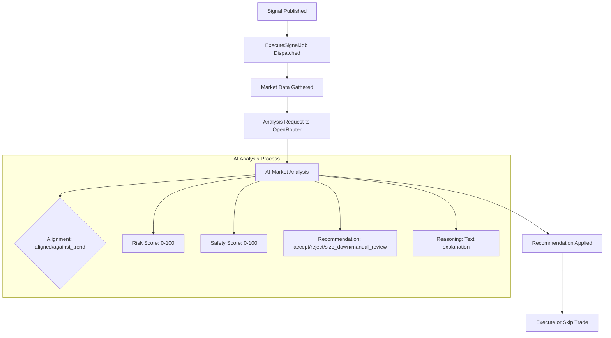
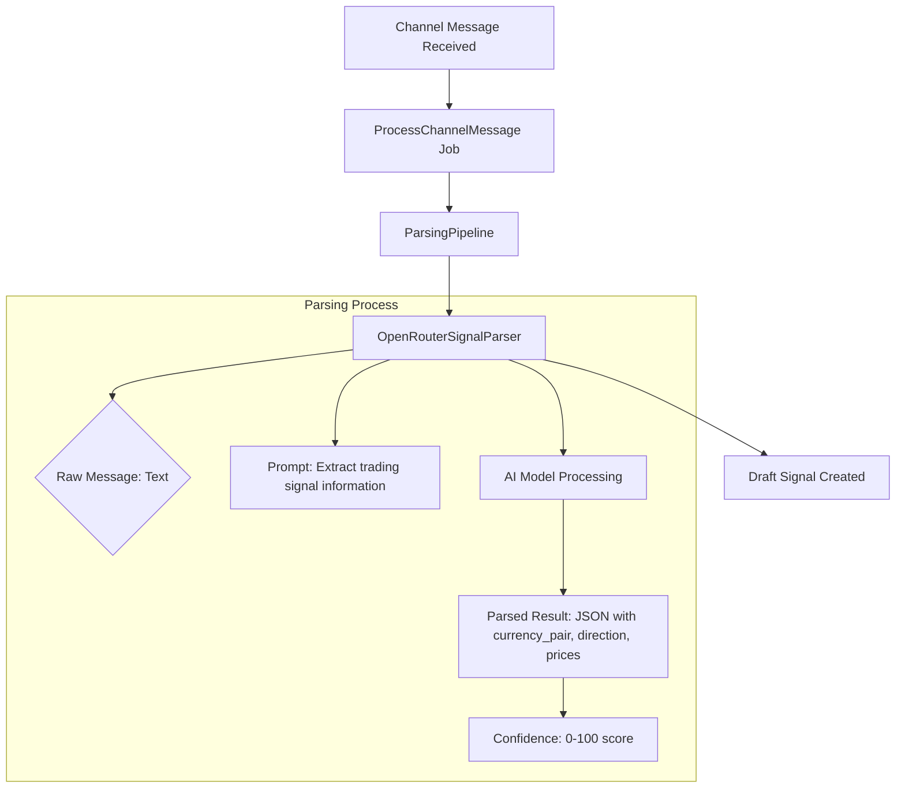

# OpenRouter Integration (Deprecated)

<cite>
**Referenced Files in This Document**   
- [openrouter-integration.md](file://docs/openrouter-integration.md)
- [README.md](file://main/addons/openrouter-integration-addon/README.md)
- [addon.json](file://main/addons/openrouter-integration-addon/addon.json)
- [OpenRouterMarketAnalyzer.php](file://main/addons/openrouter-integration-addon/app/Services/OpenRouterMarketAnalyzer.php)
- [OpenRouterSignalParser.php](file://main/addons/openrouter-integration-addon/app/Services/OpenRouterSignalParser.php)
- [OpenRouterService.php](file://main/addons/openrouter-integration-addon/app/Services/OpenRouterService.php)
- [ai-connection-addon/README.md](file://main/addons/ai-connection-addon/README.md)
- [ai-connection-addon/addon.json](file://main/addons/ai-connection-addon/addon.json)
- [INSTALLATION.md](file://main/addons/openrouter-integration-addon/INSTALLATION.md)
- [MIGRATE_TO_ADDON.md](file://main/addons/multi-channel-signal-addon/MIGRATE_TO_ADDON.md)
</cite>

## Table of Contents
1. [Introduction](#introduction)
2. [Historical Functionality](#historical-functionality)
3. [Original Components](#original-components)
4. [Reasons for Deprecation](#reasons-for-deprecation)
5. [Migration Path to AI Connection Manager](#migration-path-to-ai-connection-manager)
6. [Accessing the Model Marketplace](#accessing-the-model-marketplace)
7. [Reconfiguring Workflows](#reconfiguring-workflows)
8. [Conclusion](#conclusion)

## Introduction

The OpenRouter Integration Addon was a standalone component that provided access to over 400 AI models through OpenRouter's marketplace, serving as a unified gateway for AI-powered trading signal parsing and market analysis. This documentation details the historical role of the integration, its original functionality, and provides a comprehensive migration guide to the current AI Connection Manager addon. The integration has been deprecated as of December 2025, with all functionality consolidated into the centralized AI Connection Manager to streamline credential management, improve connection reliability, and provide a unified interface for all AI providers.

**Section sources**
- [README.md](file://main/addons/openrouter-integration-addon/README.md#L1-L444)
- [openrouter-integration.md](file://docs/openrouter-integration.md#L1-L542)

## Historical Functionality

The OpenRouter Integration Addon served as a critical component for AI-powered trading operations, providing access to a vast marketplace of 400+ AI models from leading providers including OpenAI, Anthropic, Google, and Meta. The integration offered a unified API interface that eliminated the need for managing multiple API keys and connections, allowing users to seamlessly switch between models based on performance, cost, and specific use cases. This unified approach provided significant benefits including cost optimization through model selection, automatic fallback support when models failed, and comprehensive usage analytics across all AI interactions.

The integration was designed with two primary use cases: AI-powered market confirmation through the OpenRouterMarketAnalyzer and multi-channel signal interpretation via the OpenRouterSignalParser. These components were tightly integrated with the Multi-Channel Signal Addon and Trading Execution Engine Addon, enabling automated trading workflows that leveraged AI for both signal parsing and market validation. The system supported dynamic model selection, priority-based configuration, and encrypted storage of API credentials, ensuring both flexibility and security in AI-powered trading operations.

**Section sources**
- [openrouter-integration.md](file://docs/openrouter-integration.md#L20-L43)
- [README.md](file://main/addons/openrouter-integration-addon/README.md#L7-L18)

## Original Components

### OpenRouterMarketAnalyzer

The OpenRouterMarketAnalyzer was responsible for AI-powered market confirmation, analyzing market conditions before trade execution to validate signal validity. This component integrated with the Trading Execution Engine to provide risk assessment and decision support based on real-time market data. The analyzer would gather market context including price action, volume, and technical indicators, then submit this information to the selected AI model for analysis. The AI would evaluate the signal against current market conditions and provide a recommendation with reasoning, which could result in accepting, rejecting, or modifying the trade execution.

**Diagram sources**
- [OpenRouterMarketAnalyzer.php](file://main/addons/openrouter-integration-addon/app/Services/OpenRouterMarketAnalyzer.php#L11-L206)
- [openrouter-integration.md](file://docs/openrouter-integration.md#L227-L258)

**Section sources**
- [OpenRouterMarketAnalyzer.php](file://main/addons/openrouter-integration-addon/app/Services/OpenRouterMarketAnalyzer.php#L11-L206)
- [openrouter-integration.md](file://docs/openrouter-integration.md#L227-L258)

### OpenRouterSignalParser

The OpenRouterSignalParser enabled multi-channel signal interpretation, automatically parsing trading signals from various communication channels such as Telegram and API messages. This component implemented the AiProviderInterface to integrate with the Multi-Channel Signal Addon, processing incoming messages to extract structured trading information including currency pairs, direction, entry prices, stop loss, and take profit levels. The parser used AI models to interpret natural language signals with high accuracy, calculating a confidence score for each parsed result to indicate reliability.

**Diagram sources**
- [OpenRouterSignalParser.php](file://main/addons/openrouter-integration-addon/app/Services/OpenRouterSignalParser.php#L11-L193)
- [openrouter-integration.md](file://docs/openrouter-integration.md#L195-L202)

**Section sources**
- [OpenRouterSignalParser.php](file://main/addons/openrouter-integration-addon/app/Services/OpenRouterSignalParser.php#L11-L193)
- [openrouter-integration.md](file://docs/openrouter-integration.md#L195-L202)

## Reasons for Deprecation

The OpenRouter Integration Addon has been deprecated due to architectural consolidation and the need for improved connection management across the platform. The primary reason for deprecation was the creation of the AI Connection Manager addon, which provides a centralized system for managing all AI provider connections, including OpenRouter, OpenAI, and Google Gemini. This consolidation eliminates redundancy, reduces maintenance overhead, and provides a unified interface for all AI-related functionality.

The standalone OpenRouter addon had several limitations that the AI Connection Manager addresses. These include fragmented credential management, lack of automatic connection rotation during rate limits, and limited usage analytics across different AI features. The AI Connection Manager introduces critical improvements such as automatic failover between connections, comprehensive usage tracking by feature, and centralized health monitoring. Additionally, the new system supports credential rotation, rate limiting enforcement, and provides detailed analytics on token usage and costs across all AI interactions.

The deprecation also aligns with the platform's strategic direction of creating a unified AI provider interface that simplifies configuration and management for users. By consolidating all AI connections into a single system, users can now manage their AI providers from one central location, apply consistent settings across different features, and benefit from enhanced reliability through automatic connection rotation.

**Section sources**
- [addon.json](file://main/addons/openrouter-integration-addon/addon.json#L8-L11)
- [README.md](file://main/addons/openrouter-integration-addon/README.md#L21-L35)
- [ai-connection-addon/README.md](file://main/addons/ai-connection-addon/README.md#L7-L13)

## Migration Path to AI Connection Manager

The migration from the standalone OpenRouter Integration to the AI Connection Manager follows a structured process that ensures continuity of service while transitioning to the new centralized system. The AI Connection Manager addon has been designed with backward compatibility in mind, allowing for a smooth transition without disrupting existing workflows. The migration process involves creating AI connections in the new system, updating configurations to reference these connections, and gradually phasing out the deprecated OpenRouter configurations.

The migration is facilitated by a database migration that adds an `ai_connection_id` column to the `openrouter_configurations` table, allowing existing configurations to reference centralized AI connections. This enables a hybrid approach during the transition period where both systems can coexist. The OpenRouterService has been updated to first attempt using the centralized AI Connection Service, falling back to direct API calls only for backward compatibility with older configurations that haven't been migrated.

Users should follow the migration steps outlined in the AI Connection Manager documentation, which includes creating a new OpenRouter connection in the AI Manager interface, configuring the connection with the appropriate API key and settings, and then updating existing OpenRouter configurations to reference this centralized connection. The system automatically handles the routing of API calls through the centralized service, ensuring proper credential management, rate limiting, and usage tracking.

**Section sources**
- [ai-connection-addon/README.md](file://main/addons/ai-connection-addon/README.md#L300-L314)
- [OpenRouterService.php](file://main/addons/openrouter-integration-addon/app/Services/OpenRouterService.php#L47-L53)
- [2025_12_03_150000_refactor_openrouter_to_use_ai_connections.php](file://main/addons/openrouter-integration-addon/database/migrations/2025_12_03_150000_refactor_openrouter_to_use_ai_connections.php#L1-L37)

## Accessing the Model Marketplace

The model marketplace functionality previously available through the OpenRouter Integration has been integrated into the unified AI provider interface within the AI Manager. Users can now access the marketplace of 400+ AI models through the centralized AI Connection Manager, which provides a consistent interface for all AI providers. The marketplace is accessible via the AI Manager menu in the admin panel, where users can browse available models, view pricing information, and compare performance characteristics.

To access the model marketplace, navigate to Admin → AI Connections → Providers → OpenRouter → Models. From this interface, users can sync the latest models from the OpenRouter API, which updates the local cache of available models. The synchronization process fetches all 400+ models and their metadata, including provider information, context length, pricing details, and availability status. Users can then select from this comprehensive catalog when configuring their AI connections, with the interface providing recommendations based on use case (signal parsing vs. market analysis).

The unified interface also provides enhanced filtering and search capabilities, allowing users to find models based on specific criteria such as provider, performance tier, or cost efficiency. This integration into the central AI Manager ensures that model selection is consistent across all platform features that utilize AI, promoting best practices and optimal model usage.

**Section sources**
- [ai-connection-addon/README.md](file://main/addons/ai-connection-addon/README.md#L254-L258)
- [openrouter-integration.md](file://docs/openrouter-integration.md#L126-L128)
- [README.md](file://main/addons/openrouter-integration-addon/README.md#L110-L118)

## Reconfiguring Workflows

Reconfiguring existing workflows to use the new AI Connection Manager system involves several key steps that ensure seamless transition from the deprecated OpenRouter Integration. The process begins with creating a new AI connection in the AI Manager interface, which serves as the centralized credential repository for all OpenRouter API interactions. Users should navigate to Admin → AI Connections → Create Connection, select "OpenRouter" as the provider, and enter their API key along with any preferred settings such as default model, temperature, and rate limits.

Once the centralized connection is established, existing OpenRouter configurations should be updated to reference this connection rather than storing API keys directly. In the OpenRouter configurations interface, users can now select their centralized AI connection from a dropdown menu, effectively delegating credential management to the AI Connection Manager. This change enables automatic rotation between multiple connections when rate limits are reached, improved error handling, and comprehensive usage analytics across all AI-powered features.

For workflows involving signal parsing and market analysis, the configuration updates are minimal due to backward compatibility. The Multi-Channel Signal Addon and Trading Execution Engine Addon automatically detect and use the centralized AI connections when available. Users should verify that their execution connections have AI market analysis enabled in their JSON settings and that their parsing profiles reference the appropriate AI connection. The queue workers continue to process jobs as before, with the only change being the underlying connection management system.

**Section sources**
- [README.md](file://main/addons/openrouter-integration-addon/README.md#L74-L104)
- [INSTALLATION.md](file://main/addons/openrouter-integration-addon/INSTALLATION.md#L96-L109)
- [ai-connection-addon/README.md](file://main/addons/ai-connection-addon/README.md#L195-L207)

## Conclusion

The deprecation of the standalone OpenRouter Integration in favor of the AI Connection Manager represents a significant architectural improvement for the platform's AI capabilities. This consolidation provides users with a more robust, reliable, and manageable system for leveraging AI in their trading operations. The centralized AI Connection Manager offers enhanced features including automatic connection rotation, comprehensive usage analytics, and unified credential management across all AI providers.

Users are strongly encouraged to migrate their configurations to the new system to benefit from these improvements and ensure continued support. The migration process is designed to be straightforward, with backward compatibility ensuring no disruption to existing workflows during the transition. By consolidating AI provider management into a single interface, the platform simplifies configuration, improves reliability, and provides better insights into AI usage and costs.

The integration of the OpenRouter marketplace into the unified AI provider interface ensures that users retain access to the full catalog of 400+ AI models while benefiting from a more cohesive and powerful management system. This evolution reflects the platform's commitment to providing cutting-edge AI capabilities in a user-friendly and maintainable architecture.

**Section sources**
- [addon.json](file://main/addons/openrouter-integration-addon/addon.json#L8-L11)
- [ai-connection-addon/README.md](file://main/addons/ai-connection-addon/README.md#L396-L404)
- [README.md](file://main/addons/openrouter-integration-addon/README.md#L21-L35)