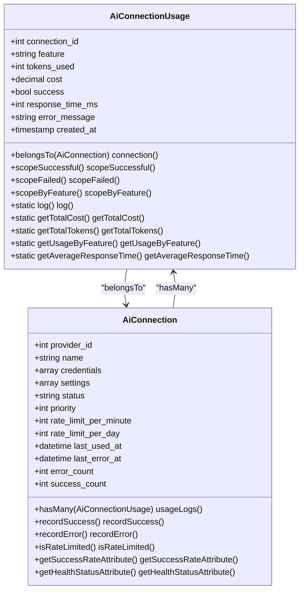
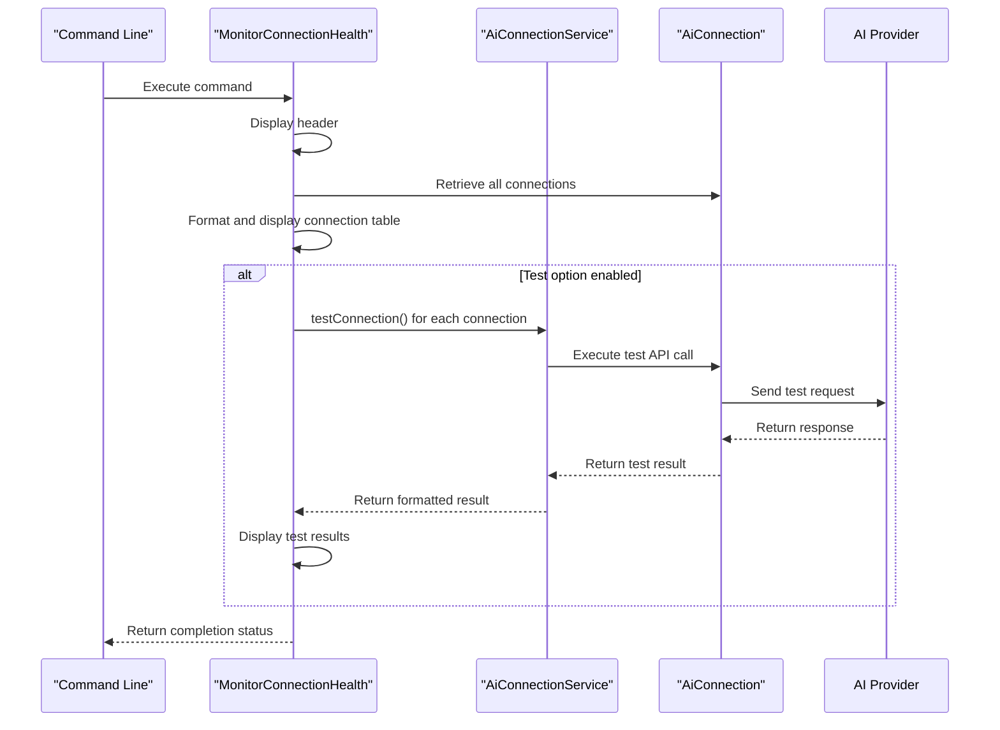
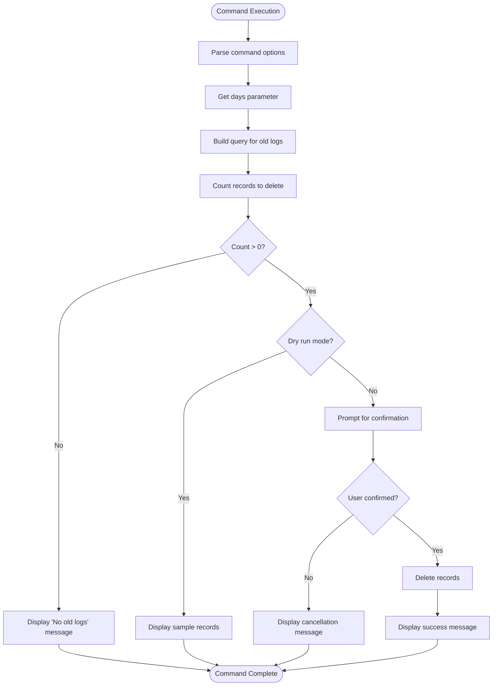
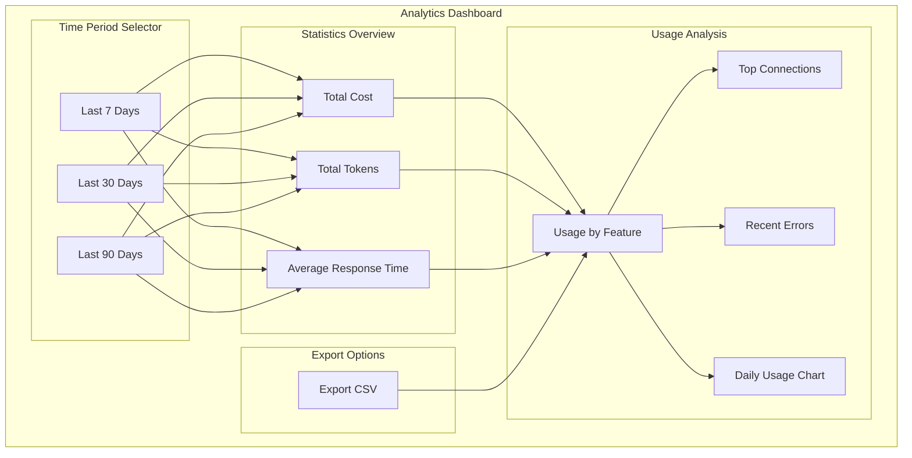

# Usage Analytics and Monitoring

<cite>
**Referenced Files in This Document**   
- [AiConnectionUsage.php](file://main/addons/ai-connection-addon/App/Models/AiConnectionUsage.php)
- [AiConnection.php](file://main/addons/ai-connection-addon/App/Models/AiConnection.php)
- [MonitorConnectionHealth.php](file://main/addons/ai-connection-addon/App/Console/Commands/MonitorConnectionHealth.php)
- [CleanupUsageLogs.php](file://main/addons/ai-connection-addon/App/Console/Commands/CleanupUsageLogs.php)
- [UsageAnalyticsController.php](file://main/addons/ai-connection-addon/App/Http/Controllers/Backend/UsageAnalyticsController.php)
- [AiConnectionService.php](file://main/addons/ai-connection-addon/App/Services/AiConnectionService.php)
- [index.blade.php](file://main/addons/ai-connection-addon/resources/views/backend/analytics/index.blade.php)
- [connection.blade.php](file://main/addons/ai-connection-addon/resources/views/backend/analytics/connection.blade.php)
- [create_ai_connection_usage_table.php](file://main/addons/ai-connection-addon/database/migrations/2025_12_03_100002_create_ai_connection_usage_table.php)
</cite>

## Table of Contents
1. [Introduction](#introduction)
2. [AiConnectionUsage Model](#aiconnectionusage-model)
3. [MonitorConnectionHealth Command](#monitorconnectionhealth-command)
4. [CleanupUsageLogs Command](#cleanupusagelogs-command)
5. [Usage Analytics Dashboard](#usage-analytics-dashboard)
6. [Rate Limiting and Cost Tracking](#rate-limiting-and-cost-tracking)
7. [Performance Optimization](#performance-optimization)
8. [Monitoring Configuration](#monitoring-configuration)
9. [Conclusion](#conclusion)

## Introduction
The Usage Analytics and Monitoring system provides comprehensive tracking and analysis of AI API usage across the platform. This system captures detailed metrics on request volume, token consumption, response times, and error rates through the AiConnectionUsage model. It includes automated health monitoring via the MonitorConnectionHealth command and data retention management through the CleanupUsageLogs command. The analytics framework supports capacity planning, cost tracking, and performance optimization, with a user-friendly admin dashboard for visualizing usage patterns and detecting anomalies.

**Section sources**
- [AiConnectionUsage.php](file://main/addons/ai-connection-addon/App/Models/AiConnectionUsage.php)
- [index.blade.php](file://main/addons/ai-connection-addon/resources/views/backend/analytics/index.blade.php)

## AiConnectionUsage Model
The AiConnectionUsage model captures comprehensive metrics for all AI API interactions across the platform. This model serves as the foundation for usage analytics, cost tracking, and performance monitoring.

### Data Structure
The model stores the following key metrics:
- **connection_id**: Foreign key linking to the specific AI connection used
- **feature**: The AI feature utilized (e.g., 'signal_parsing', 'market_analysis', 'translation')
- **tokens_used**: Number of tokens consumed in the API call
- **cost**: Monetary cost of the API call in USD
- **success**: Boolean indicating whether the API call succeeded
- **response_time_ms**: Response time in milliseconds
- **error_message**: Error details if the API call failed
- **created_at**: Timestamp of the API call



**Diagram sources**
- [AiConnectionUsage.php](file://main/addons/ai-connection-addon/App/Models/AiConnectionUsage.php)
- [AiConnection.php](file://main/addons/ai-connection-addon/App/Models/AiConnection.php)

### Key Methods and Functionality
The AiConnectionUsage model provides several static methods for analytics:
- **log()**: Creates a new usage record with connection ID, feature, tokens used, cost, success status, response time, and error message
- **getTotalCost()**: Calculates total cost for a specific connection or across all connections within a time period
- **getTotalTokens()**: Calculates total tokens used for a specific connection or across all connections within a time period
- **getUsageByFeature()**: Returns usage statistics grouped by feature, including count, tokens, and cost
- **getAverageResponseTime()**: Calculates average response time for successful API calls

The model includes several query scopes for filtering:
- **scopeSuccessful()**: Filters for successful API calls only
- **scopeFailed()**: Filters for failed API calls only
- **scopeByFeature()**: Filters by specific AI feature
- **scopeByConnection()**: Filters by specific connection ID
- **scopeRecent()**: Filters for usage within a specified number of days
- **scopeToday()**: Filters for today's usage only

**Section sources**
- [AiConnectionUsage.php](file://main/addons/ai-connection-addon/App/Models/AiConnectionUsage.php)
- [create_ai_connection_usage_table.php](file://main/addons/ai-connection-addon/database/migrations/2025_12_03_100002_create_ai_connection_usage_table.php)

## MonitorConnectionHealth Command
The MonitorConnectionHealth command performs periodic health checks on all AI connections and updates their status based on performance metrics.

### Command Implementation
The command provides the following functionality:
- **Health monitoring**: Checks the status of all AI connections
- **Connection testing**: Optionally runs test API calls to verify connectivity
- **Status reporting**: Displays connection status, success rate, and health metrics
- **Provider filtering**: Allows filtering by specific provider using the --provider option
- **Test execution**: Runs actual API tests using the --test option



**Diagram sources**
- [MonitorConnectionHealth.php](file://main/addons/ai-connection-addon/App/Console/Commands/MonitorConnectionHealth.php)
- [AiConnectionService.php](file://main/addons/ai-connection-addon/App/Services/AiConnectionService.php)

### Health Status Determination
The command evaluates connection health based on several factors:
- **Status**: Active, inactive, or error state
- **Success rate**: Percentage of successful API calls
- **Error count**: Number of recent errors
- **Last used**: Time since last successful usage

The output includes key metrics for each connection:
- **ID**: Unique connection identifier
- **Provider**: AI provider name (e.g., OpenAI, Gemini)
- **Name**: Connection name
- **Status**: Current status (Active, Inactive, Error)
- **Priority**: Connection priority level
- **Success Rate**: Percentage of successful API calls
- **Health**: Health status (Healthy, Degraded, Warning, Critical)
- **Last Used**: Time since last usage

**Section sources**
- [MonitorConnectionHealth.php](file://main/addons/ai-connection-addon/App/Console/Commands/MonitorConnectionHealth.php)

## CleanupUsageLogs Command
The CleanupUsageLogs command manages data retention and database size by removing old usage logs.

### Command Implementation
The command provides the following functionality:
- **Age-based deletion**: Removes logs older than a specified number of days (default: 30)
- **Dry run mode**: Shows what would be deleted without actually deleting
- **Interactive confirmation**: Prompts for confirmation before deletion
- **Count reporting**: Reports the number of records to be deleted



**Diagram sources**
- [CleanupUsageLogs.php](file://main/addons/ai-connection-addon/App/Console/Commands/CleanupUsageLogs.php)

### Configuration and Usage
The command accepts the following options:
- **--days**: Number of days to retain logs (default: 30)
- **--dry-run**: Show what would be deleted without actually deleting

Example usage:
```bash
# Delete logs older than 30 days (default)
php artisan ai-connections:cleanup-usage

# Delete logs older than 90 days
php artisan ai-connections:cleanup-usage --days=90

# Show what would be deleted without actually deleting
php artisan ai-connections:cleanup-usage --dry-run
```

The command first counts the number of records that would be deleted, then prompts for confirmation before proceeding with the deletion. In dry run mode, it displays a sample of the records that would be deleted.

**Section sources**
- [CleanupUsageLogs.php](file://main/addons/ai-connection-addon/App/Console/Commands/CleanupUsageLogs.php)

## Usage Analytics Dashboard
The Usage Analytics Dashboard provides a comprehensive view of AI API usage patterns through the admin interface.

### Dashboard Components
The dashboard includes the following key components:
- **Overall statistics**: Total cost, total tokens, and average response time
- **Usage by feature**: Breakdown of usage by AI feature
- **Top connections**: Connections with highest usage volume
- **Recent errors**: List of recent failed API calls
- **Daily usage chart**: Visual representation of usage over time



**Diagram sources**
- [index.blade.php](file://main/addons/ai-connection-addon/resources/views/backend/analytics/index.blade.php)
- [UsageAnalyticsController.php](file://main/addons/ai-connection-addon/App/Http/Controllers/Backend/UsageAnalyticsController.php)

### Connection-Specific Analytics
The dashboard also provides detailed analytics for individual connections:
- **Total requests**: Number of API calls made
- **Success rate**: Percentage of successful API calls
- **Total cost**: Monetary cost of API usage
- **Average response time**: Average time to receive API responses
- **Recent usage**: Table of recent API calls with details
- **Daily usage chart**: Visual representation of daily usage patterns

The connection-specific view allows administrators to drill down into the performance and usage patterns of individual AI connections, helping identify underperforming connections or usage spikes.

**Section sources**
- [index.blade.php](file://main/addons/ai-connection-addon/resources/views/backend/analytics/index.blade.php)
- [connection.blade.php](file://main/addons/ai-connection-addon/resources/views/backend/analytics/connection.blade.php)
- [UsageAnalyticsController.php](file://main/addons/ai-connection-addon/App/Http/Controllers/Backend/UsageAnalyticsController.php)

## Rate Limiting and Cost Tracking
The system implements comprehensive rate limiting and cost tracking to ensure sustainable API usage and accurate cost accounting.

### Rate Limiting Implementation
Rate limiting is implemented at the connection level with the following features:
- **Per-minute limits**: Configurable rate limits per minute
- **Per-day limits**: Configurable rate limits per day
- **Automatic rotation**: When a connection is rate limited, the system automatically rotates to an alternative connection
- **Usage tracking**: Real-time tracking of API calls within the current minute

The AiConnection model includes an `isRateLimited()` method that checks if the number of recent API calls exceeds the configured rate limit per minute. This method queries the usage logs for calls made within the last minute and compares the count to the connection's rate limit.

### Cost Tracking Implementation
Cost tracking is implemented through the AiConnectionUsage model with the following features:
- **Cost calculation**: Automatic calculation of API call costs
- **Cost aggregation**: Summation of costs by connection, feature, and time period
- **Cost reporting**: Display of total costs in the analytics dashboard

The system tracks costs at the individual API call level and provides aggregation methods to calculate total costs over specific time periods. This enables accurate cost accounting and budgeting for AI API usage.

**Section sources**
- [AiConnection.php](file://main/addons/ai-connection-addon/App/Models/AiConnection.php)
- [AiConnectionUsage.php](file://main/addons/ai-connection-addon/App/Models/AiConnectionUsage.php)
- [AiConnectionService.php](file://main/addons/ai-connection-addon/App/Services/AiConnectionService.php)

## Performance Optimization
The system includes several performance optimization features to ensure efficient API usage and high availability.

### Connection Rotation
The system implements automatic connection rotation to optimize performance:
- **Load balancing**: Distributes API calls across multiple connections
- **Failover**: Automatically switches to alternative connections when errors occur
- **Rate limit avoidance**: Rotates connections before rate limits are reached
- **Health-based routing**: Prefers connections with higher success rates

The AiConnectionService handles connection rotation through its getNextConnection() method, which selects the next available connection based on priority and health status. When a connection fails or is rate limited, the service automatically attempts to use an alternative connection.

### Caching and Indexing
The system uses database indexing to optimize analytics queries:
- **Time-based indexes**: Indexes on created_at for time-based queries
- **Connection indexes**: Indexes on connection_id for connection-specific queries
- **Feature indexes**: Indexes on feature for feature-based queries
- **Success indexes**: Indexes on success for success/failure analysis

These indexes ensure that analytics queries perform efficiently even with large volumes of usage data.

**Section sources**
- [AiConnectionService.php](file://main/addons/ai-connection-addon/App/Services/AiConnectionService.php)
- [create_ai_connection_usage_table.php](file://main/addons/ai-connection-addon/database/migrations/2025_12_03_100002_create_ai_connection_usage_table.php)

## Monitoring Configuration
The system provides flexible configuration options for monitoring thresholds and alerting mechanisms.

### Configuration Options
The system can be configured through the following parameters:
- **Data retention**: Number of days to retain usage logs
- **Rate limits**: Per-minute and per-day rate limits for each connection
- **Health thresholds**: Error counts that trigger status changes
- **Monitoring frequency**: How often to run health checks

### Alerting Mechanisms
The system supports alerting through the following mechanisms:
- **Command-line output**: Health status displayed in the MonitorConnectionHealth command
- **Log entries**: Error details logged for troubleshooting
- **Dashboard indicators**: Visual indicators of connection health in the admin dashboard
- **Email notifications**: Potential integration with email notification system

Administrators can configure monitoring by scheduling the MonitorConnectionHealth command to run at regular intervals using the system's task scheduler. The CleanupUsageLogs command can also be scheduled to automatically manage data retention.

**Section sources**
- [MonitorConnectionHealth.php](file://main/addons/ai-connection-addon/App/Console/Commands/MonitorConnectionHealth.php)
- [CleanupUsageLogs.php](file://main/addons/ai-connection-addon/App/Console/Commands/CleanupUsageLogs.php)

## Conclusion
The Usage Analytics and Monitoring system provides a comprehensive solution for tracking and analyzing AI API usage across the platform. The AiConnectionUsage model captures detailed metrics on request volume, token consumption, response times, and error rates, enabling accurate cost tracking and performance analysis. The MonitorConnectionHealth command ensures connection reliability through periodic health checks, while the CleanupUsageLogs command manages data retention and database size. The admin dashboard provides intuitive visualization of usage patterns, helping administrators identify trends, detect anomalies, and plan capacity. Together, these components create a robust monitoring framework that supports rate limit enforcement, cost tracking, and performance optimization, ensuring reliable and efficient AI API usage.