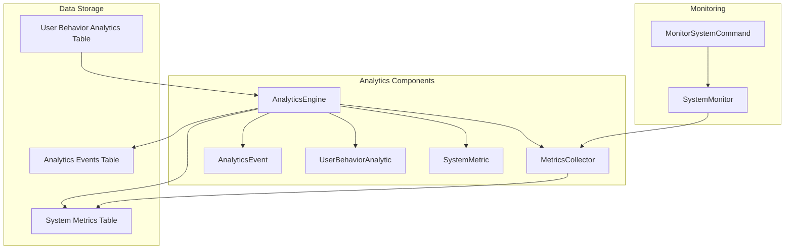
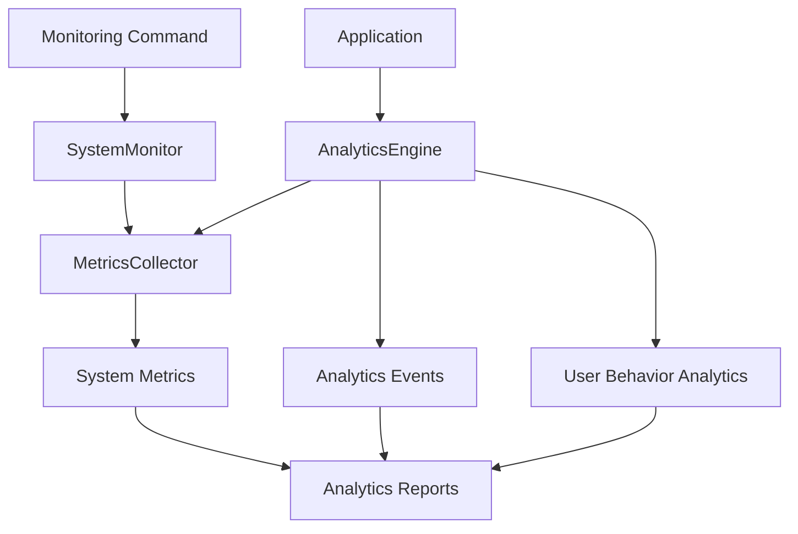
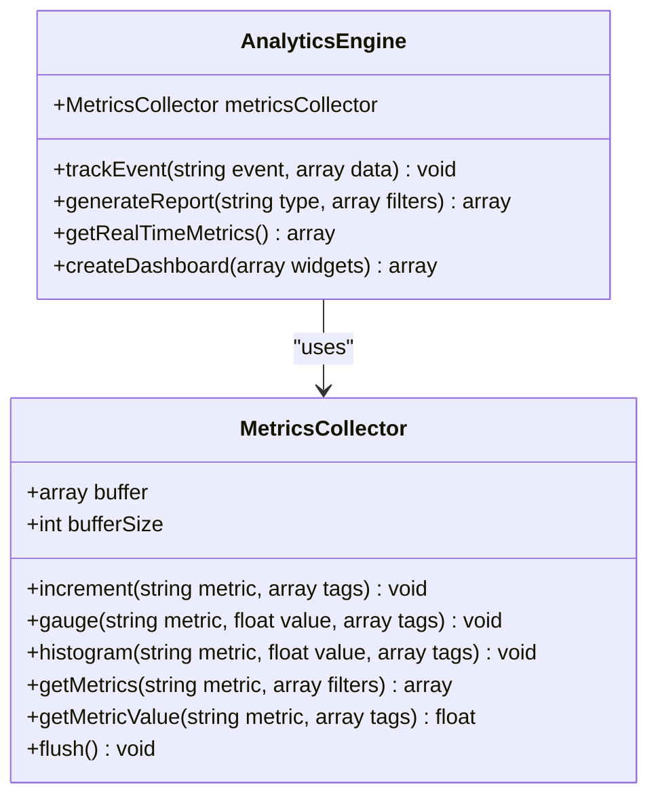
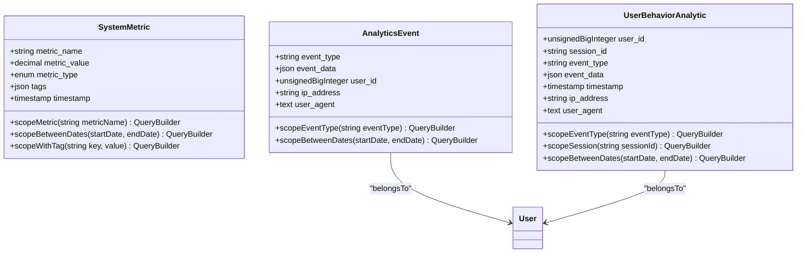
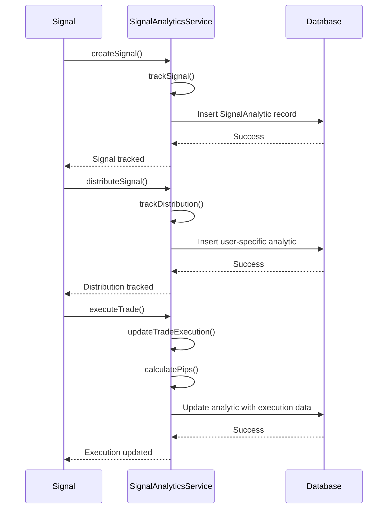
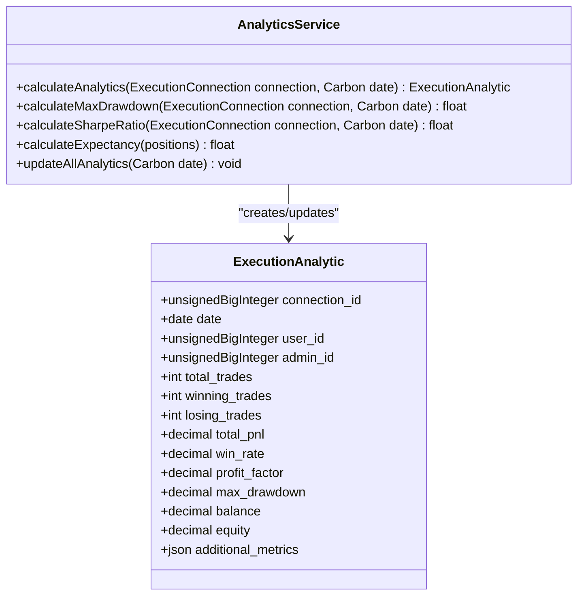

# Analytics Engine

<cite>
**Referenced Files in This Document**   
- [AnalyticsEngine.php](file://main/app/Services/Analytics/AnalyticsEngine.php)
- [MetricsCollector.php](file://main/app/Services/Analytics/MetricsCollector.php)
- [SystemMetric.php](file://main/app/Models/SystemMetric.php)
- [AnalyticsEvent.php](file://main/app/Models/AnalyticsEvent.php)
- [UserBehaviorAnalytic.php](file://main/app/Models/UserBehaviorAnalytic.php)
- [SignalAnalyticsService.php](file://main/addons/multi-channel-signal-addon/app/Services/SignalAnalyticsService.php)
- [AnalyticsService.php](file://main/addons/trading-management-addon/Modules/PositionMonitoring/Services/AnalyticsService.php)
- [AiUsageAnalyticsSeeder.php](file://main/database/seeders/AiUsageAnalyticsSeeder.php)
- [create_system_metrics_table.php](file://main/database/migrations/2025_12_12_142800_create_system_metrics_table.php)
- [create_analytics_events_table.php](file://main/database/migrations/2025_12_12_142802_create_analytics_events_table.php)
- [create_user_behavior_analytics_table.php](file://main/database/migrations/2025_12_12_142801_create_user_behavior_analytics_table.php)
- [SystemMonitor.php](file://main/app/Services/Monitoring/SystemMonitor.php)
- [MonitorSystemCommand.php](file://main/app/Console/Commands/MonitorSystemCommand.php)
</cite>

## Table of Contents
1. [Introduction](#introduction)
2. [Project Structure](#project-structure)
3. [Core Components](#core-components)
4. [Architecture Overview](#architecture-overview)
5. [Detailed Component Analysis](#detailed-component-analysis)
6. [Dependency Analysis](#dependency-analysis)
7. [Performance Considerations](#performance-considerations)
8. [Troubleshooting Guide](#troubleshooting-guide)
9. [Conclusion](#conclusion)

## Introduction
The Analytics Engine is a comprehensive system designed to track, analyze, and report on various aspects of the trading platform's operations. It encompasses user behavior tracking, system performance monitoring, signal analytics, and AI usage metrics. The engine provides real-time insights and historical reporting capabilities to support data-driven decision making for both administrators and users.

## Project Structure
The Analytics Engine is organized across multiple directories within the main application, with core services located in the `app/Services/Analytics` namespace. The system leverages dedicated database tables for storing different types of analytics data, with corresponding models and migrations. Addon-specific analytics services are located within their respective addon directories, following a modular architecture.



**Diagram sources**
- [AnalyticsEngine.php](file://main/app/Services/Analytics/AnalyticsEngine.php)
- [MetricsCollector.php](file://main/app/Services/Analytics/MetricsCollector.php)
- [SystemMetric.php](file://main/app/Models/SystemMetric.php)
- [AnalyticsEvent.php](file://main/app/Models/AnalyticsEvent.php)
- [UserBehaviorAnalytic.php](file://main/app/Models/UserBehaviorAnalytic.php)
- [SystemMonitor.php](file://main/app/Services/Monitoring/SystemMonitor.php)
- [MonitorSystemCommand.php](file://main/app/Console/Commands/MonitorSystemCommand.php)

**Section sources**
- [AnalyticsEngine.php](file://main/app/Services/Analytics/AnalyticsEngine.php)
- [MetricsCollector.php](file://main/app/Services/Analytics/MetricsCollector.php)
- [SystemMetric.php](file://main/app/Models/SystemMetric.php)

## Core Components
The Analytics Engine consists of several core components that work together to collect, process, and report analytics data. The primary components include the AnalyticsEngine service, MetricsCollector for system metrics, and various analytics models for storing different types of data. The system also includes specialized analytics services for specific domains such as signal processing and position monitoring.

**Section sources**
- [AnalyticsEngine.php](file://main/app/Services/Analytics/AnalyticsEngine.php)
- [MetricsCollector.php](file://main/app/Services/Analytics/MetricsCollector.php)
- [SystemMetric.php](file://main/app/Models/SystemMetric.php)

## Architecture Overview
The Analytics Engine follows a layered architecture with clear separation of concerns. At the core is the AnalyticsEngine service that coordinates analytics operations, supported by the MetricsCollector for system-level metrics. Data is stored in dedicated tables with appropriate indexing for performance. The system uses a buffered approach for metrics collection to optimize database operations, with periodic flushing to persistent storage.



**Diagram sources**
- [AnalyticsEngine.php](file://main/app/Services/Analytics/AnalyticsEngine.php)
- [MetricsCollector.php](file://main/app/Services/Analytics/MetricsCollector.php)
- [SystemMetric.php](file://main/app/Models/SystemMetric.php)
- [AnalyticsEvent.php](file://main/app/Models/AnalyticsEvent.php)
- [UserBehaviorAnalytic.php](file://main/app/Models/UserBehaviorAnalytic.php)
- [SystemMonitor.php](file://main/app/Services/Monitoring/SystemMonitor.php)
- [MonitorSystemCommand.php](file://main/app/Console/Commands/MonitorSystemCommand.php)

## Detailed Component Analysis

### Analytics Engine Service
The AnalyticsEngine service is the central component responsible for coordinating all analytics operations. It provides methods for tracking events, generating reports, and retrieving real-time metrics. The service uses caching to improve performance for frequently accessed data.

#### Class Diagram


**Diagram sources**
- [AnalyticsEngine.php](file://main/app/Services/Analytics/AnalyticsEngine.php)
- [MetricsCollector.php](file://main/app/Services/Analytics/MetricsCollector.php)

**Section sources**
- [AnalyticsEngine.php](file://main/app/Services/Analytics/AnalyticsEngine.php)
- [MetricsCollector.php](file://main/app/Services/Analytics/MetricsCollector.php)

### Data Models
The Analytics Engine uses several database models to store different types of analytics data. These models are designed with appropriate relationships, accessors, and query scopes to facilitate efficient data retrieval and analysis.

#### Class Diagram


**Diagram sources**
- [SystemMetric.php](file://main/app/Models/SystemMetric.php)
- [AnalyticsEvent.php](file://main/app/Models/AnalyticsEvent.php)
- [UserBehaviorAnalytic.php](file://main/app/Models/UserBehaviorAnalytic.php)

**Section sources**
- [SystemMetric.php](file://main/app/Models/SystemMetric.php)
- [AnalyticsEvent.php](file://main/app/Models/AnalyticsEvent.php)
- [UserBehaviorAnalytic.php](file://main/app/Models/UserBehaviorAnalytic.php)

### Signal Analytics Service
The SignalAnalyticsService provides specialized analytics for trading signals, tracking signal creation, distribution, and execution performance. It calculates key metrics such as win rate, profit/loss, and pips for both individual signals and aggregated data.

#### Sequence Diagram


**Diagram sources**
- [SignalAnalyticsService.php](file://main/addons/multi-channel-signal-addon/app/Services/SignalAnalyticsService.php)

**Section sources**
- [SignalAnalyticsService.php](file://main/addons/multi-channel-signal-addon/app/Services/SignalAnalyticsService.php)

### Position Monitoring Analytics
The PositionMonitoring AnalyticsService calculates performance metrics for trading positions, including win rate, profit factor, maximum drawdown, and Sharpe ratio. It provides comprehensive analytics for execution connections and their trading performance.

#### Class Diagram


**Diagram sources**
- [AnalyticsService.php](file://main/addons/trading-management-addon/Modules/PositionMonitoring/Services/AnalyticsService.php)

**Section sources**
- [AnalyticsService.php](file://main/addons/trading-management-addon/Modules/PositionMonitoring/Services/AnalyticsService.php)

## Dependency Analysis
The Analytics Engine has dependencies on several core Laravel components and application services. It relies on the database layer for persistent storage, the caching system for performance optimization, and the logging system for monitoring its own operations. The engine also depends on Carbon for date/time operations and interacts with various models across the application.

```mermaid
graph TD
A[AnalyticsEngine] --> B[Illuminate\Support\Facades\DB]
A --> C[Illuminate\Support\Facades\Cache]
A --> D[Illuminate\Support\Facades\Log]
A --> E[Carbon\Carbon]
A --> F[App\Models\User]
A --> G[App\Models\Signal]
A --> H[App\Services\Analytics\MetricsCollector]
I[MetricsCollector] --> B
I --> C
I --> E
J[SystemMonitor] --> H
J --> K[config('monitoring')]
```

**Diagram sources**
- [AnalyticsEngine.php](file://main/app/Services/Analytics/AnalyticsEngine.php)
- [MetricsCollector.php](file://main/app/Services/Analytics/MetricsCollector.php)
- [SystemMonitor.php](file://main/app/Services/Monitoring/SystemMonitor.php)

**Section sources**
- [AnalyticsEngine.php](file://main/app/Services/Analytics/AnalyticsEngine.php)
- [MetricsCollector.php](file://main/app/Services/Analytics/MetricsCollector.php)
- [SystemMonitor.php](file://main/app/Services/Monitoring/SystemMonitor.php)

## Performance Considerations
The Analytics Engine is designed with performance in mind, implementing several optimization strategies. The MetricsCollector uses a buffering system to batch database writes, reducing the number of individual insert operations. The system leverages caching extensively, with both in-memory caching for frequently accessed metrics and database-level indexing for efficient querying. Analytics reports are cached for one hour to prevent redundant calculations.

The database schema includes strategic indexing on commonly queried fields such as metric_name, timestamp, and user_id to ensure fast data retrieval. The system also implements data retention policies, with older metrics being cleaned up automatically after a configurable period (default 90 days).

**Section sources**
- [MetricsCollector.php](file://main/app/Services/Analytics/MetricsCollector.php)
- [create_system_metrics_table.php](file://main/database/migrations/2025_12_12_142800_create_system_metrics_table.php)
- [AnalyticsEngine.php](file://main/app/Services/Analytics/AnalyticsEngine.php)

## Troubleshooting Guide
When troubleshooting issues with the Analytics Engine, consider the following common scenarios:

1. **Missing metrics data**: Verify that the MetricsCollector buffer is being flushed properly. Check if the buffer size threshold is being reached or if there are errors during the flush operation.

2. **Slow report generation**: Ensure that the cache is functioning correctly and that report data is being cached as expected. Check for any database performance issues with the analytics tables.

3. **Inaccurate analytics calculations**: Verify that the source data is being recorded correctly and that all required fields are populated. Check for any issues with date/time calculations or data aggregation logic.

4. **High database load**: Monitor the frequency of metrics inserts and consider adjusting the buffer size or flush interval. Ensure that appropriate indexes exist on the analytics tables.

**Section sources**
- [MetricsCollector.php](file://main/app/Services/Analytics/MetricsCollector.php)
- [AnalyticsEngine.php](file://main/app/Services/Analytics/AnalyticsEngine.php)
- [SystemMonitor.php](file://main/app/Services/Monitoring/SystemMonitor.php)

## Conclusion
The Analytics Engine provides a comprehensive framework for tracking and analyzing various aspects of the trading platform. Its modular design allows for extensibility, with core services that can be extended or customized for specific analytics needs. The system balances real-time monitoring with historical reporting capabilities, providing valuable insights for both operational monitoring and strategic decision making. With its robust architecture and performance optimizations, the Analytics Engine serves as a critical component for understanding platform usage, user behavior, and trading performance.