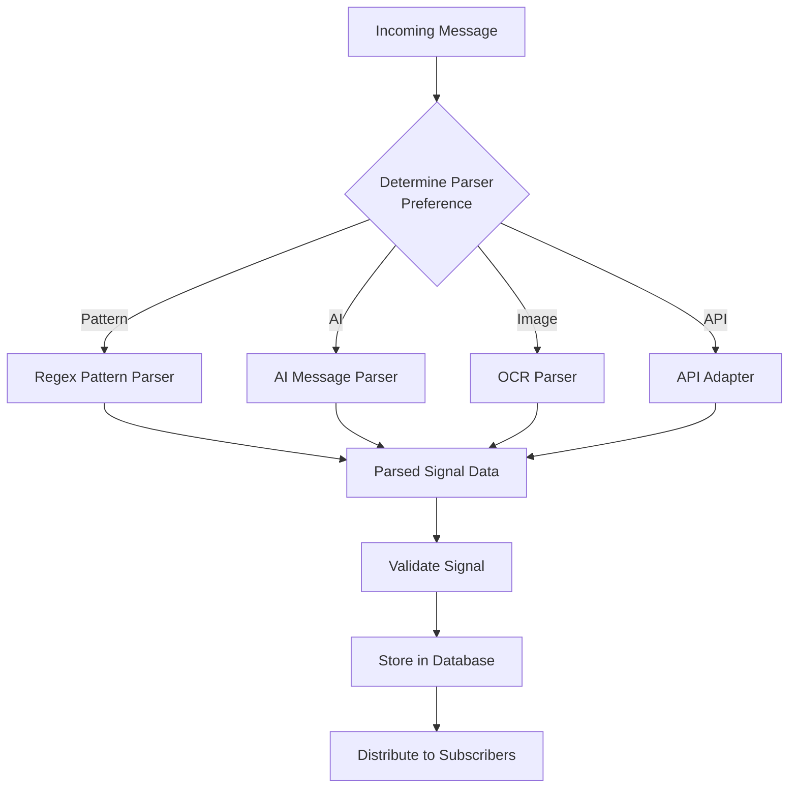
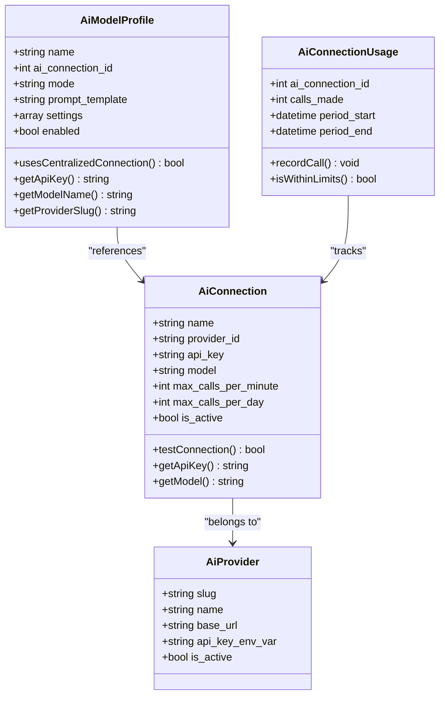
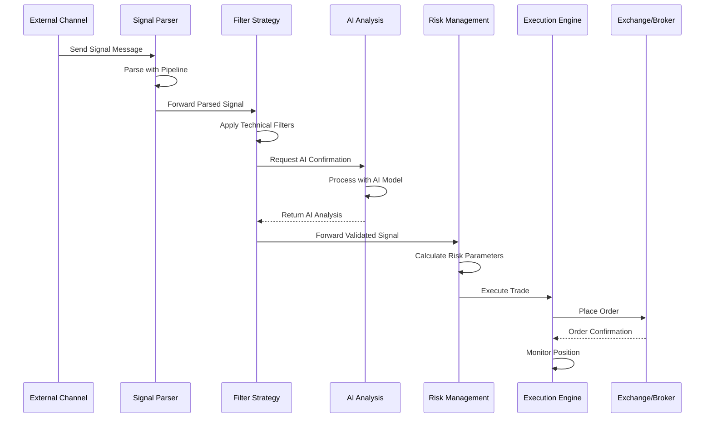

# Core Modules

<cite>
**Referenced Files in This Document**   
- [trading-management-addon/addon.json](file://main/addons/trading-management-addon/addon.json)
- [multi-channel-signal-addon/addon.json](file://main/addons/multi-channel-signal-addon/addon.json)
- [ai-connection-addon/addon.json](file://main/addons/ai-connection-addon/addon.json)
- [trading-management-addon/AddonServiceProvider.php](file://main/addons/trading-management-addon/AddonServiceProvider.php)
- [multi-channel-signal-addon/AddonServiceProvider.php](file://main/addons/multi-channel-signal-addon/AddonServiceProvider.php)
- [ai-connection-addon/AddonServiceProvider.php](file://main/addons/ai-connection-addon/AddonServiceProvider.php)
- [trading-management-addon/config/trading-management.php](file://main/addons/trading-management-addon/config/trading-management.php)
- [trading-management-addon/Modules/DataProvider/Services/DataConnectionService.php](file://main/addons/trading-management-addon/Modules/DataProvider/Services/DataConnectionService.php)
- [trading-management-addon/Modules/AiAnalysis/Models/AiModelProfile.php](file://main/addons/trading-management-addon/Modules/AiAnalysis/Models/AiModelProfile.php)
- [multi-channel-signal-addon/app/Parsers/ParsingPipeline.php](file://main/addons/multi-channel-signal-addon/app/Parsers/ParsingPipeline.php)
- [ai-connection-addon/App/Services/AiConnectionService.php](file://main/addons/ai-connection-addon/App/Services/AiConnectionService.php)
</cite>

## Table of Contents
1. [Trading Management Module](#trading-management-module)
2. [Multi-Channel Signal Processing Module](#multi-channel-signal-processing-module)
3. [AI Integration Module](#ai-integration-module)
4. [Integration and Workflow](#integration-and-workflow)
5. [Configuration and Administration](#configuration-and-administration)

## Trading Management Module

The Trading Management module serves as the central system for unified trading operations, providing comprehensive functionality for data feeding, filtering, AI analysis, risk management, trade execution, and backtesting. This module is structured as a collection of interconnected sub-modules that work together to enable automated trading workflows.

The module architecture follows a dependency-based design where each component builds upon the capabilities of previous ones. The core components include:

- **Data Provider**: Establishes connections to market data sources including mtapi.io and CCXT exchanges
- **Market Data Storage**: Centralizes market data with caching and cleanup mechanisms
- **Filter Strategy**: Applies technical indicator-based filtering using EMA, RSI, and PSAR
- **AI Analysis**: Leverages AI models for market confirmation and analysis
- **Risk Management**: Implements both manual presets and AI adaptive risk (Smart Risk)
- **Trade Execution**: Executes trades on exchanges and brokers through CCXT and mtapi.io
- **Position Monitoring**: Tracks positions with SL/TP monitoring and analytics calculation
- **Copy Trading**: Enables social trading by allowing users to follow other traders
- **Backtesting**: Tests strategies against historical data
- **Exchange Connection**: Manages unified exchange/broker connections
- **Trading Bot**: Provides automated trading bot management and execution

The module is configured through the `trading-management.php` configuration file, which defines key parameters such as data retention policies, API timeouts, risk percentages, and monitoring intervals. The system uses environment variables for sensitive configuration values, allowing for secure deployment across different environments.

**Section sources**
- [trading-management-addon/addon.json](file://main/addons/trading-management-addon/addon.json)
- [trading-management-addon/AddonServiceProvider.php](file://main/addons/trading-management-addon/AddonServiceProvider.php)
- [trading-management-addon/config/trading-management.php](file://main/addons/trading-management-addon/config/trading-management.php)

## Multi-Channel Signal Processing Module

The Multi-Channel Signal Processing module enables automatic ingestion of trading signals from external channels into the platform. This addon processes messages from various sources including Telegram, RSS feeds, web scraping, and API endpoints, converting them into structured trading signals.

The signal processing pipeline operates through a sophisticated parsing system that determines the optimal method for extracting trading information from incoming messages. The system supports multiple parsing strategies:

- **Pattern-based parsing**: Uses predefined regex patterns to extract signal data
- **AI-powered parsing**: Leverages AI models to interpret complex signal formats
- **OCR parsing**: Extracts text from images containing trading signals
- **Custom API parsing**: Processes structured data from API endpoints

The parsing pipeline is implemented as a priority-based system where multiple parsers are registered and executed in order of priority. Each parser evaluates its ability to process a message and returns a confidence score. The system selects the parse result with the highest confidence, ensuring optimal accuracy across diverse signal formats.

Channel sources can be configured with specific parser preferences, allowing administrators to optimize processing for different signal providers. The system also supports global parsing profiles that can be applied across multiple channels.

**Diagram sources**
- [multi-channel-signal-addon/addon.json](file://main/addons/multi-channel-signal-addon/addon.json)
- [multi-channel-signal-addon/app/Parsers/ParsingPipeline.php](file://main/addons/multi-channel-signal-addon/app/Parsers/ParsingPipeline.php)

**Section sources**
- [multi-channel-signal-addon/addon.json](file://main/addons/multi-channel-signal-addon/addon.json)
- [multi-channel-signal-addon/AddonServiceProvider.php](file://main/addons/multi-channel-signal-addon/AddonServiceProvider.php)
- [multi-channel-signal-addon/app/Parsers/ParsingPipeline.php](file://main/addons/multi-channel-signal-addon/app/Parsers/ParsingPipeline.php)

## AI Integration Module

The AI Integration module provides centralized management of AI connections for all platform features. This addon serves as the foundation for AI-powered capabilities across the trading platform, offering credential management, connection rotation, rate limiting, and usage tracking for AI providers including OpenAI, Gemini, and OpenRouter.

The module architecture consists of three primary components:

1. **Admin Interface**: Provides administrative routes and views for managing AI connections, providers, and usage analytics
2. **Public API**: Offers a standardized interface for consumer addons to execute AI calls through centralized connections
3. **Connection Monitoring**: Implements background jobs for health checks, usage tracking, and rate limit monitoring

AI connections are managed through a service-oriented design where the `AiConnectionService` handles the lifecycle of AI provider connections. The system supports connection rotation to distribute load across multiple API keys and implements rate limiting to prevent exceeding provider quotas.

AI model configurations are stored in the `AiModelProfile` model, which defines the parameters for AI-powered market analysis. Each profile includes:
- Provider and model specifications
- Prompt templates for market analysis
- Usage limits (calls per minute/day)
- Visibility settings (public/private)
- Cloning permissions

The system prioritizes centralized connection management over individual API keys, allowing for efficient resource utilization and simplified administration. When an AI model profile references a centralized connection, it inherits the credentials and settings from that connection rather than using standalone API keys.

**Diagram sources**
- [ai-connection-addon/addon.json](file://main/addons/ai-connection-addon/addon.json)
- [ai-connection-addon/AddonServiceProvider.php](file://main/addons/ai-connection-addon/AddonServiceProvider.php)
- [trading-management-addon/Modules/AiAnalysis/Models/AiModelProfile.php](file://main/addons/trading-management-addon/Modules/AiAnalysis/Models/AiModelProfile.php)

**Section sources**
- [ai-connection-addon/addon.json](file://main/addons/ai-connection-addon/addon.json)
- [ai-connection-addon/AddonServiceProvider.php](file://main/addons/ai-connection-addon/AddonServiceProvider.php)
- [ai-connection-addon/App/Services/AiConnectionService.php](file://main/addons/ai-connection-addon/App/Services/AiConnectionService.php)
- [trading-management-addon/Modules/AiAnalysis/Models/AiModelProfile.php](file://main/addons/trading-management-addon/Modules/AiAnalysis/Models/AiModelProfile.php)

## Integration and Workflow

The three core modules work together to enable automated trading workflows through a well-defined integration architecture. The system processes trading signals from multiple channels, applies AI-powered analysis and risk management, and executes trades through connected exchanges.

The typical workflow begins with signal ingestion from external channels through the Multi-Channel Signal Processing module. Incoming messages are parsed using the configured parsing pipeline, which determines the optimal method for extracting trading information. The parsed signals are then validated and stored in the database.

Once a signal is processed, the Trading Management module takes over, applying various filters and analyses. The system first applies technical indicator-based filtering using EMA, RSI, and PSAR to validate the signal's technical merit. Then, the AI Integration module is invoked to perform AI-powered market confirmation, leveraging configured AI models to assess market conditions and provide additional validation.

After the signal passes both technical and AI analysis, the risk management system determines the appropriate position size and risk parameters. The execution engine then places the trade on the configured exchange or broker through the unified exchange connection system. Throughout the trade's lifecycle, the position monitoring system tracks performance, manages stop-loss and take-profit levels, and calculates analytics.

**Diagram sources**
- [trading-management-addon/AddonServiceProvider.php](file://main/addons/trading-management-addon/AddonServiceProvider.php)
- [multi-channel-signal-addon/app/Parsers/ParsingPipeline.php](file://main/addons/multi-channel-signal-addon/app/Parsers/ParsingPipeline.php)
- [ai-connection-addon/App/Services/AiConnectionService.php](file://main/addons/ai-connection-addon/App/Services/AiConnectionService.php)

**Section sources**
- [trading-management-addon/AddonServiceProvider.php](file://main/addons/trading-management-addon/AddonServiceProvider.php)
- [multi-channel-signal-addon/app/Parsers/ParsingPipeline.php](file://main/addons/multi-channel-signal-addon/app/Parsers/ParsingPipeline.php)
- [ai-connection-addon/App/Services/AiConnectionService.php](file://main/addons/ai-connection-addon/App/Services/AiConnectionService.php)

## Configuration and Administration

Each module can be enabled, configured, and monitored through the platform's admin interface. The configuration system uses a combination of JSON configuration files and database-stored settings, with environment variables for sensitive values.

For the Trading Management module, configuration is primarily handled through the `trading-management.php` file, which defines system-wide parameters for data retention, API timeouts, risk percentages, and monitoring intervals. Key configuration options include:

- **Data Provider Settings**: Fetch interval, data retention days, and cache TTL
- **mtapi.io Settings**: API key, base URL, and timeout configuration
- **MetaApi.cloud Settings**: API token, base URLs, and streaming parameters
- **Risk Management Settings**: Default and maximum risk percentages, lot size limits
- **Position Monitoring Settings**: Check interval and stop-loss buffer
- **Analytics Settings**: Update frequency and metrics retention
- **Backtesting Settings**: Maximum concurrent backtests and default period

The Multi-Channel Signal Processing module is configured through both database settings and configuration files. Administrators can configure parser preferences for individual channels or set global defaults. The system supports enabling/disabling specific parser types (AI, OCR, pattern-based) through configuration.

The AI Integration module provides comprehensive administration capabilities through its admin interface. Administrators can:
- Create and manage AI connections with different providers
- Configure AI model profiles with custom prompt templates
- Monitor usage statistics and rate limit compliance
- Set up connection rotation for load distribution
- View health status and error logs

All modules follow a consistent administration pattern with dedicated routes, views, and controllers for management tasks. The system uses Laravel's service provider pattern to register routes conditionally based on enabled modules, ensuring optimal performance by only loading necessary components.

**Section sources**
- [trading-management-addon/config/trading-management.php](file://main/addons/trading-management-addon/config/trading-management.php)
- [trading-management-addon/AddonServiceProvider.php](file://main/addons/trading-management-addon/AddonServiceProvider.php)
- [multi-channel-signal-addon/AddonServiceProvider.php](file://main/addons/multi-channel-signal-addon/AddonServiceProvider.php)
- [ai-connection-addon/AddonServiceProvider.php](file://main/addons/ai-connection-addon/AddonServiceProvider.php)