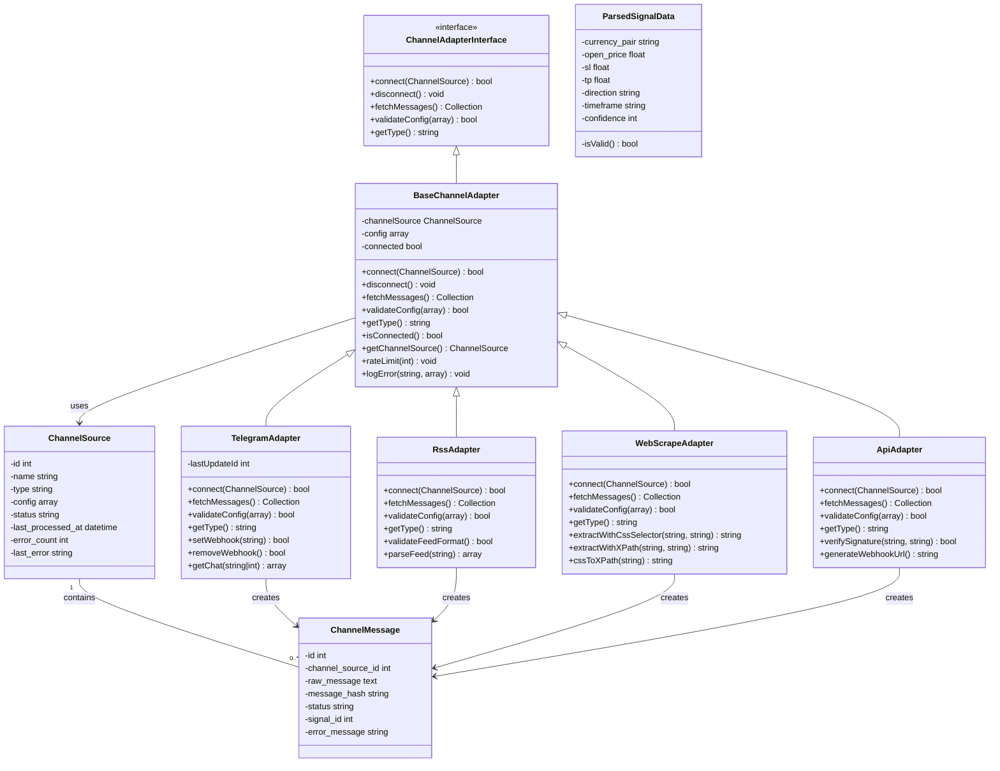
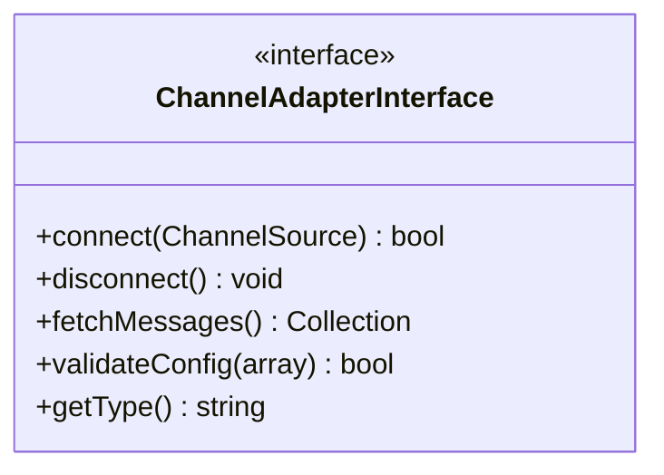
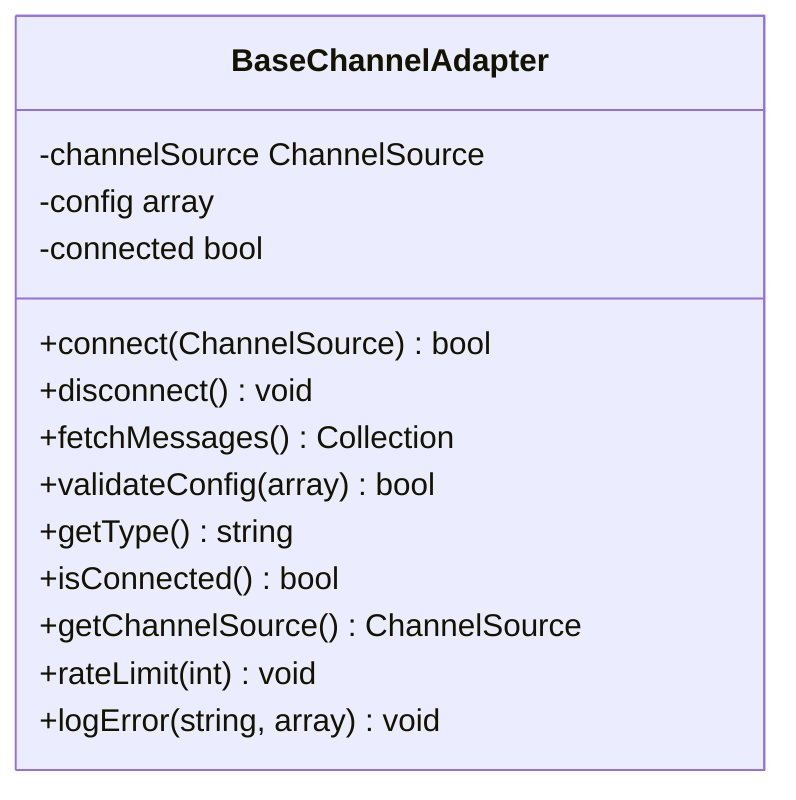
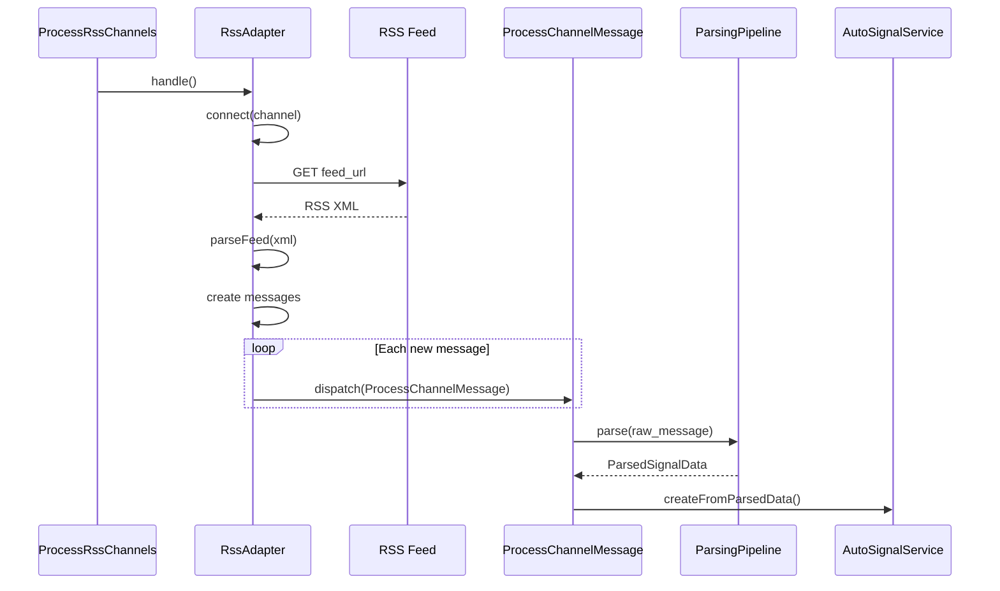
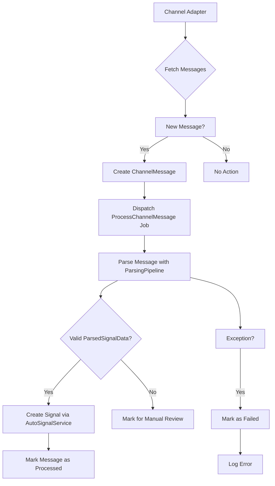
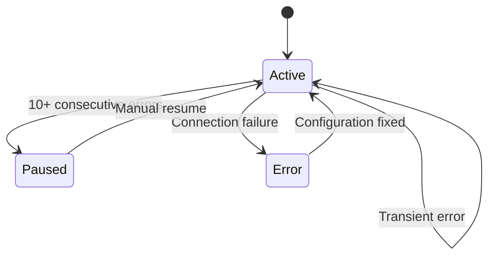

# Channel Adapters

<cite>
**Referenced Files in This Document**   
- [ChannelAdapterInterface.php](file://main/app/Contracts/ChannelAdapterInterface.php)
- [BaseChannelAdapter.php](file://main/app/Adapters/BaseChannelAdapter.php)
- [TelegramAdapter.php](file://main/app/Adapters/TelegramAdapter.php)
- [ApiAdapter.php](file://main/app/Adapters/ApiAdapter.php)
- [RssAdapter.php](file://main/app/Adapters/RssAdapter.php)
- [WebScrapeAdapter.php](file://main/app/Adapters/WebScrapeAdapter.php)
- [ChannelSource.php](file://main/app/Models/ChannelSource.php)
- [ParsedSignalData.php](file://main/app/DTOs/ParsedSignalData.php)
- [ProcessRssChannels.php](file://main/app/Console/Commands/ProcessRssChannels.php)
- [ProcessWebScrapeChannels.php](file://main/app/Console/Commands/ProcessWebScrapeChannels.php)
- [ProcessChannelMessage.php](file://main/app/Jobs/ProcessChannelMessage.php)
- [ChannelMessage.php](file://main/app/Models/ChannelMessage.php)
</cite>

## Table of Contents
1. [Introduction](#introduction)
2. [Architecture Overview](#architecture-overview)
3. [Core Components](#core-components)
4. [Detailed Component Analysis](#detailed-component-analysis)
5. [Adapter Implementation Details](#adapter-implementation-details)
6. [Message Processing Pipeline](#message-processing-pipeline)
7. [Configuration and Error Handling](#configuration-and-error-handling)
8. [Best Practices and Reliability](#best-practices-and-reliability)
9. [Conclusion](#conclusion)

## Introduction

The Channel Adapters system is a core component of the signal ingestion infrastructure, responsible for retrieving trading signals from diverse sources including Telegram, RSS feeds, web scraping, and API endpoints. This document provides a comprehensive analysis of the adapter architecture, implementation details, and integration with the message processing pipeline. The system follows a contract-based design through the `ChannelAdapterInterface`, ensuring consistent behavior across different adapter types while allowing for source-specific implementation details.

**Section sources**
- [ChannelAdapterInterface.php](file://main/app/Contracts/ChannelAdapterInterface.php)

## Architecture Overview

The Channel Adapters system follows a polymorphic adapter pattern with a base class providing shared functionality and concrete implementations for each source type. The architecture enables flexible signal ingestion from multiple sources while maintaining a consistent interface and processing pipeline.

**Diagram sources **
- [ChannelAdapterInterface.php](file://main/app/Contracts/ChannelAdapterInterface.php)
- [BaseChannelAdapter.php](file://main/app/Adapters/BaseChannelAdapter.php)
- [TelegramAdapter.php](file://main/app/Adapters/TelegramAdapter.php)
- [ApiAdapter.php](file://main/app/Adapters/ApiAdapter.php)
- [RssAdapter.php](file://main/app/Adapters/RssAdapter.php)
- [WebScrapeAdapter.php](file://main/app/Adapters/WebScrapeAdapter.php)
- [ChannelSource.php](file://main/app/Models/ChannelSource.php)
- [ChannelMessage.php](file://main/app/Models/ChannelMessage.php)
- [ParsedSignalData.php](file://main/app/DTOs/ParsedSignalData.php)

## Core Components

The Channel Adapters system consists of several core components that work together to ingest, process, and normalize trading signals from various sources. The system is built around the `ChannelAdapterInterface` contract, which defines the standard methods that all adapters must implement. The `BaseChannelAdapter` provides shared functionality such as error logging, configuration management, and rate limiting. Each concrete adapter (Telegram, API, RSS, Web Scraping) implements source-specific logic for connecting to the source, fetching messages, and handling authentication.

The `ChannelSource` model represents a configured signal source with its type, configuration, and status, while the `ChannelMessage` model stores the raw messages retrieved from sources before they are processed into trading signals. The `ParsedSignalData` DTO serves as a normalized data structure for extracted signal information, ensuring consistency across different source types.

**Section sources**
- [ChannelAdapterInterface.php](file://main/app/Contracts/ChannelAdapterInterface.php)
- [BaseChannelAdapter.php](file://main/app/Adapters/BaseChannelAdapter.php)
- [ChannelSource.php](file://main/app/Models/ChannelSource.php)
- [ChannelMessage.php](file://main/app/Models/ChannelMessage.php)
- [ParsedSignalData.php](file://main/app/DTOs/ParsedSignalData.php)

## Detailed Component Analysis

### Channel Adapter Interface

The `ChannelAdapterInterface` defines the contract that all channel adapters must follow, ensuring consistent behavior across different source types. The interface specifies five essential methods: `connect()` for establishing a connection to the source, `disconnect()` for cleaning up resources, `fetchMessages()` for retrieving new messages, `validateConfig()` for validating adapter configuration, and `getType()` for identifying the adapter type.

**Diagram sources **
- [ChannelAdapterInterface.php](file://main/app/Contracts/ChannelAdapterInterface.php)

### Base Channel Adapter

The `BaseChannelAdapter` provides shared functionality for all concrete adapters, including configuration management, error logging, and connection state tracking. It implements common methods like `isConnected()` and `getChannelSource()` while leaving the source-specific implementations to child classes. The base class also includes utility methods like `rateLimit()` for handling rate limiting and `logError()` for consistent error reporting.

**Diagram sources **
- [BaseChannelAdapter.php](file://main/app/Adapters/BaseChannelAdapter.php)

## Adapter Implementation Details

### Telegram Adapter

The Telegram adapter implements the `ChannelAdapterInterface` to connect to Telegram channels and groups using the Telegram Bot API. It uses the `getUpdates` method to fetch new messages, with support for both channel posts and regular messages. The adapter maintains state through the `lastUpdateId` property to avoid processing duplicate messages and stores this value in the channel configuration.

Authentication is handled through a bot token, which is validated during the connection process. The adapter includes built-in rate limiting to handle Telegram's API rate limits, automatically retrying requests when a 429 status code is received. Additional methods like `setWebhook()` and `removeWebhook()` provide support for webhook-based message delivery as an alternative to polling.

**Diagram sources **
- [TelegramAdapter.php](file://main/app/Adapters/TelegramAdapter.php)
- [ProcessChannelMessage.php](file://main/app/Jobs/ProcessChannelMessage.php)

### API Adapter

The API adapter is designed for webhook-based signal ingestion, where external systems push messages to the application rather than being polled. The adapter validates configuration including optional webhook URLs and secret keys for signature verification. It provides a `verifySignature()` method that uses HMAC-SHA256 to validate message authenticity when a secret key is configured.

Unlike other adapters, the `fetchMessages()` method typically returns an empty collection since messages are received via webhook endpoints rather than being actively fetched. The adapter includes a `generateWebhookUrl()` method that creates a unique webhook URL for each channel source, enabling secure message delivery from external systems.

**Section sources**
- [ApiAdapter.php](file://main/app/Adapters/ApiAdapter.php)

### RSS Adapter

The RSS adapter retrieves messages from RSS and Atom feeds, supporting both formats through a unified parsing interface. It validates feed URLs and format during the connection process, ensuring the feed is accessible and properly formatted. The adapter maintains state by storing the last processed item ID and publication date in the channel configuration, preventing duplicate processing of feed items.

The parsing logic handles both RSS 2.0 and Atom formats, extracting title, description, link, and publication date from feed items. For each new item, the adapter creates a message combining the title and description, with the link appended if available. The adapter includes robust error handling for network issues, invalid XML, and parsing failures.

**Section sources**
- [RssAdapter.php](file://main/app/Adapters/RssAdapter.php)

### Web Scraping Adapter

The Web Scraping adapter extracts content from web pages using CSS selectors or XPath expressions. It validates the target URL and checks accessibility before attempting to scrape content. To detect changes, the adapter calculates a SHA-256 hash of the extracted content and compares it with the previously stored hash, only creating a message when new content is detected.

The adapter supports both CSS selectors and XPath through dedicated extraction methods, with a basic CSS-to-XPath conversion utility for simple selectors. For production use, the code suggests using a dedicated library like Symfony CssSelector for more complex selector conversion. The adapter includes a `checkRobotsTxt()` method to respect website scraping policies, though it defaults to allowing scraping if the robots.txt check fails.

**Section sources**
- [WebScrapeAdapter.php](file://main/app/Adapters/WebScrapeAdapter.php)

## Message Processing Pipeline

The message processing pipeline handles the transition from raw messages to actionable trading signals. When a channel adapter retrieves new messages, it creates `ChannelMessage` records and dispatches `ProcessChannelMessage` jobs to handle the parsing and signal creation asynchronously.

**Diagram sources **
- [ProcessChannelMessage.php](file://main/app/Jobs/ProcessChannelMessage.php)
- [ChannelMessage.php](file://main/app/Models/ChannelMessage.php)

The `ProcessChannelMessage` job implements a robust processing workflow with duplicate detection, parsing, and error handling. It first checks for duplicate messages by comparing message hashes, then passes the raw message to the `ParsingPipeline` for extraction of signal data. If parsing is successful and the `ParsedSignalData` is valid, the job creates a trading signal through the `AutoSignalService`. Messages that fail parsing are marked for manual review, while processing errors result in the message being marked as failed with the error details preserved.

**Section sources**
- [ProcessChannelMessage.php](file://main/app/Jobs/ProcessChannelMessage.php)
- [ChannelMessage.php](file://main/app/Models/ChannelMessage.php)

## Configuration and Error Handling

The Channel Adapters system implements comprehensive configuration and error handling to ensure reliable signal ingestion. Each adapter stores its configuration in the `config` field of the `ChannelSource` model, which is automatically encrypted and decrypted using Laravel's Crypt facade. This allows sensitive information like API keys and bot tokens to be stored securely.

Error handling is centralized through the `logError()` method in the `BaseChannelAdapter`, which logs errors with contextual information and increments the error count on the channel source. When a channel accumulates 10 consecutive errors, it is automatically paused to prevent further issues. This auto-pause mechanism protects against scenarios like invalid credentials, network outages, or source unavailability.

**Diagram sources **
- [BaseChannelAdapter.php](file://main/app/Adapters/BaseChannelAdapter.php)
- [ChannelSource.php](file://main/app/Models/ChannelSource.php)

The `ChannelSource` model includes several utility methods for error management, including `incrementError()`, `resetErrors()`, and `pause()`/`resume()`. These methods provide a consistent interface for managing channel state in response to various conditions. The model also tracks the last processed timestamp, enabling monitoring of channel activity and detection of stalled sources.

**Section sources**
- [ChannelSource.php](file://main/app/Models/ChannelSource.php)
- [BaseChannelAdapter.php](file://main/app/Adapters/BaseChannelAdapter.php)

## Best Practices and Reliability

The Channel Adapters system incorporates several best practices to ensure reliable signal ingestion across different source types. For rate limiting, adapters implement appropriate delays between requests, with the Telegram adapter specifically handling 429 responses by respecting the Retry-After header. The RSS and Web Scraping adapters include user-agent headers to identify the client and avoid being blocked by servers.

For connection reliability, adapters implement retry logic and graceful error handling. Network timeouts are configured appropriately for each source type, with longer timeouts for operations like web scraping that may involve larger payloads. The system uses Laravel's queue system to handle message processing asynchronously, preventing blocking operations from affecting the overall system performance.

Security considerations include encrypted storage of configuration data, signature verification for API webhooks, and respect for robots.txt directives in web scraping. The system also implements duplicate detection at multiple levels, using message hashes to prevent processing the same content multiple times, which is particularly important for sources that may resend messages.

Monitoring and observability are supported through comprehensive logging, error tracking, and the ability to inspect channel status and error counts. The console commands for processing channels provide detailed output about processing status, making it easier to identify and troubleshoot issues in production environments.

**Section sources**
- [BaseChannelAdapter.php](file://main/app/Adapters/BaseChannelAdapter.php)
- [ChannelSource.php](file://main/app/Models/ChannelSource.php)
- [ProcessRssChannels.php](file://main/app/Console/Commands/ProcessRssChannels.php)
- [ProcessWebScrapeChannels.php](file://main/app/Console/Commands/ProcessWebScrapeChannels.php)

## Conclusion

The Channel Adapters system provides a flexible and reliable framework for ingesting trading signals from diverse sources. By implementing a consistent interface across different adapter types, the system enables seamless integration of new signal sources while maintaining a uniform processing pipeline. The architecture balances shared functionality in the base adapter with source-specific implementations that address the unique requirements of each platform.

Key strengths of the system include its robust error handling, secure configuration management, and asynchronous processing model. The separation of concerns between message retrieval, parsing, and signal creation allows for independent scaling and maintenance of each component. Future enhancements could include support for additional source types, improved scraping capabilities with headless browsers, and enhanced monitoring and alerting for channel health.

The system demonstrates a well-considered approach to the challenges of multi-source signal ingestion, providing a solid foundation for reliable trading signal processing in a production environment.