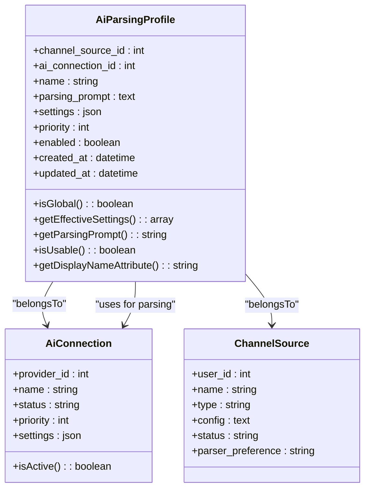
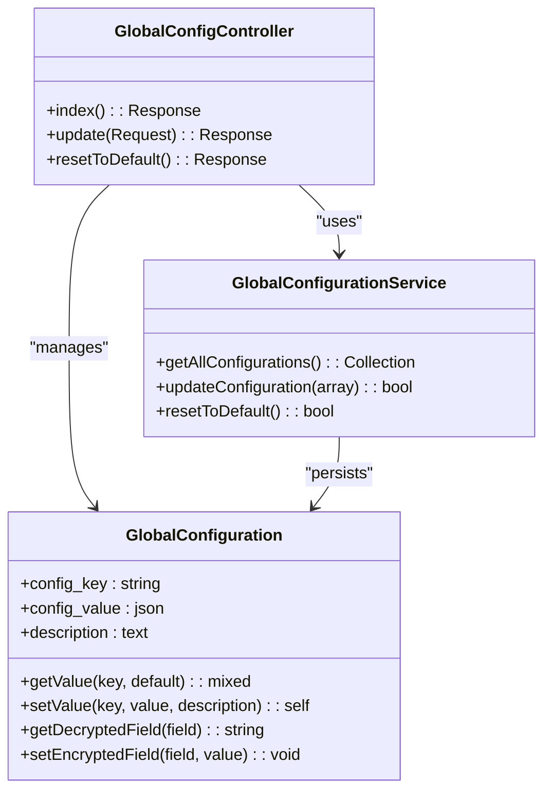
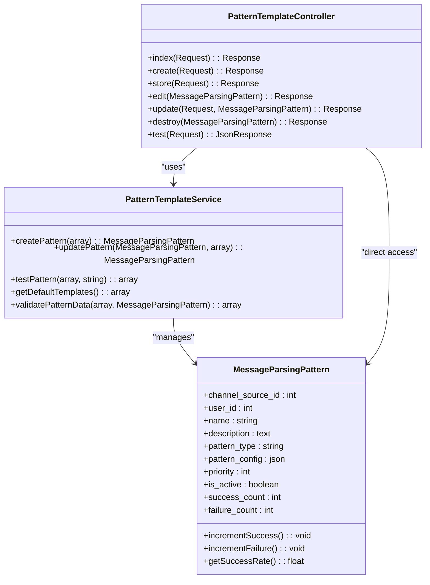
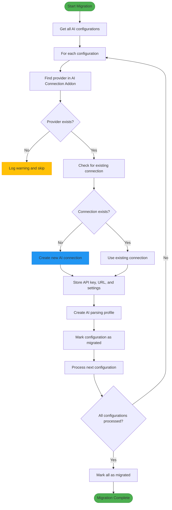
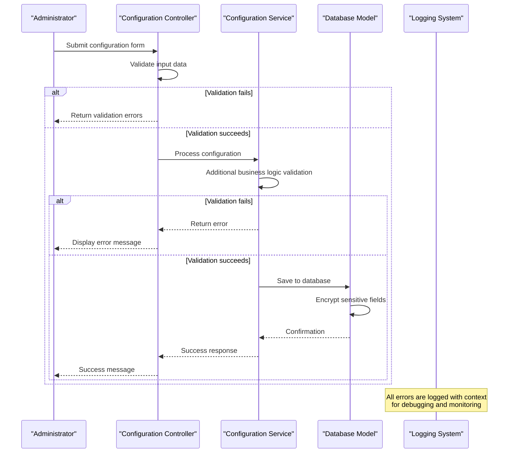

# Configuration Management

<cite>
**Referenced Files in This Document**   
- [AiParsingProfileController.php](file://main/addons/multi-channel-signal-addon/app/Http/Controllers/Backend/AiParsingProfileController.php)
- [AiParsingProfile.php](file://main/addons/multi-channel-signal-addon/app/Models/AiParsingProfile.php)
- [GlobalConfigController.php](file://main/addons/multi-channel-signal-addon/app/Http/Controllers/Backend/GlobalConfigController.php)
- [GlobalConfiguration.php](file://main/app/Models/GlobalConfiguration.php)
- [PatternTemplateController.php](file://main/addons/multi-channel-signal-addon/app/Http/Controllers/Backend/PatternTemplateController.php)
- [MessageParsingPattern.php](file://main/addons/multi-channel-signal-addon/app/Models/MessageParsingPattern.php)
- [PatternTemplateService.php](file://main/addons/multi-channel-signal-addon/app/Services/PatternTemplateService.php)
- [migrate_ai_configurations_to_connections.php](file://main/addons/multi-channel-signal-addon/database/migrations/2025_12_03_120001_migrate_ai_configurations_to_connections.php)
</cite>

## Table of Contents
1. [Introduction](#introduction)
2. [AI Parsing Profiles](#ai-parsing-profiles)
3. [Global Configuration System](#global-configuration-system)
4. [Pattern Templates Management](#pattern-templates-management)
5. [AI Configuration Migration](#ai-configuration-migration)
6. [Configuration Validation and Error Handling](#configuration-validation-and-error-handling)
7. [Best Practices and Recommendations](#best-practices-and-recommendations)

## Introduction

The Configuration Management system provides a comprehensive framework for managing AI parsing behavior, global settings, and pattern templates within the trading platform. This system enables administrators to configure parsing profiles, manage system-wide settings, and define pattern templates for channel sources. The architecture has evolved from standalone AI configurations to a connection-based AI service model, improving reusability and centralized management.

The system consists of three main components: AI parsing profiles that define how AI services parse trading signals, global configuration settings that apply system-wide, and pattern templates that standardize message parsing across channels. These components work together to provide a flexible and robust configuration framework that supports both global and channel-specific settings.

**Section sources**
- [AiParsingProfileController.php](file://main/addons/multi-channel-signal-addon/app/Http/Controllers/Backend/AiParsingProfileController.php#L1-L193)
- [GlobalConfigController.php](file://main/addons/multi-channel-signal-addon/app/Http/Controllers/Backend/GlobalConfigController.php#L1-L150)
- [PatternTemplateController.php](file://main/addons/multi-channel-signal-addon/app/Http/Controllers/Backend/PatternTemplateController.php#L1-L213)

## AI Parsing Profiles

AI parsing profiles are configured through the `AiParsingProfileController` and represent the primary mechanism for defining how AI services parse trading signals from channel sources. Each profile is associated with an AI connection and can be configured for specific channels or applied globally.

The `AiParsingProfile` model contains key attributes including `channel_source_id` (nullable for global profiles), `ai_connection_id` (linking to the AI Connection Addon), `name`, `parsing_prompt` (custom prompt template), `settings` (override settings like temperature and max_tokens), `priority`, and `enabled` status. The model provides several scopes for filtering profiles by enabled status, priority, global scope, or specific channel.

**Diagram sources **
- [AiParsingProfile.php](file://main/addons/multi-channel-signal-addon/app/Models/AiParsingProfile.php#L1-L133)
- [AiConnection.php](file://main/addons/ai-connection-addon/App/Models/AiConnection.php#L1-L100)
- [ChannelSource.php](file://main/addons/multi-channel-signal-addon/app/Models/ChannelSource.php#L1-L260)

The controller provides standard CRUD operations with validation rules that ensure data integrity. When creating or updating a profile, the validation rules require:
- `ai_connection_id`: must exist in ai_connections table
- `name`: required string with maximum 255 characters
- `channel_source_id`: must exist in channel_sources table if provided
- `settings`: must be a valid array
- `priority`: required integer with minimum value of 1
- `enabled`: boolean value

Profiles can be filtered by channel source, with a special "global" option that shows profiles not tied to any specific channel. The system automatically checks for available AI connections before allowing profile creation, redirecting users to create connections if none exist.

**Section sources**
- [AiParsingProfileController.php](file://main/addons/multi-channel-signal-addon/app/Http/Controllers/Backend/AiParsingProfileController.php#L64-L124)
- [AiParsingProfile.php](file://main/addons/multi-channel-signal-addon/app/Models/AiParsingProfile.php#L15-L23)

## Global Configuration System

The Global Configuration system is managed through the `GlobalConfigController` and provides a centralized way to manage system-wide settings. These settings are shared across all components and can only be modified by administrators. The system uses a key-value store pattern with the `GlobalConfiguration` model, where each configuration is stored as a record with a `config_key`, `config_value` (stored as JSON), and optional description.

The global configuration interface is organized into logical sections such as Telegram MTProto Configuration and MTAPI gRPC Configuration. Each section contains relevant settings with appropriate validation rules. For example, the MTAPI configuration includes fields for API key, base URL, timeout settings, default host and port, and demo account credentials.

**Diagram sources **
- [GlobalConfiguration.php](file://main/app/Models/GlobalConfiguration.php#L1-L134)
- [GlobalConfigController.php](file://main/addons/multi-channel-signal-addon/app/Http/Controllers/Backend/GlobalConfigController.php#L1-L150)
- [GlobalConfigurationService.php](file://main/app/Services/GlobalConfigurationService.php#L1-L100)

The `GlobalConfiguration` model provides helper methods for secure handling of sensitive data. The `getDecryptedField` and `setEncryptedField` methods automatically encrypt/decrypt values using Laravel's Crypt service, ensuring that sensitive information like API keys are stored securely. The model also includes error handling for cases where the global_configurations table doesn't exist or when decryption fails.

Configuration updates are validated to ensure data integrity. For example, MTAPI settings validate that timeout values are between 5 and 300 seconds, and port numbers are within the valid range of 1-65535. MetaApi settings validate that URLs are properly formatted. This validation prevents configuration errors that could disrupt system functionality.

**Section sources**
- [GlobalConfiguration.php](file://main/app/Models/GlobalConfiguration.php#L33-L80)
- [GlobalConfigController.php](file://main/addons/multi-channel-signal-addon/app/Http/Controllers/Backend/GlobalConfigController.php#L73-L93)

## Pattern Templates Management

Pattern templates are managed through the `PatternTemplateController` and provide a way to define and apply parsing patterns to channel sources. These templates standardize how trading signals are extracted from messages and can be created, edited, tested, and deleted through the administrative interface.

The `MessageParsingPattern` model represents individual pattern templates with attributes including `channel_source_id` (nullable for global patterns), `user_id`, `name`, `description`, `pattern_type` (regex, template, or ai_fallback), `pattern_config` (stored as JSON), `priority`, `is_active`, and performance metrics (`success_count` and `failure_count`). The model includes methods for tracking success/failure rates and calculating success percentages.

**Diagram sources **
- [PatternTemplateController.php](file://main/addons/multi-channel-signal-addon/app/Http/Controllers/Backend/PatternTemplateController.php#L1-L213)
- [PatternTemplateService.php](file://main/addons/multi-channel-signal-addon/app/Services/PatternTemplateService.php#L1-L363)
- [MessageParsingPattern.php](file://main/addons/multi-channel-signal-addon/app/Models/MessageParsingPattern.php#L1-L88)

The `PatternTemplateService` provides the business logic for pattern management, including validation, creation, updating, and testing. The service includes a comprehensive validation system that checks:
- Required fields (name, pattern_type, pattern_config)
- Pattern type must be one of: regex, template, ai_fallback
- Pattern config structure must match the pattern type
- Priority must be an integer between 0 and 1000
- Channel source and user IDs must exist if provided

The system includes a testing feature that allows administrators to test pattern templates against sample messages before deployment. This feature uses the `testPattern` method in `PatternTemplateService` to simulate parsing and returns detailed results including success status, parsed data, confidence level, and found fields.

The interface provides access to default templates that can be used as starting points for creating new patterns. These include templates for common formats like "Standard Signal Format", "Line-Based Template", "Forex Auto Format", and "Gold Multi-TP Format". Each template includes predefined regex patterns for extracting currency pairs, directions, entry prices, stop losses, and take profits.

**Section sources**
- [PatternTemplateController.php](file://main/addons/multi-channel-signal-addon/app/Http/Controllers/Backend/PatternTemplateController.php#L82-L123)
- [PatternTemplateService.php](file://main/addons/multi-channel-signal-addon/app/Services/PatternTemplateService.php#L17-L363)
- [MessageParsingPattern.php](file://main/addons/multi-channel-signal-addon/app/Models/MessageParsingPattern.php#L15-L30)

## AI Configuration Migration

The system has undergone a significant architectural evolution from standalone AI configurations to a connection-based AI service model. This migration is documented in the `migrate_ai_configurations_to_connections.php` database migration, which moves data from the legacy `ai_configurations` table to the centralized AI Connection Addon.

The migration process involves several key steps:
1. Retrieve all existing AI configurations from the `ai_configurations` table
2. For each configuration, find or create a corresponding connection in the AI Connection Addon
3. Migrate configuration settings (API key, API URL, model, temperature, max_tokens, timeout) to the new connection
4. Create AI parsing profiles that reference the new connections
5. Mark the original configurations as migrated

**Diagram sources **
- [migrate_ai_configurations_to_connections.php](file://main/addons/multi-channel-signal-addon/database/migrations/2025_12_03_120001_migrate_ai_configurations_to_connections.php#L1-L122)

The migration preserves all critical configuration data while improving the architecture by:
- Centralizing AI connection management
- Enabling connection reuse across multiple features
- Implementing connection rotation and failover
- Providing unified usage tracking and analytics
- Simplifying credential management

The migration is designed to be idempotent, checking if the `ai_parsing_profiles` table already exists before creating it. It also adds a `migrated` column to the original `ai_configurations` table to track migration status, allowing for debugging and potential rollback if needed.

This architectural shift enables better resource utilization, as multiple parsing profiles can now share the same AI connection. It also facilitates connection health monitoring, usage analytics, and automated failover when connections experience issues.

**Section sources**
- [migrate_ai_configurations_to_connections.php](file://main/addons/multi-channel-signal-addon/database/migrations/2025_12_03_120001_migrate_ai_configurations_to_connections.php#L1-L122)
- [ai_parsing_profiles_table.php](file://main/addons/multi-channel-signal-addon/database/migrations/2025_12_03_120000_create_ai_parsing_profiles_table.php#L1-L62)

## Configuration Validation and Error Handling

The configuration management system implements comprehensive validation and error handling to ensure data integrity and prevent configuration errors. Each controller enforces validation rules through Laravel's validation system, with specific rules tailored to each configuration type.

For AI parsing profiles, the validation rules ensure that:
- Required fields are present and properly formatted
- References to AI connections and channel sources exist
- Priority values are valid integers
- Settings are properly structured as arrays

The pattern template system includes additional validation in the `PatternTemplateService` that checks the structure of pattern configurations based on their type. For regex patterns, it validates that the "patterns" array exists and contains valid regex expressions. For template patterns, it ensures that either "line_mappings" or "template" is provided.

**Diagram sources **
- [AiParsingProfileController.php](file://main/addons/multi-channel-signal-addon/app/Http/Controllers/Backend/AiParsingProfileController.php#L64-L124)
- [PatternTemplateController.php](file://main/addons/multi-channel-signal-addon/app/Http/Controllers/Backend/PatternTemplateController.php#L82-L123)
- [GlobalConfigController.php](file://main/addons/multi-channel-signal-addon/app/Http/Controllers/Backend/GlobalConfigController.php#L73-L93)

Error handling is implemented at multiple levels:
- Controller level: Catches exceptions and returns user-friendly error messages
- Service level: Handles business logic errors and logs detailed information
- Model level: Validates data integrity and handles encryption/decryption errors
- System level: Logs all errors with context for debugging and monitoring

The system uses Laravel's exception handling to catch and process errors gracefully. When an error occurs during configuration operations, the system logs detailed information including the exception message, stack trace, and relevant context data. Users receive clear error messages that help them understand and resolve issues without exposing sensitive system information.

**Section sources**
- [AiParsingProfileController.php](file://main/addons/multi-channel-signal-addon/app/Http/Controllers/Backend/AiParsingProfileController.php#L171-L179)
- [PatternTemplateController.php](file://main/addons/multi-channel-signal-addon/app/Http/Controllers/Backend/PatternTemplateController.php#L117-L123)
- [GlobalConfiguration.php](file://main/app/Models/GlobalConfiguration.php#L42-L48)

## Best Practices and Recommendations

Based on the analysis of the configuration management system, the following best practices and recommendations are provided for administrators and developers:

1. **Use Connection-Based Architecture**: Leverage the connection-based AI service model to centralize AI connection management and enable connection reuse across multiple parsing profiles.

2. **Implement Proper Validation**: Always validate configuration inputs at both the controller and service levels to ensure data integrity and prevent configuration errors.

3. **Secure Sensitive Data**: Use encrypted fields for storing sensitive information like API keys and credentials, following the pattern implemented in the `GlobalConfiguration` model.

4. **Test Before Deployment**: Utilize the pattern testing feature to validate pattern templates against sample messages before deploying them to production.

5. **Monitor Configuration Changes**: Implement logging and monitoring for configuration changes to track who made changes and when, facilitating audit and troubleshooting.

6. **Use Priority System**: Leverage the priority system to control the order in which parsing profiles and pattern templates are applied, ensuring that more specific patterns are processed before general ones.

7. **Handle Migration Carefully**: When migrating from legacy configurations to the new system, follow the idempotent migration pattern that checks for existing data and handles errors gracefully.

8. **Provide User Feedback**: Ensure that configuration interfaces provide clear feedback about success or failure, with specific error messages that help users resolve issues.

These practices ensure that the configuration management system remains robust, secure, and maintainable while providing administrators with the tools they need to effectively manage the system.

[No sources needed since this section provides general guidance]