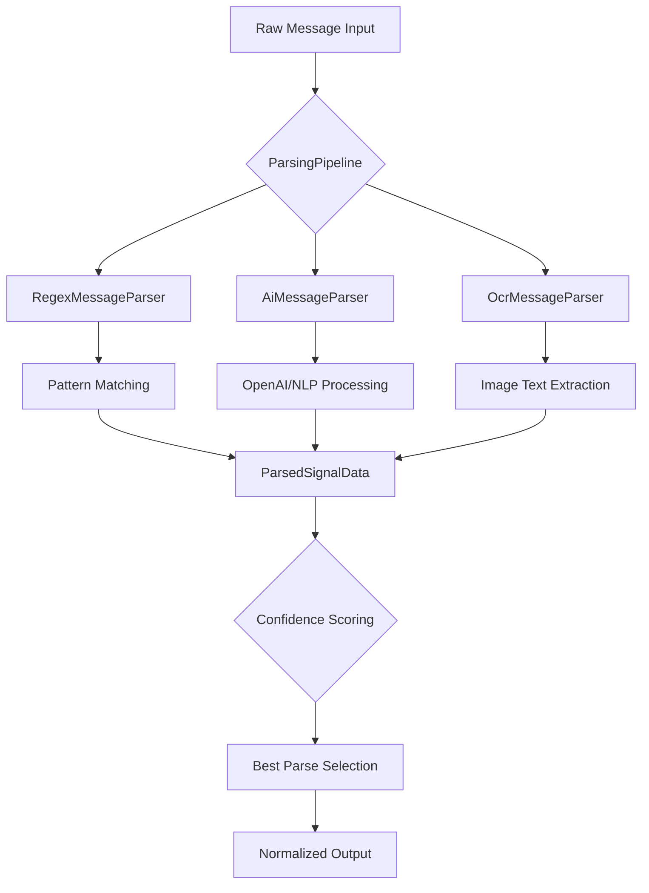
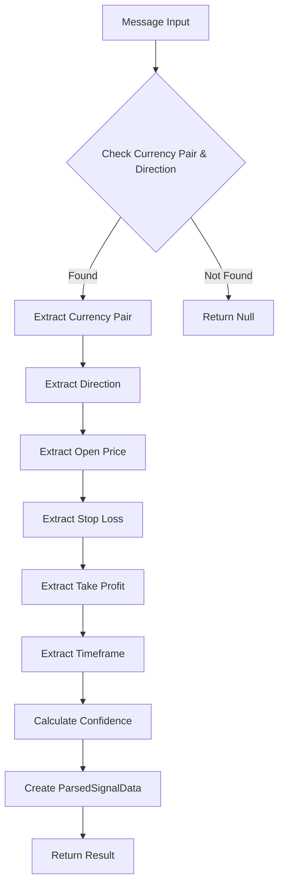
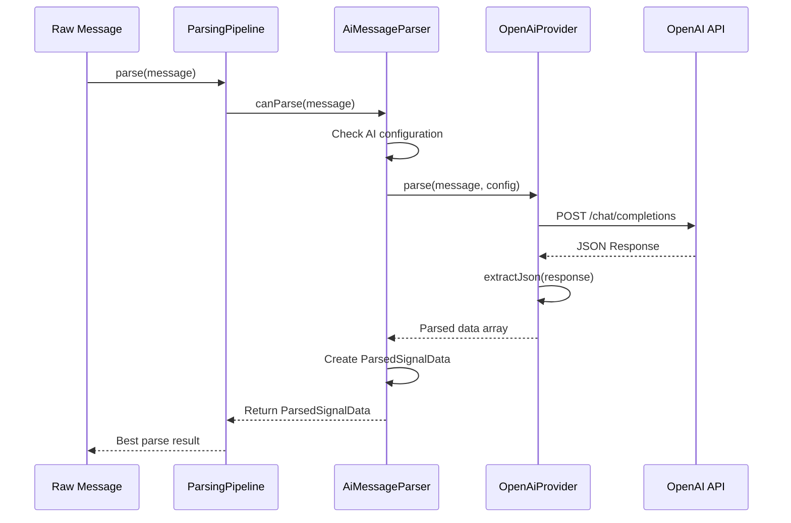
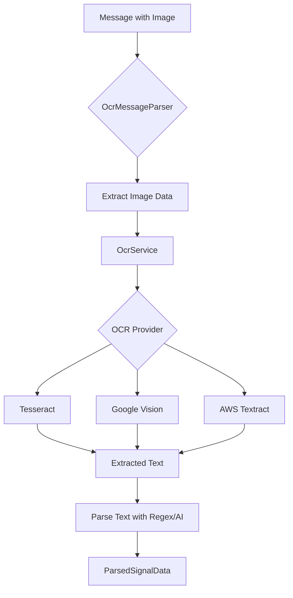
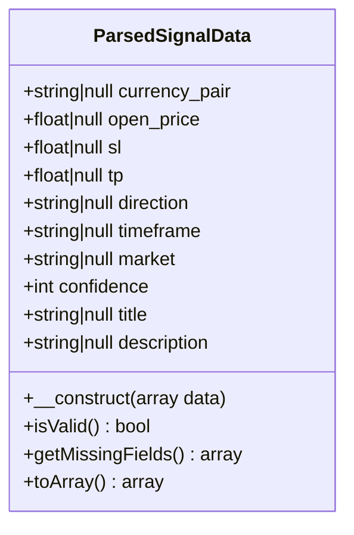
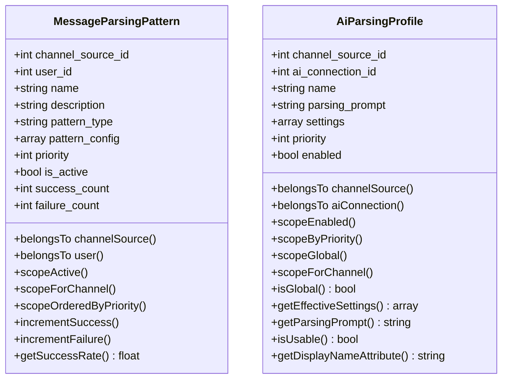

# Message Parsing

<cite>
**Referenced Files in This Document**   
- [ParsingPipeline.php](file://main/app/Parsers/ParsingPipeline.php)
- [RegexMessageParser.php](file://main/app/Parsers/RegexMessageParser.php)
- [ParsedSignalData.php](file://main/app/DTOs/ParsedSignalData.php)
- [MessageParsingPattern.php](file://main/addons/multi-channel-signal-addon/app/Models/MessageParsingPattern.php)
- [AiParsingProfile.php](file://main/addons/multi-channel-signal-addon/app/Models/AiParsingProfile.php)
- [OpenAiProvider.php](file://main/addons/multi-channel-signal-addon/app/Services/AiProviders/OpenAiProvider.php)
- [OcrMessageParser.php](file://main/addons/multi-channel-signal-addon/app/Parsers/OcrMessageParser.php)
- [OcrService.php](file://main/addons/multi-channel-signal-addon/app/Services/OcrService.php)
- [MessageParserInterface.php](file://main/app/Contracts/MessageParserInterface.php)
</cite>

## Table of Contents
1. [Introduction](#introduction)
2. [Parsing Pipeline Architecture](#parsing-pipeline-architecture)
3. [Core Components](#core-components)
4. [Regex Parsing Strategy](#regex-parsing-strategy)
5. [AI-Powered Parsing](#ai-powered-parsing)
6. [OCR Processing for Image-Based Signals](#ocr-processing-for-image-based-signals)
7. [Parsed Signal Data Structure](#parsed-signal-data-structure)
8. [Configuration and Profiles](#configuration-and-profiles)
9. [Error Handling and Confidence Management](#error-handling-and-confidence-management)
10. [Integration and Workflow](#integration-and-workflow)

## Introduction
The Message Parsing system is a comprehensive solution for extracting trading signal information from various message formats across multiple channels. It employs a multi-strategy approach combining regex pattern matching, AI-powered natural language processing, and OCR technology for image-based signals. The system is designed to handle ambiguous formats, low-confidence parses, and diverse input types while maintaining high accuracy and reliability. This document details the architecture, implementation, and configuration of the parsing pipeline.

## Parsing Pipeline Architecture

**Diagram sources**
- [ParsingPipeline.php](file://main/app/Parsers/ParsingPipeline.php#L9-L88)
- [RegexMessageParser.php](file://main/app/Parsers/RegexMessageParser.php#L8-L194)
- [OcrMessageParser.php](file://main/addons/multi-channel-signal-addon/app/Parsers/OcrMessageParser.php#L10-L185)
- [OpenAiProvider.php](file://main/addons/multi-channel-signal-addon/app/Services/AiProviders/OpenAiProvider.php#L10-L156)

**Section sources**
- [ParsingPipeline.php](file://main/app/Parsers/ParsingPipeline.php#L1-L89)

## Core Components

The Message Parsing system consists of several key components that work together to extract and normalize trading signal data from various input formats. The architecture follows a pipeline pattern where multiple parsers are registered and executed based on message content and configuration. The system supports three primary parsing strategies: regex-based pattern matching for structured text, AI-powered natural language processing for unstructured content, and OCR processing for image-based signals. Each parser implements the MessageParserInterface contract, ensuring consistent behavior across different parsing strategies.

**Section sources**
- [MessageParserInterface.php](file://main/app/Contracts/MessageParserInterface.php#L1-L45)
- [ParsingPipeline.php](file://main/app/Parsers/ParsingPipeline.php#L1-L89)

## Regex Parsing Strategy

**Diagram sources**
- [RegexMessageParser.php](file://main/app/Parsers/RegexMessageParser.php#L8-L194)
- [ParsedSignalData.php](file://main/app/DTOs/ParsedSignalData.php#L10-L138)

**Section sources**
- [RegexMessageParser.php](file://main/app/Parsers/RegexMessageParser.php#L1-L195)

## AI-Powered Parsing

**Diagram sources**
- [OpenAiProvider.php](file://main/addons/multi-channel-signal-addon/app/Services/AiProviders/OpenAiProvider.php#L10-L156)
- [AiParsingProfile.php](file://main/addons/multi-channel-signal-addon/app/Models/AiParsingProfile.php#L9-L133)

**Section sources**
- [OpenAiProvider.php](file://main/addons/multi-channel-signal-addon/app/Services/AiProviders/OpenAiProvider.php#L1-L157)
- [AiParsingProfile.php](file://main/addons/multi-channel-signal-addon/app/Models/AiParsingProfile.php#L1-L133)

## OCR Processing for Image-Based Signals

**Diagram sources**
- [OcrMessageParser.php](file://main/addons/multi-channel-signal-addon/app/Parsers/OcrMessageParser.php#L10-L185)
- [OcrService.php](file://main/addons/multi-channel-signal-addon/app/Services/OcrService.php#L9-L142)

**Section sources**
- [OcrMessageParser.php](file://main/addons/multi-channel-signal-addon/app/Parsers/OcrMessageParser.php#L1-L185)
- [OcrService.php](file://main/addons/multi-channel-signal-addon/app/Services/OcrService.php#L1-L142)

## Parsed Signal Data Structure

**Diagram sources**
- [ParsedSignalData.php](file://main/app/DTOs/ParsedSignalData.php#L10-L138)

**Section sources**
- [ParsedSignalData.php](file://main/app/DTOs/ParsedSignalData.php#L1-L140)

## Configuration and Profiles

**Diagram sources**
- [MessageParsingPattern.php](file://main/addons/multi-channel-signal-addon/app/Models/MessageParsingPattern.php#L10-L88)
- [AiParsingProfile.php](file://main/addons/multi-channel-signal-addon/app/Models/AiParsingProfile.php#L9-L133)

**Section sources**
- [MessageParsingPattern.php](file://main/addons/multi-channel-signal-addon/app/Models/MessageParsingPattern.php#L1-L88)
- [AiParsingProfile.php](file://main/addons/multi-channel-signal-addon/app/Models/AiParsingProfile.php#L1-L133)

## Error Handling and Confidence Management
The Message Parsing system implements robust error handling and confidence management to ensure reliable signal extraction. Each parser returns a confidence score based on the number of successfully extracted fields, with the ParsingPipeline selecting the parse result with the highest confidence. The system handles various error scenarios including API failures, invalid JSON responses, and OCR processing errors. For AI parsing, the system includes multiple fallback mechanisms for extracting JSON from responses, including parsing code blocks and finding JSON objects within text. The confidence thresholding mechanism ensures that only high-quality parses are returned, while parser chaining allows for fallback to alternative parsing strategies when confidence is low.

**Section sources**
- [ParsingPipeline.php](file://main/app/Parsers/ParsingPipeline.php#L57-L76)
- [RegexMessageParser.php](file://main/app/Parsers/RegexMessageParser.php#L91-L170)
- [OpenAiProvider.php](file://main/addons/multi-channel-signal-addon/app/Services/AiProviders/OpenAiProvider.php#L121-L154)

## Integration and Workflow
The Message Parsing system integrates seamlessly with the broader signal processing pipeline, receiving raw messages from various channels and outputting normalized ParsedSignalData objects for further processing. The workflow begins with message ingestion from channels such as Telegram, RSS feeds, or web scraping, followed by parsing through the ParsingPipeline. The system supports dynamic parser registration, allowing new parsing strategies to be added without modifying the core pipeline. Configuration through MessageParsingPattern and AiParsingProfile models enables fine-grained control over parsing behavior for different channels and users. The parsed signals are then validated and forwarded to the trading execution system, completing the signal processing workflow.

**Section sources**
- [ParsingPipeline.php](file://main/app/Parsers/ParsingPipeline.php#L1-L89)
- [ProcessChannelMessage.php](file://main/app/Jobs/ProcessChannelMessage.php#L1-L100)