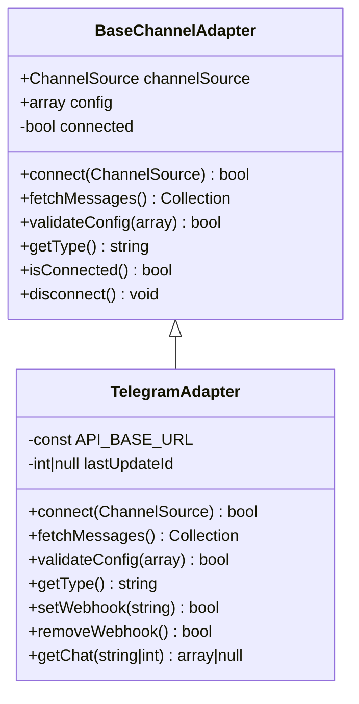
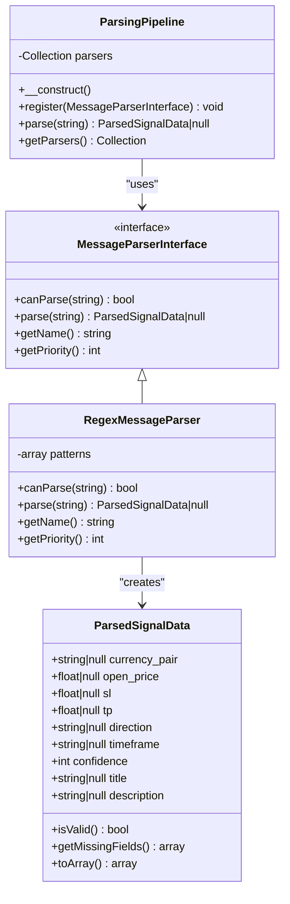
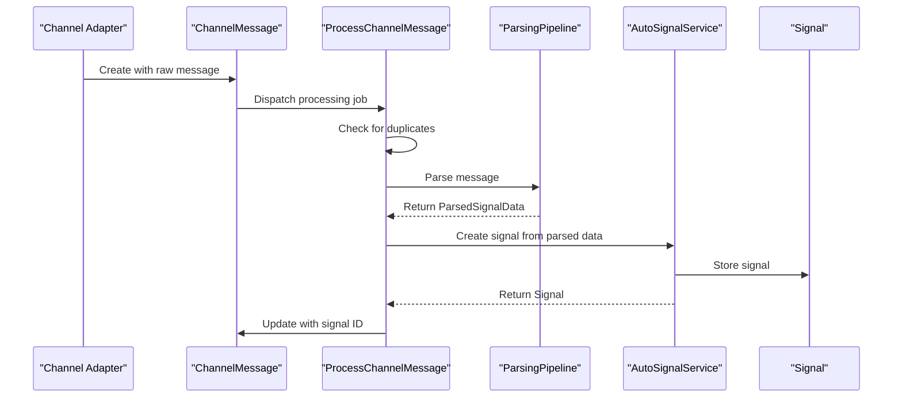

# Multi-Channel Signal Processing

<cite>
**Referenced Files in This Document**   
- [BaseChannelAdapter.php](file://main/app/Adapters/BaseChannelAdapter.php)
- [TelegramAdapter.php](file://main/app/Adapters/TelegramAdapter.php)
- [ApiAdapter.php](file://main/app/Adapters/ApiAdapter.php)
- [RssAdapter.php](file://main/app/Adapters/RssAdapter.php)
- [WebScrapeAdapter.php](file://main/app/Adapters/WebScrapeAdapter.php)
- [ParsingPipeline.php](file://main/app/Parsers/ParsingPipeline.php)
- [RegexMessageParser.php](file://main/app/Parsers/RegexMessageParser.php)
- [ParsedSignalData.php](file://main/app/DTOs/ParsedSignalData.php)
- [ProcessChannelMessage.php](file://main/app/Jobs/ProcessChannelMessage.php)
- [AutoSignalService.php](file://main/app/Services/AutoSignalService.php)
- [ChannelSource.php](file://main/addons/multi-channel-signal-addon/app/Models/ChannelSource.php)
- [ChannelMessage.php](file://main/app/Models/ChannelMessage.php)
- [Signal.php](file://main/app/Models/Signal.php)
</cite>

## Table of Contents
1. [Introduction](#introduction)
2. [Channel Adapters Implementation](#channel-adapters-implementation)
3. [Message Parsing Pipeline](#message-parsing-pipeline)
4. [Configuration Options](#configuration-options)
5. [Signal Ingestion and Distribution](#signal-ingestion-and-distribution)
6. [Integration with AI and Trading Systems](#integration-with-ai-and-trading-systems)
7. [Common Issues and Solutions](#common-issues-and-solutions)
8. [Conclusion](#conclusion)

## Introduction

The Multi-Channel Signal Processing system is designed to ingest trading signals from various external sources including Telegram, RSS feeds, web scraping, and API endpoints. The system processes these signals through a sophisticated parsing pipeline that extracts relevant trading information and distributes it to subscribers. This document provides a comprehensive overview of the implementation, focusing on the adapter architecture, parsing strategies, configuration options, and integration points with other system components.

The system follows a modular design with clear separation of concerns, allowing for easy extension and maintenance. Each channel type has its own adapter implementation that handles the specific protocol and authentication requirements, while sharing common functionality through a base adapter class.

**Section sources**
- [BaseChannelAdapter.php](file://main/app/Adapters/BaseChannelAdapter.php#L1-L159)

## Channel Adapters Implementation

The system implements a flexible adapter pattern for handling different channel types. All adapters extend the `BaseChannelAdapter` class which provides common functionality such as configuration management, error logging, and connection state tracking.

### Telegram Adapter

The `TelegramAdapter` implements integration with Telegram channels using the Bot API. It supports both channel posts and group messages, with configurable chat ID filtering to ensure only relevant messages are processed.

Key features:
- Bot token authentication and validation
- Message polling via getUpdates API
- Webhook support for real-time updates
- Rate limiting handling with automatic retries
- Last update ID tracking to prevent duplicate processing

The adapter connects to Telegram using the configured bot token and validates the connection by calling the getMe method. Messages are fetched using the getUpdates method with an offset based on the last processed update ID, ensuring no messages are missed or processed twice.

**Diagram sources**
- [BaseChannelAdapter.php](file://main/app/Adapters/BaseChannelAdapter.php#L15-L159)
- [TelegramAdapter.php](file://main/app/Adapters/TelegramAdapter.php#L11-L287)

**Section sources**
- [TelegramAdapter.php](file://main/app/Adapters/TelegramAdapter.php#L11-L287)

### API Adapter

The `ApiAdapter` handles webhook-based integrations where external systems push messages to the platform. Instead of actively fetching messages, this adapter provides a webhook endpoint that receives payloads from external sources.

Key features:
- Webhook URL generation for external integration
- Signature verification using HMAC-SHA256
- Configurable secret key for authentication
- Automatic webhook URL generation

The adapter validates incoming requests by verifying the signature if a secret key is configured. This ensures that messages come from trusted sources and have not been tampered with during transmission.

**Section sources**
- [ApiAdapter.php](file://main/app/Adapters/ApiAdapter.php#L10-L119)

### RSS Adapter

The `RssAdapter` processes RSS and Atom feeds, extracting content from feed items and converting them into signal messages. It handles both RSS 2.0 and Atom formats, making it compatible with a wide range of content sources.

Key features:
- Automatic feed format detection (RSS/Atom)
- Last processed item tracking to avoid duplicates
- Publication date filtering
- User-agent header for better compatibility with feed providers
- XML parsing with error handling

The adapter maintains state by storing the last processed item ID and publication date in the channel configuration. This ensures that only new items are processed on subsequent fetches.

**Section sources**
- [RssAdapter.php](file://main/app/Adapters/RssAdapter.php#L10-L282)

### Web Scraping Adapter

The `WebScrapeAdapter` extracts content from websites using CSS selectors or XPath expressions. This allows the system to monitor specific sections of web pages for trading signals.

Key features:
- CSS selector and XPath support
- Content change detection using SHA-256 hashing
- Robots.txt compliance checking
- User-agent header for better compatibility
- HTML parsing with error handling

The adapter detects changes by hashing the extracted content and comparing it with the previously stored hash. Only when the content changes is a new message created, preventing duplicate signals for static content.

**Section sources**
- [WebScrapeAdapter.php](file://main/app/Adapters/WebScrapeAdapter.php#L10-L276)

## Message Parsing Pipeline

The message parsing system uses a pipeline architecture to extract structured trading signal data from unstructured text messages. The pipeline supports multiple parsing strategies and selects the most confident result.

### Parsing Pipeline Architecture

The `ParsingPipeline` class manages multiple parser implementations and executes them in priority order. It returns the result from the parser with the highest confidence score.

**Diagram sources**
- [ParsingPipeline.php](file://main/app/Parsers/ParsingPipeline.php#L9-L89)
- [MessageParserInterface.php](file://main/app/Contracts/MessageParserInterface.php#L12-L45)
- [RegexMessageParser.php](file://main/app/Parsers/RegexMessageParser.php#L8-L195)
- [ParsedSignalData.php](file://main/app/DTOs/ParsedSignalData.php#L10-L140)

**Section sources**
- [ParsingPipeline.php](file://main/app/Parsers/ParsingPipeline.php#L9-L89)

### Regex Parsing Strategy

The `RegexMessageParser` is the primary parsing implementation that uses regular expressions to extract trading signal components from text messages. It looks for patterns matching currency pairs, directions (BUY/SELL), entry prices, stop losses, take profits, and timeframes.

The parser assigns confidence scores to each extracted component:
- Currency pair: +15 confidence points
- Direction: +15 confidence points  
- Open price: +20 confidence points
- Stop loss: +15 confidence points
- Take profit: +15 confidence points
- Timeframe: +10 confidence points

The total confidence score is capped at 100. A valid signal requires at least a currency pair, direction, and open price.

**Section sources**
- [RegexMessageParser.php](file://main/app/Parsers/RegexMessageParser.php#L8-L195)

## Configuration Options

The system provides extensive configuration options for channel sources, parsing behavior, and forwarding rules.

### Channel Source Configuration

Each channel source is configured with type-specific settings:

**Telegram Configuration:**
- `bot_token`: Authentication token for the Telegram bot
- `chat_id`: Target chat or channel ID to monitor
- `last_update_id`: Tracking for message processing

**API Configuration:**
- `webhook_url`: Custom webhook URL (optional)
- `secret_key`: Secret for signature verification

**RSS Configuration:**
- `feed_url`: URL of the RSS/Atom feed
- `last_processed_item_id`: Tracking for feed items
- `last_processed_date`: Publication date filtering

**Web Scraping Configuration:**
- `url`: Target website URL
- `selector`: CSS selector or XPath expression
- `selector_type`: 'css' or 'xpath'
- `last_content_hash`: SHA-256 hash of last processed content

### Parsing and Forwarding Configuration

Channel sources also support parsing and forwarding rules:

- `auto_publish_confidence_threshold`: Minimum confidence score for automatic signal publication
- `parser_preference`: Preferred parsing strategy (regex, AI, OCR)
- `default_plan_id`: Default subscription plan for created signals
- `default_market_id`: Default market for created signals  
- `default_timeframe_id`: Default timeframe for created signals

These configurations allow administrators to customize how signals are processed and distributed based on the source and quality of the incoming messages.

**Section sources**
- [ChannelSource.php](file://main/addons/multi-channel-signal-addon/app/Models/ChannelSource.php#L24-L40)

## Signal Ingestion and Distribution

The signal processing workflow follows a well-defined sequence from ingestion to distribution.

### Ingestion Process

1. **Message Fetching**: Channel adapters periodically fetch new messages from their respective sources
2. **Message Creation**: New messages are stored in the `channel_messages` table with status 'pending'
3. **Processing Queue**: A queued job (`ProcessChannelMessage`) processes each message
4. **Duplicate Detection**: Messages are checked against recent signals and messages to prevent duplicates
5. **Parsing**: The parsing pipeline extracts structured data from the message content
6. **Signal Creation**: Valid parsed data is converted into a trading signal

**Diagram sources**
- [ProcessChannelMessage.php](file://main/app/Jobs/ProcessChannelMessage.php#L14-L156)
- [AutoSignalService.php](file://main/app/Services/AutoSignalService.php#L15-L274)

**Section sources**
- [ProcessChannelMessage.php](file://main/app/Jobs/ProcessChannelMessage.php#L14-L156)

### Distribution Process

Once a signal is created, it is distributed to subscribers through various channels:

1. **Plan Assignment**: Signals are associated with subscription plans
2. **Distribution Job**: The `DistributeSignalJob` processes the signal for delivery
3. **Channel Delivery**: Subscribers receive notifications via their preferred channels (dashboard, Telegram, email, SMS)
4. **Execution Integration**: Signals can trigger automated trading through the execution engine

The distribution system respects user preferences and plan configurations, ensuring that signals are delivered only to appropriate subscribers.

**Section sources**
- [DistributeSignalJob.php](file://main/app/Jobs/DistributeSignalJob.php#L12-L68)

## Integration with AI and Trading Systems

The Multi-Channel Signal Processing system integrates with other components to provide enhanced functionality.

### AI Connection System

The system is designed to support AI-based parsing strategies, though the current implementation focuses on regex parsing. The architecture allows for easy integration of AI models through the `MessageParserInterface`.

Future AI integration could include:
- Natural language processing for unstructured signal descriptions
- Sentiment analysis to validate signal quality
- Pattern recognition to identify reliable signal providers
- Machine learning models trained on historical signal performance

The `parser_preference` configuration field indicates support for multiple parsing strategies, including AI-based approaches.

### Trading Execution Engine

Signals created by the system can be automatically executed by the trading execution engine. The integration works as follows:

1. Signals contain all necessary trading parameters (currency pair, direction, entry price, SL, TP)
2. The execution engine subscribes to new signals
3. Trades are executed according to user-defined rules and risk parameters
4. Execution results are fed back into the system for performance tracking

This integration enables fully automated trading based on signals from external sources, reducing latency and human error.

**Section sources**
- [AutoSignalService.php](file://main/app/Services/AutoSignalService.php#L15-L274)

## Common Issues and Solutions

### Parsing Failures

**Issue**: Messages fail to parse due to non-standard formatting
**Solution**: 
- Review and update regex patterns in `RegexMessageParser`
- Implement custom parsing profiles for specific signal providers
- Use the manual review interface to correct and learn from failures

### Duplicate Signals

**Issue**: The same signal is processed multiple times
**Solution**:
- Ensure proper tracking of last update ID (Telegram)
- Verify content hashing is working (Web scraping)
- Check that publication date filtering is configured (RSS)

### Connection Problems

**Issue**: Adapter fails to connect to the source
**Solution**:
- Verify authentication credentials (bot tokens, API keys)
- Check network connectivity and firewall rules
- Validate that the source URL or chat ID is correct
- Monitor error logs for specific failure messages

### Rate Limiting

**Issue**: API rate limits are exceeded
**Solution**:
- Implement appropriate delay between requests
- Use webhook-based approaches when available
- Cache responses to reduce API calls
- Monitor rate limit headers and adjust polling frequency

The system includes built-in error tracking with the `error_count` and `last_error` fields in the `ChannelSource` model, helping administrators identify and resolve issues quickly.

**Section sources**
- [BaseChannelAdapter.php](file://main/app/Adapters/BaseChannelAdapter.php#L79-L89)
- [ChannelSource.php](file://main/addons/multi-channel-signal-addon/app/Models/ChannelSource.php#L31-L32)

## Conclusion

The Multi-Channel Signal Processing system provides a robust framework for ingesting, parsing, and distributing trading signals from diverse sources. Its modular architecture with adapter patterns and pluggable parsers makes it highly extensible and maintainable.

Key strengths of the system include:
- Support for multiple channel types (Telegram, RSS, Web, API)
- Flexible parsing pipeline with confidence scoring
- Comprehensive configuration options
- Resilient error handling and duplicate prevention
- Seamless integration with AI and trading execution systems

The system effectively bridges the gap between unstructured signal sources and structured trading execution, enabling automated processing of trading signals at scale. With its solid foundation, it can be extended to support additional channel types, advanced parsing strategies, and deeper integration with machine learning models for improved signal quality assessment.