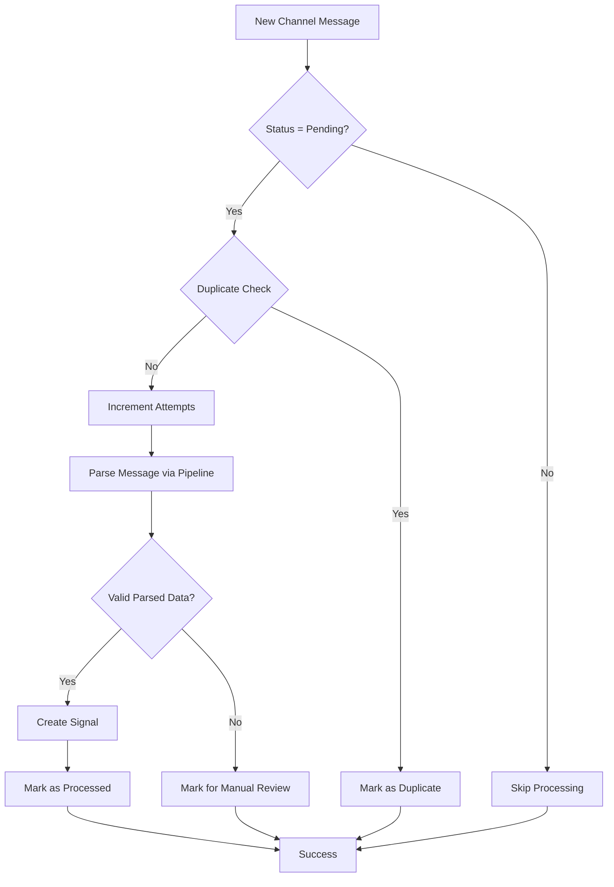
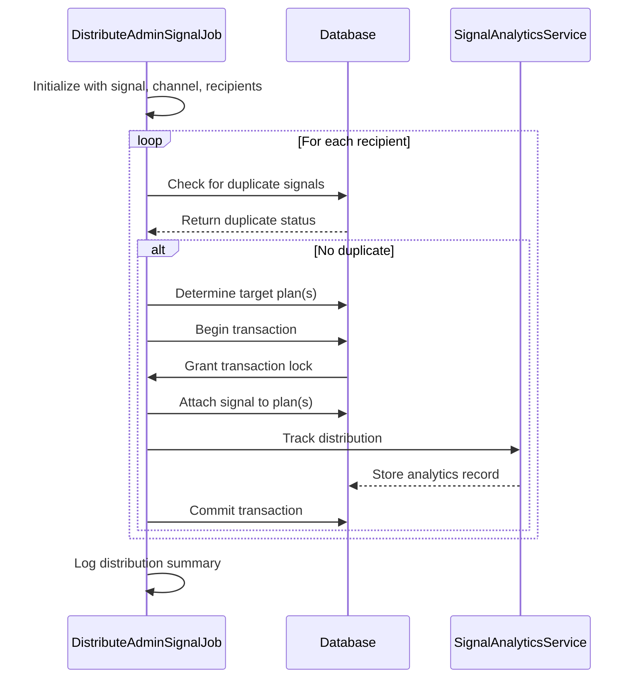
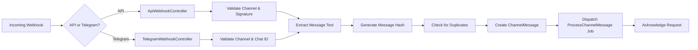
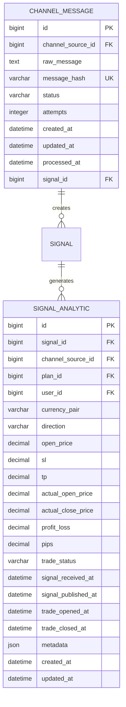

# Signal Distribution

<cite>
**Referenced Files in This Document**   
- [ProcessChannelMessage.php](file://main/app/Jobs/ProcessChannelMessage.php)
- [DistributeAdminSignalJob.php](file://main/addons/multi-channel-signal-addon/app/Jobs/DistributeAdminSignalJob.php)
- [AutoPublishSignalJob.php](file://main/addons/multi-channel-signal-addon/app/Jobs/AutoPublishSignalJob.php)
- [TelegramChannelService.php](file://main/addons/multi-channel-signal-addon/app/Services/TelegramChannelService.php)
- [ApiWebhookController.php](file://main/addons/multi-channel-signal-addon/app/Http/Controllers/Api/ApiWebhookController.php)
- [TelegramWebhookController.php](file://main/addons/multi-channel-signal-addon/app/Http/Controllers/Api/TelegramWebhookController.php)
- [SignalAnalytic.php](file://main/addons/multi-channel-signal-addon/app/Models/SignalAnalytic.php)
- [ChannelMessage.php](file://main/addons/multi-channel-signal-addon/app/Models/ChannelMessage.php)
</cite>

## Table of Contents
1. [Introduction](#introduction)
2. [Channel Message Processing Workflow](#channel-message-processing-workflow)
3. [Signal Distribution Mechanism](#signal-distribution-mechanism)
4. [Webhook Handling and Message Ingestion](#webhook-handling-and-message-ingestion)
5. [Telegram Channel Integration](#telegram-channel-integration)
6. [Channel Message Lifecycle and Analytics](#channel-message-lifecycle-and-analytics)
7. [Forwarding Configuration and User Management](#forwarding-configuration-and-user-management)
8. [Error Handling and Reliability](#error-handling-and-reliability)
9. [Conclusion](#conclusion)

## Introduction
The Signal Distribution system is responsible for processing incoming trading signals from various sources, validating and parsing them, and distributing them to subscribers based on their plan configurations. This document details the workflow from message ingestion through to signal dissemination, focusing on the core components that enable reliable and scalable signal delivery.

**Section sources**
- [ProcessChannelMessage.php](file://main/app/Jobs/ProcessChannelMessage.php)
- [DistributeAdminSignalJob.php](file://main/addons/multi-channel-signal-addon/app/Jobs/DistributeAdminSignalJob.php)

## Channel Message Processing Workflow

The signal processing workflow begins when a new message is received from a channel source such as Telegram or an API endpoint. The `ProcessChannelMessage` job is responsible for handling the complete lifecycle of message processing.

When a message arrives, it is first validated to ensure it is in "pending" status and not a duplicate. The system uses message hashing combined with a 24-hour time window to identify and filter out duplicate messages. Once validated, the message is parsed using a `ParsingPipeline` that applies pattern matching rules specific to the channel source. If parsing succeeds, an automated signal is created through the `AutoSignalService`. The job includes retry logic with up to three attempts and a 300-second timeout to ensure reliability.

**Diagram sources**
- [ProcessChannelMessage.php](file://main/app/Jobs/ProcessChannelMessage.php#L54-L110)

**Section sources**
- [ProcessChannelMessage.php](file://main/app/Jobs/ProcessChannelMessage.php#L14-L156)

## Signal Distribution Mechanism

Once a signal is created, the `DistributeAdminSignalJob` handles its distribution to subscribers based on plan configurations. This job accepts a signal, channel source, and recipient collection as parameters and processes each user individually.

The distribution logic considers the channel's scope configuration (plan, global, or user) to determine target plans. For each recipient, the system checks for duplicate signals within the last 24 hours before attaching the signal to their plan(s). The job uses database transactions to ensure atomic updates and tracks analytics for each distribution event through the `SignalAnalyticsService`.

A key feature is the dynamic plan resolution: if no specific plans are assigned, the system falls back to the channel's default plan or the user's current subscription. This ensures signals are delivered even when explicit configurations are missing.

**Diagram sources**
- [DistributeAdminSignalJob.php](file://main/addons/multi-channel-signal-addon/app/Jobs/DistributeAdminSignalJob.php#L36-L107)

**Section sources**
- [DistributeAdminSignalJob.php](file://main/addons/multi-channel-signal-addon/app/Jobs/DistributeAdminSignalJob.php#L18-L168)

## Webhook Handling and Message Ingestion

The system supports two primary webhook endpoints for message ingestion: `ApiWebhookController` and `TelegramWebhookController`. Both follow a similar pattern of validation, deduplication, and asynchronous processing.

The `ApiWebhookController` handles generic API-based signals and includes optional signature verification for security. It extracts message content from various payload formats (JSON, form data, raw content) and supports multiple field names for compatibility with different providers. The controller performs type validation to ensure only API channels are processed.

The `TelegramWebhookController` processes Telegram updates, specifically handling `channel_post` and regular `message` events. It validates that the message originates from the configured chat ID and extracts text or caption content. Both controllers implement deduplication using message hashing and return immediate acknowledgment to prevent message replay.

**Diagram sources**
- [ApiWebhookController.php](file://main/addons/multi-channel-signal-addon/app/Http/Controllers/Api/ApiWebhookController.php#L22-L87)
- [TelegramWebhookController.php](file://main/addons/multi-channel-signal-addon/app/Http/Controllers/Api/TelegramWebhookController.php#L21-L97)

**Section sources**
- [ApiWebhookController.php](file://main/addons/multi-channel-signal-addon/app/Http/Controllers/Api/ApiWebhookController.php#L13-L144)
- [TelegramWebhookController.php](file://main/addons/multi-channel-signal-addon/app/Http/Controllers/Api/TelegramWebhookController.php#L12-L113)

## Telegram Channel Integration

The `TelegramChannelService` provides comprehensive management capabilities for Telegram channel integration. It handles channel creation, bot token validation, and webhook configuration.

When creating a new channel, the service validates the bot token and attempts to connect using the `TelegramAdapter`. It supports both chat ID and username identification and verifies channel access by retrieving chat information. The service ensures the bot has appropriate admin permissions and updates the channel configuration with verified chat details.

For webhook management, the service can dynamically update Telegram's webhook URL to point to the application's endpoint. This enables real-time message delivery from Telegram to the system. The service includes comprehensive error handling and returns structured responses indicating success, warnings, or errors with descriptive messages.

**Section sources**
- [TelegramChannelService.php](file://main/addons/multi-channel-signal-addon/app/Services/TelegramChannelService.php#L9-L143)

## Channel Message Lifecycle and Analytics

The `ChannelMessage` model represents the lifecycle of incoming messages through various statuses: pending, processed, duplicate, failed, or manual review. Each message contains the raw content, a unique hash for deduplication, and metadata about processing attempts.

The `SignalAnalytic` model tracks detailed performance metrics for distributed signals, including trade outcomes, pricing data, and timing information. Analytics records are created when signals are distributed and updated as trades progress. The model supports comprehensive querying through scopes that filter by channel, plan, user, trade status, and profitability.

Analytics data enables performance evaluation of signal sources and helps identify high-performing channels and strategies. The system captures both expected and actual execution prices to measure slippage and overall signal quality.

**Diagram sources**
- [ChannelMessage.php](file://main/addons/multi-channel-signal-addon/app/Models/ChannelMessage.php)
- [SignalAnalytic.php](file://main/addons/multi-channel-signal-addon/app/Models/SignalAnalytic.php#L11-L105)

**Section sources**
- [SignalAnalytic.php](file://main/addons/multi-channel-signal-addon/app/Models/SignalAnalytic.php#L11-L105)

## Forwarding Configuration and User Management

The system supports flexible forwarding configurations through channel source settings. Users can configure default plans, markets, and timeframes that apply to all signals from a particular channel. The scope setting determines distribution behavior:

- **Plan scope**: Signals are distributed only to explicitly assigned plans
- **Global scope**: Signals are distributed to all active plans or a default plan
- **User scope**: Signals are distributed based on individual user subscriptions

Administrators can manage channel ownership and access through the admin interface. The system supports both user-owned and admin-owned channels, with different permission models. Channel configuration includes auto-publish confidence thresholds that determine when signals are automatically published based on parsing confidence scores.

**Section sources**
- [DistributeAdminSignalJob.php](file://main/addons/multi-channel-signal-addon/app/Jobs/DistributeAdminSignalJob.php#L124-L155)

## Error Handling and Reliability

The system implements comprehensive error handling and reliability features. The `ProcessChannelMessage` job includes a failure handler that logs errors and updates the message status to "failed" after exhausting retry attempts. Similarly, `DistributeAdminSignalJob` and `AutoPublishSignalJob` have dedicated failure methods for permanent error logging.

For signals that cannot be automatically processed, the system provides a manual review queue. The `AutoPublishSignalJob` includes a retry mechanism using job release with a 30-second delay when signals lack plan assignments, allowing time for distribution jobs to complete.

Deduplication is implemented at multiple levels: message hash comparison within 24 hours, and duplicate checking during distribution based on user plan subscriptions. This prevents subscribers from receiving duplicate signals even when messages are reprocessed.

**Section sources**
- [ProcessChannelMessage.php](file://main/app/Jobs/ProcessChannelMessage.php#L145-L153)
- [AutoPublishSignalJob.php](file://main/addons/multi-channel-signal-addon/app/Jobs/AutoPublishSignalJob.php#L43-L45)

## Conclusion
The Signal Distribution system provides a robust framework for ingesting, processing, and distributing trading signals from multiple sources. By leveraging queued jobs, webhook integration, and comprehensive analytics, the system ensures reliable delivery while maintaining flexibility for different channel types and user configurations. The architecture supports scalability through asynchronous processing and provides detailed tracking for performance optimization and troubleshooting.