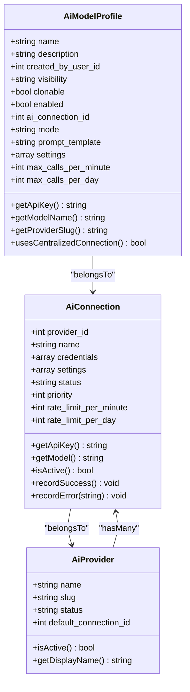
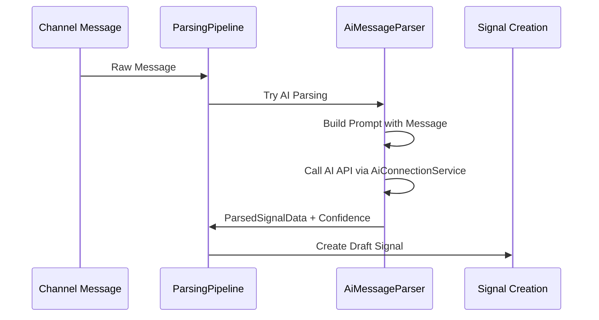
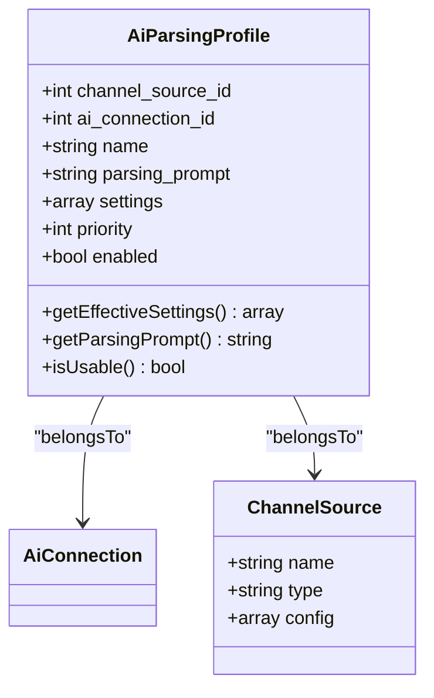
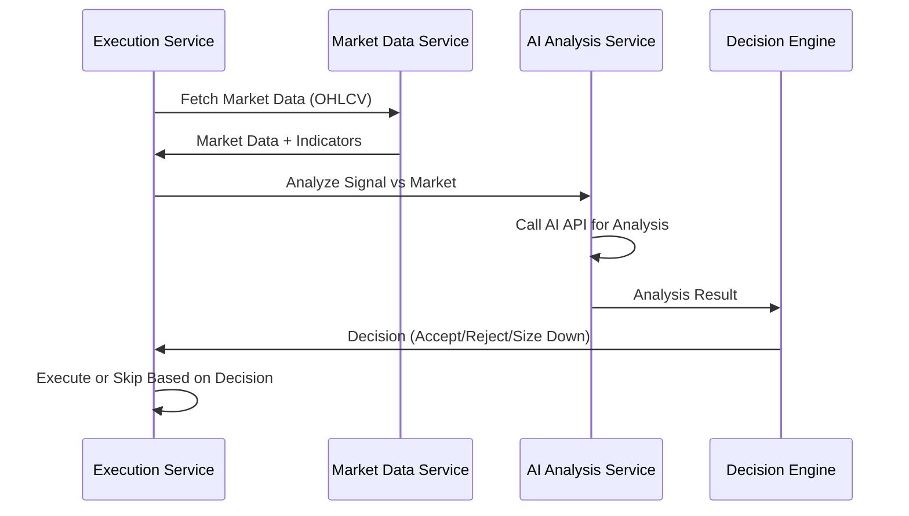
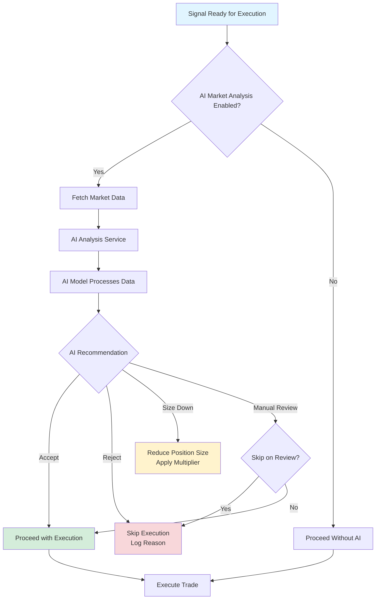

# AI Analysis

<cite>
**Referenced Files in This Document**   
- [AiModelProfile.php](file://main/addons/trading-management-addon/Modules/AiAnalysis/Models/AiModelProfile.php)
- [ai-trading-integration.md](file://docs/ai-trading-integration.md)
- [AiConnection.php](file://main/addons/ai-connection-addon/App/Models/AiConnection.php)
- [AiProvider.php](file://main/addons/ai-connection-addon/App/Models/AiProvider.php)
- [AiParsingProfile.php](file://main/addons/multi-channel-signal-addon/app/Models/AiParsingProfile.php)
- [AiMessageParser.php](file://main/addons/multi-channel-signal-addon/app/Parsers/AiMessageParser.php)
- [AiDecisionEngine.php](file://main/addons/_deprecated/ai-trading-addon/app/Services/AiDecisionEngine.php)
- [MarketAnalysisAiService.php](file://main/addons/_deprecated/ai-trading-addon/app/Services/MarketAnalysisAiService.php)
</cite>

## Table of Contents
1. [Introduction](#introduction)
2. [AI Model Configuration](#ai-model-configuration)
3. [AI Integration in Trading Workflow](#ai-integration-in-trading-workflow)
4. [AI-Driven Market Analysis](#ai-driven-market-analysis)
5. [AI Decision Pipeline](#ai-decision-pipeline)
6. [Practical Examples of AI Analysis](#practical-examples-of-ai-analysis)
7. [Risk Management Integration](#risk-management-integration)
8. [AI Model Training and Validation](#ai-model-training-and-validation)
9. [Conclusion](#conclusion)

## Introduction
The AI Analysis module enhances trading decisions by integrating artificial intelligence into the trading pipeline. This system leverages AI models to validate trading signals, analyze market conditions, and provide risk-adjusted recommendations. The architecture is designed to work with multiple AI providers including OpenAI, Google Gemini, and OpenRouter, enabling access to over 400 different AI models through a unified interface.

The system has evolved from a provider-specific configuration model to a centralized connection management system, allowing for better scalability, monitoring, and failover capabilities. AI analysis is integrated at multiple points in the trading workflow, including signal parsing from unstructured messages and market confirmation before trade execution.

**Section sources**
- [ai-trading-integration.md](file://docs/ai-trading-integration.md#L1-L301)

## AI Model Configuration

### AiModelProfile Model
The `AiModelProfile` model manages AI model configurations for market analysis and trading decisions. This model has been migrated from the deprecated ai-trading-addon to the trading-management-addon and provides a flexible framework for configuring AI models with different purposes.



**Diagram sources**
- [AiModelProfile.php](file://main/addons/trading-management-addon/Modules/AiAnalysis/Models/AiModelProfile.php#L17-L162)
- [AiConnection.php](file://main/addons/ai-connection-addon/App/Models/AiConnection.php#L9-L296)
- [AiProvider.php](file://main/addons/ai-connection-addon/App/Models/AiProvider.php#L8-L82)

The `AiModelProfile` supports three primary modes:
- **CONFIRM**: Confirm trading signals before execution
- **SCAN**: Scan markets for new opportunities
- **POSITION_MGMT**: Manage open positions

The model includes deprecation markers for legacy fields (`provider`, `model_name`, `api_key_ref`) while maintaining backward compatibility through fallback methods that retrieve credentials from the centralized `AiConnection` system.

**Section sources**
- [AiModelProfile.php](file://main/addons/trading-management-addon/Modules/AiAnalysis/Models/AiModelProfile.php#L17-L162)

### Centralized AI Connection Management
The AI connection system provides a centralized way to manage API connections to various AI providers. This architecture enables:
- Multiple connections per provider with priority-based routing
- Health monitoring and automatic failover
- Usage tracking and rate limit enforcement
- Encrypted credential storage
- Success rate and error tracking

The `AiConnection` model stores provider-specific credentials and settings, with sensitive data encrypted at rest. Each connection maintains statistics on success and error counts, which are used to determine health status and automatically disable failing connections.

**Section sources**
- [AiConnection.php](file://main/addons/ai-connection-addon/App/Models/AiConnection.php#L9-L296)
- [AiProvider.php](file://main/addons/ai-connection-addon/App/Models/AiProvider.php#L8-L82)

## AI Integration in Trading Workflow

### Signal Parsing with AI
AI is used to parse unstructured trading signals from various sources when traditional regex patterns fail. The `AiMessageParser` analyzes messages for trading terms, currency pairs, and numerical values to determine if AI parsing should be attempted.



**Diagram sources**
- [AiMessageParser.php](file://main/addons/multi-channel-signal-addon/app/Parsers/AiMessageParser.php#L11-L247)
- [ai-trading-integration.md](file://docs/ai-trading-integration.md#L124-L136)

The parsing process uses configurable prompt templates that can be customized per channel or globally. The AI response is expected to be in JSON format containing structured trading signal data, which is then validated and converted into a `ParsedSignalData` object.

**Section sources**
- [AiMessageParser.php](file://main/addons/multi-channel-signal-addon/app/Parsers/AiMessageParser.php#L11-L247)

### AI Parsing Profiles
The `AiParsingProfile` model allows for customized AI parsing configurations for different channels or use cases. Each profile includes:
- A specific AI connection to use
- Custom parsing prompt templates
- Priority settings
- Enabled/disabled status



**Diagram sources**
- [AiParsingProfile.php](file://main/addons/multi-channel-signal-addon/app/Models/AiParsingProfile.php#L9-L133)

Profiles can be global (not tied to a specific channel) or channel-specific, allowing for both standardized and customized parsing approaches across different signal sources.

**Section sources**
- [AiParsingProfile.php](file://main/addons/multi-channel-signal-addon/app/Models/AiParsingProfile.php#L9-L133)

## AI-Driven Market Analysis

### Market Confirmation Workflow
Before executing trades, the system can perform AI-driven market analysis to validate signals against current market conditions. This process fetches relevant market data and technical indicators, then submits them to an AI model for analysis.



**Diagram sources**
- [ai-trading-integration.md](file://docs/ai-trading-integration.md#L148-L161)

The analysis considers multiple factors including:
- Current market trend alignment
- Volatility levels
- Support and resistance levels
- Risk-reward ratio
- Technical indicator confluence

**Section sources**
- [ai-trading-integration.md](file://docs/ai-trading-integration.md#L41-L51)

### Analysis Output Structure
The AI analysis returns a structured response with the following key components:
- **alignment**: Market alignment with the signal (aligned, weakly_aligned, against_trend)
- **risk_score**: Risk assessment on a 0-100 scale
- **recommendation**: Action recommendation (accept, reject, size_down, manual_review)
- **reasoning**: Natural language explanation of the analysis
- **confidence**: Confidence level in the recommendation

This output is used by the decision engine to determine whether to proceed with trade execution, skip the signal, or modify the trade parameters.

**Section sources**
- [ai-trading-integration.md](file://docs/ai-trading-integration.md#L47-L51)

## AI Decision Pipeline

### Decision Engine Architecture
The AI decision pipeline integrates AI recommendations into the trading execution flow. When AI market analysis is enabled, the system follows a decision tree to determine the appropriate action.



**Diagram sources**
- [ai-trading-integration.md](file://docs/ai-trading-integration.md#L68-L92)

The `AiDecisionEngine` service processes these recommendations and translates them into actionable trading decisions, with appropriate logging and audit trails.

**Section sources**
- [AiDecisionEngine.php](file://main/addons/_deprecated/ai-trading-addon/app/Services/AiDecisionEngine.php#L1-L100)

### Confidence Scoring and Consensus
The system implements confidence scoring to assess the reliability of AI-generated insights. For signal parsing, confidence is calculated based on the completeness of extracted data:
- 20 points for currency pair detection
- 20 points for direction detection
- 20 points for entry price
- 15 points for stop loss
- 15 points for take profit
- 10 points for timeframe

The `MarketAnalysisAiService` coordinates with multiple AI models when available, potentially using consensus mechanisms to increase decision reliability. If multiple models are configured, the system can aggregate their recommendations and apply weighting based on historical performance.

**Section sources**
- [AiMessageParser.php](file://main/addons/multi-channel-signal-addon/app/Parsers/AiMessageParser.php#L219-L234)
- [MarketAnalysisAiService.php](file://main/addons/_deprecated/ai-trading-addon/app/Services/MarketAnalysisAiService.php#L1-L50)

## Practical Examples of AI Analysis

### Example 1: Signal Accepted
```
Market Analysis Result:
- Alignment: aligned
- Risk Score: 85/100
- Recommendation: accept
- Reasoning: "Strong bullish trend with good entry point. 
              Stop loss at support level. Favorable R:R ratio."

Action: Execute trade with full position size
```

### Example 2: Signal Rejected
```
Market Analysis Result:
- Alignment: against_trend
- Risk Score: 25/100
- Recommendation: reject
- Reasoning: "Signal contradicts current market trend. 
              High volatility detected. Entry point suboptimal."

Action: Skip execution, log rejection reason
```

### Example 3: Size Down
```
Market Analysis Result:
- Alignment: weakly_aligned
- Risk Score: 60/100
- Recommendation: size_down
- Reasoning: "Market shows mixed signals. Trend not fully established. 
              Reduce position size by 50% to manage risk."

Action: Execute with 50% of normal position size
```

These examples demonstrate how AI analysis can validate or reject trading signals based on market context understanding, preventing trades in unfavorable conditions and adjusting position sizing based on risk assessment.

**Section sources**
- [ai-trading-integration.md](file://docs/ai-trading-integration.md#L228-L265)

## Risk Management Integration

### Position Sizing Adjustment
AI-generated insights directly influence position sizing through the "size_down" recommendation. When this recommendation is received, the system applies a size multiplier to reduce the position:

```php
// AI returns adjusted_risk_factor = 0.5
$options['size_multiplier'] = 0.5;
$quantity = $baseQuantity * 0.5; // Reduce by 50%
```

This dynamic position sizing allows the system to adapt to changing market conditions, reducing exposure when uncertainty is high while maintaining full position sizes when confidence is strong.

**Section sources**
- [ai-trading-integration.md](file://docs/ai-trading-integration.md#L175-L179)

### Stop-Loss Placement
While not explicitly detailed in the code, the AI analysis considers stop-loss placement as part of its risk assessment. The reasoning provided in analysis results often references support and resistance levels, suggesting that AI insights could be used to optimize stop-loss placement. Future enhancements could integrate AI recommendations directly into stop-loss calculation algorithms.

The system's risk management is further enhanced by the AI connection health monitoring, which ensures that trading decisions are not compromised by unreliable AI services. Connections with high error rates are automatically disabled, and the system can fall back to alternative providers or disable AI analysis if necessary.

**Section sources**
- [ai-trading-integration.md](file://docs/ai-trading-integration.md#L48-L51)
- [AiConnection.php](file://main/addons/ai-connection-addon/App/Models/AiConnection.php#L278-L293)

## AI Model Training and Validation

### Model Testing and Validation
The system provides mechanisms for testing and validating AI models before deployment. Administrators can:
- Test AI connections with sample prompts
- Compare performance across different models
- Monitor usage statistics and success rates
- Review analysis results and recommendations

The `AiConnection` model tracks usage statistics including success and error counts, which are used to calculate success rates and health status. This data can be used to evaluate model performance over time and make informed decisions about which models to prioritize.

### Best Practices for AI Integration
The documentation outlines several best practices for effective AI integration:

**API Cost Management**
- Cache AI analysis results when possible
- Use cheaper models for simple tasks
- Respect API rate limits
- Implement graceful fallback when AI is unavailable

**Performance Optimization**
- Queue AI API calls for async processing
- Set appropriate timeouts
- Implement retry logic for transient failures
- Batch requests when possible

**Accuracy Improvement**
- Set minimum confidence thresholds
- Flag low-confidence results for manual review
- Log all AI decisions for analysis
- Conduct A/B testing with different AI models

These practices ensure that AI integration enhances trading performance without introducing excessive costs or latency.

**Section sources**
- [ai-trading-integration.md](file://docs/ai-trading-integration.md#L281-L300)

## Conclusion
The AI Analysis module provides a comprehensive framework for integrating artificial intelligence into trading decisions. By leveraging multiple AI providers through a centralized connection management system, the platform can analyze market conditions, validate trading signals, and provide risk-adjusted recommendations.

The architecture has evolved from a provider-specific model to a flexible, scalable system that supports multiple use cases including signal parsing and market confirmation. AI models are integrated into the trading pipeline with confidence scoring and consensus mechanisms, allowing for intelligent decision-making that adapts to market conditions.

The system's integration with risk management components enables dynamic position sizing and could be extended to optimize stop-loss placement. With proper training, testing, and validation, AI models can significantly enhance trading performance by providing contextual market understanding that complements traditional technical analysis.

Future enhancements could include more sophisticated consensus mechanisms, machine learning for model selection based on market regimes, and deeper integration of AI insights into all aspects of trade management.

**Section sources**
- [ai-trading-integration.md](file://docs/ai-trading-integration.md#L1-L301)
- [AiModelProfile.php](file://main/addons/trading-management-addon/Modules/AiAnalysis/Models/AiModelProfile.php#L17-L162)
- [AiConnection.php](file://main/addons/ai-connection-addon/App/Models/AiConnection.php#L9-L296)