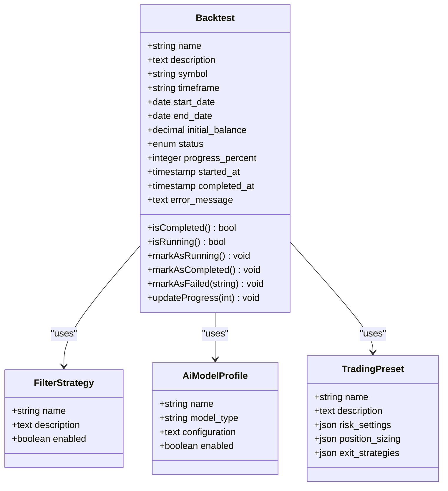
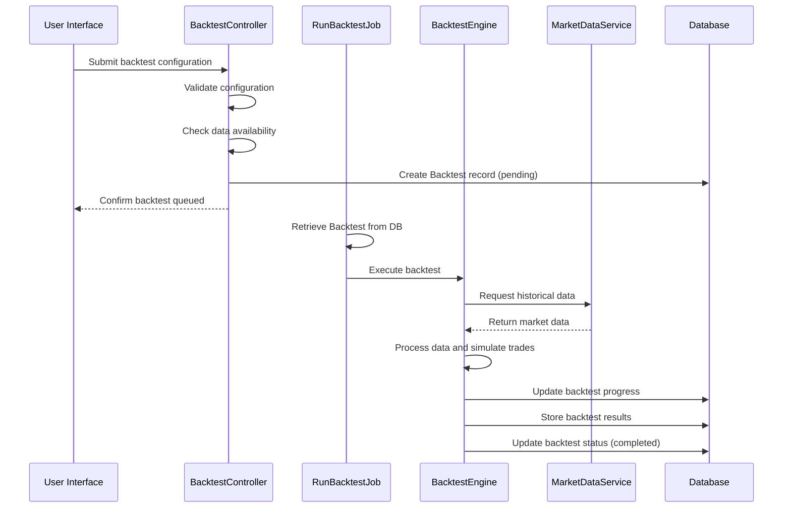
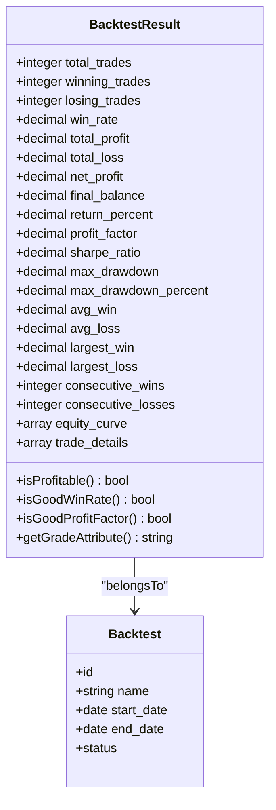

# Backtesting

<cite>
**Referenced Files in This Document**   
- [Backtest.php](file://main/addons/trading-management-addon/Modules/Backtesting/Models/Backtest.php)
- [BacktestResult.php](file://main/addons/trading-management-addon/Modules/Backtesting/Models/BacktestResult.php)
- [BacktestController.php](file://main/addons/trading-management-addon/Modules/Backtesting/Controllers/Backend/BacktestController.php)
- [RunBacktestJob.php](file://main/addons/trading-management-addon/Modules/Backtesting/Jobs/RunBacktestJob.php)
- [BacktestEngine.php](file://main/addons/trading-management-addon/Modules/Backtesting/Services/BacktestEngine.php)
- [create_backtests_table.php](file://main/addons/trading-management-addon/database/migrations/2025_12_04_100013_create_backtests_table.php)
- [create_backtest_results_table.php](file://main/addons/trading-management-addon/database/migrations/2025_12_04_100014_create_backtest_results_table.php)
- [create_template_backtests_table.php](file://main/database/migrations/2025_12_05_015209_create_template_backtests_table.php)
- [create.blade.php](file://main/addons/trading-management-addon/resources/views/backend/trading-management/test/backtests/create.blade.php)
- [backtesting.blade.php](file://main/resources/views/frontend/default/user/trading/backtesting.blade.php)
</cite>

## Table of Contents
1. [Introduction](#introduction)
2. [Backtest Model and Configuration](#backtest-model-and-configuration)
3. [Backtesting Engine Implementation](#backtesting-engine-implementation)
4. [Backtest Result Calculation and Metrics](#backtest-result-calculation-and-metrics)
5. [Data Availability and Validation](#data-availability-and-validation)
6. [User Interface and Workflow](#user-interface-and-workflow)
7. [Template Backtesting System](#template-backtesting-system)
8. [Performance and Scalability](#performance-and-scalability)
9. [Best Practices and Common Pitfalls](#best-practices-and-common-pitfalls)
10. [Conclusion](#conclusion)

## Introduction

The Backtesting system is a comprehensive framework designed to evaluate trading strategies using historical market data. This system enables users to simulate trading strategies under realistic market conditions, incorporating various strategy components such as filter strategies, AI model profiles, and trading presets. The backtesting process is designed to be both robust and user-friendly, providing detailed performance metrics and visualizations to help users assess the viability of their trading strategies.

The system is implemented as part of the Trading Management addon, with a modular architecture that separates concerns between configuration, execution, and result analysis. The backtesting workflow begins with the creation of a backtest configuration, which specifies the strategy parameters, time period, and initial conditions. Once configured, the backtest is queued for execution, where it simulates trades using historical market data with considerations for realistic trading factors.

The backtesting system is designed to handle various asset classes and market conditions, allowing users to test strategies across different symbols and timeframes. The system also incorporates data availability checks to ensure that sufficient historical data exists for the specified backtest period, preventing incomplete or inaccurate simulations.

**Section sources**
- [BacktestController.php](file://main/addons/trading-management-addon/Modules/Backtesting/Controllers/Backend/BacktestController.php#L17-L29)
- [backtesting.blade.php](file://main/resources/views/frontend/default/user/trading/backtesting.blade.php#L1-L224)

## Backtest Model and Configuration

The Backtest model serves as the foundation for the backtesting system, defining the parameters and configuration for each backtest run. The model is implemented as an Eloquent model with a comprehensive set of attributes that capture all necessary information for executing a backtest simulation.

The backtest configuration includes essential parameters such as the trading symbol, timeframe, start and end dates, and initial balance. These parameters define the scope and conditions of the backtest, specifying the market conditions and financial constraints under which the strategy will be evaluated. The model also includes references to various strategy components, including filter strategies, AI model profiles, and trading presets, which collectively define the trading logic and risk management parameters.

The backtest model incorporates a status tracking system that monitors the execution state of each backtest. The status can be one of four values: pending, running, completed, or failed. This state management allows users to track the progress of their backtests and identify any issues that may arise during execution. The model also includes progress tracking through a progress_percent field, which provides a quantitative measure of completion for long-running backtests.

The model implements several helper methods to facilitate status management, including isCompleted(), isRunning(), markAsRunning(), markAsCompleted(), and markAsFailed(). These methods provide a clean interface for updating the backtest state and ensure consistent state transitions throughout the execution lifecycle. The updateProgress() method allows for incremental progress updates, which is particularly useful for long-running backtests that process large amounts of historical data.

**Diagram sources **
- [Backtest.php](file://main/addons/trading-management-addon/Modules/Backtesting/Models/Backtest.php#L13-L135)
- [create_backtests_table.php](file://main/addons/trading-management-addon/database/migrations/2025_12_04_100013_create_backtests_table.php#L16-L68)

**Section sources**
- [Backtest.php](file://main/addons/trading-management-addon/Modules/Backtesting/Models/Backtest.php#L13-L135)
- [create_backtests_table.php](file://main/addons/trading-management-addon/database/migrations/2025_12_04_100013_create_backtests_table.php#L16-L68)

## Backtesting Engine Implementation

The backtesting engine is implemented as a service class that orchestrates the execution of backtest simulations. The engine is designed to be modular and extensible, allowing for the integration of various strategy components and market data sources. The engine is invoked through a queued job, RunBacktestJob, which ensures that backtests are executed asynchronously without blocking the main application thread.

The backtesting process follows a structured workflow that begins with data retrieval and preparation. The engine uses the MarketDataService to fetch historical market data for the specified symbol and timeframe within the defined date range. This data is then processed and organized into a format suitable for simulation, typically as a series of candlestick data points containing open, high, low, close, and volume information.

During the simulation phase, the engine iterates through each data point in chronological order, applying the configured trading strategy at each step. The strategy execution involves evaluating the filter strategy conditions, processing signals through the AI model profile (if configured), and determining position sizing and risk parameters based on the trading preset. The engine simulates trade execution, accounting for realistic factors such as slippage, commission, and latency, although specific implementation details of these factors are not visible in the provided code.

The engine is designed to handle errors gracefully, with comprehensive logging and error reporting mechanisms. If an error occurs during execution, the engine captures the error message and updates the backtest status accordingly. The RunBacktestJob class includes error handling in both the handle() and failed() methods, ensuring that any issues are properly logged and the backtest status is updated to reflect the failure.

**Diagram sources **
- [RunBacktestJob.php](file://main/addons/trading-management-addon/Modules/Backtesting/Jobs/RunBacktestJob.php#L13-L69)
- [BacktestEngine.php](file://main/addons/trading-management-addon/Modules/Backtesting/Services/BacktestEngine.php)
- [BacktestController.php](file://main/addons/trading-management-addon/Modules/Backtesting/Controllers/Backend/BacktestController.php#L118-L171)

**Section sources**
- [RunBacktestJob.php](file://main/addons/trading-management-addon/Modules/Backtesting/Jobs/RunBacktestJob.php#L13-L69)
- [BacktestEngine.php](file://main/addons/trading-management-addon/Modules/Backtesting/Services/BacktestEngine.php)
- [BacktestController.php](file://main/addons/trading-management-addon/Modules/Backtesting/Controllers/Backend/BacktestController.php#L118-L171)

## Backtest Result Calculation and Metrics

The backtesting system generates comprehensive performance metrics through the BacktestResult model, which captures both summary statistics and detailed trade information. The results are stored in a dedicated table that maintains a one-to-one relationship with the parent backtest, ensuring data integrity and efficient retrieval.

The result model includes a wide range of performance metrics that provide insights into the effectiveness and risk profile of the tested strategy. Key metrics include total trades, winning trades, losing trades, and win rate, which offer a basic assessment of the strategy's success rate. Financial metrics such as total profit, total loss, net profit, final balance, and return percentage quantify the monetary performance of the strategy.

Risk assessment is a critical component of the backtesting results, with metrics such as profit factor, Sharpe ratio, maximum drawdown, and maximum drawdown percentage providing insights into the risk-reward profile of the strategy. The profit factor, calculated as the ratio of total profits to total losses, indicates the strategy's ability to generate profits relative to its losses. The Sharpe ratio measures risk-adjusted returns, while maximum drawdown quantifies the largest peak-to-trough decline in the equity curve.

The model also includes trade-specific metrics such as average win, average loss, largest win, largest loss, consecutive wins, and consecutive losses, which provide additional context about the distribution and sequence of trade outcomes. These metrics help identify patterns in the strategy's performance and assess its consistency over time.

A unique feature of the result model is the grade attribute, which provides an overall assessment of the backtest performance based on a weighted scoring system. The grade is calculated by evaluating multiple performance dimensions, including win rate, profit factor, maximum drawdown, and return percentage, and assigning points based on predefined thresholds. The total score is then mapped to a letter grade (A through F), providing a quick reference for performance evaluation.

**Diagram sources **
- [BacktestResult.php](file://main/addons/trading-management-addon/Modules/Backtesting/Models/BacktestResult.php#L7-L106)
- [create_backtest_results_table.php](file://main/addons/trading-management-addon/database/migrations/2025_12_04_100014_create_backtest_results_table.php#L11-L60)

**Section sources**
- [BacktestResult.php](file://main/addons/trading-management-addon/Modules/Backtesting/Models/BacktestResult.php#L7-L106)
- [create_backtest_results_table.php](file://main/addons/trading-management-addon/database/migrations/2025_12_04_100014_create_backtest_results_table.php#L11-L60)

## Data Availability and Validation

The backtesting system incorporates robust data availability checks to ensure the integrity and reliability of backtest results. Before executing a backtest, the system validates that sufficient historical market data is available for the specified symbol, timeframe, and date range. This validation process is implemented through two complementary endpoints in the BacktestController: checkDataAvailability() and validateDateRange().

The checkDataAvailability() method provides initial validation by determining whether any market data exists for the specified symbol and timeframe. When a user enters a symbol and selects a timeframe in the backtest creation form, an AJAX request is sent to this endpoint, which returns information about the available date range and total number of candles. This information is used to update the UI, setting appropriate min and max values for the date inputs and providing feedback about data availability.

The validateDateRange() method performs more granular validation by checking whether the specific date range selected by the user has adequate data coverage. This method calculates the percentage of available data within the requested period and identifies any missing dates. If the coverage is insufficient, the system warns the user but still allows the backtest to proceed, recognizing that some gaps in data may be acceptable depending on the strategy and timeframe.

The data validation process is tightly integrated with the user interface, providing real-time feedback as users configure their backtests. JavaScript in the create.blade.php template handles the interaction between the form inputs and the validation endpoints, updating the UI dynamically based on the validation results. This immediate feedback helps users make informed decisions about their backtest parameters and avoid configurations that would produce unreliable results.

The system also implements server-side validation in the store() method of the BacktestController, which performs the same availability checks before creating the backtest record. This dual validation approach ensures data integrity even if the client-side validation is bypassed. If insufficient data is available, the server returns an error message directing the user to adjust their date range.

**Section sources**
- [BacktestController.php](file://main/addons/trading-management-addon/Modules/Backtesting/Controllers/Backend/BacktestController.php#L62-L160)
- [create.blade.php](file://main/addons/trading-management-addon/resources/views/backend/trading-management/test/backtests/create.blade.php#L143-L346)

## User Interface and Workflow

The backtesting system provides a comprehensive user interface that guides users through the process of creating, managing, and analyzing backtests. The interface is implemented as a multi-tabbed system in the backend administration panel, with separate views for creating new backtests, viewing existing backtests, and examining detailed results.

The backtest creation workflow begins with a form that collects essential configuration parameters. Users specify the backtest name, trading symbol, timeframe, date range, and initial balance. The form also allows users to select optional strategy components, including filter strategies, AI model profiles, and trading presets, which are populated from the database based on their enabled status. The form includes real-time validation through AJAX calls to ensure data availability before submission.

Once a backtest is created, it appears in the backtests index with its current status (pending, running, completed, or failed). Users can view detailed information about each backtest, including its configuration, execution status, and results. The show() method in the BacktestController loads the backtest with its associated result data, providing a comprehensive overview of the backtest performance.

The frontend user interface, implemented in backtesting.blade.php, provides a simplified view for end users. This interface includes tabs for creating backtests, viewing results, and accessing performance reports. While the current implementation indicates that the backtesting feature is "coming soon" for frontend users, the structure suggests a planned rollout that will eventually provide full backtesting capabilities to all users.

The user interface incorporates several design patterns to enhance usability, including real-time feedback, progressive disclosure, and status visualization. Error messages and warnings are displayed prominently to alert users to potential issues, while success messages confirm successful operations. The interface also includes navigation elements that allow users to move between different views and return to previous pages.

**Section sources**
- [create.blade.php](file://main/addons/trading-management-addon/resources/views/backend/trading-management/test/backtests/create.blade.php#L1-L347)
- [backtesting.blade.php](file://main/resources/views/frontend/default/user/trading/backtesting.blade.php#L1-L224)
- [BacktestController.php](file://main/addons/trading-management-addon/Modules/Backtesting/Controllers/Backend/BacktestController.php#L30-L47)

## Template Backtesting System

The system includes a template backtesting framework that allows for the evaluation of pre-configured trading strategies and bots. This is implemented through the template_backtests table, which stores performance metrics for various template types, including bots, signals, and complete trading systems. This feature enables users to compare the performance of different strategy templates and select the most effective ones for their trading goals.

The template backtesting system captures a comprehensive set of performance metrics similar to the standard backtest results, including capital initial and final values, net profit percentage, win rate, profit factor, maximum drawdown, and total trades. It also includes more granular metrics such as average win and loss percentages, which provide additional insights into the risk-reward profile of the template strategies.

A key feature of the template backtesting system is its ability to store information about the testing conditions, including the backtest period start and end dates, symbols tested, and timeframes tested. This contextual information is crucial for interpreting the results and understanding the market conditions under which the template strategies were evaluated.

The system also includes storage for detailed results in a JSON field, allowing for the preservation of trade-by-trade data and other granular information. This detailed data can be used for in-depth analysis and visualization, helping users understand the specific circumstances under which the template strategies succeeded or failed.

The template backtesting system is designed to support comparison and selection of strategies based on performance metrics. The database schema includes indexes on key performance indicators such as win rate and net profit percentage, enabling efficient querying and sorting of template results. This facilitates the creation of leaderboards and performance rankings, helping users identify the most promising strategy templates.

**Section sources**
- [create_template_backtests_table.php](file://main/database/migrations/2025_12_05_015209_create_template_backtests_table.php#L1-L44)

## Performance and Scalability

The backtesting system is designed with performance and scalability in mind, incorporating several architectural patterns to handle potentially resource-intensive operations. The use of queued jobs for backtest execution ensures that the main application thread is not blocked by long-running simulations, maintaining responsiveness for other users and operations.

The RunBacktestJob class is configured with a timeout of one hour, accommodating large backtests that process extensive historical data. This generous timeout allows for thorough testing of strategies across multiple years of market data without premature termination. The job is designed to be executed by queue workers, which can be scaled horizontally to handle increased backtesting demand.

The database schema includes several optimization features to support efficient querying and data retrieval. Indexes are created on frequently queried fields such as status, symbol, and user/admin IDs, enabling fast filtering and sorting of backtest records. The backtest_results table includes a unique constraint on the backtest_id field, ensuring data integrity while supporting efficient lookups.

The system incorporates progress tracking through the progress_percent field, which allows users to monitor the status of long-running backtests. This feature is particularly important for maintaining user confidence during extended simulations, as it provides visible feedback that the process is progressing as expected.

The data validation process is optimized to minimize redundant API calls and database queries. The MarketDataService is injected as a dependency, allowing for efficient reuse of data retrieval logic. The system also implements client-side caching of data availability information, reducing the number of server requests during the backtest configuration process.

**Section sources**
- [RunBacktestJob.php](file://main/addons/trading-management-addon/Modules/Backtesting/Jobs/RunBacktestJob.php#L19-L20)
- [create_backtests_table.php](file://main/addons/trading-management-addon/database/migrations/2025_12_04_100013_create_backtests_table.php#L56-L60)
- [create_backtest_results_table.php](file://main/addons/trading-management-addon/database/migrations/2025_12_04_100014_create_backtest_results_table.php#L49-L50)

## Best Practices and Common Pitfalls

When using the backtesting system, several best practices should be followed to ensure reliable and meaningful results. First, users should ensure adequate data coverage for their backtest periods, as gaps in historical data can lead to inaccurate simulations. The system's data availability checks help identify potential issues, but users should also consider the quality and granularity of the data, particularly for higher frequency strategies.

To avoid overfitting, users should test their strategies on out-of-sample data after optimization. This involves dividing historical data into training and testing periods, optimizing the strategy on the training data, and then evaluating its performance on the unseen testing data. The system supports this approach by allowing users to specify custom date ranges for backtests.

Look-ahead bias is another common pitfall that can invalidate backtest results. This occurs when a strategy uses information that would not have been available at the time of trade execution. Users should ensure that their strategies only use data that was available at each point in time, avoiding the use of future information or indicators that require future data points for calculation.

Curve fitting, or optimizing a strategy to perform well on historical data but poorly on new data, can be mitigated by using robust optimization techniques and testing across multiple market conditions. Users should evaluate their strategies across different market regimes (bull, bear, sideways) and asset classes to ensure robustness.

The system's support for various strategy components, including filter strategies, AI models, and trading presets, allows for comprehensive testing of different approach combinations. Users should systematically test variations of their strategies to identify the most robust configurations rather than focusing on maximizing performance on a single dataset.

**Section sources**
- [BacktestController.php](file://main/addons/trading-management-addon/Modules/Backtesting/Controllers/Backend/BacktestController.php#L133-L145)
- [BacktestResult.php](file://main/addons/trading-management-addon/Modules/Backtesting/Models/BacktestResult.php#L78-L103)

## Conclusion

The Backtesting system provides a comprehensive framework for evaluating trading strategies using historical market data. The system's modular architecture separates concerns between configuration, execution, and result analysis, enabling flexible and extensible testing of various strategy components. The integration of filter strategies, AI model profiles, and trading presets allows for sophisticated strategy testing that reflects real-world trading conditions.

The system incorporates robust data validation to ensure the integrity of backtest results, with comprehensive checks for data availability and coverage. The use of queued jobs for execution ensures scalability and responsiveness, while the detailed performance metrics provide valuable insights into strategy effectiveness and risk profiles.

The template backtesting system extends the functionality by enabling comparison of pre-configured strategies, helping users identify the most promising approaches for their trading goals. The comprehensive metrics and grading system provide both quantitative and qualitative assessments of strategy performance.

Future enhancements could include more sophisticated modeling of trading costs, slippage, and market impact, as well as support for multi-asset and portfolio-level backtesting. The system could also benefit from advanced visualization tools and statistical analysis features to help users interpret results more effectively.

Overall, the Backtesting system provides a solid foundation for strategy evaluation and optimization, helping users make informed decisions about their trading approaches before risking capital in live markets.