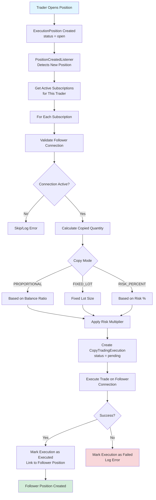
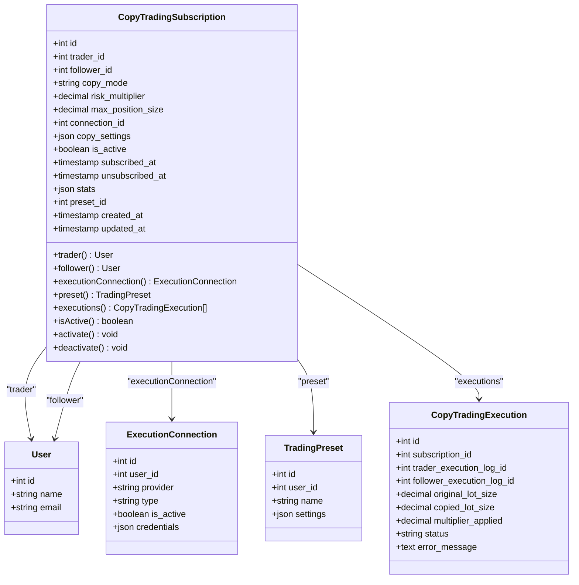
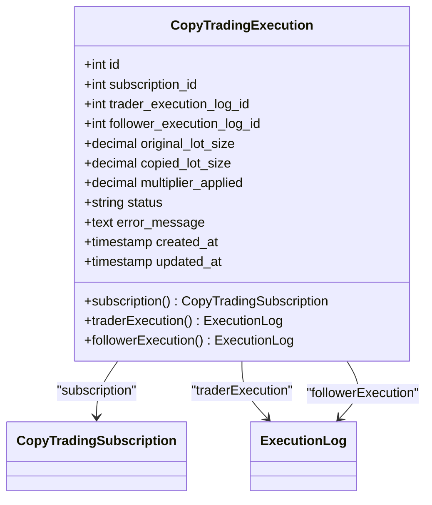
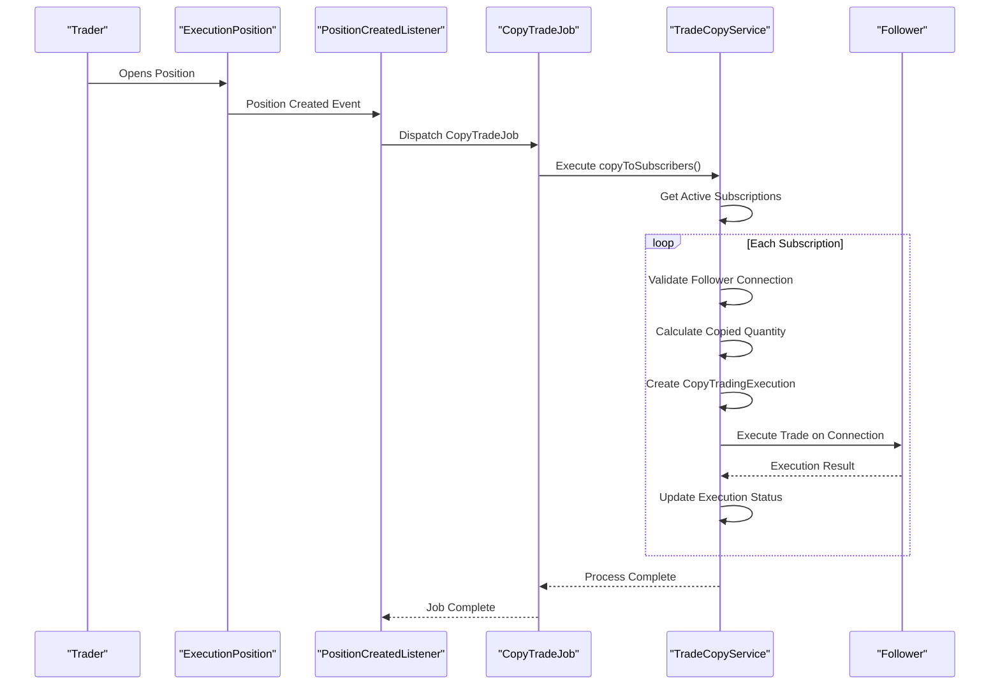
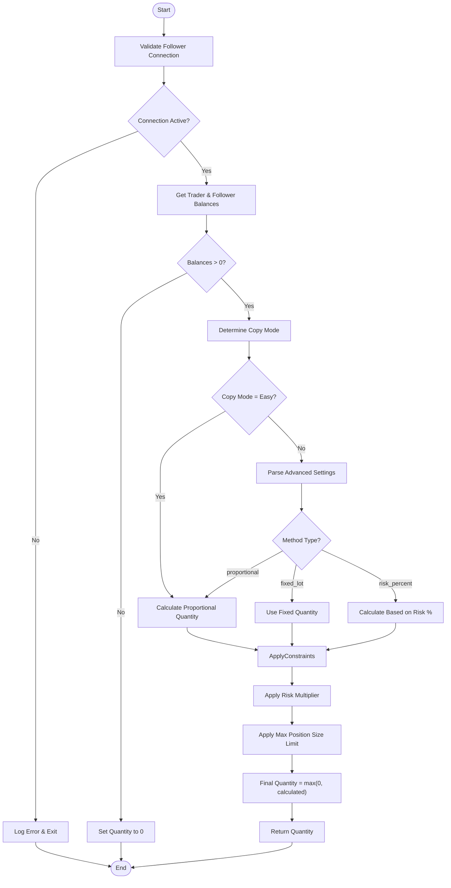
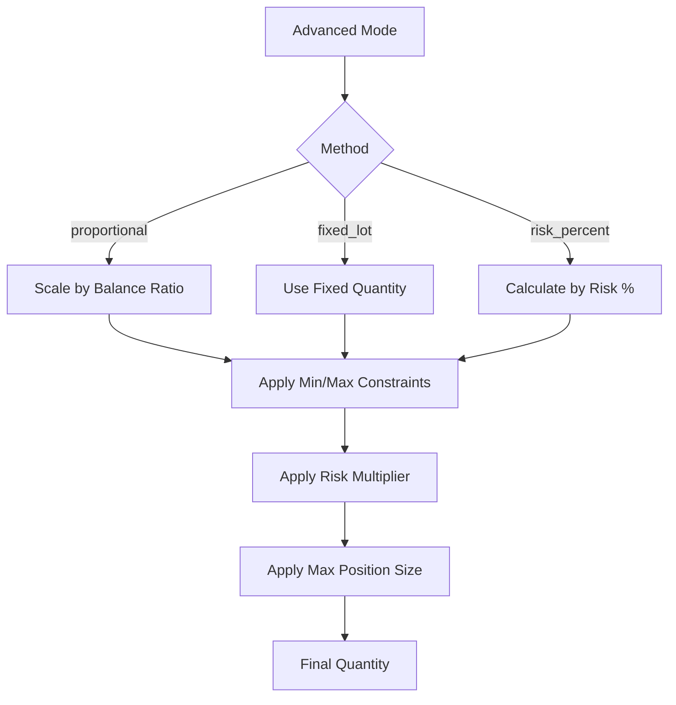
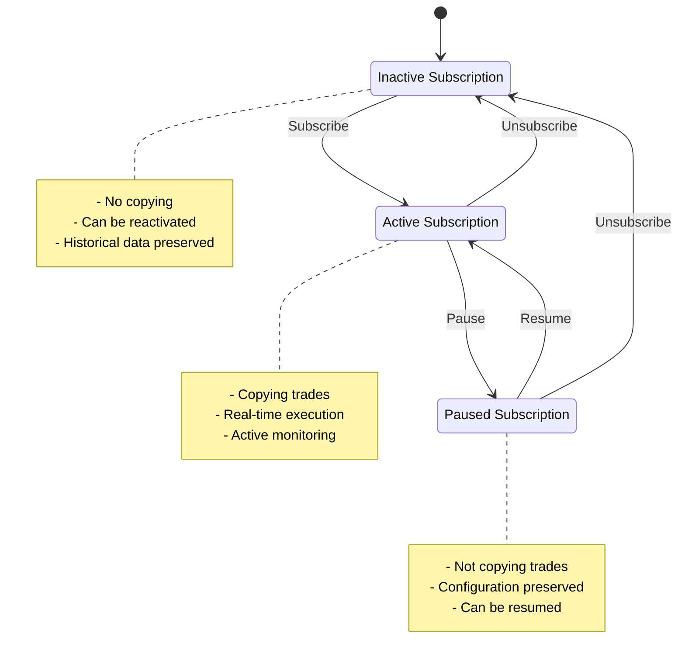
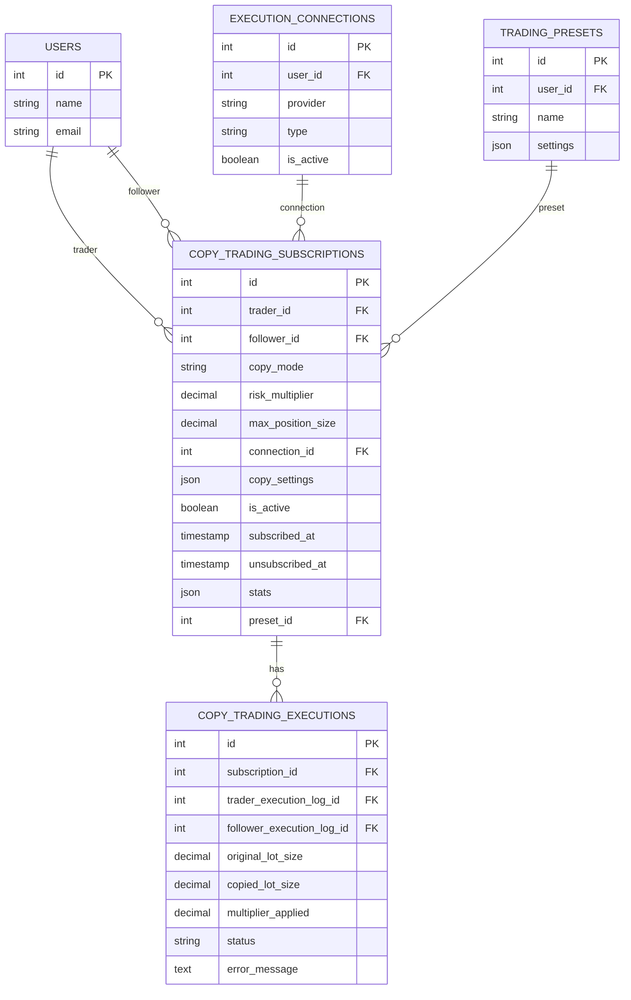

# Copy Trading

<cite>
**Referenced Files in This Document**   
- [copy-trading-system.md](file://docs/copy-trading-system.md)
- [CreateCopyTradingSubscriptionsTable.php](file://main/addons/trading-management-addon/database/migrations/2025_01_30_100001_create_copy_trading_subscriptions_table.php)
- [CreateCopyTradingExecutionsTable.php](file://main/addons/trading-management-addon/database/migrations/2025_01_30_100002_create_copy_trading_executions_table.php)
- [TradeCopyService.php](file://main/addons/trading-management-addon/Modules/CopyTrading/Services/TradeCopyService.php)
- [CopyTradingSubscription.php](file://main/addons/trading-management-addon/Modules/CopyTrading/Models/CopyTradingSubscription.php)
- [CopyTradingExecution.php](file://main/addons/trading-management-addon/Modules/CopyTrading/Models/CopyTradingExecution.php)
- [PositionCreatedListener.php](file://main/addons/trading-management-addon/Modules/CopyTrading/Listeners/PositionCreatedListener.php)
- [CopyTradeJob.php](file://main/addons/trading-management-addon/Modules/CopyTrading/Jobs/CopyTradeJob.php)
- [CopyTradingController.php](file://main/addons/trading-management-addon/Modules/CopyTrading/Controllers/Backend/CopyTradingController.php)
</cite>

## Table of Contents
1. [Introduction](#introduction)
2. [Copy Trading Architecture](#copy-trading-architecture)
3. [Core Components](#core-components)
4. [Copy Trading Workflow](#copy-trading-workflow)
5. [Copy Trading Modes](#copy-trading-modes)
6. [Risk Management and Presets](#risk-management-and-presets)
7. [Subscription Management](#subscription-management)
8. [Error Handling and Troubleshooting](#error-handling-and-troubleshooting)
9. [Administration and Monitoring](#administration-and-monitoring)
10. [Best Practices](#best-practices)

## Introduction

The Copy Trading system enables users to automatically replicate trades from signal providers (traders) to follower accounts. This social trading feature allows users to benefit from the expertise of successful traders by mirroring their trading activities with customizable risk parameters. The system supports multiple copy modes, risk controls, and integrates with trading presets to provide a comprehensive copy trading experience.

**Section sources**
- [copy-trading-system.md](file://docs/copy-trading-system.md#L1-L427)

## Copy Trading Architecture

The copy trading system follows an event-driven architecture that automatically replicates trades from signal providers to followers. When a trader executes a trade, the system detects the new position and initiates the copy process for all active followers.



**Diagram sources**
- [copy-trading-system.md](file://docs/copy-trading-system.md#L12-L45)
- [PositionCreatedListener.php](file://main/addons/trading-management-addon/Modules/CopyTrading/Listeners/PositionCreatedListener.php#L19-L57)
- [TradeCopyService.php](file://main/addons/trading-management-addon/Modules/CopyTrading/Services/TradeCopyService.php#L29-L71)

**Section sources**
- [copy-trading-system.md](file://docs/copy-trading-system.md#L8-L45)
- [PositionCreatedListener.php](file://main/addons/trading-management-addon/Modules/CopyTrading/Listeners/PositionCreatedListener.php#L19-L57)

## Core Components

### Copy Trading Subscription Model

The `CopyTradingSubscription` model manages the relationship between followers and signal providers, storing configuration for how trades should be copied.

**Key Fields**:
- `trader_id`: User who's being copied
- `follower_id`: User who copies trades
- `copy_mode`: easy, advanced
- `risk_multiplier`: Position size multiplier (0.1 to 10.0)
- `max_position_size`: Maximum USD amount per copied trade
- `connection_id`: Follower's execution connection
- `copy_settings`: Advanced mode settings (method, percentage, fixed_quantity, min_quantity, max_quantity)
- `is_active`: Subscription status (active/inactive)
- `preset_id`: Associated trading preset for additional rules



**Diagram sources**
- [CopyTradingSubscription.php](file://main/addons/trading-management-addon/Modules/CopyTrading/Models/CopyTradingSubscription.php#L17-L111)
- [CreateCopyTradingSubscriptionsTable.php](file://main/addons/trading-management-addon/database/migrations/2025_01_30_100001_create_copy_trading_subscriptions_table.php#L16-L40)

**Section sources**
- [CopyTradingSubscription.php](file://main/addons/trading-management-addon/Modules/CopyTrading/Models/CopyTradingSubscription.php#L17-L111)
- [CreateCopyTradingSubscriptionsTable.php](file://main/addons/trading-management-addon/database/migrations/2025_01_30_100001_create_copy_trading_subscriptions_table.php#L16-L40)

### Copy Trading Execution Model

The `CopyTradingExecution` model tracks each copied trade execution, providing audit trails and status monitoring.

**Key Fields**:
- `subscription_id`: Reference to the subscription
- `trader_execution_log_id`: Original trader's execution log
- `follower_execution_log_id`: Created follower execution log
- `original_lot_size`: Trader's position size
- `copied_lot_size`: Follower's position size
- `multiplier_applied`: Risk multiplier used
- `status`: pending, executed, failed, closed
- `error_message`: Error details if execution failed



**Diagram sources**
- [CopyTradingExecution.php](file://main/addons/trading-management-addon/Modules/CopyTrading/Models/CopyTradingExecution.php#L8-L45)
- [CreateCopyTradingExecutionsTable.php](file://main/addons/trading-management-addon/database/migrations/2025_01_30_100002_create_copy_trading_executions_table.php#L16-L45)

**Section sources**
- [CopyTradingExecution.php](file://main/addons/trading-management-addon/Modules/CopyTrading/Models/CopyTradingExecution.php#L8-L45)
- [CreateCopyTradingExecutionsTable.php](file://main/addons/trading-management-addon/database/migrations/2025_01_30_100002_create_copy_trading_executions_table.php#L16-L45)

## Copy Trading Workflow

### Event-Driven Architecture

The copy trading process is triggered by events in the trading system, following a well-defined sequence:



**Diagram sources**
- [PositionCreatedListener.php](file://main/addons/trading-management-addon/Modules/CopyTrading/Listeners/PositionCreatedListener.php#L19-L57)
- [CopyTradeJob.php](file://main/addons/trading-management-addon/Modules/CopyTrading/Jobs/CopyTradeJob.php#L33-L47)
- [TradeCopyService.php](file://main/addons/trading-management-addon/Modules/CopyTrading/Services/TradeCopyService.php#L29-L71)

**Section sources**
- [PositionCreatedListener.php](file://main/addons/trading-management-addon/Modules/CopyTrading/Listeners/PositionCreatedListener.php#L19-L57)
- [CopyTradeJob.php](file://main/addons/trading-management-addon/Modules/CopyTrading/Jobs/CopyTradeJob.php#L33-L47)

### Quantity Calculation Process

The system calculates the copied quantity based on the follower's configuration and the trader's position:



**Diagram sources**
- [TradeCopyService.php](file://main/addons/trading-management-addon/Modules/CopyTrading/Services/TradeCopyService.php#L143-L214)

**Section sources**
- [TradeCopyService.php](file://main/addons/trading-management-addon/Modules/CopyTrading/Services/TradeCopyService.php#L143-L214)

## Copy Trading Modes

The system supports multiple copy trading modes to accommodate different risk preferences and trading strategies.

### Easy Mode

In Easy Mode, followers use a simple risk multiplier to scale the trader's position size proportionally to their account balance.

**Configuration**:
- `risk_multiplier`: Scales the proportional quantity (0.1 to 10.0)
- Simple setup with minimal configuration

**Calculation**:
```
balance_ratio = follower_balance / trader_balance
base_quantity = trader_quantity * balance_ratio
final_quantity = base_quantity * risk_multiplier
```

### Advanced Mode

Advanced Mode provides granular control over copy trading behavior with multiple methods and constraints.

**Configuration Options**:
- **Method Types**:
  - `proportional`: Scale based on balance ratio
  - `fixed_lot`: Use fixed lot size regardless of balance
  - `risk_percent`: Calculate quantity to risk specific percentage of balance
- **Constraints**:
  - `min_quantity`: Minimum quantity to copy
  - `max_quantity`: Maximum quantity to copy
  - `max_position_size`: Maximum USD value per trade

**Example Configuration**:
```json
{
  "method": "risk_percent",
  "risk_percent": 1.5,
  "min_quantity": 0.01,
  "max_quantity": 0.5,
  "max_position_size": 1000
}
```



**Section sources**
- [TradeCopyService.php](file://main/addons/trading-management-addon/Modules/CopyTrading/Services/TradeCopyService.php#L162-L203)
- [CopyTradingSubscription.php](file://main/addons/trading-management-addon/Modules/CopyTrading/Models/CopyTradingSubscription.php#L20-L25)

## Risk Management and Presets

### Integration with Trading Presets

The copy trading system integrates with trading presets to apply additional risk management rules beyond the basic copy configuration.

**Preset Application Flow**:
1. Execute trade with calculated quantity
2. Apply preset position sizing rules
3. Apply preset SL/TP rules
4. Apply preset advanced features (Breakeven, Trailing Stop, etc.)

This allows followers to enhance their risk management by combining copy trading with their own preset strategies.

### Risk Controls

Followers can apply multiple layers of risk controls:

**Primary Controls**:
- Risk multiplier (0.1 to 10.0)
- Maximum position size in USD
- Minimum/maximum quantity constraints

**Secondary Controls** (via presets):
- Stop loss/take profit rules
- Breakeven triggers
- Trailing stop configurations
- Position sizing algorithms

This multi-layered approach allows followers to maintain control over their risk exposure while benefiting from signal providers' trading expertise.

**Section sources**
- [TradeCopyService.php](file://main/addons/trading-management-addon/Modules/CopyTrading/Services/TradeCopyService.php#L104-L127)
- [CopyTradingSubscription.php](file://main/addons/trading-management-addon/Modules/CopyTrading/Models/CopyTradingSubscription.php#L35-L36)

## Subscription Management

### Subscription Lifecycle

The subscription management system handles the complete lifecycle of copy trading relationships:



### Subscription Creation Process

When creating a subscription, the system validates several conditions:

1. Trader has copy trading enabled
2. Trader hasn't reached maximum followers limit
3. Follower has an active execution connection
4. Follower meets minimum balance requirements (if set)
5. Copy mode and risk settings are valid

The system prevents duplicate subscriptions and allows reactivation of existing ones.

**Section sources**
- [TradeCopyService.php](file://main/addons/trading-management-addon/Modules/CopyTrading/Services/TradeCopyService.php#L38-L46)
- [CopyTradingSubscription.php](file://main/addons/trading-management-addon/Modules/CopyTrading/Models/CopyTradingSubscription.php#L93-L108)

## Error Handling and Troubleshooting

### Common Issues and Solutions

**Issue**: "Follower connection is not active"
- **Cause**: Follower's execution connection is disabled
- **Solution**: Activate the connection in account settings

**Issue**: "Calculated quantity is zero or invalid"
- **Cause**: Insufficient balance, invalid risk multiplier, or connection issues
- **Solution**: Check balance, adjust risk settings, verify connection

**Issue**: "Cannot copy manual trades without signal"
- **Cause**: Only signal-based trades can be copied
- **Solution**: Ensure trader uses signal-based execution

**Issue**: "Symbol not available on follower connection"
- **Cause**: Follower's broker doesn't support the traded symbol
- **Solution**: Use a connection that supports the symbol

### Execution Status Tracking

The system tracks execution status to provide visibility into copy trading performance:

**Status Types**:
- `pending`: Trade execution initiated
- `executed`: Trade successfully copied
- `failed`: Copy execution failed
- `closed`: Position closed (synchronized with trader)

Failed executions are logged with error messages to aid troubleshooting and system monitoring.

**Section sources**
- [copy-trading-system.md](file://docs/copy-trading-system.md#L384-L399)
- [TradeCopyService.php](file://main/addons/trading-management-addon/Modules/CopyTrading/Services/TradeCopyService.php#L82-L90)
- [CopyTradingExecution.php](file://main/addons/trading-management-addon/Modules/CopyTrading/Models/CopyTradingExecution.php#L25-L26)

## Administration and Monitoring

### Administrative Interface

The system provides comprehensive administrative tools for monitoring and managing copy trading activities:

**Key Features**:
- Subscription management (activate/deactivate/delete)
- Execution monitoring and analytics
- Trader and follower statistics
- Success rate tracking
- Daily execution trends



**Diagram sources**
- [CopyTradingController.php](file://main/addons/trading-management-addon/Modules/CopyTrading/Controllers/Backend/CopyTradingController.php#L14-L180)
- [CopyTradingSubscription.php](file://main/addons/trading-management-addon/Modules/CopyTrading/Models/CopyTradingSubscription.php#L17-L111)

**Section sources**
- [CopyTradingController.php](file://main/addons/trading-management-addon/Modules/CopyTrading/Controllers/Backend/CopyTradingController.php#L14-L180)

## Best Practices

### For Signal Providers (Traders)

1. **Maintain Consistent Strategy**: Follow a consistent trading approach to build trust with followers
2. **Risk Management**: Implement sound risk management in your own trading
3. **Communication**: Keep followers informed about strategy changes
4. **Performance Monitoring**: Regularly review your performance metrics
5. **Capacity Management**: Set appropriate maximum follower limits to maintain quality

### For Followers

1. **Due Diligence**: Research signal providers' performance history and risk profile
2. **Start Small**: Begin with lower risk multipliers (0.5) to test the strategy
3. **Diversification**: Copy from multiple providers to reduce dependency risk
4. **Active Monitoring**: Regularly review copied positions and performance
5. **Connection Readiness**: Ensure your execution connection is always active
6. **Risk Layering**: Use trading presets to add additional risk controls

### System Optimization

1. **Execution Speed**: Monitor execution latency and optimize connection settings
2. **Error Rate**: Track failure rates and address recurring issues
3. **Balance Monitoring**: Regularly check account balances to ensure sufficient funds
4. **Symbol Availability**: Verify symbol availability across connections
5. **Performance Analytics**: Use analytics to evaluate copy trading effectiveness

**Section sources**
- [copy-trading-system.md](file://docs/copy-trading-system.md#L411-L426)
- [TradeCopyService.php](file://main/addons/trading-management-addon/Modules/CopyTrading/Services/TradeCopyService.php#L32-L46)